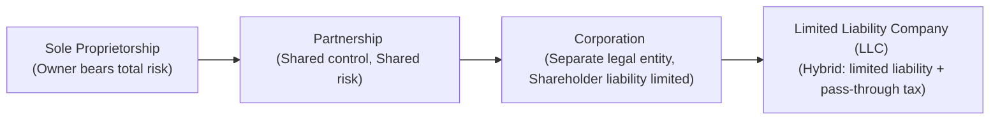

## 11.1 Legal Characteristics of Sole Proprietorships, Partnerships, Corporations, LLCs

Business structures can be as simple as one individual working independently or as complex as large corporate conglomerates. Choosing the right form of business entity is often the first step in starting and growing an organization. Each type of entity carries unique legal characteristics, liability protection, formation requirements, and tax implications. As a future CPA, understanding these differences is critical—not only for passing the REG section of the exam but also for advising clients in public accounting or private industry settings.

Below, we present a comprehensive overview of four main business entities—Sole Proprietorships, Partnerships, Corporations, and Limited Liability Companies (LLCs). We explain how they are formed, their liability protections, the legal influences of each structure, and the tax consequences that flow from those legal distinctions. This knowledge will prepare you to tackle exam questions related to business structures, while also offering vital insights for real-world application in client engagements.

Encourage yourself to connect the legal structures of businesses with the content in other parts of this text; for example, Partnerships and Corporations have special tax accounts (Chapters 20 and 21) and distinct agency relationships (Chapter 7). As you read, remain mindful of how each structure’s features integrate with broader concepts of business law, taxation, and ethics.

### Foundational Overview

Before diving into the four primary structures, it is helpful to visualize the various entities and see how they differ in liability and tax treatment:



• Sole Proprietorship: One individual owning and operating a business.  
• Partnership: Two or more individuals (or entities) carrying on a business together.  
• Corporation: A separate legal entity that protects owners (shareholders) from personal liability but can have double taxation unless an S-corporation election is made.  
• LLC: A hybrid entity offering pass-through taxation (like a partnership) and limited liability (like a corporation).  

---

### Sole Proprietorship

A sole proprietorship is typically viewed as the simplest form of business ownership. It appeals to entrepreneurs who want direct control with minimal paperwork. However, it comes with the highest risk of personal liability.

#### Liability Protection
• The owner bears full and unlimited personal liability for all business debts and obligations.  
• No formal legal shield exists between the owner’s personal assets and the business’s liabilities.  

If the business defaults on a loan or is sued by a customer, the owner’s personal assets (like a home or car) may be at risk. This lack of protection is often cited as the biggest drawback.

#### Formation Requirements
• Minimal formation requirements; often no formal paperwork is required beyond local permits and licenses.  
• A fictitious name or “doing business as” (DBA) filing may be necessary depending on state or local regulations.  
• Owners must track self-employment taxes, which can have specific compliance guidelines (discussed in Chapter 14 on Gross Income and Chapter 15 on Adjustments, Deductions, and Credits).  

Despite the simplicity, failure to follow licensing and permitting requirements can still result in fines or legal complications. The advantage is that you can quickly start (or end) a sole proprietorship with limited cost and complexity.

#### Tax Implications
• Not a separate taxable entity; all business income, losses, and deductions are reported on the owner’s individual return (Form 1040, Schedule C).  
• The proprietor pays self-employment taxes on net earnings.  
• A key advantage: Simplified bookkeeping and reporting.  
• A key disadvantage: Self-employment tax can be higher than if the same income were structured differently (e.g., in an S corporation).  

Practical Example:  
Suppose Jane opens a freelance graphic design business. She earns $50,000 net profit in her first year. She’ll report her income and expenses on Schedule C and pay both income tax and self-employment tax on the $50,000. Jane’s personal assets, including her personal bank account, remain vulnerable if she faces a lawsuit from a client disputing completed work.

---

### Partnership

A partnership forms when two or more people (or entities) engage in a for-profit business together. Partnerships commonly arise among professionals or friends who wish to pool capital, resources, and expertise. The Uniform Partnership Act (UPA) and the Revised Uniform Partnership Act (RUPA), adopted in many states, provide default governance rules when a formal partnership agreement does not exist.

#### Liability Protection
Liability depends on the type of partnership:  
• General Partnership (GP): All partners bear joint and several liability for partnership debts. Each partner’s personal assets are at risk for the actions of any or all partners taken within the scope of the business.  
• Limited Partnership (LP): Consists of at least one general partner (with unlimited liability) and one or more limited partners (with liability limited to their investment in the partnership).  
• Limited Liability Partnership (LLP): Provides a greater shield for each partner’s personal assets from mistakes or negligence of other partners but may not fully protect from one’s own negligence. 

Note: LLP regulations vary by state, and the level of liability protection can differ, especially for professional service partnerships such as law firms or accounting firms.

#### Formation Requirements
• A written partnership agreement is strongly recommended, though partnerships can be formed orally or through conduct.  
• For Limited Partnerships (LPs) or Limited Liability Partnerships (LLPs), formal registration with the state is typically required.  
• Filing with the Secretary of State’s office or an equivalent agency might be mandatory, along with fees.  
• Partnerships often draft buy-sell agreements or provisions for resolving disputes and dissolving the business, as recommended in Chapter 8 (Contracts) and Chapter 9 (Debtor-Creditor Relationships).

#### Tax Implications
• Partnerships enjoy “flow-through” (or “pass-through”) taxation. The partnership files an informational return (Form 1065), and each partner receives a K-1 statement reflecting their share of income, losses, credits, etc.  
• Partners then report these K-1 amounts on their individual tax returns (e.g., Schedule E of Form 1040).  
• No federal income tax is paid directly by the partnership entity itself, although possible filing and franchise taxes may be levied by specific states.  
• Self-employment taxes typically apply to a general partner’s share of income (subject to certain exceptions based on partnership type).  

Practical Example:  
Carlos and Mia start a marketing agency organized as an LLP. Carlos invests recurring capital, while Mia contributes intangible resources, such as her existing client list. The LLP ensures both partners have limited liability for each other’s negligence, though each still must answer for their own actions. At year-end, they prepare Form 1065, and each receives a Schedule K-1. Their personal returns capture their respective shares of income and expenses, reflecting the partnership’s pass-through nature.

---

### Corporation

A corporation is a legal entity separate from its owners (shareholders). This separation offers robust limited liability protection but involves heightened complexity, regulatory oversight, and tax nuances. Corporations can be formed at the state level by filing Articles of Incorporation.

#### Liability Protection
• Owners (shareholders) generally have no personal liability for corporate debts or obligations, beyond the amount invested in the corporation.  
• In extreme cases (e.g., fraud, certain undercapitalization scenarios), courts may “pierce the corporate veil” and hold shareholders personally liable. Such measures are discussed more in Chapter 6 (Legal Duties and Responsibilities).  

#### Formation Requirements
• Must file Articles of Incorporation with the state’s corporate division and pay associated filing fees.  
• Typically must draft bylaws, issue stock certificates to shareholders, and maintain corporate formalities (e.g., annual meetings, meeting minutes).  
• Ongoing compliance includes annual reporting, franchise taxes, and possible corporate-level taxes depending on state and local requirements.  

Shareholders elect a board of directors, which sets corporate governance policies. Directors appoint officers (CEO, CFO, etc.) who manage daily operations. Failing to follow these formalities can create liability risks for the officers and directors.

#### Tax Implications
The corporation’s federal tax treatment bifurcates typically into two categories:  
• C Corporation:  
  - Subject to entity-level taxation (File Form 1120).  
  - Potential “double taxation” occurs on corporate profits distributed to shareholders as dividends. Earnings are taxed once at the corporate rate, then again at the shareholder’s individual rate.  
  - Offers maximum flexibility in ownership but can be less tax-efficient compared to pass-through systems.  

• S Corporation (Subchapter S):  
  - An S corporation is a corporation that elects pass-through status for federal tax purposes, subject to eligibility criteria (e.g., only certain classes of stock, limited number of shareholders who must be U.S. citizens or residents).  
  - Corporate business income, losses, deductions, and credits flow through to shareholders via Schedule K-1 (Form 1120S).  
  - Potentially avoids double taxation, but is constrained by strict compliance rules for the election and operational oversight.  

Practical Example:  
Lily invests $100,000 in ABC, Inc., a C corporation that designs medical devices. Lily’s risk is limited to her $100,000 investment, assuming corporate formalities are maintained. If ABC, Inc. distributes dividends, Lily pays tax at her dividend rate, while ABC, Inc. pays corporate tax on net income at the corporate level. Should Lily and other shareholders shift strategies to pass business income directly to owners, the board might consider electing S corporation status, provided they meet ownership criteria.

---

### Limited Liability Company (LLC)

A Limited Liability Company (LLC) is a relatively modern and flexible business entity that combines the liability shield of a corporation with the pass-through taxation of a partnership. It appeals to entrepreneurs who desire limited liability but wish to avoid corporate-level taxation.

#### Liability Protection
• Members enjoy limited liability for LLC obligations, similar to corporate shareholders.  
• Courts generally respect the LLC’s separate legal status, provided the entity follows necessary formalities (adequate capitalization, separate bank accounts, etc.).  
• The term “member” is used instead of “shareholder” or “partner.”  

#### Formation Requirements
• Formation requires filing Articles of Organization (or a similarly named document) with the state.  
• An Operating Agreement, although not strictly mandatory in all jurisdictions, is strongly recommended and typically addresses key areas such as voting rights, distributions, and management.  
• LLCs may be member-managed or manager-managed, offering flexibility in governance structures.  

Compliance requirements vary by state, but usually LLCs have fewer formalities than corporations. Many states require an annual report or fee, but not necessarily annual minutes or stock issuance.

#### Tax Implications
• By default, a single-member LLC is treated as a disregarded entity for federal tax purposes. All income and expenses flow directly to the owner’s personal return (Schedule C for an individual).  
• Multi-member LLCs are typically treated as partnerships for federal tax purposes, filing Form 1065.  
• An LLC may elect to be taxed as a corporation (either C corporation or S corporation, if eligible).  
• The flexible tax classification appeals to businesses that want to customize their tax approach.  

Practical Example:  
Tim and Erica form “HLT Consulting, LLC” with each contributing half of the start-up capital. They elect the default classification as a partnership for tax purposes. They file an annual Form 1065 and distribute Schedule K-1s reflecting each member’s 50% share of profits or losses. At the same time, if HLT Consulting grows significantly, Tim and Erica might choose to be taxed as an S corporation to reduce certain self-employment tax obligations on distributions.

---

### Key Differences at a Glance

The table below summarizes some critical distinctions among these entities:

| Factor                            | Sole Proprietorship      | Partnership                          | Corporation (C or S)            | LLC                                                                      |
|-----------------------------------|--------------------------|--------------------------------------|---------------------------------|--------------------------------------------------------------------------|
| Formation                         | Minimal or none          | Formal or informal agreement          | Formal, requires incorporation   | Formal, requires Articles of Organization                                |
| Liability Protection              | None                     | Depends on type (GP vs. LP/LLP)       | Limited for shareholders         | Limited for members                                                      |
| Owner/Entity Distinction          | No separate entity       | Partnership distinct from partners    | Corporation separate from owners | LLC recognized as separate from members                                  |
| Management Structure              | Owner has full control   | Partners share control, or LP/LLP roles | Board of Directors, officers    | Member-managed or manager-managed                                        |
| Taxation                          | Pass-through, on 1040    | Pass-through, informational return    | C corp: Double taxation; S corp: Pass-through | Flexible (disregarded entity, partnership, or corp election) |
| Continuity of Existence           | Terminates upon owner’s death| Varies (GP dissolves if a general partner leaves, unless agreement states otherwise) | Perpetual existence               | Can continue despite member departures, subject to Operating Agreement   |
| Cost and Formalities              | Low, few formalities     | Medium, some formalities (especially LP/LLP) | Higher, strict formalities        | Medium, some state formalities but typically fewer than a corporation    |

---

### Real-World Considerations and Strategies

• Liability Exposure: For entrepreneurs concerned about personal assets, corporations and LLCs provide risk reduction through limited liability. Sole proprietorships or general partnerships place personal wealth at greater peril.  
• Scalability: Partnerships and sole proprietorships often best suit smaller, closely held entities. Corporations and LLCs may be more attractive for raising capital or attracting investors.  
• Control vs. Formality: If one wants absolute managerial control with minimal formal requirements, a sole proprietorship or single-member LLC might suffice. Where more robust governance or broader capital-raising is desired, a corporate framework may be ideal.  
• Tax Planning: Tax treatments differ substantially across entities. The pass-through nature of partnerships, S corporations, or LLCs might yield a single layer of taxation, but owners may owe self-employment taxes on some (or all) of the income. C corporations face double taxation but provide potential tax deferral or fringe benefit advantages.  
• Exit and Succession: Corporations generally offer strong opportunities for continuity. Shares can be sold or transferred, ensuring indefinite lifespan. Partnerships can benefit from a well-drafted partnership agreement that details buyouts or dissolution. LLCs often have operating agreements with buy-sell provisions.  

#### Example of Strategic Selection

Imagine a tech start-up with ambitious growth plans. Investors favor a structure that distills accountability and straightforward equity ownership—often a C corporation for raising venture capital. On the other hand, a small law firm might choose an LLP to protect partners from liability for each other’s malpractice. Meanwhile, an individual launching a side consulting business may find a single-member LLC the ideal blend of liability protection and pass-through taxation.

---

### Common Pitfalls

1. Failure to Maintain Formalities: Even with an LLC or corporation, commingling personal and business funds may lead to “piercing the veil,” erasing limited liability protection.  
2. Inadequate Agreements: An unwritten partnership agreement often leads to disputes and confusion about distributions, liability allocations, or dissolution.  
3. Tax Misclassifications: LLCs must be careful in choosing (or defaulting to) a tax classification. Improperly elected status can result in unexpected taxes or penalties.  
4. Neglecting Ongoing Compliance: Corporate charters, annual filings, fees, or other statutory requirements must be observed to preserve legal protection.  

---

### Practical Insights and Exam Tips

• For the CPA exam, memorize the liabilities, entity classification, and tax filing forms associated with each structure (Schedule C for sole proprietorship, Form 1065 for partnerships, Form 1120 or 1120S for corporations, default pass-through for multi-member LLCs).  
• Expect scenario-based questions: For instance, choosing which entity form best suits a group of professionals or a budding entrepreneur.  
• When focusing on tax aspects, recall pass-through vs. double taxation. Thoroughly understand how “S” status modifies corporate taxation and the eligibility requirements.  
• Corporate governance can be tested in the context of corporate formalities, board responsibilities, and possible personal liabilities for directors and officers (see Chapter 11, Section 11.3).  
• Partnerships and LLCs often appear in exam simulations for basis adjustments (see Chapter 21) and distribution rules (Chapter 20 for S corporations).  

---

### Diagram of Tax Flows

The following diagram offers a simplified illustration of how income and losses flow through (or not) for the different structures:

```mermaid
flowchart TB

    A["Sole Proprietorship <br/> (Schedule C)"]
    B["Partnership <br/> (Form 1065 → K-1 → 1040)"]
    C["Corporation (C) <br/> (Form 1120, double tax on dividends)"]
    D["S Corporation <br/> (Form 1120S → K-1 → 1040)"]
    E["LLC <br/> (Default: pass-through)"]

    style A fill:#ffffcc,stroke:#333,stroke-width:1px
    style B fill:#cfffd0,stroke:#333,stroke-width:1px
    style C fill:#ffcfcf,stroke:#333,stroke-width:1px
    style D fill:#d0fcff,stroke:#333,stroke-width:1px
    style E fill:#f0d0ff,stroke:#333,stroke-width:1px

    A -->|"Self-employed<br/>Tax & Liability| Owner
    B -->|"Partnership Income<br/>& SE Tax on Active Members| Partners
    C -->|"Corporate Tax +<br/>Shareholder Dividend Tax| Shareholders
    D -->|"Pass-Through Income<br/>Schedule K-1| Shareholders
    E -->|"Either pass-through<br/>Or elect corp status| Members
```

Explanation:  
• Sole proprietorship and single-member LLC (if not electing otherwise) funnel business income directly onto the owner’s 1040.  
• Partnerships issue K-1s to partners.  
• C corporations pay entity-level taxes; shareholders pay taxes on dividends.  
• S corporations pass through income similar to a partnership but must meet special eligibility rules.  
• LLCs can be taxed like partnerships, sole proprietorships (disregarded entities), or corporations based on filed elections.

---

### References for Further Exploration

• IRS Publication 334, “Tax Guide for Small Business,” provides additional insights on sole proprietorship taxation.  
• Chapter 9 (Debtor-Creditor Relationships) in this volume discusses how partners and owners manage financial obligations.  
• Chapter 20 (S Corporations) and Chapter 21 (Partnerships) dive deeper into tax specifics for flow-through entities.  
• State statutes on business organization—such as the Model Business Corporation Act (MBCA) and the Uniform Limited Liability Company Act (ULLCA)—provide deeper legal frameworks.  
• The Small Business Administration (SBA) website (sba.gov) offers practical resources on registering and running a business.

---

### Quiz: Test Your Knowledge of Business Structures

See below for an in-depth quiz, designed to help you solidify your understanding of the legal characteristics, liability protections, and tax implications of these entities.  

## Mastering Business Entities: Your Comprehensive Quiz for Sole Proprietorships, Partnerships, Corporations, and LLCs



### Which business structure offers the least protection from personal liability?
- [x] Sole Proprietorship
- [ ] S Corporation
- [ ] LLC
- [ ] LP (Limited Partnership General Partner)
> **Explanation:** Sole proprietors have no separation between personal and business assets and hold unlimited personal liability for business debts and obligations.

### When two individuals start a business together without any formal agreement, which entity form is usually created by default?
- [ ] Sole Proprietorship
- [x] General Partnership
- [ ] Corporation
- [ ] Limited Liability Company
> **Explanation:** In most jurisdictions, the default classification is a general partnership if two or more people engage in a for-profit enterprise without forming any other legal structure.

### Which legal structure typically faces the risk of “double taxation” at both entity and owner levels?
- [ ] Sole Proprietorship
- [ ] General Partnership
- [x] C Corporation
- [ ] Single-Member LLC (default tax classification)
> **Explanation:** C Corporations pay corporate tax on profits and then shareholders pay tax on distributed dividends, resulting in double taxation.

### Under default federal tax rules, how is a multi-member LLC classified for tax purposes?
- [ ] Disregarded Entity
- [x] Partnership
- [ ] Corporation
- [ ] S Corporation
> **Explanation:** By default, the IRS views a multi-member LLC as a partnership for tax filing (Form 1065), unless the LLC elects corporate (or S corp) tax status.

### Which of the following is NOT typically required for forming a corporation?
- [ ] Drafting bylaws
- [x] Having a partnership agreement
- [ ] Filing Articles of Incorporation
- [ ] Issuing stock
> **Explanation:** Partnerships are formed by a partnership agreement (formal or informal). Corporations have bylaws and Articles of Incorporation but do not rely on partnership agreements.

### In a limited partnership (LP), which partner(s) have personal liability for the partnership’s debts and obligations?
- [x] General partners
- [ ] Limited partners
- [ ] Neither party
- [ ] Only silent partners
> **Explanation:** At least one general partner in an LP has unlimited liability for the LP’s obligations, whereas limited partners typically only risk their capital contributions.

### What is the primary purpose of an Operating Agreement in an LLC?
- [x] It outlines the management structure, voting rights, and distribution policies.
- [ ] It ensures a business entity is taxed as an S corporation.
- [x] It helps define each member’s share of profits or losses and provides procedures for dissolution.
- [ ] It is only required if the LLC has more than three members.
> **Explanation:** While not always legally required, an Operating Agreement is strongly advised. It sets out key governance terms, membership rights, and procedures, giving clarity and reducing potential conflicts.

### In which business structure is the continuity of the entity generally unaffected by the death or withdrawal of an owner?
- [ ] Sole Proprietorship
- [ ] General Partnership
- [x] Corporation
- [ ] Single-Member LLC (default classification)
> **Explanation:** Corporations generally continue indefinitely, even if shareholders die or sell their shares, ensuring perpetual existence.

### Which entity type can elect to be taxed as a corporation or maintain pass-through taxation for federal tax purposes?
- [ ] General Partnership
- [ ] Sole Proprietorship
- [x] LLC
- [ ] S Corporation
> **Explanation:** LLCs have flexible tax classification. By default, single-member LLCs are disregarded entities, multi-member LLCs are partnerships, and either can elect corporate taxation (C or S) by filing the appropriate paperwork with the IRS.

### True or False: Shareholders in an S Corporation are automatically shielded from liability, and the entity’s income flows directly to their individual returns for tax purposes.
- [x] True
- [ ] False
> **Explanation:** S Companies are separate legal entities that provide owners liability protection like a traditional corporation, and their profits/losses pass through to shareholders, avoiding double taxation.



---

## For Additional Practice and Deeper Preparation

### [Taxation & Regulation (REG) CPA Mock Exams](https://www.udemy.com/course/reg-cpa-mock-exams/?referralCode=55419EBD198F61530B12)

Taxation & Regulation (REG) CPA Mocks: 6 Full (1,500 Qs), Harder Than Real! In-Depth & Clear. Crush With Confidence!

- Tackle full-length mock exams designed to mirror real REG questions.  
- Refine your exam-day strategies with detailed, step-by-step solutions for every scenario.  
- Explore in-depth rationales that reinforce higher-level concepts, giving you an edge on test day.  
- Boost confidence and minimize anxiety by mastering every corner of the REG blueprint.  
- Perfect for those seeking exceptionally hard mocks and real-world readiness.  

_Disclaimer: This course is not endorsed by or affiliated with the AICPA, NASBA, or any official CPA Examination authority. All content is for educational and preparatory purposes only._
