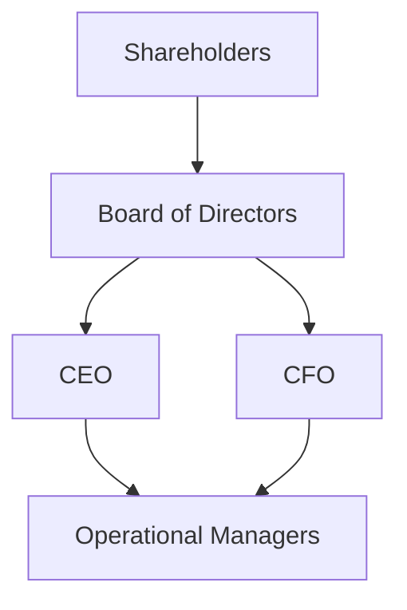

## 11.3 Rights, Duties, and Authority of Owners and Management

Owners and management within any business entity possess distinct rights and responsibilities shaped by state and federal law, organizational documents, and industry practices. This section explores how corporate bylaws, share classes, board authority, and partnership agreements define and govern the relationships, obligations, and powers of each stakeholder group. We will delve into best practices and highlight potential pitfalls across different business structures—particularly corporations and partnerships—while considering real-world scenarios and illustrative examples.

--------------------------------------------------------------------------------
### The Core Relationship Between Owners and Management

Business entities such as corporations, partnerships, and limited liability companies (LLCs) revolve around two key stakeholder groups:

• Owners: These can be shareholders (in corporations), partners (in partnerships), or members (in LLCs). Their primary function is to invest capital, participate in profit-sharing, and exert influence over major decisions.

• Managers and Directors: These are officers and/or employees entrusted with daily decision-making. In corporations, this group often consists of an elected board of directors and appointed officers. In partnerships and LLCs, the owners themselves may also serve as managers, or they may appoint or hire professional managers.

The balance of power, rights, and responsibilities between owners and management generally hinges on an entity’s governing documents (e.g., corporate bylaws or partnership agreements) and applicable statutes (e.g., state corporation codes or uniform partnership acts).

--------------------------------------------------------------------------------
### 1. Corporate Bylaws: The Foundational Governance Document

Corporate bylaws are an essential internal document that outlines a corporation’s structure, operational rules, and governance framework. They will typically specify:

• Meeting Procedures and Voting Thresholds: Bylaws determine how often shareholder meetings and board meetings are held, who may call these meetings, required notice to the participants, and how voting will be conducted (e.g., simple majority vs. supermajority).

• Election and Removal of Directors: Bylaws define nomination processes, term length, eligibility criteria, and procedures for replacing directors.

• Officer Responsibilities: Bylaws outline the roles and duties of the corporate officers, such as the Chief Executive Officer (CEO), Chief Financial Officer (CFO), and Secretary.

• Shareholder Rights and Restrictions: Bylaws explain shareholder rights to inspect records, redeem or transfer shares, and the extent of preemptive rights to maintain a specific ownership percentage.

• Amendment Processes: Procedures for changing the bylaws, typically requiring approval from both the board of directors and, in certain cases, from shareholders, must be clearly specified.

Properly crafted bylaws empower the corporation to function effectively and can minimize disputes by clarifying procedures and responsibilities. Revisiting bylaws periodically is considered a best practice to ensure alignment with evolving business strategies and changes in the law.

--------------------------------------------------------------------------------
### 2. Share Classes and Their Implications

When forming a corporation, shareholders can decide to issue different classes of stock, each carrying unique participation rights and levels of control:

1. Common Stock  
   • Typically grants voting rights.  
   • Entitled to dividends (if declared) but is subordinate to preferred stock in liquidation.  

2. Preferred Stock  
   • May have priority over common stock with respect to dividends and liquidation proceeds.  
   • Often lacks certain voting rights unless specific conditions are triggered.  
   • Can be “convertible” to common stock.  

3. Dual-Class Structures  
   • Some corporations create a Class A with enhanced voting rights and a Class B with minimal or no voting rights.  
   • Used to preserve control for founders or a small group of insiders while still raising capital publicly.  

A corporation’s articles of incorporation and bylaws will typically detail the classes of stock, associated voting rights, and restrictions. Understanding these distinctions is essential in analyzing the relative power of various shareholders to influence or direct corporate decisions.

--------------------------------------------------------------------------------
### 3. Authority of the Board of Directors

In a corporation, the board of directors wields considerable power and bears significant fiduciary responsibilities. The board’s authority generally includes:

• Strategic Oversight: Setting the corporation’s long-term vision and mission, guiding executive management, and evaluating significant transactions such as mergers or acquisitions.

• Officer Appointment and Removal: Selecting and monitoring officers who handle daily operations (CEO, CFO, etc.). Directors can remove officers if they fail to meet the corporation’s objectives or violate their duties.

• Major Financing and Capital Decisions: Approving the issuance of new shares, debt financing, stock repurchase programs, and dividend policies.

• Internal Controls: Ensuring that the organization maintains adequate internal controls, risk management policies, and ethical guidelines.

• Compliance Oversight: Monitoring accounting procedures, compliance with laws and regulations, and fulfilling reporting obligations to shareholders and regulators.

The directors act as fiduciaries for the company and must uphold the “duty of care” (making informed decisions) and the “duty of loyalty” (placing the company’s interests above personal benefit). Additionally, directors are typically shielded from personal liability for corporate obligations, assuming they act in good faith and consistent with their duties.

--------------------------------------------------------------------------------
### 4. The Role of Officers and Executive Management

Officers—such as CEOs, CFOs, and Chief Operating Officers (COOs)—are charged with executing daily operations. These roles usually stem from the directives of the board of directors. Some key responsibilities of officers include:

• Planning and Execution: Translating the board’s strategic goals into operational tasks and ensuring performance targets are met.

• Financial Accountability: Managing budgets, overseeing accounting and finance departments, and producing financial statements.

• Reporting to the Board: Presenting progress reports, risk assessments, and recommended actions to directors, keeping them apprised of material successes or challenges.

• Ensuring Compliance: Making sure the corporation sticks to taxation, labor, and industry-specific regulations, as well as obeying internal policies and procedures.

• Building and Leading Teams: Recruiting, training, and supervising employees while fostering a culture that aligns with organizational values.

Officers also owe duties of care and loyalty to the entity and must refrain from self-dealing or placing personal interests above the corporation’s welfare.

--------------------------------------------------------------------------------
### 5. Partnership Agreement Governance

In a partnership, governance pivots around the partnership agreement. This agreement:

• Outlines Ownership Interests: Specifies each partner’s capital contribution, allocation of profits and losses, and rules surrounding withdrawal of funds.

• Sets Management Responsibilities: Identifies managing partners or committees, designates decision-making processes, and addresses authority to sign contracts or bind the partnership.

• Establishes Voting Rules: Determines if decisions require unanimous consent, majority vote, or a weighted model tied to capital contributions. Additionally, certain strategic changes (e.g., merging with another partnership or dissolving the partnership) often require a unanimous vote.

• Defines Dispute Resolution Processes: Lays out procedures for conflict mediation, arbitration, or litigation.

A carefully drafted partnership agreement can save time, financial resources, and relationships by proactively addressing issues before conflicts arise. For instance, the agreement might stipulate that large expenditures need all partners’ approval, ensuring transparency and preventing unauthorized obligations.

--------------------------------------------------------------------------------
### 6. Rights of Owners Across Various Business Structures

Although each business structure carries unique dynamics, owners typically hold certain fundamental rights:

• The Right to Inspect Books and Records  
  Shareholders, partners, and members can generally inspect the organization’s financial statements, governance documents, and key contracts, subject to limitations of confidentiality or trade secrets.  

• The Right to Vote on Major Decisions  
  Owners usually vote on pivotal matters such as mergers, acquisitions, amendments to governing documents, or dissolution of the enterprise. The weight or nature of these voting rights can vary by type of stock or partnership interest.  

• The Right to Receive Distributions or Dividends  
  Owners have a claim to the entity’s retained earnings, distributed in compliance with governing documents and laws.  

• The Right to Pursue Legal Remedies for Breach of Duty  
  If management or controlling owners violate fiduciary duties or commit fraud, minority owners may have recourse in courts.  

• The Right to Transfer Ownership  
  Generally, owners can transfer their interests (subject to any restrictions set forth in bylaws or the partnership agreement, such as a right of first refusal or buy-sell provisions).

--------------------------------------------------------------------------------
### 7. Fiduciary Duties Owed by Management and Controlling Owners

1. Duty of Care  
   Directors, officers, and managers must make reasonable decisions after conducting adequate due diligence. They must attend board meetings, review relevant documents, and weigh the pros and cons of significant transactions.

2. Duty of Loyalty  
   They must prioritize the entity’s best interests over personal gain or competing external interests. Prohibited activities may include self-dealing transactions, conflicts of interest, or usurping corporate opportunities for personal benefit.

3. Duty of Good Faith  
   A subset of the duty of loyalty, it implies honesty and faithfulness to the enterprise’s mission, refraining from conscious disregard of responsibilities.

4. Duty of Confidentiality  
   Officers and directors must protect the company’s proprietary information and not disclose it to unauthorized parties or use it for personal advantage.

Breaches of these duties can expose individuals to personal liability, unless exculpated by statutory shields or indemnification provisions within governing documents. Corporate bylaws commonly include indemnification clauses, which help cover legal costs if a director is sued for actions carried out in good faith.

--------------------------------------------------------------------------------
### 8. Common Areas of Conflict and Potential Pitfalls

Despite thorough governance structures, disputes and pitfalls can arise:
1. Minority Shareholder Oppression  
   Majority shareholders may override or dilute minority interests, leading to claims of oppression or unfair treatment.
2. Deadlock in Partnerships  
   If partners hold equal voting power, a disagreement can stall decision-making, risking larger business losses.
3. Overreliance on Single Manager  
   Entrusting day-to-day operations to a single individual with insufficient oversight may lead to fraud, mismanagement, or burnout.
4. Lack of Succession Planning  
   Vague or non-existent plans for leadership transitions can trigger crises when key individuals leave or pass away.
5. Unauthorized Transactions  
   Managers who exceed their authority can expose the entity to unwanted obligations or lawsuits. Partnerships are particularly vulnerable, as any partner may bind the business unless the partnership agreement states otherwise.

--------------------------------------------------------------------------------
### 9. Practical Example: Startup Corporation with Dual Classes of Stock

Imagine a technology startup with two classes of shares, Class A (founder shares with ten-to-one voting rights) and Class B (standard voting rights). The founder, who serves as CEO, retains Class A stock to maintain decision-making control. The board of directors, tasked with broad oversight, contains three individuals, including the founder.

• Corporate Bylaws: The bylaws require quarterly board meetings and major decisions (e.g., issuing more shares) to be approved by a majority of directors.  
• Key Officers: The CEO handles overall strategy, while a CFO manages finances and budgets. Both are subject to board supervision.  
• Shareholder Rights: Investors holding Class B shares vote on essential matters, yet their combined votes have less weight relative to the founder’s Class A shares. However, they can still access books and records to ensure transparency.  

This structure ensures swift decision-making but may raise investor concerns about checks and balances on the founder’s authority. Clear delineation of rights and responsibilities in bylaws helps mitigate these risks.

--------------------------------------------------------------------------------
### 10. Practical Example: Partnership with Defined Management Roles

Consider a law firm organized as a general partnership with three partners, each holding 33.3% ownership. The partnership agreement may stipulate:

• Each partner possesses an equal vote; however, day-to-day management rotates among the partners every two years to distribute workload and gain varied perspectives.  
• Any partner can bind the partnership for ordinary transactions (e.g., purchasing supplies, hiring junior associates). For extraordinary decisions (e.g., opening a new branch, taking out loans above a certain threshold), the unanimous consent of all partners is required.  
• A buy-sell provision addresses retirement or departure, ensuring an orderly transition of ownership interests.  

By incorporating these provisions, the law firm avoids stalemates on routine decisions and implements democratic participation in larger strategic moves.  

--------------------------------------------------------------------------------
### 11. Illustration Using Mermaid.js

Below is a simplified diagram showing how governance flows in a corporation. The board of directors stands at the top to set overall strategy, the officers execute plans, and the shareholders exercise certain voting rights:

• Shareholders elect the board of directors.  
• The board hires and oversees the CEO and CFO.  
• The CEO and CFO coordinate operational management.  

--------------------------------------------------------------------------------
### 12. Best Practices for Effective Governance

1. Clearly Written Bylaws and Agreements  
   Ensure that governing documents address crucial policies and processes, including board composition, transfer restrictions, and dispute resolution.

2. Regular Review of Policies and Procedures  
   As the business evolves, revisit and update bylaws, agreements, and internal controls to reflect current regulatory demands and strategic changes.

3. Transparent Communication  
   Regularly communicate financial and operational updates to owners, fostering engagement, trust, and informed decision-making.

4. Adequate Board or Partner Oversight  
   Encourage active participation in monitoring management, ensuring checks and balances across all levels.

5. Succession and Contingency Planning  
   Establish a clear roadmap for replacing key individuals and addressing unexpected disruptions (e.g., a partner leaving or a CEO stepping down).

--------------------------------------------------------------------------------
### 13. Summary and Conclusion

The rights, duties, and authority of owners and management form the backbone of any entity’s governance structure. Corporate bylaws, share classes, and the board of directors’ authority shape the environment within corporations, while partnerships rely heavily on carefully worded agreements to guide operations. Owners, whether shareholders or partners, should understand their voting and inspection rights as well as their capacity to hold management accountable. On the other hand, managers and directors must abide by fiduciary duties, ensuring they act in the best interests of the enterprise. Together, these legal frameworks and best practices create a balanced system that promotes growth, mitigates conflict, and supports compliance with applicable laws and regulations.

--------------------------------------------------------------------------------
### References and Further Exploration

• Model Business Corporation Act (MBCA)  
• Revised Uniform Partnership Act (RUPA)  
• State Corporate Codes (e.g., Delaware General Corporation Law)  
• Corporation Bylaws: Advice and Guidance from Counsel (ABA Publications)  
• Partnership Agreements: Drafting & Negotiation Techniques (AICPA resources)  

Recommended reading and resources for deeper understanding:  
• “Principles of Corporate Governance” by the American Law Institute  
• Online courses on corporate governance best practices (e.g., Coursera, edX)  
• Legal treatises covering state-specific corporate laws  

--------------------------------------------------------------------------------

## Test Your Mastery: Rights, Duties, and Authority of Owners and Management



### During a board meeting, which key decision typically requires board approval rather than unilateral officer action?
- [ ] Day-to-day marketing strategy 
- [x] Issuance of new shares of stock 
- [ ] Hiring junior-level employees 
- [ ] Reordering office supplies  

> **Explanation:** The board of directors generally must approve major corporate actions, such as issuing new shares, to maintain oversight of the company’s capital structure.

### In a dual-class stock structure, what is the primary purpose of having different share classes?
- [x] Preserving voting control for certain shareholders 
- [ ] Reducing the corporation’s overall risk level 
- [ ] Guaranteeing preemptive rights to partner-level owners 
- [ ] Ensuring the board of directors also serves as shareholders  

> **Explanation:** Dual-class structures typically give founders or significant stakeholders (e.g., Class A shares) enhanced voting rights, ensuring continued control even if additional equity is raised.

### Which of the following is most likely to be specified in the corporate bylaws?
- [x] The process for amending corporate governance procedures 
- [ ] The daily work schedule of employees 
- [ ] Personal investment rules for each shareholder 
- [ ] Specific exchange listing requirements  

> **Explanation:** Corporate bylaws provide the internal framework for governance, including amendment procedures, board election processes, and other structural matters.

### Under the duty of loyalty, an officer of a corporation must:
- [ ] Prioritize personal interests over the corporation’s interests 
- [x] Avert conflicts of interest and refrain from self-dealing 
- [ ] Ensure employees are paid above market salaries 
- [ ] Vote according to the preferences of major shareholders  

> **Explanation:** The duty of loyalty compels officers and directors to prioritize the well-being of the corporation and to avoid transactions that benefit themselves at the expense of the entity.

### In a general partnership, what mechanism helps govern authority and prevent individual partners from overstepping their bounds?
- [x] A clearly written partnership agreement 
- [ ] Sole reliance on trust among partners  
- [x] Unanimous consent for major decisions 
- [ ] A corporate-style board of directors  

> **Explanation:** Because each partner can bind the business, a partnership agreement detailing consent thresholds and dividing management duties is essential. Many partnerships also require unanimous or majority approval for significant actions.

### By default, under most state laws, when can shareholders inspect corporate books and records?
- [x] Whenever they have a proper purpose  
- [ ] Only at the annual meeting 
- [ ] Never, unless they own more than 50% of the shares 
- [ ] Only with a court order  

> **Explanation:** Shareholders usually have the right to inspect certain corporate records upon showing a proper purpose (e.g., evaluating management performance). Statutes safeguard this right while also protecting the corporation from frivolous or malicious requests.

### Which issue commonly leads to minority oppression claims in closely held corporations?
- [x] Excessively high salaries for majority-owner managers
- [ ] Lack of a corporate seal 
- [x] Board elections with no unanimous results 
- [ ] Continuous disclosure of trade secrets  

> **Explanation:** Majority shareholders sometimes pay themselves or their associates disproportionately high compensation, reducing distributions available to minority owners. This can lead to minority oppression claims.

### What is the main role of the board of directors regarding corporate officers?
- [x] Hiring and overseeing officers to ensure strategic objectives are met 
- [ ] Micromanaging the daily tasks of each employee 
- [ ] Conducting employee performance reviews at all company levels  
- [ ] Eliminating all business risks  

> **Explanation:** The board shoulders responsibility for appointing (and potentially removing) officers, providing strategic oversight, and ensuring officers act in the corporation’s best interests.

### Which of the following partnership provisions would likely require unanimous approval?
- [x] Merging with another partnership 
- [ ] Ordering office supplies 
- [ ] Modifying an employee handbook 
- [ ] Promoting a junior employee to senior associate  

> **Explanation:** While day-to-day decisions are typically within normal authority thresholds, major structural changes such as mergers often require unanimous partner consent.

### True or False: A well-structured partnership agreement can outline voting mechanisms that allow for a weighted model based on capital contributions.
- [x] True
- [ ] False

> **Explanation:** Many partnership agreements specify voting rights according to each partner’s capital contribution, granting those who invest more capital a proportionately greater say in significant decisions.



--------------------------------------------------------------------------------

## For Additional Practice and Deeper Preparation

### [Taxation & Regulation (REG) CPA Mock Exams](https://www.udemy.com/course/reg-cpa-mock-exams/?referralCode=55419EBD198F61530B12)

Taxation & Regulation (REG) CPA Mocks: 6 Full (1,500 Qs), Harder Than Real! In-Depth & Clear. Crush With Confidence!

- Tackle full-length mock exams designed to mirror real REG questions.  
- Refine your exam-day strategies with detailed, step-by-step solutions for every scenario.  
- Explore in-depth rationales that reinforce higher-level concepts, giving you an edge on test day.  
- Boost confidence and minimize anxiety by mastering every corner of the REG blueprint.  
- Perfect for those seeking exceptionally hard mocks and real-world readiness.

_Disclaimer: This course is not endorsed by or affiliated with the AICPA, NASBA, or any official CPA Examination authority. All content is for educational and preparatory purposes only._
