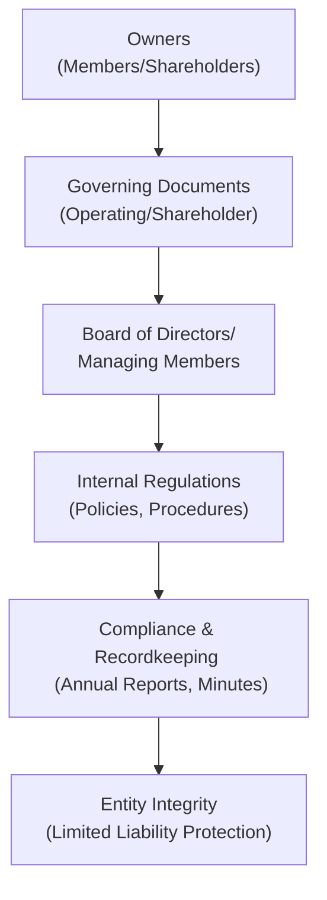
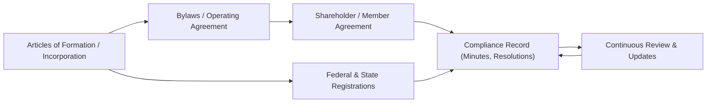

## 11.4 Governing Documents, Internal Regulations, and Compliance

Governing documents serve as the foundational blueprint for how a business entity is structured, managed, and regulated. Whether you are operating a sole proprietorship, partnership, limited liability company (LLC), S corporation, C corporation, or even a not-for-profit organization, you must adhere to specific legal frameworks and maintain proper internal regulations. Failure to do so can result in costly litigation, management disputes, and, in severe cases, the loss of limited liability protection or tax benefits.

This section explores three primary elements of effective governance protocols: (1) operating agreements in LLCs, (2) shareholder agreements in corporations, and (3) recordkeeping obligations across different structures. Through examples, diagrams, and detailed analysis, this chapter will provide insight into best practices for maintaining compliance and ensuring smooth organizational operations.

---

### The Importance of Governing Documents

Governing documents define rights, responsibilities, and expectations of all stakeholders within an entity. They outline decision-making processes, capital contributions, fiduciary duties, tax elections, and procedures for resolving disputes. Strong, tailored governing documents reduce ambiguity, foster operational success, and mitigate legal and financial risks.

Key reasons for creating robust governing documents include:
• Clarification of roles and responsibilities.  
• Prevention and resolution of conflicts among owners or managers.  
• Protection of limited liability status for corporate shareholders and LLC members.  
• Proactive compliance with federal, state, and local legal requirements.  
• Guidance on dissolutions, mergers, acquisitions, and other structural changes.  

---

### Operating Agreements for LLCs

An LLC’s operating agreement is a legal contract that governs the internal management of the company. Although not always mandated by every state, having a written operating agreement is considered a best practice to clearly define member roles, profit-sharing ratios, governance structure, and other essential operational aspects.

#### Key Provisions in Operating Agreements

• Membership Interests and Contributions:  
  – Determination of member capital contributions (monetary or in-kind).  
  – Allocation of profits, losses, and associated distributions.  

• Management and Voting Rights:  
  – Manager-managed vs. member-managed framework.  
  – Voting thresholds for major decisions (e.g., admission of new members, dissolution).  

• Transferability of Membership Interests:  
  – Definition of restrictions or conditions (right of first refusal, buy-sell clauses).  
  – Trigger events (e.g., death, bankruptcy, incapacity of a member).  

• Fiduciary Duties and Non-Compete Clauses:  
  – Scope and limits of managerial or member fiduciary duties.  
  – Prohibition against competitive business interests among members.  

• Dissolution Provisions:  
  – Guidelines on voluntary or involuntary dissolution.  
  – Distribution of remaining capital upon dissolution or liquidation.  

#### Example: Single-Member vs. Multi-Member LLC
• Single-Member: A single-member LLC operating agreement primarily functions to clarify the distinction between the entity and its sole owner for liability and tax purposes.  
• Multi-Member: A multi-member LLC operating agreement clarifies ownership percentages, voting rights, profit allocation, managerial roles, and exit strategies for multiple owners.

---

### Shareholder Agreements for Corporations

Whereas an LLC’s operating agreement guides members, corporations rely on shareholder agreements (sometimes in conjunction with corporate bylaws) to outline the relationship among shareholders and the board of directors. This agreement defines how voting power is exercised, how shares are transferred, and what mechanisms exist for raising external capital or removing a director.

#### Comparing Shareholder Agreements vs. Corporate Bylaws

While corporate bylaws typically cover the broad management rules, a shareholder agreement delves deeper into the nuances of shareholder relationships. Together, these documents ensure a corporation has:

• A consistent method for electing and removing directors.  
• Specific approaches to issuing more shares or diluting existing shareholdings.  
• Procedures for maintaining corporate formalities (annual meetings, quorum for significant decisions).  
• Options for minority shareholder protections and rights (tag-along, drag-along clauses).  

By combining strong bylaws with a clear shareholder agreement, corporations reduce the risk of shareholder disputes and ensure alignment between investor interests and the corporate governance structure.

#### Example: Protecting Minority Shareholders
A typical shareholder agreement might include provisions granting minority shareholders certain veto powers or guaranteed board representation. Such protections reduce potential conflicts and encourage minority shareholders to invest more confidently.

---

### Recordkeeping Obligations

Maintaining accurate and up-to-date records is a cornerstone of good governance and regulatory compliance. Proper recordkeeping obligations extend beyond just tax documentation; it includes maintaining corporate meeting minutes, written consents, shareholder/member agreements, stock ledgers, and other essential corporate documents.

#### Why Recordkeeping Matters

1. **Legal Compliance**: Many states require corporate and LLC recordkeeping, such as annual reports, meeting minutes, and notices of special meetings.  
2. **Limited Liability Protection**: If an entity cannot demonstrate compliance with corporate formalities, courts may “pierce the corporate veil,” exposing shareholders or members to personal liability.  
3. **Tax Requirements**: The IRS requires that businesses maintain accurate financial statements and documentation supporting deductions, capital investments, and employee expenses.  
4. **Decision Tracking**: Annual or special meeting minutes serve as a historical record of significant organizational decisions and executive or shareholder approvals.  

#### Basic Recordkeeping Checklist

Below is a sample checklist illustrating common records businesses should maintain:

| Record Type                      | Purpose                                                 | Frequency of Update              |
|---------------------------------|---------------------------------------------------------|----------------------------------|
| Articles of Incorporation/Formation | Legal entity creation; filed with Secretary of State    | Created once, updated if amended |
| Bylaws/Operating Agreement       | Internal governance procedures                           | Created once, updated as needed  |
| Meeting Minutes (Annual and Special)  | Documentation of strategic decisions and approvals     | After each meeting/event         |
| Shareholder/Member Agreements   | Details equity ownership and rights                     | Maintained continuously          |
| Stock/Ownership Ledger          | Tracking of equity issuances and transfers              | Updated upon any transaction     |
| Financial Records (General Ledger, Bank Statements) | Compliance with federal and state tax laws          | Monthly or quarterly reviews     |
| Licensing and Permits           | Business-specific compliance requirements               | Renewed per license regulations  |
| Contracts (Vendor, Client, Partner) | Legal relationships, obligations, and responsibilities  | Maintained per contract changes  |

---

### Internal Regulations and Practical Compliance Measures

Beyond drafting formal governance documents, businesses must also implement internal regulations—day-to-day processes and policies that bring the aforementioned agreements to life. These policies often address operational ethics, conflict of interest disclosures, compensation, hiring practices, and broader compliance frameworks.

#### Common Internal Regulations

• **Whistleblower and Ethics Policies**: Encourage ethical behavior and preserve corporate reputation.  
• **Anti-Harassment and Discrimination**: Alignment with federal and state employment laws.  
• **Data Privacy and Security**: Adoption of policies to protect customer and employee data.  
• **Financial Controls**: Segregation of duties, approval thresholds, and monitoring systems to prevent fraud.  

When well executed, internal regulations reduce risk and align management practices with the overarching goals of the entity.  

---

### Visualizing Governance Structure

The following Mermaid diagram illustrates a generic governance structure, showcasing how governing documents, owners, boards, and compliance intersect.

**Explanation**:  
• Owners create the governing documents to define roles and responsibilities.  
• The board or managing members then implement internal regulations.  
• These are enforced through compliance and recordkeeping measures.  
• Proper execution of these steps contributes to overall entity integrity and protection.

---

### Case Study: Avoiding Corporate Veil Piercing through Proper Document Maintenance

Consider a small tech startup that is structured as a C corporation. Its founders fail to hold annual meetings or record them, do not maintain updated bylaws, and consistently pay personal expenses from the corporate account without formal documentation. When a lawsuit arises due to a product defect, the court finds that the corporation was essentially treated as an “alter ego” of its owners, and the corporate veil is pierced. The founders become personally liable for corporate debts.

Had the founders maintained clear, documented formalities—such as holding annual meetings with proper minutes, adhering to bylaws, and maintaining separate bank accounts—the corporation’s separate existence could have been upheld, protecting the founders from personal liability.

---

### Common Pitfalls and Best Practices

1. **Pitfall**: Relying on Generic Templates  
   – **Best Practice**: Customize operating and shareholder agreements to address specific issues relating to your industry, jurisdiction, and ownership structure.

2. **Pitfall**: Failing to Update Documents Regularly  
   – **Best Practice**: Develop a schedule to review critical documents (annually or when undergoing major changes, such as adding new shareholders or altering capital structures).

3. **Pitfall**: Mixing Personal and Business Finances  
   – **Best Practice**: Maintain separate bank accounts and financial records. Always uphold the entity’s separate status.

4. **Pitfall**: Not Tracking Major Decisions in Writing  
   – **Best Practice**: Record key events (hiring executives, entering large contracts) in official minutes or resolutions to maintain compliance and clarity.

5. **Pitfall**: Overlooking State-Specific Requirements  
   – **Best Practice**: Stay vigilant about local law variations—what is permissible or required in one state may differ in another.

---

### Strategies for Ensuring Ongoing Compliance

• **Periodic Legal Audits**: Engage external counsel or in-house legal teams to review governing documents and corporate records.  
• **Annual Tax Check-Ins**: Coordinate with CPA or tax advisors to ensure accurate and up-to-date financial records, especially if expansions occur in new jurisdictions.  
• **Cloud-Based Document Management**: Store essential documentation securely online to facilitate easy retrieval, revisions, and retention compliance.  
• **Formal Training for Managers and Directors**: Provide onboarding and refresher sessions about governance, ethics, and compliance requirements to all decision-makers.  

---

### Additional Resources

To expand your understanding of governing documents, internal controls, and compliance obligations, consider exploring:

• The IRS’s “Starting a Business” portal for general federal compliance guidelines:  
  – https://www.irs.gov/businesses/small-businesses-self-employed/starting-a-business  
• State-specific Secretary of State websites for formation and recordkeeping requirements.  
• The Model Business Corporation Act (MBCA) or the Uniform Limited Liability Company Act (ULLCA) for legislative frameworks.  
• AICPA’s “Code of Professional Conduct” for ethical considerations in financial recordkeeping.  

---

## Governing Documents and Compliance Knowledge Check

Below is a quick summary diagram that underscores how different documents interact and why they are integral to your enterprise’s success.

---

## Mastery Through Practical Application

Comprehensive understanding of governance documents and internal regulations protects business owners, preserves investor confidence, and ensures you are well-positioned to avoid legal pitfalls. Dedicating resources to crafting and reviewing these documents may initially seem time-consuming, but the long-term benefits—ranging from smoother operations to reduced personal liability—make it an indispensable investment.

---

## Test Your Governance & Compliance Expertise



### Which of the following describes the primary purpose of an LLC operating agreement?

- [ ] To replace the corporation’s bylaws.
- [x] To outline the rights, responsibilities, and distribution of profits among LLC members.
- [ ] To create an additional layer of regulatory paperwork for limited partnerships.
- [ ] To satisfy annual reporting requirements with the Internal Revenue Service (IRS).

> **Explanation:** An operating agreement defines member roles, distributions, voting rights, and overall operational structures for LLCs.  

### Which key document focuses on shareholders’ rights, share transfer restrictions, and voting structures in a corporation?

- [ ] Corporate charter
- [x] Shareholder agreement
- [ ] Limited partnership agreement
- [ ] SEC registration statement

> **Explanation:** While corporate bylaws govern broader operational matters, a shareholder agreement more specifically addresses shareholders’ relationships and rights.  

### Which of the following is a common pitfall related to corporate recordkeeping?

- [ ] Maintaining a separate bank account for the business  
- [x] Failing to document major decisions and meetings in writing  
- [ ] Keeping particular contracts in locked filing cabinets  
- [ ] Performing periodic administrative audits

> **Explanation:** Not documenting critical decisions, especially in meeting minutes, is a major detail many small businesses overlook, jeopardizing corporate veil protection.  

### In a multi-member LLC, what critical feature is most likely detailed in the operating agreement?

- [x] Management structure and voting thresholds
- [ ] Redemption privileges for preferred stock
- [ ] Minority shareholder anti-dilution rights
- [ ] Dividend distribution schedule

> **Explanation:** Multi-member LLC operating agreements define how the entity is managed (member-managed or manager-managed) and establish the framework for owner decision-making.  

### What is one potential outcome if a court “pierces the corporate veil”?

- [x] Shareholders or members may be personally liable for corporate debts.
- [ ] The corporation gains limited liability for personal actions of owners.
- [x] Owners receive tax-exempt status for future transactions.
- [ ] The entity must refile Articles of Incorporation but remains protected.

> **Explanation:** Veil piercing means that courts disregard the corporation’s (or LLC’s) separate legal existence, exposing owners to personal liability.  

### What is a strong reason to keep annual meeting minutes and other written consents?

- [x] To demonstrate adherence to corporate formalities and preserve liability protection
- [ ] To provide additional personal tax benefits to members or shareholders
- [ ] To avoid paying the corporate franchise tax at the state level
- [ ] To allow owners to transfer business losses to personal returns

> **Explanation:** Maintaining documented minutes and written consents helps illustrate that the entity is abiding by corporate formalities, a core requirement for preserving limited liability.  

### Which document typically addresses the availability of stock sale options and pre-emptive rights for current shareholders?

- [ ] Partnership Agreement
- [ ] Operating Agreement
- [x] Shareholder Agreement
- [ ] Articles of Incorporation

> **Explanation:** A shareholder agreement details how existing shareholders can purchase or transfer shares, including pre-emptive rights.  

### When a business co-mingles personal and corporate finances:

- [ ] It immediately results in a successful corporate veil claim for the owners.
- [x] There is a risk of losing limited liability protection if challenged in court.
- [ ] The IRS automatically increases scrutiny of personal account activity.
- [ ] It eliminates the need for annual corporate resolutions.

> **Explanation:** Mixing personal and corporate assets can be cited as evidence that the corporation is an “alter ego” of its owners, risking veil piercing.  

### Why might a shareholder agreement include a “right of first refusal” clause?

- [x] To ensure existing shareholders have an opportunity to purchase shares before outside parties
- [ ] To provide protection against trade secret infringement
- [ ] To automatically convert debt instruments into equity
- [ ] To allow the board to adjourn meetings without notice

> **Explanation:** A right of first refusal protects existing shareholders by permitting them to buy additional shares on the same terms offered to prospective investors.  

### True or False: A single-member LLC does not need an operating agreement because there is only one owner.

- [x] True
- [ ] False

> **Explanation:** While not always required by law, single-member LLCs benefit significantly from having an operating agreement to demonstrate separation of the LLC from the owner, strengthening the liability shield.  



---

## For Additional Practice and Deeper Preparation

### [Taxation & Regulation (REG) CPA Mock Exams](https://www.udemy.com/course/reg-cpa-mock-exams/?referralCode=55419EBD198F61530B12)

**Taxation & Regulation (REG) CPA Mocks:** 6 Full (1,500 Qs), Harder Than Real! In-Depth & Clear. Crush With Confidence!

- Tackle full-length mock exams designed to mirror real REG questions.  
- Refine your exam-day strategies with detailed, step-by-step solutions for every scenario.  
- Explore in-depth rationales that reinforce higher-level concepts, giving you an edge on test day.  
- Boost confidence and minimize anxiety by mastering every corner of the REG blueprint.  
- Perfect for those seeking exceptionally hard mocks and real-world readiness.  

_Disclaimer: This course is not endorsed by or affiliated with the AICPA, NASBA, or any official CPA Examination authority. All content is for educational and preparatory purposes only._
