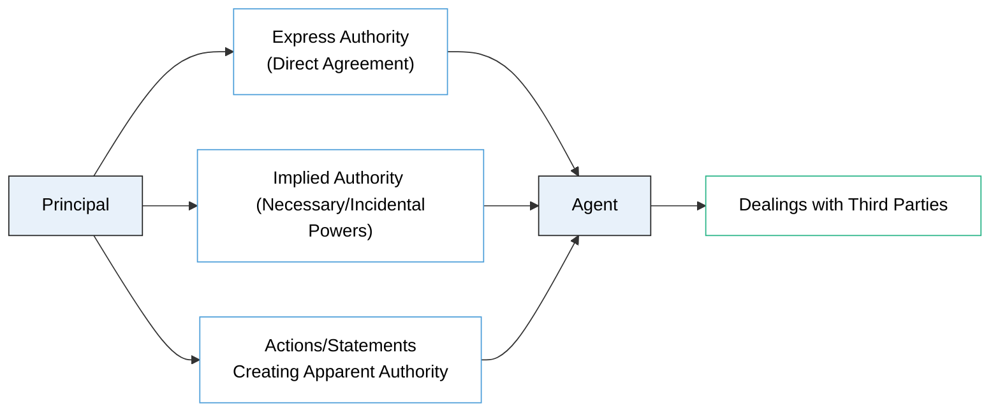

## 7.1 Formation and Types of Agency Relationships

Agency law is a foundational component of business law and significantly influences professional practice, particularly for CPAs who handle engagements involving contractual arrangements, liability exposures, and client representation. At its core, an agency relationship enables one party (the “agent”) to take actions that legally bind another party (the “principal”). Below, we examine essential principles related to agency formation, types of agency relationships (including express, implied, and apparent authority), and the key legal and practical considerations that guide these arrangements.

---

### Overview of Principal-Agent Relationships

A principal-agent relationship is created when a principal authorizes an agent to act on their behalf in dealings with third parties. Once formed, the agency relationship obligates the principal to honor agreements, transactions, and legal commitments made by the agent within the scope of the agent’s authority. Similarly, agents assume certain fiduciary duties to their principals, most notably loyalty and care. Understanding how these relationships begin and the types of authority conferred is crucial for legal compliance, effective governance, and mitigating risk.

Key elements of a valid principal-agent relationship often include:  
• Mutual Consent: Both principal and agent must voluntarily consent to the relationship.  
• Control: The principal has the right to control the agent’s actions.  
• Purpose: The agent’s actions must be undertaken for the benefit of the principal.  

It is not always necessary for an agency relationship to be formalized in writing (although some statutes may require a written agreement). Agency may exist based on behavior, communication, and other contextual factors that show the parties’ intent.

---

### Importance to CPA Examination Candidates

CPA candidates should master the key aspects of agency law because business law concepts are tested in the Regulation (REG) section of the Uniform CPA Examination. Agency relationships intersect with contracts, torts, and liability principles. For instance, the agent’s authority might determine whether a contract is binding on a corporation or whether an individual partner can commit a partnership to a loan. Understanding these concepts will also reinforce strategies for limiting exposure to malpractice claims and ensuring compliance in various professional engagements (refer to Chapters 3 and 6 for additional references on ethics, responsibilities, and legal duties).

---

### Distinguishing Express, Implied, and Apparent Authority

Authority is the crux of an agency relationship; it defines the agent’s rights and powers to bind the principal. While we often think of “authority” as an explicit, well-drafted document or contract, agency law recognizes multiple ways by which authority may arise.

#### Express Authority
Express authority is explicitly conferred upon an agent by the principal, typically through written or oral agreements. This authority is straightforward to identify because the principal unequivocally states what the agent can (and sometimes cannot) do on their behalf.

• Example: A homeowner gives written instructions to a realtor granting the realtor the power to list the house for sale at a specified price. The homeowner is the principal, and the realtor is the agent with express authority to conduct real estate listing activities.  

Express authority is typically articulated in engagement letters, contracts, partnership agreements, or corporate resolutions. The clarity of written instructions helps avoid confusion regarding the scope of the agent’s activities.

#### Implied Authority
Implied authority extends from express authority and is based on the agent’s reasonable belief that certain actions are necessary to accomplish the objectives that the principal assigned. While not directly articulated, implied authority often flows from industry customs, status, or from typical business practices.

• Example: A principal gives an agent express authority to manage a factory’s supply chain. Though the contract does not say the agent can negotiate shipping prices, the agent reasonably concludes they have implied authority to negotiate such terms to carry out their express authority to keep production flowing.

Implied authority can emerge from a job title, from necessity, or from circumstances where failing to exercise certain powers would obstruct the agent’s primary functions. This concept is pivotal for CPAs and controllers who have “implied authority” to undertake financial and operational tasks necessary for fulfilling their fiduciary duties.

#### Apparent Authority (and the Doctrine of Estoppel)
Apparent authority arises when the principal’s words or actions lead a third party to believe that the agent has authority—even if the principal and the agent never explicitly established such authority. Under the legal principle of estoppel, if the principal creates an impression that an individual is their agent, the principal can be bound by that individual’s actions if a third party relied on that representation.

• Example: A manager in a corporate office introduces a former employee as the company’s “top negotiator.” Even though that individual no longer works for the company, their statement could create apparent authority if a third party reasonably believes the introduction is valid. The company could be obliged to honor deals made by the so-called “negotiator.”

Apparent authority underscores the significance of carefully managing public representations, job titles, and employee transitions. A misstep in communication, such as failing to update clients about an employee’s departure, may trigger unintended and costly legal ramifications.

---

### Agency Formation: Methods and Requirements

**By Agreement:** The most typical way to form an agency relationship is via contract (written or oral). Both parties consent—one to act on another’s behalf, and the other to delegate a scope of authority. This arrangement is generally subject to the same requirements for a valid contract: offer, acceptance, consideration, and the absence of any statutory or common law limitations.

**By Ratification:** Even if an agent acts without proper authority, the principal can retrospectively approve or “ratify” the act. Once the principal ratifies that act, the transaction is treated as if the agent possessed the authority at the time. Ratification can be explicit or implied (for instance, when a principal knowingly accepts the benefits of the unauthorized transaction).

**By Operation of Law:** In special cases—such as an emergency where immediate decisions are required to protect the principal’s interests—an agency relationship can be created by operation of law. For example, if a hotel manager (agent) is away, an assistant manager might have the legal authority to manage an urgent expense to protect business property from imminent damage, even if that level of spending was not explicitly sanctioned.

---

### Fiduciary Nature: Duties Owed by Agent and Principal

Although the institutional structure of an agency relationship focuses on authority, underlying this arrangement is a fiduciary bond. Fiduciary duties obligate agents to act in the principal’s best interest, avoid conflicts of interest, maintain confidentiality, and exercise reasonable care and skill.

1. Duty of Loyalty: The agent must not secretly profit from the principal’s business or engage in activities adverse to the principal’s interests.  
2. Duty of Care: The agent must exercise competence and diligence that a reasonably prudent person would use in similar circumstances.  
3. Duty of Notification: The agent must keep the principal informed of all material facts affecting the principal’s interests.  
4. Duty to Follow Instructions: The agent should follow the principal’s lawful instructions.  
5. Duty of Accounting: The agent should accurately account for all money and property received or disbursed on behalf of the principal.

Conversely, the principal also has duties to the agent:  
• Duty to Compensate (if applicable).  
• Duty to Reimburse and Indemnify for authorized expenses and liabilities incurred.  
• Duty to Cooperate so that the agent can fulfill their responsibilities.  

Professionals, including CPAs, who act in an agency capacity for their clients must pay particular attention to these fiduciary obligations. A breach could lead to malpractice issues (see Chapter 6).

---

### Practical Examples and Case Studies

#### Case Study 1: Express Authority in Real Estate Negotiations
A small business owner (the principal) grants a commercial real estate broker (the agent) express authority to negotiate a five-year lease on a new office building. The broker explicitly outlines the maximum rent per square foot they can agree upon, as well as other conditions such as renewal options. Because these parameters are set in writing, the broker’s authority is clearly defined. If the broker negotiates a higher rate than authorized, the principal might refuse to honor the contract—or choose to ratify it.

#### Case Study 2: Implied Authority in a Beverage Distribution Company
A distribution manager (the agent) is responsible for ensuring continuous stock levels of a popular soft drink. While the principal has not explicitly stated that the manager can secure storage waivers or short-term warehousing solutions, such arrangements are implied if they are necessary to keep the supply chain running. If local ordinances require special storage approvals and the manager obtains them, that act may be deemed within the agent’s implied authority.

#### Case Study 3: Apparent Authority in a Tech Startup
A tech startup’s founder (the principal) is frequently seen at public events with their “operations consultant,” giving updates about the company’s strategic moves. The founder’s statements—“they’re running the operations side for us”—could create an impression among venture capitalists that the consultant can finalize partnership agreements. Even if the consultant’s actual authority is limited to preparing internal operational schedules, the repeated public statements might lead prospective partners to rely on the consultant’s signature or assurances. If those partners proceed in good faith, the founder could be bound by the consultant’s actions under apparent authority.

---

### Potential Pitfalls and Best Practices

Forming and maintaining an agency relationship can trigger various legal and financial risks. Below are some critical pitfalls and best practices to help avoid unintended liabilities:

• Insufficient Documentation: Relying purely on oral agreements or ambiguous communications can lead to disputes over the scope of authority. ► Best Practice: Create clear contracts or engagement letters specifying the agent’s duties and limits of authority.

• Unclear Job Titles and Public Representations: Overly broad or misleading titles may inadvertently create apparent authority. ► Best Practice: Maintain accurate organizational charts and notify clients promptly when an employee’s role changes or they leave the company.

• Scope Creep in Implied Authority: Agents might assume tasks beyond the principal’s expectations. ► Best Practice: Regularly review the agent’s responsibilities, and if needed, update instructions or provide clarifications in writing.

• Failure to Communicate: Principals who do not promptly update agents on material changes, or agents who do not disclose critical facts to principals, can cause major legal or financial exposure. ► Best Practice: Establish a consistent reporting mechanism and document important decisions.

• Not Recognizing Ratification Risks: Principals sometimes inadvertently ratify unauthorized acts by accepting benefits (e.g., using funds obtained through an unauthorized loan). ► Best Practice: Promptly examine the actions of agents and decide whether to reject or accept those actions in writing.

By following these best practices, CPAs and other professionals minimize misunderstandings and reduce the likelihood of litigation stemming from unauthorized or improperly documented activities.

---

### Visualizing Agency Formation and Authority

Below is a Mermaid diagram illustrating how authority structures interconnect in an agency relationship:

As shown:  
• The principal intentionally grants express authority.  
• Implied authority constructs the “in-between” space—actions necessary to fulfill express instructions.  
• Statements creating apparent authority may lead a third party to bind the principal.

---

### Relevance to Other Chapters

Understanding the formation of an agency relationship lays the foundation for deeper exploration of **7.2 Authority of Agents and Principals (Actual, Apparent, Ratification)** and **7.3 Duties and Liabilities of Agents and Principals**. Subsequent sections will discuss how an agent’s actions can bind or expose the principal to liabilities and how duties like loyalty, obedience, and confidentiality interplay with corporate governance, contract law, and tort law. Additionally, concepts found here will dovetail with discussions in **Chapter 8: Contracts**, as agents often negotiate or finalize contractual relationships on behalf of principals.

---

### References for Further Exploration

• **Restatement (Third) of Agency** – A definitive source on modern agency law principles.  
• **Uniform Commercial Code (UCC)**, particularly on how agency relationships interact with commerce, sales, and negotiable instruments.  
• **State-specific statutes** – Certain states have unique requirements for real estate agents or other professionals.  
• **American Institute of Certified Public Accountants (AICPA) Ethics Codifications**, which detail the professional responsibilities CPAs must maintain, especially in fiduciary contexts.  
• [Securities and Exchange Commission (SEC)](https://www.sec.gov/) – Provides guidelines and enforcement actions relevant to agents acting within publicly traded corporations.  

---

## Quiz: Mastering Agency Formation



### Which of the following best describes express authority?
- [x] Authority explicitly granted by the principal, usually in writing or verbally.  
- [ ] Authority inferred from the agent’s job title or role in an organization.  
- [ ] Authority believed by a third party based on the principal’s representations.  
- [ ] Authority that automatically arises by operation of law.  

> **Explanation:** Express authority exists when the principal directly states (either orally or in writing) what actions the agent can take.  

### Under implied authority, an agent can:
- [x] Perform tasks reasonably necessary to carry out express authority.  
- [ ] Only act in ways explicitly permitted by the principal’s written contract.  
- [x] Undertake customary or incidental tasks essential to achieving the principal’s goals.  
- [ ] Have no obligations to seek the principal’s approval before making decisions.  

> **Explanation:** Implied authority exists to fill in gaps so that the agent can perform tasks necessary to achieve the principal’s express directives. This authority is not explicitly spelled out but flows naturally from the scope of the agent’s role.  

### Apparent authority primarily arises from:
- [x] Statements or actions by the principal that cause third parties to believe the agent is authorized.  
- [ ] The agent’s personal belief they have authority.  
- [ ] The principal’s private instructions to the agent.  
- [ ] Any legal documentation that explicitly defines agency terms.  

> **Explanation:** Apparent authority forms when a principal creates an impression that an agent is empowered, prompting a third party to rely on that representation in good faith.  

### Which of the following is usually required to establish an agency relationship?
- [x] Mutual consent, where the principal grants power and the agent accepts.  
- [ ] A formal signed contract under seal.  
- [ ] Monetary compensation or salary.  
- [ ] Registration with a government agency.  

> **Explanation:** While different jurisdictions have nuances, the universal requirement is that both parties must voluntarily agree that the agent will act on behalf of, and under the control of, the principal.  

### The duty of loyalty entails that an agent:
- [x] Must not usurp business opportunities that belong to the principal.  
- [ ] May disregard confidentiality obligations if it benefits the agent personally.  
- [x] Must act solely in the principal’s interest without conflicts of interest.  
- [ ] Could legally engage in competing ventures while representing the principal.  

> **Explanation:** The duty of loyalty prohibits agents from prioritizing personal gain over the principal’s best interests.  

### When might an agent have authority by operation of law?
- [x] In emergencies that require immediate action to protect the principal’s interests.  
- [ ] When the principal revokes all express authority.  
- [ ] In a scenario where neither the principal nor agent can be identified.  
- [ ] If the agent has a written contract in place and does not need formal consent.  

> **Explanation:** Authority by operation of law is rare but occurs in critical situations where time-sensitive action is needed, and the principal cannot be contacted.  

### Ratification of an unauthorized act occurs when:
- [x] The principal accepts or approves the agent’s act after the fact.  
- [ ] The court invalidates the agreement between the principal and the agent.  
- [x] The principal knows the agent acted beyond their authority and chooses to be bound by it.  
- [ ] The third party revokes the original contract.  

> **Explanation:** Ratification validates an initially unauthorized act, binding the principal once they indicate approval or benefit from it.  

### Which statement is correct regarding express and implied authority?
- [x] Implied authority stems from the express authority, allowing the agent to perform necessary tasks to fulfill stated objectives.  
- [ ] Express authority always includes discretionary actions outside the principal’s explicit instructions.  
- [ ] Implied authority never overlaps with express authority.  
- [ ] Implied authority is identical to apparent authority.  

> **Explanation:** Implied authority is an extension of express authority, permitting the agent to do what is necessary or incidental to achieve the principal’s explicitly stated goals.  

### Apparent authority can bind the principal when:
- [x] The principal’s words or conduct lead a third party to believe the agent is authorized, and the third party relies on this belief.  
- [ ] The agent intentionally misrepresents their authority without the principal’s knowledge.  
- [ ] A hidden corporate policy grants no authority, but the agent proceeds anyway.  
- [ ] The principal never interacts with the agent in a public setting.  

> **Explanation:** Apparent authority is rooted in the principal’s representations, whether deliberate or inadvertent, which cause the third party to rely on the notion that the agent is authorized.  

### True or False: In an agency relationship, the agent always bears personal liability for contracts they enter on the principal’s behalf.
- [x] False  
- [ ] True  

> **Explanation:** Generally, if the agent acts within the scope of their authority and discloses the principal, liability for the contract rests with the principal, not the agent.  



---

## For Additional Practice and Deeper Preparation

### [Taxation & Regulation (REG) CPA Mock Exams](https://www.udemy.com/course/reg-cpa-mock-exams/?referralCode=55419EBD198F61530B12)

Taxation & Regulation (REG) CPA Mocks: 6 Full (1,500 Qs), Harder Than Real! In-Depth & Clear. Crush With Confidence!

- Tackle full-length mock exams designed to mirror real REG questions.  
- Refine your exam-day strategies with detailed, step-by-step solutions for every scenario.  
- Explore in-depth rationales that reinforce higher-level concepts, giving you an edge on test day.  
- Boost confidence and minimize anxiety by mastering every corner of the REG blueprint.  
- Perfect for those seeking exceptionally hard mocks and real-world readiness.  

_Disclaimer: This course is not endorsed by or affiliated with the AICPA, NASBA, or any official CPA Examination authority. All content is for educational and preparatory purposes only._
