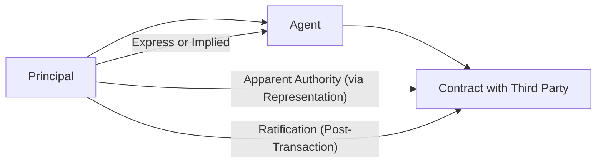

## 7.2 Authority of Agents and Principals (Actual, Apparent, Ratification)

In any business environment, the actions of agents on behalf of principals can generate binding commitments, obligations, and legal consequences. Understanding how authority is created and recognized is essential for accountants, auditors, and business professionals—particularly those preparing for the CPA Exam’s Business Law content within the Regulation (REG) section. This chapter covers three primary types of authority: actual authority (express and implied), apparent authority, and authority by ratification.

Whether you represent clients, serve as an internal advisor in a company, or aspire to become a CPA, grasping these concepts is crucial to properly advising on contracts, liability disputes, and third-party claim cases.

--------------------------------------------------------------------------------

### Importance of Agency Authority

The nature of the agency relationship carries significant legal consequences for both the principal and the agent. Principals rely on agents to conduct transactions on their behalf, enter into contracts, and sometimes even make decisions that can bind the principals financially and legally. The key question in each instance is whether the agent acted within his or her authority—be it actual, apparent, or ratified.

From an exam perspective, authority issues often revolve around:
1. Determining whether an agent had legitimate power to act.  
2. Evaluating if the principal bears responsibility for unauthorized acts.  
3. Understanding the role of third parties who may rely on the appearance of authority.  

Keep in mind that agency law is shaped by common law principles and statutory guidelines, such as those found in the Restatement (Third) of Agency. These standards help define the rights and obligations of all parties involved, providing structured tests for establishing or denying liability.

--------------------------------------------------------------------------------

### Defining an Agency Relationship

An agency relationship typically arises when a principal grants an agent the power to act on behalf of the principal. This relationship can be created by:

- A formal written agreement (power of attorney).  
- An informal agreement or conduct demonstrating mutual consent.  
- Subsequent ratification of the agent’s initially unauthorized act.

In general, the principal is held liable for acts committed by the agent within the scope of the agent’s authority. By contrast, if the agent acts outside the scope of authority, the principal may disclaim liability—unless other doctrines, like apparent authority or ratification, apply.

--------------------------------------------------------------------------------

### Forms of Authority

#### Actual Authority

Actual authority arises when the principal directly grants the agent the power to act. This falls under two further categories:

1. **Express Authority:** Authority explicitly granted through oral or written communication.  
2. **Implied Authority:** All powers deemed necessary or incidental to fulfill the expressly granted authority.  

#### Apparent Authority

Apparent authority emerges when a third party reasonably believes, based on a principal’s statements or conduct, that the agent has authority to act—even if such authority has not been expressly or implicitly granted.  

#### Ratification

Ratification occurs when a principal, upon learning about an agent’s unauthorized act, decides to affirm or accept the benefits of that act. This retroactive acceptance effectively places the agent’s act within the principal’s scope of authority, making the principal liable.

--------------------------------------------------------------------------------

### Actual Authority: Express and Implied

#### Express Authority

Express authority is the clearest form of authority—often in the form of a direct written or oral instruction. For example, a CEO might tell an employee, “Negotiate and sign the lease for our new warehouse.” The employee’s power is explicit in carrying out that directive. In the CPA context, express authority might manifest in powers of attorney, engagement letters, or direct instructions from a client to a CPA for filing taxes, making regulatory submissions, or negotiating with the Internal Revenue Service (IRS).

Key aspects of express authority include:
- It often appears in documented contracts (e.g., a power of attorney).
- It must be obeyed and performed within the specified scope.
- A third party dealing with the agent can rely significantly on the agent’s express authority unless circumstances raise doubts about authenticity.

#### Implied Authority

Implied authority arises from the reasonable inferences an agent derives from an express grant of authority. If the agent is instructed to complete a certain task, implied authority covers all steps normally necessary to achieve that goal. For instance, if a company appoints a purchasing manager to acquire raw materials, that manager has implied authority to negotiate quantity discounts, coordinate shipping arrangements, or manage other details typically associated with procurement operations.

Key considerations for implied authority:
- The authority is confined to acts incidental or necessary to carry out the express authority.
- Activities covered by custom or industry practice also typically fit under implied authority.
- If an act strays beyond what is customary or necessary, it may not be considered implied authority.  

--------------------------------------------------------------------------------

### Apparent Authority

Apparent authority is a critical concept because it creates legally binding obligations for the principal even without explicit or implicit delegation. Apparent authority arises from a principal’s representations—direct or indirect—that lead a third party to believe reasonably that the agent is authorized to act.

#### Elements of Apparent Authority

1. **Representation by the Principal:** The principal’s actions or communications (or in some cases, omissions) must enable the agent to appear authorized. For example, if a principal regularly allows an employee to make large purchases, a supplier might justifiably infer that the employee has authority to place such orders.  
2. **Reasonable Reliance by a Third Party:** The third party must rely on what they perceive as the agent’s authority. If the third party has reason to question that authority (e.g., contradictory statements by the principal), reliance may not be reasonable.  
3. **Change in Third Party’s Position:** The third party often must have acted upon their belief—possibly by entering into a contract or providing products/services—creating a legally binding transaction.

From an exam perspective, remember that the principal can be bound by an agent’s actions even if the agent lacked actual authority, so long as the above components are met. This underscores the importance for principals to communicate clearly with third parties and manage how agents present themselves in business dealings.

--------------------------------------------------------------------------------

### Authority by Ratification

Ratification allows a principal to become bound by an agent’s unauthorized act if the principal later approves or accepts the benefits of the transaction. This concept effectively backdates the agent’s authority to the time of the initial act—treating it as if the agent acted with full authority from the start.

#### Requirements for Ratification

1. **Knowledge:** The principal must have full knowledge of all material facts pertaining to the agent’s act.  
2. **Intent to Ratify:** The principal must perform an intentional act affirming or accepting the transaction. This could be an explicit approval or an implied acceptance (e.g., retaining benefits from the contract).  
3. **Capacity:** The principal must have the legal capacity to execute the contract or transaction. If they were incompetent or non-existent at the time of the transaction, they cannot ratify retroactively.  
4. **Timely Action:** Ratification should occur within a reasonable time before the third party withdraws or circumstances materially change.

#### Impact of Ratification

Ratification transforms an initially unauthorized act into a valid one, binding the principal as though the agent had the necessary authority from the beginning. For instance, if an agent, without authority, purchases office equipment on the principal’s behalf, the principal could still confirm the purchase after-the-fact and thus be held responsible for the payment obligation.

--------------------------------------------------------------------------------

### Comparing Actual, Apparent, and Ratified Authority

Below is a helpful summary table distinguishing these three main types of authority:

| Type      | How Authority Arises                       | Principal’s Liability                        |
|-----------|--------------------------------------------|---------------------------------------------|
| Actual    | Granted directly by the principal, through express or implied means. | Principal is bound if the agent acted within the scope of authority, as specifically delegated or implied. |
| Apparent  | Created by the principal’s representations that cause a third party to believe the agent is authorized. | Principal is bound if a third party’s reliance was reasonable, even if the agent lacked real authority.  |
| Ratification | The principal, upon learning about an unauthorized act, approves it or accepts its benefits. | Principal is bound retroactively, as if the agent had proper authority from the outset. |

--------------------------------------------------------------------------------

### Practical Examples and Case Studies

1. **Express Authority – Lease Agreement**  
   - Scenario: A principal tells a real estate agent, “Find us a new office space in Midtown and sign a three-year lease if it’s under $25 per square foot.”  
   - Result: The agent has express authority to negotiate and sign the lease under those specified terms. Any contract within that rent threshold binds the principal.

2. **Implied Authority – Corporate Purchasing**  
   - Scenario: A food manufacturer hires a purchasing manager to order raw materials. The manager, with no explicit instructions, arranges standard shipping contracts and obtains short-term financing for inventory from recognized vendors.  
   - Result: These additional steps are within the scope of implied authority, as they are necessary or customary for fulfilling purchasing duties.

3. **Apparent Authority – Lavish Office Space**  
   - Scenario: A principal’s vice president has never been instructed to lease properties, but the company’s website and organizational chart describe the individual as “Director of Operations.” The vice president meets with a property owner, who sees that official title, and signs an office lease.  
   - Result: If the property owner reasonably believed the vice president had authority to act (based on the principal’s representations of the role), the principal could be held liable through apparent authority—even if the principal never expressly authorized the deal.

4. **Ratification – Unexpected Purchase**  
   - Scenario: An agent, without telling the principal, purchases new laboratory equipment for the company. The principal later learns about the purchase and sells products produced with the new equipment, reaping the benefit of improved productivity.  
   - Result: By retaining the benefits and not objecting, the principal effectively ratifies the unauthorized act, incurring full liability for the purchase.

--------------------------------------------------------------------------------

### Diagram of Agency Authority

Below is a simple Mermaid diagram illustrating how an agent’s authority can stem from different sources and how a principal’s actions or acceptance can bind or validate the agent’s dealings.

- The lines from “Principal” to both “Agent” and “Contract with Third Party” show how authority can be derived either directly (express/implied) or indirectly (apparent authority).  
- The arrow labeled “Ratification (Post-Transaction)” points from “Principal” to the contract, indicating that the principal can bind themselves to a contract the agent entered into without authority by affirming it after the fact.

--------------------------------------------------------------------------------

### Common Pitfalls and Best Practices

- **Pitfall:** Principals failing to monitor how agents present themselves. If third parties reasonably perceive the agent to have expanded authority, the principal is often bound under apparent authority.  
- **Pitfall:** Agents misunderstanding or exceeding their implied authority, leading to liabilities that surprise principals.  
- **Pitfall:** Principals remaining silent or accepting benefits from an agent’s unauthorized action, inadvertently ratifying a transaction.  

- **Best Practice:** Principals should clearly define an agent’s scope of authority in agreements or instructions, reducing ambiguity.  
- **Best Practice:** If a principal detects an agent might be overstepping authority, immediate notice to third parties can prevent apparent authority claims.  
- **Best Practice:** Where an agent’s authority is revoked or changed, principals should update relevant third parties promptly.

--------------------------------------------------------------------------------

### Key Takeaways

1. **Actual Authority**: Focuses on what the principal and agent have explicitly or implicitly agreed upon.  
2. **Apparent Authority**: Centers on third-party perceptions and the principal’s representations, binding the principal even without the principal’s direct grant of power.  
3. **Ratification**: Retroactively binds a principal to an otherwise unauthorized act, provided the principal has full knowledge of the material facts and decides to accept the contract’s benefits.

Understanding these distinctions is paramount for avoiding unintended legal obligations and safeguarding the principal’s interests. As a CPA candidate, mastery of authority issues will prepare you for questions concerning common law business structures, contractual liability, and the broader law of agency concepts as tested in the Regulation section of the CPA Exam.

--------------------------------------------------------------------------------

### References and Further Exploration

- Restatement (Third) of Agency  
- Uniform Commercial Code (UCC), especially for transactions involving sales, security interests, and other commercial dealings  
- Richard D. Freer & Douglas K. Moll, “Principles of Business Organizations” (textbook covering agency law fundamentals)  
- For additional case studies and practice questions, consult AICPA-released Regulation section sample exams and business law case anthologies.

--------------------------------------------------------------------------------

## Quiz on Authority of Agents and Principals



### Which of the following best describes express authority?
- [ ] Authority recognized based on third-party perceptions.  
- [x] Authority created by explicit, written or oral instructions from the principal.  
- [ ] Authority that arises after the principal learns of an unauthorized act.  
- [ ] Authority to complete tasks that are customary or necessary to perform an express directive.  

> **Explanation:** Express authority is clearly and specifically granted by the principal through direct statements, whether written or spoken.

### Which of the following is typically necessary for implied authority to exist?
- [ ] A principal’s explicit statement granting the authority in writing.  
- [ ] A contract that explicitly disavows any responsibilities of the agent.  
- [x] Any actions reasonably necessary to fulfill express authority or follow industry custom.  
- [ ] Direct approval by a court of law recognizing the agent’s powers.  

> **Explanation:** Implied authority arises from the reasonable necessity or customary steps required to fulfill express authority.

### What is the key factor in determining apparent authority?
- [x] The principal’s representations or conduct that lead a third party to reasonably believe the agent is authorized.  
- [ ] Actual statements made by the agent to the third party.  
- [ ] Specific language in the agent’s employment contract clarifying the agent’s scope.  
- [ ] Proof of prior transactions between the agent and the third party.  

> **Explanation:** In apparent authority situations, the principal’s behavior is crucial. A third party must reasonably believe the agent has authority based on the principal’s actions, words, or omissions.

### In the context of actual authority, which scenario would most likely be considered implied authority?
- [x] Purchasing standard office supplies necessary for daily operations, when the agent has been instructed to manage the office.  
- [ ] Signing a lease well beyond the budget that the principal approved.  
- [ ] Committing the principal to a personal loan for the agent’s benefit.  
- [ ] Entering into internationally binding agreements without the principal’s knowledge.  

> **Explanation:** Implied authority includes all acts that are necessary or incidental to fulfilling an expressly stated duty (e.g., managing an office).

### Apparent authority generally requires which of the following elements?
- [x] Representations by the principal, reasonable reliance by the third party, and the third party’s change of position.  
- [ ] An oral contract between the agent and the third party, along with notary certification.  
- [x] Evidence of the principal’s knowledge and acceptance of the transaction.  
- [ ] A new state law that helps interpret the agent’s authority broadly.  

> **Explanation:** Apparent authority commonly involves (1) some form of principal representation, (2) reasonable reliance, and (3) a resultant transaction or changed position by the third party.

### Which statement correctly describes authority by ratification?
- [ ] The agent confirms the principal’s authority to third parties.  
- [x] The principal approves an act that was originally unauthorized, thus becoming bound retroactively.  
- [ ] The third party eliminates all liability for the principal.  
- [ ] The agent unilaterally decides to revise a contract’s terms post-signing.  

> **Explanation:** Ratification involves the principal’s approval of an agent’s initially unauthorized act, resulting in a retroactive grant of authority.

### Which of the following scenarios would most likely lead to the principal being bound by an agent’s actions under apparent authority?
- [x] A supervisor frequently drafts purchase orders on company letterhead, causing vendors to believe she can sign on behalf of the business.  
- [ ] An employee takes office supplies home without telling anyone.  
- [x] A manager signs a contract while on vacation without any official company documents.  
- [ ] The principal obtains an injunction to block all new contracts.  

> **Explanation:** Apparent authority arises when the principal’s conduct or the surrounding circumstances provide a reasonable basis for third parties to believe the agent is authorized to act.

### Which of the following statements is true about implied authority?
- [x] It is authority to do what is necessary or customary for carrying out express instructions.  
- [ ] It is based on third-party assumptions not supported by any principal action.  
- [ ] It cannot exist alongside express authority.  
- [ ] It only arises after a principal decides to ratify an agent’s actions.  

> **Explanation:** Implied authority flows naturally from express authority, enabling an agent to do what is required or typical to accomplish the assigned task.

### If a principal learns of an unauthorized contract entered into by an agent and chooses to keep its benefits, what has the principal likely done?
- [x] Ratified the agent’s act.  
- [ ] Revoked the agent’s authority.  
- [ ] Claimed that the agent exceeded implied authority.  
- [ ] Asserted that no principal-agent relationship existed.  

> **Explanation:** By accepting the benefits of an unauthorized transaction, the principal effectively ratifies and validates the agent’s initially unauthorized act.

### Ratification can only be effective when the principal:
- [x] Had the capacity to enter into the transaction at the time the transaction was made.  
- [ ] Delegates implied authority before the unauthorized transaction.  
- [ ] Provides the agent with new actual authority that predates the act.  
- [ ] Instructs the third party to sue the agent for damages.  

> **Explanation:** One of the conditions for valid ratification is that the principal must have possessed the capacity to enter the contract (or transaction) at the time the agent committed the unauthorized act.



--------------------------------------------------------------------------------

## For Additional Practice and Deeper Preparation

### [Taxation & Regulation (REG) CPA Mock Exams](https://www.udemy.com/course/reg-cpa-mock-exams/?referralCode=55419EBD198F61530B12)

**Taxation & Regulation (REG) CPA Mocks:** 6 Full (1,500 Qs), Harder Than Real! In-Depth & Clear. Crush With Confidence!

- Tackle full-length mock exams designed to mirror real REG questions.  
- Refine your exam-day strategies with detailed, step-by-step solutions for every scenario.  
- Explore in-depth rationales that reinforce higher-level concepts, giving you an edge on test day.  
- Boost confidence and minimize anxiety by mastering every corner of the REG blueprint.  
- Perfect for those seeking exceptionally hard mocks and real-world readiness.  

_Disclaimer: This course is not endorsed by or affiliated with the AICPA, NASBA, or any official CPA Examination authority. All content is for educational and preparatory purposes only._
