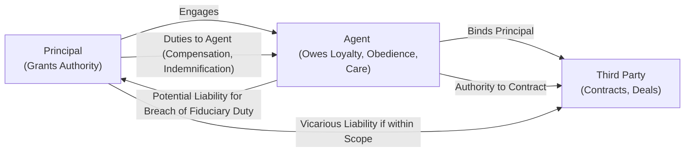

## 7.3 Duties and Liabilities of Agents and Principals

Effective agency relationships hinge on a clear understanding of the respective rights, obligations, and potential liabilities of both principals and agents. Fiduciary duties—such as loyalty, obedience, and due care—form the cornerstone of the agent’s responsibilities to the principal. Conversely, the principal must provide adequate support, compensation, and indemnification, ensuring that the agent can perform their tasks effectively. In this section, we will unpack the essential fiduciary duties owed by agents, discuss the principal’s counter-duties, and illustrate potential remedies when these obligations are breached. We will also explore real-world examples, best practices, and strategic considerations relevant to CPA candidates preparing for the Uniform CPA Examination (REG Section).

Any references to legal, financial, or professional standards are intended for educational purposes only. Always seek expert advice for specific applications.

--------------------------------------------------------------------------------
### Overview of the Principal-Agent Relationship

Before diving into the specific duties and liabilities, it is helpful to contextualize agency relationships:

• An agency relationship arises when one party (the principal) delegates authority to another (the agent) to act on the principal’s behalf.  
• The agent possesses significant power to affect the principal’s legal position—e.g., by entering into contracts or incurring obligations.  
• The relationship is generally created by mutual agreement, but the form of agreement need not always be written (unless mandated by specific statutes, such as real estate or other regulated industries).  

Because the agent can bind the principal in legal and financial matters, law imposes upon the agent a series of fiduciary duties designed to protect the principal’s interests. These duties also guide the behavior of both parties to ensure fair dealings with third parties and compliance with broader legal principles.

--------------------------------------------------------------------------------
### Key Fiduciary Duties of Agents

Agents owe “fiduciary duties” to their principals, meaning they must act with high standards of integrity, loyalty, and responsibility when dealing with the principal’s business. The most commonly cited fiduciary duties include:

#### 1. Duty of Loyalty
The duty of loyalty obligates the agent to place the principal’s interests above all others—particularly the agent’s own interests—when acting on the principal’s behalf. This includes:

• Avoiding Conflicts of Interest: The agent must not engage in any transaction or relationship where the agent’s personal interests conflict with the principal’s objectives.  
• Refraining from Self-Dealing: The agent cannot profit at the principal’s expense without the principal’s informed consent.  
• Maintaining Confidentiality: The agent must safeguard the principal’s confidential information, trade secrets, and privileged data.  

Example:  
An insurance broker hired to place coverage for a large corporation must seek the best possible insurance terms for that corporation. If the broker instead arranges a policy that yields a higher commission but is disadvantageous to the corporation’s risk profile, the broker violates the duty of loyalty.

#### 2. Duty of Obedience
Agents are required to follow lawful instructions given by the principal. This means:

• Strict Adherence to Instructions: If the principal instructs the agent to follow a specific course of action (provided the instruction is legal), the agent must act accordingly.  
• Compliance with Governing Documents and Agreements: The agent should not deviate from the principal’s expressed directives (e.g., corporate policy manuals, written agreements).  

Example:  
A real estate agent representing a client in a commercial property purchase must follow the client’s specific instructions regarding offers and counteroffers. If the client explicitly states a price ceiling, the agent should not exceed it without obtaining consent.

#### 3. Duty of Care (“Duty to Act with Reasonable Care and Skill”)
The agent is expected to act with reasonable diligence, competence, and prudence in performing agency tasks. This entails:

• Exercising Specialized Skills: If the agent holds themselves out as having particular expertise (e.g., an attorney, accountant, or professional consultant), the agent must demonstrate the level of care and skill usually exercised by those in that profession or trade.  
• Avoiding Negligence: The agent must refrain from careless conduct that could harm the principal’s interests or property.  
• Updating Knowledge and Skills: Agents should remain informed about relevant changes in law, industry trends, or best practices affecting the principal’s affairs.  

Example:  
A financial advisor who underestimates market risks for a client’s investment portfolio could breach the duty of care if prudent industry standards would have dictated a more conservative approach.

#### Additional Fiduciary Duties
While loyalty, obedience, and care are the most prominent duties, additional sub-duties often arise:

• Duty of Disclosure: The agent must keep the principal reasonably informed of any material information that affects the principal’s interests or decisions.  
• Duty of Accounting: The agent must accurately account for all funds, property, or transactions handled on behalf of the principal.  

Failure to adhere to these duties can subject agents to liability, both to the principal and, in some cases, to third parties who suffer harm as a consequence of the agent’s wrongful acts.

--------------------------------------------------------------------------------
### Principal’s Duties to the Agent

Although the agent is the fiduciary in the relationship, principals also have an obligation to act in good faith toward their agents:

• Duty to Compensate: Unless the agency is gratuitous (unpaid), the principal must remunerate the agent for services rendered.  
• Duty to Reimburse and Indemnify: The principal must reimburse the agent for expenses incurred while executing authorized acts, and indemnify (defend and hold harmless) the agent for any losses or liabilities arising from lawful acts undertaken in the scope of the agency.  
• Duty to Cooperate: The principal must not interfere with the agent’s performance and must provide the necessary means, tools, and resources to accomplish the assigned tasks.  

When a principal fails to meet these obligations, the agent may seek legal remedies—such as suing for unpaid compensation or damages resulting from the principal’s failure to indemnify.

--------------------------------------------------------------------------------
### Liability in Agency Relationships

An essential component of agency law is determining who bears responsibility for wrongful acts or contractual breaches. Liability can extend in various ways:

• Principal’s Liability to Third Parties: A principal is typically liable for contracts entered into by an agent acting with actual or apparent authority.  
• Agent’s Liability to Third Parties: Agents may be liable when they exceed their authority, misrepresent their authority, or personally guarantee transactions.  
• Tort Liability: Under the doctrine of “respondeat superior,” an employer-principal is generally responsible for the torts committed by an employee-agent acting within the scope of employment. However, an independent contractor-agent arrangement may limit principal liability, except where the principal retains significant control over the agent’s activities or a statutory rule declares otherwise.  

These rules can become complex in multi-layered corporate structures, especially where the same individual may be an agent for multiple principals. Ensuring clarity in authority boundaries and disclosure to third parties is crucial to minimize liability risk.

--------------------------------------------------------------------------------
### Remedies for Breach of Fiduciary Duty

When an agent breaches a fiduciary duty, the principal may seek various remedies. These remedies can be equitable or legal, depending on the nature and extent of the breach:

1. Monetary Damages:  
   • Compensatory Damages: Cover the principal’s actual losses resulting from the breach.  
   • Punitive Damages: May be awarded if the agent’s actions were reckless, willful, or fraudulent.

2. Constructive Trust:  
   • If the agent acquires property or other benefits through the use of the principal’s information or resources (in breach of loyalty), the principal can request that such benefits be held in a constructive trust for the principal’s benefit.

3. Disgorgement of Profits:  
   • An agent who improperly profits from the agency relationship may be required to forfeit all unauthorized gains, even if the principal did not suffer direct monetary loss.

4. Rescission of Contracts:  
   • If the agent’s breach taints a transaction, the principal may rescind (void) the contract if equitable circumstances allow.

5. Injunctive Relief:  
   • A court may order the agent to cease certain actions—e.g., misusing trade secrets, disclosing confidential information—if the breach is ongoing or imminent.

Example of Remedies Scenario:  
A principal discovers that her agent diverted a key business opportunity to a competing company in exchange for a secret commission. The principal can bring a claim for compensatory damages (lost opportunity), disgorgement of any secret profit the agent received, and possibly injunctive relief to prevent the agent from continuing to solicit business on behalf of the competitor.

--------------------------------------------------------------------------------
### Best Practices to Mitigate Risks

Both principals and agents should implement safeguards to reduce the likelihood of fiduciary breaches and misunderstandings concerning authority:

• Clear Engagement Letters and Contracts: Outline scope of authority, compensation terms, and duties of every party.  
• Ongoing Communication: Frequent updates between principal and agent ensure alignment of goals and compliance with instructions.  
• Regular Training and Oversight: Agents acting in specialized fields (banking, insurance, or accounting) should receive continued education on legal, regulatory, and professional updates.  
• Compliance with Entity Policies: Agents should be aware of internal controls and compliance protocols (e.g., Sarbanes-Oxley rules for certain entities, or formal codes of conduct).  
• Document Everything: Detailed documentation is invaluable for demonstrating adherence to fiduciary obligations in the event of a dispute or audit.

--------------------------------------------------------------------------------
### Real-World Scenario: Agency in a Manufacturing Company

Consider a large manufacturing firm where the plant manager is appointed as an agent for the firm. The manager’s authority extends to ordering new raw materials, overseeing contractors, and supervising employees. Over time, the manager accepts bribes from a certain supplier, favoring them for lucrative raw material contracts despite inferior quality or higher costs. This conduct breaches the duty of loyalty. Once the wrongdoing is discovered, the firm can pursue rescission of ongoing contracts with that supplier (if performed in bad faith), seek compensatory damages for any cost overruns or defects, and request disgorgement of the bribes. If the manager is also a partial owner of the supplier, further liability might be imposed for self-dealing and fraud.

--------------------------------------------------------------------------------
### Diagram: Agency Duties and Liabilities Overview

Below is a simple Mermaid diagram to illustrate the flow of authority and duties between principal and agent, along with possible liability to third parties:

Explanation of Diagram:

• The Principal delegates authority to the Agent.  
• The Agent owes fiduciary obligations (loyalty, obedience, care) to the Principal.  
• Acting within the scope of that authority, the Agent binds the Principal in contracts with the Third Party.  
• If the Agent breaches a fiduciary duty, the Agent faces potential liability to the Principal; if an employee-agent commits a tort within the scope of employment, the Principal may face vicarious liability to the Third Party.

--------------------------------------------------------------------------------
### Strategic Considerations for CPA Exam Candidates

• Agency issues intersect with numerous legal concepts, including contracts, torts, and business structures.  
• Understanding how fiduciary duties operate in practice can help in analyzing hypothetical disputes and legal problem scenarios on the REG exam.  
• Be mindful of the heightened standards that apply to professionals—such as accountants—who often serve as agents in specialized contexts.  
• In a tax context, an accountant’s or CPA’s role as a “tax return preparer” triggers legal responsibilities under Circular 230, AICPA guidelines, and potential civil/criminal penalties for breach.  
• Familiarizing yourself with typical remedies—such as damages, constructive trusts, and rescission—equips you to evaluate possible outcomes on both scenario-based simulations and multiple-choice questions.

--------------------------------------------------------------------------------
### References for Further Reading

• Restatement (Third) of Agency – Provides a detailed legal framework for agency law in the United States.  
• AICPA Code of Professional Conduct – Though directed at CPAs, many standards align with general fiduciary principles regarding honesty, integrity, and avoidance of conflicts of interest.  
• [IRS Treasury Circular 230](https://www.irs.gov/tax-professionals/circular-230-tax-professionals) – Governs practice before the IRS; relevant when an agent is acting as a tax preparer or representative.  
• State-Specific Agency Statutes – Always review local law to confirm foundational agency principles and any specific variances.

--------------------------------------------------------------------------------
## SEO-Optimized Quiz: Fiduciary Duties and Principal-Agent Liabilities



### Understanding the Duty of Loyalty
- [x] It requires the agent to put the principal’s interests above their own.
- [ ] It only applies when the agent is operating under actual authority.
- [ ] It is satisfied if the agent simply discloses a conflict of interest.
- [ ] It is a duty imposed only upon principals, not agents.

> **Explanation:** The duty of loyalty is a fundamental fiduciary requirement that obligates agents to prioritize the principal’s interests over any personal gain or external conflicts.

### Remedies for Breach of Fiduciary Duty
- [x] A principal may seize any secret profits the agent obtained.
- [ ] Only specific performance is available.
- [x] The principal can rescind a tainted transaction.
- [ ] There is no remedy for an unintentional breach.

> **Explanation:** The principal can pursue multiple remedies, including disgorgement of profits, rescission of contracts, and damages. The law enforces high standards on agents even if breaches are inadvertent.

### Principal’s Duty to Indemnify
- [x] The principal must cover losses incurred by the agent acting lawfully within the scope of authority.
- [ ] The principal must cover all losses of the agent, regardless of scope.
- [ ] The principal only covers intentional torts by the agent.
- [ ] Indemnification is optional for the principal.

> **Explanation:** The principal’s duty to indemnify includes reimbursing the agent for expenses and liabilities sustained while following lawful instructions within the agent’s authorized scope.

### Agent’s Duty of Obedience
- [x] Requires following lawful instructions from the principal.
- [ ] Implies no exceptions or considerations for industry standards.
- [ ] Is nullified if the agent disagrees with the instructions.
- [ ] Only applies in written agency agreements.

> **Explanation:** The agent must act within the lawful boundaries set by the principal. The duty of obedience persists regardless of an agent’s subjective disagreements, as long as the instructions are lawful.

### Examples of the Duty of Care
- [x] Conducting beneficial negotiations for the principal’s best interest.
- [ ] Placing personal considerations above the principal’s instructions.
- [x] Exercising prudence and competence in specialized tasks.
- [ ] Remaining silent about critical market changes that affect the principal.

> **Explanation:** The duty of care mandates diligence, skill, and vigilance. Agents must not ignore important facts or procedures when representing the principal.

### Principal’s Vicarious Liability
- [x] Principals are typically liable for torts committed by employee-agents within the scope of employment.
- [ ] Principals are never liable for the acts of independent contractors.
- [ ] Only the agent is liable for contracts made within apparent authority.
- [ ] Vicarious liability is synonymous with constructive trust.

> **Explanation:** Under respondeat superior, an employer-principal is generally held liable for the negligent acts of an employee-agent if those acts occur within the scope of employment.

### Constructive Trust
- [x] A legal remedy that may require the agent to hold property in trust for the principal.
- [ ] A principal’s promise to maintain confidentiality for the agent.
- [x] Enforced when the agent acquires assets in breach of loyalty.
- [ ] A tort remedy that automatically compensates third parties.

> **Explanation:** A constructive trust is an equitable remedy ensuring that any unjust enrichment gained by the agent due to a breach of fiduciary duty is surrendered to the principal.

### Disgorgement of Profits
- [x] Forces the agent to return gains obtained in violation of fiduciary duties.
- [ ] Is only available if the principal suffers a direct loss.
- [ ] Requires proof beyond a reasonable doubt.
- [ ] Is unrelated to breach of loyalty cases.

> **Explanation:** Disgorgement removes any benefit the agent wrongfully gained, even if the principal cannot demonstrate a direct financial loss.

### Scope of Authority
- [x] Determines whether the principal is bound by the agent’s actions.
- [ ] Is irrelevant to third-party liability.
- [ ] Eliminates an agent’s duty of loyalty.
- [ ] Cannot be altered or revoked once established.

> **Explanation:** The agent’s scope of authority—actual, apparent, or implied—governs the extent to which the principal is legally bound by the agent’s actions.

### True or False: An agent always owes a duty of loyalty, even in an unpaid agency relationship.
- [x] True
- [ ] False

> **Explanation:** Fiduciary duties, including loyalty, apply to agents regardless of compensation arrangements. A gratuitous agent is still obligated to act in the principal’s best interest.



--------------------------------------------------------------------------------

## For Additional Practice and Deeper Preparation

### [Taxation & Regulation (REG) CPA Mock Exams](https://www.udemy.com/course/reg-cpa-mock-exams/?referralCode=55419EBD198F61530B12)

Taxation & Regulation (REG) CPA Mocks: 6 Full (1,500 Qs), Harder Than Real! In-Depth & Clear. Crush With Confidence!

- Tackle full-length mock exams designed to mirror real REG questions.  
- Refine your exam-day strategies with detailed, step-by-step solutions for every scenario.  
- Explore in-depth rationales that reinforce higher-level concepts, giving you an edge on test day.  
- Boost confidence and minimize anxiety by mastering every corner of the REG blueprint.  
- Perfect for those seeking exceptionally hard mocks and real-world readiness.  

_Disclaimer: This course is not endorsed by or affiliated with the AICPA, NASBA, or any official CPA Examination authority. All content is for educational and preparatory purposes only._
