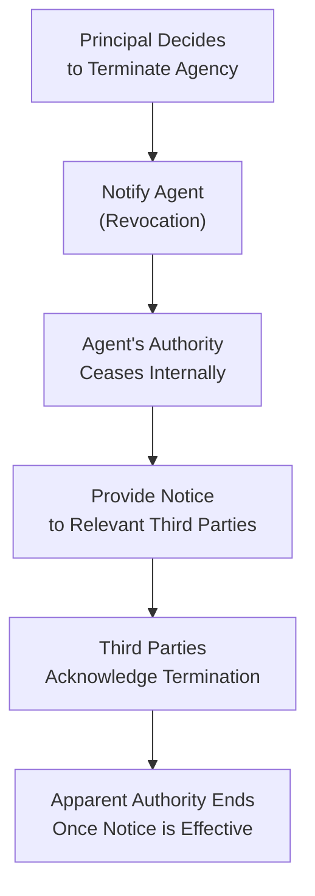

## 7.4 Termination of Agency and Impact on Third Parties

An agency relationship represents a legal arrangement in which one party (the agent) acts on behalf of another (the principal) when interacting with third parties. Despite the benefits of delegating authority, every agency relationship is finite—whether by explicit agreement of the parties, by mutual or unilateral action, or by operation of law. Understanding how an agency terminates and how this termination affects third parties is a critical component of business law. Failure to comply with necessary notice requirements, for instance, may leave the principal vulnerable to liability for actions performed by an agent who should no longer be acting on the principal’s behalf. This section delves into the methods and consequences of agency termination, including revocation, renunciation, notice obligations, and the resulting impact on third-party rights and expectations.

-------------------------------------------------------------------------------

### The Purpose and Relevance of Termination Rules

Termination of an agency relationship is not merely a formal conclusion between principal and agent; it carries significant implications for all involved parties. Once the relationship ends, the agent generally cannot continue to bind the principal to new transactions. However, if third parties are not properly notified, they may reasonably believe that the agency relationship is still in force, creating the risk of apparent authority. As a Certified Public Accountant (or CPA candidate), you may encounter numerous scenarios in which understanding and properly applying termination of agency principles can help businesses avoid costly legal actions and financial liabilities.

-------------------------------------------------------------------------------

### Modes of Agency Termination

Agency relationships can end in multiple ways. Broadly, these methods of termination can be grouped into two categories: by action of the parties (i.e., revocation and renunciation) and by operation of law.

#### Termination by Act of the Parties

1. Revocation of Authority by the Principal  
   • The principal may revoke (withdraw) the agent’s authority at any time. This is often referred to as “revocation of authority.”  
   • Revocation can be explicit, such as sending a written notice to the agent or publicly declaring that the agency is over. It can also be implied, such as hiring another agent to perform the same tasks, effectively superseding the original agent’s authority.  
   • However, revocation may lead to breach-of-contract damages if the agency relationship was formed under a contract with a set duration or specific terms that limit premature termination.

2. Renunciation of Authority by the Agent  
   • The agent similarly retains the right to renounce (resign from) the agency relationship at any time. This is often referred to as “renunciation of authority.”  
   • Again, if the agent was bound by contract or had agreed to perform certain tasks before a date certain, an early renunciation could expose the agent to potential breach-of-contract claims.

3. Mutual Agreement  
   • In many instances, principal and agent simply agree to end their arrangement by mutual consent. This might be a formal decision described in a contract’s termination clause or an informal understanding that the arrangement is no longer beneficial or necessary.  
   • Termination by mutual agreement is often the least contentious because both parties are aligned in ending the relationship.

#### Termination by Operation of Law

1. Fulfillment of Purpose or Expiration of Term  
   • If the agency was created for a fixed purpose (e.g., finding a buyer for a property) or for a fixed duration (e.g., a six-month contract), the agency ends automatically once its objective is achieved or the specified time period elapses.

2. Death or Incapacity of the Principal or Agent  
   • Generally, the death of either principal or agent terminates the agency relationship immediately, unless a durable power of attorney or similar arrangement is in place that specifies continuity despite incapacity.  
   • An agent who is unaware of the principal’s death may still create circumstances of apparent authority in favor of third parties. In that situation, notice procedures and practicality of knowledge come into play.

3. Bankruptcy  
   • In the event of the principal’s bankruptcy, the agent’s authority to act on behalf of the insolvent party is typically terminated.  
   • The details can vary by jurisdiction; sometimes, a court-appointed trustee might step in to assume the principal’s role or decide how the business affairs will be handled.

4. Change in Law or Destruction of Subject Matter  
   • If a change in law makes the agent’s tasks illegal or impossible, the agency ends automatically. Similarly, if the subject matter that forms the basis of the agency is destroyed (e.g., the property an agent was entrusted to sell is condemned and demolished), the agency has no reason to continue.

-------------------------------------------------------------------------------

### Revocation and Renunciation in Detail

Revocation and renunciation are two of the most straightforward ways an agency relationship can end by the actions of the interested parties. Despite their simplicity, they carry numerous legal and practical nuances that can significantly affect liability and third-party rights.

#### Revocation by the Principal

• The principal typically has the right to revoke an agent’s authority at any time, especially in an agency-at-will scenario. Yet, if revocation conflicts with a contract, the principal may owe the agent damages.  
• Revocation is generally effective upon the agent’s receipt of notice. However, the third-party perspective must also be considered. As discussed in the “Notice to Third Parties” section below, if third parties are not properly informed, the agent may continue appearing to have authority, thereby binding the principal under the doctrine of apparent authority.

#### Renunciation by the Agent

• The agent may end the relationship by resigning or by informing the principal that they are no longer willing to act on the principal's behalf.  
• As with revocation, renunciation that violates a contractual obligation can lead to a damages claim for breach of contract.  
• From a fiscal perspective, an agent renouncing the agency might also forfeit any commission or compensation that was contingent on completing a specific task.

#### Key Practical Example

Imagine a brokerage firm employing a real estate agent to sell a commercial building. If the principal decides to fire (revoke authority of) the real estate agent before the listing period ends, the principal might owe the agent compensation for any expenses incurred or partial commissions if an interested buyer was already presented. Conversely, if the real estate agent quits without notice due to a personal emergency, the principal might be forced to hire a new agent on short notice or face legal recourse for breach if the agent’s contract disallowed early departure.

-------------------------------------------------------------------------------

### Notice Requirements to Third Parties

Perhaps the most critical aspect of terminating an agency relationship is properly notifying third parties. The ongoing existence or absence of an agent’s authority directly influences potential liability of the principal, and confusion around an agent’s authority can create complex legal disputes. Different categories of third parties exist, and each category requires different forms of notice.

1. Actual Notice  
   • Any third party who has already dealt with or is in an active transaction with the agent should receive actual notice of the termination.  
   • Actual notice can be extended through personal contact (e.g., a phone call, in-person meeting), written notice (e.g., an email or letter), or any other direct means that ensures the third party is aware that the agent no longer acts for the principal.

2. Constructive Notice  
   • Third parties who have not transacted with the agent directly but know of the agent’s authority through indirect means require constructive notice.  
   • Commonly, publishing the termination in widely read trade journals, posting a notice in an official newspaper, or updating relevant public records can serve as constructive notice.  
   • Constructive notice is generally deemed sufficient where the principal has no direct relationship with the third party, but the third party may have heard of the agent’s authority through general marketplace communication.

3. No Duty of Notice to the World at Large  
   • In many jurisdictions, the principal is not required to notify persons who have never heard of the agent’s authority.  
   • However, if the principal knows of a specific third party who might rely on the agent’s authority (even if the third party has not yet formally contracted with the agent), there is an argument in favor of direct or constructive notice to disarm potential claims of apparent authority.

#### Importance of Timely Notice

Timeliness is vital. If a principal fails to provide proper notice promptly, a third party might still rely on the agent’s apparent authority and reasonably assume the agency remains valid. Under these circumstances, the principal could be held liable for the agent’s acts, even though the agency ended internally.

-------------------------------------------------------------------------------

### The Doctrine of Apparent Authority and Third-Party Impact

When analyzing the impact on third parties, apparent authority is often the linchpin. Even after an agency relationship is terminated, if third parties were not suitably notified and the agent continues to present themselves as having authority, the principal may still be bound by the agent’s acts. This principle—rooted in equity—protects third parties from harm when they reasonably rely on the principal’s manifestation of authority.

#### Potential Liability

• The principal remains liable for obligations entered into by the agent after termination if such obligations rely on the premise that the agent still possessed authority.  
• This liability can be avoided or drastically minimized if the principal can prove that proper notice was sent to the third party—thereby eliminating the “reasonable reliance” angle.

#### Real-World Business Scenario

Picture a company CFO (principal) who terminates an internal accounting manager’s (agent) authority to negotiate with suppliers. The CFO fails to inform these suppliers, who have historically dealt with the manager. If the manager signs a new supply contract under the company’s banner after being terminated, the CFO may find the company obligated to honor that contract. Because the suppliers had no reason to believe the manager’s authority ended, they relied on their past dealings. This underscores the vital importance of timely notices to avoid unintended obligations.

-------------------------------------------------------------------------------

### Practical Considerations and Best Practices

• Document the Termination  
  Keep extensive written records of the termination date and the reasons for ending the relationship. This includes letters of termination from the principal, resignation letters from the agent, and any mutual termination forms if used.

• Provide a Clear and Comprehensive Notice  
  When notifying third parties, ensure that the notice explicitly states that the agent no longer has authority to act. Where feasible, give both actual and constructive notice to limit potential disputes about who was effectively informed.

• Update Communication Channels  
  Disabling an agent’s company email login or removing an agent’s delegated authority from corporate bank accounts immediately are essential steps. This reduces the risk of unauthorized transactions or communications that lead to confusion.

• Consult Legal Counsel  
  Complex agencies—particularly those involving large commercial transactions, international dealings, or specialized industries—often necessitate a careful approach. Consulting with experienced legal counsel ensures that termination steps meet statutory and regulatory requirements and that proper notice is delivered to all relevant counterparties.

• Draft Termination Clauses in Agency Agreements  
  Agency agreements can include clauses outlining the procedures and consequences of termination, including how notice should be provided and what forms of compensation may apply. This proactive step can prevent costly litigation or ambiguity should the relationship end unexpectedly.

-------------------------------------------------------------------------------

### Case Study: Revocation Without Proper Notice

ABC Manufacturing engaged a freelance consultant, Chris, to negotiate deals for raw materials. Over a year, Chris forged many successful relationships with multiple third-party suppliers. When ABC's financial director, Jane, decided to move negotiations in-house to streamline costs, she emailed Chris a termination notice. However, Jane neglected to inform any of the suppliers with whom Chris had been dealing.

A few weeks later, Chris continued approaching one of the suppliers for additional raw materials, claiming to act on behalf of ABC. The supplier, unaware that Chris’s authority had been revoked, shipped materials worth $30,000. ABC later refused to pay, stating that Chris was no longer their agent.

The supplier sued ABC for payment. The court found that ABC was liable for the unauthorized purchase. Reasoning: ABC failed to provide actual notice to the supplier of Chris’s termination. Because the supplier’s belief in Chris’s ongoing authority was reasonable, ABC was bound by Chris’s actions notwithstanding the internal revocation.

-------------------------------------------------------------------------------

### Using Visual Tools: Flowchart of Agency Termination

Below is a Mermaid diagram illustrating a simplified process of terminating an agency relationship and highlights the flow that impacts third parties:

Explanation of Diagram:  
• The process begins with the principal deciding to terminate the agency (A).  
• The principal must then notify the agent of the revocation (B).  
• Internally, the agent’s authority officially ceases (C).  
• To protect against possible future liability, the principal must deliver proper notice to all known and likely third parties (D).  
• Once these third parties acknowledge termination or otherwise become aware that no authority remains (E), the risk of apparent authority is substantially diminished (F).

-------------------------------------------------------------------------------

### Strategies to Manage Risk Post-Termination

• Update Corporate Websites, Stationery, and Proxy Documents  
  If an agent’s name appears in marketing materials, on letterhead, or within email signatures, promptly remove or revise these references. A continuing display of the individual’s name and title could perpetuate the impression of authority.

• Maintain Communication Logs  
  For accountability, keep records and proofs of delivery regarding correspondence to third parties. Confirm that each notified party has acknowledged the termination, whether via email confirmations or written replies.

• Cascade Information Internally  
  Inform departments and personnel within the principal’s organization of the agent’s termination and instruct them to redirect any inquiries or requests from third parties to the appropriate internal contact.

• Observe Contractual Obligations  
  If the agency agreement included termination fees or notice periods, the principal must adhere to these obligations to avoid contractual liability.

-------------------------------------------------------------------------------

### Cross-References to Other Relevant Sections

• For further background on how agency relationships are formed and the principal’s and agent’s scope of authority, see “7.1 Formation and Types of Agency Relationships” and “7.2 Authority of Agents and Principals (Actual, Apparent, Ratification).”  
• For insights into key duties and liabilities that persist even after the conclusion of an agency relationship, see “7.3 Duties and Liabilities of Agents and Principals.”  
• Managing liabilities, especially if disputes arise post-termination, can intersect with legal procedures—some of which are referenced in “Chapter 9: Debtor-Creditor Relationships” and “Chapter 10: Federal Laws and Regulations Affecting Business.”  

-------------------------------------------------------------------------------

### Conclusion

The rules governing termination of an agency and their effect on third parties reflect an overarching effort in the law to protect the legitimate expectations of all participants. Principals must appreciate the gravity of providing prompt and adequate notice to ensure that third parties are not misled by an agent’s continued appearance of authority. Conversely, agents must recognize the limitations of their authority once they renounce their position or are dismissed. Thorough understanding, clear documentation, scrupulous communication, and precise legal drafting can significantly reduce risk. By proactively applying these principles, practitioners in accounting, finance, and business can prevent unintended liabilities, preserve trust in commercial dealings, and safeguard long-term professional relationships.

-------------------------------------------------------------------------------

## Quiz on Termination of Agency and Impact on Third Parties



### Termination of an agency relationship can occur by which of the following methods without requiring mutual consent?

- [x] Revocation by the principal
- [ ] Constructive revocation by an unrelated third party
- [ ] Prolonged inactivity by the agent
- [ ] Automatic omission under UCC guidelines

> **Explanation:** Revocation by the principal is a classic unilateral method of ending an agency relationship. Even if the parties do not mutually consent, the principal can unilaterally withdraw authority.

### Which best describes the principal’s obligation when ending an agency relationship?

- [x] Provide actual notice to those who transacted with the agent and constructive notice to those aware of the agency
- [ ] File a court petition requesting an injunction against the agent’s future activity
- [ ] Automatically terminate vendor relationships
- [ ] Cancel all insurance policies related to the business

> **Explanation:** The principal must provide actual notice to third parties who have dealt with the agent and constructive notice to others aware of the agency. This approach mitigates potential liability arising from apparent authority.

### An agent renounces an agency agreement prematurely, contrary to the contract’s terms. Which of the following statements is correct?

- [x] The agent may be liable for damages if the renunciation breaches the contract
- [ ] The agency remains indefinitely valid until the contract term expires
- [ ] The agent owes no duty once they decide to resign
- [ ] The principal is automatically required to pay the agent severance packages

> **Explanation:** An agent’s unilateral renunciation of an agency relationship can constitute a breach of contract if the agency was meant to last a specific term. The agent may be held responsible for damages.

### If a principal fails to notify any third parties about the termination of an agent’s authority, what is the likely legal consequence?

- [x] The principal may still be bound by the agent’s apparent authority
- [ ] All transactions automatically become void
- [ ] The agent incurs exclusive liability for subsequent acts
- [ ] The principal can sue third parties for continuing to contract with the agent

> **Explanation:** Without proper notification to third parties, the principal risks being bound by future deals entered into by the agent under the guise of apparent authority.

### In order to effectively revoke an agent’s authority, the principal must:

- [x] Communicate the revocation to the agent, and if needed, give notice to relevant third parties
- [ ] Obtain permission from all potentially affected third parties
- [x] Ensure no breach-of-contract claim arises by complying with any existing agreement
- [ ] Initiate a lawsuit to declare the agent’s authority invalid

> **Explanation:** Revoking an agent’s authority requires active communication of the revocation to the agent, ensuring no contractual violations, plus informing third parties to avert apparent authority issues.

### Under typical common-law rules, the death of the principal:

- [x] Automatically terminates the agency unless there is a durable power of attorney
- [ ] Continues the agency for 30 days
- [ ] Requires an administrative court order for termination
- [ ] Has no effect on the agency until notice is sent to the agent

> **Explanation:** Under most common-law principles, an agent’s authority ends upon the principal’s death, barring specific exceptions such as a durable power of attorney that allows authority to remain in force.

### When might an agent’s collision with notice requirements arise?

- [x] If the principal revokes but fails to provide actual or constructive notice
- [ ] If the agent demands a final paycheck
- [x] If third parties continue to rely on the agent’s previous titles or roles
- [ ] If the principal switches to a new agent’s contract

> **Explanation:** Issues arise if the principal does not properly notify third parties of the agent’s revocation or renunciation. In such cases, third parties may rely on the agent’s apparent authority.

### Which of the following best describes constructive notice?

- [x] Publicly accessible communication, such as newspaper advertisement or posted announcements
- [ ] Informal text messages between the agent and the principal
- [ ] In-person individual meetings with each interested third party
- [ ] Sending quantum notifications via social media only

> **Explanation:** Constructive notice refers to actions such as posting public announcements or other accessible communications, allowing people to become aware of the termination even without direct communication.

### A principal quietly decides to terminate an agency but does not inform the agent or third parties. One month later, the agent executes a valid contract with a third party. Who is likely bound?

- [x] The principal may be bound by the contract because of apparent authority
- [ ] Only the agent is bound
- [ ] Only the third party is liable
- [ ] No one is bound because the principal negated authority privately

> **Explanation:** Apparent authority exists when third parties are unaware of termination and reasonably believe the agent continues to act within their original authority.

### Once an agency relationship has been terminated and proper notification has been given to third parties, any further actions by the agent that bind the principal are generally:

- [x] Void
- [ ] Valid but voidable
- [ ] Allowed under ratification
- [ ] Retrospectively permitted if beneficial

> **Explanation:** After proper termination and notice, the agent’s actions should no longer bind the principal. Those actions become void for lack of authority.



-------------------------------------------------------------------------------

## References for Further Study

• Restatement (Third) of Agency (American Law Institute) – Offers detailed commentary on agency law principles, including termination.  
• “Business Law: Text and Cases” by Clarkson & Miller – Provides comprehensive coverage of agency creation, operation, and termination.  
• Uniform Commercial Code (UCC), Articles relevant to agency transactions – Although the UCC primarily addresses sales, it includes indirect references to agency relationships in commercial contexts.  
• Official IRS Publications on Powers of Attorney and Taxpayer Representation – For scenarios in which an agent represents a principal before the IRS, which involve unique revocation and renunciation formalities.

-------------------------------------------------------------------------------

## For Additional Practice and Deeper Preparation

### [Taxation & Regulation (REG) CPA Mock Exams](https://www.udemy.com/course/reg-cpa-mock-exams/?referralCode=55419EBD198F61530B12)

**Taxation & Regulation (REG) CPA Mocks:** 6 Full (1,500 Qs), Harder Than Real! In-Depth & Clear. Crush With Confidence!

- Tackle full-length mock exams designed to mirror real REG questions.  
- Refine your exam-day strategies with detailed, step-by-step solutions for every scenario.  
- Explore in-depth rationales that reinforce higher-level concepts, giving you an edge on test day.  
- Boost confidence and minimize anxiety by mastering every corner of the REG blueprint.  
- Perfect for those seeking exceptionally hard mocks and real-world readiness.

_Disclaimer: This course is not endorsed by or affiliated with the AICPA, NASBA, or any official CPA Examination authority. All content is for educational and preparatory purposes only._
