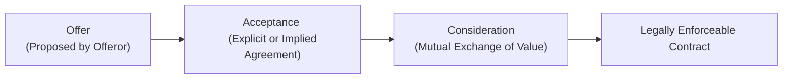

## 8.1 Elements of Contract Formation (Offer, Acceptance, Consideration)

Contracts form the backbone of countless business, professional, and personal transactions. From everyday purchases to complex commercial deals, contract law ensures that the agreements parties enter into are held to a recognized standard. This section focuses on the three fundamental elements every candidate for the Certified Public Accountant (CPA) Examination should know: (1) Offer, (2) Acceptance, and (3) Consideration. Mastery of these topics is essential to navigate contract-related questions on the REG Section of the Uniform CPA Examination, as well as to understand broader legal and professional obligations.

Understanding these elements is not only important for test preparation but also for real-world application—whether you’re advising clients, reviewing business deals, or simply ensuring your personal transactions are legally valid. The goal is to ensure you understand their legal definitions, the practical requirements to satisfy each element, and the common pitfalls to avoid.

## Key Concepts in Contract Formation

Before diving deeper into each element, it’s helpful to visualize the overall sequence. Contracts typically form when one party proposes an agreement (offer), another party acknowledges and agrees to the exact terms (acceptance), and both parties exchange something of value (consideration). Courts in the United States use these three components to ascertain whether a legally binding contract exists under common law principles (e.g., the Restatement (Second) of Contracts). Under the Uniform Commercial Code (UCC), which governs sales of goods, slightly more flexible rules may apply, but the essential framework remains the same.

Below is a simple flowchart illustrating the progression from offer to a valid contract:

This diagram sets the stage for our discussion of each element in detail.

## Offer

An offer is a manifestation of willingness to enter into a contract, communicated in such a way that the offeree can reasonably understand that acceptance will create a binding contract. In contract law, clarity and definiteness are vital. An ill-defined statement of terms or a vague proposition might not rise to the level of a valid offer.

### Key Characteristics of a Valid Offer

• Serious Intention to Be Bound: The offeror must intend to create a legal obligation. Jokes, social invitations, or emotional statements typically do not qualify as serious offers when taken in context.  
• Clear and Definite Terms: Essential terms—such as price, subject matter, quantity, and timing—must be clear enough to allow the offeree to understand and accept the proposal. Under the UCC, some flexibility is permitted for missing terms (e.g., “reasonable price” or “requirements contracts”), but the intent to form a contract must still be evident.  
• Communication to the Offeree: The proposed terms must be communicated to the intended offeree. If the offeree never receives the offer, no contractual relationship can form.

Consider the following example:

A, an owner of a small wholesale bakery, emails B, a restaurant owner, stating: “I offer to sell you 100 loaves of artisan bread at $2.50 each, delivered by next Tuesday.” This is a clear proposal setting forth quantity (100 loaves), price ($2.50 each), and time (by next Tuesday). If B accepts these terms, a contract can form.

### Examples of Valid vs. Invalid Offers

Valid Offer Example:  
• “I’m willing to sell my car to you for $10,000. Let me know by Friday.”  
– The speaker’s language indicates a clear sale price and time by which acceptance must occur.

Invalid Offer Example:  
• “I might be willing to sell my car sometime for the right price—you in?”  
– This statement is vague and lacks definitive terms such as actual price or timing. It sounds more like casual negotiation than a serious offer.

### Common Pitfalls for Offers

• Advertisements as Offers: Most advertisements are considered invitations to negotiate rather than valid offers. However, “first come, first served” or reward specifics (e.g., “$100 reward for the return of lost property”) can sometimes form unilateral offers.  
• Jokes or Expressions of Opinion: If it’s reasonably interpreted as a joke, it is not a valid offer.  
• Preliminary Negotiations: General discussions about price or quantity do not typically constitute a valid offer if the intent to be bound is missing.  

## Acceptance

Once an offer is made, the next step is acceptance—a clear, unequivocal assent to the terms offered. Under common law, acceptance must strictly adhere to the “mirror image rule,” while under the UCC, minor deviations may be acceptable in certain circumstances (especially between merchants). Still, the general principle is that the offeree must accept the proposal without introducing substantial new conditions.  

### The Mirror Image Rule

Under the mirror image rule, acceptance must exactly match the terms of the offer. If an offeree seeks to change any essential terms, it generally constitutes a counteroffer rather than an acceptance. This rule is most strictly applied under common law. For instance, if an offer states a price of $2.50 per unit, the acceptance cannot substitute $2.00 per unit without becoming a counteroffer.

### The Mailbox Rule

The mailbox rule (or “deposited acceptance rule”) under common law provides that a properly dispatched acceptance—sent through an authorized means of communication such as postal mail—becomes effective when placed into the mail, not when received by the offeror. This rule helps define the exact moment a contract is formed, an important detail in disputes over timing.

If, however, the offeree modifies the method of sending acceptance (e.g., choosing overnight courier instead of standard postal mail), or if the offer stipulates a specific method of acceptance, the mailbox rule might not apply. Email communications often apply a similar principle: acceptance is deemed valid when sent, provided it is properly directed to the correct email address, unless otherwise stated in the offer.

### Common Pitfalls in Acceptance

• Counteroffers and Rejections: If an offeree changes the offer’s terms, it destroys the original offer and becomes a counteroffer.  
• Late Acceptance: If an offeree attempts to accept after the offer has expired, it is ineffective unless the offeror renews or extends the offer.  
• Silence as Acceptance: Generally, silence alone does not constitute acceptance, unless there is a pattern of behavior or prior course of dealing that implies acceptance by inaction.  

### Example Scenarios

1. Mirror Image Rule in Action:  
   A offers to sell B 100 chairs at $50 per chair, and “acceptance must be delivered by Monday.” B replies on Monday, “I accept, but I need 120 chairs at $45 per chair.” This is a counteroffer, not a mirror-image acceptance, and A is not bound to sell.

2. Mailbox Rule in Action:  
   A mails B an offer on June 1, which B receives on June 3. B mails back an acceptance on June 4, which A receives on June 6. Under the mailbox rule, a contract forms as soon as B mails the acceptance on June 4.

## Consideration

Every contract must be supported by consideration—something of legal value exchanged between the parties. This exchange can be a promise, an act, a forbearance (refraining from doing something), or a tangible item of value. The law does not typically concern itself with the adequacy (i.e., the fairness) of consideration, barring instances of fraud, duress, or unconscionability.

### Types of Consideration

• Tangible: Money, goods, or physical assets.  
• Services: Providing labor, expertise, or a specific act in exchange for the other party’s promise or payment.  
• Forbearance: Refraining from doing something one has a legal right to do (e.g., agreeing not to sue or not to compete).  

### Illusory Promises

A promise that does not truly commit the promisor to do anything is considered illusory and lacks consideration. For example, “I will buy your car if I feel like it tomorrow” is an illusory promise because the promisor has complete discretion to choose not to perform.

### Past Consideration

Promises based on something that has already occurred, or something that the party was already legally obligated to do, cannot constitute valid consideration. For example, if a friend helped you move your furniture last week and you promise to pay them $200 after the fact, there is no new exchange of value, and the promise generally cannot be enforced as a contract.

### Real-World Illustration of Consideration

Suppose an accounting firm agrees to provide monthly financial statements for a small retail business. In exchange, the retailer agrees to pay the firm a monthly fee of $1,000. Both sides exchange something of value: the accountant’s professional services and the businesses’ monetary payment. This mutual exchange of promises constitutes valid consideration, and a legally binding contract is formed (provided the offer and acceptance were valid).

## Best Practices, Common Pitfalls, and Strategies

Best Practices:  
• Use precise, unambiguous terms in both the offer and acceptance stages.  
• Document acceptance in writing or other verifiable means whenever possible—this prevents disputes.  
• Ensure consideration is clearly defined; even small acts of consideration can support a binding contract.  

Common Pitfalls:  
• Vague or indefinite terms in the offer can invalidate the entire agreement.  
• Inadvertently changing terms in an acceptance can transform it into a counteroffer, nullifying original terms.  
• Reliance on past consideration or promises that are too discretionary often result in unenforceable agreements.  

Strategies for CPA Exam Success:  
• Practice identifying valid offers and pinpointing where acceptance might fail (e.g., late acceptance, changing a term, communicating acceptance incorrectly).  
• Memorize the mailbox rule’s nuances, especially how various communications (mail, email, fax) might affect the timing of acceptance.  
• Understand how consideration shapes the difference between gratuitous promises and enforceable agreements.  

## Additional References and Resources

• Restatement (Second) of Contracts – Provides an authoritative foundation for common law contract principles.  
• Uniform Commercial Code (UCC), Article 2 – Governs contracts for the sale of goods in most U.S. jurisdictions.  
• Farnsworth on Contracts by E. Allan Farnsworth – A comprehensive treatise that examines contract formation and interpretation.  
• Chapter 10: Federal Laws and Regulations Affecting Business (this same book) – Overviews statutory obligations in different contexts.  

Below, you’ll find an opportunity to test your knowledge of contract formation. Answer the questions carefully, noting the nuanced distinctions you’ve just studied.

## Elements of Contract Formation Quiz



### Which of the following is a valid characteristic of a binding offer?

- [x] The terms must be definite and communication must be clear.
- [ ] The offeree can alter material terms without affecting the validity.
- [ ] An offer made in jest can be enforced if the offeree accepts.
- [ ] The offer need not be communicated to the offeree.

> **Explanation:** A valid offer requires a manifestation of intent, clarity of essential terms, and communication to the offeree.

### Under the mirror image rule, what happens if the offeree adds new or different terms to the offer?

- [x] It becomes a counteroffer rather than an acceptance.
- [ ] It remains an acceptance if the offeree acts in good faith.
- [ ] The acceptance is still valid once the firm confirms it in writing.
- [ ] The contract is partially enforceable based on the original terms.

> **Explanation:** Common law requires that acceptance mirrors the offer exactly. Any additional or changed term is considered a counteroffer, effectively rejecting the original offer.

### What is the general definition of the mailbox rule?

- [x] Acceptance is effective upon proper dispatch by the offeree.
- [ ] Acceptance is effective only upon receipt by the offeror.
- [ ] Rejection applies if the offeree never receives the offer.
- [ ] Acceptance is effective as soon as it is composed, regardless of communication method.

> **Explanation:** Under the mailbox rule, acceptance is effective once properly mailed or dispatched, provided it meets any stipulated methods and is addressed correctly.

### Which of the following statements about consideration is true?

- [x] A promise to perform a pre-existing duty does not constitute valid consideration.
- [ ] Past actions always generate adequate consideration for a new promise.
- [ ] Any promise is automatically binding without an exchange of value.
- [ ] A sum of $1 is never acceptable as consideration because it’s too small.

> **Explanation:** Consideration must be something of legal value exchanged after the contract is formed. Pre-existing duties and past actions do not qualify as new consideration.

### In a unilateral offer scenario (e.g., a reward for lost property), when is acceptance deemed complete?

- [x] When the requested act is performed.
- [ ] When the request for the reward is verbally communicated.
- [x] As soon as the offeree begins to perform the act.
- [ ] When the offeree notifies the offeror of intent to perform in the future.

> **Explanation:** In unilateral contracts, acceptance occurs upon performance of the requested act. Some jurisdictions allow partial performance to grandfather in acceptance, preventing revocation.

### Which of the following correctly illustrates a lack of valid consideration?

- [x] A’s promise to pay B for something B did two years ago as a favor.
- [ ] A’s promise to pay B $5 for a used pen if B delivers it immediately.
- [ ] A’s agreement to refrain from smoking for a month at B’s request, in exchange for $100.
- [ ] A’s promise to make a charitable donation next month if B picks up a couch.

> **Explanation:** Past consideration—an act performed in the past with no new exchange—does not create a binding obligation because there is no fresh bargain.

### Which statement best describes the effect of a counteroffer?

- [x] It rejects the original offer and creates a new offer.
- [ ] It keeps the original offer open but modifies certain terms.
- [x] It allows the offeree to accept either the original or altered terms at will.
- [ ] It automatically binds the original offeror unless they explicitly reject it.

> **Explanation:** A counteroffer ends the original offer and replaces it with new terms that the original offeror can accept or reject.

### Under common law, an acceptance sent by unauthorized means (contrary to the offeror’s instructions) is generally:

- [x] Effective upon receipt by the offeror.
- [ ] Automatically treated as invalid.
- [ ] Treated as effective upon dispatch as long as it’s within the mailbox rule timeframe.
- [ ] Effective only after a second acceptance is dispatched by the permitted method.

> **Explanation:** If the offeree adopts an unauthorized method of acceptance, it usually becomes valid only when received by the offeror, rather than upon dispatch.

### Which principle states that acceptance must match the exact terms of an offer under common law?

- [x] Mirror image rule
- [ ] Mailbox rule
- [ ] Substantial performance rule
- [ ] Perfect tender rule

> **Explanation:** Under the mirror image rule in common law, any variation from the terms offered creates a counteroffer and nullifies the original offer.

### Is a contract formed if an offeree’s acceptance arrives after the offer has expired?

- [x] True
- [ ] False

> **Explanation:** If acceptance is received after the offer’s specified time frame, it generally is invalid unless the offeror explicitly renews or re-extends the offer.



## For Additional Practice and Deeper Preparation

### [Taxation & Regulation (REG) CPA Mock Exams](https://www.udemy.com/course/reg-cpa-mock-exams/?referralCode=55419EBD198F61530B12)

Taxation & Regulation (REG) CPA Mocks: 6 Full (1,500 Qs), Harder Than Real! In-Depth & Clear. Crush With Confidence!

- Tackle full-length mock exams designed to mirror real REG questions.  
- Refine your exam-day strategies with detailed, step-by-step solutions for every scenario.  
- Explore in-depth rationales that reinforce higher-level concepts, giving you an edge on test day.  
- Boost confidence and minimize anxiety by mastering every corner of the REG blueprint.  
- Perfect for those seeking exceptionally hard mocks and real-world readiness.

_Disclaimer: This course is not endorsed by or affiliated with the AICPA, NASBA, or any official CPA Examination authority. All content is for educational and preparatory purposes only._
