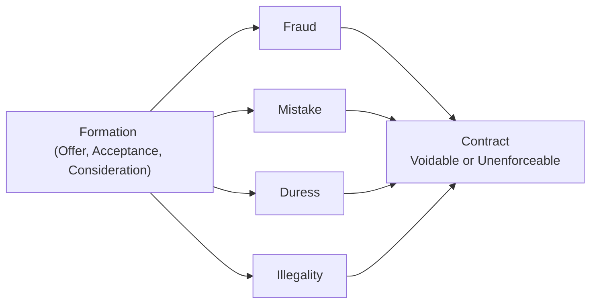

## 8.2 Defenses to Formation (Fraud, Mistake, Duress, Illegality)

Contracts form the backbone of commercial transactions. However, not all agreements ultimately stand up to legal scrutiny if certain defenses apply. When a defense to formation renders a contract void or voidable, it fundamentally alters the rights and obligations of the parties involved. For CPA candidates and practitioners alike, understanding how these defenses operate is central to protecting clients’ interests and ensuring compliance with ethical and legal standards. This section delves into four primary defenses—fraud, mistake, duress, and illegality—offering practical examples, real-world scenarios, and best practices to avoid invalid agreements and potential legal ramifications.

## Importance of Defenses to Contract Formation

A valid contract requires offer, acceptance, and consideration. Yet, even when these elements appear valid on the surface, latent defects or wrongful conduct can undermine the agreement’s enforceability. By exposing how and why a contract may fail, defenses to formation protect individuals and entities from unjust arrangements—whether induced by trickery (fraud), misunderstanding (mistake), wrongful pressure (duress), or violations of public policy (illegality).

Below is a visual overview showing how various defenses can impede contract formation:

In many instances, these defenses overlap or occur simultaneously. Practitioners should carefully assess the facts and applicable state statutes, federal provisions, or relevant sections of the Uniform Commercial Code (UCC).

## Fraud

Fraud is a major defense against contract enforcement, typically requiring a misrepresentation of a material fact, knowledge of falsity, intent to deceive, and resulting reliance that causes injury. Whether an agreement was made through willful deceit or negligent misrepresentation can invalidate the consent of one or more parties.

### Elements of Fraud

• Misrepresentation of a material fact: The false statement must relate to an important fact that influences the decision to contract.  
• Scienter (knowledge of falsity): The party making the misrepresentation must know or should know that the statement is untrue.  
• Intent to induce reliance: The false statement must be made to encourage the other party to act or refrain from acting in a certain way.  
• Justifiable reliance: The victim has to rely on the statement in deciding to enter the contract, and that reliance must be reasonable.  
• Damages: The victim must suffer monetary or other harm because of the lie (e.g., loss of resources or opportunity).

### Typical Fraud vs. Unique Scenarios

• Typical Fraud: A salesperson knowingly provides inaccurate sales data to persuade a buyer to purchase a business. Once the buyer discovers overstated revenue figures, they can raise fraud as a defense to avoid the contract or claim damages.  
• Unique Fraud: In some modern contexts, sophisticated algorithms or “bots” may post artificially inflated product reviews, thus misleading consumers regarding product quality. If the reliance on these automated misrepresentations is material, courts may consider this a viable fraud defense.

### Practical Example

A property seller deliberately conceals significant water damage from potential buyers, painting over damaged walls without repairing the root cause. When the buyer later discovers extensive mold, they may sue for rescission (canceling the contract) or damages based on fraud because the seller wrongfully misled them about a material property condition.

### Key Considerations in Fraud Cases

• Proving fraudulent intent can be difficult and often hinges on circumstantial or documentary evidence.  
• Innocent misrepresentation (made without scienter) may still serve as a contract defense, but typically remedies may differ (e.g., rescission but not always monetary damages).  
• The requirement of “material fact” underscores that mere opinions or puffery often do not suffice to establish fraud.

## Mistake

Mistakes in contract law involve beliefs about a fact that is not in accordance with the truth at the time of contracting. A mistake can be unilateral (one-sided error) or bilateral (shared misunderstanding). Mistakes often relate to facts fundamental to the contract’s basis—such as the existence, identity, or quality of the subject matter.

### Unilateral Mistake

• Definition: Only one contracting party operates under a mistaken belief about a key fact.  
• Enforceability: Courts typically uphold the contract unless (1) the non-mistaken party knew or should have known about the error, or (2) enforcing the agreement would lead to severe injustice.  
• Example: A vendor miscalculates a proposal for a complex construction project by omitting a crucial cost component. If the other party had reason to suspect the bid was significantly lower than market norms, the mistaken vendor might successfully contest the contract’s enforceability.

### Bilateral (Mutual) Mistake

• Definition: Both parties share the same erroneous assumption about a central fact at the contract’s formation.  
• Enforceability: If the mutual mistake goes to a fundamental aspect—such as the identity, substance, or existence of the subject matter—courts usually determine that no valid contract existed.  
• Example: Both buyer and seller believe a painting to be an original by a famous artist. Later, they discover it’s merely a replica. Both intended to deal for an original. This mutual mistake voids the transaction.

### Typical Mistake vs. Unique Scenarios

• Typical Mistake: Both parties incorrectly believe a piece of machinery is new, but it has been used previously.  
• Unique Mistake: In a highly technical contract for custom software, both parties misinterpret how certain modules integrate, leading to a system that neither expected or wanted.

### Importance of Clear Contractual Language

Well-drafted contracts with precise language around warranties, representations, and due diligence responsibilities can reduce confusion and mitigate the risk of mistakes. Courts often look to these clauses when deciding if the burden of risk should shift to one party.

## Duress

Duress arises when one party’s free will to contract is compromised by improper threats or coercion. When proving duress, the focus is on whether the aggrieved party assented voluntarily or under undue pressure.

### Types of Duress

• Physical Duress: Threats of bodily harm or actual physical force used to compel contract formation.  
• Economic Duress: Threats causing severe financial harm if the innocent party does not comply—for instance, withholding essential goods or materials in an unconscionable manner.  
• Emotional or Psychological Duress: Use of blackmail, strong intimidation tactics, or exploitative conduct that overrides a person’s ability to engage in free bargaining.

### Typical vs. Unique Duress Situations

• Typical Duress: A supplier threatens to stop shipping critical inventory unless the buyer agrees to renegotiate the contract at exponentially higher rates. If the buyer has no viable alternatives, this can constitute economic duress.  
• Unique Duress: A controlling shareholder in a family business threatens to expose personal information about another shareholder unless they consent to unfavorable business terms. This scenario merges emotional duress with financial ramifications.

### Considerations in Asserting Duress

• Timing: The aggrieved party must show they had no reasonable alternative but to comply at the time of contract formation.  
• Reluctant Acceptance: Evidence that the victim promptly objected or sought legal help when possible bolsters the argument for duress.  
• Subtle Pressures: Not every threat equals duress. Courts examine whether the alleged threat or pressure is truly illegitimate or part of ordinary business negotiations.

## Illegality

Contracts whose subject matter is illegal or contrary to public policy are typically void from inception. Enforcing such agreements runs contrary to the judicial system’s duty to uphold legality and social welfare.

### What Constitutes an Illegal Contract

• Violation of Statutory Law: Agreements that contravene criminal statutes—such as contracts for illegal gambling or distribution of illicit substances—are unenforceable.  
• Violation of Licensing Requirements: If a party is unlicensed to perform regulated activities (e.g., practicing law, medicine, or accounting), the contract could be unenforceable.  
• Contrary to Public Policy: Agreements that are not directly “illegal” yet undermine social good—such as contracts involving excessive noncompetition clauses or unconscionable waivers—may be invalidated.

### Typical vs. Unique Illegality Scenarios

• Typical Illegality: A contract to smuggle prohibited substances.  
• Unique Illegality: An arrangement that heavily restricts employee mobility for an unreasonably long duration (e.g., a 25-year non-compete across the entire country) may be deemed illegal in some jurisdictions due to its violation of public policy.

### Partial vs. Entire Illegality

• Severable Contracts: Courts can sometimes “blue pencil” or sever the illegal portion of the contract, enforcing the remainder.  
• Entire Contracts: If the central purpose of the contract is illegal, the entire agreement is void.

## Real-World Scenarios Illustrating Unenforceable Contracts

Many business transactions have hidden perils, and contract defenses often emerge in complex environments:

• Mergers & Acquisitions: An acquiring firm inflates synergy projections to secure a better purchase price. If proven fraudulent, the acquisition agreement could be canceled.  
• Construction Projects: A major contractor mistakes the scope of work and deliveries. If the other party spotlights the error but remains silent, a “unilateral mistake” defense may apply.  
• Loan Agreements: A borrower claims they were coerced into signing under threats to their personal welfare—raising duress.  
• Consulting & Licensing: A non-compete agreement that restrains a consultant beyond any reasonable scope. Courts may view such a contract as partially or wholly illegal and void it.  

By evaluating each scenario carefully, legal professionals can predict how courts may interpret potential defenses. Early detection of any red flags can save significant costs and reputational harm.

## Best Practices to Avoid Unenforceable Agreements

• Document All Representations: Encourage detailed records, such as email correspondence and formal disclaimers, to limit misrepresentation or confusion.  
• Conduct Thorough Due Diligence: For high-stakes or complex contracts, performing robust research can mitigate the risk of mutual mistakes.  
• Ensure Voluntariness: Recognize pressure points within negotiations. Provide parties with a fair opportunity to review drafts, consult counsel, and negotiate terms.  
• Validate Legality: Confirm that the contract does not infringe upon local, state, or federal laws and that all licensing or regulatory requirements are met.  
• Include “Severability” Clauses: A well-drafted severability clause can rescue viable parts of a contract if a specific provision is held illegal.

## Common Pitfalls and Practical Considerations

Despite best efforts, contract disputes occur due to incomplete information, rapidly changing business climates, or unscrupulous counterparties. Some pitfalls to watch out for:

• Overreliance on Boilerplate: Generic clauses may not adequately address unique hazards in specialized industries.  
• Failure to Update: Laws evolve, particularly around emerging business models (e.g., blockchain or gig economy). Revised statutes may affect contract legality or raise new obligations.  
• Reluctance to Seek Professional Advice: Early consultation with attorneys, CPAs, or industry experts can prevent inadvertently stepping into an illegal or fraudulent arrangement.  
• Underestimating Non-Financial Factors: Psychological threats or intangible pressures (e.g., reputational damage) can constitute duress.

## Strategies for CPA Candidates and Practitioners

• Master Key Terminology: Understand the nuances between concepts like fraud and negligent misrepresentation or undue influence and duress.  
• Apply Realistic Scenarios: Work through hypothetical cases resembling typical engagements—like corporate acquisitions, sales of goods, or professional service contracts—to grasp how courts weigh evidence of mistakes, fraud, or coercion.  
• Stay Current on Legislation: Follow relevant legislative amendments, including updates to the UCC or new regulations that may impact contract validity.  
• Encourage Ethical Conduct: The AICPA Code of Professional Conduct underlines objectivity and integrity. Identifying or preventing fraud and ensuring authenticity in business deals align with these core ethical principles.

## Additional References

• Restatement (Second) of Contracts – Sections on mistake, misrepresentation, duress, and illegality.  
• Uniform Commercial Code (UCC) – Particularly Articles 2 and 2A regarding the sale and lease of goods.  
• Federal Trade Commission (FTC) Guidelines – For issues relating to consumer protection and fraud.  
• State-Specific Business and Professions Codes – For licensing and regulatory requirements that may impact contract enforceability.

When practitioners and exam candidates understand the vital role of contract defenses, they can more effectively guide clients, reduce legal risks, and uphold ethical standards. Whether dealing with straightforward agreements or intricate corporate arrangements, awareness and diligent oversight ensure contracts rest on solid foundations rather than hidden vulnerabilities.

---------------------------------------------------------------------------------

## Quiz: Contract Defenses: Fraud, Mistake, Duress, and Illegality



### Which of the following is generally required to prove fraud in a contract?
- [ ] Proof that the party was unaware of the misrepresentation.  
- [x] Demonstration of a false statement of material fact, knowingly made, with intent to deceive, resulting in justifiable reliance and damages.  
- [ ] Evidence of an unintentional omission of minor facts not relevant to the deal.  
- [ ] Showing that one party pocesses general knowledge superior to the other party.  

> **Explanation:** To succeed on a fraud claim, you must show a false statement about a material fact, awareness that it is false (scienter), intention to have the other party rely on the misinformation, actual reliance, and resulting harm.

### In a unilateral mistake scenario, when might a court allow the mistaken party to rescind the agreement?
- [ ] Whenever the mistake relates to any term in the contract, regardless of importance.  
- [x] If enforcing the contract would cause severe hardship and the other party knew or should have known of the mistake.  
- [ ] Only if the contract was signed under duress.  
- [ ] Under no circumstances; unilateral mistakes never render a contract voidable.  

> **Explanation:** Courts may allow rescission (or modification) if the error is material, and the other party was aware (or should have been aware) of the mistake, or if enforcing the contract would be unconscionably unfair.

### Which of the following best describes mutual (bilateral) mistake?
- [x] Both parties share the same wrong assumption about a vital aspect of the agreement.  
- [ ] One party misunderstands a minor contract term without the other’s knowledge.  
- [ ] Both parties agree on key terms but undervalue the consideration.  
- [ ] Parties intentionally misstate certain facts to each other.  

> **Explanation:** A mutual mistake occurs when both parties harbor the same incorrect assumption about a fundamental fact, rendering the contract potentially voidable.

### What is a necessary element in proving duress in a contract?
- [ ] A concession or apology by the threatening party.  
- [x] Lack of a reasonable alternative for the aggrieved party but to accept the contract.  
- [ ] Proof of an honest mistake about legal terms.  
- [ ] Evidence that both parties were equally unhappy with the agreement.  

> **Explanation:** Duress requires that the victim had no realistic option but to agree, due to improper threats or pressure undermining their free will.

### Which of these situations would most likely be considered economic duress?
- [x] A supplier refuses to deliver critical components unless the buyer signs a contract at an inflated price, leaving no viable market alternatives.  
- [ ] A buyer complains about late deliveries but renegotiates willingly.  
- [x] A private lender processes a loan on terms better than standard market rates.  
- [ ] A party emphasizes that future cooperation depends on a timely contract signature without any threat.  

> **Explanation:** Economic duress occurs when one party exploits a position of financial power by making a wrongful threat, leaving the victim with no practical alternative. The first scenario typifies such conduct.

### When is illegality most likely to render a contract void from the outset?
- [x] When the contract’s subject matter is illegal under statutory law or contrary to public policy.  
- [ ] When the contract lacks a specified duration.  
- [ ] When one party is disappointed in the outcome due to market changes.  
- [ ] When the consideration includes standard business services.  

> **Explanation:** A contract with an illegal purpose or one that violates public policy is void and cannot be enforced, as courts will not uphold illegal agreements.

### How might a severability (blue pencil) clause affect a contract with an illegal provision?
- [x] The court can strike the illegal term and enforce the rest of the agreement.  
- [ ] It automatically converts an illegal contract into a legal one.  
- [x] It eliminates the need for consideration.  
- [ ] It has no effect on contract enforcement if any part is illegal.  

> **Explanation:** A severability clause allows a court to remove or reform the illegal part of an agreement while upholding the remainder, provided the key purpose of the contract is lawful.

### Which of the following factors could indicate fraud rather than mere puffery in a transaction?
- [x] Deliberate concealment of known environmental defects in a property description.  
- [ ] Hyperbolic marketing claims about having “the best coffee in the world.”  
- [ ] Expressions of personal opinion as to product quality.  
- [ ] A statement of personal taste unrelated to factual performance.  

> **Explanation:** Fraud typically involves a lie or concealment of a material fact, whereas puffery involves general, subjective claims that are not meant to be taken as fact.

### Which is a common pitfall when drafting contracts?
- [x] Relying on boilerplate clauses without tailoring them to specific industry or regional laws.  
- [ ] Using severability clauses in most agreements.  
- [ ] Ensuring references to public policy considerations.  
- [ ] Suggesting legal counsel review the final terms.  

> **Explanation:** Overreliance on generic provisions can leave significant issues uncovered. Contracts should be customized to reflect key legal, regulatory, and commercial factors pertinent to each transaction.

### True or False: A contract can be voidable if a party is compelled to enter it due to threats of releasing sensitive personal information.
- [x] True  
- [ ] False  

> **Explanation:** If one party uses personal or reputational threats in a coercive manner, it can amount to duress, allowing the victimized party to void the contract.



---------------------------------------------------------------------------------

## For Additional Practice and Deeper Preparation

### [Taxation & Regulation (REG) CPA Mock Exams](https://www.udemy.com/course/reg-cpa-mock-exams/?referralCode=55419EBD198F61530B12)

Taxation & Regulation (REG) CPA Mocks: 6 Full (1,500 Qs), Harder Than Real! In-Depth & Clear. Crush With Confidence!

• Tackle full-length mock exams designed to mirror real REG questions.  
• Refine your exam-day strategies with detailed, step-by-step solutions for every scenario.  
• Explore in-depth rationales that reinforce higher-level concepts, giving you an edge on test day.  
• Boost confidence and minimize anxiety by mastering every corner of the REG blueprint.  
• Perfect for those seeking exceptionally hard mocks and real-world readiness.

_Disclaimer: This course is not endorsed by or affiliated with the AICPA, NASBA, or any official CPA Examination authority. All content is for educational and preparatory purposes only._
