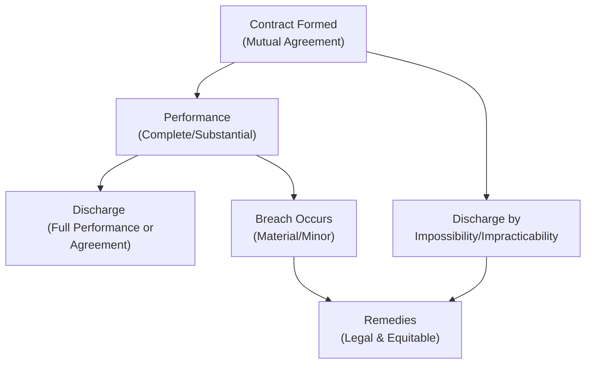

## 8.3 Performance, Discharge, and Remedies for Breach

This section covers the core principles governing how contracts are performed, how obligations are discharged, and what remedies are available when things go wrong. For many candidates, this material is central to understanding how legal issues arise in business settings. Mastering it is essential not only for passing the CPA Exam but also for practical application in professional settings—whether advising clients on contractual disputes or structuring agreements to avoid pitfalls.

This chapter expands on concepts introduced in earlier sections—particularly Chapters 7 (Agency) and 8.1–8.2 on contract formation and defenses. We will explore nuances such as substantial performance, impossibility (or impracticability), and the difference between legal and equitable remedies. We will also highlight best practices and common pitfalls that both new CPAs and experienced practitioners should be aware of.

––––––––––––––––––––––––––––––––––––

### Understanding Contract Performance

Performance refers to the fulfillment of contractual obligations by all parties. In a valid and enforceable contract, each party typically agrees to act or refrain from acting in a manner specified by the agreement.

• Complete Performance: The ideal scenario in which each party’s obligations have been met exactly and according to the contract terms.  
• Substantial Performance: A slightly less strict standard that aims to enforce contracts where a party has performed most, but not all, of its obligations.

Because not every contract can be performed with absolute perfection, the law often allows for variations if they do not materially affect the outcome. Before diving deeper into substantial performance, it is useful to recall that what constitutes “material” or “minor” can sometimes be subject to interpretation—hence, disputes may arise and lead to litigation or mediation.

––––––––––––––––––––––––––––––––––––

### Substantial Performance

Substantial performance is a common-law doctrine that permits enforcement of a contract even if full and exact performance has not occurred, so long as the essential purpose of the agreement is met. In other words, the performing party has done enough to fulfill the core obligations but may have minor, non-material defects in performance.

• Requirements:
  – The party must show a good-faith effort to perform all duties.  
  – Any deviation from the contract must be both unintentional and not material.  
  – The performance must create substantially the same benefits for the other party.  

• Consequences:  
  – If the court deems the performance substantial, the non-breaching party is generally still required to pay or render the agreed-upon consideration, minus an amount representing the cost of remedying the minor defects (if such cost is easily quantifiable).  
  – If the deviations are considered material (i.e., they defeat the purpose of the contract), the doctrine of substantial performance does not apply, and the non-breaching party can treat the contract as breached.

Substantial performance is especially relevant in service contracts. For instance, a building contractor may have used slightly different brand materials that are functionally equivalent to what was specified. The building still meets code and yields the same outcome for the owner. The law will likely treat that as substantial performance, subject to an adjustment if the material is cheaper or results in a minor defect.

––––––––––––––––––––––––––––––––––––

### Conditions to Performance

Often, contracts will list conditions that must be met before one or both parties are obligated to perform (or continue performing). These conditions can affect whether a party’s failure to perform constitutes a breach.

• Condition Precedent: A specific event or action must occur before a party’s performance is required.  
• Condition Subsequent: A later event extinguishes the obligation to perform or continue performing.  
• Concurrent Conditions: Each party’s performance is conditioned upon the other party’s readiness to perform at the same time.

These conditions affect whether obligations remain alive and can influence whether a party is discharged from their remaining duties.

––––––––––––––––––––––––––––––––––––

### Discharge of Contractual Obligations

Discharge refers to the termination of a party’s duty to perform. Several legal theories and doctrines allow discharge without liability, even when the contract itself might otherwise be enforceable.

#### Discharge by Performance

The most standard discharge event is complete performance by all parties. Once parties have fully performed, the contract naturally concludes. However, as noted, performance is not always perfect. If substantial performance standards are met, the parties may still be discharged, though minor damages or adjustments may apply.

#### Discharge by Agreement

Parties to a contract are free to agree to discharge each other from further performance. Common methods include:

• Mutual Rescission: Both parties agree to cancel the contract entirely—often used when each party still has obligations left to perform.  
• Novation: A new party is substituted for one of the existing parties, releasing the replaced party from liability, provided all parties are in agreement and the intended substitution is clear.  
• Accord and Satisfaction: A new obligation (accord) is agreed upon in place of the original one, and once that new obligation is performed (satisfaction), the original duty is discharged.

In all these scenarios, consideration is typically required. For example, if mutual rescission occurs after partial performance, the party receiving less than originally agreed upon may require some form of consideration.

––––––––––––––––––––––––––––––––––––

### Impossibility, Impracticability, and Frustration of Purpose

Certain events can undermine the feasibility of contractual performance. While to some extent, the risk of changing circumstances is allocated in contract drafting, the law provides relief in truly extreme situations.

#### Impossibility

Impossibility (sometimes called “true impossibility”) discharges performance when external events make it literally, physically impossible to fulfill the contract. Classic examples include:

• Death or incapacitation of a party whose personal services are essential.  
• Destruction of the subject matter (e.g., a specialized machine is destroyed before being used).  
• A change in the law that makes performance illegal (e.g., newly enacted restrictions).

True impossibility is a high bar; mere difficulty or higher cost does not typically qualify.

#### Commercial Impracticability

Some jurisdictions, particularly under the Uniform Commercial Code (UCC) for the sale of goods, recognize commercial impracticability. This exists when extreme difficulty or expense significantly shifts the basic assumptions upon which the contract was made (e.g., raw material costs unexpectedly skyrocket by 3000%, or supply chains collapse under a natural disaster).

• The UCC approach: The party must demonstrate an unforeseeable contingency and that performance would be exorbitantly more burdensome than originally anticipated.  
• Courts apply it sparingly to avoid letting parties escape from unprofitable but otherwise feasible obligations.

#### Frustration of Purpose

This doctrine applies when the fundamental reason for entering the contract no longer exists, even if performance is still technically possible. For example, renting a building to watch a parade that gets permanently canceled. The performance is possible—one can still rent the building—but the essential purpose is defeated.

––––––––––––––––––––––––––––––––––––

### Legal and Equitable Remedies: An Overview

When a contract is breached—or performance becomes unsatisfactory—courts provide a range of remedies. These remedies aim to put the non-breaching party in the position they would have been in had the contract been performed (to the extent possible). Remedies generally fall into two categories: legal (monetary) and equitable (non-monetary).

**Legal Remedies (Damages):**
1. Compensatory Damages:  
   – Aim to cover direct losses and costs incurred due to the breach.  
   – Example: Paying the difference between what was promised and what was provided.

2. Consequential Damages (a.k.a. Special Damages):  
   – Flow from the specific circumstances of the breach and must be foreseeable.  
   – Example: Lost profits due to a delayed shipment that caused a manufacturing shutdown.

3. Nominal Damages:  
   – Small, symbolic sum awarded when a breach occurs but no substantial injury or loss is proven.  

4. Punitive Damages:  
   – Rare in pure contract disputes; usually awarded where the conduct is egregious or involves fraud, bad faith, or willful and wanton behavior.

5. Liquidated Damages:  
   – An agreed-upon amount specified within the contract, payable in the event of breach.  
   – Common in construction or large commercial agreements where it is difficult to quantify actual damages.

**Equitable Remedies:**
1. Specific Performance:  
   – Compels the breaching party to carry out the contract, typically used for unique goods or specific parcels of real estate.  
   – Courts generally reserve it for situations when damages are inadequate to compensate the non-breaching party.

2. Injunction:  
   – Orders a party to refrain from doing (or to do) a specific act.  
   – Often used to enforce non-compete clauses or to prevent the misuse of trade secrets.

3. Rescission and Restitution:  
   – Rescission cancels the contract; restitution restores the parties to their pre-contract positions (returning monies, property, or other benefits exchanged).  
   – Appropriate when consent was tainted by fraud, misrepresentation, or duress.

4. Reformation:  
   – Allows the court to rewrite or modify contract terms to reflect the parties’ true intentions.  
   – Typically granted when a mutual mistake or clerical error has led to an inaccurate contract.

The choice between legal and equitable remedies can significantly impact the outcome for both the plaintiff and defendant. Many business contract disputes end up focusing on monetary awards, though equitable remedies are powerful tools in the right circumstances.

––––––––––––––––––––––––––––––––––––

### Visual Overview of Discharge and Remedies

Below is a simple Mermaid diagram illustrating how performance interacts with potential discharge and breaching scenarios, leading to different remedies.

In this diagram, once a contract is formed, the parties either perform their obligations completely or substantially (leading to discharge), or one party breaches. In certain extreme circumstances, the contract discharges due to impossibility. When a breach arises—or performance is rendered impossible—legal or equitable remedies come into play to assist the non-breaching party.

––––––––––––––––––––––––––––––––––––

### Case Study: Construction Contract

Consider a developer, ABC Builders, contracted to erect a small commercial building for a business client, X-Prime Retail. Midway through the project:

• ABC Builders installed a slightly different brand of windows, which had essentially the same functionality.  
• However, they used the originally specified brand for the doors and structure.  
• They also encountered a severe shortage of a particular steel reinforcement, tripling the cost for that material.

In evaluating whether X-Prime must pay:

• The windows likely constitute substantial performance—so X-Prime is obligated to pay, less any minor cost difference if relevant.  
• The steel shortage might not rise to the level of commercial impracticability—court analysis would consider how foreseeable the shortage was and whether alternate materials or suppliers could mitigate the situation.

If ABC Builders decided to cease performance, claiming the contract was “impossible,” that would likely fail unless the shortage was truly catastrophic and beyond their control. The parties might choose a negotiation or a novation, substituting a different steel or reworking the building plans.

––––––––––––––––––––––––––––––––––––

### Best Practices and Common Pitfalls

• Draft Clear Specifications: Define what qualifies as “material” versus “minor” deviation to avoid disagreement over substantial performance.  
• Include Force Majeure Clauses: Especially relevant for global supply chains, these terms help clarify circumstances that might discharge or suspend performance.  
• Anticipate Dispute Resolution: Spell out how disputes will be handled (e.g., arbitration, mediation) and whether injunctive relief or specific performance is an option.  
• Avoid Over-Reliance on Impossibility: It is challenging to meet the standard. Courts often view the risk of unexpected challenges as part of the contract’s commercial risk.  
• Document Changes in Writing: If the parties mutually agree to modify or rescind a contract, formalize it to avoid confusion and potential litigation.

––––––––––––––––––––––––––––––––––––

### Practical Takeaways for CPA Candidates

• Know the Distinctions: Understand the difference between substantial performance and a material breach—a key point in determining whether a party must pay or perform.  
• Focus on Legal vs. Equitable Remedies: Monetary damages are more common, but equitable remedies like specific performance are crucial when dealing with unique goods or real estate.  
• Recognize Discharge Theories: Impossibility, impracticability, and frustration of purpose can release parties from contractual obligations—but only under strict, well-defined conditions.  
• Prep for Real-World Scenarios: Clients may look to you for advice on how to mitigate damages, structure modifications, or document changes to protect their interests.  

You will likely encounter exam questions that involve analyzing whether a breach is material or if a party has substantially performed. Also, watch for tricky scenarios regarding impossibility, frustration of purpose, or the interplay between compensatory and consequential damages. The more you practice with realistic fact patterns, the better you will understand how to apply these principles.

––––––––––––––––––––––––––––––––––––

### Further References

• Restatement (Second) of Contracts §§ 237–242 for detailed discussion on substantial performance and breach doctrines.  
• Uniform Commercial Code (UCC) Article 2 (especially §§ 2-601 to 2-615) for sales of goods and the doctrine of impracticability.  
• Farnsworth on Contracts, 4th Edition—provides an in-depth analysis of contract law theories, including performance and discharge.  
• Official Commentaries: National Conference of Commissioners on Uniform State Laws (for UCC updates and clarifications).

––––––––––––––––––––––––––––––––––––

## Mastering Contract Performance, Discharge, and Breach Remedies: CPA Exam Prep Quiz



### Under the substantial performance doctrine, a party can recover the contract price if:
- [x] The deviation from the contract specifications is minor and unintentional.
- [ ] The deviation from the contract specifications is major and cost-saving.
- [ ] The deviation from the contract specifications is material and intentional.
- [ ] The deviation solely benefits the non-breaching party.

> **Explanation:** Under substantial performance, the breaching party must have made a good-faith effort, and the deviation must be minor or immaterial. A material deviation defeats the essential purpose of the contract.

### In which of the following situations is performance most likely discharged by impossibility?
- [ ] A contractor realizes the cost of steel has risen exponentially.
- [x] A newly enacted law prohibits the import of a certain material essential for contract performance.
- [ ] A contractor fails to complete work due to running out of skilled labor.
- [ ] A party fails to secure requisite funds from investors.

> **Explanation:** Impossibility typically arises when external legal changes or physical destruction make performance objectively impossible. Increased costs or lack of resources do not ordinarily meet that standard.

### Which statement best describes the purpose of compensatory damages?
- [ ] To punish the breaching party for careless behavior.
- [ ] To ensure the breaching party cannot profit from the breach.
- [x] To put the non-breaching party in the position they would have been in had the contract been fully performed.
- [ ] To provide a symbolic or nominal financial award.

> **Explanation:** Compensatory damages aim to make the injured party whole, reflecting their expectancy or reliance interests under the original contract.

### Specific performance is most likely to be granted when:
- [x] The subject matter of the contract is unique, rendering monetary damages inadequate.
- [ ] The defendant has suffered a minor loss because of the plaintiff’s performance.
- [ ] The plaintiff seeks to rescind the contract for a small monetary adjustment.
- [ ] The subject matter can easily be obtained from another source.

> **Explanation:** Courts reserve specific performance for unique items or real property where monetary damages do not compensate fairly. Ordinary substitutable goods generally do not qualify.

### Which of the following is true about liquidated damages clauses?
- [x] They are enforceable if the amount is a reasonable estimate of the anticipated harm.
- [ ] They are always unenforceable because they violate public policy.
- [x] They must not function solely as a penalty against the breaching party.
- [ ] They are enforceable regardless of whether the actual damages can be easily computed.

> **Explanation:** A properly drafted liquidated damages clause is enforceable if it represents a reasonable forecast of probable damages. A penalty-like amount that exceeds any reasonable estimate of actual harm will be struck down.

### Rescission and restitution are used primarily to:
- [x] Cancel the contract and return the parties to their pre-contract positions.
- [ ] Retain the contract but modify certain terms to reflect changed conditions.
- [ ] Compel the breaching party to complete the remaining performance.
- [ ] Enforce punitive measures against the breaching party.

> **Explanation:** Rescission dissolves the contract, while restitution seeks to prevent unjust enrichment by restoring what was exchanged under the agreement.

### Under the UCC’s doctrine of commercial impracticability:
- [x] Performance can be excused if an unforeseeable event renders it excessively burdensome or expensive.
- [ ] Performance is excused whenever the cost of production or materials goes up.
- [x] Performance is excused only if there is an unforeseeable contingency that changes the basic assumptions of the contract.
- [ ] The doctrine applies to all personal service contracts and real estate deals.

> **Explanation:** The UCC recognizes that if an unforeseen event fundamentally alters the nature of the contract, performance may be excused. However, simple fluctuations in cost or labor shortages, if foreseeable or usual in the trade, typically do not qualify.

### Which of the following best describes the difference between a material and a minor breach?
- [x] A material breach defeats the contract’s primary objective, whereas a minor breach does not.
- [ ] A material breach covers monetary damages only, while a minor breach allows equitable relief.
- [ ] A minor breach discharges the breaching party’s duties, while a material breach leaves them intact.
- [ ] A material breach can never occur unless the parties expressly designate it as such.

> **Explanation:** Material breaches go to the contract’s heart, allowing the non-breaching party to withhold performance entirely. Minor breaches entitle the non-breaching party to damages but do not necessarily negate the contract.

### Which of the following examples might constitute frustration of purpose?
- [x] A tenant rents an apartment solely to watch a special event from the balcony, but the event is canceled permanently.
- [ ] A contractor claims steel prices are higher than anticipated and wants to cancel.
- [ ] A party performed incorrectly, providing a different brand of materials.
- [ ] A new law restricts certain building practices, making performance impossible.

> **Explanation:** Frustration of purpose occurs when the fundamental reason to enter the contract is destroyed by an unforeseen event. The performance may be possible, but the underlying purpose no longer exists.

### Under a contract dispute, if the court orders an injunction, it means:
- [x] The court is directing a party to either cease a certain action or perform a specific act.
- [ ] The court is adjusting the contract price to reflect material deviations.
- [ ] The court is requiring the breaching party to pay compensatory damages.
- [ ] The court is rewriting the contract to correct a mutual mistake.

> **Explanation:** An injunction is an equitable remedy that compels or prevents certain actions. It differs from damages and other forms of relief.



––––––––––––––––––––––––––––––––––––

## For Additional Practice and Deeper Preparation

### [Taxation & Regulation (REG) CPA Mock Exams](https://www.udemy.com/course/reg-cpa-mock-exams/?referralCode=55419EBD198F61530B12)

Taxation & Regulation (REG) CPA Mocks: 6 Full (1,500 Qs), Harder Than Real! In-Depth & Clear. Crush With Confidence!

- Tackle full-length mock exams designed to mirror real REG questions.  
- Refine your exam-day strategies with detailed, step-by-step solutions for every scenario.  
- Explore in-depth rationales that reinforce higher-level concepts, giving you an edge on test day.  
- Boost confidence and minimize anxiety by mastering every corner of the REG blueprint.  
- Perfect for those seeking exceptionally hard mocks and real-world readiness.  

_Disclaimer: This course is not endorsed by or affiliated with the AICPA, NASBA, or any official CPA Examination authority. All content is for educational and preparatory purposes only._
