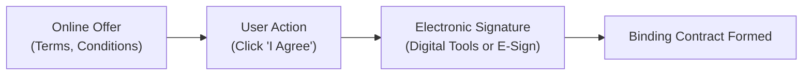

## 8.4 Special Types of Contracts (Sales, Employment, Online Contracts)

In the broad realm of contract law, certain types of agreements—sales of goods, employment contracts, and online contracts—carry unique provisions and considerations. This section explores the foundational legal frameworks and best practices for entering into each. While building on general contractual principles (offer, acceptance, consideration, and mutuality), these specialized forms of contracts also introduce nuanced requirements from statutes (e.g., the Uniform Commercial Code for sales), regulatory guidelines for employment, and evolving legislation for online or “electronic” contracts. This knowledge helps accountants, attorneys, and business professionals identify potential pitfalls, ensure compliance, and structure contracts that precisely capture the intentions of the parties involved.

--------------------------------------------------------------------------------

### Overview of Special Contract Types

Special contracts typically address distinct subject matters or occur within specific relationships. The three most common (and exam-relevant) are:
• Sales of Goods Contracts: Governed by the Uniform Commercial Code (UCC), particularly Article 2.  
• Employment Contracts: Often governed by a mix of state common law, federal regulations, and internal corporate policies.  
• Online (Electronic) Contracts: Governed by the same basic contract principles but adapted to digital transactions and specific statutes such as the Electronic Signatures in Global and National Commerce Act (E-SIGN) and the Uniform Electronic Transactions Act (UETA).

Understanding each type is critical for CPA candidates, especially given the potential tax implications and legal responsibilities that can arise during contract formation, performance, and breach.  

--------------------------------------------------------------------------------

### Sales of Goods Contracts Under the UCC

#### Scope and Application of Article 2

Article 2 of the Uniform Commercial Code (UCC) provides a standardized framework for the sale of “goods,” which are tangible, movable objects. Unlike common law, which broadly governs service and other agreements, the UCC addresses topics such as how sales contracts are formed, when title passes, and how warranties operate. Key points include:

• The UCC emphasizes practicality, flexibility, and economic efficiency.  
• It often permits “gap-fillers” when certain terms (price, delivery time, etc.) are left open.  
• It may adjust traditional contract formation requirements, allowing acceptance through shipment or performance.  

#### Key Provisions in UCC Article 2

1. Formation Requirements  
   • Offer and Acceptance: The UCC adopts flexible rules. A “definite expression of acceptance” can form a contract even if some terms differ from the offer.  
   • Battle of the Forms: Conflicting terms between standardized forms might still yield an enforceable contract, with varying rules depending on whether both parties are merchants.

2. Obligations and Performance  
   • Perfect Tender Rule: The seller is generally required to deliver goods that match the contract in every detail. The buyer may reject goods if they deviate from the terms. Exceptions exist, such as installment contracts and “cure” provisions.  
   • Risk of Loss: The contract’s shipping terms (e.g., FOB Shipping Point vs. FOB Destination) generally determine when risk shifts from the seller to the buyer.

3. Warranties  
   • Express Warranties: Affirmations of fact or promises made by the seller about the goods.  
   • Implied Warranty of Merchantability: Arises automatically when the seller is a merchant with respect to the goods sold, ensuring that products meet normal trade standards.  
   • Implied Warranty of Fitness for a Particular Purpose: Applies when a buyer relies on the seller’s skill or judgment to select suitable goods for a specific use.

4. Remedies  
   • Buyer’s Remedies: Include rejection, cover (purchasing substitute goods and seeking damages), or specific performance in unique circumstances.  
   • Seller’s Remedies: Include withholding delivery, stopping goods in transit, or reselling goods and claiming damages.

#### Practical Example of a Sales Contract

Imagine Firm A (a wholesaler) and Firm B (a retailer) entering into a contract for the purchase of 500 units of an electronic device. Under UCC Article 2:
• Preliminary Issues: Price per unit, delivery date, and method of payment might appear in the purchase order.  
• Risk Transfer: The parties specify FOB Destination, so the seller retains the risk of damage in transit until the goods reach Firm B.  
• Acceptance by Action: Firm A may confirm acceptance by shipping the goods, even if no formal signature is present.

--------------------------------------------------------------------------------

### Employment Contracts

Employment contracts govern the relationship between an employer and an employee. While often formed under state common law, they may also be influenced by:
• Federal Wage and Hour Laws (e.g., Fair Labor Standards Act).  
• Anti-Discrimination Statutes (e.g., Title VII, ADA).  
• Collective Bargaining Agreements (for unionized workforces).  

#### Essential Terms and Clauses

1. Position, Duties, and Scope of Employment  
   • Clear job responsibilities promote mutual understanding and reduce misinterpretations.  
2. Duration of Employment  
   • At-Will Employment: Either party can terminate at any time, subject to limitations (e.g., discrimination, public policy exceptions).  
   • Fixed-Term Contracts: May stipulate a definite term of service (e.g., one year), which can only be abridged according to specific terms or for cause.  
3. Compensation and Benefits  
   • Salary, wages, bonus structures, or commission plans specified alongside benefits such as health insurance, retirement contributions, or stock options.  
4. Confidentiality and Non-Compete Provisions  
   • Post-Employment Restrictions: Many agreements limit employees from divulging proprietary information or competing within a certain time/geographical range upon departure. Enforceability varies by jurisdiction.  

#### Common Law vs. Statutory Considerations

• Contractual Terms vs. Statutory Requirements: Even if an employment contract says “no overtime pay,” it may be unenforceable if it violates federal or state wage laws.  
• Termination Provisions: An “at-will” clause is generally recognized in most states unless superseded by contract terms, collective bargaining, or public policy exceptions (e.g., whistleblower protection).

#### Practical Example of an Employment Contract

Consider a mid-sized accounting firm hiring a senior accountant. The contract may specify:
• Salary: $85,000 per annum, paid monthly.  
• Benefits: Health, dental, and 401(k) with employer match.  
• Non-Compete Clause: Employee agrees not to solicit clients for one year within a 30-mile radius if leaving the firm.  
• Termination Clause: Employment is “at-will,” meaning either the firm or the accountant may terminate the contract, provided the termination does not violate discrimination laws.

--------------------------------------------------------------------------------

### Online (Electronic) Contracts

As commerce shifts increasingly online, contracts are often formed without face-to-face dealings. This includes transactional e-commerce sales, licensing agreements for software, and user agreements on digital platforms.

#### Foundational Principles

Online contract formation primarily follows the same elements of contract law (offer, acceptance, consideration, mutual assent), but with adaptations for electronic communication. Notable statutes include:
• Electronic Signatures in Global and National Commerce (E-SIGN) Act: Validates electronic signatures as legally binding if parties consent.  
• Uniform Electronic Transactions Act (UETA): Provides a framework for state-level recognition of electronic signatures and records.

#### Methods of Contract Formation Online

• Click-Wrap Agreements: Users must affirmatively click an “I Agree” button to be bound by terms and conditions.  
• Browse-Wrap Agreements: Terms are posted on the website; users’ continued use of the site may be interpreted as acceptance. Enforceability often depends on providing clear notice of these terms.  
• E-Sign or Digital Signature Tools: Services like DocuSign or Adobe Sign allow parties to sign electronically with time-stamped, traceable methods.

#### Key Clauses Unique to Online Transactions

• Forum Selection and Choice of Law: Websites often specify which state’s laws govern and where disputes will be resolved.  
• Arbitration Provisions: Many online agreements require arbitration rather than litigation.  
• Privacy Policies: Because personal data may be collected, state and federal privacy laws can require disclosure and consent procedures.  

--------------------------------------------------------------------------------

### Diagram: Typical Formation Stages of an Online Contract

Below is a simple visualization of how electronic contract formation processes typically occur:

Explanation of the Diagram:  
• A["Online Offer   (Terms, Conditions)"]: The seller or website posts terms and conditions.  
• B["User Action   (Click 'I Agree')"]: The user must clearly accept the terms, commonly by clicking an “I Agree” checkbox or button.  
• C["Electronic Signature   (Digital Tools or E-Sign)"]: Optional step where parties can use digital signature services for added security and traceability.  
• D["Binding Contract Formed"]: Once acceptance is sufficiently communicated, a legally enforceable contract is formed.

--------------------------------------------------------------------------------

### Best Practices and Potential Pitfalls

1. Ensuring Mutual Assent and Notice  
   In online contracts, the biggest risk involves disputing whether the user had adequate notice of terms. Make sure disclaimers and terms are visible and require active acknowledgment (e.g., click-wrap).  

2. Compliance with Statutes  
   • Sales Contracts: Comply with UCC provisions on warranty disclaimers and risk of loss, even online.  
   • Employment Contracts: Document digital signatures properly if contracts are executed and stored electronically.  
   • Online Transactions: Ensure compliance with privacy laws (e.g., GDPR, CCPA) if the transaction involves personal data.

3. Unenforceable Clauses  
   Clauses that are unconscionable, overly broad (e.g., indefinite non-competes in employment), or violate public policy may be struck down or voided.

4. Maintaining Accurate Records  
   • For CPA or finance professionals, retention of contract documents can impact tax compliance and financial reporting.  
   • Digital logs, email confirmations, and metadata often serve as the basis for establishing validity.

--------------------------------------------------------------------------------

### Comparative Table: Key Distinctions Among Special Contract Types

| Aspect                     | Sales (UCC)                                   | Employment                              | Online/E-Contracts                                                          |
|----------------------------|-----------------------------------------------|------------------------------------------|----------------------------------------------------------------------------|
| Governing Law             | UCC Article 2 (for goods sales)               | Common law + Federal/State statutes      | Common law + E-SIGN Act + UETA                                              |
| Formation Requirements     | Flexible; allows gap fillers, acceptance by performance | Offer, acceptance, consideration, statutory compliance | Mutual assent but with a unique focus on user notice and consent via electronic tools |
| Key Issues                 | Warranties, risk of loss, perfect tender      | At-will vs. term, compensation, non-competes | Electronic signature validity, privacy policies, enforceability of browse-wrap/click-wrap |
| Notable Statutes/Rules     | UCC, various state adaptations                | FLSA, Title VII, ADA, local labor laws   | E-SIGN Act, UETA, state-specific e-commerce regulations                     |
| Remedies for Breach        | Cover, damages, rejection, revocation of acceptance, specific performance in rare cases | Damages (contractual or statutory), wrongful termination suits, injunctive relief for breaches of non-compete | Injunctions, contract damages, arbitration (if mandated), potential statutory damages for data privacy issues |

--------------------------------------------------------------------------------

### Practical Case Study

A mid-sized technology firm decides to hire a web developer under a one-year contract, primarily working remotely. The same firm also launches a new e-commerce platform to sell software. The following contract considerations arise:

1. Employment Agreement  
   • Clause specifying the developer’s salary and timeline for performance reviews.  
   • A non-disclosure agreement preventing the developer from sharing proprietary code.  
   • Stated that any disputes would be settled in the developer’s home state.

2. Online Sales Contracts  
   • “Click-to-Accept” user agreement for the software license.  
   • Disclaimer of warranties except those mandated by law, plus a “no reverse engineering” clause.  
   • Clear statement of the user’s acceptance of forum selection if disputes arise.

3. UCC Implications  
   • If the software is considered a “good” under certain state interpretations (sometimes intangible), or if physical media or devices are included, UCC Article 2 can apply.  
   • The firm includes disclaimers that match state law requirements for implied warranties of merchantability.  

Through this scenario, we see how these different layers interact. An individual may be a party to multiple specialized contracts (employment and licensing) that each require attention to distinct legal frameworks.

--------------------------------------------------------------------------------

### References for Further Exploration

• “Uniform Commercial Code Article 2: Sales,” published by the National Conference of Commissioners on Uniform State Laws (NCCUSL).  
• E-SIGN Act (15 U.S.C. § 7001): Official text and FAQs from the Federal Trade Commission.  
• UETA: Model legislation texts available from the Uniform Law Commission.  
• Relevant state labor regulations and resource guides from the U.S. Department of Labor.  

--------------------------------------------------------------------------------

## Master the Fundamentals of Special Types of Contracts: Sales, Employment, and E-Contracts Quiz



### Which type of contract is specifically governed by UCC Article 2?

- [x] Contracts for the sale of goods
- [ ] Contracts for services
- [ ] Real property purchase agreements
- [ ] Licensing agreements

> **Explanation:** UCC Article 2 applies solely to goods, which are tangible and movable items.

### In an employment contract, an “at-will” provision typically means:

- [x] Either party may terminate the contract at any time, for most reasons not prohibited by law.
- [ ] The employee must stay for the contract’s entire stated term.
- [ ] The employer must offer severance if the employee leaves.
- [ ] Neither party can terminate the contract without unanimous board approval.

> **Explanation:** At-will employment allows both employer and employee to end the relationship at any time, as long as the reason is not illegal (e.g., discrimination).

### Which of the following statements best describes a “click-wrap” agreement?

- [x] It requires a user to affirmatively click “I Agree” to be bound by the contract terms.
- [ ] It automatically binds a user upon entering a website, regardless of any action taken.
- [ ] It involves sending a paper document to be physically signed.
- [ ] It is prohibited by the E-SIGN Act and similar laws.

> **Explanation:** Click-wrap agreements are enforceable when the user explicitly indicates agreement to the posted terms (e.g., by pressing a button).

### Under the UCC, which type of remedy allows a buyer to purchase substitute goods and seek the difference in price from the original seller?

- [x] Cover
- [ ] Cure
- [ ] Liquidated damages
- [ ] Specific performance

> **Explanation:** “Cover” authorizes the buyer to purchase replacement goods and then recover the difference in cost plus incidental damages.

### Which of the following is NOT generally a component of an enforceable employment agreement?

- [x] A clause requiring employees to work 24 hours a day with no breaks
- [ ] Job title and scope of duties
- [x] An at-will termination provision or specific term of employment
- [ ] Confidentiality and non-compete clauses

> **Explanation:** Contracts attempting to circumvent wage and hour regulations or essential labor protections are generally unenforceable.

### Under E-SIGN, an electronic signature:

- [x] Is generally valid if the parties intended to sign and agreed to use electronic forms.
- [ ] Is only valid if notarized by a state-approved authority.
- [ ] Must be executed on a scanned PDF only.
- [ ] Cannot be recognized in court for B2B transactions.

> **Explanation:** E-SIGN broadly validates electronic records and signatures, provided both parties consent and intend to form a legally binding agreement.

### What is the “Perfect Tender Rule” in a UCC sales contract?

- [x] The seller must deliver the goods exactly as the contract specifies.
- [ ] The buyer must accept nonconforming goods without recourse.
- [ ] The seller can deliver goods in any form or manner over time.
- [ ] The contract requires full payment in advance.

> **Explanation:** The Perfect Tender Rule holds that goods must fully conform to the contract specifications or risk rejection.

### In employment agreements, non-compete clauses:

- [x] Must generally be reasonable in geographic scope and duration to be enforceable.
- [ ] Are unenforceable in all jurisdictions.
- [ ] Are not permissible in federal contracts.
- [ ] Need no justification if signed by both parties.

> **Explanation:** Most jurisdictions only enforce non-competes that are narrowly tailored in time, location, and scope of activity.

### Which of the following factors most significantly affects the enforceability of a “browse-wrap” agreement?

- [x] Whether the user had reasonable notice of the agreement’s terms
- [ ] The type of web browser installed on the user’s computer
- [ ] The total number of users who visited the site
- [ ] The domain extension (e.g., .com vs. .org)

> **Explanation:** For browse-wrap agreements, courts typically look at whether the user was adequately notified of the terms and had an opportunity to review them.

### An employer that requires employees to sign an electronic contract should primarily ensure:

- [x] The electronic signing process captures demonstrable consent and identity.
- [ ] Only a managerial signature is present, ignoring the employee’s response.
- [ ] No references to labor or wage laws are provided.
- [ ] It is sealed with a private key recognized only in foreign jurisdictions.

> **Explanation:** Employers should maintain a reliable way to confirm that the employee intended to sign and had authority to do so, including clear records of acceptance.



--------------------------------------------------------------------------------

## For Additional Practice and Deeper Preparation

### [Taxation & Regulation (REG) CPA Mock Exams](https://www.udemy.com/course/reg-cpa-mock-exams/?referralCode=55419EBD198F61530B12)

**Taxation & Regulation (REG) CPA Mocks:** 6 Full (1,500 Qs), Harder Than Real! In-Depth & Clear. Crush With Confidence!  

- Tackle full-length mock exams designed to mirror real REG questions.  
- Refine your exam-day strategies with detailed, step-by-step solutions for every scenario.  
- Explore in-depth rationales that reinforce higher-level concepts, giving you an edge on test day.  
- Boost confidence and minimize anxiety by mastering every corner of the REG blueprint.  
- Perfect for those seeking exceptionally hard mocks and real-world readiness.  

_Disclaimer: This course is not endorsed by or affiliated with the AICPA, NASBA, or any official CPA Examination authority. All content is for educational and preparatory purposes only._
