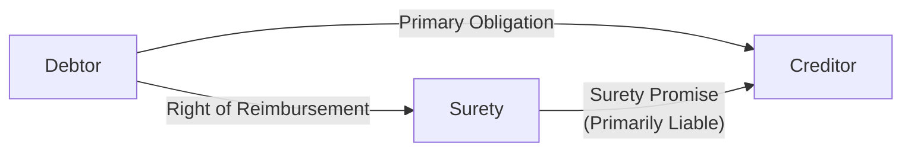
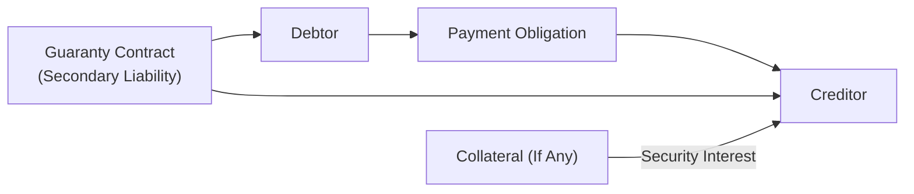

## 9.1 Rights, Duties, and Liabilities of Debtors, Creditors, and Guarantors

This section focuses on the multifaceted relationships among debtors, creditors, and third parties (such as sureties or guarantors) who promise to answer for the debt or default of the primary debtor. Debtor-creditor relationships are central to business transactions, personal lending, and broader economic activity. Additionally, surety and guaranty arrangements (sometimes referred to collectively as “credit enhancements”) play a critical role in enabling debtors with less robust credit histories—or those in need of additional backing—to access financing at more favorable terms. Understanding each party’s rights, obligations, potential liabilities, and possible remedies is essential for navigating these legal relationships.

-------------------------------------------------------------------------------
### Overview of Debtor-Creditor Relationships

A debtor-creditor relationship arises when one party (the debtor) owes a sum of money or an obligation to another (the creditor). This can be formalized through various agreements, including promissory notes, loans, installment contracts, and financial instruments such as bonds. In commercial transactions, debtors and creditors often rely on security interests governed by federal or state law, such as the Uniform Commercial Code (UCC), to ensure repayment. However, a creditor may also extend unsecured credit, in which case the creditor’s remedies are generally narrower, and the risk of nonpayment is higher.

Key Points:  
• Debtors are individuals or entities who owe money or performance.  
• Creditors are those to whom the debt or performance is owed.  
• The nature of the obligation can be secured (collateral-backed) or unsecured.  
• Legal enforcement mechanisms vary based on the type of obligation, state laws, and contract stipulations.

-------------------------------
### Rights of Debtors

Debtors are not entirely without legal protection. Various federal and state laws ensure that creditors do not abuse the collection process and that consumer and commercial debtors are treated fairly. Some important rights of debtors include:

• Right to Notice and Proper Procedure: If a creditor seeks to enforce a security interest (e.g., repossessing collateral in a secured transaction), the debtor is entitled to notice under certain laws (e.g., Article 9 of the UCC). The creditor’s conduct must typically be “commercially reasonable,” and certain steps must be followed prior to foreclosure or repossession.  
• Right to Redemption: Even after default, a debtor often has the right to redeem collateral by paying off the debt (plus any allowable fees or costs) before the creditor has disposed of the property.  
• Protection from Abusive Collection Practices: The Fair Debt Collection Practices Act (FDCPA) federally regulates the conduct of third-party debt collectors in consumer debt situations, prohibiting harassment, false statements, and other unfair practices.  
• Right to Dispute: Debtors can dispute the validity or amount of a debt. If disputed, certain processes (including credit reporting and further collection efforts) may be paused until the dispute is resolved.  
• Exemptions in Bankruptcy or Judgment Enforcement: Debtors may claim exemptions under federal or state law processes, preventing certain assets from being seized by creditors.

-------------------------------
### Duties of Debtors

In general, the primary duty of the debtor is to fulfill the obligation owed to the creditor, whether it be monetary payment or performance of a specific contractual obligation. This duty includes:

• Timely Payment or Performance: The debtor must satisfy the terms of the contract regarding when and how payment should be made.  
• Duty to Preserve Collateral: In secured transactions, the debtor usually has a duty not to damage or dissipate the collateral’s value. Intentionally damaging collateral or disposing of it without the creditor’s consent could lead to legal liability.  
• Good Faith and Fair Dealing: Most contracts, implicitly or by statute, require good faith in their performance. Debtors should avoid fraudulent transfers or activities designed to thwart creditor claims, as these can result in legal remedies against them.  
• Accurate Information: If an agreement requires the debtor to provide financial statements or other representations, those statements must be accurate and honest. Misrepresentations can lead to liability for fraud or breach of contract.

-------------------------------
### Liabilities of Debtors

When a debtor breaches (defaults on) the agreement, significant legal and financial consequences may result:

• Liability for the Outstanding Principal plus Damages: If the debtor fails to pay, they remain liable for the principal due, along with interest if specified in the contract. Courts may also award attorney fees, collection costs, or other damages depending on the terms of the agreement or state law.  
• Loss of Collateral: In a secured transaction, default entitles the creditor to seize or foreclose on the collateral under established procedures.  
• Deficiency Judgment: If the collateral does not satisfy the entire debt, the creditor may seek a deficiency judgment for the remaining amount.  
• Damage to Credit Rating: Defaults frequently appear on consumer and commercial credit reports, affecting future borrowing capability and interest rates.  
• Possibility of Bankruptcy Proceedings: Debtors may seek protection under the Bankruptcy Code or face involuntary bankruptcy petitions from creditors under certain circumstances.

-------------------------------------------------------------------------------
### Rights of Creditors

Creditors aim to maximize the likelihood of repayment. Based on contract terms and applicable law, creditors generally hold the following rights:

• Right to Receive Payment: This obvious right arises from the contractual agreement or from the extension of credit in exchange for a promise to repay.  
• Right to Secure Repayment: In secured transactions, creditors have the right to perfect a security interest in the debtor’s collateral. Perfection (e.g., by filing UCC-1 financing statements) ensures priority over other creditors and can protect the creditor’s claim if the debtor defaults or declares bankruptcy.  
• Enforcement Remedies: Creditors can utilize various remedies upon default, such as repossession of collateral, foreclosure, or seeking money judgments in court. Some creditors may garnish wages or attach bank accounts if permitted by law.  
• Collection of Real or Personal Property: If the indebtedness is secured by real property (mortgages or deeds of trust) or personal property (securities, equipment, inventory), the creditor may employ the foreclosure process to recover and sell the collateral, applying proceeds to the outstanding balance.  
• Right to Acceleration: Many loan agreements include an “acceleration clause,” allowing the creditor to call the entire debt due and payable upon the debtor’s default.

-------------------------------
### Duties of Creditors

Creditor duties are typically aimed at ensuring fairness, transparency, and compliance with consumer protection statutes. These duties include:

• Duty of Reasonable Care and Fair Dealing: This applies mainly to secured creditors responsible for handling and disposing of collateral in a “commercially reasonable” manner.  
• Duty to Disclose: Creditor agreements, especially in consumer contexts, mandate disclosures of interest rates, fees, and other loan terms. Federal laws such as the Truth in Lending Act (TILA) apply to many consumer credit transactions.  
• Duty to Follow Statutory Procedures: Before repossession, foreclosure, or garnishment, creditors must observe certain legal processes and notice requirements. Failure to do so can lead to liability or invalidation of the underlying action.  
• Duty to Mitigate Damages: In some jurisdictions, creditors must conduct collateral disposal or foreclosure sales in a way that attempts to secure a fair price to offset the debtor’s outstanding balance. Unreasonably low sales can be challenged.

-------------------------------
### Liabilities of Creditors

Creditors can face potential liability when they violate contractual terms or statutory requirements. Common sources of creditor liability include:

• Wrongful Repossession or Foreclosure: If a creditor proceeds without notice, violates legal processes, or breaches the peace, the debtor may sue for damages, and the creditor’s claim could be undermined.  
• Violations of Consumer Protection Laws: Noncompliance with statutes like the Fair Debt Collection Practices Act or the Truth in Lending Act can result in statutory damages, attorney fees, and regulatory penalties.  
• Bad Faith or Fraudulent Acts: Creditors who engage in fraudulent schemes or collude to unlawfully impair the debtor’s rights or improperly dispose of collateral face civil (and potentially criminal) sanctions.

-------------------------------------------------------------------------------
### Surety and Guaranty Arrangements

Suretyship and guaranty are arrangements in which a third party promises to fulfill the debt obligation if the primary debtor defaults. While the terms “surety” and “guarantor” are sometimes used interchangeably, important legal distinctions exist. Sureties and guarantors often play critical roles in business lending, construction projects (via performance bonds), and personal loans where additional creditworthiness is required.

-------------------------------
#### Differences Between Surety and Guarantor

• Primary vs. Secondary Liability:
  - Surety: A surety is primarily liable for the debtor’s obligations. Upon default, the creditor can generally proceed directly against the surety without first exhausting remedies against the debtor.  
  - Guarantor: A guarantor is secondarily liable, meaning the creditor typically must attempt to collect from the primary debtor first (or prove such efforts would be futile) before seeking repayment from the guarantor.

• Formation: A suretyship or guaranty contract must usually be in writing to be enforceable, falling under the Statute of Frauds in many jurisdictions.  

• Consent and Consideration: Both suretyship and guaranty arrangements generally require clear consent from the surety/guarantor, and the contract is often supported by the consideration involved in extending credit to the primary debtor.

-------------------------------
#### Rights of Sureties and Guarantors

Despite agreeing to assume liability, sureties and guarantors benefit from several rights and defenses:

• Right of Subrogation: After paying the debtor’s obligation to the creditor, the surety or guarantor inherits (is “subrogated to”) the creditor’s rights to collect from the debtor. This means the surety/guarantor can pursue reimbursement.  
• Right to Indemnification (Reimbursement): The surety or guarantor can seek direct reimbursement from the primary debtor for amounts paid on the debtor’s behalf.  
• Right of Exoneration: The surety or guarantor can petition a court to compel the debtor to pay the creditor before the surety or guarantor has to resort to its own funds.  
• Right of Contribution (Among Co-Sureties): If multiple sureties or guarantors exist, one who pays more than their share may seek contribution from others, ensuring each co-surety’s liability is proportionate.

-------------------------------
#### Duties and Liabilities of Sureties and Guarantors

• Primary or Secondary Nature of Liability: The surety may be sued directly by the creditor upon the debtor’s default. A guarantor might require a specific showing that the debtor cannot pay.  
• Continued Monitoring: In some arrangements, sureties or guarantors may need to monitor the debtor’s performance (especially in performance bonds for construction projects). Failure to detect and mitigate a problem might increase exposure.  
• Potential Defenses: Material alteration of the underlying debt without the surety’s consent, fraud by the creditor, or completion/payment by the debtor can discharge or reduce the surety’s or guarantor’s liability.

------------------------------------------
#### Diagram: Surety Arrangement Flow

Below is a simplified depiction of a surety arrangement. The surety is primarily liable along with the debtor. If the debtor fails to pay, the creditor can directly pursue the surety.

Explanation:  
• The Debtor has a primary obligation to the Creditor.  
• The Surety also has a direct liability toward the Creditor.  
• If the Surety pays the Creditor, the Surety can then seek reimbursement from the Debtor.

-------------------------------------------------------------------------------
### Enforcement Mechanisms

When default occurs, the creditor may utilize several enforcement mechanisms, particularly when there's a surety or guarantor involved:

• Judicial Enforcement / Lawsuits: The creditor files a lawsuit against the debtor and potentially the surety/guarantor if they are directly or secondarily liable.  
• Repossession or Foreclosure: In secured transactions, the creditor may repossess or foreclose on collateral.  
• Garnishment and Attachment: Judgment creditors can garnish wages or attach bank accounts.  
• Enforcement Against the Surety or Guarantor: Depending on the contract, the creditor may act against the surety immediately upon default or only after attempting to collect from the debtor.  
• Execution on Judgment: If the creditor prevails in court, they may seize non-exempt debtor (or surety) assets to satisfy the judgment.

-------------------------------------------------------------------------------
### Common Pitfalls and Best Practices

1. **Ambiguous Contract Language**  
   • Pitfall: Relying on vague wording regarding a party’s liability can lead to disputes over whether someone is acting as a surety or a guarantor.  
   • Best Practice: Ensure that any third-party liability agreement clearly states the scope, terms, and definitions of primary versus secondary liability.

2. **Failure to Perfect Security Interests**  
   • Pitfall: If a creditor neglects to properly file a UCC-1 or follow statutory requirements, they may lose priority.  
   • Best Practice: Creditors should ensure timely perfection of security interests and update filings to maintain priority.

3. **Mismanagement of Collateral**  
   • Pitfall: Improper handling or sale of collateral may expose the creditor to liability or reduce the likelihood of recovering the debt in full.  
   • Best Practice: Conduct all sales and dispositions in a commercially reasonable manner, with notice provided to all relevant parties.

4. **Overlooking Surety/Guarantor Rights**  
   • Pitfall: Sureties or guarantors who do not assert their defenses (e.g., material modification of contract, subrogation rights) may pay more than necessary.  
   • Best Practice: Maintain active communication with creditors and debtors, and ensure any key modifications to the loan agreement involve the surety/guarantor’s formal consent.

5. **Creditors’ Improper Collection Practices**  
   • Pitfall: Creditor representatives might pursue aggressive or illegal collection tactics, risking FDCPA or state law violations.  
   • Best Practice: Train staff on compliance obligations and provide thorough documentation of all communications.

-------------------------------------------------------------------------------
### Practical Example: Construction Loan with a Performance Bond

Consider a construction firm (Debtor) that obtains a $500,000 loan from a bank (Creditor) for a project. The bank requires a surety bond (Performance Bond) from a third-party surety company. Should the construction firm default on payments:

1. The bank can enforce the bond directly against the surety company (Surety), because the surety is primarily liable under the performance bond arrangement.  
2. The surety company, once it pays the bank, can exercise subrogation rights against the construction firm.  
3. The surety company might also seek indemnity from the firm’s assets if the contract contains indemnification clauses, which they commonly do.  

This arrangement assures the bank it will recover its investment if the construction firm fails to perform, while the surety has contractual remedies against the construction firm to recoup any losses.

-------------------------------------------------------------------------------
### Practical Example: Guarantor of a Small Business Loan

A small business owner (Debtor) borrows $50,000 from a local bank (Creditor). Since the business is young, the bank requests the borrower’s personal acquaintance (Guarantor) sign a contract guaranteeing repayment if the business cannot meet its obligations. Under this arrangement:

1. The bank must typically demonstrate that it has attempted to collect from the small business first (for instance, verifying that the business lacks sufficient funds).  
2. Upon establishing the business’s inability to pay, the bank can then turn to the guarantor under the guarantee contract.  
3. If the guarantor ultimately pays, they can seek reimbursement from the debtor (the small business), or claim a share of ownership or secured interest in the business, depending on the terms of their agreement.

-------------------------------------------------------------------------------
### Table: Key Differences at a Glance

| Aspect                     | Surety (Primary Liability)                                                  | Guarantor (Secondary Liability)                                            |
|----------------------------|-----------------------------------------------------------------------------|----------------------------------------------------------------------------|
| Enforceability by Creditor | Creditor can often proceed directly against surety upon default             | Creditor typically must first seek payment from debtor                     |
| Legally Required Form      | Must be in writing (Statute of Frauds)                                      | Must be in writing (Statute of Frauds)                                     |
| Common Usage               | Construction performance bonds, co-signers on a loan                        | Personal guarantees for small business loans, corporate credit lines       |
| Defenses Against Liability | Fraud, material change in contract, payment by debtor, modifications        | Fraud, material change in contract, payment by debtor, modifications       |
| Right of Subrogation       | Yes, after paying the creditor                                              | Yes, after paying the creditor                                             |
| Right to Exoneration       | Yes, can force debtor to pay as a matter of equity                          | Yes, but typically arises after exhaustion of remedies against the debtor  |

-------------------------------------------------------------------------------
### Real-World Considerations

1. **Creditworthiness Assessment**: Before agreeing to act as a surety or guarantor, individuals and businesses should conduct a thorough analysis of the debtor’s creditworthiness and risk of default.  
2. **Collateral and Security Interests**: Creditors may require additional security or personal guarantees when the debtor’s assets are insufficient. Double-layer protection—collateral plus a guarantor—reduces credit risk.  
3. **Negotiating Indemnity Agreements**: Sureties often require the debtor to sign an indemnity agreement to recoup any outlay. This agreement may reach the debtor’s personal or business assets.  
4. **Bankruptcy Impact**: In debtor bankruptcy proceedings, a surety or guarantor might still be liable. However, certain bankruptcies or reorganizations may discharge or alter the underlying debt, thereby affecting third-party liability.  
5. **State and Federal Regulations**: Always consider consumer protection statutes and local regulatory requirements. For consumer debts, additional constraints often exist, such as mandatory disclosures, cooling-off periods, and usury laws limiting interest rates.

-------------------------------------------------------------------------------
### Mermaid Diagram: Debtor-Creditor-Guarantor Relationship

To illustrate the flow of obligations and rights shared among all parties, here is a conceptual diagram:

Explanation:  
1. The Debtor has a primary obligation to the Creditor.  
2. The Guarantor, through the guaranty contract, has a secondary liability to the Creditor (the Creditor generally must attempt to collect from the Debtor first).  
3. Collateral, if provided, further secures the creditor’s claim.  
4. If the Debtor does not pay, the Creditor may collect from the Guarantor (if the Debtor is deemed unable to fulfill the debt) and/or enforce the collateral.

-------------------------------------------------------------------------------
### Strategic Tips for Exam Preparation

• Familiarize yourself with the UCC’s provisions relevant to secured transactions and suretyship. Pay particular attention to clarity around the differences between “suretyship” and “guaranty,” as this distinction frequently appears on exams.  
• Practice identifying the rights of subrogation, exoneration, and reimbursement in hypothetical scenarios, as these are classic test topics.  
• Understand how modifications to the underlying contract can discharge or reduce surety or guarantor liability.  
• Review the statutory requirements for perfecting and enforcing security interests (e.g., UCC Article 9), as questions often focus on timing and priority.  
• Pay attention to the differences in enforcement remedies for secured and unsecured creditors, and how a judgment creditor can collect through garnishment or liens.

-------------------------------------------------------------------------------
## Quiz on Debtor, Creditor, and Guarantor Liabilities



### Which statement accurately explains the difference between a surety and a guarantor?
- [x] A surety is primarily liable for the underlying obligation, while a guarantor is only secondarily liable.
- [ ] A surety is always required to sign a separate agreement, but a guarantor is not.
- [ ] A surety’s liability is contingent upon the debtor first refusing to pay, unlike a guarantor.
- [ ] A guarantor can be sued directly by the creditor, whereas a surety cannot.

> **Explanation:** Sureties are primarily liable, meaning the creditor may proceed directly against the surety upon default. Guarantors, in contrast, are secondarily liable.

### What is the main purpose of perfecting a security interest?
- [x] To establish priority over other creditors’ claims on collateral.
- [ ] To ensure the debtor repays the loan without default.
- [ ] To convert unsecured debt into equity for the creditor.
- [ ] To grant the creditor immunity from debtor-initiated lawsuits.

> **Explanation:** Perfection, such as filing a UCC-1 financing statement, secures a creditor’s priority in the collateral against claims from subsequent creditors or bankruptcy trustees.

### Which of the following is a characteristic right that sureties or guarantors typically hold after paying off the debtor’s liability?
- [x] The right of subrogation.
- [ ] The right of offset.
- [ ] The right to foreclose on the debtor’s personal residence without court intervention.
- [ ] Automatic discharge from future obligations to the creditor.

> **Explanation:** Subrogation allows the surety or guarantor to step into the creditor’s shoes and seek repayment from the debtor.

### In most jurisdictions, a guarantor’s liability arises:
- [x] Only after the debtor has failed to meet the obligation and efforts to collect from the debtor have been made (or deemed futile).
- [ ] Simultaneously and on the same legal footing as the principal debtor.
- [ ] Immediately upon demand by the creditor, without need to pursue the debtor.
- [ ] Only if the debtor has fraudulently obtained credit.

> **Explanation:** Because a guarantor is secondarily liable, the creditor generally must first pursue the principal debtor or show that collection is futile before requiring payment from the guarantor.

### If a surety pays the creditor in full for a debtor’s default, which defense could a debtor potentially raise to avoid reimbursements owed to the surety?
- [x] That the surety agreed to pay without expecting repayment from the debtor.
- [ ] That the surety is primarily liable and cannot recover from the debtor as a matter of law.
- [x] That material modifications to the loan by the creditor discharged the surety’s liability entirely.
- [ ] That the surety’s written contract was never filed with the county clerk’s office.

> **Explanation:** If the surety has unequivocally agreed or if the surety’s liability was discharged, the debtor might successfully argue no reimbursement is owed. Material modifications without the surety’s consent can also discharge or limit the surety’s liability. (In practice, the details can be intricate, but these are recognized defenses.)

### Which of the following best describes an acceleration clause in a loan agreement?
- [x] A contract provision allowing the creditor to demand the entire amount due if the debtor defaults.
- [ ] A requirement that the debtor pay an increasing interest rate over time.
- [ ] A clause that automatically extends the maturity date in the event of default.
- [ ] A statement that prevents collecting attorneys’ fees.

> **Explanation:** Acceleration clauses let creditors call the entire balance due when a specified event of default occurs, often used to expedite repayment efforts.

### What remedy is typically available to a surety if the creditor and debtor materially modify the original obligation without the surety’s consent?
- [x] The surety may be completely or partially discharged from liability.
- [ ] The surety may seek punitive damages from the creditor and debtor.
- [x] The surety automatically acquires the debtor’s assets through subrogation.
- [ ] No remedy exists if the modification was made in good faith.

> **Explanation:** A significant or material modification to the original obligation, performed without the surety’s consent, can discharge or reduce the surety’s liability since the surety’s risk has been altered.

### Which is a key difference in enforcement remedies between a creditor who holds a perfected security interest in collateral and one who does not?
- [x] The perfected creditor has priority to seize and sell the collateral to satisfy the debt.
- [ ] The unperfected creditor retains broader statutory protections against the debtor’s claims.
- [ ] The perfected creditor cannot garnishee wages, whereas the unperfected creditor can.
- [ ] There is no difference in remedies if both parties hold the same type of lien.

> **Explanation:** Perfected security interests take priority over subsequent liens, creditors, and bankruptcy trustees, allowing the perfected creditor to seize the collateral first.

### If multiple sureties exist for the same debt, and one surety pays more than their share of the obligation, which legal right typically applies?
- [x] Right of contribution.
- [ ] Right to disclaim.
- [ ] Right of partial forfeiture.
- [ ] Right to foreclosure.

> **Explanation:** The surety who paid in excess of their proportionate share can seek contribution from the other co-sureties to balance the obligation fairly.

### A surety’s possible defense of “exoneration” generally refers to:
- [x] A court order compelling the primary debtor to pay the creditor so that the surety is not called upon to pay.
- [ ] A statutory immunity that protects the surety from paying anything more than attorneys’ fees.
- [ ] The surety’s right to forcibly seize the debtor’s property.
- [ ] A constitutional protection preventing sureties from being charged criminally.

> **Explanation:** Exoneration permits the surety to request a court to require the debtor to fulfill the obligation before the surety is expected to pay.



-------------------------------------------------------------------------------
## For Additional Practice and Deeper Preparation

### [Taxation & Regulation (REG) CPA Mock Exams](https://www.udemy.com/course/reg-cpa-mock-exams/?referralCode=55419EBD198F61530B12)

Taxation & Regulation (REG) CPA Mocks: 6 Full (1,500 Qs), Harder Than Real! In-Depth & Clear. Crush With Confidence!

- Tackle full-length mock exams designed to mirror real REG questions.  
- Refine your exam-day strategies with detailed, step-by-step solutions for every scenario.  
- Explore in-depth rationales that reinforce higher-level concepts, giving you an edge on test day.  
- Boost confidence and minimize anxiety by mastering every corner of the REG blueprint.  
- Perfect for those seeking exceptionally hard mocks and real-world readiness.

_Disclaimer: This course is not endorsed by or affiliated with the AICPA, NASBA, or any official CPA Examination authority. All content is for educational and preparatory purposes only._
