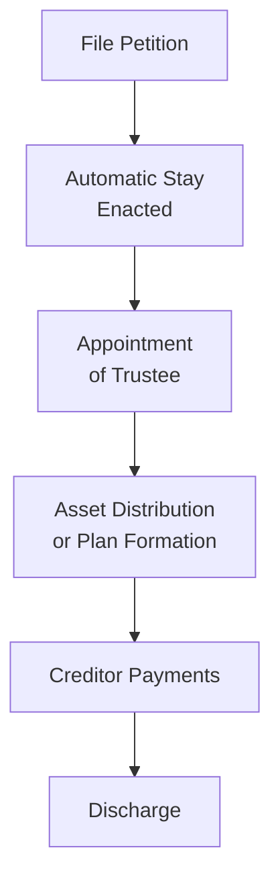

## 9.2 Bankruptcy Basics and the Bankruptcy Abuse Prevention and Consumer Protection Act of 2005

Bankruptcy law balances the interests of creditors seeking repayment with those of debtors who legitimately require financial relief. In the U.S., bankruptcies are governed primarily by federal law under Title 11 of the U.S. Code, commonly referred to as the Bankruptcy Code. Within the Code, various “chapters” outline the procedures and requirements for different types of bankruptcy. This section explores the key concepts of Chapters 7, 11, and 13; examines how priority claims and the automatic stay operate; and discusses how the Bankruptcy Abuse Prevention and Consumer Protection Act of 2005 (BAPCPA) revised many aspects of consumer and business bankruptcies, including eligibility, means testing, and dischargeable debts.

---------------------------------------------------------------------------------
### Overview of the Bankruptcy Code and Purpose
Bankruptcy filings typically serve two primary purposes:
1. Provide debtors with a fresh financial start by discharging certain debts.  
2. Ensure fair and equitable treatment among creditors according to established priority rules.

Before a debtor can obtain relief under the Bankruptcy Code, they must meet specific procedural requirements. Central to these requirements are petition filing, disclosure, and post-petition administration. Each chapter’s framework also provides unique rules for handling assets, reorganizing operations, repaying creditors, and/or discharging debts.

---------------------------------------------------------------------------------
### Bankruptcy Under Chapter 7 (Liquidation)

Chapter 7, known as “straight bankruptcy” or “liquidation bankruptcy,” is designed for individuals and business entities (partnerships, corporations, or LLCs) whose debts surpass their ability to pay. Under Chapter 7:

• A trustee marshals and liquidates the debtor’s non-exempt assets.  
• Proceeds are then distributed to creditors based on statutory priorities.  
• Most remaining unsecured debts are discharged, freeing the individual debtor from personal liability.  

However, certain debts—such as child support, recent tax liabilities, and student loans—often remain non-dischargeable. Businesses that file Chapter 7 do not generally receive a discharge; instead, the entity ceases operations and is liquidated.

#### The Means Test Under BAPCPA
The Bankruptcy Abuse Prevention and Consumer Protection Act of 2005 (BAPCPA) introduced a “means test” to curb perceived abuses of Chapter 7. The means test helps determine if a debtor has sufficient disposable income to repay creditors under Chapter 13. If the debtor exceeds a state-by-state median income threshold and can afford to pay back a portion of debts, the court may dismiss the Chapter 7 case or convert it to Chapter 13, requiring the debtor to propose a repayment plan.

---------------------------------------------------------------------------------
### Bankruptcy Under Chapter 11 (Reorganization)

Chapter 11 is the reorganization chapter primarily used by businesses (though individuals whose debts exceed certain thresholds may also file). The goal is to allow a debtor to continue operating while devising a plan to restructure debt. Key elements include:

• Debtor-in-Possession (DIP): Debtors often remain in control of the business and continue day-to-day operations.  
• Reorganization Plan: Debtors propose a plan to repay creditors over time or modify debt obligations, subject to creditor votes and court approval.  
• Confirmation: The court confirms the reorganization plan if it meets the “best interests” test (creditors would receive more under the proposed plan than in liquidation), is proposed in good faith, and is feasible.  

Following a successful reorganization, a Chapter 11 discharge relieves the debtor from liability on discharged debts outlined in the plan. This process can be complex and lengthy, but it can ultimately preserve jobs, supply chains, and going-concern value.

---------------------------------------------------------------------------------
### Bankruptcy Under Chapter 13 (Wage Earner’s Plan)

Chapter 13 provides individuals with regular income the opportunity to retain assets while repaying creditors under a court-approved plan, typically lasting three to five years. Key points:

• Automatic Stay: Halts creditor collection actions and, under certain circumstances, can help debtors avoid foreclosure on their homes.  
• Repayment Plan: The debtor proposes a plan based on disposable income, ensuring that unsecured creditors receive at least as much as they would under a Chapter 7 proceeding.  
• Priority Claims: Certain claims (e.g., domestic support obligations and taxes) must be paid in full during the plan.  
• Discharge: Upon successful plan completion, remaining eligible debts are discharged.  

Chapter 13 is often chosen by higher-income individuals who either do not qualify for Chapter 7 under the means test or prefer a structured repayment approach to protect certain assets.

---------------------------------------------------------------------------------
### Priority Claims

In bankruptcy, not all debts are treated equally. The Bankruptcy Code specifies a hierarchy, or “priority,” to determine which creditors get paid first from a debtor’s available estate. Some of the top priority claims include:

1. Domestic Support Obligations (e.g., alimony, child support).  
2. Administrative Expenses (e.g., legal fees for administering the estate, trustee fees).  
3. Employee Wage Claims (up to a specified cap) and certain employee benefit plan contributions.  
4. Certain Taxes (unpaid income taxes that are relatively recent, withheld payroll taxes, etc.).  

After the priority claims are paid in accordance with statutory rules, any remaining funds are used to satisfy non-priority unsecured claims (e.g., credit card debt, medical bills, unsecured personal loans). If no estate funds remain, those lower-priority creditors receive little to no recovery.

---------------------------------------------------------------------------------
### The Automatic Stay

The automatic stay under Section 362 of the Bankruptcy Code is one of the most powerful protections afforded to debtors. When a debtor files a bankruptcy petition (voluntarily or involuntarily), the automatic stay immediately becomes effective. Creditors must cease virtually all collection efforts, including:

• Lawsuits to collect debts.  
• Wage garnishments.  
• Foreclosures and repossessions.  
• Harassing phone calls and demand letters.

The scope of the automatic stay has limits; for instance, criminal proceedings do not stop, and certain domestic support actions continue. Also, repeated or abusive filings may limit or eliminate the automatic stay if the court believes the debtor is misusing bankruptcy protections.

---------------------------------------------------------------------------------
### Dischargeable and Nondischargeable Debts

The ultimate goal for many individual debtors is the “discharge”—the court order that wipes out personal liability for certain debts. However, not all debts are dischargeable:

• Common Dischargeable Debts  
  – Credit card balances  
  – Medical bills  
  – Personal loans without collateral  

• Common Nondischargeable Debts  
  – Recent tax obligations and taxes related to fraudulent returns  
  – Student loans (unless the debtor demonstrates undue hardship)  
  – Domestic support obligations (alimony and child support)  
  – Government fines and criminal restitution  
  – Debts incurred through fraud, embezzlement, or larceny  

Under BAPCPA, the scope of nondischargeable debts expanded, and creditors gained broader means to challenge discharge. The law also added stricter requirements for credit counseling and financial management education, ensuring that individuals fully understand the implications and responsibilities tied to the bankruptcy process.

---------------------------------------------------------------------------------
### Key Changes Enacted by the Bankruptcy Abuse Prevention and Consumer Protection Act of 2005 (BAPCPA)

BAPCPA, effective in 2005, modified various aspects of personal and small-business bankruptcies to reduce perceived abuses. Significant alterations include:

1. Means Test Requirement  
   – Individuals filing Chapter 7 who exceed their state’s median income and have sufficient disposable income must file under Chapter 13 or dismiss their case.  

2. Mandatory Credit Counseling  
   – Debtors have to complete a government-approved credit counseling session before filing.  
   – This aims to explore alternatives to bankruptcy and encourage prudent financial planning.  

3. Financial Management Education  
   – Debtors must complete a post-petition financial management course before receiving a discharge.  

4. Restrictions on Automatic Stay  
   – BAPCPA limited the automatic stay for debtors with prior filings. If the debtor had a previous bankruptcy dismissed within one year, the stay expires 30 days after filing unless extended by the court.  

5. Expanded Categories of Nondischargeable Debts  
   – Certain cash advances or luxury goods purchased shortly before bankruptcy may be presumed nondischargeable.  
   – Additional protections for domestic support obligations.  

Overall, BAPCPA made consumer bankruptcies more rigorous, with new administrative burdens designed to discourage strategic or repeated filings and ensure that those who can pay back creditors do so.

---------------------------------------------------------------------------------
### Practical Example

Imagine an individual, Alex, who lost a job and accrued substantial credit card debt. Eventually regaining employment, Alex attempts to repay obligations but finds the debt overwhelming. Alex decides to file under Chapter 7, hoping for a full discharge. Because of a relatively high income, Alex’s finances are subjected to the means test. If Alex’s disposable income surpasses the threshold, Alex might be forced into Chapter 13 to repay a portion of the debt over three to five years. Additionally, Alex must complete credit counseling before filing, then attend a post-filing financial education course to qualify for discharge.

In a corporate context, suppose a restaurant chain is struggling financially but believes it can survive if it can renegotiate leases, restructure secured and unsecured debt, and continue operating. Filing for Chapter 11 allows the company to reorganize, propose a plan to creditors, and potentially emerge stronger while retaining employees and its brand presence.

---------------------------------------------------------------------------------
### Case Study: Balancing Creditor Interests in a Chapter 13 Filing

A single mother, Brooke, falls behind on mortgage payments due to temporary unemployment. Concerned about foreclosure, Brooke consults a bankruptcy attorney and decides on Chapter 13. Because Brooke now has stable employment, she can propose a plan to pay off mortgage arrears over five years. The automatic stay halts foreclosure, allowing Brooke and her family to stay in their home. However, during these five years, Brooke must be vigilant in submitting timely payments to the appointed trustee and keeping up with ongoing mortgage obligations. Failure to do so risks dismissal of the case—reinstating creditor collection efforts.

---------------------------------------------------------------------------------
### Visualizing the Bankruptcy Process

Below is a simplified Mermaid.js diagram showing the general flow of bankruptcy from petition to discharge:

• “File Petition” can be voluntary (debtor-initiated) or involuntary (creditor-initiated).  
• The “Automatic Stay” stops most creditor actions immediately.  
• The “Trustee” administers the estate under Chapter 7 or oversees plan confirmation in Chapter 13.  
• “Asset Distribution or Plan Formation” indicates liquidation (Chapter 7) or a reorganization plan (Chapter 11 or 13).  
• “Creditor Payments” are made according to priority rules under Chapter 7 or plan provisions under Chapters 11 or 13.  
• “Discharge” concludes the debtor’s main responsibilities toward dischargeable debts.

---------------------------------------------------------------------------------
### Common Pitfalls in Bankruptcy and Strategies for Success

1. Failing to Complete Mandatory Counseling  
   – BAPCPA requires pre-filing credit counseling. Missing this step can lead to dismissal.  
   – Strategy: Complete counseling early, ensuring the certificate of completion is addressed.

2. Misrepresenting Assets or Income  
   – Intentionally hiding assets, underreporting income, or providing false information may lead to denial of discharge or criminal penalties.  
   – Strategy: Seek professional advice to accurately disclose and value assets.

3. Ignoring Priority Debt Obligations  
   – Even after bankruptcy, certain “priority” obligations remain.  
   – Strategy: Budget carefully for domestic support obligations and certain taxes.

4. Accumulating New Debt Pre-Filing  
   – Luxury purchases or large cash advances immediately before filing may be presumed nondischargeable and could signal abuse.  
   – Strategy: Avoid unnecessary debt once bankruptcy is likely; consult with a legal professional.

5. Missing Plan Payments in Chapter 13  
   – Failure to adhere to the repayment schedule can result in a case dismissal and loss of bankruptcy protections.  
   – Strategy: Regularly review and adjust budget to stay current on plan payments and ongoing living expenses.

---------------------------------------------------------------------------------
### Best Practices for Professionals and Examinees

• Thoroughly Understand the Means Test Formula: This calculation is critical in determining whether a debtor may proceed under Chapter 7 or shift to Chapter 13.  
• Confirm Priority Claim Status: Mistakes in identifying priority claims can lead to plan confirmation delays or distribution errors.  
• Leverage the Automatic Stay Correctly: Ensure clients or debtors do not violate court orders.  
• Stay Current with BAPCPA Amendments: Legislative changes can adjust filing requirements or dischargeability rules.  
• Encourage Long-Term Financial Planning: Post-bankruptcy, focus on budget management and savings for clients to help them avoid repeated filings.

---------------------------------------------------------------------------------
### Additional References

1. U.S. Bankruptcy Code (Title 11, U.S.C.)  
2. Official Website of U.S. Courts for Bankruptcy:  
   – https://www.uscourts.gov/services-forms/bankruptcy  
3. Government-Approved Credit Counseling Agencies  
4. AICPA’s Professional Standards and Ethics  
5. IRS Publications for Tax-Related Debts and Liens

---------------------------------------------------------------------------------

## Mastering Bankruptcy and BAPCPA: Comprehensive Quiz



### Under Chapter 7, which of the following is the primary role of the trustee?
- [ ] To approve a reorganization plan.
- [ ] To serve as the debtor-in-possession.
- [x] To liquidate non-exempt assets and distribute proceeds.
- [ ] To monitor the debtor’s ongoing operations.

> **Explanation:** In Chapter 7, the trustee liquidates the debtor’s non-exempt assets and distributes the proceeds to creditors in accordance with statutory priorities.

### Which statement best describes the “automatic stay” in bankruptcy?
- [ ] It allows secured creditors to foreclose without restriction.
- [ ] It is a court order issued only upon request.
- [x] It halts most creditor actions immediately upon filing a petition.
- [ ] It only applies to Chapter 13 bankruptcies.

> **Explanation:** The automatic stay goes into effect automatically when the bankruptcy petition is filed, stopping nearly all creditor collection efforts.

### Which claim typically holds “priority” status in bankruptcy?
- [ ] Credit card debt.
- [x] Domestic support obligations (child support, alimony).
- [ ] Unsecured student loans.
- [ ] Auto loan deficiency balances.

> **Explanation:** Domestic support obligations are at the top of the priority list, ensuring they are paid first when funds are available.

### Which of the following is generally a nondischargeable debt?
- [ ] Credit card debt.
- [x] Recent tax obligations or debts arising from fraud.
- [ ] Medical bills.
- [ ] Personal loans without collateral.

> **Explanation:** Under the Bankruptcy Code, certain debts like recent taxes, fraud-related debts, student loans (absent undue hardship), and child support are nondischargeable.

### What was a key purpose of the Bankruptcy Abuse Prevention and Consumer Protection Act of 2005 (BAPCPA)?
- [ ] To eliminate the automatic stay for most debts.
- [x] To implement the means test to reduce abuse of Chapter 7 filings.
- [ ] To abolish Chapter 13 bankruptcies.
- [x] To require mandatory financial counseling for prospective filers.

> **Explanation:** BAPCPA introduced stricter requirements, including the means test and mandatory counseling, to curb perceived abuses of the bankruptcy system.

### Which of the following is true regarding Chapter 13 bankruptcies?
- [x] The debtor creates a repayment plan lasting three to five years.
- [ ] It is strictly for corporations and large partnerships.
- [ ] There is no trustee oversight in Chapter 13.
- [ ] The plan does not require court approval.

> **Explanation:** Individuals with regular income use Chapter 13 to propose a repayment plan that spans three to five years, under the supervision of a trustee and subject to court approval.

### Under BAPCPA, if a debtor’s income exceeds their state’s median income, what happens?
- [x] They may be required to file under Chapter 13 instead of Chapter 7.
- [ ] They automatically receive a discharge of all debts.
- [x] They are exempt from the means test due to high income.
- [ ] They must wait at least five years to file for bankruptcy again.

> **Explanation:** Under BAPCPA, debtors with income above the median are subject to the means test to determine if they can afford to repay creditors under Chapter 13.

### In Chapter 11, which party typically remains in control of the business during the reorganization?
- [ ] The appointed trustee.
- [x] The debtor-in-possession (DIP).
- [ ] The U.S. Attorney General.
- [ ] The major unsecured creditors.

> **Explanation:** Under Chapter 11, the debtor often remains in possession of assets and manages day-to-day operations while formulating a reorganization plan.

### Which of the following can occur if the debtor fails to make timely Chapter 13 plan payments?
- [x] The case can be dismissed.
- [ ] The debtor automatically converts to Chapter 11.
- [ ] The debtor receives an immediate discharge.
- [ ] The trustee eliminates all priority debts.

> **Explanation:** If the debtor misses plan payments, the court or trustee can move to dismiss the case, lifting bankruptcy protections.

### The means test introduced by BAPCPA was primarily designed to:
- [x] Prevent higher-income debtors from abusing Chapter 7.
- [ ] Eliminate all secured debts for low-income filers.
- [ ] Simplify the bankruptcy petition.
- [ ] Permit indefinite extensions of the automatic stay.

> **Explanation:** The means test ensures that higher-income debtors who can repay a portion of their debts do so under Chapter 13 rather than liquidating under Chapter 7.



---------------------------------------------------------------------------------

## For Additional Practice and Deeper Preparation

### [Taxation & Regulation (REG) CPA Mock Exams](https://www.udemy.com/course/reg-cpa-mock-exams/?referralCode=55419EBD198F61530B12)

Taxation & Regulation (REG) CPA Mocks: 6 Full (1,500 Qs), Harder Than Real! In-Depth & Clear. Crush With Confidence!

- Tackle full-length mock exams designed to mirror real REG questions.  
- Refine your exam-day strategies with detailed, step-by-step solutions for every scenario.  
- Explore in-depth rationales that reinforce higher-level concepts, giving you an edge on test day.  
- Boost confidence and minimize anxiety by mastering every corner of the REG blueprint.  
- Perfect for those seeking exceptionally hard mocks and real-world readiness.  

_Disclaimer: This course is not endorsed by or affiliated with the AICPA, NASBA, or any official CPA Examination authority. All content is for educational and preparatory purposes only._
