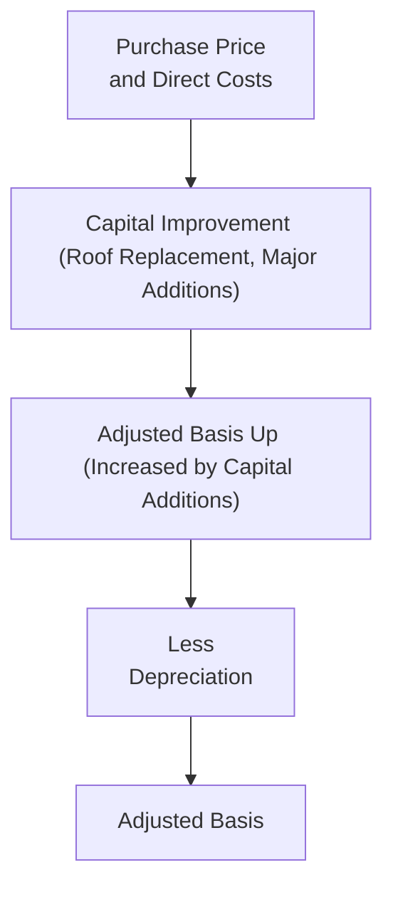

## 12.1 Calculation of Original Basis and Adjustments

Accurately determining and maintaining an asset’s basis is critical for federal tax purposes. Whether dealing with everyday property acquisitions or preparing for a major business combination, understanding how basis is established and adjusted can significantly affect taxable gains and losses. The asset’s basis figure forms the backbone of any gain or loss calculation upon sale or disposition and often influences depreciation deductions, cost recovery, and capital improvement treatment over the course of ownership.

This section provides an in-depth exploration of how to calculate original basis, the typical cost components that get included, and the subsequent adjustments that either increase or reduce that basis. We will also illustrate these concepts with practical examples, real-world case studies, and diagrams.

-------------------------------------------------------------------------------

### Importance of Basis

The term “basis” in tax language refers to the numerical value from which taxpayers calculate depreciation, determine taxable gains or losses, and figure out various tax-advantaged transactions like like-kind exchanges. A thorough mastery of basis concepts ensures taxpayers do not inadvertently misstate depreciation (decreasing basis incorrectly) or neglect legitimate adjustments (failing to increase basis after capital improvements). Errors in basis calculations are a common source of tax disputes and can lead to overpayment or underpayment of taxes.

Below is an illustrative flowchart of the typical steps in determining an asset’s original basis and making ongoing adjustments:

-------------------------------------------------------------------------------

### Establishing Original Basis

The first step is determining the “original basis,” sometimes referred to as the cost basis. Typically, for purchased property, cost basis equals the amount paid in cash or cash equivalents, plus any liabilities assumed as part of the purchase. This cost basis is the foundation from which all further adjustments are made.

#### Purchase Price

• The straightforward element of basis is the actual amount paid to acquire the property.  
• If acquired in an arm’s-length transaction (e.g., from an unrelated party), the purchase price is generally the best indicator of the property’s fair market value (FMV).

#### Direct Acquisition Costs

Alongside the purchase price, certain direct costs must be added to form the basis. These include:  
• Sales Tax: If the asset is subject to sales tax, that tax often must be capitalized into the asset’s cost.  
• Shipping and Freight: Transportation fees related to delivering the asset to its intended location.  
• Installation Charges: Costs associated with setting up or installing equipment. Examples might include wiring, configuring, or testing the asset for its intended use.  
• Title Fees, Escrow Fees, and Recording Fees (Real Property): Any legal fees spent to secure ownership of real property, including payments to title companies, are generally added to the basis.  
• Appraisal Fees (for Purchase): If an appraisal is part of a purchase negotiation (not merely for lending purposes after the fact), the cost may be included in the basis.

#### Lump-Sum and Allocated Basis

When multiple assets are acquired as part of a single bargain purchase, the total acquisition cost needs to be allocated among the various assets according to their relative fair market values. For instance, purchasing a building and land in one transaction requires allocating a portion of the cost to the building and a portion to the land, since land is not depreciable but buildings are. This concept also applies to the purchase of a business, where intangible assets (e.g., goodwill) and tangible assets (e.g., machinery) must have an allocated basis.

#### Cost Basis for Self-Constructed Assets

When a taxpayer constructs an asset, the original basis generally includes direct construction costs (such as materials and labor) plus a reasonable share of indirect costs (e.g., overhead). However, certain costs like research and development or some administrative overhead may be expensed immediately, depending on the nature of the project and applicable tax law.

-------------------------------------------------------------------------------

### Common Basis Increases (Adjustments That Increase Basis)

After an asset is placed into service, the basis may be subsequently increased by certain capital improvements or other costs. Properly categorizing costs as repair/maintenance (current deductions) vs. capital improvements (basis adjustments) is essential. Capital improvements generally extend the asset’s useful life, enhance its value, or adapt it for a new use. Some typical basis-increasing events include:

• Major Renovations or Improvements: Adding a new roof, expanding a building, or significantly upgrading existing structures.  
• Legal and Permitting Costs Related to Improvements: Permits and attorney fees for defending or perfecting title when the improvements are essential to maintain or enhance the value of the property.  
• Special Assessments: If a local government imposes a special assessment for substantial improvements to public infrastructure that benefits the taxpayer’s property (e.g., sidewalks, street lights, sewer expansions), these costs are typically added to basis.  
• Restoration After Casualty Loss: If an event (such as a hurricane or fire) damages property, and the taxpayer restores the asset, these expenses may increase basis to the extent they are not compensated by insurance proceeds.

-------------------------------------------------------------------------------

### Common Basis Decreases (Adjustments That Reduce Basis)

Taxpayers must also reduce the basis of property for events and deductions that effectively return part of their initial cost or value. The goal is to prevent “double dipping” (i.e., receiving a deduction that also remains in the asset’s basis). Examples include:

• Depreciation or Cost Recovery: Most tangible personal property, real estate, and certain intangibles are depreciated or amortized for tax purposes. The cumulative amount of depreciation or amortization must be subtracted from the asset’s basis.  
• Casualty Losses: If a portion of the property is destroyed or severely damaged, and the taxpayer takes a casualty loss deduction, the basis must be reduced by the amount of the deduction.  
• Partial Dispositions: When a portion of the asset is sold, exchanged, or otherwise disposed of, the original basis must be proportionally reduced to reflect the portion still owned.  
• Insurance Reimbursements: If a taxpayer receives insurance proceeds to compensate for a loss or damage, any potential deduction or reduction in basis must be adjusted to reflect the net out-of-pocket expense.

-------------------------------------------------------------------------------

### Special Basis Situations

While the majority of assets follow the straightforward “purchase price plus costs” method, special rules exist for certain types of property or methods of acquisition.

#### Asset Acquisitions from Related Parties

Related-party transactions often have unique basis rules designed to prevent taxpayers from artificially shifting basis or capturing losses. For instance, if a taxpayer sells property at a loss to a related party, the loss may be disallowed, which can affect the related party’s basis in the property.

#### Gifted Property

Under normal circumstances, the basis of gifted property is the donor’s adjusted basis at the time of the gift (carryover basis). However, if the fair market value on the date of the gift is lower than the donor’s basis and the asset is later sold at a loss, the donee’s basis is the asset’s fair market value on the date of the gift. These rules are discussed further in Section 12.2 (Basis of Assets Received by Gift or Inheritance).

#### Inherited Property

Generally, property that is inherited receives a “step up” (or occasionally “step down”) in basis to fair market value on the date of the decedent’s death (or the alternate valuation date under certain circumstances). This significantly alters any capital gain calculation if or when the inherited property is subsequently sold.

#### Wash Sales and Related-Party Transactions

Basis rules for wash sales (when substantially identical stock or securities are repurchased within 30 days) and other related-party transactions can further complicate adjustments. Losses are typically disallowed and added to the basis of the repurchased or newly acquired property.

-------------------------------------------------------------------------------

### Examples and Case Studies

#### Example 1: Single-Family Rental Home Purchase

1. Purchase Price: $300,000 (Breakdown: $75,000 land, $225,000 structure)  
2. Acquisition Costs: $5,000 (closing costs, title, etc.)  
3. Original Basis: $300,000 + $5,000 = $305,000  
   - Land basis: $75,000 + (allocation of $5,000 in proportion to land share, e.g., $1,250) = $76,250  
   - Building basis: $225,000 + (remaining portion of $3,750) = $228,750  

During the holding period:  
• The taxpayer installs a new roof at a cost of $20,000. This is a capital improvement; thus it increases the building’s basis to $248,750.  
• They depreciate the property, resulting in $30,000 of accumulated depreciation over a few years, reducing the building basis to $218,750. Land is not depreciable, so the land basis remains at $76,250.  
• The next calculation for the adjusted basis of the entire property: $76,250 (land) + $218,750 (structure) = $295,000 total.

#### Example 2: Machinery Purchase for a Sole Proprietorship

1. Total Purchase Price: $50,000 for a piece of manufacturing equipment.  
2. Additional Costs:  
   - $3,000 for shipping and insurance in transit  
   - $2,000 for installation and testing  
3. Original Basis: $55,000 (sum of all direct costs).  

In the following year, the taxpayer replaced a primary component on the machine to restore it to working condition. The cost was $2,000. This is generally considered a repair and is deducted immediately, not capitalized, **unless** the replacement significantly extended the equipment’s life or improved its capacity. If it were a major enhancement—for instance, converting the device to operate with advanced robotic features—it might increase basis.

-------------------------------------------------------------------------------

### Common Pitfalls and Best Practices

• **Incorrectly Expensing Capital Items:** Failing to properly classify capital improvements (e.g., roof replacement) can lead to an understatement of asset basis and subsequent overstatement of deductions in a single year.  
• **Overlooking Indirect Costs for Self-Constructed Assets:** Taxpayers sometimes fail to incorporate overhead or certain labor costs into self-constructed property.  
• **Aggressive Allocations in Lump-Sum Purchases:** Overallocating cost to depreciable assets (as opposed to non-depreciable land) might prompt scrutiny from the IRS.  
• **Recordkeeping Mistakes in Depreciation:** Many taxpayers misalign the basis adjustments in their depreciation schedules. Up-to-date, accurate logs prevent confusion and costly errors later.  
• **Not Separating Personal and Business Use:** For assets converting from personal use to business use, basis is typically the lower of the asset’s cost or fair market value at the time of conversion—missing this detail can lead to an incorrect gain or loss calculation.  

**Best Practices**  
• Maintain a detailed file or schedule for each asset, recording acquisition costs, depreciation schedules, and improvement invoices.  
• For major renovations, keep thorough records (invoices, architectural drawings, etc.) to substantiate capital improvements.  
• Reconcile basis adjustments at each tax year-end to ensure that the depreciation schedule and the realized improvements/repairs are cohesive.  
• Consult with tax professionals for specialized transactions (like partial dispositions, exchanges, or complicated related-party transfers).

-------------------------------------------------------------------------------

### Diagrams and Visual Summaries

Below is another simplified depiction of how original basis is built up and then adjusted over time. Each box represents a step that either increases or decreases the asset’s basis.

This flow of additions (capital improvements) and subtractions (depreciation or disposals) is core to how property basis evolves throughout its lifecycle.

-------------------------------------------------------------------------------

### Conclusion

Calculating and adjusting an asset’s basis is fundamental in determining appropriate tax treatment. The original basis is almost always the starting point: the cost paid (or some carryover/stepped-up basis in the case of gifts or inheritances), plus necessary direct acquisition costs. From there, ongoing capital improvements raise basis, while depreciation, casualty losses, and other deductions lower it. 

Mastering these rules is pivotal in Part IV of the CPA Exam’s REG Section. Future discussion in this chapter (see Sections 12.2–12.4) explores areas like gifted or inherited property, special basis scenarios (e.g., wash sales), and advanced transactions that can complicate basis computations. Refer to the relevant parts of the Uniform CPA Examination Blueprints for more details on how to apply these fundamental and discipline-specific concepts under exam conditions.

-------------------------------------------------------------------------------

## Quiz: Mastering Cost Basis Adjustments



### How is the original basis of an asset typically determined when it is purchased in an arm’s-length transaction?

- [x] The purchase price plus any direct acquisition costs.
- [ ] The lower of purchase price or fair market value.
- [ ] The purchase price minus any sales tax or title fees.
- [ ] The fair market value determined after one year of use.

> **Explanation:** In an arm’s-length purchase, the original basis is generally the amount paid plus necessary costs (shipping, sales tax, installation fees, etc.) added together.

### Which of the following expenses would generally be included in the basis of a newly purchased piece of manufacturing equipment?

- [ ] Repairs that fix normal wear and tear.
- [x] Shipping fees and installation costs incurred to place the equipment into service.
- [ ] Employee wages for routine maintenance.
- [ ] Warranty expenses paid to cover potential breakdowns.

> **Explanation:** Shipping and installation fees are capitalized into the cost of manufacturing equipment as part of getting the asset ready for its intended use.

### A taxpayer purchases a building together with land for a lump sum. Which statement best describes the allocation of basis?

- [x] Allocate the total cost between land and building based on their respective fair market values.
- [ ] Allocate all the cost first to the building.
- [ ] Allocate all the cost first to land.
- [ ] Neither land nor building may be depreciated.

> **Explanation:** In lump-sum acquisitions, allocation of cost according to each asset’s relative fair market value is required. Land is not depreciable, but the building is, making this allocation crucial.

### How does a capital improvement affect the basis of property?

- [x] It increases the basis by the full amount of the improvement costs.
- [ ] It decreases the basis.
- [ ] It only affects current-year income, not basis.
- [ ] It must be treated as a deductible expense in the year incurred.

> **Explanation:** Capital improvements extend the useful life or significantly add to an asset’s value, thus increasing its basis.

### Which of the following correctly reduces the basis of property?

- [x] Allowable depreciation taken on the asset.
- [ ] Minor paint touch-ups classified as repairs.
- [x] Casualty losses claimed on the property.
- [ ] Purchase of additional property covered by the same insurance policy.

> **Explanation:** Depreciation and casualty losses both reduce the basis of property because they effectively return part of the asset’s cost or value. 

### When a taxpayer’s main building is partially destroyed by a flood and the taxpayer receives insurance proceeds:

- [x] The basis is reduced by the portion of basis allocated to the destroyed portion.
- [ ] No change takes place unless the property is sold.
- [ ] The basis is increased by the amount of the proceeds.
- [ ] Insurance proceeds must be entirely reported as taxable income.

> **Explanation:** The portion of the property destroyed and compensated by insurance proceeds triggers a basis reduction to reflect the partial disposition and reimbursement.

### What is the general rule for determining basis in property acquired by gift?

- [x] The donee generally takes the donor’s adjusted basis if the fair market value is higher.
- [ ] The donee always steps up the basis to the current fair market value.
- [x] The donee must adopt the fair market value if it is lower than the donor’s basis and the asset is sold at a loss.
- [ ] The donor’s basis is irrelevant; a new basis must be established.

> **Explanation:** Gifted property rules can be complex. Generally, the basis is carried over from the donor, but the donee might use FMV if it is lower than the donor’s basis to calculate a loss.

### Which of the following is considered a capital improvement that increases basis?

- [x] Installing a new HVAC system that extends the building’s lifespan.
- [ ] Repainting walls to restore them to their original state.
- [ ] Purchasing cleaning supplies for regular upkeep.
- [ ] Replacing a single broken window.

> **Explanation:** Installing a new HVAC system is a substantial improvement that extends the life or increases the value of the property, making it a capital improvement.

### In self-constructed assets, which of the following is an indirect cost that can be capitalized?

- [x] A reasonable share of overhead costs directly associated with the construction process.
- [ ] The cost of incidental office supplies unrelated to the construction.
- [ ] The portion of marketing expenses for advertising the company’s products.
- [ ] Meals and entertainment for corporate retreats.

> **Explanation:** When self-constructing an asset, direct and certain indirect costs, such as overhead specifically tied to building the asset, can be capitalized.

### A taxpayer depreciated a piece of equipment and captured $5,000 of annual depreciation for three years. If that equipment’s basis was originally $50,000, what is the adjusted basis after these three years of depreciation?

- [x] $35,000
- [ ] $50,000
- [ ] $40,000
- [ ] $15,000

> **Explanation:** Depreciation reduces the asset’s basis. After three years, $5,000 × 3 = $15,000 has been depreciated, lowering the basis to $35,000.



-------------------------------------------------------------------------------

## For Additional Practice and Deeper Preparation

### [Taxation & Regulation (REG) CPA Mock Exams](https://www.udemy.com/course/reg-cpa-mock-exams/?referralCode=55419EBD198F61530B12)

Taxation & Regulation (REG) CPA Mocks: 6 Full (1,500 Qs), Harder Than Real! In-Depth & Clear. Crush With Confidence!

- Tackle full-length mock exams designed to mirror real REG questions.  
- Refine your exam-day strategies with detailed, step-by-step solutions for every scenario.  
- Explore in-depth rationales that reinforce higher-level concepts, giving you an edge on test day.  
- Boost confidence and minimize anxiety by mastering every corner of the REG blueprint.  
- Perfect for those seeking exceptionally hard mocks and real-world readiness.  

_Disclaimer: This course is not endorsed by or affiliated with the AICPA, NASBA, or any official CPA Examination authority. All content is for educational and preparatory purposes only._
