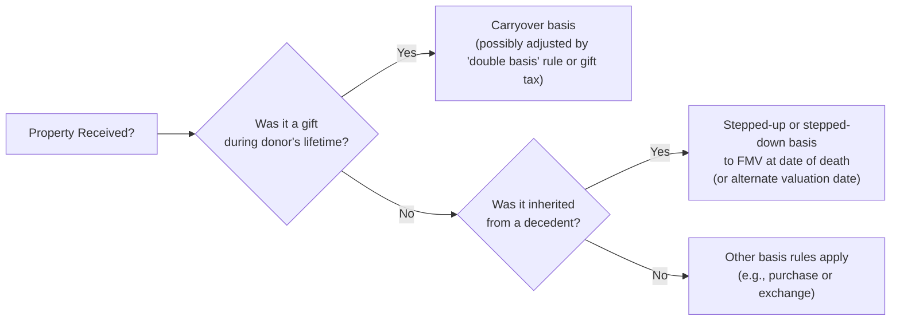

## 12.2 Basis of Assets Received by Gift or Inheritance

The determination of a taxpayer’s “basis” in property is one of the most fundamental concepts in United States taxation. Understanding how to calculate and adjust basis is essential for computing gain or loss on the disposition of assets, as well as for leveraging potential deductions or credits. This section focuses on the unique rules that apply to property received by gift or inheritance—a topic that has significant implications for estate planning, individual tax returns, and entity-level transactions.

Traditional tax rules generally provide two primary baseline approaches for property transferred outside of a typical sale:
• Carryover basis for gifts.  
• Stepped-up (or stepped-down) basis for inherited property.  

Below is a detailed exploration of each approach, including where the rules come from, how they are applied, and how they might affect a taxpayer’s ultimate gain or loss when the property is sold or exchanged.

### Understanding the Distinction: Gift vs. Inheritance
Before calculating basis, it is critical to ascertain whether the asset was received as a gift during the donor’s lifetime or through inheritance from a decedent’s estate. Each route has unique tax consequences:

• A gift implies a transfer made without expecting anything in return, usually during the donor’s life.  
• An inheritance refers to assets received from a decedent’s estate, often passing under a will or by operation of law.  

For gifts, the general rule is that the donor’s basis for the property “carries over” to the recipient. For inherited property, special rules often allow a “stepped-up” or “stepped-down” basis adjustment to fair market value (FMV) as of the date of death (or an alternate valuation date, if elected by the estate).

### Carryover Basis for Gifted Property
When a donor transfers property by gift, the donee (gift recipient) typically takes the donor’s adjusted basis in the property. This means if the donor’s basis in real estate was USD 50,000 at the time of the gift, and the property is then worth USD 120,000, the gift recipient generally inherits (or “carries over”) the donor’s USD 50,000 basis. Therefore, the recipient would calculate any future capital gain or loss using that same USD 50,000 basis, subject to certain adjustments or exceptions explained below.

#### The Double Basis Rule
A special twist arises if the FMV of the gifted property at the time of the gift is less than the donor’s basis. In such cases, there is a split or “double basis.” Specifically:
• Basis for calculating gain is the donor’s carryover basis.  
• Basis for calculating loss is the FMV on the date of the gift.  

If the ultimate sale price is somewhere between these two bases, the donee recognizes no gain or loss. This rule prevents taxpayers from converting a loss that existed in the donor’s hands into a legitimate deductible loss in the donee’s hands. The intended policy behind this rule is to avoid “tax loss shifting” where a donation of property might otherwise yield a higher deductible loss for the recipient.

#### Gift Tax Implications
Although gifts are often tax-free to the donee at the time of receipt, the donor might pay gift tax on property transfers exceeding the annual or lifetime exclusion thresholds. If gift tax is paid, the donee’s basis can be increased, but only by the portion of gift tax attributable to the net appreciation in the property’s value (essentially the amount by which FMV exceeds the donor’s basis at the time of the gift).

Mathematically, the basis increase due to gift tax is often expressed as:

Bnew = Bdonor + ( ( FMV at gift - Bdonor ) / ( FMV at gift ) × Gift Tax Paid )

Here,  
• Bnew = adjusted basis for the donee,  
• Bdonor = donor's basis,  
• FMV at gift = fair market value of the property on date of gift.  

Keep in mind, gift tax rarely overrides the general carryover basis rule. Rather, it simply adds a partial “step-up” to reflect the tax cost already incurred by the donor.

#### Holding Period for Gifted Property
The holding period for property received by gift (for capital gain purposes) usually includes the donor’s holding period. This means that if the donor held the property for three years before gifting it, the donee’s holding period starts on the date the donor’s holding period commenced. In practice, this effectively allows the recipient to treat the property as if they owned it for the entire time the donor did, helpful when qualifying for long-term capital gains treatment.

However, the holding period for losses might differ if the FMV at the date of gift is used as the donee’s basis for loss. In such a scenario, the holding period technically starts on the date of the gift.

### Stepped-Up (or Stepped-Down) Basis for Inherited Property
Unlike a gift’s carryover basis, inherited property typically takes a “step-up” (or step-down) in basis to its FMV on (1) the date of the decedent’s death, or (2) the alternate valuation date if the estate has validly elected such date. This rule significantly reduces or even eliminates built-in gains that accrued during the decedent’s lifetime.

#### Fair Market Value at Date of Death
In most cases, the basis for inherited property defaults to the FMV on the date of death. If the decedent originally purchased a piece of land for USD 50,000, but it was worth USD 150,000 at the time of death, the heir’s basis is USD 150,000, thus eliminating any gain accrued during the decedent’s life. This rule can represent a substantial tax benefit to heirs, often referred to as the “step-up in basis.”

#### Alternate Valuation Date
An executor of an estate can choose an alternate valuation date—generally six months after the date of death—to determine the FMV of certain assets if doing so both:
• Lowers the overall gross estate value, and  
• Reduces the estate tax due.  

When an alternate valuation date is elected, the basis for inherited property becomes the FMV on that alternate valuation date rather than on the date of death (subject to detailed rules and limitations under Internal Revenue Code requirements).

#### Automatically Long-Term Holding Period
A noteworthy distinction for inherited property is that its holding period is always considered long-term. Regardless of how soon the heir sells the asset after inheriting it, any gain or loss will be treated as long-term for tax purposes. This rule significantly simplifies the classification of capital gains and losses on inherited property, as the typical multi-year holding requirement does not apply.

### Special Considerations for Inherited Property
Several special rules or exceptions may come into play:

• Community Property States: In a community property state, the surviving spouse’s one-half share of community property can also get a step-up. Under certain conditions, both halves of the property receive a full step-up.  
• Valuation Discounts: Estates can often reduce the valuation of certain inherited assets using fractional interest, minority, or lack-of-marketability discounts, impacting how the FMV is calculated.  
• Sections 2032A and 2057 Special Use Valuation: Real estate used in certain qualified family business or farming activities can be valued at something other than its highest and best use to reduce the estate’s tax burden. This can influence the basis for the heirs.

### Diagram: Gift vs. Inheritance Basis at a Glance
Below is a simple Mermaid.js flowchart illustrating the decision points when determining whether to apply carryover basis (gift) or stepped-up basis (inheritance). This can serve as a quick reference for how each rule is applied.

In practice, the key pivot point is whether the property was gifted while the donor was alive or inherited. Each branch leads to distinct calculation rules.

### Examples and Case Studies

#### Example 1: Gift with Appreciated Value
• Donor’s basis (in stock) = USD 20,000  
• FMV on date of gift = USD 60,000  

The donee receives a carryover basis of USD 20,000. If the donee sells the stock a year later for USD 65,000, the donee’s gain is USD 45,000 (sales price minus the USD 20,000 original carryover basis). The holding period includes the donor’s, so the sale is treated as a long-term capital gain.

#### Example 2: Gift with a Built-In Loss (Double Basis Rule)
• Donor’s basis (in a parcel of land) = USD 100,000  
• FMV on date of gift = USD 80,000  

Since FMV < donor’s basis, the donee’s gain basis is USD 100,000, but loss basis is USD 80,000. Consider two scenarios for the donee’s subsequent sale:  
1. Sells at USD 90,000: Because the sales price (USD 90,000) is between the loss basis (USD 80,000) and the gain basis (USD 100,000), there is no recognizable gain or loss.  
2. Sells at USD 110,000: Now the sales price (USD 110,000) is above the gain basis. The donee’s recognized gain is USD 10,000 (USD 110,000 – USD 100,000).  

#### Example 3: Inherited Property with Stepped-Up Basis
• Decedent’s basis in real estate = USD 25,000  
• FMV at date of death = USD 200,000  

The heir’s basis is stepped up to USD 200,000. If the heir sells the real estate a month later at USD 210,000, the heir recognizes a USD 10,000 long-term capital gain (USD 210,000 – USD 200,000), even though the decedent originally bought it for much less.

#### Example 4: Alternate Valuation Date
Suppose the date-of-death value of estate assets is USD 1,000,000, but six months later, the value drops to USD 950,000. The executor may choose the alternate valuation date if it reduces estate taxes. Consequently, the heir’s basis in each asset is set to the FMV at the alternate date. So if a particular stock was worth USD 200,000 at date of death and USD 185,000 six months later, the heir’s stepped-up basis would become USD 185,000.

### Common Pitfalls and Best Practices
• Neglecting the Double Basis Rule: Taxpayers often overlook the possibility that an asset might have declined in value in the donor’s hands. This oversight can lead to errors in loss reporting.  
• Failing to Substantiate FMV: Whether for gift or inherited property, it is crucial to document the property’s FMV at the appropriate date. A formal appraisal is often recommended for high-value or unique assets.  
• Misjudging the Holding Period for Gifts: Practitioners sometimes mistake the holding period for the donee if the gift’s FMV was less than the donor’s basis.  
• Overlooking Gift Tax or Estate Tax Adjustments: If the donor paid gift tax or if the estate elected the alternate valuation date, these can each significantly affect basis calculations. Always consider these elections when establishing basis for subsequent dispositions.  

### Strategies to Overcome Challenges
• Obtain Professional Appraisals: Particularly when the fair market value is not readily ascertainable, a professional appraisal is invaluable for accurate basis determination.  
• Keep Complete Records: Encourage donors and executors to maintain documents such as purchase records, depreciation schedules, capital improvements, gift tax returns (Form 709), estate tax returns (Form 706), and any letters from appraisers.  
• Plan Gifting vs. Inheritance Based on Tax Efficiency: Sometimes, a taxpayer may benefit from passing assets as an inheritance (to secure a step-up in basis) rather than as a lifetime gift. This is especially true for assets that have appreciably grown in value.  
• Seek Professional Guidance: Every situation is unique. Taxpayers and practitioners should consult with trusts and estates attorneys, tax advisors, or CPAs to navigate intricate basis rules, especially in large or complex estates.

### Table: Quick Comparison of Gift vs. Inherited Basis

| Aspect                           | Gifted Property                      | Inherited Property                              |
|----------------------------------|--------------------------------------|-------------------------------------------------|
| General Rule                     | Carryover basis                      | FMV at date of death or alternate valuation     |
| Adjustments                      | Possible upward adjustment for gift tax paid | N/A (FMV generally rules)       |
| Double Basis Rule for Loss       | Yes, if FMV < donor’s basis          | N/A                                             |
| Holding Period                   | Usually includes the donor’s         | Always deemed long-term                         |
| Potential Tax Benefit            | Lowers basis if value increased, can shift capital gains | Step-up can eliminate accrued gains during decedent’s life |

### References for Further Exploration
• IRS Publication 551 – “Basis of Assets”  
• IRS Publication 559 – “Survivors, Executors, and Administrators”  
• IRC Sections 1014 (Basis of property acquired from a decedent) and 1015 (Basis of property acquired by gifts and transfers in trust)  
• IRC Section 2032 (Alternate valuation date)  
• Chapter 31: Complex Problem Dissections (for advanced scenarios and practice questions related to property basis)

These resources offer deeper guidance and are recommended for those seeking to expand their knowledge or research complicated aspects of basis transfers.

## Quiz: Basis for Gifted and Inherited Assets



### Which statement best describes the general rule for determining the basis of gifted property?

- [x] The basis of the property usually carries over from the donor.  
- [ ] The donee can always choose to adjust basis to the property’s fair market value.  
- [ ] The gift tax paid by the donor always becomes an automatic increase in the donee’s basis.  
- [ ] The donor’s basis is automatically increased by the market value at the date of gift.

> **Explanation:** For gifted property, the recipient (donee) typically “carries over” the donor’s original basis according to IRC §1015, subject to adjustments if gift tax was paid on any appreciation.

### For a loss calculation on gifted property, what basis does the donee generally use if the FMV at the time of the gift is less than the donor’s original basis?

- [x] The FMV at the time of gift.  
- [ ] The donor’s carryover basis plus any gift tax paid.  
- [ ] The average of the FMV at the time of gift and the donor’s basis.  
- [ ] The lesser of donor’s basis or purchase price.

> **Explanation:** Under the double basis rule, if the FMV is lower than the donor’s adjusted basis at the time of the gift, the FMV on the date of gift is used to calculate a loss, preventing the donee from recognizing a loss greater than the economic loss that actually occurred.

### Which basis rule typically applies to property inherited from a decedent?

- [x] The basis is stepped up or down to fair market value as of the date of death.  
- [ ] The heir must use the decedent’s original basis.  
- [ ] The heir uses the lower of decedent’s basis or the FMV on the date of death.  
- [ ] The basis is reduced by the estate tax paid.

> **Explanation:** Inherited property often takes a stepped-up (or stepped-down) basis at the property’s FMV on the date of death, as outlined in IRC §1014.

### What is the typical holding period for property inherited by a beneficiary?

- [x] Always deemed to be long-term regardless of how long the decedent owned it.  
- [ ] It starts afresh on the date the inheritance is distributed.  
- [ ] It is exactly the decedent’s holding period plus one year.  
- [ ] It includes the decedent’s entire holding period automatically.

> **Explanation:** Inherited property is always treated as having a long-term holding period per IRS regulations, ensuring capital gains are taxed at long-term rates if sold.

### Which of the following best describes the "double basis rule" for gifted property?

- [x] The basis for gain is the donor’s adjusted basis, while the basis for loss is the FMV at the time of the gift if that FMV is lower.  
- [ ] The donee can choose either the donor’s basis or the FMV.  
- [x] It applies only if the FMV at the date of gift is lower than the donor’s basis.  
- [ ] The donor’s basis is maintained for both gain and loss calculations.

> **Explanation:** The double basis rule divides the determination of basis between gain and loss scenarios when the property’s FMV at the date of gift is less than the donor’s adjusted basis.

### What key advantage often occurs when inheriting highly appreciated property?

- [x] The built-in gain during the decedent’s life is effectively eliminated through stepped-up basis.  
- [ ] The inherited property can always be sold tax-free.  
- [ ] The basis remains subject to donor-level depreciation recapture.  
- [ ] No recordkeeping is needed for inherited property.

> **Explanation:** A primary benefit of inherited property is the step-up in basis that can eliminate what would have otherwise been a large capital gain if the decedent’s lower historical cost basis were used.

### If gift tax has been paid by the donor, which of the following is usually true regarding the donee’s basis?

- [x] The donee’s basis may be partially increased by the portion of gift tax attributed to net appreciation in the gifted asset.  
- [ ] No adjustment in basis is allowed.  
- [x] Full gift tax paid is added to the basis of the donee.  
- [ ] The donee must reduce the basis by the amount of gift tax paid.

> **Explanation:** If gift tax was paid, the donee’s basis may be increased by a proportionate amount of the tax that relates to the net appreciation component in the gifted property.

### What happens if the alternate valuation date is elected for an estate?

- [x] The inherited property’s basis may be the FMV six months after death, if this lowers the estate’s overall tax liability.  
- [ ] The estate must re-calculate all valuations at intervals of three months.  
- [ ] The basis is completely unaffected by market fluctuations after the date of death.  
- [ ] The alternate valuation date has no impact on the beneficiary’s basis.

> **Explanation:** The executor can elect to use the FMV six months after the decedent’s death to reduce the value of the estate and, subsequently, the estate tax, which affects the beneficiary’s stepped-up basis.

### For property received by gift, if the donee sells the asset at a price between the donor’s basis and the FMV at time of gift (when FMV < donor’s basis), how is gain or loss recognized?

- [x] No gain or loss is recognized.  
- [ ] Gain is recognized on the difference from the FMV.  
- [ ] Loss is recognized on the difference from the donor’s basis.  
- [ ] All of the difference is recognized as a short-term loss.

> **Explanation:** The double basis rule prevents creating or increasing a loss if the sale price is between the property’s adjusted basis for gain and the FMV that serves as the adjusted basis for loss.

### An inherited property’s holding period is considered:

- [x] True  
- [ ] False  

> **Explanation:** Inherited property is automatically considered to have a long-term holding period under U.S. tax rules, regardless of the actual length of time the decedent held the asset or how soon the heir disposes of it.



## For Additional Practice and Deeper Preparation

### [Taxation & Regulation (REG) CPA Mock Exams](https://www.udemy.com/course/reg-cpa-mock-exams/?referralCode=55419EBD198F61530B12)

Taxation & Regulation (REG) CPA Mocks: 6 Full (1,500 Qs), Harder Than Real! In-Depth & Clear. Crush With Confidence!

- Tackle full-length mock exams designed to mirror real REG questions.  
- Refine your exam-day strategies with detailed, step-by-step solutions for every scenario.  
- Explore in-depth rationales that reinforce higher-level concepts, giving you an edge on test day.  
- Boost confidence and minimize anxiety by mastering every corner of the REG blueprint.  
- Perfect for those seeking exceptionally hard mocks and real-world readiness.  

_Disclaimer: This course is not endorsed by or affiliated with the AICPA, NASBA, or any official CPA Examination authority. All content is for educational and preparatory purposes only._
