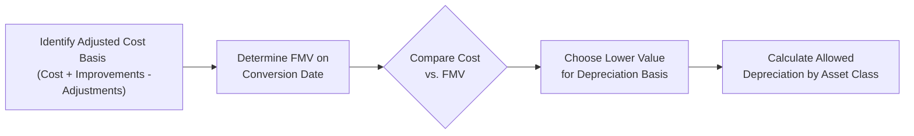

## 12.3 Impact of Conversion from Personal to Business Use

Converting personal property to business use can have significant tax implications, especially concerning the determination of the tax basis for depreciation, amortization, and eventual gain or loss calculations. In this section, we will explore the rules and best practices for establishing the basis of property at the time of conversion, discuss the lower-of-cost-or-FMV rule, and take a closer look at how these rules affect capital recovery and future dispositions.

This topic closely interrelates with other concepts covered in Chapter 12 (Basis of Assets) and Chapter 13 (Cost Recovery), as well as general principles of gross income, deductions, and entity taxation discussed throughout the book. For quick reference, see:
- Chapter 12.1 for an overview of calculating an asset’s original basis.
- Chapter 13.1 for depreciation methods (MACRS), recovery periods, and conventions.

--------------------------------------------------------------------------------

### Introduction to Personal-to-Business Conversions

When an individual decides to use personal property (such as a car, home office space, or computer equipment) for a profit-driven activity or as part of a trade or business, the IRS requires the taxpayer to establish a new basis in that property for tax purposes. This basis acts as the foundation for calculating depreciation deductions and determining gains or losses if the property is sold. Unlike property acquired directly for business use, property converted from personal use typically follows specialized rules designed to prevent taxpayers from overstating either depreciation or potential losses.

Key points to note:
• The basis for depreciation is generally the lower of the asset’s adjusted cost or its fair market value (FMV) on the date of conversion.  
• Correctly determining basis is critical, as it impacts how much depreciation may be claimed and how future gains or losses on disposition are calculated.

--------------------------------------------------------------------------------

### Lower-of-Cost-or-FMV Rule

One of the hallmark rules for property converted from personal to business use is the “lower-of-cost-or-FMV” rule. At the time of conversion, the taxpayer must compare:
1. The asset’s adjusted cost basis (i.e., original cost plus improvements, less any non-reimbursed damages or previous deductions if applicable), and  
2. The asset’s fair market value (FMV) on the date of conversion.

The value used for depreciation going forward is whichever amount is lower.

Mathematically, we can express the depreciation basis as:


\text{Basis}_{\text{depreciation}} 
= \min \bigl(\text{Adjusted Cost Basis},\; \text{FMV on Conversion Date}\bigr).


This formula ensures that the taxpayer does not inflate the cost recovery of assets that may have lost value during the period of personal use.

--------------------------------------------------------------------------------

### Rationale Behind the Rule

• Preventing Overstatement of Deductions: If the FMV is much lower than the original cost because of wear and tear or obsolescence, Congress and the IRS do not allow the taxpayer to claim depreciation on a higher, outdated cost.  
• Fairness and Integrity of the Tax System: The rule discourages taxpayers from shifting personal losses into the business sphere. If an asset has declined in value, that decline—while it occurred during personal use—is not a legitimate business loss.  
• Simplicity and Uniformity: The lower-of-cost-or-FMV concept is straightforward to apply once the taxpayer has reliable FMV documentation and accurate records of original cost and adjustments.

--------------------------------------------------------------------------------

### Adjusted Basis vs. Fair Market Value

#### Adjusted Basis
An asset’s adjusted basis starts as its acquisition cost and is then modified by any capital improvements or previous deductions relating to the property. For example, if an individual purchased a car for $40,000 and later spent $2,000 on capital improvements, the adjusted basis could be $42,000 if there are no other relevant adjustments.

#### Fair Market Value (FMV)
Fair Market Value is defined as the price at which the asset would change hands between a willing buyer and a willing seller, with neither being under any compulsion to buy or sell and both having reasonable knowledge of relevant facts. To determine an accurate FMV at the point of conversion:
- Taxpayers often rely on professional appraisals, especially for large or unique-value assets like real estate.  
- For more common personal assets (e.g., vehicles), recognized pricing guides, such as used-car valuations, can serve as evidence of FMV.  
- Documentation is crucial; the IRS can disallow or adjust the taxpayer’s claimed FMV if there is no reliable support.

--------------------------------------------------------------------------------

### Mechanics of Conversion: Depreciation Examples

Let’s look at a series of examples to illustrate how to calculate basis and depreciation upon conversion.

#### Example 1: Vehicle Conversion
• Original cost of personal vehicle = \$30,000 (two years ago).  
• FMV at the time of conversion = \$20,000.  
• No capital improvements were made.  
• No prior allowable depreciation (purely personal use).  

According to lower-of-cost-or-FMV:

\text{Basis}_{\text{depreciation}} = \min(\$30{,}000,\; \$20{,}000) = \$20{,}000.


Thus, the taxpayer would initiate depreciation using \$20,000 as the vehicle’s basis. If the vehicle is a passenger automobile used 100% for business (subject to luxury auto limits, discussed in Chapter 13), the depreciation deduction is constrained by annual caps.

#### Example 2: Real Estate (Home Office Conversion)
• Original cost of a condo = \$200,000.  
• Accumulated personal improvements adding to cost basis = \$30,000.  
• Adjusted cost basis before conversion = \$230,000.  
• FMV at date of conversion = \$250,000.  

Because the FMV is \$250,000 and the adjusted basis is \$230,000, we use the lower figure of \$230,000 to determine depreciation basis. The taxpayer can generally depreciate only the portion of the home (e.g., home office space) used regularly and exclusively for business, based on square footage or a “separately identifiable” portion. If the home office is 10% of the condo’s total area, then:

\text{Depreciation basis for the office portion} 
= 10\% \times \$230{,}000 = \$23{,}000.


The taxpayer would then depreciate \$23,000 using the appropriate method for real property (e.g., straight-line over 39 years for non-residential property or 27.5 years for residential rental property if it qualifies as such).

#### Example 3: Value Decrease Before Conversion
• Personal computer originally purchased = \$2,000.  
• Current FMV at conversion date (two years later) = \$800.  
• Adjusted cost basis remains \$2,000 (no capital improvements).  

Applying the rule:

\text{Basis}_{\text{depreciation}} 
= \min(\$2{,}000,\; \$800) = \$800.


All depreciation calculations begin at \$800. This limit also means that if the computer is later sold for less than \$800, the allowed loss deduction may be restricted. (In fact, for personal property that is converted, special rules exist to determine the basis for loss on sale, further ensuring that personal losses do not become business losses.)

--------------------------------------------------------------------------------

### Dual Basis on Disposition

Beyond its role in calculating depreciation, the lower-of-cost-or-FMV standard also creates potential complexities if the property is subsequently sold or exchanged. In some scenarios, the gain basis could differ from the loss basis. Generally:

- If property is sold at a gain (sales price > original cost basis), the gain is measured using the original adjusted basis (cost basis), not the lower amount.  
- If property is sold at a loss (sales price < FMV at conversion), the loss is measured from the lower-of-cost-or-FMV at the conversion date.  

This dual-basis approach ensures that any decline in value that happened during personal use is not converted into a business loss.

--------------------------------------------------------------------------------

### Practical Considerations and Best Practices

• Maintain Documentation: Good recordkeeping for both original purchase documents and any appraisal or valuation at the time of conversion is essential.  
• Partial Business Use: If property such as a home or car is used both personally and for business, only the portion of use designated for business is subject to depreciation. The rules for allocating business vs. personal use can get complex (e.g., using mileage logs for vehicles or square-footage calculations for home offices).  
• Potential Impact on Section 179 Expensing: If property is converted to business use, the taxpayer may explore a Section 179 deduction (discussed in Chapter 13.2) if it qualifies. However, the basis eligible for Section 179 is still subject to the lower-of-cost-or-FMV limitation.
• State and Local Laws: Some states follow their own specific guidelines for property basis and may require separate adjustments or forms. Always verify state tax rules alongside federal rules.  

--------------------------------------------------------------------------------

### Mermaid Diagram: Basis Determination Workflow

Below is a simple workflow representation for determining depreciation basis upon conversion.  

Explanation:  
1. The taxpayer first computes the Adjusted Cost Basis.  
2. Next, the Fair Market Value as of the conversion date is accurately assessed.  
3. Compare these two amounts (Cost vs. FMV).  
4. Select whichever is lower to establish the depreciation basis.  
5. Proceed to allocate and calculate depreciation following MACRS or the applicable depreciation method for the asset class.

--------------------------------------------------------------------------------

### Special Rules for Different Asset Classes

Certain asset classes might have unique considerations:
1. Automobiles: Subject to annual depreciation limits (luxury auto limits).  
2. Listed Property: Items such as computers, cell phones, or other equipment with potential personal usage must meet strict substantiation rules (outlined in Chapter 13).  
3. Real Estate: Must determine whether it is residential rental, commercial property, or part of a home office. Depreciation schedules may be significantly longer (27.5 or 39 years).  
4. Intangible Assets: Less common in personal use (e.g., patents, trademarks). If converted, the taxpayer typically must use the lower-of-cost-or-FMV, and amortization rules (Chapter 13.3) might apply.  

--------------------------------------------------------------------------------

### Common Pitfalls and IRS Challenges

1. Understating or Overstating FMV: Taxpayers often either do not document FMV or rely on questionable appraisal methods that the IRS can challenge.  
2. Mixing Personal and Business Use: Failing to maintain logs or clear boundaries can lead to partial disallowance of depreciation or other deductions.  
3. Overlooking Dual-Basis Requirements: Many taxpayers are surprised when computing a loss upon disposition that the basis for loss might be lower than the original cost basis.  
4. Inadequate Recordkeeping: Not retaining purchase receipts, improvement costs, or an FMV appraisal can lead to negative adjustments during an IRS audit.  

--------------------------------------------------------------------------------

### Case Study: Converting a Vacation Home into Rental Property

Suppose John owns a vacation home purchased for \$300,000, which has grown in value to \$350,000. Over the years, he spent \$50,000 on capital improvements, raising his adjusted basis to \$350,000 (300,000 + 50,000). He then decides to turn the property into a rental. At the time he places it for rent, the FMV is \$340,000, slightly lower than his \$350,000 adjusted basis.

• Depreciation Basis: The lower of \$350,000 and \$340,000 is \$340,000.  
• Allocation of Land vs. Building: If the ratio is land \$68,000 (20%) and building \$272,000 (80%) based on a current appraisal, then:
  - Building’s depreciable basis: \$272,000.  
  - Depreciation method: Likely a residential rental property, so 27.5-year straight-line depreciation.  
• Future Dispositions: If John eventually sells the property for a price above \$350,000, some or all of the difference may be recognized as a gain based on the original adjusted cost basis. However, if he sells for less than \$340,000, his potential deductible loss calculation begins using \$340,000 as the relevant measure.

--------------------------------------------------------------------------------

### Monitoring Changes and Continued Compliance

After the conversion, the property must be tracked carefully for:
- Actual business vs. personal usage.  
- Compliance with depreciation method and schedule.  
- Potential direct expenses, repairs, and improvements (e.g., painting, structural renovations).  
- Appeals or updates to local property appraisals that indicate a change in FMV over time.

--------------------------------------------------------------------------------

### Additional Resources and References

Below are some materials that offer deeper insights into the conversion rules, basis determinations, and related depreciation guidance:
1. IRS Publication 551, “Basis of Assets” – Detailed official guidance on determining and adjusting basis.  
2. IRS Publication 587, “Business Use of Your Home” – Guidance on allocations for home offices.  
3. Sections 1011, 1012, 1016, and 167 of the Internal Revenue Code – Statutory authority for basis, adjustments, and depreciation.  
4. Chapter 13 of this text – For more on MACRS depreciation, Section 179 expensing, listed property, and amortization.  
5. Chapter 16 – For passive activity considerations that may interact with property usage.

--------------------------------------------------------------------------------

## Test Your Knowledge: Basis and Depreciation for Converted Property

Below is an SEO-optimized quiz designed to reinforce key concepts about the conversion of assets from personal to business use. Review the following questions and explanations to deepen your comprehension.



### When property is converted from personal to business use, which rule generally applies for establishing its depreciation basis?

- [ ] The higher-of-cost-or-FMV rule.
- [ ] The average-of-cost-and-FMV rule.
- [x] The lower-of-cost-or-FMV rule.
- [ ] No rule applies; one can freely choose the basis.

> **Explanation:** Taxpayers must use the asset’s lower of adjusted cost basis or fair market value on the date of conversion to avoid overstating depreciation deductions or future losses.

### Which of the following typically triggers the need to calculate a new basis for an existing asset?

- [x] Converting a personal-use car into a vehicle used for business deliveries.
- [ ] Purchasing a new car exclusively for business use from day one.
- [ ] Buying new furniture for personal bedrooms.
- [ ] Selling a personal item at a local garage sale.

> **Explanation:** A basis adjustment is needed when personal-use assets are converted to business or income-generating use. Assets acquired directly for business have a straightforward basis, and purely personal transactions do not trigger new basis rules.

### What is a primary reason behind using the lower-of-cost-or-FMV rule for conversions?

- [ ] To accelerate depreciation for taxpayers converting property.
- [ ] To penalize taxpayers for owning personal property.
- [x] To prevent taxpayers from claiming depreciation on value declines that occurred during personal use.
- [ ] To provide a one-time exemption on any capital gains or losses.

> **Explanation:** The goal is to ensure fairness by excluding personal wear and tear from becoming a deductible or depreciable business expense.

### Under the dual-basis concept, if an asset is sold for a gain after being converted to business use, which basis generally applies for calculating the gain?

- [ ] The lower-of-cost-or-FMV at conversion.
- [x] The original adjusted basis before conversion.
- [ ] The FMV at the date of sale.
- [ ] Whichever basis yields a lower tax.

> **Explanation:** In gain situations, the original adjusted basis (from before conversion) is typically used. This prevents denying the taxpayer legitimate appreciation above the original cost.

### A taxpayer converts a personal computer to business use. It was originally purchased at $1,500 with no improvements. Its FMV at conversion is $1,000. Which statement is correct?

- [x] The depreciation basis is $1,000.
- [ ] The depreciation basis is $2,500.
- [x] If later sold at a $200 loss, the lower basis still applies.
- [ ] Depreciation cannot be taken at all.

> **Explanation:** The taxpayer must use the lesser of the adjusted cost ($1,500) or FMV ($1,000) for depreciation. If the taxpayer eventually sells below $1,000, the allowable loss is generally computed from $1,000, not $1,500.

### Which of the following best describes Fair Market Value (FMV)?

- [x] The price at which a willing buyer and seller would transact, with neither being under duress and both having reasonable knowledge of relevant facts.
- [ ] A figure determined exclusively by local tax assessments.
- [ ] The historical cost adjusted for inflation.
- [ ] The stated value on an insurance policy.

> **Explanation:** FMV is based on a free-market perspective, independent of artificial pressures or valuations issued for property tax or insurance purposes.

### When converting a portion of your primary residence to a home office, how is the basis for depreciation on that portion typically determined?

- [x] By applying the lower-of-cost-or-FMV rule to the allocated space and then calculating depreciation.
- [x] By using the percentage of the total square footage dedicated to business use.
- [ ] By claiming the entire home’s basis for depreciation.
- [ ] By averaging the assessed value and cost basis.

> **Explanation:** First, apply the lower-of-cost-or-FMV principle to the home’s total basis, then multiply by the ratio (often square footage) dedicated to business use. Only the business portion is depreciable.

### Which of the following illustrates a common pitfall in tracking property conversions?

- [x] Failing to keep an appraisal or documentation of the FMV at the conversion date.
- [ ] Applying the appropriate MACRS recovery period.
- [ ] Maintaining detailed logs of business and personal use.
- [ ] Correctly identifying the asset’s original cost when purchased.

> **Explanation:** Recognizing and documenting the FMV is essential. Without it, taxpayers may improperly compute the basis and potentially face IRS scrutiny.

### For which of these assets converted to business use would you most likely consult specialized annual depreciation limits?

- [x] A luxury passenger vehicle.
- [ ] Computer software.
- [ ] Residential rental property.
- [ ] Machinery used in manufacturing.

> **Explanation:** Passenger vehicles often have additional “luxury auto” depreciation limits. Machinery and real property have straightforward MACRS schedules without those special caps.

### True or False: Once an asset has been converted from personal to business use, any prior personal use value decline can be claimed as a deductible business loss immediately.

- [x] True
- [ ] False

> **Explanation:** This statement is tricky. It’s technically false that you can claim a loss for the prior decline in value. The question’s phrasing might be read in multiple ways, but the correct stance is that personal losses are generally not deductible. The prior decline in value reduces the asset’s depreciation basis (due to the lower-of-cost-or-FMV rule) but does not convert such reduction into an immediate deductible loss.



--------------------------------------------------------------------------------

## For Additional Practice and Deeper Preparation

### [Taxation & Regulation (REG) CPA Mock Exams](https://www.udemy.com/course/reg-cpa-mock-exams/?referralCode=55419EBD198F61530B12)

**Taxation & Regulation (REG) CPA Mocks:** 6 Full (1,500 Qs), Harder Than Real! In-Depth & Clear. Crush With Confidence!

- Tackle full-length mock exams designed to mirror real REG questions.  
- Refine your exam-day strategies with detailed, step-by-step solutions for every scenario.  
- Explore in-depth rationales that reinforce higher-level concepts, giving you an edge on test day.  
- Boost confidence and minimize anxiety by mastering every corner of the REG blueprint.  
- Perfect for those seeking exceptionally hard mocks and real-world readiness.  

_Disclaimer: This course is not endorsed by or affiliated with the AICPA, NASBA, or any official CPA Examination authority. All content is for educational and preparatory purposes only._
