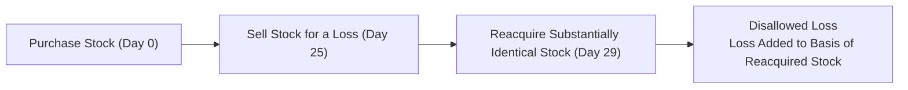
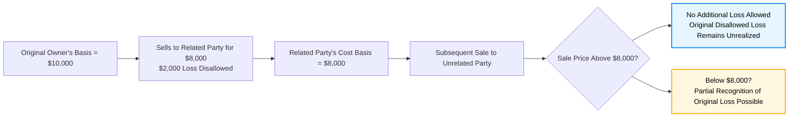

## 12.4 Special Basis Issues (Wash Sales, Related-Party Transactions)

This section delves into two critical scenarios that affect a taxpayer’s basis in property: wash sales and related-party transactions. Though much of federal taxation focuses on calculating gains or losses upon disposition, additional complexities arise when losses are disallowed, deferred, or only partially recognized. This chapter’s objective is to explain how these rules operate, how to identify triggering events, and how to properly adjust basis in such cases. We also include examples and diagrams to visualize complex concepts and foster better understanding.

--------------------------------------------------------------------------------
  
### Introduction to Wash Sales and Related-Party Basis Adjustments

In federal taxation of property transactions, basis is a cornerstone concept determining how much income is recognized (gain or loss) upon sale or disposition of property. However, legislation sometimes denies or defers recognition of losses under specific conditions to discourage perceived tax “abuse” or manipulation. Two areas that illustrate these provisions are:

• Wash sale rules, which disallow certain capital losses if the taxpayer acquires substantially identical property within a specified time window.  
• Basis rules for related-party transactions, which limit taxpayers’ ability to realize and recognize losses when dealing with relatives or other related entities.

--------------------------------------------------------------------------------

### Wash Sales: Definition, Mechanics, and Basis Implications

A wash sale occurs when an investor sells or trades stock or securities at a loss but then purchases substantially identical stock or securities within 30 days before or after the sale date. This rule is codified in Internal Revenue Code (IRC) Section 1091 to prevent taxpayers from capturing a bona fide loss for tax purposes while effectively maintaining the same investment position.

#### The 61-Day Window

While commonly referred to as the “30-day” rule, the period is actually 61 days surrounding the sale: 30 days prior to the sale, the day of the sale, and 30 days following the sale. If a taxpayer buys back (or has already purchased) substantially identical securities during that 61-day window, any realized loss on the sale is disallowed.

#### Substantially Identical Stock or Securities

• The IRS typically considers common shares of the same corporation identical.  
• Different classes of stock in the same corporation (e.g., preferred vs. common) are often not treated as substantially identical if they differ in terms of rights, privileges, and risk.  
• Options or contracts to acquire substantially identical securities may also trigger wash sale rules.  

#### Disallowed Loss and Basis Adjustment

When a wash sale occurs, the loss is not immediately deductible. Instead:

1. The disallowed loss is added to the basis of the newly acquired stock or securities.  
2. The holding period of the new (reacquired) security includes the holding period of the old security.  

Thus, while the taxpayer loses the immediate tax benefit of the loss, it is effectively deferred, as the basis step-up could reduce the taxable gain or increase the deductible loss on a future sale (assuming no additional wash sales occur).

#### Example: Wash Sale and Basis Carryover

Suppose Alex buys 100 shares of XYZ Corp. at $50 per share ($5,000 total basis). Two months later, Alex sells those 100 shares for $3,000, resulting in a realized loss of $2,000. Unfortunately, Alex reacquires 100 shares of substantially identical XYZ stock five days after selling the original shares. Under wash sale rules:

• The $2,000 loss is disallowed.  
• The basis of the reacquired 100 shares is $3,000 (purchase price) + $2,000 (disallowed loss) = $5,000.  
• The holding period of the new shares tacks on the original shares’ holding period.

#### Timeline Diagram of a Wash Sale

Below is a Mermaid diagram illustrating the timeline of a typical wash sale:

The disallowed loss effectively stays with the investor in the form of a higher cost basis for the new shares, deferring loss recognition until the new shares are ultimately sold outside the wash sale window.

--------------------------------------------------------------------------------

### Related-Party Transactions: Basis Limitations and Loss Disallowances

Related-party transaction rules aim to prevent taxpayers from artificially creating or shifting losses among family members or other controlled entities. These provisions are primarily codified under IRC Section 267 and revolve around the concept of “constructive ownership” and “relatedness.” The main consequence is the disallowance or deferral of losses transferred between parties who are not dealing at arm’s length.

#### Defining Related Parties

Under IRC Section 267, related parties typically include:

• Family members (spouses, siblings, ancestors, lineal descendants).  
• A corporation and an individual who owns more than 50% of that corporation’s stock.  
• Two corporations that are members of the same controlled group.  
• Certain trusts, estates, and partnerships with overlapping or common ownership.  

Understanding these definitions is crucial when analyzing sale or exchange transactions among such parties.

#### Disallowance of Losses

When a taxpayer sells or exchanges property at a loss to a related party, the loss is typically disallowed. This prevents a taxpayer from “transferring” an unrealized loss within a controlled group or among family members to create a tax deduction that would not occur in a market transaction. 

#### Carryover of Basis and Future Loss Recognition

Although the original seller cannot recognize the loss, the purchasing related party does not automatically gain a stepped-up basis. Instead, the purchaser’s basis depends on whether and when they subsequently dispose of the property:

1. **Purchaser’s “Cost” Basis for Potential Gains**  
   The purchaser’s basis in the property is the purchase price (the cost paid). If the new owner later sells the property at a gain, that gain is calculated based on this cost basis.  
   
2. **Loss Carryforward for Potential Future Loss**  
   If the new owner later sells the property at a loss, part or all of this previously disallowed loss may be allowed but only to the extent the subsequent sale price is less than the purchasing related party’s original cost basis.  

This structure essentially defers recognition of the disallowed loss until the property is sold to an unrelated party, ensuring that no artificial losses are recognized within related-party transactions.

#### Partial Loss Carryover Example

1. **Fact Pattern**  
   • Maria sells property with a basis of $10,000 to her brother, Roberto, for $8,000. Maria realizes a $2,000 loss, which is disallowed under Section 267.  
   • Roberto’s basis is $8,000 (the price he paid).  

2. **Subsequent Sale**  
   • Later, Roberto sells the property to an unrelated buyer for $12,000.  
   • Roberto’s gain: $12,000 – $8,000 = $4,000.  
   • The previously disallowed $2,000 loss from Maria’s transaction does not reduce Roberto’s gain.  

3. **If Roberto Sold for Less**  
   • Suppose Roberto sells the property to an unrelated party for $7,000.  
   • Roberto’s recognized loss is $7,000 – $8,000 = $1,000.  
   • However, part of Maria’s disallowed $2,000 loss could be recognized here but only to the extent it creates an overall loss below Roberto’s cost basis. Because Roberto’s cost was $8,000, and the loss is $1,000, Roberto only recognizes $1,000 of the combined loss. The $1,000 recognized plus the $1,000 unused portion of Maria’s original $2,000 disallowed loss is lost (it expires).  

In the end, the disallowed loss does not vanish completely but only partially carries over. The subsequent purchaser can potentially use the disallowed loss if and when the property is sold to an unrelated party at a loss below the purchaser’s own cost basis—and even then, the allowable portion is carefully calculated.

#### Special Note: Transfers Between Partnerships and Partners

Section 707(b) extends similar disallowance rules to certain partner-partnership transactions, ensuring that losses on sales or exchanges of property are disallowed if ownership thresholds and control conditions exist. These rules are further explored in Chapter 21 (Partnerships) of this Guide.

--------------------------------------------------------------------------------

### Comparison: Wash Sales vs. Related-Party Transactions

While both wash sale and related-party loss-disallowance rules are intended to prevent artificial tax losses, their operational mechanics differ:

| Feature                                          | Wash Sales                                    | Related-Party Transactions                                             |
|--------------------------------------------------|-----------------------------------------------|-------------------------------------------------------------------------|
| Time/Ownership Focus                              | 61-day window (30 days before/after sale)     | Codified relationships (familial, ownership >50%, entities under control) |
| Effect on Loss                                    | Immediate loss disallowed                     | Immediate loss disallowed                                              |
| Future Basis Adjustment                           | Disallowed loss added to basis of reacquired stock | Loss can be recognized by purchaser in certain circumstances, but not always |
| Holding Period                                   | Tacks on previous holding period              | Typically no “tacking” for purchaser; original seller’s holding period not transferred |

--------------------------------------------------------------------------------

### Common Pitfalls and Best Practices

1. **Unintentional Wash Sale**  
   Investors may inadvertently trigger a wash sale by using automatic reinvestment programs or by buying replacement securities in a spouse’s account. Best practice is to monitor trades carefully during the 61-day window.

2. **Overlooking Related-Party Definitions**  
   It is easy to forget extended family members or controlled entities. Before recognizing a loss in a transaction, verify that the buyer is not considered a related party under the broad definitions in IRC Section 267.

3. **Basis Documentation**  
   Proper documentation is vital. Records must reflect not only the cost basis but also any transference of disallowed losses and the date of acquisition.

4. **Strategic Timing**  
   Individuals seeking to harvest losses for tax purposes should plan to avoid reacquiring the same or substantially identical securities within 30 days. Similarly, families might structure property transfers to minimize the risk of losing the benefit of a realized loss.

5. **Seek Professional Guidance**  
   Given the complexity of these rules, it is often prudent to consult with a tax professional, especially when higher-value property or large losses are involved.

--------------------------------------------------------------------------------

### Practical Case Study: Combined Wash Sale and Related-Party Considerations

Elaine owns 500 shares of Company A stock, each with a basis of $20. She sells them to her sister, Linda, at $15 per share, realizing an apparent $5 loss per share, or $2,500 total. However, because Linda is a related party, Elaine’s $2,500 loss is disallowed under IRC Section 267.

A few days later, Linda sells those same shares on the open market for $17 each, netting $8,500 in proceeds. Linda’s cost basis was $7,500, so she recognizes a $1,000 gain. Because the transaction with Elaine was a related-party sale, Elaine’s disallowed loss does not offset Linda’s recognized gain. Linda also does not inherit Elaine’s basis—she simply uses the amount she paid ($15/share) to measure her own gain or loss.

If Elaine had instead sold the shares on the market directly and reacquired them through a different account within the 61-day window, the wash sale rules would have disallowed her loss, but the disallowed loss would have increased her new stock’s basis. In any scenario, failing to consider these special rules can produce unexpected tax outcomes.

--------------------------------------------------------------------------------

### Illustration of Related-Party Basis Flow

Below is a Mermaid diagram highlighting how disallowed losses carry forward in a subsequent transaction for related parties:

Explanatory Notes:  
• If the sale price exceeds $8,000, the original $2,000 disallowed loss remains unrecognized.  
• If the sale price is below $8,000, the purchaser can claim loss, but only to the extent the total loss exceeds their own cost basis, partially unlocking the previously disallowed loss.

--------------------------------------------------------------------------------

### References and Further Exploration

• IRC § 267 for related-party transaction rules  
• IRC § 1091 for wash sale provisions  
• IRS Publication 550, “Investment Income and Expenses,” for easy-to-understand discussion on wash sales  
• Chapter 21 (Partnerships) of this Guide for extended coverage of Section 707(b) transactions among partners and partnerships  

--------------------------------------------------------------------------------

## Test Your Knowledge: Wash Sales and Related-Party Basis Quiz



### Under the wash sale rules, when a loss is disallowed, what happens to the disallowed amount?

- [ ] It is permanently disallowed and can never benefit the taxpayer.
- [x] It is added to the basis of the substantially identical stock purchased.
- [ ] It is carried forward to the next tax year without adjusting basis.
- [ ] It is immediately deductible against capital gains in the same tax year.

> **Explanation:** The disallowed loss in a wash sale is added to the basis of the newly purchased stock or securities under IRC § 1091.

### A sale of property between siblings generally triggers which of the following tax consequences?

- [x] Disallowance of losses under IRC § 267.
- [ ] Deferral of losses until the next tax year.
- [ ] Automatic recognition of the loss if reported properly.
- [ ] No effect; the transaction is taxed as if it were sold to an unrelated party.

> **Explanation:** Siblings are considered related parties under IRC § 267, causing losses on sales or exchanges between them to be disallowed.  

### Maria sells property to her brother at a loss. Which statement best describes how Maria’s brother’s basis is determined?

- [x] It is the price he actually paid to Maria.
- [ ] It is the original cost basis that Maria had in the property.
- [ ] It is reduced by Maria’s disallowed loss.
- [ ] It is increased by Maria’s disallowed loss.

> **Explanation:** The acquiring brother’s basis is the amount he paid. Maria’s disallowed loss does not increase his basis.

### Under the wash sale rule, the holding period of the repurchased stock will:

- [ ] Start fresh from the repurchase date.
- [x] Include the holding period of the stock sold at a loss.
- [ ] Begin when the new stock is sold in a qualifying transaction.
- [ ] Be split 50/50 between the old holding period and the new purchase date.

> **Explanation:** The holding period in a wash sale tacks on to the new stock, ensuring continuity in the taxpayer’s investment holding period.

### In a related-party sale where the seller’s loss is disallowed, how can the buyer later recognize a portion of the seller’s loss?

- [x] By selling the property to an unrelated party at a price below the buyer’s own cost basis.
- [ ] By converting any capital gain into an ordinary loss.
- [x] Only in the amount by which the subsequent sale price is below the buyer’s cost basis.
- [ ] Automatically, upon any sale to an unrelated party at any price above the buyer’s basis.

> **Explanation:** The buyer recognizes part of the original disallowed loss only to the extent the new sale’s proceeds are less than the buyer’s cost basis. The buyer’s own loss triggers a partial release of the original disallowed loss.

### Which of the following would most likely be “substantially identical stock”?

- [x] Common shares of the same corporation.
- [ ] Different industry stocks with similar dividends.
- [ ] Preferred shares vs. common shares of the same corporation.
- [ ] Bonds issued by a different corporation.

> **Explanation:** Typically, only the same class of stock in the same corporation, or an option/contract to buy that same stock, are considered substantially identical.  

### A taxpayer with a short-term loss from a quick sale of a stock decides to purchase call options on the same stock within 30 days. What is the tax effect?

- [x] Wash sale rules apply because call options are considered substantially identical.
- [ ] Wash sale rules do not apply because options and stocks are never identical.
- [x] Loss from the sale is disallowed and must be added to the options’ basis.
- [ ] The transaction is considered an exchange of equivalently valued properties.

> **Explanation:** Derivatives such as call options on the same stock can be considered substantially identical under IRC § 1091, triggering the wash sale rule.

### Which scenario potentially avoids a loss disallowance entirely?

- [x] Selling stock for a loss, waiting more than 30 days, and then buying back the same stock.
- [ ] Selling property to a sibling.
- [ ] Selling stock and immediately repurchasing it the next day at a higher price.
- [ ] Using an automated dividend reinvestment plan to buy shares within 30 days of the sale.

> **Explanation:** Waiting more than 30 days avoids the 61-day window, preventing wash sale treatment.

### In a transaction where the seller is subject to wash sale rules but fails to account for the disallowed loss, which of the following issues might occur?

- [x] Underreporting of correct basis for future transactions.
- [ ] Immediate capital gain recognition in the current year.
- [ ] Omission of all capital losses in future years.
- [ ] No effect on tax compliance.

> **Explanation:** Failing to adjust the basis for disallowed wash sale losses can lead to incorrect basis determination and inaccurate reporting of gains or losses in future years.

### A gain on the subsequent sale of property acquired from a related party is determined:

- [x] True
- [ ] False

> **Explanation:** Gains for the purchaser are measured from the purchaser’s own cost basis. Disallowed losses at the seller level do not affect the new owner’s recognized gain.



--------------------------------------------------------------------------------

## For Additional Practice and Deeper Preparation

### [Taxation & Regulation (REG) CPA Mock Exams](https://www.udemy.com/course/reg-cpa-mock-exams/?referralCode=55419EBD198F61530B12)

Taxation & Regulation (REG) CPA Mocks: 6 Full (1,500 Qs), Harder Than Real! In-Depth & Clear. Crush With Confidence!

- Tackle full-length mock exams designed to mirror real REG questions.  
- Refine your exam-day strategies with detailed, step-by-step solutions for every scenario.  
- Explore in-depth rationales that reinforce higher-level concepts, giving you an edge on test day.  
- Boost confidence and minimize anxiety by mastering every corner of the REG blueprint.  
- Perfect for those seeking exceptionally hard mocks and real-world readiness.  

_Disclaimer: This course is not endorsed by or affiliated with the AICPA, NASBA, or any official CPA Examination authority. All content is for educational and preparatory purposes only._
