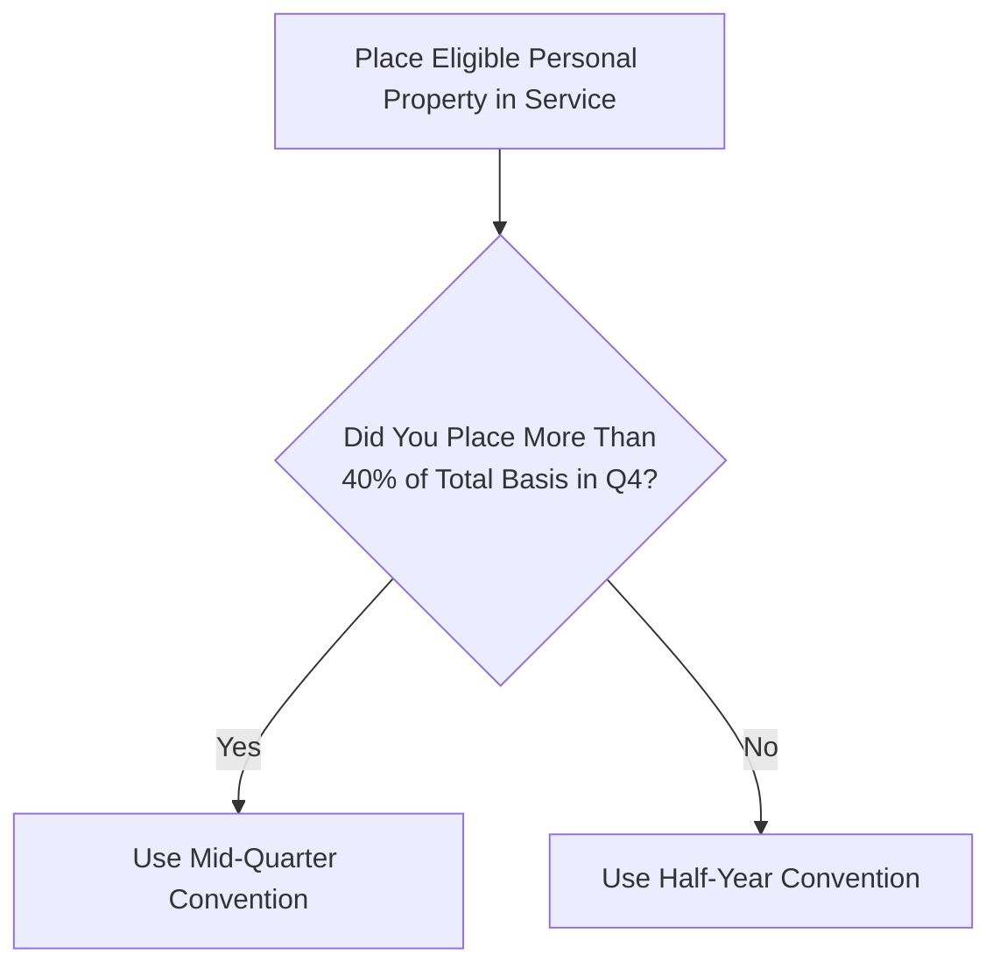
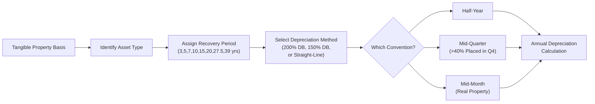

## 13.1 MACRS, Recovery Periods, and Conventions

This section provides an in-depth look at the Modified Accelerated Cost Recovery System (MACRS)—the primary method used to recover (i.e., depreciate) the cost of tangible property placed in service for trade or business or for the production of income in the United States. You will learn about the classification of assets into specific recovery periods, the various depreciation conventions (half-year, mid-quarter, and mid-month), and how these rules come together to determine the allowable tax deduction each year. We will also illustrate these concepts with tables, charts, examples, and practical scenarios.

Keeping these principles in mind will be critical not only for tax compliance but also for planning strategies that maximize tax benefits for individuals and businesses—a frequently tested area on the REG section of the Uniform CPA Examination.

---

### Introduction to MACRS

MACRS was introduced as a part of tax reform to streamline and standardize the way tangible property is depreciated. When you place a capital asset in service, the Internal Revenue Code (IRC) allows you to recover its cost over time through annual depreciation deductions. The fundamental objectives of MACRS are:
• To simplify depreciation rules.  
• To limit opportunities for subjectivity in estimated asset lives.  
• To accelerate deductions, potentially incentivizing capital investment.  

MACRS depreciation replaces the older ACRS (Accelerated Cost Recovery System) method and is mandatory for most depreciable property placed in service after 1986 (with certain exceptions). MACRS applies to personal property (e.g., machinery, equipment, vehicles) and real property (e.g., buildings), although real property has distinct recovery periods and is often subject to the mid-month convention, differentiating it from personal property conventions.

---

### Core Components of MACRS

Under MACRS, the following elements determine the annual depreciation deduction:

• Asset Class or Recovery Period: The IRS outlines the “class lives” in the tax regulations. Each class has a designated recovery period (3, 5, 7, 10, 15, 20, 25, 27.5, 31.5, 39 years, and so on).  
• Depreciation Method: Typically, the declining balance method (such as 200% or 150%) is used for personal property before switching to the straight-line method. Real property (e.g., residential rental and nonresidential real estate) generally uses the straight-line method.  
• Depreciation Convention: A default assumption under MACRS that determines how many months of depreciation to take in the first and final year. The most common conventions used are the half-year, mid-quarter, and mid-month conventions.

These components work in unison. Selecting the correct recovery period is the first step, then applying the correct method, and finally determining which convention applies in the year you place the asset in service or dispose of it.

---

### Asset Classes and Recovery Periods

Each asset you depreciate under MACRS falls into a predetermined “class life.” Once you identify the correct class, you then know the default depreciation method (often 200% or 150% declining balance for personal property) and the corresponding recovery period. Below is a simplified table highlighting common MACRS classes and their recovery periods.

| Asset Type                                                     | Recovery Period | Depreciation Method (General)                    |
|---------------------------------------------------------------|----------------|--------------------------------------------------|
| Cars, Light Trucks, and Certain Technological Equipment       | 5 years        | 200% Declining Balance                          |
| Office Furniture, Fixtures, and Equipment                     | 7 years        | 200% Declining Balance                          |
| Nonresidential Real Property (Commercial Buildings)           | 39 years       | Straight-Line; Mid-Month Convention             |
| Residential Rental Property (Apartment Complexes, etc.)       | 27.5 years     | Straight-Line; Mid-Month Convention             |
| Certain Land Improvements (Sidewalks, Fences, Landscaping)    | 15 years       | 150% Declining Balance (often used)             |
| Qualified Leasehold/Retail Improvements (if placed before certain dates) | 15 years | 150% Declining Balance (often used)             |
| Computer and Peripheral Equipment                             | 5 years        | 200% Declining Balance                          |
| Farm Buildings and Certain Agricultural Structures            | 10 or 15 years | Typically 150% Declining Balance                |
| Farm Machinery and Equipment                                  | 5 or 7 years   | Typically 150% or 200% Declining Balance        |

Note: The actual classification can be more nuanced. IRS Publication 946 and the instructions for Form 4562 provide in-depth guidance on assigning assets to the correct recovery period.

#### Practical Tip: 
If you are unsure about the proper class life, consult the applicable IRS guidelines (e.g., the “Table of Class Lives and Recovery Periods” in Publication 946) or relevant regulations. Misclassification of assets often leads to under- or over-depreciation—a frequent exam and real-world auditing pitfall.

---

### Depreciation Conventions

MACRS uses specific conventions to determine how many months of depreciation to claim for the first and last year of an asset’s recovery period. Three main conventions apply:

1) Half-Year Convention  
2) Mid-Quarter Convention  
3) Mid-Month Convention  

Selecting the proper convention can significantly impact the timing of the depreciation deduction—particularly in the first year the asset is placed in service.

---

#### Half-Year Convention

The half-year convention is the default for most personal property under MACRS unless the mid-quarter convention rule overrides it. Under the half-year convention:

• Every asset placed in service (or disposed of) during the tax year is treated as though it was placed in service (or disposed of) exactly at the midpoint of the year.  
• This essentially allows for six months of depreciation in the first year, regardless of whether the asset is placed in service in January or December 15.  
• Correspondingly, in the year of disposition, you also take only half of your annual depreciation.

---

#### Mid-Quarter Convention

If more than 40% of the total depreciable basis of personal property placed in service in a given year occurs during the last three months (i.e., the fourth quarter) of the tax year, the mid-quarter convention applies to all personal property placed in service that year (not just to assets placed during the last quarter). The mid-quarter convention:

• Treats assets as though they were placed in service at the midpoint of the quarter in which they were actually placed in service.  
• Results in different depreciation amounts for assets placed in each quarter of the tax year. For instance, an asset placed in service in the first quarter is treated as if it was placed in service in mid-February (for a calendar-year taxpayer).  
• This rule aims to prevent taxpayers from bunching large purchases late in the year to claim half-year’s depreciation.  

Below is a simplified example:

| Placed in Service | Mid-Quarter Month Assumption (Calendar Year) |
|-------------------|---------------------------------------------|
| First Quarter     | Treasury assumes mid-February (1.5 months in Q1) |
| Second Quarter    | Mid-May (4.5 months into the year)          |
| Third Quarter     | Mid-August (7.5 months into the year)       |
| Fourth Quarter    | Mid-November (10.5 months into the year)    |

---

#### Mid-Month Convention

The mid-month convention typically applies to real property (e.g., commercial buildings, residential rental properties). Key features:

• Real property placed in service any day of a given month is treated as if it were placed in service on the midpoint of that month.  
• This results in approximately half a month’s depreciation for the month of acquisition and, similarly, for the month of disposition.  
• Example: If you place a commercial building in service on September 1, you get ½ month’s worth of depreciation in September, plus full months for October through December.

---

### Determining the Applicable Convention: Flow Diagram

Use the following flow diagram to decide which convention should apply to personal property:

For real property (e.g., buildings), the mid-month convention is generally required.

---

### Example: Applying Half-Year vs. Mid-Quarter

Suppose a taxpayer places the following assets in service during the calendar year:

• January 2025: Office furniture costing $20,000 (7-year property).  
• September 2025: Office equipment costing $40,000 (5-year property).  
• December 2025: Computer system costing $75,000 (5-year property).  

#### Step 1: Calculate total basis of personal property.  
Total basis = $20,000 + $40,000 + $75,000 = $135,000.

#### Step 2: Determine amount placed in last three months of the tax year (Q4).  
• Q4 property = $75,000 (computer system).  
• $75,000 / $135,000 = 55.6%.

Since 55.6% > 40%, the mid-quarter convention applies to all the personal property placed in service during the year.  
• The furniture in January will be treated as though placed in service at the midpoint of the first quarter.  
• The equipment in September will be treated as though placed in service at the midpoint of the third quarter.  
• The computer system in December is treated as though placed in service at the midpoint of the fourth quarter.  

Because the threshold was exceeded, we do not default to the half-year convention.

---

### Depreciation Methods Under MACRS

Alongside the conventions, MACRS offers primarily two depreciation methods for personal property:

• 200% Declining Balance Method: This is default for most non-farm 3-, 5-, 7-, and 10-year property. Once the annual depreciation under the declining balance method becomes less than what would be allowable under the straight-line method, there is typically a switch to the straight-line method in order to maximize final deductions.  
• 150% Declining Balance Method: Used for certain assets like 15-year or 20-year property, or if the taxpayer elects the alternative depreciation system (ADS).  

Real property (residential rental property—27.5 years, nonresidential property—39 years) uses the straight-line method over the applicable recovery period with the mid-month convention.

---

### Tables for Depreciation Percentages

Under MACRS, the IRS publishes ready-to-use percentage tables based on the asset’s recovery period, the convention used, and the method of depreciation. These tables greatly simplify compliance. Below is a simplified example of the 5-year MACRS table (200% Declining Balance, half-year convention):

| Year | Percentage Applied to Cost Basis |
|------|----------------------------------|
| 1    | 20.00%                           |
| 2    | 32.00%                           |
| 3    | 19.20%                           |
| 4    | 11.52%                           |
| 5    | 11.52%                           |
| 6    | 5.76%                            |

When using these tables, you only need to multiply the original cost basis by the applicable percentage each year, unless there are dispositions or partial business use changes that require adjustments.

---

### Common Pitfalls and Best Practices

• Failing to Check Mid-Quarter Threshold: Taxpayers often forget to test whether more than 40% of personal property was placed in service in the last quarter of the year. Missing this can cause significant miscalculations.  
• Mixing Real Property with Personal Property: The mid-month convention for improvements attached to real property differs from the half-year or mid-quarter convention used for personal property. Always confirm whether you are dealing with personal vs. real property.  
• Incorrect Class Lives: For example, mistakenly treating office furniture as 5-year property when it should be 7-year property can create an under-depreciation or over-depreciation scenario. Always consult IRS guidelines or speak with a tax professional if uncertain.  
• Electing Out of Bonus Depreciation Unintentionally: Some taxpayers inadvertently reduce initial depreciation opportunities by failing to opt in or out of bonus depreciation properly. Although bonus depreciation is distinct from MACRS, it works alongside MACRS recovery periods.  
• Dispositions Before End of Recovery Period: Remember that disposing of an asset triggers the same convention in the year of disposition. With half-year or mid-quarter conventions, you only deduct a portion of the annual depreciation in that final year.  

---

### Example Walkthrough with a Combined Table

Below is a more comprehensive example illustrating how to apply MACRS to multiple assets with different recovery periods and conventions in one tax year:

Suppose in 2025 (calendar year) a taxpayer purchases:
• New office desks (7-year property) for $70,000 on March 15.  
• A computer system (5-year property) for $50,000 on July 10.  
• A delivery van (5-year property) for $25,000 on December 1. (Business portion is 100%.)  
• A small commercial building (nonresidential real property, 39-year) on October 2.  

Step 1: Identify If Mid-Quarter Convention Applies to Personal Property.  
• Total basis of personal property = $70,000 (desks) + $50,000 (computers) + $25,000 (van) = $145,000.  
• Q4 property is only the $25,000 van.  
• $25,000 / $145,000 = 17.24%, which is < 40%.  
⇒ The half-year convention applies to all personal property.

Step 2: Depreciate Each Asset Using the Applicable Method and Convention.  
• Desks (7-year, 200% DB, half-year).  
• Computer system (5-year, 200% DB, half-year).  
• Delivery van (5-year, 200% DB, half-year).  
• Commercial building (39-year, straight-line, mid-month).

Step 3: Determine First-Year Depreciation.  
• For the desks and computer system, you apply the appropriate half-year MACRS tables.  
• For the delivery van (also 5-year property), you use the 5-year half-year MACRS table for the fraction of the year. You get the same percentage for any asset placed in service in 2025; total annual depreciation is recognized for half the year.  
• For the commercial building: Using mid-month, the building was placed in service on October 2. Under mid-month rules, the building is treated as placed in service on October 15 (the midpoint of October). You depreciate October (half-month), November (full month), and December (full month), resulting in 2.5 months of depreciation out of 12.

A sample chart might look like this:

| Asset              | Placed in Service | Cost   | Class/Years | Convention       | 2025 Depreciation*           |
|--------------------|-------------------|--------|------------|-----------------|------------------------------|
| Office Desks       | 3/15/2025        | $70,000| 7-year     | Half-Year       | $70,000 × 14.29% ≈ $10,003   |
| Computer System    | 7/10/2025        | $50,000| 5-year     | Half-Year       | $50,000 × 20% = $10,000      |
| Delivery Van       | 12/1/2025        | $25,000| 5-year     | Half-Year       | $25,000 × 20% = $5,000       |
| Commercial Building| 10/2/2025        | $250,000| 39-year   | Mid-Month       | (Cost / 39 yrs) × (2.5/12)   |

*(Depreciation percentages reflect standard MACRS tables; actual figures may vary slightly depending on daily or monthly proration schedules and changes in law.)

---

### Strategic Considerations

• Planning Purchases: A business might choose to accelerate the purchase of significant assets to get a larger depreciation deduction earlier, especially toward year’s end—subject to not triggering the mid-quarter convention if it’s undesirable. Conversely, spreading out purchases can help avoid the mid-quarter convention.  
• Bonus Depreciation and Section 179: In some tax years, legislation allows for significant bonus depreciation or immediate expensing under IRC §179. These effectively override or supplement MACRS. A strategic approach might combine these incentives with MACRS for maximum benefit.  
• Electing ADS (Alternative Depreciation System): Taxpayers can elect ADS for certain property, extending recovery periods and using a more conservative method (straight-line). ADS is sometimes required for certain assets used predominantly outside the U.S. or for certain tax-exempt entities.  
• State and Local Considerations: Not all states conform to federal MACRS rules, bonus depreciation, or Section 179. Therefore, multi-state businesses should understand how each state’s depreciation rules differ from federal regulations.

---

### Diagram: The Relationship Between Recovery Period, Depreciation Methods, and Conventions

This diagram shows how one typically decides the recovery period, selects the depreciation method, determines the convention, and finally calculates the yearly depreciation amount.

---

### Key Takeaways

1. MACRS is the primary system for depreciating tangible property for tax purposes in the United States.  
2. Asset classification into the correct recovery period is vital—such classifications heavily affect the systematic depreciation schedule and annual deductions.  
3. The half-year convention is generally the default for personal property unless the mid-quarter convention is triggered. Real property typically follows the mid-month convention.  
4. Accuracy in applying these rules is tested in the REG section of the CPA exam. Candidates should be comfortable deciding when each convention applies and performing the associated calculations.  
5. Tax planning often involves strategic purchases around year-end to optimize depreciation deductions—paying close attention to the 40% threshold for the mid-quarter convention.  

---

### References and Further Reading

• IRS Publication 946, “How To Depreciate Property”: The official go-to document for comprehensive coverage of MACRS, including tables and special rules.  
• IRS Form 4562 and Instructions: Essential for reporting depreciation and amortization each tax year.  
• Chapter 12 of this guide (Basis of Assets): Provides insight into how original basis and adjustments can affect your depreciation calculations.  
• AICPA Tax Advisers’ Guide to Retirement and Estate Planning: Offers strategic considerations when incorporating depreciation in broader finance and estate planning contexts.  
• Online Courses: The AICPA and other professional organizations often provide continuing education (CPE) on advanced depreciation and cost-recovery topics.

---

## Mastering MACRS Depreciation: Expert-Level Quiz



### Which of the following best describes when the mid-quarter convention applies under MACRS?

- [ ] When the asset has a class life of between 5 and 7 years.  
- [ ] When at least 50% of all personal property basis is placed in service in the third quarter.  
- [x] When more than 40% of personal property basis is placed in service during the last three months of the tax year.  
- [ ] Only when assets are purchased in the first quarter of the tax year.  

> **Explanation:** The mid-quarter convention is triggered if more than 40% of eligible personal property (based on cost/basis) is placed in service in the last three months of the tax year.

### Under MACRS, which convention applies by default to personal property if the mid-quarter convention is not triggered?

- [x] Half-year convention  
- [ ] Mid-year convention  
- [ ] Mid-month convention  
- [ ] Full-year convention  

> **Explanation:** The half-year convention is the default convention for personal property unless the mid-quarter convention requirement is met.

### Real property under MACRS generally uses which of the following conventions?

- [ ] Half-year convention  
- [ ] Mid-quarter convention  
- [x] Mid-month convention  
- [ ] Quarter-month convention  

> **Explanation:** Real property, including residential and nonresidential property, follows the mid-month convention under MACRS.

### Which of the following best characterizes 5-year MACRS property?

- [x] Includes assets such as computers, peripheral equipment, and certain light vehicles  
- [ ] Primarily applies to residential rental buildings  
- [ ] Always uses straight-line depreciation  
- [ ] Is unaffected by the half-year or mid-quarter conventions  

> **Explanation:** Computer equipment and similar assets typically fall under the 5-year MACRS recovery period and often use 200% declining balance with either the half-year or mid-quarter convention.

### What happens if an asset is placed in service in July under the half-year convention for a calendar-year taxpayer?

- [x] The taxpayer takes half a year’s depreciation in Year 1  
- [x] The asset is assumed to have been placed in service mid-year  
- [ ] The taxpayer is ineligible for depreciation until Year 2  
- [ ] The taxpayer takes a full year’s depreciation in Year 1  

> **Explanation:** With the half-year convention, any personal property placed in service during the year is treated as though placed in service at the midpoint of that year, resulting in six months of deduction in Year 1.

### Assume a building (nonresidential real property) is placed in service on June 10. Under the mid-month convention, what portion of depreciation applies for June?

- [x] Half of one month  
- [ ] All of June  
- [ ] All of July  
- [ ] No depreciation until July  

> **Explanation:** Under the mid-month convention, the asset is considered placed in service at the midpoint of the month, so only half of June is included in Year 1 depreciation for that month.

### Which of the following statements is accurate regarding the class life of office furniture under MACRS?

- [ ] Office furniture is typically classified as 5-year property.  
- [ ] Office furniture has a recovery period of 3 years.  
- [x] Office furniture typically has a 7-year recovery period.  
- [ ] Office furniture is depreciated over 15 years using straight-line.  

> **Explanation:** Office furniture generally has a 7-year MACRS class life. This is one of the most common classification issues encountered in practice.

### Which of the following is a common pitfall when applying MACRS?

- [x] Failing to test for the mid-quarter convention threshold  
- [ ] Using the straight-line method for all assets  
- [ ] Depreciating intangible assets under MACRS  
- [ ] Always electing the alternative depreciation system  

> **Explanation:** One of the most common mistakes is not checking whether more than 40% of personal property was placed in service during the last quarter of the tax year, which triggers the mid-quarter convention.

### What is the typical depreciation method for 7-year personal property under MACRS?

- [ ] Straight-line method over 15 years  
- [ ] 150% Declining Balance with no switch to straight-line  
- [x] 200% Declining Balance, switching to straight-line when it yields a larger deduction  
- [ ] 100% Immediate expensing  

> **Explanation:** Most 3-, 5-, and 7-year personal property uses the 200% declining balance method under MACRS, switching to straight-line at the point it becomes more advantageous.

### Given the mid-month convention for real property, is it true or false that the property is treated as placed in service on the 15th day of the month in which it is actually placed in service?

- [x] True  
- [ ] False  

> **Explanation:** This is exactly how the mid-month convention is applied. Regardless of the actual day of placement in service, the property is treated as if placed in service in mid-month.



---

## For Additional Practice and Deeper Preparation

### [Taxation & Regulation (REG) CPA Mock Exams](https://www.udemy.com/course/reg-cpa-mock-exams/?referralCode=55419EBD198F61530B12)

Taxation & Regulation (REG) CPA Mocks: 6 Full (1,500 Qs), Harder Than Real! In-Depth & Clear. Crush With Confidence!

- Tackle full-length mock exams designed to mirror real REG questions.  
- Refine your exam-day strategies with detailed, step-by-step solutions for every scenario.  
- Explore in-depth rationales that reinforce higher-level concepts, giving you an edge on test day.  
- Boost confidence and minimize anxiety by mastering every corner of the REG blueprint.  
- Perfect for those seeking exceptionally hard mocks and real-world readiness.

_Disclaimer: This course is not endorsed by or affiliated with the AICPA, NASBA, or any official CPA Examination authority. All content is for educational and preparatory purposes only._
