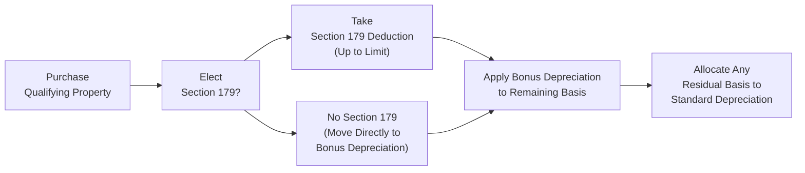

## 13.2 Section 179 Expensing and Bonus Depreciation

Efficiently recovering the cost of business property is a key driver for managing taxable income, enhancing cash flow, and funding future growth. Within the Internal Revenue Code (IRC), two pivotal provisions for accelerating depreciation deductions are Section 179 expensing and Bonus Depreciation. These tools can significantly reduce taxable income in the year of purchase, thereby freeing up resources for reinvestment. This section explores how Section 179 expensing and Bonus Depreciation work, their respective limitations, and the interplay between them. We also discuss listed property constraints, practical examples, and best practices to ensure you fully leverage these provisions while staying compliant with federal tax regulations.

--------------------------------------------------------------------------------

### Introduction

When businesses acquire assets (e.g., machinery, office equipment, technology, vehicles) used in active trade or business, they typically recover those costs through depreciation deductions over the asset’s useful life. Depreciation schedules can extend for multiple years under the Modified Accelerated Cost Recovery System (MACRS). However, two special provisions allow for immediate or near-immediate expensing of much of the purchase price:

• Section 179 Expensing  
• Bonus Depreciation  

Using either (or both) can bring forward deductions that might otherwise be stretched over several years. Doing so can reduce the business’s current tax liability, provided certain limitations and thresholds are respected. This simultaneous acceleration of deductions can be immensely beneficial to both new and existing businesses that continuously invest in equipment and properties.

--------------------------------------------------------------------------------

### Section 179 Expensing

Section 179 of the Internal Revenue Code enables taxpayers to make an immediate deduction (or “expense”) for a portion or sometimes all of the cost of certain qualifying property in the year it is placed in service, rather than capitalizing and depreciating it over multiple years. This accelerated write-off can greatly simplify recordkeeping and improve cash flow, but it comes with specific constraints, including annual dollar limits, phase-outs, and taxable income limitations.

#### Qualifying Property for Section 179

To take advantage of Section 179 expensing, the property must meet certain requirements:

• Tangible personal property (e.g., machinery, manufacturing equipment, computers, office furniture, and certain vehicles) used in an active trade or business.  
• Off-the-shelf computer software that is readily available to the general public and is not custom-developed for a specific taxpayer.  
• Qualified improvement property (QIP) that generally includes interior improvements to nonresidential real property (excluding elevators/escalators, enlargements, and internal structural framework).  

Real property such as land or buildings outside of qualified improvement property usually does not qualify under Section 179. Always confirm whether the property fits within the allowable categories before making the Section 179 election.

#### Annual Deduction Limits and Phase-Out Thresholds

One of the most crucial aspects of Section 179 is its annual deduction limit. While the specific amount is adjusted for inflation each tax year, the concept remains the same:

• For example, imagine the Section 179 overall deduction limit (the “annual cap”) might be set at $1,160,000 in a given year.  
• There is also a phase-out threshold. If the total cost of Section 179 property placed in service during the taxable year exceeds a specified threshold—say $2,890,000—the Section 179 deduction phases out dollar for dollar above this limit. Essentially, once a business purchases too much qualifying property in one year, the maximum Section 179 available is reduced.  

A simple formula for the Section 179 phase-out is:  
If the cost of qualifying property > Phase-Out Threshold, Section 179 Deduction is reduced = (Cost of qualifying property – Phase-Out Threshold).

Taxpayers should keep these phase-outs in mind when timing asset acquisitions, especially if near the limit. Each year, the IRS publishes updated amounts, taking inflation adjustments into account.

#### Deduction Limitations Based on Taxable Income

Even if the taxpayer has not exceeded the annual dollar limit and remains below the phase-out threshold, the Section 179 deduction cannot exceed the business’s taxable income (from active trades or businesses) for the year. In other words, the Section 179 election cannot create or increase a net operating loss (NOL).

• If the total Section 179 deduction would surpass the taxable income for the year, the “excess” portion is carried forward indefinitely. In subsequent years, that carryforward may be used if there is additional taxable income to support it.  

This limitation ensures that companies only deduct their eligible purchase costs to the extent they are offsetting active income. If a business is anticipating low taxable income in the current year but higher income in subsequent years, it may choose to moderate its Section 179 election or combine it with Bonus Depreciation strategies to optimize total deductions over multiple periods.

#### Listed Property Constraints

“Listed property” includes assets that lend themselves easily to both business and personal use. Such property could include passenger automobiles, certain types of computer equipment, and other personal-use items. Tax rules impose additional substantiation requirements for listed property, including stringent recordkeeping that documents the percentage of business use vs. personal use.

For Section 179 expensing (and in some cases for Bonus Depreciation), if a listed property is used less than 50% for business purposes in the year it is placed in service, the property is not eligible for these accelerated methods and must be depreciated under the Alternative Depreciation System (ADS). Moreover, if business usage drops below 50% in subsequent years, the taxpayer may have to recapture a portion of the deductions taken in prior years, effectively reversing the benefit of accelerated cost recovery.

Common examples of listed property revolve around passenger automobiles. The tax law places “luxury auto limits” on passenger vehicles used in business, capping the allowable first-year deduction for such vehicles, even if they otherwise meet Section 179 or Bonus Depreciation criteria. These caps can significantly constrain how much of the vehicle cost is expensed in the first year—particularly for lower-weight passenger cars intended for personal use more frequently.

#### Recapture Rules

If, after claiming Section 179 deductions, the business ceases to use the property in a qualified business manner (e.g., usage falls under 50% for listed property), the IRS may require recapture of a portion of the accelerated depreciation. Recapture triggers a form of “income inclusion” so that the taxpayer ends up recognizing part of the prior deduction as income in the year of the change in usage or disposition.

Careful recordkeeping is crucial. Taxpayers must document:

• The date the property was placed in service.  
• The adjusted basis and total deductions taken.  
• Percentage of personal vs. business usage (especially for listed property).

--------------------------------------------------------------------------------

### Interaction of Section 179 with Bonus Depreciation

Section 179 and Bonus Depreciation are not mutually exclusive; businesses can apply both in the same year on different groups of assets or even on the same asset if the cost exceeds the Section 179 deduction limit. The general ordering rule is:

1. Elect Section 179 on qualified property to the extent desired (subject to limits and the phase-out).  
2. Apply Bonus Depreciation to any remaining basis.  
3. Depreciate the leftover basis under MACRS or applicable depreciation methods.  

This interplay enables businesses to structure their deductions for optimal benefit, especially when confronting limitations on Section 179 due to the taxable income threshold or the phase-out threshold. If a company has already “maxed out” its Section 179 deduction but still has un-depreciated basis on new assets, Bonus Depreciation often takes over to provide further immediate expensing.

In brief:  
• Section 179 helps you “front-load” deductions but is limited by the company’s taxable income and annual thresholds.  
• Bonus Depreciation can then be applied if any basis remains. There is no phase-out maximum for Bonus Depreciation in the same sense as Section 179.

--------------------------------------------------------------------------------

### Bonus Depreciation Overview

Bonus Depreciation, governed under IRC §168(k), allows taxpayers to claim a percentage of the cost of eligible property in the year it is placed in service. This “bonus” write-off can apply in addition to, or in lieu of, Section 179 for qualifying property.

#### Eligibility for Bonus Depreciation

Eligible property generally includes depreciable business assets (with a recovery period of 20 years or less) such as:

• Machinery, equipment, and other tangible personal property.  
• Qualified improvement property placed in service after a certain date (subject to legislative adjustments).  
• Certain computer software that is depreciable over a 15-year period or less.  

The bonus depreciation percentage has changed over time (e.g., 100% for assets placed in service in certain years). Under current law, this percentage is scheduled to gradually phase down unless extended by new legislation. Always check the applicable tax year to confirm the available percentage.

#### No Investment Limit or Phase-Out

Unlike Section 179, Bonus Depreciation does not have an upper investment dollar limit. Also, you do not need taxable income to claim the deduction. This means Bonus Depreciation can create or increase an NOL, permitting some businesses to carry back or carry forward losses. Thus, in scenarios where businesses expect taxable losses anyway, Bonus Depreciation can be more advantageous than Section 179—especially if creating or enlarging an NOL yields future or immediate benefits.

#### Listed Property Considerations

Bonus Depreciation applies to business-use assets. To claim bonus depreciation for listed property, the taxpayer must still maintain at least 50% qualified business use of the asset. The same recapture concerns and usage documentation apply as with Section 179. Additionally, the luxury auto limitations also curb the portion of the deduction for passenger vehicles.

--------------------------------------------------------------------------------

### Practical Example: Combining Section 179 and Bonus Depreciation

Suppose ABC Manufacturing, Inc. purchases the following assets for its new facility:

• A laser cutting machine costing $900,000 (100% business use).  
• Office furniture costing $100,000.  
• Computer hardware costing $60,000, used 100% for business.  

It has no other Section 179 property this year. Assume the Section 179 limit is $1,160,000, and the business has adequate taxable income to support it.

1) ABC can elect to expense the entire cost of the laser cutting machine ($900,000), office furniture ($100,000), and computer hardware ($60,000) using Section 179—total $1,060,000. Because this total is under the $1,160,000 limit, the entire amount could be deducted immediately, reducing current taxable income substantially.  
2) If ABC had purchased extra machinery pushing total equipment acquisition costs beyond the phase-out threshold (say $2,890,000 for the year), its Section 179 ceiling would be reduced by the dollar-for-dollar amount over that threshold. ABC might then choose to use Bonus Depreciation on the balance, still achieving a first-year write-off for most, if not all, of those purchases.

This flexibility allows businesses to maximize immediate deductions, mindful of the interplay between the Section 179 phase-out, taxable income limitations, and unlimited Bonus Depreciation.

--------------------------------------------------------------------------------

### Diagram: Workflow of Section 179 and Bonus Depreciation

Below is a simplified representation of how Section 179 and Bonus Depreciation decisions typically flow in a step-by-step manner:

Explanation of Nodes:
• Purchase Qualifying Property: The taxpayer must confirm that the property purchased is eligible for Section 179 and/or Bonus Depreciation.  
• Elect Section 179?: Decide whether to claim Section 179 expensing and how much of the cost to expense, within the annual limits and phase-out.  
• Section 179 Deduction: If used, the allowable deduction is taken first.  
• Bonus Depreciation: After Section 179 is applied, any remaining (or full) basis can be considered for Bonus Depreciation.  
• Standard Depreciation: Whatever portion—if any—remains unclaimed through Section 179 or Bonus Depreciation is then recovered through the normal MACRS schedule.

--------------------------------------------------------------------------------

### Best Practices and Common Pitfalls

• Thorough Recordkeeping: Especially for listed property, meticulously track business use percentages. Inadequate documentation can lead to lost or reduced deductions and IRS scrutiny.  
• Monitoring Taxable Income: If your business lacks the taxable income to fully utilize Section 179, consider how a forward-looking approach may yield better overall results.  
• Staying Updated: The rules, annual limits, and phase-out thresholds for both Section 179 and Bonus Depreciation often change year to year. Always confirm current legal limits, especially if you are close to the thresholds.  
• Strategy for NOLs: Bonus Depreciation can generate immediate NOLs if beneficial, while Section 179 is limited by taxable income and “carries forward” any excess.  
• Listed Property Mid-Year Changes: If the proportion of business use declines below 50% for a previously deducted asset, you may be required to recapture previously claimed deductions.

--------------------------------------------------------------------------------

### Case Study: Small Retailer Expanding Operations

XYZ Retail, LLC is a small chain of specialty stores. Anticipating an improved economy, it decides to purchase additional computer systems for inventory management and point-of-sale terminals. The owners estimate a cost of $250,000 for these upgrades and consider using Section 179 to fully expense the purchase.

• Step 1: Check if property qualifies. The off-the-shelf software and computer equipment meet the standards for Section 179.  
• Step 2: Check annual limit. If the Section 179 deduction limit is $1,160,000 for that year, and XYZ has only spent $250,000 on qualifying assets, it’s well within the limit.  
• Step 3: Check taxable income. The owners project at least $400,000 in net taxable income from the business, so $250,000 is fully deductible under Section 179, leaving $150,000 of taxable income.  
• Step 4: Confirm no phase-out. The total cost of qualifying property is under the $2,890,000 threshold, so no phase-out applies.  
• Step 5: Make the Section 179 election on the tax return. XYZ deducts $250,000 immediately, saving the company thousands of dollars in taxes in the current year.  

If business usage remains over 50% and the property is not sold to a related party or otherwise recaptured, XYZ retains the benefit of this accelerated write-off for good.

--------------------------------------------------------------------------------

### Conclusion

Section 179 expensing and Bonus Depreciation are powerful tools to accelerate the recovery of capital investments. By deducting large portions (or even the entire cost) of a qualified asset in the early years, businesses can generate both immediate tax savings and improved cash flow—capital that can be crucial for innovation, expansion, or meeting daily operating needs. Despite the attractive advantages, taxpayers should be aware of constraints on listed property, ever-changing annual limits, and the importance of matching deductions to overall tax strategies (e.g., managing net operating losses, balancing the timing of significant purchases, and verifying that they do not inadvertently trigger recapture in subsequent years). Always keep abreast of legislative updates, consult official IRS publications, and, when needed, seek professional advice to ensure you are in compliance while reaping the maximum benefits.

--------------------------------------------------------------------------------

## Test Your Mastery of Section 179 Expensing and Bonus Depreciation



### Which of the following best describes the annual limit on Section 179 expensing?  
- [ ] It is unlimited for all tangible personal property.  
- [x] It is subject to an annual deduction cap and a phase-out threshold.  
- [ ] It can exceed the taxpayer’s business income.  
- [ ] It applies only to real property.  

> **Explanation:** Section 179 has a specific annual deduction limit that is adjusted for inflation and a phase-out threshold. Deductions cannot exceed the taxpayer’s active business income, and it generally applies to certain tangible personal property and qualifying improvements, not all real property.

### Which of these assets is typically eligible for Section 179?  
- [x] Computer hardware purchased for exclusive use in a trade or business.  
- [ ] Residential rental real estate purchased for investment.  
- [ ] Land improvements that include a new parking lot.  
- [ ] Personal jewelry used by an owner.  

> **Explanation:** Computer hardware for business use is a classic example of qualifying property. Residential real estate, parking lot improvements, and personal property for private use do not meet the criteria for Section 179 expensing.

### A taxpayer invests in multiple assets, totaling $3.0 million. If the phase-out threshold for Section 179 is $2.89 million, how is the Section 179 deduction affected?  
- [x] It is reduced dollar for dollar by the amount exceeding the threshold.  
- [ ] There is no effect on Section 179 because total investments are irrelevant.  
- [ ] It is automatically zero if the cost exceeds the threshold.  
- [ ] It is increased by the phase-out amount.  

> **Explanation:** When the total qualifying property placed in service exceeds the phase-out threshold, the available Section 179 deduction is reduced dollar for dollar by the amount exceeding that threshold.

### If a taxpayer’s Section 179 deduction would surpass taxable income, what typically happens to the excess deduction?  
- [ ] It is forfeited entirely.  
- [x] It is carried forward to future years.  
- [ ] It can still be used to create or increase an NOL.  
- [ ] It is applied to the owner’s personal expenditures.  

> **Explanation:** The Section 179 deduction cannot create or increase an NOL. If it exceeds current-year taxable income, the excess is carried forward. This carryforward can be used in subsequent years when the taxpayer has sufficient taxable income.

### Which of the following is true regarding the luxury auto limitation for listed property?  
- [ ] Section 179 eliminates the luxury auto limitation completely.  
- [ ] Bonus Depreciation always overrides the luxury auto limitation.  
- [x] The luxury auto limitation caps first-year deductions for passenger vehicles.  
- [ ] The luxury auto limit is irrelevant to Section 179 and listed property rules.  

> **Explanation:** Special “luxury auto limits” cap the immediate deduction for passenger vehicles, even if eligible for Section 179 or Bonus Depreciation. These limits ensure that extremely expensive vehicles do not receive full immediate expensing.

### Which statement best describes listed property?  
- [ ] It includes only intangible assets like patents or goodwill.  
- [ ] It applies to any tangible property used 100% for business.  
- [x] It describes property subject to special limitations due to possible personal use, such as passenger automobiles.  
- [ ] It is exempt from special recordkeeping requirements.  

> **Explanation:** Listed property includes assets like passenger automobiles and certain computers where personal use is common. They require special recordkeeping and must maintain at least 50% business use to enjoy full Section 179 or Bonus Depreciation benefits.

### Which of the following is true about Bonus Depreciation compared to Section 179?  
- [ ] It cannot create or increase an NOL.  
- [x] It does not have an annual dollar limit or a phase-out threshold.  
- [ ] It only applies to vehicles and office furniture.  
- [x] It can be claimed after Section 179 is applied on the same asset.  

> **Explanation:** Bonus Depreciation lacks an investment limit or phase-out like Section 179. You can claim Bonus Depreciation even if the deductible amount exceeds current taxable income, potentially creating or increasing an NOL. Also, Bonus Depreciation is normally applied on any remaining basis after a Section 179 election.

### If a taxpayer’s listed property’s usage falls below 50% business use after having taken Section 179 in the first year, what occurs?  
- [ ] The deduction remains fully intact.  
- [ ] The property is automatically reclassified as intangible.  
- [x] A recapture of deductions previously taken is required.  
- [ ] No Section 179 deductions can be taken for future assets.  

> **Explanation:** If listed property’s business use falls below 50% after Section 179 or Bonus Depreciation has been claimed, the taxpayer must recapture part of the prior deduction, effectively increasing current-year taxable income.

### Which of the following depicts the correct ordering of claiming deductions on a new asset purchase?  
- [ ] Bonus Depreciation first, then Section 179, then regular depreciation.  
- [x] Section 179 first, then Bonus Depreciation, then regular depreciation.  
- [ ] Regular depreciation first, then Section 179.  
- [ ] Section 179 and Bonus Depreciation occur simultaneously.  

> **Explanation:** The typical sequence is to apply Section 179, then Bonus Depreciation, and then depreciate the remainder. This order lets you strategically maximize current year deductions within set limits.

### Bonus Depreciation can be used on qualified property without regard to phase-outs, even if total acquisitions exceed Section 179’s phase-out threshold.  
- [x] True  
- [ ] False  

> **Explanation:** Bonus Depreciation has no investment or phase-out threshold. This feature makes it useful if you exceed Section 179’s allowable limit or phase-out range.



--------------------------------------------------------------------------------

## For Additional Practice and Deeper Preparation

### [Taxation & Regulation (REG) CPA Mock Exams](https://www.udemy.com/course/reg-cpa-mock-exams/?referralCode=55419EBD198F61530B12)

**Taxation & Regulation (REG) CPA Mocks:** 6 Full (1,500 Qs), Harder Than Real! In-Depth & Clear. Crush With Confidence!

- Tackle full-length mock exams designed to mirror real REG questions.  
- Refine your exam-day strategies with detailed, step-by-step solutions for every scenario.  
- Explore in-depth rationales that reinforce higher-level concepts, giving you an edge on test day.  
- Boost confidence and minimize anxiety by mastering every corner of the REG blueprint.  
- Perfect for those seeking exceptionally hard mocks and real-world readiness.

_Disclaimer: This course is not endorsed by or affiliated with the AICPA, NASBA, or any official CPA Examination authority. All content is for educational and preparatory purposes only._
