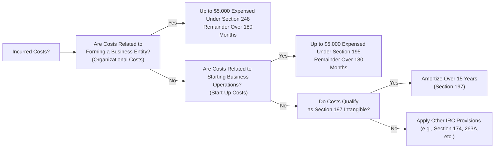

## 13.3 Amortization of Intangibles (Start-Up, Organization, Other)

Intangible assets can often be the backbone of a business’s long-term success, yet their tax treatment can be complex. Under U.S. federal tax law, specific categories of intangible costs—such as start-up expenditures, organizational costs, and other Section 197 intangibles—carry unique amortization rules, elections, and planning considerations. This section describes the relevant Internal Revenue Code (IRC) provisions (including Sections 195, 197, and 248) and clarifies the approaches for amortizing these costs over required statutory periods. Understanding these provisions is essential not only for compliance but also for strategic tax planning to minimize current and future tax burdens.

--------------------------------------------------------------------------------
### Overview of Intangible Amortization

From a tax perspective, intangible assets are generally those assets without a physical form that can provide a long-term benefit to a business. Common examples include trademarks, patents, goodwill, going-concern value, licenses, and noncompetition agreements. The foundational rule for many of these assets stems from IRC § 197, which prescribes a straight-line 15-year amortization period for intangible property that meets statutory definitions. However, two special categories—start-up costs and organizational costs—are governed by IRC § 195 and IRC § 248, respectively, and they each carry unique first-year expensing elections and amortization rules.

--------------------------------------------------------------------------------
### Section 197 Intangibles

#### 197 Intangible Defined
Section 197 intangible property comprises a wide range of assets acquired as part of a trade or business, including:
• Goodwill and going-concern value  
• Workforce in place  
• Business books and records, operating systems, or any other information base  
• Licenses, permits, or other rights granted by a governmental unit  
• Covenants not to compete entered into in connection with an acquisition  
• Franchises, trademarks, or trade names  

In general, intangible assets that are not self-created and are purchased as part of an active trade or business acquisition may fall under the Section 197 umbrella.

#### 15-Year Amortization Period
Under § 197, these intangibles are typically amortized on a straight-line basis over 15 years (180 months), beginning with the month the intangible asset is acquired. For tax purposes:

$$
\text{Annual Amortization} \;=\; \frac{\text{Adjusted Basis of the Intangible}}{15}
$$

If the intangible asset is acquired partway through the tax year, prorated amortization applies based on the months the intangible is held during that initial year.

#### Exclusions from Section 197
While § 197 is fairly comprehensive, it does not apply universally. Certain intangibles (e.g., self-created intangible property such as internally developed patents or software, interests in a partnership, and certain financial instruments) may be excluded from § 197 amortization. Such assets might be accounted for under other provisions or capitalized and amortized based on different statutory periods or guidelines.

--------------------------------------------------------------------------------
### Start-Up Expenditures (IRC § 195)

#### Defining Start-Up Costs
Start-up costs are ordinary and necessary expenditures incurred before a business actually begins operations. Examples include:

• Market research and feasibility studies  
• Advertising and promotional expenses prior to opening  
• Salaries and wages paid to employees in training  
• Travel and maintenance expenses incident to prospective business development  

Under IRC § 195, taxpayers can elect to deduct a limited amount of start-up costs in the first year, with the balance amortized over a 180-month (15-year) period, beginning with the month in which the active trade or business commences.

#### Electing Immediate Expensing
Generally, a business may elect to deduct up to $5,000 of start-up expenditures in the taxable year in which the business begins. However, this $5,000 immediate deduction is reduced (but not below zero) by the amount of start-up expenditures that exceed $50,000. For example, if a taxpayer incurs $52,000 of start-up costs:

• Immediate deduction allowed = $5,000 – ($52,000 – $50,000) = $3,000  
• Remaining $49,000 = Amortized over 180 months (15 years)  

If the total start-up costs are $55,000 or more, the entire $5,000 immediate deduction is phased out, and the taxpayer must capitalize all the costs and amortize them over 180 months.

#### When the 180-Month Period Begins
Taxpayers begin amortizing the reduced balance of start-up costs with the month in which the active conduct of business commences. That means if your business officially starts in October, you begin amortization in October.

#### Special Considerations for Amended Returns
If a taxpayer fails to elect the $5,000 immediate write-off of start-up expenditures in the first year of business, there may be opportunities to correct the oversight via an amended return—subject to strict timing and procedural requirements. Always consult official IRS guidance and regulations for up-to-date procedures regarding late or missed elections.

--------------------------------------------------------------------------------
### Organizational Expenditures (IRC § 248)

#### Nature of Organizational Costs
Organizational expenditures are costs incurred to form a corporation or a partnership. For corporations, IRC § 248 governs the election, while for partnerships, IRC § 709 typically provides similar treatment. Common examples include:

• Legal fees for drafting the corporate charter or partnership agreement  
• Filing fees required by the state of incorporation or partnership registration  
• Transactional costs of organizational meetings (e.g., directors’ or partners’ meetings)  

#### First-Year Expensing Election
Like start-up costs, up to $5,000 of organizational expenditures can be immediately expensed in the first year of the entity’s existence, subject to a phase-out once total organizational costs exceed $50,000. Any remaining balance is capitalized and amortized on a straight-line basis over 180 months, beginning with the month of the entity’s formation.

#### Distinction Between Organization and Start-Up Costs
A fine line often exists between organizational costs (forming the entity) and start-up costs (preparing the business to operate). While the same general $5,000-plus-180-month framework applies, it is critical to track these costs separately to ensure accurate classification and proper tax treatment.

--------------------------------------------------------------------------------
### Other Common Intangible Amortization Situations

#### Research and Experimentation (R&E) Costs
Historically, taxpayers could elect to expense or capitalize and amortize R&E expenditures under IRC § 174. Recent changes in the law have placed more constraints on immediate expensing, requiring many R&E costs (especially software development costs) to be capitalized and amortized over five years for domestic research and over 15 years for foreign research. While specific to R&E, these changes underscore the importance of identifying the correct IRC provision applicable to each intangible cost.

#### Software Development Costs
Depending on how software is acquired or developed, the tax treatment can vary widely. Certain purchased software may be amortized over three years under Rev. Proc. 2000-50 if it does not fall under § 197. Self-developed software may be treated akin to R&E expenditures, or it may qualify as § 197 intangible property if acquired in a business acquisition.

#### License Agreements and Certain Contract Rights
Whenever a taxpayer acquires a license, a franchise, a broadcast spectrum, or other contract rights that generate a long-term benefit for the business, the general § 197 rules often apply. If the cost structure contemplates ongoing royalties or fees, a portion of these payments may remain deductible as ordinary business expenses rather than amortized as intangible costs—careful analysis and documentation are paramount.

--------------------------------------------------------------------------------
### Diagram: Classification of Intangible Costs

Below is a simplified flowchart to help classify intangible costs for tax purposes:

This flowchart represents a high-level approach. The unique facts of each situation—such as the date of purchase, manner of acquisition, and nature of the costs—will govern which code section applies. Always confirm the specific tax rules, especially if the intangible does not fit neatly into these categories.

--------------------------------------------------------------------------------
### Key Considerations and Special Elections

1. **Election Statements**  
   • A taxpayer must attach a statement to the timely filed return (including extensions) to elect the first-year $5,000 expensing for start-up or organizational expenditures.  
   • Lack of a proper statement may default the taxpayer to capitalizing the full costs and amortizing them over 180 months.

2. **Timing of Elections**  
   • For start-up costs, the election is made in the year the business begins.  
   • For organizational costs, the election is made in the year the entity is formed.  
   • Late or missed elections may be corrected through certain administrative procedures if allowed.  

3. **Consistent Classification**  
   • Accurate recordkeeping matters: keep your costs distinctly separated into start-up, organizational, Section 197, and other intangible categories.  
   • If the IRS challenges your classification, well-documented support can mitigate disputes.

4. **Phase-Out Triggers**  
   • The $5,000 immediate deduction for start-up and organizational expenditures is subject to a phase-out that begins at total qualifying costs of $50,000.  
   • Once you exceed $55,000 in either category, the entire $5,000 is lost, and you must amortize the full amount over 180 months.

5. **Coordination with Financial Accounting**  
   • Financial accounting (GAAP) often follows a different set of rules for intangible asset treatment (e.g., goodwill is not amortized for GAAP).  
   • This discrepancy can create permanent or timing differences, frequently reconciled on Schedule M-1 or M-3 for corporate taxpayers.

--------------------------------------------------------------------------------
### Practical Example: Start-Up and Organizational Costs

Suppose Bright Horizon, Inc. is formed in July and officially begins business operations in September of the same year. It incurs:

• $4,000 in legal fees to draft and file the corporate charter  
• $2,000 in market feasibility studies  
• $52,000 in product development and pre-opening marketing  

Step 1: Classify the Costs  
• Organizational Costs: $4,000 (legal fees for incorporation).  
• Start-Up Costs: $2,000 (market feasibility study) + $52,000 (product development and pre-opening marketing) = $54,000 total.

Step 2: Apply Phase-Out Rules  
• Organizational Costs ($4,000): Less than $50,000, so no phase-out. The corporation can expense the first $4,000 in the tax year, with $0 remaining to amortize.  
• Start-Up Costs ($54,000): The immediate $5,000 deduction is reduced by ($54,000 – $50,000) = $4,000; so only $1,000 of start-up costs can be expensed in the year. The remaining $53,000 must be capitalized and amortized over 180 months.

Step 3: Calculate Monthly Amortization for Start-Up Costs  
• $53,000 / 180 months = $294.44 per month.  
• Annual amortization for 12 months (if the business is active for a full 12 months of the tax year) would be $3,533.28. However, if the business commenced in September, the corporation would typically take four months of amortization (September through December) for its first tax year, assuming a calendar-year taxpayer.

This example highlights the importance of segregating costs, making the appropriate elections, and applying phase-out rules for amounts exceeding $50,000.

--------------------------------------------------------------------------------
### Best Practices and Common Pitfalls

• **Maintain Detailed Records:** Combining start-up or organizational costs with operating expenses can lead to classification errors and potential IRS challenges.  
• **Monitor the $50,000 Threshold:** Exceeding the $50,000 threshold for either start-up or organizational costs significantly diminishes the benefit of immediate expensing.  
• **Timely File Election Statements:** Missing the first-year election can limit your deduction potential and complicate your overall tax position.  
• **Use Consistent Methodologies:** Whether you’re classifying intangible costs under § 197, § 195, or § 248, follow uniform documentation protocols—this can be vital if audited.  
• **Consider State Tax Implications:** Some states do not conform entirely to federal rules, so the timing and method of intangible cost recovery may differ for state tax purposes.  
• **Plan Ahead for Business Acquisitions:** When buying a business, intangible allocations can drive significant tax outcomes. Thorough due diligence on potential intangible categories ensures accurate allocations in the purchase agreement.  

--------------------------------------------------------------------------------
### Links and References
• IRC § 197 and relevant Treasury Regulations  
• IRC § 195 (Start-Up Expenditures)  
• IRC § 248 (Organizational Expenditures)  
• IRC § 174 (Research and Experimental Expenditures)  
• IRS Publication 535 (Business Expenses)  
• IRS Publication 542 (Corporations)  

--------------------------------------------------------------------------------

## Test Your Mastery of Intangible Amortization, Start-Up & Organizational Costs



### A taxpayer may begin amortizing start-up costs under Section 195:
- [ ] In the month the costs were paid.
- [ ] At the beginning of the tax year in which the entity is formed.
- [x] In the month when active business operations begin.
- [ ] Only after the first full year of operations.

> **Explanation:** Section 195 mandates that amortization begins in the month the active conduct of business or trade commences.

### For organizational expenditures in excess of $55,000:
- [ ] The first $5,000 is still deductible as an expense.
- [ ] Only $2,500 remains deductible immediately.
- [x] No immediate expensing is available, and the entire amount must be amortized over 180 months.
- [ ] The entire amount can be deducted immediately if the proper election is made.

> **Explanation:** Once total organizational expenditures exceed $55,000, the $5,000 immediate deduction is fully phased out. The total cost must be amortized.

### Which of the following intangibles is generally amortized under Section 197?
- [ ] Inventories and supplies.
- [x] Goodwill acquired in a business purchase.
- [ ] Self-created software developed by the taxpayer.
- [ ] Leasehold improvements.

> **Explanation:** Goodwill acquired in a business merger or acquisition is explicitly considered a Section 197 intangible, typically amortized over 15 years.

### If a taxpayer fails to attach a proper election statement for start-up costs:
- [ ] No start-up expenses are allowed in any year.
- [x] The taxpayer must generally capitalize and amortize all such costs over 180 months.
- [ ] The taxpayer can fully deduct all costs under Section 179.
- [ ] The costs are permanently disallowed.

> **Explanation:** Failure to make a timely election defaults the taxpayer to full capitalization with amortization, unless a correction is made via an amended return or another approved procedure.

### Under Section 197, the standard amortization period for purchased intangibles such as trademarks or noncompete agreements is:
- [x] 15 years, on a straight-line basis.
- [ ] 10 years, on a double-declining balance method.
- [x] 15 years, with a half-year convention.
- [ ] 7 years, under MACRS guidelines.

> **Explanation:** Section 197 generally prescribes a straight-line recovery period of 15 years, beginning with the month the intangible is acquired. Some states or specific circumstances might differ, but federal rules remain 15 years on a straight-line basis. (Note that some practitioners colloquially refer to it as beginning mid-month, which effectively can look like a half-year approach in year of acquisition, but the default principle is monthly amortization over 180 months.)

### Section 248 applies primarily to:
- [ ] Start-up cost deductions for sole proprietorships.
- [ ] R&E expenditures for software development.
- [ ] The amortization of self-developed patents.
- [x] Organizational costs for corporations (with similar rules for partnerships under Section 709).

> **Explanation:** Section 248 deals specifically with corporate organization costs; parallel treatment exists for partnerships under Section 709.

### Which of the following costs would NOT qualify as a start-up expenditure under Section 195?
- [x] Expenditure incurred after the business has commenced operations.
- [ ] Pre-opening advertising costs.
- [x] Employee training costs before the first sale.
- [ ] Market feasibility studies.

> **Explanation:** Start-up expenditures are those incurred before the business is fully operational. Once the business has officially started operations, subsequent costs are ordinary business expenses, not start-up costs.

### The cap on immediate expensing of start-up costs before any phase-out applies is:
- [ ] $10,000
- [ ] $50,000
- [x] $5,000
- [ ] $1,000

> **Explanation:** Under Section 195, a taxpayer may elect to deduct up to $5,000 of start-up costs in the first year of active business, subject to phase-out above $50,000 in total expenses.

### All of the following are examples of Section 197 intangibles EXCEPT:
- [ ] A covenant not to compete acquired through a business purchase.
- [ ] Going concern value secured in an acquisition.
- [ ] Trademarks acquired as part of a business purchase.
- [x] Office furniture acquired with a business purchase.

> **Explanation:** Section 197 covers intangible assets. Office furniture is tangible property and would be depreciated under MACRS, not amortized as an intangible over 15 years.

### True or False: An entity must file an election to expense organizational costs by the extended due date of its first return.
- [x] True
- [ ] False

> **Explanation:** The election for organizational costs must be attached to a timely filed return (including extensions). Without this election, the entity defaults to capitalizing the costs and amortizing them over 180 months.



--------------------------------------------------------------------------------

## For Additional Practice and Deeper Preparation

### [Taxation & Regulation (REG) CPA Mock Exams](https://www.udemy.com/course/reg-cpa-mock-exams/?referralCode=55419EBD198F61530B12)

**Taxation & Regulation (REG) CPA Mocks:** 6 Full (1,500 Qs), Harder Than Real! In-Depth & Clear. Crush With Confidence!

- Tackle full-length mock exams designed to mirror real REG questions.  
- Refine your exam-day strategies with detailed, step-by-step solutions for every scenario.  
- Explore in-depth rationales that reinforce higher-level concepts, giving you an edge on test day.  
- Boost confidence and minimize anxiety by mastering every corner of the REG blueprint.  
- Perfect for those seeking exceptionally hard mocks and real-world readiness.  

_Disclaimer: This course is not endorsed by or affiliated with the AICPA, NASBA, or any official CPA Examination authority. All content is for educational and preparatory purposes only._
