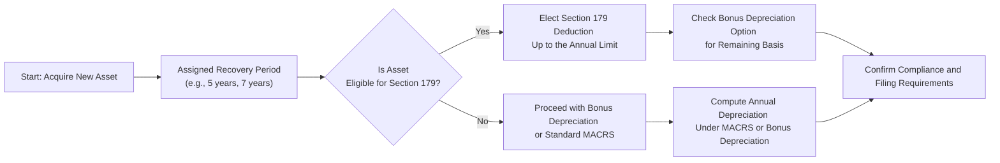

## 13.4 Strategic Implications and Compliance Considerations

Cost recovery through depreciation and amortization is one of the most direct ways for businesses and individuals to reduce taxable income. When combined with targeted provisions such as Section 179 expense deductions and bonus depreciation, the cost recovery system can serve as a powerful strategic tool. However, it also comes with a host of regulatory requirements and potential pitfalls that can lead to underutilized deductions or unwanted recapture. In this section, we examine practical strategies for maximizing deductions, coordinating Section 179 with bonus depreciation, and staying compliant with the Internal Revenue Code (IRC) and Treasury Regulations.

Use this chapter in conjunction with Chapters 13.1, 13.2, and 13.3 to solidify your understanding of depreciation methods and rules. Build upon their foundational concepts and learn how to apply them effectively to achieve tax efficiency.

--------------------------------------------------------------------------------

### Overview of Strategic Cost Recovery

Effective utilization of cost recovery provisions involves several factors:
• Timely identification of eligible assets.  
• Correct classification into applicable asset classes (5-year, 7-year, 15-year, etc.).  
• Thoughtful use of Section 179 and bonus depreciation elections.  
• Compliance with various annual thresholds.  
• Monitoring legislative updates that affect depreciation schedules.

Although the primary focus is often on tangible personal property (like machinery, furniture, and equipment), intangible assets may also qualify for amortization under specific rules discussed in Chapter 13.3. Understanding these nuances is key to maximizing your overall tax savings while adhering to the procedural requirements of the IRS.

--------------------------------------------------------------------------------

### Coordinating Section 179 with Bonus Depreciation

Section 179 allows qualified taxpayers to immediately expense certain tangible personal property—up to an annual limit—rather than recovering the cost over the asset’s life through MACRS. Concurrently, bonus depreciation grants a specified percentage of immediate expensing for qualified property placed into service during the tax year. Here’s how to best coordinate these two overarching provisions.

#### Understanding the Hierarchy of Deductions

When you place an asset in service, you must decide how much of its cost to deduct using Section 179 and/or bonus depreciation. The interaction typically follows this sequence:

1. Apply the Section 179 deduction (subject to statutory caps and business taxable income limitations).  
2. For the remaining, un-depreciated basis of eligible property, determine if you will use bonus depreciation.  
3. Apply MACRS to any leftover basis not entirely deducted under Section 179 or bonus depreciation.

Effective coordination requires a strategic assessment of your current-year income, projected future income, state conformity rules, and the business’s longer-term financial plan.

#### Section 179 Caps and Limits

• Annual Deduction Limit: Section 179 has a maximum annual deduction limit that fluctuates due to legislative updates and inflation indexing.  
• Business Income Limitation: The Section 179 deduction cannot exceed a taxpayer’s aggregate trade or business income for the year (with certain exceptions). Any disallowed Section 179 amount can carry forward indefinitely.

Careful forecasting can help ensure you use Section 179 to offset the highest possible taxable income in the current year thereby potentially reducing exposure to higher marginal tax rates. However, if the business anticipates higher income in future years, partial or no Section 179 election might be advisable, saving more valuable deductions for years when income (and rates) are higher.

#### Bonus Depreciation Considerations

Bonus depreciation typically allows taxpayers to deduct a significant portion—up to 100% in some recent tax years—of the cost of qualified property in the year it’s placed into service. This percentage has historically changed based on legislative acts; it is subject to future phaseouts and may not be available at the same rate every year.

When planning your overall depreciation strategy, consider whether immediate expensing through bonus depreciation (after Section 179) offers more benefit than standard depreciation. For instance, if taking large deductions today pushes you into a lower marginal tax bracket in subsequent years—when you could have benefited more from the deductions—an “over-expensing” scenario could result in suboptimal overall savings.

--------------------------------------------------------------------------------

### Key Pitfalls and Avoidance Strategies

Although the potential for large immediate tax benefits is tempting, taxpayers must be vigilant about compliance pitfalls and recordkeeping:

• Inadvertent “Over-Deduction”: Failing to properly account for the Section 179 limit or misclassifying assets could lead to an over-deduction, resulting in penalties and potential interest charges upon IRS examination.  
• State Conformity: Some states do not conform to federal Section 179 or bonus depreciation rules, or they have different thresholds. Plan ahead to avoid a mismatch between federal and state returns.  
• Mid-Quarter Convention Trap: If more than 40% of your total depreciable assets are placed in service in the last quarter of the tax year, the mid-quarter convention applies, potentially limiting first-year deductions.  
• Misclassification of Property Type: For example, incorrectly labeling an asset as 5-year property when it should be 7-year property can create a host of reporting discrepancies and possible recapture upon audit.  
• Recapture Obligations: If you dispose of or convert property to personal use before the class life is over, a portion of prior deductions may be subject to recapture.  
• Inadequate Documentation: Substantiation is crucial. Maintain purchase agreements, invoices, and records detailing the placed-in-service date, usage, and classification.  

By addressing these risks at the planning stage and implementing robust internal controls over capital expenditures, you can avoid significant negative consequences during an IRS audit.

--------------------------------------------------------------------------------

### Selecting the Optimal Cost Recovery Strategy

Choosing the best approach to cost recovery requires balancing multiple considerations, including but not limited to:

• Immediate vs. Deferred Tax Savings: Decide when you most need the tax support.  
• Aggregate Business Income: If you do not have enough taxable income, Section 179 may be limited, making bonus depreciation more appealing.  
• Future Business and Tax Rate Outlook: Postponing large deductions could be advantageous if you anticipate paying higher rates in the future. Conversely, claiming deductions early might be beneficial if you expect lower rates in the future or if you desire to reinvest immediate cash tax savings.  
• Potential Influence on Other Tax Attributes: Large current-year deductions can interfere with other tax benefits or credits tied to adjusted gross income (AGI) or other thresholds (e.g., Qualified Business Income Deduction).  

The following diagram illustrates a simplified decision flow for taxpayers considering Section 179 and bonus depreciation:

--------------------------------------------------------------------------------

### Timing Strategies and Capital Expenditures

#### Year-End Acceleration or Deferral

One of the most impactful areas of strategic planning involves the timing of purchases and placed-in-service dates. If mid-year financial projections reveal an unusually high taxable income, acquiring and placing assets in service late in the year could allow for an immediate expensing deduction. However, watch out for the mid-quarter convention, as it may reduce the overall first-year depreciation if the threshold is crossed.

#### Layering in Lease vs. Purchase Considerations

Leasing assets instead of purchasing them can shift the conversation from depreciation to current expense deductions for rental payments. However, certain “capital leases” may be effectively treated as acquisitions, which reintroduces depreciation (and interest) considerations. Always confirm the lease classification for proper tax reporting.

--------------------------------------------------------------------------------

### Interaction with Other Tax Provisions

Cost recovery decisions frequently intersect with other areas of the tax code. Here are some common entanglements to keep in mind:

#### Net Operating Losses (NOLs)

Taking large deductions through Section 179 and bonus depreciation can create or expand NOLs. If your business can carry these losses forward (or back, subject to the relevant tax law provisions in effect), you could potentially eliminate future taxable income. Conversely, an NOL in the current year may mean that some deductions yield no immediate tax benefit.

#### Qualified Business Income Deduction (QBI)

Pass-through businesses (e.g., sole proprietors, S corporations, partnerships) must consider how more significant deductions reduce their QBI. A lower QBI can reduce the 20% deduction under IRC §199A if taxable income is still above threshold levels. Taxpayers can weigh the advantage of immediate expensing against preserving higher QBI to maximize the deduction.

#### Business Credits

Overly aggressive depreciation strategies can sometimes conflict with certain tax credits or render them less impactful, particularly when a credit is tied to the basis of specific property (e.g., R&D, energy credits). If a large portion of an asset’s basis is immediately expensed, the tax basis for credit computation might be diminished.

--------------------------------------------------------------------------------

### State and Local Considerations

Many states do not fully adopt federal cost recovery rules. You may face:
• Disallowed or lower Section 179 deductions.  
• Different bonus depreciation phases or none at all.  
• Modifications that require an “add back” of certain deductions to state taxable income, creating a timing difference between federal and state returns.

Keep meticulous records of any state-specific adjustments to ensure no missteps. This can be especially relevant if your business operates in multiple states with differing rules.

--------------------------------------------------------------------------------

### Practical Examples and Case Studies

Below are two common scenarios that demonstrate different strategic outcomes:

#### Example 1: Maximizing Current-Year Savings

Imagine a small manufacturing business expecting a high-income year. Management purchases $300,000 worth of new machinery in April. The Section 179 annual limit suffices to fully deduct $300,000, and the company has ample taxable income to take the full deduction. Since the business wants to lower this year’s taxable income aggressively, taking the maximum Section 179 deduction is the best course. Bonus depreciation could also be used if the equipment qualifies, but in this scenario, the Section 179 route alone satisfies the strategic goal of immediate and maximum reduction, especially since the entire cost can be expensed without worrying about future rates.

#### Example 2: Balancing Future and Current Tax Deductions

A technology consultancy expects to be in a much higher tax bracket next year due to a major contract. This year’s taxable income is moderate, and taking an extensive Section 179 deduction now might be less valuable. Instead, they elect $0 Section 179 and rely on bonus depreciation for part of the cost, leaving some portion to be depreciated over time. This strategy preserves the ability to have significant deductions in subsequent years when higher income would benefit more from bigger depreciation claims. The result is a balanced approach that considers the multi-year trajectory of the business.

By comparing these scenarios, you can see the importance of aligning tax policy with business outlook. Long-term success often depends on anticipating future income trends and legal changes.

--------------------------------------------------------------------------------

### Recordkeeping and Documentation

To protect your tax positions, compile documentation that demonstrates:
• Original invoices and purchase orders.  
• The date each asset was placed in service.  
• Asset type and class life under MACRS.  
• Recorded Section 179 elections and computations.  
• Calculations supporting bonus depreciation and any partial-year convention used.  
• Justifications for special classifications, such as qualified leasehold improvements.  

Such substantiation can readily refute auditor challenges and ensure that you’ve maximized legitimate tax benefits.

--------------------------------------------------------------------------------

### Best Practices

1. Develop a Capital Asset Policy: Clearly define capitalization thresholds, usage criteria, and salvage value estimates to maintain internal consistency.  
2. Forecast Multiple Years: Use budgets and projections to identify the most advantageous distribution of deductions.  
3. Implement an Asset Tracking System: Link each asset’s tax life, placed-in-service date, and remaining basis to your general ledger.  
4. Periodically Revisit State Conformity: State laws can change, and you must stay updated to avoid reporting mismatches.  
5. Engage Professional Advice: Before making large capital outlays, consult tax professionals to confirm that your intended strategy aligns with current federal and state regulations.

--------------------------------------------------------------------------------

### Conclusion

Strategic cost recovery can be one of the most impactful avenues for reducing taxable income in a given year, but its benefits do not exist in a vacuum. By understanding the interplay between Section 179, bonus depreciation, standard MACRS, and the broader context of your business and tax environment (including state complications and other credits), you can craft a comprehensive plan. Whether you are a small business owner, a tax professional, or a student preparing for the CPA Exam, the value of thorough knowledge in this area cannot be overstated. When executed correctly and ethically, leveraging cost recovery provisions leads to immediate cash flow benefits, improved capital investment strategies, and well-informed decisions that contribute to long-term financial health.

--------------------------------------------------------------------------------

## Sharpen Your Cost Recovery Strategies: Section 179 and Bonus Depreciation Quiz



### Which deduction is typically applied first in the hierarchy when an asset is placed in service? 
- [x] Section 179 
- [ ] Bonus depreciation 
- [ ] Regular MACRS depreciation 
- [ ] Mid-quarter convention adjustments 

> **Explanation:** Under most circumstances, taxpayers will elect their Section 179 deduction first (subject to annual limits), then apply bonus depreciation to any remaining cost basis, with standard MACRS depreciation applied to the balance.

### If a taxpayer elects Section 179 but has insufficient business taxable income to absorb the full deduction, what generally happens to the excess?
- [x] The amount is carried forward indefinitely. 
- [ ] The amount is lost permanently.
- [ ] The amount can be carried back two years.
- [ ] The Section 179 deduction must be retroactively revoked.

> **Explanation:** Section 179 allows any unused deduction to be carried forward to future tax years until fully utilized, making it especially valuable for businesses with fluctuating income.

### Which of the following represents a potential pitfall related to depreciation conventions? 
- [x] The mid-quarter convention triggered if more than 40% of assets are placed in service in the final quarter. 
- [ ] Always using the half-year convention by default. 
- [ ] Treating intangible assets using the mid-month convention. 
- [ ] Allocating all depreciation to the last month of the tax year. 

> **Explanation:** The mid-quarter convention arises when more than 40% of depreciable assets are placed in service in the last quarter of the year, potentially limiting first-year deductions.

### A small business is deciding whether to fully use Section 179 on equipment placed in service this year. They anticipate a large jump in income next year. Which rationale might encourage a more moderate Section 179 election?
- [x] Larger deductions next year may offset higher future taxes more effectively. 
- [ ] They can only use Section 179 if they are also using bonus depreciation.
- [ ] The Section 179 election is always the better option than bonus depreciation.
- [ ] Section 179 is scheduled to phase out completely and is not available next year.

> **Explanation:** If a business expects higher future income (and therefore potentially higher effective tax rates), “saving” some deductions for future years (no or minimal Section 179) could yield greater tax benefits later.

### Which of the following is a key difference between Section 179 and bonus depreciation?
- [x] Section 179 is limited by taxable income restrictions; bonus depreciation is not. 
- [ ] Both require the asset to be used strictly for research and development tasks. 
- [ ] Bonus depreciation can only be applied if Section 179 is exhausted. 
- [ ] Section 179 is prohibited for tangible personal property. 

> **Explanation:** Section 179 deductions are capped by taxable income limitations, whereas bonus depreciation does not have a similar limitation, allowing businesses to create or enlarge net operating losses.

### When disposing of property subject to Section 179 before the end of its recovery period, which of the following is most likely to occur?
- [x] Recapture might be triggered on the portion of the property’s basis previously expensed. 
- [ ] The entire deduction remains intact with no future adjustments. 
- [ ] Only the bonus depreciation portion is recaptured. 
- [ ] The recapture applies only if the property was tangible real estate. 

> **Explanation:** Section 179 recapture occurs if the property is disposed of or no longer used for business before the end of its recovery period, requiring a recomputation of allowable depreciation.

### A company that operates in multiple states has chosen to take full federal bonus depreciation. Which issue might they face on their state returns?
- [x] Certain states may not allow or may limit bonus depreciation, requiring add-backs. 
- [ ] The state returns always follow the exact federal rules for depreciation. 
- [x] They cannot claim Section 179 if a state disallows bonus depreciation. 
- [ ] They must amend their federal return before filing their state returns. 

> **Explanation:** Some states do not conform to the federal treatment of bonus depreciation and may require taxpayers to add back the differential amount to state taxable income, resulting in separate state-level depreciation calculations.

### Which of the following best describes a possible interplay between Section 179 and the Qualified Business Income (QBI) deduction?
- [x] Reducing taxable income via Section 179 might also reduce QBI in certain pass-through entities, affecting the net 20% deduction. 
- [ ] The QBI deduction disqualifies a business from electing Section 179. 
- [ ] Section 179 must be taken after the QBI deduction is computed. 
- [ ] The QBI deduction is fully unaffected by depreciation or expensing elections. 

> **Explanation:** For pass-through entities, deductions for depreciation (including Section 179) can reduce QBI, potentially altering the amount of the §199A deduction.

### What is one of the main reasons state conformity to federal cost recovery rules is crucial for multi-state businesses?
- [x] Divergent depreciation rules can alter state taxable income and complicate compliance. 
- [ ] Federal rules never seem to matter at the state level. 
- [ ] States automatically follow bonus depreciation but not Section 179. 
- [ ] The IRS always requires separate statements crossing state lines. 

> **Explanation:** Each state may adjust or decouple from federal depreciation rules; the resulting differences can increase administrative complexity and produce variances in state tax liability.

### Under Section 179, which statement is TRUE regarding an asset placed in service?
- [x] It can immediately be expensed up to certain statutory limits, provided the asset is used more than 50% for business. 
- [ ] It must always follow a half-year convention. 
- [ ] The deduction will always require a change in accounting method approved by the IRS. 
- [ ] All assets exceeding $1,000 in cost must be capitalized and depreciated over 5 years. 

> **Explanation:** The Section 179 election allows an immediate expensing of eligible property (up to the annual limit), and the property must generally meet a more-than-50%-business-use test.



--------------------------------------------------------------------------------

## For Additional Practice and Deeper Preparation

### [Taxation & Regulation (REG) CPA Mock Exams](https://www.udemy.com/course/reg-cpa-mock-exams/?referralCode=55419EBD198F61530B12)

Taxation & Regulation (REG) CPA Mocks: 6 Full (1,500 Qs), Harder Than Real! In-Depth & Clear. Crush With Confidence!

- Tackle full-length mock exams designed to mirror real REG questions.  
- Refine your exam-day strategies with detailed, step-by-step solutions for every scenario.  
- Explore in-depth rationales that reinforce higher-level concepts, giving you an edge on test day.  
- Boost confidence and minimize anxiety by mastering every corner of the REG blueprint.  
- Perfect for those seeking exceptionally hard mocks and real-world readiness.  

_Disclaimer: This course is not endorsed by or affiliated with the AICPA, NASBA, or any official CPA Examination authority. All content is for educational and preparatory purposes only._
