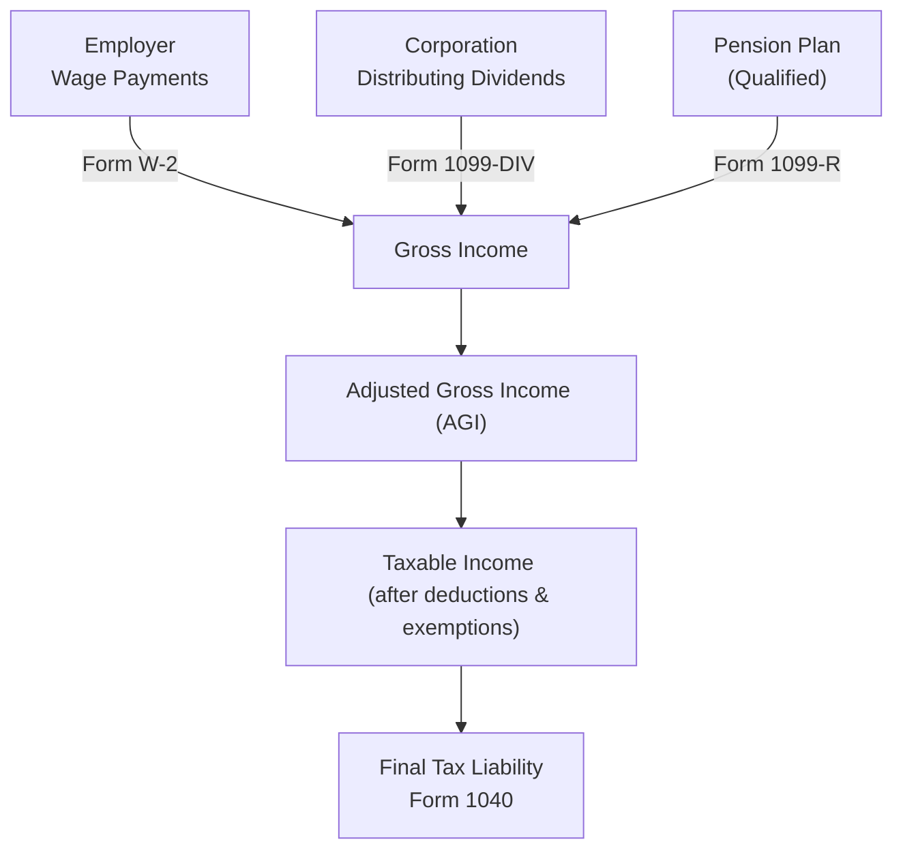

## 14.1 Items Included in Gross Income (Wages, Dividends, Pensions)

Understanding which items must be included in gross income is a critical component of federal tax compliance for individuals. Under Internal Revenue Code (IRC) §61, “gross income” is broadly defined as “all income from whatever source derived,” unless specifically excluded by statute. This includes wages, dividends, and certain pension distributions commonly encountered by taxpayers. In this section, we will examine the practical and regulatory details surrounding these three key categories of income that generally form the foundation of individual taxable income.

In studying these key topics, CPA candidates should not only know the definitions and nuances but also understand best practices for reporting, strategies to maximize compliance, and common pitfalls that can lead to under-reporting or errors. We will begin with wages, move on to dividends (both ordinary and qualified), and finalize with an overview of how pension income is typically taxed. Along the way, we will incorporate examples, diagrams, and real-world scenarios to demonstrate these principles in context.

---

### The Legal and Conceptual Framework of Gross Income
Before delving into wages, dividends, and pensions specifically, it is worth reiterating that gross income typically encompasses all accessions to wealth realized by the taxpayer. Exceptions exist (for example, certain fringe benefits, gifts, inheritances, or life insurance proceeds), but these exceptions must be expressly articulated in the tax code. For wages, dividends, and pensions, the default assumption is that the amounts received are taxable.

---

### Wages as Gross Income

#### Definition and Scope of Wages
Wages represent compensation earned by an individual from an employer for the performance of services. The scope of wages is broad and includes:
• Salaries, hourly pay, overtime, commissions, tips.  
• Compensation in-kind, such as fringe benefits, certain reimbursements, or stock-based compensation (if not expressly excluded).  
• Bonuses, awards, and other incentive payments tied to employment performance.

#### Form W-2 Reporting
Employees generally receive a Form W-2 from their employer each year by January 31, summarizing the total taxable wages, federal income tax withholding, Social Security wages, Medicare wages, and any state and local wage reporting. Typical boxes on the W-2 important for gross income determination include:  
• Box 1: Wages, tips, and other compensation (the main figure for federal income tax).  
• Box 2: Federal income tax withheld.  
• Boxes 3, 4, 5, and 6: Social Security and Medicare wages and taxes (may differ from Box 1 if there are certain pretax elections).  

When individuals prepare their personal income tax return (Form 1040), the Box 1 amount from the W-2 generally flows into gross income on the face of the return.  

#### Tips and Other Employee Compensation
Cash tips and gratuities are also included in gross income. The IRS requires that employees who receive $20 or more in tips per month in the course of their employment report those tips to their employer, which then includes them in the W-2 reporting. Tips are often overlooked, but they are fully taxable. Non-cash tips—like tickets to concerts or vouchers—are also subject to inclusion in gross income based on their fair market value.

#### Fringe Benefits
Some fringe benefits, such as group-term life insurance coverage (up to $50,000 in coverage), health insurance, or certain retirement plan contributions, can be partially or fully excludable from gross income. However, employees must be mindful that not all fringe benefits enjoy tax-free treatment. For instance, employer-provided vehicles for personal use, certain tuition reimbursements above statutory limits, and relocation allowances (unless they meet stringent requirements) may be included in gross income.

#### Employee vs. Independent Contractor
If an individual performs services as an independent contractor, income is generally reported on Form 1099-NEC rather than Form W-2. While the scope of “wages” conceptually covers employees, independent contractors’ earnings are likewise part of gross income. An understanding of this distinction is crucial because it affects not only how the income is reported, but who is responsible for paying employment taxes.

#### Common Pitfalls
• Under-reporting of tips is a frequent error, particularly in the hospitality industry.  
• Misclassification of employees as independent contractors or vice versa can lead to compliance issues.  
• Overlooking cash awards, certain noncash benefits, or other “hidden” forms of compensation can result in an underestimate of taxable wages.

---

### Dividends as Gross Income

#### Overview of Dividend Income
Dividends are distributions of a corporation’s earnings to its shareholders. They constitute one of the most common forms of investment income and are generally included in gross income. There are two major categories of dividends from U.S. corporations for individual tax purposes: ordinary dividends and qualified dividends.

#### Ordinary Dividends
Ordinary dividends represent the most straightforward type of dividend distribution. They are reported to taxpayers on Form 1099-DIV in Box 1a. These dividends are taxed at ordinary income tax rates alongside wages or other income, which means they can be taxed at rates as high as the taxpayer’s top marginal bracket.  

However, not all Box 1a dividends are purely “ordinary” in effect. It is vital to check whether any portion qualifies for favorable long-term capital gains rates.

#### Qualified Dividends
Qualified dividends are dividends generally paid by U.S. corporations (or certain foreign corporations that meet IRS requirements) that satisfy a specific holding period requirement. These dividends are taxed at preferential long-term capital gains rates rather than ordinary income tax rates, which can reduce a taxpayer’s overall tax liability.

To qualify:  
1. The dividends must be paid by a U.S. corporation or a qualified foreign corporation.  
2. The stock must be held for at least 61 days during the 121-day period beginning 60 days before the ex-dividend date (more days are required for certain preferred stock dividends).  

Qualified dividends encourage long-term investment and align artificially with capital gains policies. On Form 1099-DIV, Box 1b indicates the portion of total dividends that are considered qualified.

#### Practical Example of Ordinary vs. Qualified Dividends
Brian invests in a publicly traded U.S. company, purchasing shares on March 1. The stock’s ex-dividend date is May 15. The company pays a dividend on June 1. For that dividend payment to be qualified, Brian must hold the shares for more than 60 days in the 121-day window surrounding May 15. If Brian sells the stock too soon, that dividend reverts to ordinary status and is taxed at higher ordinary rates.

#### Common Pitfalls
• Failing to differentiate between ordinary and qualified dividends when filing can overstate or understate the correct tax due.  
• Missing the holding period for the special rate on qualified dividends can lead to an unexpected tax liability.  
• Foreign dividends may be subject to additional complexities, such as foreign tax credits and withholding, but are still generally includible in gross income.

---

### Pensions as Gross Income

#### Overview of Pension Income
Pension income is often a crucial source of retirement funds for many individuals. Plans may be employer-sponsored or privately held. The taxability of pensions depends on several factors, including the nature of the plan, whether contributions were pre-tax or after-tax, and the design of distribution payouts.

Pensions are commonly reported to taxpayers on Form 1099-R. The total distribution amount appears in Box 1, and the taxable amount is captured in Box 2a. Individuals must carefully examine whether any basis (i.e., after-tax contributions) exists in the plan to potentially reduce the taxable amount.

#### Employer-Sponsored Qualified Plans
Qualified employer-sponsored retirement plans (e.g., 401(k), 403(b), 457 plans) allow employees to contribute part of their compensation pre-tax. The portion contributed, along with any employer match or profit-sharing, typically remains tax-deferred until distribution. Upon receipt of pension or retirement distributions, the amounts generally become fully taxable (unless the participant had made after-tax contributions to certain pension plans).

#### Traditional IRAs
For traditional IRAs, contributions can be deductible (subject to income limitations) or nondeductible, and earnings grow tax-deferred. Upon distribution, deductible contributions and the earnings portion are taxable, while after-tax (nondeductible) contributions are non-taxable. A portion of each IRA distribution may be partially excludable if the IRA includes nondeductible contributions. Taxpayers must track their IRA basis across years on Form 8606 (Nondeductible IRAs).

#### Roth IRAs
While Roth IRA distributions can be entirely tax-free if the account holder has met the required 5-year holding period and they are at least 59½ years old (among other conditions), partial withdrawals taken before these requirements are met can be more complex. Nonetheless, if an individual receives a qualified distribution from a Roth IRA, it is excluded from gross income.

#### Distribution Example
Assume Alicia, who retired two years ago, contributed to a traditional IRA for many years, some of which were nondeductible contributions. Her annual IRA distributions include a taxable portion (representing the pre-tax contributions and accumulated earnings) and a nontaxable portion corresponding to her after-tax basis. The proportion is determined using the formula:

  
KaTeX formula example:


\text{Nontaxable Portion} = \frac{\text{Aggregate After-Tax Contributions (IRA Basis)}}{\text{Total Value of All Traditional IRAs}} \times \text{Amount Distributed}


A separate disclosure on Form 8606 must be filed each year she takes a distribution to calculate the taxable and nontaxable amounts.

#### Annuities and Lifetime Payments
Some pensions are structured as annuities paying a fixed monthly benefit for life. In such arrangements, if there was any after-tax contribution to the annuity, a small portion of each payment may be excluded from gross income. However, where no after-tax basis exists, the entire amount is fully taxable as received.

#### Common Pitfalls
• Failing to segregate after-tax contributions from pre-tax contributions can lead to overreporting of taxable income.  
• Distributions from Roth IRAs may be partially or entirely taxable if the holding period condition or age limit is not met.  
• Rolling over a pension to another tax-deferred account must be handled carefully to avoid triggering immediate taxable income or early withdrawal penalties.

---

### Illustrated Overview of Income Flow

Below is a Mermaid diagram illustrating how wages, dividends, and pension income each flow into a taxpayer’s gross income, culminating in a Form 1040 summary. Notice how different tax forms (W-2, 1099-DIV, 1099-R) feed into the process.

In this simplified representation, wages (via Form W-2), dividends (via Form 1099-DIV), and pension payments (via Form 1099-R) converge into Gross Income. Subsequent steps include the calculation of Adjusted Gross Income, allowable deductions, credits, and final tax due.

---

### Best Practices for Accurate Gross Income Reporting

• Keep an organized file of every wage, dividend, and pension document.  
• Reconcile year-end statements: Compare Forms W-2, 1099-DIV, and 1099-R to your personal accounting records.  
• Track holding periods for dividend-paying stock to ensure correct classification of ordinary vs. qualified dividends.  
• Maintain detailed information on after-tax vs. pre-tax contributions in retirement plans (e.g., using Form 8606 for nondeductible IRAs).  
• Watch out for the earliest date you can begin distributions from certain pensions or IRAs to avoid early withdrawal penalties (unless an exception applies).  

---

### Real-World Scenarios and Case Studies

1. Tip Reporting in a Restaurant  
   Lisa, a server at a high-end restaurant, earns $5,000 in wages and $15,000 in tips during the year. Her employer withholds and reports her tip income if she timely reports these tips to them. If Lisa fails to report her tip income, not only could she owe additional tax, but she may also face penalties. Lisa must include the $20,000 total (wages + tips) as part of gross income.

2. Ordinary vs. Qualified Dividends  
   Mike owns stock in two corporations. Company A is a U.S. publicly traded corporation whose dividend distributions meet all the holding requirements. These dividends are shown on Mike’s Form 1099-DIV, Box 1a and 1b. The portion in Box 1b is taxed at preferential rates (qualified). Company B’s dividends, on the other hand, fail to meet the holding period requirement and end up reported solely as ordinary dividends. His tax rate on the latter is higher.

3. Pension Distribution from a 401(k)  
   Andrea, age 62, begins receiving distributions from her 401(k). Because she contributed on a pre-tax basis and her employer contributed matching amounts, nearly all of her distributions count as fully taxable in gross income. Andrea carefully checks each year’s Form 1099-R to ensure no portion is excluded.

---

### Summary and Conclusion
Items included in gross income span a wide range of monetary and non-monetary benefits. Wages—encompassing everything from salaries to tips—form the bedrock of many taxpayers’ earnings. Dividends present unique distinctions between ordinary and qualified treatment, enabling some taxpayers to benefit from preferential rates. Pensions and annuities bring additional complexity, requiring scrutiny to determine the taxability of contributions and distributions. 

By mastering how these diverse forms of compensation and earnings are included in gross income, CPA candidates and tax practitioners set a foundation for accurate compliance with the tax code. Thorough documentation, awareness of key definitions and holding periods, and consistent application of the relevant IRS rules are pillars of success when tackling these areas on the Uniform CPA Examination (REG) and in real-world practice.

---

## Master Your Knowledge of Wages, Dividends, and Pensions Quiz



### Which of the following is generally included in gross income?
- [x] Tips received in cash for services rendered
- [ ] The first $2,000 of self-employment income
- [ ] Life insurance proceeds upon the death of the insured
- [ ] Qualified scholarships applied to tuition
> **Explanation:** IRC §61 broadly defines gross income, which includes tips. There are limited exclusions (e.g., life insurance death benefits, qualified scholarship amounts), but cash tips must always be included in gross income.

### What is the primary distinction between ordinary dividends and qualified dividends for individual taxation?
- [x] Qualified dividends are taxed at preferential long-term capital gains rates, while ordinary dividends are taxed at regular income tax rates
- [ ] Qualified dividends are never taxable
- [x] Qualified dividends require meeting a specific holding period
- [ ] Ordinary dividends must come from publicly traded companies
> **Explanation:** Qualified dividends require the investor to meet certain holding period requirements and are taxed at long-term capital gains rates. Ordinary dividends, on the other hand, do not meet the holding period requirement or come from non-qualified sources, making them taxable at ordinary income tax rates.

### Which form do employees typically receive from their employer that reports wages, tips, and other compensation?
- [x] Form W-2
- [ ] Form 1099-DIV
- [ ] Form 1099-R
- [ ] Form 8606
> **Explanation:** Employees receive Form W-2, which captures wages, tips, Medicare wages, and Social Security wages, among other details. Form 1099-DIV reports dividend income, 1099-R reports retirement distributions, and 8606 is used to track IRA basis.

### An individual holds a stock that pays dividends. To qualify for preferential tax treatment, the stock must generally be held:
- [x] For at least 61 days during the 121-day period beginning 60 days before the ex-dividend date
- [ ] For at least 183 days in the same calendar year
- [ ] From January 1 to December 31 in the year dividends are paid
- [ ] Until the dividend reinvestment date
> **Explanation:** For a dividend to be “qualified,” the stock must be held for at least 61 days within the 121-day window around the ex-dividend date, per IRS regulations.

### Which of the following items might be excluded from gross income, even though it is part of an employee’s “compensation package”?
- [x] Employer-paid health insurance premiums for the employee
- [ ] Employer-paid cash bonuses
- [x] Employer contributions to a qualified pension plan
- [ ] Employer payments for personal use of a company-owned vehicle
> **Explanation:** Employer-paid health insurance premiums are excluded from the employee’s gross income. Contributions to a qualified pension plan are also excluded from current income (although ultimately taxed upon distribution). Cash bonuses and personal use of an employer-provided vehicle are typically included in an employee’s gross income unless subject to specific but rare exclusions.

### A server reports $500 in tips in January and $10 in tips in February. When must the tips be reported to the employer?
- [x] January tips must be reported to the employer if they reach at least $20 in that month, but February’s $10 does not require reporting
- [ ] All tips must always be reported monthly, regardless of amount
- [ ] Tips should be reported annually on Form W-2
- [ ] Tips are optional to report if they do not exceed 8% of sales
> **Explanation:** Under IRS rules, employees must report tips of $20 or more in any month to their employer. Since the server earned $500 in January, which is above $20, those tips must be reported. In February, the server only earned $10 in tips, which is below the threshold for monthly tip reporting to the employer, but the tips are still taxable.

### Which of the following is typically reported on Form 1099-DIV?
- [x] Ordinary dividends from a U.S. corporation
- [ ] Wages paid to a household employee
- [x] Qualified dividends that meet holding period requirements
- [ ] Pension distributions from a 401(k)
> **Explanation:** Ordinary and qualified dividends from U.S. (and qualified foreign) corporations are reported on Form 1099-DIV. Pension distributions are reported on Form 1099-R, and household employee wages might be reported differently based on threshold requirements and the employer’s method of reporting.

### When an individual receives a distribution from a traditional, pretax 401(k) plan:
- [x] The entire distribution amount is generally taxable unless there were after-tax contributions
- [ ] All distributions are tax-free if the person is at least 59½
- [ ] Only the employer’s matching contributions are taxable
- [ ] The distribution is excluded from overall gross income
> **Explanation:** A traditional, pretax 401(k) plan contribution has not been taxed previously, so distributions are typically fully taxable. The fact that one is 59½ or older removes the early withdrawal penalty, but not the tax itself.

### For a pension with both pre-tax and after-tax contributions, how is the taxable portion of each distribution generally determined?
- [x] Pro-rated between tax-free return of basis and taxable income based on the ratio of after-tax contributions to the total plan balance
- [ ] Entirely taxable once the taxpayer is over age 65
- [ ] Automatically 50% taxable, 50% nontaxable
- [ ] Only the current year’s after-tax contributions are non-taxable
> **Explanation:** Taxable vs. nontaxable amounts in mixed-contribution pensions are determined via a pro-rata formula taking into account the overall basis (after-tax contributions) and total account balance. This calculation is done each time a distribution is taken.

### The required IRS form for tracking and reporting distributions of nondeductible (after-tax) IRA contributions is:
- [x] Form 8606
- [ ] Form 1099-R
- [ ] Form 5498
- [ ] Form W-2
> **Explanation:** Form 8606 is used to calculate and report the taxable and nontaxable portions of distributions (and track basis) for an IRA when there are nondeductible contributions. Form 1099-R reports the amount of the distribution, but it does not break down the after-tax portion; the taxpayer is responsible for properly reporting basis on Form 8606.



---

## For Additional Practice and Deeper Preparation

### [Taxation & Regulation (REG) CPA Mock Exams](https://www.udemy.com/course/reg-cpa-mock-exams/?referralCode=55419EBD198F61530B12)

Taxation & Regulation (REG) CPA Mocks: 6 Full (1,500 Qs), Harder Than Real! In-Depth & Clear. Crush With Confidence!

- Tackle full-length mock exams designed to mirror real REG questions.  
- Refine your exam-day strategies with detailed, step-by-step solutions for every scenario.  
- Explore in-depth rationales that reinforce higher-level concepts, giving you an edge on test day.  
- Boost confidence and minimize anxiety by mastering every corner of the REG blueprint.  
- Perfect for those seeking exceptionally hard mocks and real-world readiness.

_Disclaimer: This course is not endorsed by or affiliated with the AICPA, NASBA, or any official CPA Examination authority. All content is for educational and preparatory purposes only._
