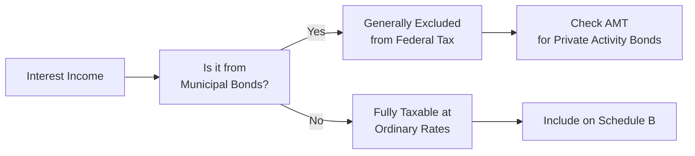

## 14.2 Interest Income and Dividends (Taxable vs. Non-Taxable)

Interest income and dividends are two of the most common sources of investment returns for individuals. Both represent compensation to investors: interest is earned primarily from lending money to various institutions (e.g., banks, corporations, or government entities), while dividends represent a distribution of corporate profits to shareholders. Understanding how these two types of income are taxed is essential for efficient tax planning and compliance.

This section explores the key distinctions between different types of interest income—particularly municipal bond interest vs. corporate bond interest—and discusses the tax treatment of dividends. We also cover partial exclusions, specialized rules for qualifying dividends, and common pitfalls to avoid when reporting this income on your tax return.

---

## Understanding Interest Income

Interest income is typically the compensation a lender (investor) receives from a borrower (bank, corporation, or government entity) for the use of borrowed funds. The Internal Revenue Code (IRC) considers interest income as ordinary income unless specifically exempted.

### Common Sources of Interest Income

• Corporate bonds: When you buy a corporate bond, you are effectively lending money to the issuing corporation. Interest earned is generally taxable at ordinary income tax rates.  
• Municipal bonds (Regarded as “munis”): Issued by state or local governments, municipal bond interest is generally exempt from federal income tax. However, certain municipal bonds (commonly referred to as “private activity bonds”) may be subject to alternative minimum tax (AMT).  
• U.S. Treasury debt: Interest from Treasury bills, notes, and bonds is subject to federal tax but is typically exempt from state and local taxes.  
• Bank accounts and certificates of deposit: Interest earned from a savings account, checking account, or CD at a bank or credit union is fully taxable at the federal level (and usually also taxable at the state level).  
• Other forms of interest income: This includes interest on notes receivable from third parties, peer-to-peer lending interest, and other lending arrangements.

---

## Taxability of Interest Income

Generally, interest income is reported on Form 1040, Schedule B (Interest and Ordinary Dividends), unless exempt from taxation by law. Whether interest is taxable can sometimes depend on the issuer:

1. Municipal Bond Interest  
   • Federal Tax Exemption: Most municipal bond interest is not subject to federal income tax.  
   • State-Specific Rules: Interest on municipal bonds issued within the investor’s home state might also be exempt from state or local taxes, depending on state law. If you purchase out-of-state municipal bonds, the interest may be subject to taxation in your state.  
   • Potential AMT on Private Activity Bonds: Some municipal bonds are classified as private activity bonds. The interest from these bonds may be subject to AMT if the investor’s overall tax profile triggers the AMT calculation.  

2. Corporate Bond Interest  
   • Taxed at Ordinary Rates: Unlike municipal bonds, corporate bond interest is fully taxable at ordinary income tax rates.  
   • Reporting Requirements: Investors typically receive a Form 1099-INT for any interest income over $10 annually. All such income must be reported on the individual’s tax return.  

3. U.S. Treasury Debt Obligations  
   • Subject to Federal Tax: Interest payments on Treasury bills, notes, and bonds are taxed at the federal level.  
   • State and Local Tax Exemption: Many states do not tax income from U.S. obligations. Investors should check their specific state tax rules for confirmation.

4. Bank and Credit Union Accounts  
   • Fully Taxable: Any interest income from savings, checking, money market accounts, or certificates of deposit is generally subject to federal and state income tax (except in states that do not have an individual income tax).  

### Table: Overview of Interest Taxation

| Type of Interest     | Federal Tax?       | State/Local Tax?                    | Notes                                      |
|----------------------|---------------------|--------------------------------------|--------------------------------------------|
| Corporate Bond       | Taxable (Ordinary) | Usually Taxable                      | Report on 1099-INT                         |
| Municipal Bond       | Tax-Exempt (General) | May Be Exempt if In-State            | Private activity bonds may be subject to AMT |
| U.S. Treasury        | Taxable (Federal)  | Often Exempt                         | Verify local/state rules                   |
| Bank Accounts        | Taxable (Ordinary) | Usually Taxable                      | Interest paid monthly or annually          |

---

## Partial Exclusions and Special Considerations for Interest Income

### State-Level Exemptions

• Home-State Munis: If you reside in the same state where the municipal bond is issued, your state might also exempt the interest from taxation. This can create a double tax-free scenario at both the federal and state levels.

• Federal/State Law Nuances: Some states vary in how they classify or tax municipal bond interest. Always verify your state’s tax code or consult a local CPA.

### Alternative Minimum Tax (AMT)

• Private Activity Bonds: Municipal bonds that fund private projects (e.g., stadiums, certain hospital expansions, or industrial development) may trigger AMT liability for certain taxpayers.  
• Strategies: High-income taxpayers subject to AMT should carefully evaluate the after-tax yield of private activity bonds compared to other investment options.

### Education Savings Bonds

Certain interest from U.S. Savings Bonds (Series EE or I) may be excluded from taxable income if used for qualified higher education expenses, subject to income limitations and other eligibility criteria.

---

## Introduction to Dividends

Dividends are distributions a corporation makes to its shareholders from current or accumulated earnings and profits. Investors typically receive dividends in the form of cash, although dividends can also be paid in stock or other property. Dividends are reported on IRS Form 1099-DIV.

### Types of Dividends

• Ordinary Dividends: The default classification for dividends that do not meet the criteria of “qualified dividends.” Ordinary dividends are taxed at ordinary income rates.  

• Qualified Dividends: Certain dividends from U.S. corporations or qualified foreign corporations, subject to specific holding period requirements, which are taxed at the lower long-term capital gains rates.  

• Non-Taxable Distributions: Also referred to as “return of capital.” These distributions are not taxable until the shareholder’s stock basis is reduced to zero. Once basis is depleted, further distributions are typically taxed as capital gains.  

### Qualified Dividend Requirements

1. Payer Must Be a Qualified Entity  
   • U.S. Corporation or Qualified Foreign Corporation: The dividend-paying company must be either a U.S. corporation or a qualified foreign corporation operating in a country with a U.S. tax treaty.  

2. Holding Period  
   • 60 Days Within 121-Day Window: The investor must hold the stock for at least 60 days during the 121-day period that begins 60 days before the ex-dividend date. Failing the holding period means the dividend defaults to the ordinary tax rate.  

3. Special Considerations  
   • Mutual Funds and ETFs: Dividends passed through by mutual funds or exchange-traded funds (ETFs) may also be qualified dividends if the fund meets the holding period and underlying securities requirements.

---

## Taxation of Dividends

### Ordinary Dividends

• Taxed at Ordinary Income Tax Rates: These dividends are reported and taxed at the same marginal rate applicable to the taxpayer’s other ordinary income (e.g., wages, interest).  

### Qualified Dividends

• Preferential Rate: The tax rate on qualified dividends mirrors the long-term capital gains tax rate, which may substantially reduce the tax liability for many individuals. Typical rates are 0%, 15%, or 20%, depending on the taxpayer’s filing status and taxable income.  

### Non-Taxable Dividends and Return of Capital

• Basis Adjustment: When a distribution is categorized as a return of capital, the shareholder’s basis in the stock decreases. If the distribution exceeds the stock’s basis, it is taxed as a capital gain.

---

## Municipal Bond Interest vs. Corporate Bond Interest: A Direct Comparison

When it comes to interest income, municipal bond interest and corporate bond interest offer significantly different treatment:

1. **Tax-Exempt Potential**  
   • Municipal Bond Interest: Often entirely exempt from federal income tax, and sometimes state or local tax, depending on the investor’s state of residence.  
   • Corporate Bond Interest: Fully taxable at both the federal and state level unless specific state-level exemptions apply.

2. **Yield vs. After-Tax Return**  
   • Taxable Equivalent Yield: Although municipal bonds often carry lower stated yields, they may result in a higher after-tax return for investors in high tax brackets.  
   • Corporate Bond Attractiveness: If an investor is in a lower tax bracket or seeks higher nominal yields, corporate bonds might still be appealing.

3. **Risks and Ratings**  
   • Municipal Bonds: Generally considered relatively safe, especially general obligation bonds backed by taxing authority. However, credit risk varies by issuer and project purpose.  
   • Corporate Bonds: Offer higher yields but carry credit and default risk based on the financial health of the corporation.

---

## Best Practices and Common Pitfalls

• Accurately Separate Taxable and Non-Taxable Interest: It is critical to distinguish between municipal bond interest (generally excludable from taxable income) and other types of interest (taxable). Mixing these up can lead to over-reporting or under-reporting income.  

• Holding Period for Qualified Dividends: Many taxpayers unknowingly disqualify their dividends from the favorable rates by not meeting the holding period requirements. Be sure to track trade dates, ex-dividend dates, and holding periods accurately.  

• Report All Interest and Dividend Income: Even tax-exempt interest should be reported on your return (though not included in taxable income) to comply with disclosure requirements.  

• Check 1099 Forms Carefully: Financial institutions may issue separate 1099-INT forms for different accounts or time periods. You may also receive a consolidated 1099 statement. Confirm the accuracy of the amounts and the classification of dividends vs. interest.

---

## Practical Examples

### Example 1: Municipal vs. Corporate Bond Interest

Ryan, a high-income taxpayer, is contemplating a $10,000 investment in a municipal bond yielding 3% vs. a corporate bond yielding 4.5%. Ryan’s federal marginal tax rate is 37%, and he pays a 5% state tax.

• Municipal Bond:  
  • Annual Interest: $10,000 × 3% = $300  
  • Federal Tax: $0 (tax-free)  
  • State Tax: Possibly $0 if in-state bond (assume it is).  
  • After-Tax Total: $300  

• Corporate Bond:  
  • Annual Interest: $10,000 × 4.5% = $450  
  • Federal Tax: $450 × 37% = $166.50  
  • State Tax: $450 × 5% = $22.50  
  • After-Tax Total: $450 - $166.50 - $22.50 = $261  

In this scenario, the municipal bond provides a higher after-tax return despite having a lower nominal yield.  

### Example 2: Qualified vs. Ordinary Dividends

Sarah owns stock that pays $500 in dividends. She holds the stock more than 60 days within the relevant 121-day positioning period around the ex-dividend date. Therefore, the $500 qualifies for the lower long-term capital gains rate of 15% (assuming Sarah’s marginal rate is 22% and her LTCG rate is 15%). Without meeting the holding period, the entire $500 would be taxed at 22%, resulting in a higher tax bill.

---

## Diagram: Classifying Interest Income

Below is a simple Mermaid flowchart that outlines how interest might be classified for tax purposes:

Explanation: Begin by identifying whether the interest income stems from municipal bonds. If it does, it is generally exempt from federal income tax, but private activity bonds could trigger AMT. If it does not come from municipal bonds, it is typically fully taxable. All taxable interest, in turn, is reported on Schedule B of Form 1040.

---

## Strategies to Optimize Tax Outcomes

• Evaluate Tax Brackets: High-income earners in elevated tax brackets often benefit from municipal bonds due to their tax-exempt feature. In contrast, those in lower brackets may prefer the higher yields of corporate bonds.  
• Optimize Dividend Holding Periods: If you plan to qualify for the lower dividend tax rate, avoid frequent trades around the ex-dividend date.  
• Diversify: Balancing municipal and corporate bonds within a portfolio can smooth out interest rate risk and optimize tax benefits.  
• Stay Informed: Keep up to date on potential changes in tax law. Revisit your portfolio strategy regularly, particularly when your marginal tax rate changes due to life events or shifts in income.

---

## References for Further Exploration

• IRS Publication 550 (Investment Income and Expenses): Offers guidance on reporting interest and dividend income.  
• SEC Investor Publications: For insights on bond markets, credit ratings, and corporate disclosures.  
• Chapter 16 (“Loss Limitations”) of this guide for interplay between passive losses and investment income.  
• Chapter 28 (“Nontaxable Exchanges and Involuntary Conversions”) for advanced discussions around property transactions and basis adjustments.

---

## Mastering Interest and Dividend Taxation: Your Knowledge Quiz



### Interest income on municipal bonds generally retains which tax characteristic?

- [ ] Fully taxable at the federal level
- [ ] Exempt from all taxes, including state and local
- [x] Exempt from federal income tax, but possibly taxed at the state or local level
- [ ] Subject to special capital gains rates

> **Explanation:** Municipal bond interest is generally exempt from federal income tax, yet it may be subject to state or local taxes unless the bond is issued in your home state or other special exemptions apply.

### Which of the following factors determines whether a dividend is qualified for lower tax rates?

- [ ] Dividend frequency (monthly vs. quarterly)
- [x] Holding period of the stock around the ex-dividend date
- [ ] The size of the dividend payment
- [ ] No factors are required; all dividends are taxed the same

> **Explanation:** Dividends must satisfy specific requirements, including a 60-day holding period within a 121-day window around the ex-dividend date and be paid by a qualified entity, to qualify for lower capital gains tax rates.

### When a distribution is deemed a “return of capital,” how is it reported for tax purposes?

- [x] It reduces the shareholder’s basis in the stock
- [ ] It is taxed at the ordinary income rate
- [ ] It is taxed as a short-term capital gain
- [ ] It is always tax-exempt with no basis adjustment

> **Explanation:** A return of capital repayment lowers the shareholder’s basis in the stock. If the distribution exceeds the shareholder’s remaining basis, the excess is typically recognized as a capital gain.

### Under what circumstance is municipal bond interest potentially subject to the Alternative Minimum Tax (AMT)?

- [ ] If the bonds are long-term obligations only
- [x] When the bonds are private activity bonds
- [ ] If the taxpayer’s ordinary marginal tax rate exceeds 35%
- [ ] All municipal bond interest is always subject to AMT

> **Explanation:** Private activity bonds can trigger the AMT for certain high-income taxpayers, so it is essential to distinguish between general obligation municipal bonds and private activity bonds.

### All of the following interest sources are typically subject to ordinary income tax, except:

- [ ] Corporate bonds
- [x] Most municipal bonds
- [ ] Bank certificate of deposit
- [ ] Notes receivable from a private loan

> **Explanation:** Municipal bond interest is generally excluded from federal income tax. Corporate bonds, CDs, and private loans all generate taxable interest (unless a specific exemption applies).

### How are most U.S. Treasury bond interest payments treated for tax purposes?

- [x] Taxable at the federal level but generally exempt from state and local taxes
- [ ] Exempt from federal, state, and local taxes
- [ ] Subject to state and local taxes only
- [ ] Taxed at capital gains rates only

> **Explanation:** U.S. Treasury bond interest is subject to federal income tax but is typically exempt from state and local taxes.

### If a taxpayer fails to meet the holding period requirements for a qualified dividend, the dividend:

- [ ] Remains subject to the reduced rate
- [x] Is taxed at ordinary income rates
- [x] Can revert to a qualified dividend if the shares are later repurchased
- [ ] Is fully exempt from taxation

> **Explanation:** Not meeting the holding period for qualified dividends causes a reclassification to ordinary dividends, which are taxed at ordinary rates. If the shares are sold and repurchased later, the newly purchased shares would start a new holding period, so additional qualified dividend rules could apply, but not retroactively to previously received dividends.

### Which statement is correct regarding the alternative minimum tax (AMT) and municipal bonds?

- [x] Certain municipal bonds are subject to AMT due to their use in private activities
- [ ] All municipal bond interest is fully taxable under AMT
- [ ] AMT never applies to tax-exempt bonds
- [ ] Corporate bonds are subject to AMT while municipal bonds are not

> **Explanation:** Some municipal bonds, known as private activity bonds, can trigger AMT adjustments. Not all municipal bonds are subject to AMT; only those financing certain private projects may be affected.

### If an individual receives $800 of ordinary dividends and $1,200 of qualified dividends, how should these be reported?

- [x] The $800 is taxed at ordinary rates; the $1,200 is afforded the favorable long-term capital gains tax rate
- [ ] The $800 is excluded from taxable income, and the $1,200 is taxed at the highest ordinary rate
- [ ] Both are taxed at the same rate
- [ ] Both are always free from federal taxation

> **Explanation:** Ordinary dividends are taxed at the taxpayer’s marginal ordinary rate, while qualified dividends benefit from the lower capital gains rate.

### Dividends or interest reported on Form 1099 that are erroneously not included on Form 1040 can lead to:

- [x] True
- [ ] False

> **Explanation:** Omitting reportable income from the return can result in IRS notices, penalties, or additional taxes owed, so it is crucial to include all 1099-INT/1099-DIV income in the tax filing.



---

## For Additional Practice and Deeper Preparation

### [Taxation & Regulation (REG) CPA Mock Exams](https://www.udemy.com/course/reg-cpa-mock-exams/?referralCode=55419EBD198F61530B12)

Taxation & Regulation (REG) CPA Mocks: 6 Full (1,500 Qs), Harder Than Real! In-Depth & Clear. Crush With Confidence!

• Tackle full-length mock exams designed to mirror real REG questions.  
• Refine your exam-day strategies with detailed, step-by-step solutions for every scenario.  
• Explore in-depth rationales that reinforce higher-level concepts, giving you an edge on test day.  
• Boost confidence and minimize anxiety by mastering every corner of the REG blueprint.  
• Perfect for those seeking exceptionally hard mocks and real-world readiness.

_Disclaimer: This course is not endorsed by or affiliated with the AICPA, NASBA, or any official CPA Examination authority. All content is for educational and preparatory purposes only._
