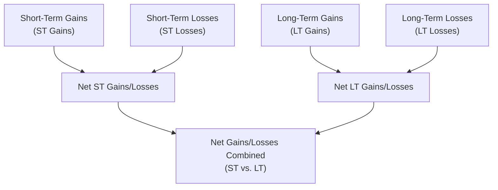
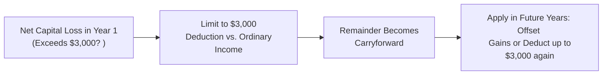

## 14.3 Capital Gains and Losses (Short-Term vs. Long-Term)

Capital gains and losses occur when individuals sell or exchange capital assets (e.g., stocks, bonds, real estate held for investment) for more or less than their adjusted basis. The Internal Revenue Code (IRC) and related regulations set forth the rules for recognizing, classifying, and calculating these gains or losses. Understanding the difference between short-term and long-term capital gains, how they are netted, how losses carry forward, and the impact of holding period rules is crucial for anyone preparing to sit for the REG section of the CPA Exam—or anyone simply looking to optimize their tax outcomes.

Below, we delve into:

• The definitions of short-term and long-term capital gains  
• The netting process for capital gains and capital losses  
• How the capital loss carryforward works  
• The importance of the holding period in determining tax rates  
• Practical tips, common pitfalls, diagrams, and examples to illustrate these concepts  

--------------------------------------------------------------------------------

### Defining Capital Assets

Under IRC §1221, capital assets generally include all property held by a taxpayer (e.g., securities, real estate for investment, collectible art), except for certain specific exclusions such as inventory, property held for sale in a trade or business, accounts receivable arising from regular business operations, and depreciable business property (covered in different sections such as §1231).  

For personal finance and investment purposes, most assets you purchase to hold or invest in—like stocks or bonds—are capital assets. When you sell them, you generally have a capital gain or loss.

--------------------------------------------------------------------------------

### Short-Term vs. Long-Term Capital Gains

The primary distinction between short-term and long-term capital gains (or losses) revolves around the length of time (the holding period) the asset is owned before it is disposed of.

• Short-term capital gains (STCG): Gains on assets held for one year or less. These gains are typically taxed at ordinary income tax rates, which can be higher than the preferential rates for long-term gains.  
• Long-term capital gains (LTCG): Gains on assets held for more than one year. These gains are taxed at special, favorable rates (commonly 0%, 15%, or 20% depending on the taxpayer’s filing status and total taxable income).  

#### Holding Period Rules

1. The holding period begins the day after the asset is acquired.  
2. If an asset is sold on the anniversary date of purchase or earlier, it is generally considered short-term.  
3. If sold the day after the anniversary of its acquisition or later, it is considered long-term.  

Additionally, certain special holding period rules can apply when assets are received through inheritance, gifts, or corporate reorganizations. For instance, inherited property is automatically considered long-term, regardless of how long the heir actually holds it.

--------------------------------------------------------------------------------

### Tax Implications of Short-Term vs. Long-Term Gains

Short-term capital gains are taxed at the individual’s marginal ordinary income tax rates, which can climb as high as 37% (plus potential net investment income tax). Long-term capital gains, by contrast, are subject to more beneficial rates, typically 0%, 15%, or 20%, depending on income levels. This difference in rates often provides a strong incentive for taxpayers to hold appreciated property for more than one year before selling.

--------------------------------------------------------------------------------

### Basics of Calculating Capital Gains and Losses

The capital gain or loss from the sale of a capital asset is generally computed as:

<span class="katex"> 
\text{Capital Gain (Loss)} = \text{Amount Realized} - \text{Adjusted Basis}
</span>

• Amount realized: The sales proceeds or fair market value (if exchanged), less any selling costs such as commissions.  
• Adjusted basis: The original cost basis (purchase price) plus or minus certain adjustments (e.g., improvements, depreciation, stock splits, return of capital).

--------------------------------------------------------------------------------

### Capital Gains Netting Process

After computing short-term and long-term gains and losses for the tax year, the Internal Revenue Service (IRS) requires taxpayers to follow a specific netting process. The goal is to combine and reduce gains and losses of different types to arrive at the final taxable amount.

Conceptually, the netting process works as follows:

1. Aggregate all short-term gains and losses separately from long-term gains and losses.  
2. Net short-term gains against short-term losses to arrive at either net short-term capital gain (NSTCG) or net short-term capital loss (NSTCL).  
3. Net long-term gains against long-term losses to produce either net long-term capital gain (NLTCG) or net long-term capital loss (NLTCL).  
4. If you have a net short-term gain and a net long-term gain, both remain separate, and you apply respective tax rates.  
5. If you have a net short-term loss and a net long-term gain, you combine these amounts. The net short-term loss effectively reduces the long-term capital gain—potentially reducing the tax owed on that LTCG.  
6. If you have a net long-term loss and a net short-term gain, the net long-term loss reduces the short-term gain.  
7. If both short-term and long-term results end up as negative (losses), they remain as net short-term capital loss and net long-term capital loss. When a net capital loss exists, up to $3,000 of this net loss can usually be used to offset ordinary income. Any excess is carried forward.

Below is a simplified visual representation of the netting process:

```

```

--------------------------------------------------------------------------------

### Capital Loss Carryovers

When a taxpayer’s combined net capital losses exceed the $3,000 annual limit for individuals ($1,500 in the case of married taxpayers filing separately), the excess loss is carried forward to future tax years. This process can continue indefinitely for individual taxpayers until the entire loss is utilized.  

Key points:

• The carryover loss retains its character: For instance, if your net loss was primarily short-term in the year of origination, the portion carried forward remains short-term in subsequent years. Likewise for long-term losses.  
• The first $3,000 of net capital losses (or $1,500 for married filing separately) can offset ordinary income each year. This can be especially beneficial if the taxpayer does not have sufficient capital gains in subsequent years.  

Example:  
Assume Taxpayer A has a net capital loss of $10,000 in Year 1, composed of $3,000 short-term losses and $7,000 long-term losses. They can claim a $3,000 deduction against ordinary income in Year 1 (reducing the net capital loss to $7,000). The $7,000 remaining will be carried forward to Year 2 and retains its short-term/long-term character.

--------------------------------------------------------------------------------

### Illustrative Examples

#### Example 1: Netting ST Gains and LT Gains
• Short-term capital gains: $5,000  
• Short-term capital losses: $2,000 → Net ST gain: $3,000  
• Long-term capital gains: $10,000  
• Long-term capital losses: $4,000 → Net LT gain: $6,000  

Final Result:  
• Net short-term capital gain (NSTCG) of $3,000  
• Net long-term capital gain (NLTCG) of $6,000  

Taxpayer will generally pay taxes on $3,000 at ordinary rates and $6,000 at favorable long-term capital gains rates.

#### Example 2: Offset Long-Term Gains with Short-Term Losses  
• Net short-term capital loss (NSTCL): $4,000  
• Net long-term capital gain (NLTCG): $10,000  

Netting across categories:  
• $10,000 LTCG reduced by $4,000 STCL → $6,000 net capital gain subject to the applicable long-term rate.

#### Example 3: Net Loss and Carryforward  
• Net short-term capital loss (NSTCL): $9,000  
• No long-term capital gain or loss.  

The net capital loss is $9,000 for the year. The taxpayer can use $3,000 of this loss to offset ordinary income, reducing the net loss to $6,000. The $6,000 remainder is carried forward, retaining its short-term character for future years. In subsequent years, the taxpayer can again use up to $3,000 to offset either capital gains or ordinary income if no gains exist.

--------------------------------------------------------------------------------

### Special Holding Period Considerations

• Gifted Property: A donee (recipient of a gift) generally assumes the donor’s holding period if the asset is profitable. If the fair market value at the time of gifting is lower than the donor’s adjusted basis, special rules apply in determining the donee’s basis; however, the holding period may “tack on” if the gain basis (donor’s basis) is ultimately used.  
• Inherited Property: Automatically treated as held long term, regardless of how long the decedent or beneficiary held the property.  
• Mutual Funds and ETFs: Distributions by mutual funds, labeled as “capital gain distributions,” are always treated as long-term regardless of how long the taxpayer held the mutual fund shares (though the gain distribution may not necessarily reflect the taxpayer’s personal holding period in the fund shares themselves).

--------------------------------------------------------------------------------

### Common Pitfalls and Best Practices

• Failing to track the purchase date accurately can lead to misclassification of short-term vs. long-term capital gains and underpayment of taxes. Carefully record acquisition and disposition dates.  
• Overlooking wash sale rules (generally triggered when you sell securities at a loss and repurchase the same or substantially identical stock within 30 days before or after the sale) can invalidate certain losses.  
• Attempting to claim deductions for personal-use capital assets (like personal vehicles) that have lost value is generally disallowed, as personal losses on property not used for investment or trade/business are not deductible.  
• Utilizing capital losses to offset ordinary income beyond the $3,000 ($1,500 if MFS) annual limit is not allowed; plan investment sales accordingly, especially toward year-end.  
• Inadvertently mixing up long-term rates with short-term rates can be costly. Always confirm which bucket your gain or loss belongs to while you prepare your return.  

--------------------------------------------------------------------------------

### Strategic Considerations and Planning

• Holding securities longer than one year—if consistent with investment goals—can yield substantial tax savings, due to the reduced LTCG rates.  
• End-of-year tax planning can involve “harvesting” capital losses (selling positions at a loss to offset gains realized earlier in the year) to reduce or eliminate capital gains taxes.  
• When facing large capital gains, consider “loss harvesting” or deferral strategies (e.g., waiting to sell until the following tax year) to manage both your taxable income and future carryover positions.  

--------------------------------------------------------------------------------

### Case Study: Coordinated Capital Transactions for Tax Efficiency

Assume a taxpayer, Sara, expects to realize a $20,000 long-term capital gain in November from selling stock. She also holds several other stocks that have accumulated unrealized losses of around $15,000. If Sara sells those losing positions in December, she can harvest $15,000 of long-term capital losses to offset most of the $20,000 gain, leaving her with a $5,000 long-term gain. The net effect: Sara greatly reduces her LTCG subject to tax for the year.  

However, Sara needs to be mindful that if she repurchases the same or substantially similar stock within 30 days, the wash sale rules may disallow those losses. She should plan carefully or pick different securities to maintain her investment strategy without triggering wash sale disallowance.

--------------------------------------------------------------------------------

### Additional Visual: Capital Loss Carryforward Flow

```

```

In this diagram, any net capital loss over $3,000 flows into subsequent years indefinitely. In each future year, the taxpayer can use a portion of the carryforward to offset either capital gains or, if insufficient capital gains exist, deduct against ordinary income up to $3,000.

--------------------------------------------------------------------------------

### References for Further Study

• IRS Publication 550: Investment Income and Expenses  
• IRS Publication 17: Your Federal Income Tax  
• IRS Form 8949 and Schedule D Instructions: For detailed netting and reporting of capital gains and losses  
• IRC §§1211(b), 1221, 1222, and 1223: Key statutory provisions covering capital losses, capital assets, classification, and holding period  

--------------------------------------------------------------------------------

## Capital Gains and Losses Mastery Quiz



### When is a capital gain considered short-term?

- [ ] When the holding period is more than one year.
- [ ] When the holding period is more than six months.
- [x] When the holding period is one year or less.
- [ ] When the holding period is more than two years.

> **Explanation:** A short-term capital gain occurs when an asset is held for one year or less. Anything held longer than one year is treated as a long-term capital gain.


### Which of the following statements is TRUE about net capital losses?

- [ ] Individuals can offset up to $5,000 of net capital losses against ordinary income.
- [x] Individuals can offset a maximum of $3,000 of net capital losses against ordinary income each year.
- [ ] Net capital losses can only be applied to offset future capital gains.
- [ ] Individuals cannot offset net capital losses at all.

> **Explanation:** Individuals may apply up to $3,000 ($1,500 if married filing separately) of net capital losses to reduce ordinary income each tax year, carrying forward any unused amounts indefinitely.


### A taxpayer has $5,000 in net short-term capital gain (NSTCG) and $2,000 in net long-term capital loss (NLTCL). How does netting occur?

- [ ] Net the $5,000 NSTCG with the $2,000 NLTCL to get $3,000 net short-term gain.
- [x] Net the $5,000 NSTCG and $2,000 NLTCL, resulting in $3,000 of net short-term gain.
- [ ] Report $0 because the short-term gain is completely offset by the long-term loss.
- [ ] The netting process doesn’t allow mixing short-term and long-term amounts.

> **Explanation:** After separately netting short-term items and long-term items, if the taxpayer ends up with a net short-term gain and a net long-term loss, the two are combined. $5,000 short-term gain minus $2,000 long-term loss = $3,000 net short-term capital gain.


### What happens to unused capital losses that exceed the $3,000 limit for individuals?

- [ ] They are lost forever.
- [ ] They can only be carried back to previous years.
- [x] They carry forward indefinitely and retain their short-term or long-term character.
- [ ] They must be used within five years.

> **Explanation:** Capital losses that exceed the $3,000 annual limit are carried forward indefinitely. They retain their short-term or long-term character and can be used in future years to offset capital gains or ordinary income (up to $3,000 annually).


### Which of the following is NOT a capital asset for tax purposes?

- [ ] Shares of stock in a corporation held for investment
- [x] Inventory or property held primarily for sale to customers
- [ ] An individual’s personal-use automobile
- [ ] A painting purchased to hold as an investment

> **Explanation:** Under IRC §1221, capital assets are typically everything owned by a taxpayer except specific exclusions. Inventory, or property held for sale to customers, is not a capital asset, so gains or losses on such property are generally treated as ordinary rather than capital.


### What is the key tax benefit of classifying a gain as long-term rather than short-term?

- [ ] It becomes nontaxable.
- [ ] It can be deferred indefinitely.
- [ ] It carries a higher tax rate.
- [x] It benefits from preferential, lower maximum tax rates.

> **Explanation:** Long-term capital gains are generally taxed at preferential rates (0%, 15%, or 20%) rather than the potentially higher ordinary income rates that apply to short-term gains.


### Which statement correctly characterizes inherited property’s holding period?

- [ ] Inherited property always starts new holding period from the date of inheritance.
- [ ] The holding period must be calculated from the original purchase date of the decedent.
- [x] Inherited property is automatically considered long-term property, regardless of actual holding period.
- [ ] Inherited property is automatically considered short-term property.

> **Explanation:** Inherited property is deemed to have a long-term holding period, irrespective of how long it was held by the decedent or the beneficiary.


### If a taxpayer has a net capital loss of $9,000 in the current year, how much can they claim against ordinary income?

- [ ] $9,000 can offset ordinary income directly.
- [x] $3,000 in the current year, and the remaining $6,000 is carried forward.
- [ ] They can choose up to $5,000 if they are married filing jointly.
- [ ] None, since ordinary losses cannot be offset by capital losses.

> **Explanation:** Under the tax rules, an individual can deduct a maximum of $3,000 in net capital losses against ordinary income annually, with the remainder carried forward for future use.


### A taxpayer incurred a net short-term capital loss of $2,500 and a net long-term capital gain of $8,000. How will these amounts generally net?

- [ ] They cannot be netted; both must be reported separately.
- [x] The net short-term capital loss will offset the net long-term capital gain, resulting in $5,500 of net long-term gain.
- [ ] The net long-term gain offsets the short-term loss, resulting in a $2,500 short-term gain.
- [ ] They fully cancel out each other.

> **Explanation:** The short-term loss offsets part of the long-term gain: $8,000 – $2,500 = $5,500 net long-term gain, taxed at long-term capital gain rates.


### A net short-term gain is taxed at:

- [x] The individual’s ordinary income tax rates.
- [ ] The preferential capital gains rate of 15%.
- [ ] A capped rate of 10%.
- [ ] A maximum rate of 20%.

> **Explanation:** Short-term gains do not qualify for favorable long-term capital gain tax rates. They are taxed as ordinary income at the taxpayer’s marginal rate.




--------------------------------------------------------------------------------

## For Additional Practice and Deeper Preparation

### [Taxation & Regulation (REG) CPA Mock Exams](https://www.udemy.com/course/reg-cpa-mock-exams/?referralCode=55419EBD198F61530B12)

Taxation & Regulation (REG) CPA Mocks: 6 Full (1,500 Qs), Harder Than Real! In-Depth & Clear. Crush With Confidence!

- Tackle full-length mock exams designed to mirror real REG questions.  
- Refine your exam-day strategies with detailed, step-by-step solutions for every scenario.  
- Explore in-depth rationales that reinforce higher-level concepts, giving you an edge on test day.  
- Boost confidence and minimize anxiety by mastering every corner of the REG blueprint.  
- Perfect for those seeking exceptionally hard mocks and real-world readiness.  

_Disclaimer: This course is not endorsed by or affiliated with the AICPA, NASBA, or any official CPA Examination authority. All content is for educational and preparatory purposes only._
