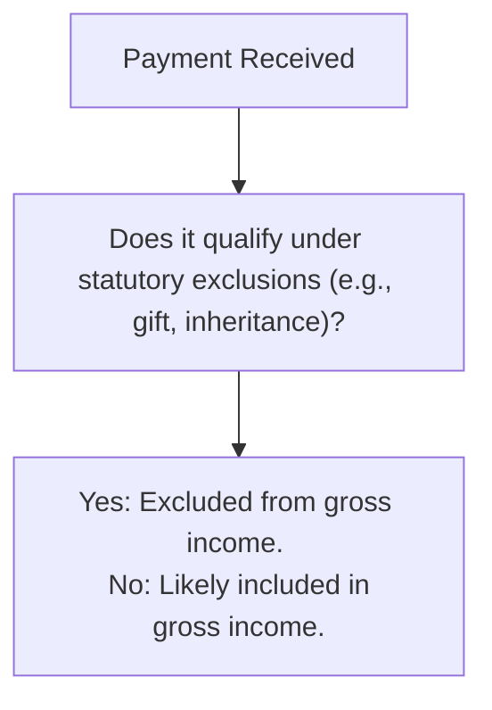

## 14.4 Exclusions (Gifts, Inheritances, Life Insurance Proceeds, Scholarships)

Exclusions from gross income are a cornerstone of individual taxation, forming an essential component of the REG (Regulation) section of the Uniform CPA Examination. Under the Internal Revenue Code (IRC), many items that might appear to be income in everyday language are specifically excluded from taxable income. These statutory exclusions reduce a taxpayer’s tax liability and must be applied correctly to avoid over-reporting (or under-reporting) taxable income.  
   
In this section, we will explore the commonly encountered exclusions regarding gifts, inheritances, life insurance proceeds, scholarships, and selected fringe benefits not included in income. We will reference relevant IRC sections, explain substantiation requirements, highlight common pitfalls, and provide practical examples to illustrate how each exclusion is applied. Familiarity with these exclusions ensures compliance with tax laws and can form a significant advantage in both public accounting practice and on the CPA Exam.

--------------------------------------------------------------------------------
## Overview of Statutory Exclusions from Gross Income

Under IRC §61, “gross income means all income from whatever source derived” unless explicitly exempted. Therefore, every item of income is presumed taxable unless the Code provides a specific exclusion. Key statutory exclusions mirror broader economic and social objectives, such as encouraging education (scholarship exclusions), supporting beneficiaries after a death (life insurance proceeds), and simplifying estate transitions (gifts and inheritances).

Learning to differentiate between excludable and includible items involves not only applying the relevant Code sections but also properly substantiating and documenting transactions. Overcoming this challenge pays off in smoother tax compliance, reduced audit risk, and a heightened sense of responsibility and prudence in accounting practice.

--------------------------------------------------------------------------------
## Gifts

### Definition and IRC Framework
Gifts are governed primarily by IRC §102, which states that “[t]he value of property acquired by gift, bequest, devise, or inheritance” is excluded from gross income. A "gift" arises from a detached and disinterested generosity, usually prompted by affection, respect, admiration, charity, or similar impulses. For an amount or property to qualify as a gift:

1. There must be donative intent.  
2. The transferor must relinquish all control over the property.  
3. There should be no expectation of future services or other quid pro quo from the recipient.

### Substantiating Gifts
While a taxpayer generally does not include gifts as income, proper documentation is critical to uphold the exclusion under exam or audit scrutiny. Substantiating gifts often entails:

• Written statements or documentation from the donor.  
• Evidence showing the donor’s motivation (i.e., personal relationship, generosity).  
• Clarification that no payment for services or compensation was involved.

### Impact on Donors vs. Donees
For the recipient, the gift is excluded from gross income, but any income generated by the gift (e.g., dividends from gifted stock) is taxable once the recipient takes ownership. The donor may be subject to federal gift tax rules if the gift exceeds annual or lifetime exclusions (covered in more detail in Chapter 25: Estate and Gift Tax Planning for Owners and Individuals). Practitioners must weigh both estate/gift tax implications on the donor side and exclusion from gross income on the donee side.

### Example: Monetary Gift from a Parent
Assume a college student receives $20,000 in cash from a parent who has no expectation of repayment. This transaction likely meets the requirement for a gift. The student does not include $20,000 in taxable gross income, but the donor may have to evaluate whether that gift exceeds the annual exclusion for gift tax purposes.

--------------------------------------------------------------------------------
## Inheritances

### Definitions and Statutory Basis
Under IRC §102, the value of property received through bequest, devise, or inheritance is generally excluded from gross income. While the estate of the deceased might be subject to estate tax, the inheritor benefits from an exclusion on inherited property. This rule is fundamental in preventing double taxation: property is often subject to estate tax at death, but is not taxed again to the heir as income.

### Step-Up (or Step-Down) in Basis
An inheritance can come with stepped-up (or stepped-down) basis rules. Generally, the heir receives a basis equal to the fair market value (FMV) of the asset on the date of the decedent’s death (or the alternate valuation date if elected by the estate). Because the basis is adjusted to the current FMV, the beneficiary may avoid capital gains on any appreciation that occurred during the decedent’s lifetime.

Practical considerations of inherited property often intersect with Chapter 12 (Basis of Assets) and Chapter 29 (Characterization of Gains and Losses). If the inheritor sells inherited property, any gain or loss is calculated based on the stepped-up basis, thereby frequently reducing or eliminating taxable gains.

### Example: House Inherited from a Grandparent
Anna inherits a residence from her late grandparent. The home’s FMV at the date of death is $300,000 (compared to the decedent’s original cost basis of $120,000 many years prior). Anna’s new basis is $300,000. If she sells the house one year later for $330,000, only $30,000 is potentially subject to capital gains tax, as opposed to $210,000 (the difference between $330,000 and the original $120,000 cost basis).

--------------------------------------------------------------------------------
## Life Insurance Proceeds

### General Exclusion Rule (IRC §101)
Life insurance proceeds paid to a beneficiary upon the insured’s death are excluded from the beneficiary’s gross income. This statutory rule under IRC §101 stems from social policy objectives, recognizing that survivors often rely on these funds for financial support during a period of loss. The exclusion typically covers lump-sum payments as well as periodic settlement options.

### Exceptions and Common Caveats
Not all life insurance proceeds are exempt without qualification. For instance:

1. **Transfer for Valuable Consideration**  
   If a life insurance policy is transferred to another person or entity for valuable consideration (e.g., sold in a life settlement transaction), the proceeds received upon the insured’s death may be partially taxable.

2. **Interest on Deferred Payouts**  
   If the beneficiary elects to receive life insurance proceeds over time, any interest component paid to the beneficiary may be taxable.

3. **Employer-Owned Life Insurance**  
   Special rules sometimes apply to proceeds received by businesses on key-person life insurance policies. Proper compliance involves checking the limitations and additional requirements in IRC §§101(j) and 264.

### Substantiation and Documentation
While the life insurance company typically issues a Form 1099-INT for interest portion (if relevant), the principal proceeds themselves are not reported as income. Beneficiaries should carefully document the nature of the payout to preserve the exclusion.

### Example: Lump-Sum Life Insurance Payout
John is named as the beneficiary of his mother’s life insurance policy. Upon her death, he receives a lump-sum benefit of $250,000. John need not include $250,000 in his gross income when he files his annual tax return. However, if he opted to receive monthly payments over five years, any portion of the ongoing payments representing interest above the original death benefit component would be taxable.

--------------------------------------------------------------------------------
## Scholarships

### Tax Treatment of Scholarships and Fellowships (IRC §117)
Scholarships can represent a significant benefit for individuals pursuing education. Under IRC §117, qualified scholarships for tuition, required fees, books, and certain education-related expenses are excluded from gross income, provided that:

1. The individual is a candidate for a degree at an eligible educational institution.  
2. Amounts are used for tuition and fees required for enrollment, or for books, supplies, and equipment required for courses.  

### Stipends, Room, and Board
While qualified scholarship amounts covering tuition and course requirements are excluded from gross income, amounts used for room, board, travel, or other personal expenses are typically included in gross income. Additionally, payments considered compensation for teaching, research, or other services required as a condition of receiving a grant or fellowship generally cannot be excluded.

### Substantiation for Education Expenses
Substantiation is key: students must maintain accurate records of how scholarship funds were used. Educational institutions often issue Form 1098-T, but it is ultimately the student’s responsibility to ensure that qualified and non-qualified expenses are distinguished.

### Example: Partial Scholarship Allocation
Emily receives a $15,000 scholarship to attend a university. She allocates $10,000 toward tuition and $1,500 for required books. Under the law, that $11,500 is excluded from her gross income. However, the remaining $3,500 used for room and board is included in her taxable income.

--------------------------------------------------------------------------------
## Fringe Benefits Excluded from Income

### Overview
Fringe benefits can be valuable components of employee compensation packages. Generally, any fringe benefit provided by an employer is included in the employee’s gross income unless specifically excluded by the Code. IRC §§132 and 129, among others, outline multiple categories of fringe benefits that are excludable from employees’ income.

### Common Excludable Fringe Benefits
1. **No-Additional-Cost Services (IRC §132(b))**  
   Discounts on services offered by the employer to employees, so long as the employer does not incur significant additional cost.  

2. **Qualified Employee Discounts (IRC §132(c))**  
   Discounts on goods produced or sold by the employer, subject to specified limits (e.g., discount cannot exceed the gross profit percentage on property sold to customers).

3. **Working Condition Fringe (IRC §132(d))**  
   Items an employee could otherwise deduct if they incurred the cost themselves—e.g., job-related training, professional dues, or licensure fees.

4. **De Minimis Fringe (IRC §132(e))**  
   Benefits with so little value that accounting for them is impractical (e.g., occasional personal use of an office copy machine, office holiday parties).

5. **Qualified Transportation Fringe (IRC §132(f))**  
   Transportation benefits (e.g., transit passes, parking) subject to monthly limits.

6. **Employer-Provided Educational Assistance (IRC §127)**  
   Up to $5,250 per year in employer-provided educational assistance is excludable from income.

7. **Dependent Care Assistance (IRC §129)**  
   Assistance of up to $5,000 per year ($2,500 for married filing separately) is excludable if certain conditions are met.

### Documentation and Proper Reporting
While employers generally handle the accounting for fringe benefits, employees must understand the rules—especially if the benefit surpasses statutory thresholds or does not meet the exclusion criteria. Misapplication of fringe benefit rules can lead to unintended tax consequences.

### Example: Employer-Provided Parking
Suppose a company pays for Susan’s parking in a garage near the office. If the parking costs $250 per month and the IRS limit for qualified parking is $300 per month, Susan can exclude the entire amount from her taxable wages. If the parking costs exceeded the IRS limit, the overage would be included in her gross income.

--------------------------------------------------------------------------------
## Substantiation Requirements

Excluding an item from gross income does not remove the need to keep clear documentation. Taxpayers should maintain records that demonstrate the exclusion’s validity, such as:

• **Gift letters** or statements from donors.  
• **Scholarship award letters** detailing how funds must be used.  
• **Life insurance documentation**, including policy statements and payout explanations.  
• **Receipts** showing correct allocation of tuition, books, and fees in the case of scholarships or fellowship awards.  
• **Employer policy documents** for fringe benefits.  

While documentation requirements vary by situation, thorough recordkeeping is the best defense in an IRS or state audit. Quick recall of relevant regulations and strong reliance on official guidance will significantly reduce compliance risks.

--------------------------------------------------------------------------------
## Common Pitfalls and Best Practices

Below are some key pitfalls taxpayers and practitioners can encounter when applying exclusions:

• **Failure to Properly Allocate Scholarship Funds**  
  Not separating qualified expenses (tuition, fees, books) from non-qualified expenses (room, board, travel) can result in the misapplication of scholarship exclusions.

• **Confusing Compensation with Gifts**  
  Money given in exchange for services is compensation, not a gift, and must be included in gross income.  

• **Misapplication of Fringe Benefits**  
  Overlooking statutory limitations on certain employer-provided perks can lead to inadvertent underreporting of gross income.  

• **Interest on Life Insurance Proceeds**  
  Failing to separate the excludable principal from taxable interest may cause inaccurate returns.

• **Lack of Documentation**  
  An exclusion is only as strong as the supporting records. Taxpayers should maintain adequate proof to demonstrate compliance with the Code’s rules.

### Best Practices for Compliance
• **Maintain Thorough Records:** Save receipts, official letters, forms, and any supplemental documents.   
• **Review IRC and Treasury Regulations:** Identify potential grey areas and common exceptions.  
• **Seek Professional Guidance:** When in doubt, consult with an experienced tax professional or review recognized IRS literature.  
• **Stay Informed on Updates:** Tax laws evolve, with new thresholds and guidance updated annually.

--------------------------------------------------------------------------------
## Visual Overview of Exclusions

Below is a simple Mermaid flowchart demonstrating how to determine if a certain payment or benefit is excluded from gross income:

Explanation:  
• Start with any payment received (A).  
• Assess whether the payment is excludable under the IRC (B). Consider the type of benefit (gift, inheritance, life insurance proceeds, scholarships, or fringe benefits) and apply statutory rules.  
• If the answer is “Yes,” it may be excluded from gross income (C). Otherwise, it should typically be included in gross income.

--------------------------------------------------------------------------------
## Practical Examples and Case Scenarios

1. **Family Gift vs. Compensation**  
   • Kim babysits her niece over the summer and receives $2,000 from her sister. If this payment reflects compensation for services, it is taxable. If Kim can demonstrate the amount was purely a monetary gift with no expectation of services, it might be excluded.

2. **Scholarship with Room and Board**  
   • Percy obtains a $10,000 scholarship. He uses $7,000 for tuition and $3,000 for campus housing. Percy can exclude $7,000 but must report $3,000 as income.

3. **Inherited Stocks**  
   • Daniel inherits 100 shares of stock from his aunt. At the time of death, the FMV is $50/share. Six months later, Daniel sells the stock at $55/share. Daniel’s basis is $50/share, so his capital gain is $5/share, not the original price his aunt paid.

4. **Employer-Provided Educational Assistance**  
   • Maria’s employer covers $4,000 of her MBA tuition. Since it is under the $5,250 annual limit for Excludable Educational Assistance, she owes no tax on that benefit.

5. **Life Insurance Payable to a Partnership**  
   • A small partnership takes out key-person insurance on one of its partners. Upon that partner’s death, the partnership receives $200,000. Usually, such proceeds are tax-exempt, but the partnership must verify compliance with IRC §101(j) and relevant notice and consent requirements.

--------------------------------------------------------------------------------
## References and Further Reading

For a deeper dive into the statutory framework for these exclusions, review:  
• IRC §§101–102, §§117, §§127, §§129, and §132.  
• Treasury Regulations and IRS Publications (Publication 17, 525, etc.) that clarify the application of scholarship, gift, and fringe benefit rules.  
• Chapter 12 (Basis of Assets) and Chapter 29 (Characterization of Gains and Losses) for additional detail on the basis of inherited property.  
• Chapter 25 (Estate and Gift Tax Planning) for a broader estate/gift tax perspective.

Staying current with IRS guidance ensures accurate tax filings, fosters good client relationships, and minimizes legal exposure.

--------------------------------------------------------------------------------

## Mastering Tax Exclusions: Gifts, Inheritances, Life Insurance, and Scholarship Essentials Quiz



### Under IRC §102, which of the following best describes a gift?
- [x] A transfer motivated by detached and disinterested generosity.
- [ ] A payment from an employer to reward an employee’s performance.
- [ ] Any transfer made only within a family.
- [ ] Any financial assistance provided by a charitable organization.

> **Explanation:** A gift under §102 is generally a transfer from one individual to another motivated by affection, respect, or similar impulses, without any expectation of compensation or service.

### When are the proceeds from a life insurance policy generally taxable to the beneficiary?
- [ ] Always, because all proceeds must be included in gross income.
- [x] When the policy is transferred for valuable consideration under certain conditions.
- [ ] Only if the proceeds exceed $1 million.
- [ ] Never; life insurance proceeds are always excluded from gross income.

> **Explanation:** Under IRC §101, proceeds are generally excludable unless the policy has been transferred for valuable consideration or other special rules apply. Interest earned on deferred payouts may also be taxable.

### Which of the following is typically excluded from income under a qualified scholarship (IRC §117)?
- [x] Tuition and required course materials such as books.
- [ ] Room and board expenses for on-campus housing.
- [ ] Travel expenses unrelated to courses.
- [ ] All costs of living, including groceries and utility bills.

> **Explanation:** Qualified scholarships exclude amounts expended for tuition and required fees, books, and supplies necessary for courses. Room, board, and personal expenses are not excludable.

### Which fringe benefit is excludable from an employee’s gross income if it meets the criteria under IRC §132(e)?
- [ ] Wages earned while working overtime.
- [ ] Performance-based bonuses.
- [ ] Stock appreciation rights issued to high-level executives.
- [x] De minimis benefits.

> **Explanation:** De minimis fringe benefits are excludable if they are of minimal value and administratively impractical to track.

### A scholarship recipient uses $6,000 of her $7,500 award for tuition and $1,500 for room and board. How much is excludable under IRC §117?
- [x] $6,000 is excludable, $1,500 is taxable.
- [ ] The entire $7,500 is excludable.
- [ ] Only $3,750 is excludable.
- [ ] None is excludable.

> **Explanation:** Amounts for tuition and mandatory fees are excludable, but funds used for room and board are not.

### For a gift to be excluded from the recipient’s gross income under IRC §102, the donor must:
- [x] Not expect any services in return.
- [ ] Provide cash only, not property.
- [ ] Be an employer.
- [ ] Always file Form 709 for all gifts.

> **Explanation:** A gift must be motivated by detached generosity rather than a quid pro quo for services. While gifts exceeding certain amounts may require the donor to file a gift tax return (Form 709), not all gifts trigger that requirement.

### To exclude inherited property from gross income, the property must be received:
- [x] By inheritance, bequest, or devise from a decedent under IRC §102.
- [ ] From a co-owner as part of a property settlement.
- [x] By a transferee who actually purchased it at FMV.
- [ ] Pursuant to an employer’s compensation plan.

> **Explanation:** Inherited property is excluded from gross income if it is legitimately transferred by reason of death (bequest, devise, or inheritance). Two correct answers in this question are intentionally included to test nuance. However, note that purchasing property at FMV is not considered an inheritance; it’s a taxable transaction. Therefore, only the inheritance from a decedent truly fits the correct context.

### A deceased individual’s estate is subject to estate tax when the total estate value exceeds applicable thresholds. For the beneficiary receiving those assets:
- [x] Amounts received by inheritance are excludable from the beneficiary’s income.
- [ ] The inheritance is always subject to AMT.
- [ ] The beneficiary must pay gift tax on inherited assets.
- [ ] The beneficiary’s basis remains the decedent’s original cost basis.

> **Explanation:** The beneficiary excludes inherited property from gross income. They receive the property at stepped-up (or stepped-down) basis, not the decedent’s original cost.

### Which of the following best describes the general rule for fringe benefits under the Internal Revenue Code?
- [x] All fringe benefits are includible in income unless specifically excluded by law.
- [ ] All fringe benefits are automatically excludable from income.
- [ ] Fringe benefits can only be excludable if provided as cash payments.
- [ ] Only fringe benefits over $10,000 are subject to inclusion.

> **Explanation:** Under IRC §§132 and related provisions, fringe benefits are includable unless a specific exclusion applies (e.g., de minimis benefits, working condition fringe).

### The interest portion of deferred life insurance proceeds paid in installments to a beneficiary is:
- [x] Taxable to the beneficiary as ordinary income.
- [ ] Excludable if the beneficiary files a Form 706.
- [ ] Partially excludable unless the beneficiary is closely related to the decedent.
- [ ] Always excludable under the same rules that apply to the principal.

> **Explanation:** Although the principal death benefit is excludable from income, any post-death interest accrued on deferred or installment payouts is generally taxable as ordinary income.



--------------------------------------------------------------------------------

## For Additional Practice and Deeper Preparation

### [Taxation & Regulation (REG) CPA Mock Exams](https://www.udemy.com/course/reg-cpa-mock-exams/?referralCode=55419EBD198F61530B12)

**Taxation & Regulation (REG) CPA Mocks:** 6 Full (1,500 Qs), Harder Than Real! In-Depth & Clear. Crush With Confidence!

- Tackle full-length mock exams designed to mirror real REG questions.  
- Refine your exam-day strategies with detailed, step-by-step solutions for every scenario.  
- Explore in-depth rationales that reinforce higher-level concepts, giving you an edge on test day.  
- Boost confidence and minimize anxiety by mastering every corner of the REG blueprint.  
- Perfect for those seeking exceptionally hard mocks and real-world readiness.

_Disclaimer: This course is not endorsed by or affiliated with the AICPA, NASBA, or any official CPA Examination authority. All content is for educational and preparatory purposes only._
