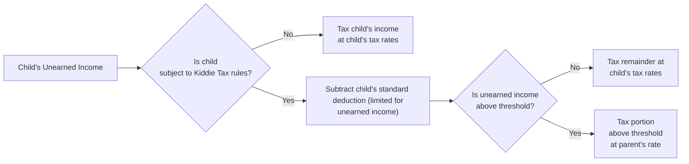

## 14.5 Kiddie Tax (Unearned Income of Minor Children)

The Kiddie Tax is designed to prevent taxpayers from avoiding higher tax rates by transferring income-producing assets to their children. Essentially, the Kiddie Tax imposes tax on unearned income (interest, dividends, capital gains, and certain other investment returns) earned by children above a statutory threshold at the parents’ tax rate if that rate is higher than the child’s. This rule serves as a leveling mechanism and ensures that taxpayers cannot circumvent higher individual marginal rates by assigning income to minors.

In this section, we examine the fundamental provisions of the Kiddie Tax, how to calculate the child’s standard deduction, and the interplay between the child’s and parent’s tax rates. We also provide examples, diagrams, and step-by-step calculations that demonstrate how the unearned income of children is taxed in practice.

--------------------------------------------------------------------------------

### Overview and Purpose

Congress enacted the Kiddie Tax provisions to curb income-shifting strategies. Without this rule, individuals could avoid higher marginal tax rates by registering investment accounts in the names of their children. The Kiddie Tax ensures that if a child’s unearned income surpasses a certain threshold, that excess amount is taxed at the parents’ marginal rate instead of the child’s (which typically would be much lower, especially if the child falls under the 10% or 12% brackets).

Key points to remember about Kiddie Tax rules:

• They apply only to unearned income above a statutory threshold.  
• They typically affect children under age 19 (or under 24 if full-time students).  
• Standard deductions for children, usually limited to earned income plus a fixed amount, can still apply.  
• After certain exclusions are applied, any unearned income subject to Kiddie Tax is taxed at the parent’s tax rates.  

--------------------------------------------------------------------------------

### Determining Who Is Subject to the Kiddie Tax

The Kiddie Tax rules generally apply to a child if all the following conditions are met:

1. The child is either:  
   - Under age 18 at the end of the tax year,  
   - Age 18 at the end of the tax year but did not have earned income exceeding half of the child’s own support, or  
   - A full-time student age 19–23 and did not have earned income exceeding half of his or her own support.  

2. The child has unearned income exceeding a statutory threshold (adjusted yearly for inflation).

3. The child does not file a joint return with a spouse.

4. At least one parent was alive at the end of the taxable year.

If these criteria are satisfied, the child’s unearned income above the specified threshold is potentially taxable at the parent’s income tax rate.

--------------------------------------------------------------------------------

### Defining Unearned Income

Unaudited or “unearned” income for Kiddie Tax purposes typically includes:

• Interest (bank deposits, bond coupons, etc.)  
• Dividends (cash dividends, reinvested dividends, capital gain distributions)  
• Capital gains (short-term and/or long-term gains on asset sales)  
• Royalties  
• Rents  
• Payment in lieu of dividends (if relevant under certain circumstances)  
• Other investment-related income  

“Earned income” (like wages, salaries, and self-employment earnings) is not subject to Kiddie Tax. Moreover, unearned income is not offset by the child’s normal standard deduction for earned income. Instead, the child receives a limited standard deduction reference (discussed below), and any remaining unearned income is taxed at special rates.

--------------------------------------------------------------------------------

### The Child’s Standard Deduction

When filing their own tax return, a child typically benefits from a standard deduction, although it is often less than the standard deduction for single filers. This deduction is the greater of:

• A fixed amount (indexed annually for inflation), or  
• The child’s earned income plus a nominal additional amount (also indexed for inflation).  

For instance, if a child has $400 of earned income and $2,000 of interest income from a savings account, the child’s standard deduction can generally be calculated as:

• Minimum Standard Deduction for Dependents = $1,250 (hypothetical inflation-adjusted amount).  
• Earned Income ($400) + $400 (inflation-adjusted nominal amount) = $800.  

Compare $1,250 to $800, and the child’s standard deduction would be the greater amount, or $1,250 in this scenario.

While the child’s standard deduction is often overshadowed by the unearned income portion, understanding this baseline is vital for calculating how much of the child’s unearned income remains subject to tax after exclusions.

--------------------------------------------------------------------------------

### Kiddie Tax Thresholds and Computations

Once the child’s standard deduction is applied to the total unearned income, any amount over the annual “Kiddie Tax threshold” may be taxed at rates applicable to the parents. The threshold amount is adjusted annually for inflation. Assume, for demonstration, the annual threshold is $2,300 (a hypothetical figure for illustration).

Calculation typically goes like this:

1. Start with the child’s unearned income.  
2. Subtract the child’s limited standard deduction that applies to unearned income.  
3. The next portion of remaining unearned income up to the threshold is taxed at the child’s individual rate.  
4. Any unearned income above the threshold is taxed at the higher of:  
   - The parent’s marginal tax rate, or  
   - The child’s rate if, in rare cases, it is higher (for instance, if the child also has significant earned income pushing them into higher brackets).  

The main effect is that unearned income exceeding the threshold is pulled into the parent’s sphere, so it alleviates the advantage of shifting large amounts of capital gains or dividend income to lower-bracket children.

#### Example 1: Basic Kiddie Tax Computation

Olivia, age 17, received $3,500 of interest income from bonds gifted by her grandparents. She also has $500 from a part-time job.

Step 1: Identify unearned income.  
• Unearned income = $3,500  
• Earned income = $500  

Step 2: Apply the standard deduction.  
• Assume the dependent standard deduction is $1,250 or (earned income + $400 = $900).  
• The greater is $1,250.  
• Because the $3,500 is unearned income, only a maximum portion of the standard deduction can offset unearned income (subject to certain rules). Let’s assume she deducts $1,250 from her total unearned income.

Step 3: Remaining unearned income before thresholds.  
• $3,500 – $1,250 = $2,250  

Step 4: Kiddie Tax threshold.  
• Let’s assume $2,300 is the threshold for the year.  
• Since $2,250 is below $2,300, the amount that exceeds the standard deduction is taxed at Olivia’s child rate. It does not exceed the threshold.  

In this simplified example, Olivia’s $2,250 above her standard deduction is taxed at her tax rates (e.g., 10% or 12%). None of her unearned income spills into the range subject to the parent’s rate because it’s under the $2,300 threshold.

#### Example 2: Exceeding the Threshold

Jack, age 16, has $6,500 of interest and dividend income from stocks held in a custodial account. He has no earned income.

Step 1: Identify unearned income.  
• Unearned income = $6,500  

Step 2: Child’s standard deduction.  
• Assume the standard deduction is $1,250 or (earned income + $400), whichever is larger.  
• With $0 earned income, the child’s standard deduction is $1,250.  

Step 3: Amount after standard deduction.  
• $6,500 – $1,250 = $5,250  

Step 4: Allocate across the threshold.  
• Assume the Kiddie Tax threshold is $2,300.  
• The first $2,300 of the remaining $5,250 is taxed at Jack’s rate (e.g., 10% or 12%).  
• The excess $5,250 – $2,300 = $2,950 is taxed at the parents’ marginal tax rate, say 24%.  

This approach prevents Jack’s family from enjoying low “child bracket” taxes on the entire $6,500 of unearned income.

--------------------------------------------------------------------------------

### Comparing Child’s Standard Deduction vs. Parental Rates

The mechanics of Kiddie Tax revolve around comparing:

• The child’s portion of standard deduction (used to offset unearned income).  
• Any leftover unearned income allocated partially to the child’s tax bracket up to the threshold.  
• Any unearned income in excess of the threshold taxed at the parent’s marginal rate.  

Hence, even though a child does have some tax benefits (like a minimal standard deduction or a 0% capital gains bracket for small amounts of income), once the unearned income is large enough, the advantage disappears above the threshold.

--------------------------------------------------------------------------------

### Flowchart for the Kiddie Tax Computation

Below is a Mermaid.js flowchart summarizing the core decision points for applying the Kiddie Tax:

Explanation:

• Step A → B: First confirm the child’s age, dependency status, and unearned income level. If not subject to Kiddie Tax rules (e.g., older than the age limit), everything is taxed at the child’s normal rates.  
• Step B → D: If rules apply, reduce unearned income by the child’s standard deduction (which is limited by law).  
• Step D → E: Compare total unearned income (net of the standard deduction) to the unearned income threshold set by law for Kiddie Tax.  
• Step E → F/G: If below the threshold, tax at the child’s rate. If above, the portion above the threshold is taxed at the parent’s rate.  

--------------------------------------------------------------------------------

### Timing and Reporting Requirements

The Kiddie Tax is reported on the child’s Form 1040 using Schedule D (if capital gains) and/or Schedule B (for interest and dividends), along with Form 8615 (“Tax for Certain Children Who Have Unearned Income”). 

Parents have the option, under certain conditions, to include a child’s unearned income on their own return (Form 8814) instead of filing a separate return for the child. However, this can sometimes lead to less-favorable treatment of deductions. Thorough analysis is necessary to determine which filing method is most beneficial.

--------------------------------------------------------------------------------

### Special Situations and Considerations

1. **Full-Time Students Aged 19–24**  
   A frequently overlooked aspect is the rule that makes an individual under age 24 subject to Kiddie Tax if they are full-time students with insufficient earned income to cover half their support. This is intended to prevent parents from funneling investment income into a 20-year-old college student with minimal wages.

2. **Exemptions from Kiddie Tax Rules**  
   If the child is married and filing a joint return, the Kiddie Tax can be avoided. Similarly, if the child is self-supporting, the Kiddie Tax does not apply.

3. **Unearned Income Derived from Awards, Prizes & Scholarships**  
   Certain taxable scholarships or grant income might be considered earned income for some tax benefits but unearned for others. Double-check the classification if the child is receiving large awards.

4. **State Tax Implications**  
   Some states mirror the federal Kiddie Tax structure. Others do not. Always check the relevant state rules because additional or alternative calculations might be required.

5. **Capital Gains vs. Ordinary Income**  
   Capital gains may be subject to preferential rates, even in the context of the Kiddie Tax. However, once those gains exceed the threshold, the child’s preferential rate is supplanted by the parents’ marginal rate (if the parent is in a high bracket for capital gains, it could be 15% or 20% or subject to the net investment income tax, if applicable).

6. **Tax-Exempt Interest**  
   Although not subject to federal tax, tax-exempt interest (e.g., from municipal bonds) still could appear on certain forms and needs to be reported. It does not trigger a Kiddie Tax liability directly, but it may affect other calculations.

--------------------------------------------------------------------------------

### Practical Strategies and Pitfalls

• **Strategy**: If parents wish to gift assets to children, shifting assets that yield minimal current income (e.g., growth stocks rather than high-dividend stocks) may reduce exposure to Kiddie Tax.  
• **Pitfall**: Failing to consider that the child’s unearned income can spike with capital gains (like from a large sale of appreciated stock) leads to unexpected tax obligations at the parents’ rate.  
• **Strategy**: Evaluate whether to file a separate return for the child or elect to include the child’s income on the parents’ return (Form 8814). Model both scenarios to see which results in lower combined taxes.  
• **Pitfall**: Misunderstanding the threshold or the child’s standard deduction can lead to underreporting or overreporting. If you undercalculate the portion subject to Kiddie Tax, you risk IRS scrutiny.  

--------------------------------------------------------------------------------

### Example: Comprehensive Case Study

#### Scenario

• Parents: Randall and Maria, who file jointly, are in the 24% marginal tax bracket.  
• Child: Sarah, age 19, a full-time college student without significant earned income.  
• Investment Income: Sarah has $800 dividends, $3,000 interest on a savings account, and a $2,500 net long-term capital gain from a stock sale. She has no wages.  

#### Step-by-Step Tax Calculation

1. **Determine if Kiddie Tax applies**  
   - Sarah is 19 and a full-time student. She has no earned income that exceeds half of her support. She meets the conditions for Kiddie Tax.  

2. **Identify total unearned income**  
   - Dividends: $800  
   - Interest: $3,000  
   - Capital gains: $2,500  
   - Total unearned income = $6,300  

3. **Calculate standard deduction for a dependent**  
   - Standard deduction for 202X is the greater of:  
     • $1,250 (hypothetical), or  
     • Earned income + $400 = $0 + $400 = $400  
   - The child’s standard deduction would be $1,250.  

4. **Net unearned income**  
   - $6,300 – $1,250 = $5,050  

5. **Apply the Kiddie Tax threshold** (assume $2,300 hypothetical)  
   - Up to $2,300 taxed at Sarah’s rate (say 10%).  
   - Amount above $2,300: $5,050 – $2,300 = $2,750, taxed at the parents’ 24% marginal rate (or capital gains rates if relevant for the portion that is capital gain).  

6. **Reflect capital gains preference**  
   - Typically, the capital gain portion can still be taxed at capital gains rates, but once the threshold is exceeded, the gains are taxed at Maria and Randall’s capital gains bracket (which could be 15% or 20%, depending on their total taxable income).  

7. **Summarize**  
   - The main lesson is that beyond the threshold, Sarah’s unearned income is taxed as if it were part of her parents’ returns. This eliminates most benefits of a low child bracket.  

--------------------------------------------------------------------------------

### Best Practices

1. **Maintain Separate Accounts for Earned vs. Unearned Income**  
   This helps clarify how much standard deduction is relevant and whether the child meets support thresholds.

2. **Leverage Low-Income Years for Capital Gains**  
   If you anticipate that the child will have only nominal unearned income or if the parent’s marginal rate is not significantly higher, you may choose to recognize capital gains in those years.

3. **Track the Age Limit Carefully**  
   As soon as the child turns 24 (and is no longer a full-time student), the Kiddie Tax restrictions generally end, and planning strategies can pivot substantially.

4. **Stay Updated on Threshold Changes**  
   Laws and thresholds are periodically updated. Regularly consult the IRS for the most recent figures (e.g., IRS Publication 929, “Tax Rules for Children and Dependents”).

5. **Reassess Family Tax Strategy**  
   Comprehensive financial planning should look at the entire family’s picture. Sometimes a modest short-term tax benefit for the child might create a bigger bill for the parents.

--------------------------------------------------------------------------------

### Additional Diagrams and Tables

Below is a table summarizing hypothetical thresholds and standard deduction amounts for dependents under the Kiddie Tax regime (Illustrative, not actual amounts):

| Item                                    |  Year 1   |  Year 2   |  Year 3   |
|----------------------------------------|-----------|-----------|-----------|
| Dependent Standard Deduction           | $1,250    | $1,300    | $1,350    |
| Child’s Earned-Income Plus $400 Amount | $400      | $425      | $450      |
| Kiddie Tax Unearned Income Threshold   | $2,300    | $2,400    | $2,500    |

Above amounts are hypothetical illustrations to demonstrate how figures can adjust yearly based on inflation indexing. Taxpayers must verify actual annual values via IRS publications.

--------------------------------------------------------------------------------

### References and Further Exploration

• IRS Publication 929, “Tax Rules for Children and Dependents.”  
• IRS Publication 17, “Your Federal Income Tax.”  
• IRS Instructions for Form 8615, “Tax for Certain Children Who Have Unearned Income.”  
• Chapter 15 (Adjustments, Deductions, and Credits) of this guide for additional insights into standard deductions and how they integrate with itemized deductions.  

--------------------------------------------------------------------------------

## Kiddie Tax Mastery Quiz



### Which type of income is generally subject to the Kiddie Tax rules?  
- [ ] Earned income from part-time jobs.  
- [x] Unearned income such as dividends or capital gains.  
- [ ] Scholarships and fellowships covering tuition.  
- [ ] Alimony received from a former spouse.  

> **Explanation:** The Kiddie Tax specifically targets unearned income (interest, dividends, capital gains, etc.). Earned income is excluded from Kiddie Tax rules.

### Which of the following criteria does NOT typically trigger Kiddie Tax for a child?  
- [x] The child has unearned income below the annual threshold.  
- [ ] The child is 17 years old with $3,000 in interest income.  
- [ ] The child is a full-time student age 20 with no earned income covering half of support.  
- [ ] At least one parent is alive at the end of the tax year.  

> **Explanation:** If a child’s total unearned income stays under the annual threshold, there is no amount subject to Kiddie Tax at the parents’ rate.

### Which filing status can, in some situations, help avoid Kiddie Tax for a child?  
- [ ] Head of Household.  
- [ ] Single.  
- [ ] Married Filing Separately.  
- [x] Married Filing Jointly (as the child, if applicable).  

> **Explanation:** If the child is married and files a joint return with their spouse, the Kiddie Tax may not apply.  

### A qualifying child’s unearned income of $4,500 is offset by a $1,250 standard deduction. If the Kiddie Tax threshold is $2,300, how much is taxed at the parent’s rate?  
- [ ] No amount, as all unearned income is below the threshold.  
- [x] $950.  
- [ ] $1,250.  
- [ ] $2,300.  

> **Explanation:** $4,500 – $1,250 = $3,250 remains. The first $2,300 is taxed at the child's rate, and the excess $950 ($3,250 – $2,300) is taxed at the parents’ rate.

### In which IRS form is the Kiddie Tax primarily reported if the child files a separate return?  
- [ ] Form 1040-C.  
- [ ] Form 2106.  
- [x] Form 8615.  
- [ ] Form 8814.  

> **Explanation:** Form 8615 is used by the child to report the Kiddie Tax if the child files a separate tax return.

### A child has $2,000 in capital gains and $500 in ordinary dividends. If the student qualifies for the Kiddie Tax and the threshold is $2,300, how is the surplus above the threshold determined after the standard deduction?  
- [x] Compare total unearned income minus standard deduction to $2,300.  
- [ ] Multiply capital gains by the child’s tax rate.  
- [ ] Apply only to dividends if they exceed $2,300.  
- [ ] Ignore threshold if it includes capital gains.  

> **Explanation:** The entire unearned income (capital gains + dividends) should be netted against the child's standard deduction first and then compared to the $2,300 threshold to determine how much is taxed at the parents’ rate.

### If a child meets the age criteria for Kiddie Tax but has sufficient earned income to support themselves, which is generally true?  
- [ ] All unearned income is taxed at the parent’s rate anyway.  
- [ ] Child can choose to not file if the unearned income is low.  
- [x] Kiddie Tax may not apply if the child provides more than half of their own support.  
- [ ] The child must use the parents’ standard deduction.  

> **Explanation:** One major test for Kiddie Tax is whether the child provides more than half of their own support through earned income. If they do, the Kiddie Tax may not apply.

### A child’s unearned income is $3,200 after the standard deduction. The child’s bracket is 10%, and the parents’ bracket is 24%. The Kiddie Tax threshold is $2,300. How is the child’s unearned income taxed?  
- [ ] All at 10%.  
- [ ] All at 24%.  
- [ ] $3,200 is fully taxed at 24%.  
- [x] The first $2,300 at 10%, the remaining $900 at 24%.  

> **Explanation:** After standard deduction, the portion up to $2,300 is taxed at the child’s 10% bracket, with the excess above $2,300 taxed at the parents’ 24% bracket.

### What happens if a parent opts to include the child’s interest and dividend income on their own tax return using Form 8814?  
- [x] The parent pays tax on that income at their own rate, and certain child tax benefits are lost.  
- [ ] The child’s standard deduction is doubled.  
- [ ] The child is automatically exempt from Kiddie Tax.  
- [ ] The child must pay self-employment tax.  

> **Explanation:** By filing Form 8814, the parent includes the child’s investment income on the parent’s return at the parent’s rate. However, this can remove some child tax benefits and may not always be advantageous.

### The Kiddie Tax primarily intends to…  
- [x] Prevent parents from shifting unearned income to children to benefit from lower tax brackets.  
- [ ] Encourage children to save for college.  
- [ ] Provide an extra credit for child dependents.  
- [ ] Tax all unearned income at a flat rate.  

> **Explanation:** The Kiddie Tax aims to deter parents from transferring significant income-generating assets to their children solely to realize the benefit of lower child tax brackets.



--------------------------------------------------------------------------------

## For Additional Practice and Deeper Preparation

### [Taxation & Regulation (REG) CPA Mock Exams](https://www.udemy.com/course/reg-cpa-mock-exams/?referralCode=55419EBD198F61530B12)

Taxation & Regulation (REG) CPA Mocks: 6 Full (1,500 Qs), Harder Than Real! In-Depth & Clear. Crush With Confidence!

- Tackle full-length mock exams designed to mirror real REG questions.  
- Refine your exam-day strategies with detailed, step-by-step solutions for every scenario.  
- Explore in-depth rationales that reinforce higher-level concepts, giving you an edge on test day.  
- Boost confidence and minimize anxiety by mastering every corner of the REG blueprint.  
- Perfect for those seeking exceptionally hard mocks and real-world readiness.

_Disclaimer: This course is not endorsed by or affiliated with the AICPA, NASBA, or any official CPA Examination authority. All content is for educational and preparatory purposes only._
