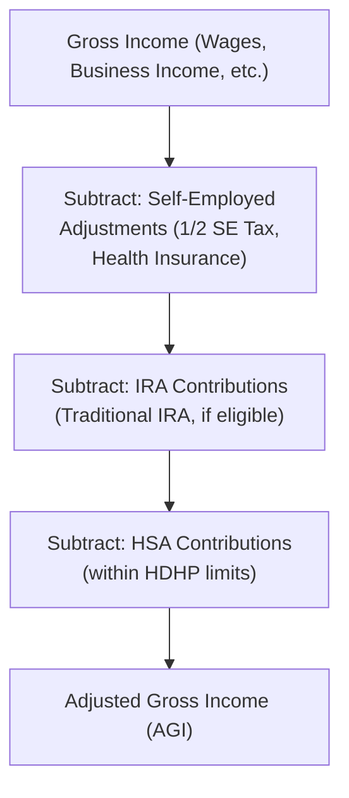

## 15.1 Adjustments to Arrive at Adjusted Gross Income (Self-Employed Expenses, IRAs, HSAs)

Adjusted Gross Income (AGI) sits at the crux of individual federal taxation in the United States. Many key tax provisions—such as eligibility for certain credits and the deduction phaseout thresholds—are determined based on your AGI. Therefore, understanding how to calculate it accurately is vital to compliance, proper planning, and maximizing tax benefits.

Above-the-line deductions (or adjustments) reduce gross income directly, lowering AGI before many other tax computations. This section focuses on three major categories of these deductions:
• Self-Employed Expenses  
• Individual Retirement Account (IRA) Contributions  
• Health Savings Account (HSA) Contributions  

Each of these items allows taxpayers to reduce their taxable income. Here, we explore definitions, eligibility criteria, phaseouts, and practical examples for each type of adjustment.

---

## Overview of Adjusted Gross Income

AGI is gross income (all includible income sources such as wages, interest, dividends, and business income) minus specific adjustments allowed by Internal Revenue Code (IRC) Section 62. These adjustments are commonly referred to as “above the line” because they are listed on Schedule 1 of Form 1040 (in the U.S.), which ultimately funnels into the main Form 1040 computation to arrive at AGI. Below is a simplified conceptual flow:

Understanding which deductions reduce gross income at this stage is critical, as they can also affect eligibility for many credits and other tax benefits.

---

## Self-Employed Expenses

Self-employed individuals often claim several “above-the-line” deductions that traditional employees do not have access to. Key self-employed adjustments included in calculating AGI are:

• Deduction for One-Half of Self-Employment Tax  
• Self-Employed Health Insurance Deduction  
• Contributions to Certain Self-Employed Retirement Plans  

### Deduction for One-Half of Self-Employment Tax

Self-employed taxpayers pay both the employer and employee portions of Social Security and Medicare taxes. However, to level the playing field with employees (who only pay the employee share of Social Security and Medicare), the IRC allows self-employed individuals to deduct the “employer’s equivalent portion” of these taxes. Concretely:

• Self-employed individuals calculate self-employment tax using Schedule SE.  
• One-half of the total self-employment tax is deductible directly from gross income, reducing AGI.  

#### Example

Connor has $100,000 of net self-employment income and calculates $14,130 of self-employment tax for the year (covering both employer and employee portions). He can claim an above-the-line deduction of $7,065, effectively reducing his AGI by this amount.

### Self-Employed Health Insurance Deduction

Self-employed individuals who pay for their own medical, dental, and qualified long-term care insurance premiums (for themselves, a spouse, and dependents) can deduct these premiums as an adjustment to income, provided they meet certain conditions:

• They cannot be eligible for employer-subsidized health insurance (e.g., coverage provided by a spouse’s employer).  
• The deduction is limited to net profit from self-employment (i.e., you cannot deduct more than your business profit).  
• Premiums for certain voluntary coverage like vision or qualified long-term care may also be included.

#### Example

Sarah is a sole proprietor with $40,000 net income. She pays $6,000 in annual health insurance premiums for herself and her dependent child. She may deduct the full $6,000 above the line, as long as neither she nor her child is eligible for an employer-sponsored plan. This reduces her AGI to $34,000 before other deductions.

### Contributions to Self-Employed Retirement Plans

Self-employed individuals (sole proprietors, partners in a partnership, members of LLCs taxed as partnerships, and owners of S corporations who receive wages) may contribute to various tax-advantaged retirement plans such as:

• SEP IRA (Simplified Employee Pension)  
• SIMPLE IRA (Savings Incentive Match Plan for Employees)  
• Solo 401(k)  

The contributions made to these plans are often deductible within certain limits. For instance:

• A SEP IRA allows contributions up to 25% of net self-employment earnings (effectively 20% after factoring in the calculation conventions), subject to annual maximums set by the IRS.  
• A SIMPLE IRA has separate contribution caps for employee deferrals and employer matches.  

Different retirement plan structures can deliver unique advantages for self-employed individuals, including higher maximum contribution limits and flexibility in deciding how much to save each year.

---

## Individual Retirement Account (IRA) Contributions

IRAs are popular vehicles for retirement savings because they combine relatively straightforward rules with significant tax benefits. While individuals can choose either a Traditional IRA or a Roth IRA, only contributions to a Traditional IRA (for qualified taxpayers) can be deducted to reduce AGI.

### Traditional IRA Contributions

A Traditional IRA generally allows you to claim an above-the-line deduction for contributions, subject to annual limits and phaseouts if you (or your spouse) are active participants in an employer-sponsored retirement plan. For example, if you are under 50 years of age, you may contribute up to an annual limit (which often adjusts for inflation). If you are 50 or older, you can make additional “catch-up” contributions.

#### Definition of Active Participant

An individual is typically classified as an active participant if they are covered by a qualified plan, such as a 401(k), 403(b), or defined benefit program at work, during any part of the year. This status triggers IRA deduction phaseouts based on Modified Adjusted Gross Income (MAGI).

### Deduction Phaseouts for Traditional IRAs

If you (or your spouse) are active in an employer plan, the ability to deduct your IRA contribution phases out gradually as your income (MAGI) rises. These phaseouts are set by law and adjust annually, but the structure remains consistent:

• If your MAGI is below the lower threshold, you can deduct the full contribution.  
• If your MAGI is above the upper threshold, you cannot deduct any contribution.  
• Between these thresholds, you get a partial deduction proportional to where you fall in the phaseout range.  

#### Example

Brian, age 40, earns $65,000 in wages and is covered by a 401(k) at work. He contributes $6,500 (assume the limit for the year is $6,500) to a Traditional IRA. Suppose the phaseout for an individual covered by an employer plan starts at $60,000 and ends at $70,000 for that year. Because Brian’s MAGI is $65,000—exactly in the middle—he can deduct half of his IRA contribution (i.e., $3,250). The remaining $3,250 is treated as a nondeductible contribution to the IRA.

### Spousal IRAs

If one spouse does not work (or has below a certain amount of earned income) but the other spouse has sufficient earnings, the nonworking spouse may contribute to a “Spousal IRA.” The deductibility rules and phaseouts still apply, but the thresholds and calculations adapt to joint filers. This ensures that even a stay-at-home spouse can build retirement assets within an IRA.

---

## Health Savings Account (HSA) Contributions

A Health Savings Account (HSA) is a tax-advantaged account designed to help cover current and future medical expenses. To qualify, a taxpayer must be enrolled in a High-Deductible Health Plan (HDHP) and meet other IRS requirements. Contributions to an HSA are above-the-line deductions that can reduce AGI, with additional tax savings potential if the funds are used for qualified medical expenses. HSAs are known as “triple tax-advantaged” because:

• Contributions reduce your taxable income.  
• Funds grow tax-deferred within the HSA.  
• Withdrawals for qualified medical expenses are tax-free.  

### Eligibility for an HSA

To contribute to an HSA, a taxpayer must:  
• Have qualified HDHP coverage.  
• Not be enrolled in Medicare.  
• Not be claimed as a dependent on someone else’s tax return.  

HDHPs must meet specific criteria for annual deductible minimums and maximum out-of-pocket expenses. These thresholds typically change each year for inflation.

### Annual Contribution Limits

The IRS imposes annual contribution limits for HSAs, which vary for self-only versus family coverage. There is also a catch-up contribution for participants aged 55 and older. Below is a simplified table (note that amounts can change each tax year):

| Coverage       | Annual Contribution Limit | Catch-Up (Age ≥ 55) |
|----------------|---------------------------|---------------------|
| Self-Only HDHP | $3,850                    | $1,000              |
| Family HDHP    | $7,750                    | $1,000              |

(These figures are for example only; always consult the IRS for current amounts.)

Contributions can be made by individuals or employers on behalf of the individual. Employer contributions do not count toward the employee’s taxable income and may not be deducted by the employee (because they are not included in income to begin with), but taxpayer contributions can be deducted above the line.

### Example

Jennifer holds family HDHP coverage and is under age 55. For the 2023 tax year, the IRS limit for family coverage (in our illustrative example) is $7,750. If Jennifer contributes the maximum amount to her HSA, she gets to reduce her AGI by $7,750 on her tax return (assuming no other special limitations), simultaneously creating a tax-advantaged pool of funds for her medical expenses.

---

## Common Phaseouts and Limitations

Because these adjustments directly reduce AGI, the IRS often imposes phaseouts or eligibility limitations based on modified income levels or plan participation. Below is an overview covering key points:

• Traditional IRA Deductions: Subject to phaseouts if covered by an employer plan or if spouse is covered by one.  
• Spousal IRA: Subject to a different set of phaseout levels for married filing jointly.  
• HSA Contributions: Limited by HDHP coverage type; no direct income-based phaseout, but not available if enrolled in Medicare or other non-HDHP coverage.  
• Self-Employed Health Insurance: The deduction is limited by business profits.  
• One-Half of Self-Employment Tax: Fully deductible (no phaseout), but obviously limited to the amount of the tax.  

---

## Practical Examples and Scenarios

### Scenario 1: Self-Employed with a Retirement Plan and HSA

Brenda, age 52, is a sole proprietor and has the following situation:
• Net profit from Schedule C: $85,000  
• Self-Employment Tax: $12,003 (approx. for demonstration)  
• Self-Employed Health Insurance Premiums: $5,400  
• SEP IRA Contribution: $10,000  
• HSA Contribution (Family Coverage): $7,700  

Brenda’s AGI is computed by reducing her $85,000 gross income by:  
1. One-half of her self-employment tax: $12,003 ÷ 2 = $6,001.50 (rounded as appropriate)  
2. Self-employed health insurance: $5,400  
3. SEP IRA contribution: $10,000  
4. HSA contribution: $7,700  

Her total above-the-line deductions are $29,101.50, so her AGI would be $55,898.50 (before rounding and other minor adjustments).

### Scenario 2: Employee with Traditional IRA Phaseout

Michael, age 40, works a salaried job earning $80,000 and has a 401(k) plan. He contributes to his 401(k) at work. He also wants to contribute to a Traditional IRA for additional savings. Assume:  
• The full IRA limit is $6,500.  
• His MAGI is $82,000.  
• The Traditional IRA deduction phaseout for single filers with an employer plan is between $68,000 and $78,000 (hypothetical).  

Because his $82,000 MAGI is over the upper limit, Michael cannot deduct any Traditional IRA contribution. He could still make a nondeductible contribution to a Traditional IRA or consider a Roth IRA if he meets that income threshold. This scenario highlights the importance of monitoring phaseouts to plan contributions effectively.

---

## Best Practices and Strategies

• Keep Track of Eligibility: Each year, confirm the relevant IRS thresholds for IRAs and HSAs. Contributions to Traditional IRAs, in particular, are subject to changing income limits.  
• Maximize Employer-Sponsored Options: Even if you can contribute to a Traditional IRA, do not overlook employer-sponsored plans, especially if an employer match is available.  
• Consider Timing: Make contributions early in the year if possible (or even the prior year by the tax return due date), to maximize potential earnings on tax-advantaged funds.  
• Document Thoroughly: Maintain good records of HSA medical withdrawals, self-employed health insurance payments, and IRA contribution statements (Form 5498).  
• Watch for Catch-Up Contributions: If you are 50 or older for IRAs or 55 or older for HSAs, make use of the extra amounts you can contribute to supercharge your retirement and medical savings.  

---

## Potential Pitfalls

• Exceeding Contribution Limits: Excess IRA or HSA contributions can result in penalties unless corrected before the relevant deadline.  
• Overlapping Coverage: If you are enrolled in Medicare or have alternative non-HDHP coverage, HSA eligibility is lost.  
• Failing to Calculate MAGI Correctly: Certain AGI modifications can alter your IRA deduction phaseout calculations, so ensure you compute your MAGI accurately (e.g., Social Security benefits can sometimes partially become taxable).  
• Underestimating Self-Employment Tax: Accurately calculating net self-employment income and corresponding tax ensures you take the correct partial deduction.  

---

## Visual Roadmap of AGI Adjustments

Below is a Mermaid.js diagram illustrating where self-employed taxes, IRA contributions, and HSA contributions fit into the path toward AGI:

The flow highlights the sequential consideration of each adjustment before ultimately arriving at AGI.

---

## Additional Resources

Below is a list of publications and tools for deeper research:

• IRS Publication 17: Covers the general rules for individual income taxes.  
• IRS Publication 334: Tax Guide for Small Business (for self-employed individuals).  
• IRS Publication 560: Retirement Plans for Small Business, focusing on SEP IRAs, SIMPLE IRAs, and more.  
• IRS Publication 590-A: Contributions to IRAs.  
• IRS Publication 969: Health Savings Accounts and Other Tax-Favored Health Plans.  
• Form 1040 Instructions: Contains line-by-line guidance for deducting IRA and HSA contributions.  
• Official IRS Website (irs.gov) for annual updates on phaseouts and contribution limits.  

These resources offer detailed explanations, worksheets, and examples to guide you in computing the correct deductions.

---

## Quiz: Mastering Adjustments to AGI with Self-Employed Expenses, IRAs, and HSAs



### Above-the-line deductions refer to which of the following adjustments made on an individual tax return?

- [x] Deductions subtracted from gross income to arrive at AGI.
- [ ] Deductions subtracted from taxable income to arrive at total tax.
- [ ] Deductions taken after calculating AGI but before itemizing.
- [ ] Deductions allowed only if itemizing.

> **Explanation:** Above-the-line deductions directly reduce gross income on Schedule 1, ultimately lowering AGI, which can impact many other tax calculations.

### Which of the following is an adjustment allowed for self-employed taxpayers?

- [x] One-half of the self-employment tax.
- [ ] Full amount of the self-employment tax.
- [ ] Only state taxes paid on business income.
- [ ] None—sole proprietors do not receive this adjustment.

> **Explanation:** Self-employed individuals can deduct half of the self-employment tax as an above-the-line adjustment, reflecting the “employer portion.”

### To claim a deductible Traditional IRA contribution, which factor often comes into play?

- [x] Whether the taxpayer (or spouse) is an active participant in an employer-sponsored retirement plan.
- [ ] The total number of years the taxpayer has contributed to IRA accounts.
- [ ] The taxpayer’s age exceeding 59½.
- [ ] The number of dependents claimed on the tax return.

> **Explanation:** If the taxpayer or spouse is covered by an employer plan, their ability to deduct Traditional IRA contributions may phase out or be eliminated based on MAGI thresholds.

### In which scenario could a Health Savings Account (HSA) contribution reduce AGI?

- [x] When the taxpayer is enrolled in a High-Deductible Health Plan (HDHP) and meets all HSA eligibility requirements.
- [ ] When the taxpayer is covered by Medicare and an HDHP simultaneously.
- [ ] When the taxpayer has an FSA (Flexible Spending Account) for medical expenses instead of an HSA.
- [ ] When the taxpayer is a dependent on another tax return but maintains an HDHP.

> **Explanation:** HSA contributions are deductible if the taxpayer has qualifying HDHP coverage and is not enrolled in Medicare or claimed as a dependent on another return.

### Which of the following describes the effect of phased deductions for Traditional IRAs?

- [x] The deduction is gradually reduced based on Modified AGI until it is fully disallowed beyond a specific income level.
- [ ] The deduction is completely disallowed below a certain income level.
- [x] The deduction is partially allowed in some income ranges.
- [ ] Phaseouts never apply to IRA contributions.

> **Explanation:** For Traditional IRAs, deductions can begin to phase out once a taxpayer’s MAGI reaches certain thresholds if they (or their spouse) are covered by an employer-sponsored plan.

### A self-employed taxpayer can deduct health insurance premiums above the line only if:

- [x] They (or their spouse) are not eligible for employer-subsidized coverage.
- [ ] They are also enrolled in Medicare.
- [ ] Under no circumstances—health insurance is not an above-the-line deduction.
- [ ] The premiums exceed 7.5% of AGI.

> **Explanation:** Self-employed health insurance premiums are deductible provided the self-employed individual does not have access to employer-subsidized coverage.

### HSA contributions can be:

- [x] Made by both the individual and their employer, but only the individual’s contributions reduce the individual’s AGI.
- [ ] Made only by the individual.
- [x] Subject to annual limits determined by the IRS.
- [ ] Made even if you have standard health insurance with low deductibles.

> **Explanation:** Employers can contribute to an individual’s HSA (excluded from income), but individuals may also contribute and deduct it, subject to annual IRS limits and HDHP enrollment requirements.

### A married individual with no earned income may contribute to a Traditional IRA if:

- [x] Their spouse has sufficient earned income.
- [ ] They have no other sources of income outside investment dividends.
- [ ] They only file separately.
- [ ] Their net worth is above $1,000,000.

> **Explanation:** A “Spousal IRA” allows a married spouse with limited or no compensation to contribute to an IRA, as long as the other spouse has sufficient earned income.

### Which statement is true about the one-half self-employment tax deduction?

- [x] It helps parity with employees who only pay their half of FICA taxes.
- [ ] It is entirely optional and can be taken or not taken.
- [ ] It replaces the standard business expense deduction.
- [ ] It depends on whether the taxpayer itemizes or not.

> **Explanation:** The allowed deduction ensures fair treatment between employees and self-employed persons and does not depend on itemizing or standard deduction.

### For an HSA to be valid, the taxpayer must have a high-deductible health plan (HDHP). True or False?

- [x] True
- [ ] False

> **Explanation:** This is one of the main requirements for HSA contributions to be deductible. Having an HDHP is mandatory for establishing and contributing to an HSA.



---

## For Additional Practice and Deeper Preparation

### [Taxation & Regulation (REG) CPA Mock Exams](https://www.udemy.com/course/reg-cpa-mock-exams/?referralCode=55419EBD198F61530B12)

**Taxation & Regulation (REG) CPA Mocks:** 6 Full (1,500 Qs), Harder Than Real! In-Depth & Clear. Crush With Confidence!

- Tackle full-length mock exams designed to mirror real REG questions.  
- Refine your exam-day strategies with detailed, step-by-step solutions for every scenario.  
- Explore in-depth rationales that reinforce higher-level concepts, giving you an edge on test day.  
- Boost confidence and minimize anxiety by mastering every corner of the REG blueprint.  
- Perfect for those seeking exceptionally hard mocks and real-world readiness.  

_Disclaimer: This course is not endorsed by or affiliated with the AICPA, NASBA, or any official CPA Examination authority. All content is for educational and preparatory purposes only._
