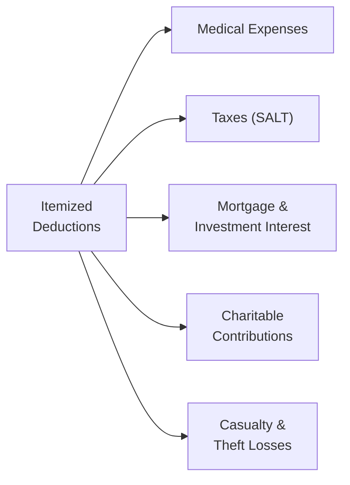

## 15.2 Itemized Deductions (Medical, Taxes, Interest, Charity, Casualty)

Itemized deductions provide taxpayers the opportunity to subtract certain expenses from their adjusted gross income (AGI) rather than taking the standard deduction. By carefully documenting and deducting eligible expenses—such as qualifying medical costs, allowable taxes, mortgage interest, charitable donations, and casualty losses—taxpayers may significantly reduce taxable income. This section explores each category of itemized deductions in depth, clarifies various thresholds, and addresses AGI limitations and special rules like the SALT (State and Local Tax) cap. Because tax laws can change frequently, always consult the most current Internal Revenue Code (IRC) provisions, IRS publications, and authorized guidance (see Chapter 32 for reference materials).

Below is a high-level diagram of the major categories of itemized deductions covered in this section:

--------------------------------------------------------------------------------

### Overview of Itemized Deductions

Before detailing each deduction category, it is helpful to understand the interplay between the standard deduction and the sum of itemized deductions. Each year, taxpayers choose between:

• Taking the standard deduction provided by the tax code.  
• Itemizing deductions if the total of eligible expenditures surpasses the standard deduction amount.

High-income earners or taxpayers with substantial medical bills, mortgage interest, charitable gifts, or multiple property tax obligations often benefit from itemizing because their deductions add up to more than the standard deduction. Sound knowledge of thresholds and limitations prevents over- or underestimating these tax benefits.

--------------------------------------------------------------------------------

### Medical Expense Deductions

Medical expenses can be deducted to the extent they exceed 7.5% of a taxpayer’s AGI (as of current law). This threshold is critical; only the amount of qualifying medical expenses above 7.5% of AGI is deductible.

1. Qualifying Medical Expenses:  
   • Payments to doctors, dentists, surgeons, chiropractors, psychiatrists, psychologists, and other medical practitioners.  
   • Prescription medication, including certain eligible over-the-counter drugs and medical devices (e.g., prescription eyeglasses).  
   • Health insurance premiums paid with after-tax dollars (excluding premiums paid with pretax payroll deductions).  
   • Transportation costs to and from medical care (e.g., mileage at the allowable IRS rate, tolls, parking).  
   • Hearing aids, wheelchairs, crutches, and other specialized medical equipment.

2. Non-Qualifying Expenses:  
   • Cosmetic procedures not considered medically necessary, such as elective cosmetic surgery.  
   • General health items: vitamins, travel for rest or well-being, over-the-counter toiletries.  
   • Non-prescription drugs (except insulin in certain cases).

3. Practical Example:  
   Suppose Jacob has an AGI of $100,000. He incurred $12,000 in qualified medical expenses during the tax year. His deduction is computed as follows:

   • 7.5% of $100,000 = $7,500  
   • Qualified expenses above $7,500 = $12,000 − $7,500 = $4,500 allowed as an itemized deduction  

4. Best Practices and Pitfalls:  
   • Keep accurate records, including invoices, prescriptions, and mileage logs.  
   • Only expenses paid during the tax year count, so timing can be significant (e.g., prepaying procedures or treatments in a taxable year where a large expense is expected can maximize the deduction).  
   • Always distinguish between qualified and non-qualified items; mixing them can trigger IRS scrutiny.

--------------------------------------------------------------------------------

### Taxes (State and Local) – SALT Deductions

The deduction for state and local taxes (SALT) includes state and local income taxes (or sales taxes, if elected), real property taxes, and personal property taxes. A crucial provision introduced by the Tax Cuts and Jobs Act (TCJA) caps the maximum SALT deduction at $10,000 ($5,000 if married filing separately). This substantially impacts itemizing for many taxpayers living in states with high tax burdens.

1. Eligible Taxes:  
   • State and local income taxes withheld throughout the year or paid in the form of estimated tax payments.  
   • State and local sales taxes (in lieu of income taxes) if beneficial.  
   • Real property taxes on the taxpayer’s primary residence or other properties, as long as they are not for business use (business property taxes should be accounted for on business returns).  
   • Personal property taxes based on the value of personal assets (e.g., motor vehicle registration fees assessed on value rather than weight or flat rate).

2. Practical Example:  
   Mia, a single taxpayer living in a high-tax state, pays $5,000 in state income tax, $3,000 in property tax, and $2,000 in local taxes, totaling $10,000. Even though her combined state and local taxes exceed $10,000, she is limited to a $10,000 SALT deduction.

3. Special Notes and Pitfalls:  
   • Taxpayers often overestimate the benefit by not accounting for the SALT cap. Attempting to pay multiple years’ worth of property taxes in one year may trigger IRS rules that disallow or strictly limit prepayment strategies.  
   • Sales tax vs. Income tax election: Some taxpayers in states with no income tax prefer deducting cumulative sales taxes. Keep receipts or use the IRS Optional Sales Tax Table if you itemize.

--------------------------------------------------------------------------------

### Interest Deduction

Interest deductions primarily revolve around home mortgage interest and investment interest.

#### Home Mortgage Interest

1. Qualified Residence Interest:  
   • Acquisition indebtedness (mortgages) used to buy, build, or substantially improve a primary or secondary residence.  
   • Interest is generally deductible on mortgage balances up to $750,000 of indebtedness incurred after December 15, 2017 ($1 million limit applies to older mortgages under grandfathering rules).  

2. Points and Origination Fees:  
   • “Points” paid on the purchase (or refinancing) of a principal residence may be deductible, subject to specific conditions. Usually, points are deductible in the year paid if they meet certain criteria (such as the loan being used to buy or improve a principal residence), otherwise they are amortized over the life of the loan.  

3. Home Equity Loan Interest:  
   • Interest on a home equity loan is deductible only if the loan proceeds are used to buy, build, or substantially improve the home that secures the loan. If the proceeds are used for other purposes (e.g., paying off credit cards or going on vacation), the interest would not be deductible under current rules.  

4. Example and Limitation Scenario:  
   • Pat and Terry purchase a home in 2023 with a $900,000 mortgage. The mortgage interest on amounts above $750,000 is not deductible. They must allocate the interest proportionally.

#### Investment Interest

Investment interest expense related to interest on loans used to purchase or carry investment property (e.g., margin accounts for stocks) can be deductible to the extent of net investment income. Any disallowed portion is carried forward.

1. Net Investment Income:  
   • Includes interest, dividends (unless qualified dividends are excluded), annuities, and royalties.  
   • Generally, does not include net capital gains unless the taxpayer elects to treat gains as ordinary income.

2. Carryover:  
   • Excess investment interest expense that cannot be used in the current tax year due to insufficient investment income can be carried forward indefinitely.

--------------------------------------------------------------------------------

### Charitable Contributions

Charitable contribution deductions promote philanthropic activities by providing tax benefits to donors who contribute to qualifying nonprofit organizations (e.g., 501(c)(3) entities). The rules can be complex, but some general principles apply:

1. Qualifying Organizations and Donations:  
   • The donation must be made to a qualified organization recognized by the IRS (e.g., religious, educational, scientific, or charitable groups).  
   • Gifts must be voluntary and free from any form of reciprocal benefit except token acknowledgments.  
   • Common forms of charitable contributions include cash, check, securities, and in-kind donations of property.

2. Percentage Limitations Based on AGI:  
   • Cash contributions to public charities can typically be deducted up to 60% of the taxpayer’s AGI. (Pending legislation, this can fluctuate, and temporary measures can expand or contract this threshold.)  
   • Donations of long-term appreciated capital assets (e.g., stocks) are generally deductible at fair market value (FMV), limited to 30% of AGI for contributions to public charities.  
   • Excess contributions can be carried forward for up to five years.

3. Substantiation Requirements:  
   • Written acknowledgment from the charitable organization is required for contributions of $250 or more.  
   • For property contributions exceeding $5,000, a qualified appraisal is necessary.  
   • A canceled check or credit card receipt may suffice for smaller donations.

4. Example:  
   • Randy has an AGI of $100,000 and donates $50,000 in cash to a public charity. He can deduct $50,000 (up to 60% of AGI = $60,000), leaving no carryforward.  
   • If Randy donated $70,000 instead, he could only use $60,000 (60% of AGI) during the current year and carry forward the remaining $10,000 for use in the next five tax years, subject to the same limitations.

--------------------------------------------------------------------------------

### Casualty and Theft Loss Deductions

Casualty losses generally include damage, destruction, or loss of property resulting from a sudden, unexpected, or unusual event, typically in a federally declared disaster area. The rules have tightened in recent years, making casualty loss deductions narrower.

1. Federally Declared Disaster Requirement:  
   • After 2017, personal casualty and theft losses are generally deductible only if the event stems from a federally declared disaster.  
   • If the taxpayer has personal casualty gains, it is possible to offset the loss with those gains without requiring a federal disaster declaration.  

2. Deduction Limitations:  
   • Each casualty or theft loss is subject to a $100 floor.  
   • The aggregate net loss after the $100 floor is further subject to a reduction of 10% of the taxpayer’s AGI.  
   • For example, if you incur a $10,000 casualty loss from a federally declared disaster and your AGI is $80,000, you first reduce the loss by $100, leaving $9,900. Then you reduce that by 10% of AGI (10% of $80,000 = $8,000), resulting in a deductible amount of $1,900.

3. Calculating the Loss:  
   • The amount of loss is typically the lesser of the adjusted basis of the property or the decrease in the property’s fair market value due to the event.  
   • Insurance or other reimbursements reduce the deductible loss.

4. Example:  
   • Olivia’s home (basis of $200,000) is severely damaged by a hurricane in a federally declared disaster area. The decrease in FMV is $70,000, but her insurance covers $20,000 of repairs. Her unreimbursed loss is $50,000. Subtract $100, leaving $49,900. If her AGI is $100,000, then 10% of AGI is $10,000. The allowable deduction is $39,900.

--------------------------------------------------------------------------------

### Putting It All Together: Deciding to Itemize

Taxpayers generally compare their total itemized deductions to the standard deduction. If the itemized total exceeds the standard deduction (and the taxpayer is not required to itemize for other reasons), they benefit from itemizing. When considering whether to itemize:

• Project out-of-pocket medical expenses for the year, especially if you expect them to surpass the 7.5% threshold.  
• Monitor SALT payments and factor in the $10,000 (or $5,000 if MFS) cap.  
• Evaluate mortgage interest, home equity loan use, and potential decision points such as refinancing or paying off points.  
• Plan around your charitable contributions for maximum impact (e.g., bunching multiple years of donations into a single tax year can boost the itemized total).  
• Determine whether you qualify for casualty loss deductions (rare outside of federally declared disaster areas).  

--------------------------------------------------------------------------------

### Common Pitfalls and Best Practices

• Overlooking the SALT limit: Many filers assume all real estate and local income taxes are fully deductible. Remember the $10,000 cap.  
• Mixing ineligible expenses with eligible medical costs: Thoroughly document each medical expense to avoid confusion or disallowance.  
• Confusing home equity loan interest used for non-home improvements: The tax reform changes eliminated deductions for personal uses of home equity debt.  
• Failing to secure proper charitable receipts: Large donations without the necessary substantiation may be disallowed if audited.  
• Delay preference: Taxpayers commonly delay or accelerate payments to bunch deductions into a particular tax year to exceed standard deduction thresholds.

--------------------------------------------------------------------------------

### Diagrams and Tables for Quick Reference

Below is a simplified table summarizing the key limits and thresholds:

| Deduction Type        | Key Threshold/Limit                                                             |
|-----------------------|---------------------------------------------------------------------------------|
| Medical Expenses      | Deductible > 7.5% of AGI                                                        |
| SALT                  | Capped at $10,000 for MFJ or Single; $5,000 for MFS                              |
| Home Mortgage Interest| Up to $750,000 of acquisition indebtedness post-2017; grandfathered rules apply |
| Investment Interest   | Limited to net investment income, indefinite carryforward                        |
| Charitable Giving     | Generally ≤ 60% of AGI for cash; 30% for appreciated property; 5-year carryover  |
| Casualty & Theft      | Federal disaster required (after 2017), $100 floor, and >10% of AGI limit       |

--------------------------------------------------------------------------------

### Illustrative Example: Comprehensive Calculation

Assume the following facts for a married couple filing jointly:

• AGI: $150,000  
• Paid $12,000 in medical expenses (all qualified).  
• State and local taxes: $6,000 in state income tax; $5,000 in property tax.  
• Mortgage interest on a qualifying residence loan: $7,500  
• Charitable cash contributions of $10,000 to a public charity.  
• No casualty losses.  

1. Medical:  
   • 7.5% of $150,000 = $11,250 threshold.  
   • Actual expenses above threshold: $12,000 − $11,250 = $750.  

2. SALT:  
   • $6,000 + $5,000 = $11,000, capped at $10,000.  

3. Mortgage Interest: $7,500 (fully deductible under the $750,000 loan limit).  

4. Charitable Contributions: $10,000 (below the 60% AGI limit of $90,000).  

5. Total Itemized = $750 (medical) + $10,000 (SALT, capped) + $7,500 (mortgage interest) + $10,000 (charitable) = $28,250  

If the standard deduction for their filing status is $27,700, itemizing yields them an extra $550 in deductions over the standard deduction—a modest but potentially beneficial increase.

--------------------------------------------------------------------------------

### References and Further Exploration

• IRC §§ 63, 67, 68, 170, 213, 163(h), and 164.  
• IRS Publication 17 (Your Federal Income Tax)  
• IRS Publication 502 (Medical and Dental Expenses)  
• IRS Publication 526 (Charitable Contributions)  
• IRS Publication 529 (Miscellaneous Deductions)  
• IRS Publication 547 (Casualties, Disasters, and Thefts)  

Continue to update your knowledge with official IRS releases and AICPA guidance. Changes in legislation and inflation-adjusted thresholds can significantly impact deductible amounts.

--------------------------------------------------------------------------------

## Maximize Your Itemized Deductions: Medical, SALT, Interest, Charity, and Casualty Quiz



### Which of the following describes the general threshold for deducting medical expenses?

- [ ] 10% of AGI
- [ ] 3% of AGI
- [x] 7.5% of AGI
- [ ] Fully deductible regardless of AGI

> **Explanation:** Medical expenses must generally exceed 7.5% of the taxpayer’s adjusted gross income, and only the amount above 7.5% is deductible.

### If a taxpayer’s SALT liability exceeds $10,000, which of the following rules applies?

- [ ] They can deduct the full amount
- [ ] They may choose to switch to the standard deduction and still claim an additional $10,000
- [x] The SALT deduction is capped at $10,000 ($5,000 if MFS)
- [ ] SALT deductions have been entirely repealed

> **Explanation:** Recent tax legislation caps the deduction for state and local taxes at $10,000 for most filing statuses and $5,000 for married filing separately.

### Which of the following mortgage interest payments is fully deductible on Schedule A?

- [x] Mortgage interest on $650,000 of acquisition debt incurred after 2017
- [ ] Mortgage interest on a $1.2 million loan incurred after 2017
- [ ] Home equity loan interest used for personal vacations
- [ ] Interest paid on all credit card balances

> **Explanation:** Mortgage interest is generally deductible up to $750,000 of acquisition indebtedness for loans incurred after 2017. Amounts above that are not deductible.

### How are charitable contributions of appreciated stock to a public charity typically treated?

- [x] Deductible at fair market value, subject to 30% of AGI limit
- [ ] Deductible at fair market value, subject to 60% of AGI limit
- [ ] Deductible at cost basis, subject to 50% of AGI limit
- [ ] Deductible at cost basis only

> **Explanation:** Appreciated capital gains property donated to a public charity can be deducted at fair market value, typically limited to 30% of a taxpayer’s AGI.

### Which statement best describes the rules for deducting a personal casualty loss?

- [x] It must arise from a federally declared disaster, exceeding a $100 floor and reduced by 10% of AGI
- [ ] It can be deducted in full if any storm damage occurs
- [x] A federally declared disaster is not necessary to deduct personal casualty losses after 2017
- [ ] No AGI limitation applies

> **Explanation:** Personal casualty and theft losses are generally only deductible if part of a federally declared disaster (post-2017), with a $100 reduction per event and a further 10% of AGI threshold. An exception exists for offsetting casualty gains (no federal disaster declaration is needed in that scenario).

### Under current law, which of the following can be claimed as an itemized deduction without limitation?

- [x] Qualified charitable contributions within AGI limitations
- [ ] Unlimited state and local taxes
- [ ] Mortgage interest on any amount of home mortgage debt
- [ ] Personal expenses unrelated to income production

> **Explanation:** While there are AGI percentage limitations that apply to charitable contributions, there is no absolute dollar cap for qualifying donations (unlike SALT or mortgage interest).

### How is investment interest expense treated if it exceeds net investment income during the tax year?

- [x] It is carried forward until offset by sufficient net investment income in a future tax year
- [ ] It is lost and cannot be deducted
- [x] It must be capitalized instead
- [ ] It can be applied to reduce ordinary business income

> **Explanation:** Investment interest expense is deductible only up to net investment income in a given year. Any unused amounts carry forward indefinitely.

### Which of the following accurately describes the deduction for home equity interest?

- [x] It is limited to interest on proceeds used to buy, build, or improve the residence
- [ ] All home equity loan interest is always deductible
- [ ] The deduction is automatically disallowed under current tax law
- [ ] It is limited to interest on home equity loans below $50,000

> **Explanation:** Under the current tax rules, interest on home equity loans is deductible if (and only if) the loan proceeds are used to substantially improve the residence.

### A taxpayer donated $40,000 in cash to a public charity and their AGI was $60,000. Which of the following is true?

- [x] Their current deduction is $36,000 if the maximum cash deduction for that year is 60% of AGI
- [ ] They can deduct the entire $40,000
- [ ] They must itemize everything next year
- [ ] They lose the unused portion

> **Explanation:** If the AGI-based restriction is 60%, it equals $36,000 for a $60,000 AGI. The remaining $4,000 can be carried forward up to five years.

### Casualty losses subject to the federal disaster rule are reduced by a __________ amount per event before the 10% of AGI reduction is applied.

- [x] $100
- [ ] $1,000
- [ ] $200
- [ ] $75

> **Explanation:** The tax code imposes a $100 floor per casualty event, after which the 10% of AGI limitation applies.



--------------------------------------------------------------------------------

## For Additional Practice and Deeper Preparation

### [Taxation & Regulation (REG) CPA Mock Exams](https://www.udemy.com/course/reg-cpa-mock-exams/?referralCode=55419EBD198F61530B12)

**Taxation & Regulation (REG) CPA Mocks:** 6 Full (1,500 Qs), Harder Than Real! In-Depth & Clear. Crush With Confidence!

- Tackle full-length mock exams designed to mirror real REG questions.  
- Refine your exam-day strategies with detailed, step-by-step solutions for every scenario.  
- Explore in-depth rationales that reinforce higher-level concepts, giving you an edge on test day.  
- Boost confidence and minimize anxiety by mastering every corner of the REG blueprint.  
- Perfect for those seeking exceptionally hard mocks and real-world readiness.

_Disclaimer: This course is not endorsed by or affiliated with the AICPA, NASBA, or any official CPA Examination authority. All content is for educational and preparatory purposes only._
