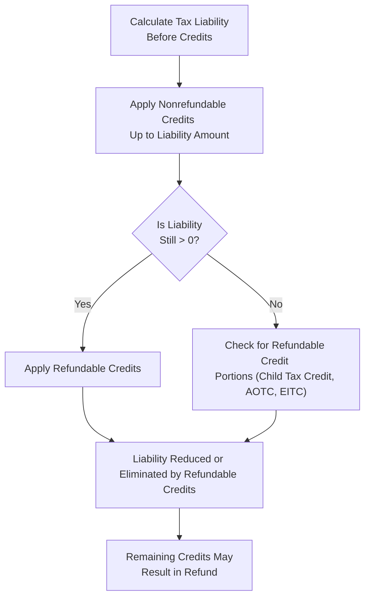

## 15.3 Tax Credits (Refundable vs. Nonrefundable)

Tax credits represent one of the most direct methods to reduce an individual’s overall tax liability. In essence, a credit directly offsets your tax bill, unlike a deduction, which merely reduces taxable income. However, not all tax credits are created equal. They generally fall into two broad categories:

1. Refundable Tax Credits  
2. Nonrefundable Tax Credits  

This section examines the distinctions between these two categories and provides an in-depth look at prominent credits frequently examined on the Uniform CPA Examination, including the Child Tax Credit, Earned Income Tax Credit, and Education Credits.

--------------------------------------------------------------------------------

### Overview of Tax Credits

Before dissecting the nuances of refundable versus nonrefundable credits, let us clarify the overarching purpose of a tax credit. A tax credit effectively offsets your total tax liability. For instance, if a taxpayer calculates a $3,000 liability from ordinary income taxes and claims a $1,000 credit, their net tax liability is reduced to $2,000.

#### Key Distinction: Deductions vs. Credits

• Deductions: Reduce your taxable income.  
• Credits: Reduce your tax liability, dollar for dollar.  

Therefore, a $1,000 credit generally holds more value than a $1,000 deduction, especially for lower-income taxpayers who may have a reduced marginal tax rate.

--------------------------------------------------------------------------------

### Refundable vs. Nonrefundable Tax Credits

Tax credits can be either entirely refundable or nonrefundable (and, in some cases, partially refundable). The exam often requires understanding not only how to calculate the credit but also how to measure its financial impact when a taxpayer’s liability has already been reduced to zero.

#### Refundable Tax Credits

Refundable tax credits allow taxpayers to reduce their liability below zero. In other words, if a taxpayer’s total income tax liability is less than the amount of a refundable credit, the difference is refunded to the taxpayer.

• Example: A taxpayer has a total tax liability of $400. They are eligible for a $1,000 refundable credit. After applying the credit, their liability becomes $0, and they receive the remaining $600 as a refund.  

Key Refundable Credits:  
• Earned Income Tax Credit (EITC)  
• Part of the American Opportunity Tax Credit (AOTC) (partial refundability)  
• Some additional refundable child credits like the Additional Child Tax Credit portion  

#### Nonrefundable Tax Credits

Nonrefundable tax credits can reduce a taxpayer’s liability to zero, but do not produce any refund beyond that point. If the credit is larger than the current liability, the taxpayer generally loses the unused portion (unless the credit can be carried forward).

• Example: A taxpayer has a tax liability of $400 and a nonrefundable credit of $1,000. The credit reduces the liability to $0, but the taxpayer receives no refund of the remaining $600.  

Key Nonrefundable Credits:  
• Lifetime Learning Credit (LLC)  
• The main portion of the Child Tax Credit (some components are now refundable, but historically it had large nonrefundable portions)  
• Certain foreign tax credits  

--------------------------------------------------------------------------------

### Major Individual Tax Credits

Below we explore the most commonly claimed individual tax credits relevant to CPA candidates: the Child Tax Credit, the Earned Income Tax Credit (EITC), and Education Credits (American Opportunity Tax Credit and Lifetime Learning Credit). While numerous other credits exist (e.g., Child and Dependent Care Credit, Adoption Credit, and various energy credits), the credits discussed in this section exemplify the fundamental distinctions between refundable and nonrefundable.

--------------------------------------------------------------------------------

### Child Tax Credit

The Child Tax Credit (CTC) has evolved significantly over the years. Though legislative changes may alter specific amounts and eligibility thresholds, the underlying principles remain consistent. The CTC typically features two components: (1) a potentially nonrefundable base credit, and (2) an additional refundable credit component if certain conditions are met.

• Primary Eligibility Requirements:  
  1. Qualifying Child: Must be a taxpayer’s dependent under Internal Revenue Code (IRC) guidelines, generally under age 17 at the end of the tax year.  
  2. Relationship Test: Child must be a son, daughter, stepchild, foster child, sibling, stepsibling, or a descendant of any of these.  
  3. Support Test: The child must not provide more than half of their own support.  
  4. Citizenship/Residency: Must be a U.S. citizen, U.S. national, or U.S. resident alien, and generally must reside with the taxpayer more than half the year.  
  5. Taxpayer Identification Number Requirements: The child must have a valid Social Security Number in most scenarios.  

• Credit Amount and Phaseouts:  
  The exact credit amount varies by legislation. Commonly, phaseouts begin at adjusted gross income (AGI) thresholds that reduce the available credit. For example, the credit starts phasing out at certain income levels (which can change with inflation adjustments annually).  

• Refundable vs. Nonrefundable Portions:  
  Historically, a portion of the Child Tax Credit is nonrefundable (reduces tax liability to zero), and the additional portion may be refundable, called the Additional Child Tax Credit (ACTC). The exact refundable portion depends on earned income level.  

--------------------------------------------------------------------------------

#### Example: Child Tax Credit Calculation

Suppose a married couple filing jointly has two qualifying children (ages 8 and 10). Their calculated federal income tax liability before credits is $3,000, and the applicable nonrefundable Child Tax Credit is $4,000 (assume $2,000 per each qualifying child for illustrative purposes).  

1. Apply the $4,000 nonrefundable credit against the $3,000 tax liability. This reduces the tax liability to $0.  
2. The couple has $1,000 in unused credit. Depending on legislation and their earned income, a portion of that additional credit might be refundable.  

If the rules permit up to $1,400 of the per-child credit to be refundable per child, this couple could claim a portion of the $2,000 leftover credit (i.e., $1,000 remains after offsetting liability) as a refund. The precise mechanics hinge on their earned income and the specific year’s rules, but for exam purposes, you must be comfortable applying a refundable portion once the liability hits zero.

--------------------------------------------------------------------------------

### Earned Income Tax Credit (EITC)

The Earned Income Tax Credit is fully refundable. The EITC primarily benefits low-to-moderate-income working individuals or couples, particularly those with children. It functions as an incentive for employment, providing a larger credit amount for families with greater earned income—up to a point—after which the credit gradually phases out.

• Eligibility Requirements:  
  1. Earned Income: Taxpayer (and spouse if married filing jointly) must have earned income (e.g., wages, salaries, tips, net self-employment income).  
  2. Investment Income Limitation: The taxpayer’s total investment income cannot exceed a certain threshold (updated annually).  
  3. Valid Social Security Numbers: Both taxpayer and any qualifying children must have valid SSNs.  
  4. Filing Status: Cannot file as “Married Filing Separately.”  
  5. Qualifying Child(ren): A taxpayer with children must ensure they meet relationship, age, and residency requirements. Eligibility extends to taxpayers without children, albeit at a reduced credit amount and subject to different thresholds.  

• Phase-In and Phaseout:  
  – The EITC begins to increase as earned income rises from zero to a specified threshold.  
  – After reaching the maximum credit amount, it gradually phases out as income surpasses the maximum threshold.  

Because the EITC can exceed your tax liability, any surplus is fully refunded.

--------------------------------------------------------------------------------

#### Example: EITC Computation

Consider a single taxpayer with one qualifying child and $20,000 of earned income. In a given tax year (assume no other credits or complexities):

1. The taxpayer’s regular tax liability might calculate to around $500, depending on their other deductions.  
2. The EITC amount for one qualifying child could be approximately $3,500 (this number changes annually).  
3. After reducing the $500 regular tax, the remaining $3,000 is refunded to the taxpayer.

This illustrates how the EITC operates as a strong refundable credit, especially for lower-income working parents.

--------------------------------------------------------------------------------

### Education Credits

Two main education credits claimed by individuals include:  
1. American Opportunity Tax Credit (AOTC)  
2. Lifetime Learning Credit (LLC)  

While both credits aim to reduce the burden of postsecondary education expenses, their refundability and eligibility criteria differ.

--------------------------------------------------------------------------------

#### American Opportunity Tax Credit (AOTC)

The AOTC provides a maximum annual credit of up to $2,500 per eligible student for the first four years of postsecondary education, with 40% of the credit amount (up to $1,000) refundable if the credit exceeds tax liability.

• Eligibility:  
  1. Qualified Tuition and Related Expenses: Must pay for tuition at an eligible institution plus certain required fees and course materials.  
  2. Enrollment and Duration: Must be enrolled at least half-time in a program leading to a degree or recognized credential, and only applicable for the first four years of postsecondary education.  
  3. Phaseouts: The credit phases out for higher-income taxpayers when modified adjusted gross income (MAGI) surpasses certain thresholds.  

• Refundability Aspect:  
  The AOTC is partially refundable. Even if the taxpayer’s liability is reduced to zero, up to $1,000 of the credit may be refunded.  

--------------------------------------------------------------------------------

#### Lifetime Learning Credit (LLC)

The LLC offers up to $2,000 of nonrefundable credit per tax return (20% of up to $10,000 of qualified expenses) for postsecondary education and courses to acquire or improve job skills. It is available for an unlimited number of years, as opposed to the four-year limit for the AOTC.

• Key Points:  
  1. Nonrefundable: If it exceeds one’s tax liability, the unused portion does not generate a refund.  
  2. Phaseouts: The LLC phases out at certain MAGI thresholds that differ from the AOTC.  
  3. Course Load: Even less-than-half-time enrollment could qualify, so long as it meets eligible institution and course criteria.  

--------------------------------------------------------------------------------

### Practical Examples and Comparisons

Below is a comparison table illustrating the primary features of the Child Tax Credit, EITC, AOTC, and LLC. Note that these amounts vary with legislative changes, so always reference the most recent IRS guidance.

| Credit                         | Refundable?                 | Typical Annual Amount          | Key Phaseout Considerations      |
|--------------------------------|-----------------------------|--------------------------------|----------------------------------|
| Child Tax Credit (CTC)         | Partially refundable        | ~$2,000+ per child, varying    | AGI-based phaseouts              |
| Earned Income Tax Credit (EITC)| Fully refundable            | Varies by income & # of children | Earned income thresholds          |
| AOTC                           | Partially refundable (40%)  | Up to $2,500 per student       | MAGI thresholds                  |
| LLC                            | Nonrefundable               | Up to $2,000 per return        | MAGI thresholds                  |

--------------------------------------------------------------------------------

### Qualification Flowchart

The following Mermaid diagram illustrates a simplified flow for determining whether a taxpayer should investigate a nonrefundable or refundable credit first, and how any additional balances may become refundable.

• Step A: Compute the total tax liability from net income (after deductions).  
• Step B: Apply nonrefundable credits first.  
• Step C: If liability is still above zero, keep applying refundable credits.  
• Step E: If liability has already hit zero, evaluate which credits can generate a refund.  
• Step F-G: Conclude with the possibility of a refund if the refundable credit total exceeds remaining tax liability.

--------------------------------------------------------------------------------

### Best Practices and Pitfalls

1. **Incorrect Eligibility Assumptions**: Over-claiming a refundable credit (e.g., the EITC) can lead to IRS penalties. Always verify that you meet the criteria for earned income, dependent status, marital filing status, and any residency or relationship tests.  
2. **Phaseout Miscalculations**: If you miscalculate your AGI or fail to account for phaseout rules, you might incorrectly claim the entire amount of the credit or forfeit some or all of it.  
3. **Dual Claim of Dependents**: In situations involving divorced or separated parents, only one taxpayer can claim a child for the Child Tax Credit, EITC, and other dependent-related credits.  
4. **Record-Keeping for Education Credits**: Keep tuition payment records, Form 1098-T, and proof of enrollment. The IRS may request substantiating documentation.  
5. **Failing to Claim Partial Refundability**: Some individuals mistakenly think a credit is purely nonrefundable and do not realize that a refundable portion (like the Additional Child Tax Credit) might be available.  

--------------------------------------------------------------------------------

### Strategic Considerations

• **Timing of Income**: Taxpayers expecting a rise in earned income next year may wish to adjust withholding or lower taxable income this year to remain in favorable EITC brackets or within AOTC phaseout thresholds.  
• **Filing Status Optimization**: Married taxpayers cannot claim the EITC if using “Married Filing Separately.” Therefore, consider “Married Filing Jointly” when beneficial.  
• **Education Planning**: Taxpayers paying tuition for multiple family members should strategize which credits to claim and how to distribute educational expenses to maximize total credits.  

--------------------------------------------------------------------------------

### References and Additional Reading

• IRS Publication 972: Child Tax Credit  
• IRS Publication 596: Earned Income Credit  
• IRS Publication 970: Tax Benefits for Education  
• IRC §24 (Child Tax Credit), §32 (EITC), §25A (Education Credits)  

--------------------------------------------------------------------------------

## Quiz: Refundable vs. Nonrefundable Tax Credits



### Which statement best describes the difference between refundable and nonrefundable tax credits?

- [x] Refundable credits can reduce tax liability below zero, whereas nonrefundable credits cannot.
- [ ] Refundable credits are always phased out, while nonrefundable credits are not.
- [ ] Refundable credits apply only to self-employed taxpayers.
- [ ] Only nonrefundable credits can be carried forward to subsequent years.

> **Explanation:** A refundable credit allows a taxpayer to receive a refund if the credit amount exceeds their total tax liability, resulting in a liability below zero. Nonrefundable credits can reduce liability to zero but do not lead to a refund beyond that point.

---

### What portion of the American Opportunity Tax Credit (AOTC) is generally refundable?

- [x] 40% of the credit, up to $1,000.
- [ ] 100% of the credit, with no limit.
- [ ] 20% of the credit, up to $2,500.
- [ ] None of the credit is refundable.

> **Explanation:** The AOTC is partially refundable at 40%, up to $1,000 per eligible student, meaning taxpayers can receive a refund if their total credit exceeds their tax liability.

---

### Which of the following is a fully refundable tax credit?

- [ ] Lifetime Learning Credit
- [x] Earned Income Tax Credit
- [ ] Child Tax Credit (nonrefundable portion)
- [ ] Foreign Tax Credit

> **Explanation:** The Earned Income Tax Credit (EITC) is fully refundable, allowing taxpayers to receive the remaining credit amount as a refund if it exceeds their tax liability.

---

### For the Child Tax Credit, which requirement must a child meet in order to qualify?

- [x] The child must be a U.S. citizen, U.S. national, or U.S. resident alien, and generally live with the taxpayer for more than half the year.
- [ ] The child must earn their own income and file separately.
- [ ] The child must be 19 years of age or older.
- [ ] The child cannot be related to the taxpayer.

> **Explanation:** One major eligibility requirement is that the child must meet the residency, citizenship, and relationship tests, which include being a U.S. citizen, U.S. national, or resident alien who lives with the taxpayer for at least half of the year.

---

### Which of the following statements is true about the Lifetime Learning Credit (LLC)?

- [ ] It is fully refundable.
- [x] It is nonrefundable and can only reduce tax liability to zero.
- [ ] It may be claimed for only four years, like the AOTC.
- [ ] It applies exclusively to graduate students.

> **Explanation:** The LLC is a nonrefundable credit, meaning it cannot reduce tax liability below zero. It also has no limit on the number of years it may be claimed, unlike the AOTC.

---

### What happens if your tax liability is reduced to zero before the Child Tax Credit is fully used?

- [ ] You automatically lose any remaining Child Tax Credit.
- [ ] The portion of the Child Tax Credit is carried over indefinitely.
- [x] You may qualify for the refundable Additional Child Tax Credit if you meet certain income requirements.
- [ ] You can donate the leftover balance to charity for an additional deduction.

> **Explanation:** Once the nonrefundable portion of the CTC reduces liability to zero, you may be eligible for a refundable element (the Additional Child Tax Credit), depending on your earned income and the rules for the specific tax year.

---

### A taxpayer whose total investment income exceeds the annual threshold generally:

- [x] Becomes ineligible for the Earned Income Tax Credit.
- [ ] Qualifies for a larger Child Tax Credit.
- [ ] Loses any refund amount for education credits.
- [ ] Must defer using the Child Tax Credit until the following year.

> **Explanation:** One key requirement for claiming the EITC is that the taxpayer’s investment income must not exceed a specific threshold (which is adjusted annually). Exceeding this threshold disqualifies the taxpayer from claiming EITC.

---

### If your nonrefundable credits exceed your tax liability, how can you benefit from the unused portion of the credit?

- [ ] You can apply the excess portion automatically toward FICA taxes.
- [ ] You will receive a direct deposit of the unused amount.
- [ ] You can split the credit between multiple tax years.
- [x] You typically cannot benefit unless there is a carryforward provision.

> **Explanation:** Nonrefundable credits cannot create a refund once the liability is zero. The unused portion is lost unless there is a specific carryforward allowed by the code, but many of the general nonrefundable personal credits do not have indefinite carryforwards.

---

### A taxpayer has $400 in tax liability and qualifies for a $1,500 refundable credit. How much of the credit, if any, may be refunded?

- [ ] None, because the taxpayer’s liability is $400.
- [ ] Exactly $400 is used, and the rest is lost.
- [x] $1,100 is refunded after applying $400 to the tax liability.
- [ ] $2,300 is refunded because the credit will compound.

> **Explanation:** A refundable credit can reduce tax liability to zero and produce a refund for the remainder. In this case, $400 offsets the liability, leaving $1,100 to be refunded.

---

### True or False: Both the Child Tax Credit and the Earned Income Tax Credit have portions or provisions that may be refundable, allowing taxpayers to receive money back if the credit exceeds their tax liability.

- [x] True
- [ ] False

> **Explanation:** The EITC is fully refundable, and the Child Tax Credit may include a refundable portion known as the Additional Child Tax Credit, allowing taxpayers to receive monies back when the total credit surpasses their tax liability.



--------------------------------------------------------------------------------

## For Additional Practice and Deeper Preparation

### [Taxation & Regulation (REG) CPA Mock Exams](https://www.udemy.com/course/reg-cpa-mock-exams/?referralCode=55419EBD198F61530B12)

Taxation & Regulation (REG) CPA Mocks: 6 Full (1,500 Qs), Harder Than Real! In-Depth & Clear. Crush With Confidence!

- Tackle full-length mock exams designed to mirror real REG questions.  
- Refine your exam-day strategies with detailed, step-by-step solutions for every scenario.  
- Explore in-depth rationales that reinforce higher-level concepts, giving you an edge on test day.  
- Boost confidence and minimize anxiety by mastering every corner of the REG blueprint.  
- Perfect for those seeking exceptionally hard mocks and real-world readiness.  

_Disclaimer: This course is not endorsed by or affiliated with the AICPA, NASBA, or any official CPA Examination authority. All content is for educational and preparatory purposes only._
