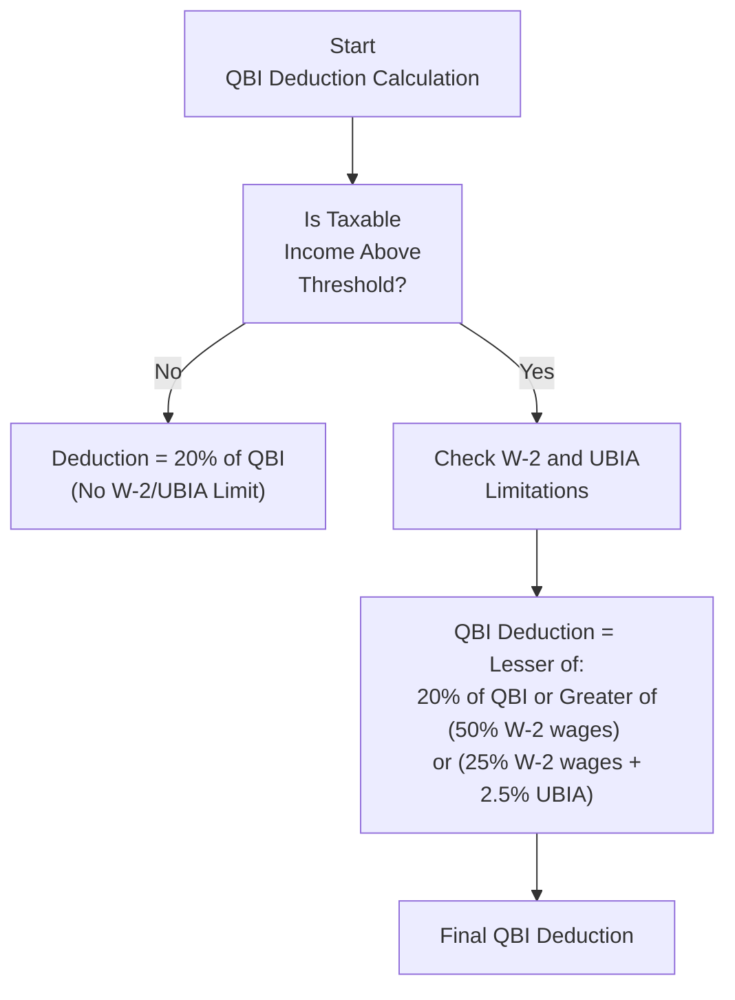

## 15.4 Qualified Business Income Deduction (QBI)

The Qualified Business Income (QBI) deduction—introduced by the Tax Cuts and Jobs Act (TCJA)—allows eligible taxpayers to deduct up to 20% of their qualified business income from sole proprietorships, partnerships, S corporations, and certain trusts and estates. This deduction can be a powerful tax incentive, but it is accompanied by a set of complex rules related to taxable income thresholds, specified service trades or businesses (SSTBs), W-2 wage limitations, and the unadjusted basis immediately after acquisition (UBIA) of qualified property. This section provides a comprehensive discussion of the QBI deduction, guiding CPA candidates in the calculation and application of these rules.

### Overview and Purpose

The QBI deduction emerged as a mechanism to approximate the tax rate reductions given to corporations by lowering the effective tax rate on certain pass-through entities. Designed to encourage small business growth, the deduction offers significant benefits to individuals with domestic qualified business income. However, tight qualifications and phased-out limitations ensure the deduction is granted only where intended and not exploited for unintended tax avoidance.

### Defining Qualified Business Income

QBI generally includes the net amount of income, gain, deduction, and loss from a domestic trade or business. It excludes:
• W-2 wages earned as an employee.  
• Reasonable compensation paid to the taxpayer by any S corporation in which they are a shareholder.  
• Guaranteed payments made to a partner for services.  
• Certain investment-related items such as capital gains or losses, dividend income, and interest income (other than when interest income relates directly to a business activity).  
• Foreign-sourced income.  

It is crucial to understand that the definition of QBI applies on a business-by-business basis, and losses from one qualified business may offset income from another qualified business in the same tax year.

### General Calculation Steps

At a high-level, the QBI deduction is the lesser of:  
• 20% of QBI from all eligible trades or businesses (aggregated), or  
• 20% of the excess of the taxpayer’s taxable income over net capital gain.

Beyond this general rule, additional limitations come into play once taxable income surpasses specified thresholds. The deduction for QBI generally can be expressed by the formula:  

\text{QBI Deduction} = \min \Bigl( 0.20 \times \text{QBI},\ 0.20 \times (\text{Taxable Income} - \text{Net Capital Gain})\Bigr).


However, this simplified calculation does not fully capture limitations that arise at higher income levels, particularly for SSTBs and businesses subject to W-2 wage and UBIA restrictions.

### Thresholds and Phase-Ins

Whether the deduction is restricted by the W-2 wage and UBIA limitations—and whether the business is considered a Specified Service Trade or Business—depends on the taxpayer’s taxable income. The critical thresholds (adjusted annually for inflation) which commonly appear in exam scenarios are:

• If taxable income (before the QBI deduction) is below a certain lower threshold, the taxpayer typically qualifies for the full 20% QBI deduction, regardless of W-2 wages or UBIA.  
• If taxable income is above an upper threshold, specified service trade or business income is phased out of eligibility, and businesses face the additional W-2 wage and UBIA limitations.  
• If taxable income is between the lower and upper thresholds—the “phase-in” range—partial or proportional limitations may apply.

While exact threshold amounts are periodically adjusted, CPA candidates should be comfortable performing calculations under each threshold scenario to determine the final QBI deduction.

### Specified Service Trade or Business (SSTB)

An SSTB is a trade or business involving the performance of services in fields such as health, law, consulting, athletics, financial services, brokerage services, or any trade or business where the principal asset is the reputation or skill of one or more of its employees or owners. The concept of an SSTB is vital because:  
• If the taxpayer's taxable income (before QBI) is below the lower threshold, even SSTB income qualifies for the deduction.  
• If taxable income exceeds the upper threshold, the deduction is disallowed entirely for SSTB income.  
• If taxable income is within the phase-in range, only a partial portion of the SSTB income is eligible.

This classification often requires nuanced analysis. For instance, a consulting firm generating revenue primarily from advice and expertise will be considered an SSTB. However, if the same firm sells products or licenses software as part of its operations, some portion of revenue could be allocated to non-SSTB activities, potentially allowing a partial QBI deduction. Proper record-keeping and an accurate breakdown of the business’s income streams are essential.

### W-2 Wages and the UBIA Limitation

When a taxpayer’s income exceeds the lower threshold, the QBI deduction is limited to the greater of:

1. 50% of W-2 wages paid by the qualified trade or business, OR  
2. 25% of W-2 wages paid by the qualified trade or business + 2.5% of the UBIA of all qualified property.

This limitation restricts high-income taxpayers from taking a full 20% deduction if their businesses do not employ workers or hold sufficient “qualified property.”

#### W-2 Wages Definition

W-2 wages comprise the total wages, tips, and other compensation paid by the trade or business to employees, plus any elective deferrals reported on Forms W-2. They do not include payments to independent contractors or guaranteed payments to partners. The phrase “paid by the qualified trade or business” is important: wages must be connected to the specific entity generating the QBI.

#### Unadjusted Basis Immediately After Acquisition (UBIA)

UBIA refers to the original cost basis of qualified property—generally tangible property subject to depreciation held by the business. Qualified property must be used in the production of QBI during the tax year and be within its depreciable period. The depreciable period is the later of:
• 10 years from the original placed-in-service date, or  
• the last day of the last full year in the asset’s regular depreciable life.  

UBIA includes purchase price but is not reduced by accumulated depreciation. Therefore, if high-value machinery or real estate is purchased and placed in service, that property’s entire initial cost basis counts toward the UBIA figure for up to 10 years (or the standard depreciation period, if longer).

### Diagram of Wage and UBIA Limit Interplay

Below is a simplified Mermaid diagram illustrating how the W-2 wage and UBIA limitation interacts once a taxpayer’s taxable income surpasses the threshold. This diagram is not exhaustive but highlights the major decision points for applying the limitation.

### Practical Example: Sole Proprietorship Above Threshold

Consider a taxpayer who operates a sole proprietorship and has taxable income above the threshold. Assume:

• QBI = $200,000.  
• W-2 wages paid by the business = $50,000.  
• UBIA of qualified property = $100,000.  
• The taxpayer has no net capital gains, so the alternative limit of 20% of (taxable income – net capital gains) does not further reduce the deduction.  

Step-by-step:  
1. The tentative 20% QBI deduction is 0.20 × $200,000 = $40,000.  
2. Calculate 50% of W-2 wages: 0.50 × $50,000 = $25,000.  
3. Calculate 25% of W-2 wages + 2.5% of UBIA: (0.25 × $50,000) + (0.025 × $100,000) = $12,500 + $2,500 = $15,000.  
4. The W-2 wage/UBIA limit is the greater of $25,000 or $15,000, i.e., $25,000.  
5. The final deduction is limited to the lesser of $40,000 and $25,000, or $25,000.

Hence, the QBI deduction is $25,000.

### Separating Multiple Businesses

When a taxpayer owns multiple businesses, each entity’s QBI, W-2 wages, and UBIA must typically be accounted for separately. The Treasury regulations allow for certain businesses to be aggregated if they meet specific ownership and commercial requirements. Aggregation can be advantageous when one business has substantial W-2 wages and another business has high QBI but limited W-2 wages, effectively increasing the overall QBI deduction. However, aggregation introduces added complexity and must be approached carefully.

### SSTBs Above Threshold: Partial Deduction

When an SSTB’s owner’s taxable income exceeds the upper threshold, no QBI deduction is allowed for income generated by that SSTB. However, where taxable income is within the phase-in range, only a certain portion of that income may be considered in QBI calculations. Specifically, tests are performed to phase out some or all of the deduction. The partial deduction may be computed by proportionally reducing the QBI, W-2 wages, and UBIA allocations from the SSTB based on the taxpayer’s excess of taxable income over the threshold.

### Special Considerations and Pitfalls

• Reasonable Compensation in S Corporations: The S corporation owner-employee must be paid reasonable compensation, reducing QBI. Overstating QBI by not paying sufficient wages can trigger an IRS challenge.  
• Guaranteed Payments in Partnerships: Guaranteed payments to partners do not count as QBI, so the business’s books must correctly reflect these allocations.  
• Changes in Taxable Income from Year to Year: If a taxpayer’s income fluctuates across thresholds, the QBI deduction rules may shift dramatically from year to year.  
• Asset Dispositions and UBIA: Selling key business assets or reconfiguring the long-term structure can change UBIA, affecting the W-2 wage/UBIA limit.  
• Deduction Interaction: The QBI deduction also interacts with other deductions and credits, such as the Self-Employment Tax deduction, which can alter taxable income and push the taxpayer above or below thresholds.

### Best Practices for QBI Deduction

• Maintain Detailed Records: Documentation of business income, wages, guaranteed payments, and basis in assets is critical.  
• Plan for Year-End: Strategic decisions, such as accelerating or deferring income or wages, and adjusting property acquisitions to optimize UBIA, can support better QBI outcomes.  
• Consider Aggregation if Eligible: Combining multiple businesses can amplify the deduction if the proper regulatory conditions are met.  
• Review SSTB Definitions: Precisely determining whether a business falls under an SSTB category often requires professional judgment and careful reading of regulations.  
• Revisit Taxable Income Planning: Since QBI deduction constraints are closely linked to taxable income, planning strategies that reduce taxable income to remain below thresholds can significantly increase the allowed deduction.

### Example of UBIA Significance

Suppose a high-income taxpayer actively invests in a manufacturing business that has limited W-2 wages ($20,000) but a large portion of real estate, machinery, and equipment. The UBIA for qualified property is $2,000,000. In the presence of the W-2 limit:

• 50% of W-2 wages = $10,000.  
• 25% of W-2 wages + 2.5% of UBIA = ($5,000) + ($50,000) = $55,000.  
• The second figure (25% of wages + 2.5% UBIA) is the greater of the two, so $55,000 effectively becomes the W-2/UBIA limit.  

In this scenario, a robust inventory of qualified property significantly enhances the potential QBI deduction. This underscores the importance of including UBIA in overall tax planning when a taxpayer’s income is above the threshold.

### Further Guidance and References

• IRS Publication 535 details business expenses and includes guidance on the deduction for qualified business income.  
• Section 199A of the Internal Revenue Code codifies the legislative underpinnings of QBI.  
• Treasury Regulations §§1.199A-0 through 1.199A-6 provide interpretive rules and examples.  
• Annual inflation-adjusted thresholds are typically announced by the IRS toward the end of the calendar year for use in the following tax year.

### Conclusion

Mastering the QBI deduction requires a robust understanding of thresholds, specified service trade or business classifications, and the interplay of W-2 wages and UBIA. For CPA candidates, QBI deduction questions test not only computational ability but also conceptual clarity regarding how different elements interact and phase in or out based on taxable income. By carefully analyzing each taxpayer’s circumstances—income level, nature of the business, payroll, and use of qualified property—professionals can maximize the deduction while maintaining compliance. This holistic planning approach is fundamental in providing accurate tax advice and leveraging the deduction’s full benefit.

Below is a comprehensive quiz to help reinforce your understanding of the QBI deduction.

--------------------------------------------------------------------------------

## Qualified Business Income Deduction Mastery Quiz



### In general, what is the maximum percentage that can be deducted from Qualified Business Income (QBI)?  
- [x] 20%  
- [ ] 25%  
- [ ] 15%  
- [ ] 10%  

> **Explanation:** The QBI deduction is generally limited to 20% of qualified business income, subject to additional W-2 wage and UBIA limits for higher incomes.

### Which of the following is excluded from QBI?  
- [x] Guaranteed payments made to a partner  
- [ ] Pass-through income from an LLC taxed as a sole proprietorship  
- [ ] Ordinary business income from an S corporation  
- [ ] Amounts paid to acquire new equipment  

> **Explanation:** Guaranteed payments to a partner do not qualify for the QBI deduction. Items like ordinary business income from an S corporation and pass-through income from an LLC are typically included, subject to all relevant rules.

### Why is the unadjusted basis immediately after acquisition (UBIA) important for the QBI deduction?  
- [x] It factors into the calculation limiting the deduction for higher-income taxpayers.  
- [ ] It replaces the need to consider W-2 wages.  
- [ ] It includes accumulated depreciation.  
- [ ] It is only relevant for specified service trades and businesses (SSTBs).  

> **Explanation:** UBIA is used in the second prong of the wage limit, where the QBI deduction at higher incomes is limited to the greater of (50% of W-2 wages) or (25% of W-2 wages + 2.5% of UBIA). It does not replace W-2 wages, and it is not exclusively for SSTBs.

### Which taxpayer is fully disqualified from taking the QBI deduction for an SSTB?  
- [x] A taxpayer whose taxable income exceeds the upper threshold for the year  
- [ ] A taxpayer whose total income is below the lower threshold  
- [ ] A taxpayer who uses a fiscal year as opposed to a calendar year  
- [ ] A taxpayer engaged in a non-service business producing the same gross revenue  

> **Explanation:** If taxable income for the year fully exceeds the threshold, no portion of the SSTB’s income is allowed for the QBI deduction. Below the threshold, the SSTB’s income remains eligible.

### Under the W-2 wage and UBIA limit, which of the following computations accurately represents one limitation option?  
- [x] 25% of W-2 wages plus 2.5% of the UBIA of qualified property  
- [ ] 10% of W-2 wages minus 5% of the UBIA of qualified property  
- [x] 50% of W-2 wages alone  
- [ ] 40% of W-2 wages  

> **Explanation:** At higher income levels, the deduction is limited by the greater of 50% of W-2 wages or 25% of W-2 wages plus 2.5% of UBIA. The other figures are incorrect or do not appear in Section 199A deduction calculations.

### When calculating taxable income for threshold comparisons, which of the following amounts is subtracted from adjusted gross income (AGI)?  
- [x] Standard or itemized deductions  
- [ ] QBI deduction itself  
- [ ] Net capital gains  
- [ ] Non-deductible personal living expenses  

> **Explanation:** Taxable income is AGI minus either standard or itemized deductions (and any other above-the-line or below-the-line deductions). The QBI deduction is subtracted at a later stage and is not part of the initial taxable income calculation to determine threshold application.

### An individual with $400,000 of taxable income (before QBI), $100,000 of QBI, $30,000 of W-2 wages, and $0 UBIA has which approximate limitation for the QBI component?  
- [x] 50% of W-2 wages, or $15,000  
- [ ] 25% of W-2 wages plus 2.5% of UBIA  
- [x] 20% of $100,000, or $20,000 if it is lower than any relevant limit  
- [ ] No limit applies because of the high W-2 wage amount  

> **Explanation:** With taxable income over the threshold and no UBIA, the wage limit is the greater of (50% of $30,000 = $15,000) or (25% of $30,000 + 2.5% of $0 = $7,500). The potential QBI deduction of $20,000 is compared with $15,000 (the wage/UBIA limit), and the lesser amount is ultimately allowed.

### For a partnership, which of the following is considered QBI if all other conditions are met?  
- [x] Allocations of the partnership’s trade or business income  
- [ ] Guaranteed payments made to a partner  
- [x] Nonpassive, ordinary operating income from the partnership  
- [ ] Dividend income passed through from the partnership’s stock investments  

> **Explanation:** Partnership trade or business income is generally QBI, while guaranteed payments and certain investment income are excluded.

### Which of these strategies might a high-income taxpayer use to optimize the QBI deduction?  
- [x] Increase compensation for S corporation owners to reduce QBI artificially  
- [ ] Shift from an S corporation to a C corporation to capture more QBI  
- [x] Acquire additional depreciable property to increase the UBIA component  
- [ ] Pay guaranteed payments to partners instead of paying wages  

> **Explanation:** Acquiring more qualified property can increase the 2.5% UBIA factor, leading to a potentially higher wage/UBIA threshold. Paying S corporation owners higher “reasonable” wages can reduce QBI, but that can be favorable if it ensures compliance and avoids the risk of reclassification by the IRS. Shifting to a C corporation does not necessarily optimize QBI, and guaranteed payments are excluded from QBI.

### A taxpayer's partnership is an SSTB. The taxpayer’s taxable income is between the lower and upper threshold. Which statement is correct regarding the QBI deduction?  
- [x] A partial deduction is allowed based on phase-in calculations  
- [ ] The SSTB income is fully disqualified  
- [ ] The full 20% deduction applies with no W-2 or UBIA limitation  
- [ ] The 25%-of-wages formula can never apply  

> **Explanation:** An SSTB within the phase-in range is subject to a partial deduction. The portion of income subject to the deduction is proportionately reduced as the taxpayer’s taxable income climbs within the phase-in threshold.  



--------------------------------------------------------------------------------

## For Additional Practice and Deeper Preparation

### [Taxation & Regulation (REG) CPA Mock Exams](https://www.udemy.com/course/reg-cpa-mock-exams/?referralCode=55419EBD198F61530B12)

Taxation & Regulation (REG) CPA Mocks: 6 Full (1,500 Qs), Harder Than Real! In-Depth & Clear. Crush With Confidence!

• Tackle full-length mock exams designed to mirror real REG questions.  
• Refine your exam-day strategies with detailed, step-by-step solutions for every scenario.  
• Explore in-depth rationales that reinforce higher-level concepts, giving you an edge on test day.  
• Boost confidence and minimize anxiety by mastering every corner of the REG blueprint.  
• Perfect for those seeking exceptionally hard mocks and real-world readiness.

_Disclaimer: This course is not endorsed by or affiliated with the AICPA, NASBA, or any official CPA Examination authority. All content is for educational and preparatory purposes only._
