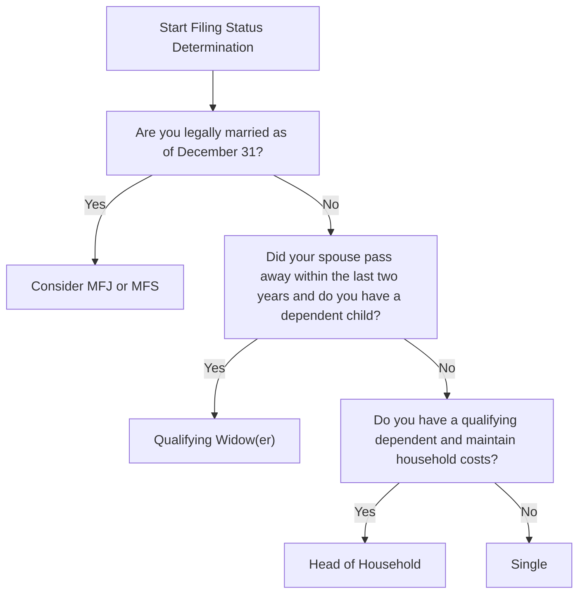
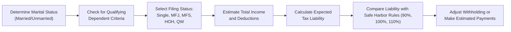

## 15.5 Filing Status and Estimated Tax Payments

Filing status and estimated tax payments are central aspects of individual taxation. Choosing the correct filing status determines your tax rates, deductions, and overall tax liability, while estimated tax payments help you avoid underpayment penalties if you do not have enough withholding. In this section, we examine each filing status option in detail—highlighting key differences between Single, Married Filing Jointly (MFJ), Married Filing Separately (MFS), Head of Household (HOH), and Qualifying Widow(er)—and explore how taxpayers can leverage safe harbors and timing strategies to ensure compliance with estimated tax requirements.

--------------------------------------------------------------------------------
## Introduction to Filing Status

For individual taxpayers, filing status functions as the cornerstone of the federal tax return. It influences the applicable tax rates, standard or itemized deductions, eligibility for credits, and other critical factors. Understanding each filing status involves recognizing certain thresholds and marriage determinations, meeting specific qualifiers concerning dependents, and following relevant IRS guidelines for separated or widowed individuals.

In general, individuals must determine their filing status as of the last day of the tax year (December 31 for calendar-year taxpayers). If an individual is married or single on that date, they are generally treated as such for the entire year. However, multiple nuances can impact the ultimate selection, especially when children or dependents are involved.

--------------------------------------------------------------------------------
## Overview of Key Filing Statuses

Several filing statuses are available to taxpayers:

1. Single (S)
2. Married Filing Jointly (MFJ)
3. Married Filing Separately (MFS)
4. Head of Household (HOH)
5. Qualifying Widow(er) with dependent child (QW)

**Single** status is typically for unmarried individuals who do not qualify for another status.  
**Married Filing Jointly (MFJ)** is often chosen by married couples for maximum tax benefits, though there may be exceptions when MFS is preferable.  
**Married Filing Separately (MFS)** is sometimes required or beneficial when spouses have significantly different incomes or potential liability issues.  
**Head of Household (HOH)** applies to unmarried individuals maintaining a household for certain qualifying persons.  
**Qualifying Widow(er)** status offers continued tax benefits for up to two years after a spouse’s death if certain requirements are met.

### Filing Status Determination Flow

Below is a simplified Mermaid diagram showing how certain key questions can influence your filing status determination. This flow is not exhaustive but highlights some common decision points related to Single, MFJ, MFS, and HOH.

--------------------------------------------------------------------------------
## Single Filing Status

### Basic Qualifications
- Taxpayer is unmarried (or legally separated) as of December 31.  
- Does not qualify for HOH or Qualifying Widow(er).

### Tax Implications
- Single filers typically have narrower tax brackets than MFJ or HOH.  
- The standard deduction is smaller than MFJ or HOH but is appropriate if you do not support dependents.

### Example Scenario
Maria, age 26, is not married and rents a small apartment by herself. She does not support any family members. Maria is generally considered Single for tax purposes and would use Single tax rates and the Single standard deduction.

--------------------------------------------------------------------------------
## Married Filing Jointly (MFJ)

### Basic Qualifications
- A legally married couple as of the last day of the tax year.
- Both spouses must agree to file a joint return.

### Tax Implications
- Typically the greatest overall tax benefit compared to MFS.  
- Spouses combine income and deductions.  
- Both spouses are jointly and severally liable for the tax liability, including any penalties or interest.

### Example Scenario
John and Emily married in June. Despite only being married for half the year, they can still file MFJ if they remain legally married as of December 31. Combined income, higher deduction amounts, and beneficial phase-out thresholds generally yield a lower tax liability. However, they should consider the joint-and-several liability implications.

--------------------------------------------------------------------------------
## Married Filing Separately (MFS)

### Basic Qualifications
- You are married but elect not to file a joint return.  
- Often used if one spouse prefers to keep liability separate or if one spouse has significant medical expenses that can be better deducted at a lower adjusted gross income (AGI).

### Tax Implications
- Less favorable tax brackets and phaseout thresholds.  
- Eliminates certain deductions and credits (e.g., Earned Income Tax Credit is disallowed when MFS).  
- May be prudent in cases of concern over marital debt, complex finances, or distinct liability exposures.

### Example Scenario
Steven and Lisa are married but have complicated financial arrangements. Steven is self-employed with high potential liability, while Lisa has minimal income. Their combined AGI on a joint return may trigger higher tax rates and threaten some credits. After careful analysis, they consider MFS to keep Steven’s liability separate from Lisa’s unaffected finances. However, they lose some beneficial credits normally allowed under MFJ.

--------------------------------------------------------------------------------
## Head of Household (HOH)

Head of Household is a valuable status for unmarried taxpayers who are maintaining a home for a qualifying person. HOH offers a more expansive tax bracket and a larger standard deduction than Single status.

### Basic Qualifications
1. The taxpayer is unmarried (or considered unmarried) on the last day of the tax year.  
2. The taxpayer paid more than half the cost of keeping up a home for the year.  
3. A qualifying person (e.g., child or another dependent) lived with the taxpayer in that home for more than half the year, with certain exceptions for temporary absences.  

### Tax Implications
- More favorable tax brackets and standard deduction than filing Single.  
- A better reflection of actual family support if you are the primary caretaker.

### Example Scenario
Julia, who is legally separated from her spouse, has primary custody of their daughter Lily, age 8. Lily lives with Julia year-round, and Julia pays more than half of the household expenses. Because Julia is unmarried and provides the primary support, she can claim HOH status, enjoying broader tax brackets and a higher standard deduction compared to filing as Single.

--------------------------------------------------------------------------------
## Qualifying Widow(er) with Dependent Child

### Basic Qualifications
- Your spouse died in either of the two years preceding the current tax year.  
- You have a child or stepchild (not foster) who can be claimed as your dependent.  
- You have not remarried.  
- You paid more than half the cost of keeping up a household for the year.

### Tax Implications
- The taxpayer uses essentially the same tax rates and standard deduction as MFJ for up to two years following the spouse’s death (if eligibility is met).  
- Offers transitional benefits, reflecting a continuing need for family support.

--------------------------------------------------------------------------------
## Overview of Estimated Tax Payments

Estimated tax payments are periodic prepayments of tax due on income that isn’t subject to adequate withholding—such as self-employment earnings, dividends, interest, capital gains, rental income, or other non-wage sources. If you do not pay enough tax in these areas throughout the year, you could be subject to underpayment penalties when you file your return.

### When Are Estimated Payments Required?

Generally, you must make estimated tax payments if both these conditions apply:
1. You expect to owe at least \$1,000 in tax after withholding and credits.  
2. You expect your withholding and credits to be less than the smaller of:  
   - (a) 90% of the tax you owe for the current year,  
   - (b) 100% of the prior year’s tax (110% if your adjusted gross income was above \$150,000 or \$75,000 if MFS).

### Payment Deadlines
Estimated taxes are typically paid in four installments during the year. For calendar-year taxpayers, these are usually:
- April 15 (Q1)  
- June 15 (Q2)  
- September 15 (Q3)  
- January 15 of the following year (Q4)

If any due date falls on a weekend or legal holiday, the deadline is generally extended to the next business day.

--------------------------------------------------------------------------------
## Safe Harbor Rules

To avoid underpayment penalties, even if you substantially underpay in a given quarter, you can rely on “safe harbors.”  

1. **Prior-Year Safe Harbor:** If you pay throughout the year an amount equal to 100% of last year’s tax liability (110% if prior-year AGI exceeded \$150,000, or \$75,000 for MFS), you typically escape underpayment penalties.  
2. **Current-Year Safe Harbor:** If your total payments and withholding cover at least 90% of your current-year liability throughout the year, you are also generally safe from penalties.  

These safe harbors protect taxpayers whose income is irregular or unpredictable, or for those who prefer a straightforward method such as matching prior-year liability.

--------------------------------------------------------------------------------
## Strategy for Avoiding Underpayment Penalties

1. **Monitor Quarterly Income**: Especially if you have self-employment or gig income, track your earnings over each quarter to adjust or make catch-up payments.  
2. **Adjust Withholding**: If you have a W-2 job, you can opt to withhold additional amounts from your paycheck—using Form W-4—to cover non-wage income.  
3. **Use IRS Form 2210**: If you have special circumstances—like large gains in one quarter—you might annualize income to show that an underpayment did not occur.  
4. **Record-Keeping:** Keep meticulous records of your payments, income, and expenses to accurately project tax liability.

--------------------------------------------------------------------------------
## Illustrative Example: Tailoring Estimated Payments

David, a single software developer, earned \$110,000 in wages and \$25,000 in freelance income in the prior year. His employer withheld taxes based on a W-4 that accounted for wages only. To avoid an underpayment penalty for his freelance income, David calculates his total self-employed net earnings and determines his prior-year tax liability was \$30,000. Since his AGI was over \$150,000, he is required to pay 110% of that amount — i.e., \$33,000 — to remain under the prior-year safe harbor. Because David’s withholding is around \$25,000, he might make estimated quarterly payments totaling \$8,000 (\$2,000 each quarter) or some alternative distribution of \$8,000 over the four installments. He can also make catch-up payments if the first quarter was underpaid.

--------------------------------------------------------------------------------
## Using Head of Household vs. Single with Estimated Tax Payments

Choosing the correct filing status is critical in calculating total liability and subsequent estimated payments:

- **Head of Household** taxpayers often benefit from lower effective tax rates, possibly reducing the amount needed for each estimated payment.  
- **Single** taxpayers may owe higher effective rates, thus potentially requiring higher estimated payments to meet the 90% or 100/110% safe harbor thresholds.

Regardless of the better bracket or standard deduction, approximate your total liability each quarter by factoring your wages (withholding) and commodity or interest income. Then compare the sum of your withholdings and estimated payments to your safe harbor targets.

--------------------------------------------------------------------------------
## Common Pitfalls and Best Practices

1. **Incorrect Filing Status**: Some taxpayers incorrectly file as Single instead of Head of Household, missing out on a lower tax rate and a higher standard deduction. Always verify you meet the requirements for paying more than half the household expenses and that a qualifying person lives with you.  
2. **Late Estimated Tax Payments**: Failing to pay by each quarterly deadline could lead to underpayment penalties.  
3. **Underestimating Self-Employment Income**: If you do not anticipate side-gig growth or investment capital gains, you might end up underpaying. Use conservative estimates, or rely on the prior-year safe harbor.  
4. **Pass-Through Income Surprises**: If you receive K-1 income from a partnership or S corporation, ensure you incorporate that into your estimates.  
5. **Forgetting the 110% Rule**: Higher-income individuals must pay 110% of the prior-year liability to avoid penalties, not 100%. This is a source of confusion and penalty issues.  

--------------------------------------------------------------------------------
## Real-World Scenario: Switching from MFJ to HOH

Alexander and Kayla recently separated in May but are not yet divorced. Kayla moved out and took custody of their son, Jack. Kayla now pays most household expenses in a separate residence. By December 31, Kayla remains legally married but qualifies as “considered unmarried” because she pays more than half the household costs, and Jack is her dependent. She can file as HOH. Meanwhile, Alexander has no dependents living with him, so he could file as Married Filing Separately or Single if the separation meets all legal requirements for being considered unmarried in the relevant state. This decision will alter their estimated tax calculations going into the next year if either of them experiences changes in withholdings or other income streams.

--------------------------------------------------------------------------------
## Practical Tips for Filing Status Decision-Making

• **Re-evaluating after life events**:
  - Marriage
  - Divorce
  - Childbirth or adoption
  - Passing of a spouse

• **Using an estimated tax worksheet**:
  - Many taxpayers run a “test return” mid-year or use Form 1040-ES to anticipate potential liability.

• **Splitting or merging finances**:
  - Weigh the pros and cons of MFS vs. MFJ each year.  
  - Evaluate HOH possibility if separation occurs and you meet child or dependent criteria.

--------------------------------------------------------------------------------
## Combined Visual: Status & Estimated Payments

The following Mermaid diagram aims to illustrate the interconnected steps of deciding on your filing status and evaluating estimated payments for safe harbor compliance.

--------------------------------------------------------------------------------
## Conclusion

Filing status choices and estimated tax obligations are closely related. Selecting the correct filing status can significantly impact your tax rates, deductions, and credits, while proactively managing estimated payments ensures you meet your tax obligations without incurring penalties. A solid understanding of Head of Household, Single, or Married statuses—along with knowledge of the safe harbor thresholds—empowers you to reduce your tax liability exposure and plan effectively.

Learning to integrate filing status and estimated payment strategies is not only vital for exam preparation but also essential for providing value to clients or managing your own finances. By carefully determining the right status and leveraging estimated tax best practices, you ensure compliance while taking advantage of every tax break available.

--------------------------------------------------------------------------------

## Test Your Knowledge: Filing Status & Estimated Tax Payments



### Who qualifies as "Single" for tax filing purposes?

- [x] Someone who is unmarried as of December 31 and does not qualify for HOH or QW
- [ ] Someone who is widowed and has a dependent
- [ ] Someone who is married with dependent children
- [ ] Someone who files an extension

> **Explanation:** “Single” filing status applies to taxpayers who are unmarried (or legally separated) at year-end and do not meet the criteria for Head of Household or Qualifying Widow(er).

### What is one major advantage of Head of Household filing status over Single?

- [x] A larger standard deduction and more favorable tax brackets
- [ ] Access to the same tax rates as Married Filing Jointly
- [ ] Exemption from estimated tax payments
- [ ] Requirement to be married on December 31

> **Explanation:** HOH generally provides a higher standard deduction and lower marginal tax rates than Single. It is specifically for those who pay more than half the costs of maintaining a home for a qualifying person.

### Under what condition is the 110% rule of the prior year’s liability used to avoid underpayment penalties?

- [ ] If your AGI in the current year exceeds $20,000
- [x] If your AGI in the prior year exceeded $150,000 ($75,000 if MFS)
- [ ] If you had a capital gain over $10,000 in the current year
- [ ] If you anticipate no tax liability for the next year

> **Explanation:** When the taxpayer’s prior-year AGI exceeds $150,000 ($75,000 for MFS), they must pay 110% of the prior year’s tax liability to be safe from underpayment penalties, rather than 100%.

### When might a taxpayer prefer to file Married Filing Separately instead of Married Filing Jointly?

- [x] When significant liability or debt issues exist for one spouse
- [ ] When both spouses want to claim the same dependents
- [ ] When they want to qualify for the Education Credits
- [ ] When they have high mortgage interest

> **Explanation:** MFS may be used if one spouse has complex liability issues or significantly different incomes, making it beneficial to keep liabilities separate, though it often results in a less favorable tax rate than MFJ.

### Which filing status allows a taxpayer a potential continuation of MFJ rates for two years after a spouse’s death?

- [ ] Single
- [ ] Head of Household
- [ ] Married Filing Separately
- [x] Qualifying Widow(er)

> **Explanation:** Qualifying Widow(er) status offers the benefits of roughly the same tax rates and standard deduction as MFJ for up to two years following the death of the spouse, provided the taxpayer meets specific requirements.

### What is the standard threshold requiring a taxpayer to make estimated payments?

- [x] Owing at least $1,000 in tax after withholdings and credits
- [ ] Earning $10,000 in self-employment income
- [ ] Having wages of $50,000
- [ ] Filing Head of Household for over 10 years

> **Explanation:** If a taxpayer expects to owe $1,000 or more after withholding and credits, they are typically required to make estimated tax payments to avoid penalty exposure.

### Which of the following is not considered a safe harbor for estimated tax?

- [ ] Paying at least 90% of current year tax
- [ ] Paying 100% (or 110%) of prior year’s tax
- [x] Paying the exact tax liability from two years prior
- [ ] Withholding enough from wages to cover your non-wage income liability

> **Explanation:** The safe harbor focuses on 90% of current year or 100/110% of prior year’s liability. Two-year-old tax data is not a recognized safe harbor.

### How can a taxpayer avoid underpayment penalties if income fluctuates significantly across quarters?

- [ ] Request a tax transcript from the IRS each month
- [x] Annualize income using Form 2210 and make appropriate estimated payments
- [ ] File MFS regardless of marital status
- [ ] Pay the entire amount in the first quarter

> **Explanation:** When income is uneven, taxpayers can use the annualized income installment method on Form 2210 to distribute their estimated tax liability more accurately across quarters, potentially reducing or eliminating penalties.

### A key reason some taxpayers erroneously file Single instead of Head of Household is:

- [ ] Single has higher standard deductions
- [x] They do not realize they meet the requirement to support a qualifying person
- [ ] Only Single filers can claim child tax credits
- [ ] HOH is only available to those with two or more children

> **Explanation:** Taxpayers sometimes overlook that they provide more than half the household support for a qualifying person (child or elder), thus missing out on HOH status.

### Head of Household requires paying more than half the cost of maintaining a home for a qualifying person. True or False?

- [x] True
- [ ] False

> **Explanation:** The HOH filer must pay over 50% of the cost of keeping up the household in which a qualifying person resides for the appropriate time period.



--------------------------------------------------------------------------------

## For Additional Practice and Deeper Preparation

### [Taxation & Regulation (REG) CPA Mock Exams](https://www.udemy.com/course/reg-cpa-mock-exams/?referralCode=55419EBD198F61530B12)

Taxation & Regulation (REG) CPA Mocks: 6 Full (1,500 Qs), Harder Than Real! In-Depth & Clear. Crush With Confidence!

- Tackle full-length mock exams designed to mirror real REG questions.  
- Refine your exam-day strategies with detailed, step-by-step solutions for every scenario.  
- Explore in-depth rationales that reinforce higher-level concepts, giving you an edge on test day.  
- Boost confidence and minimize anxiety by mastering every corner of the REG blueprint.  
- Perfect for those seeking exceptionally hard mocks and real-world readiness.  

_Disclaimer: This course is not endorsed by or affiliated with the AICPA, NASBA, or any official CPA Examination authority. All content is for educational and preparatory purposes only._
