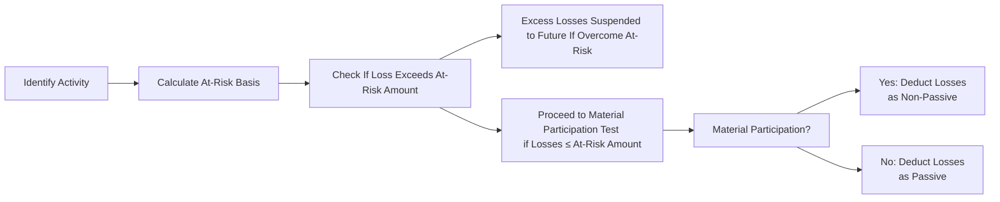

## 16.1 At-Risk Rules and Material vs. Non-Material Participation

The Internal Revenue Code (IRC) requires taxpayers to navigate a variety of limitations on their deductible losses, particularly in connection with business ventures, real estate investments, and pass-through entities such as partnerships and S corporations. Among the most important limitations are:

1) The at-risk rules (IRC § 465), which limit loss deductions to the amount of a taxpayer’s economic exposure or “investment” in the activity.  
2) The passive activity rules (IRC § 469), which incorporate rules around material and non-material participation, dictating whether losses can offset active or portfolio income.

This section describes how the at-risk basis is determined in different types of activities and entities, followed by a discussion of material versus non-material participation—an essential distinction affecting whether the passive activity rules will further limit deductible losses.

--------------------------------------------------------------------------------
### Understanding the At-Risk Rules

The at-risk rules were enacted to prevent taxpayers from deducting more losses than their true economic investment in an activity or venture. Under these rules:

• A taxpayer’s deductible loss from a given activity in any tax year is limited to the taxpayer’s “at-risk amount” in that activity at the close of the taxable year.  
• If losses from the activity exceed the at-risk amount, those excess losses are suspended and carried forward to future years.  
• The taxpayer can deduct the suspended losses in subsequent years to the extent the at-risk amount increases (for example, by additional capital contributions or reinvestment of profits).

#### Key Provisions of IRC § 465

The core objective of the at-risk rules is to ensure that a taxpayer has something genuinely “at stake” before taking advantage of tax benefits. In practice, the rules target certain types of arrangements—often referred to as “tax shelters”—where limited partnerships and other structures historically allowed losses that exceeded an individual’s real economic investment.

--------------------------------------------------------------------------------
### Computing the At-Risk Basis

To determine the losses that a taxpayer can claim, it is crucial to understand how to calculate the “at-risk amount” or “at-risk basis.” The at-risk basis typically consists of:

1. Money and other property contributed to the activity.  
2. Amounts borrowed for use in the activity if the shareholder/partner is personally liable or has pledged property not used in the activity as security (i.e., recourse debt).  
3. Allocable share of certain qualified nonrecourse debt in the case of real estate activities (for example, nonrecourse financing secured by real property).

Below is a simplified conceptual outline of how at-risk basis is computed:

1. Begin with the taxpayer’s net equity contributions to the activity (cash plus the basis of property contributed).  
2. Add any recourse debts for which the taxpayer is personally liable.  
3. Add certain nonrecourse debts (in real property activities) if specifically allowed by law.  
4. Subtract any prior-year losses already deducted.  
5. Subtract any withdrawals or distributions taken out of the activity.  

If, after all these additions and subtractions, the at-risk amount is positive, the taxpayer can deduct current-year losses up to that amount. Any excess losses are suspended.

#### Differences Between Entities

• C Corporations: At-risk rules generally apply only to individuals, but certain closely-held C corporations also must apply them if more than 50% of the value of their stock is owned directly or indirectly by five or fewer individuals.  

• S Corporations: A shareholder’s at-risk amount in an S corporation includes the shareholder’s stock basis plus any direct loans made from the shareholder to the corporation. Unlike partnerships, a shareholder does not automatically receive at-risk basis for entity-level debts unless the shareholder is personally liable or has guaranteed the debt.  

• Partnerships: For partnerships, each partner’s at-risk basis depends on the nature of the partnership obligations. Amounts borrowed by the partnership count toward a partner’s at-risk basis only if the partner is personally liable, has pledged personal assets, or otherwise bears the economic risk of loss. Recourse vs. nonrecourse debt classification becomes especially significant here.  

--------------------------------------------------------------------------------
### Illustrative Example: Computing At-Risk Basis

Suppose Judy invests in a partnership (XYZ, LLC) that develops commercial real estate. Judy contributes USD 50,000 cash and also guarantees a USD 20,000 recourse loan from a local bank that XYZ takes out to fund the project.

• Judy’s initial at-risk basis is USD 70,000 (her USD 50,000 cash + USD 20,000 guaranteed recourse debt).  
• During the year, XYZ, LLC generates a USD 30,000 loss allocable to Judy. Because Judy’s at-risk amount is USD 70,000, she can deduct up to USD 30,000 of the loss in the current year, reducing her at-risk amount to USD 40,000 (70,000 – 30,000).  
• If the partnership passes through further losses in the future, Judy can deduct them only up to her remaining at-risk amount (USD 40,000) unless her at-risk amount increases through additional contributions or an increase in guaranteed debt.  

--------------------------------------------------------------------------------
### Recognizing Income to Restore At-Risk Basis

If suspended losses exist from a prior period, one straightforward way to free up additional at-risk capacity is for the taxpayer to recognize income from the activity or to invest more funds. Recognized income increases the partner or shareholder’s at-risk basis, thereby allowing previously suspended losses to be deducted.

However, if the taxpayer takes distributions or otherwise reduces their investment in the activity, the at-risk limit can decrease, potentially suspending additional losses.

--------------------------------------------------------------------------------
### Material vs. Non-Material Participation and the Passive Activity Rules

In addition to the at-risk rules, losses from certain business or investment activities may be limited by the passive activity rules set forth in IRC § 469. Whether an activity is passive or non-passive depends on whether the taxpayer meets the key threshold of “material participation.” In other words, having sufficient at-risk basis alone does not guarantee immediate deductibility of the losses; the taxpayer must also evaluate whether they materially participate in the activity.

#### Definition of “Material Participation”

“Material participation” broadly means the taxpayer is actively involved in the operations of the activity on a regular, continuous, and substantial basis. Under the Treasury Regulations (Treas. Reg. § 1.469-5T), there are seven tests for determining material participation. The more common ones are:

1. The individual participates in the activity for more than 500 hours during the tax year.  
2. The individual’s participation constitutes substantially all of the participation in the activity by all individuals.  
3. The individual participates more than 100 hours during the year, and no other individual participates more hours than they do.  
4. The individual materially participated in the activity in any five of the preceding 10 tax years.  
5. The individual’s facts and circumstances, considering all relevant factors, demonstrate that they participate on a regular, continuous, and substantial basis.  

If a taxpayer meets at least one of these tests, the activity is generally treated as a non-passive (active) activity, meaning losses may offset other active or portfolio income (assuming the taxpayer also has sufficient at-risk basis).

#### Classification Implications

• Material Participation (Non-Passive Activity): The taxpayer’s income or losses from the activity typically go on Schedule C (for a sole proprietor), Schedule E (for pass-through entities), or otherwise, but those losses are generally permitted to offset other income once the at-risk requirements are met.  

• Non-Material Participation (Passive Activity): If the taxpayer does not materially participate, any loss is considered passive and can only offset passive income. Excess passive losses are carried forward and may only be used to offset future passive income or recognized in full upon the disposition of the entire activity in a taxable transaction.  

--------------------------------------------------------------------------------
### Interplay Between At-Risk and Passive Activity Limitations

A common misconception is that meeting the at-risk requirement automatically allows taxpayers to claim losses. In reality:

1. At-Risk Limit Checks: First, a taxpayer must have sufficient at-risk basis to claim or absorb the losses.  
2. Passive Activity Limit Checks: Then, if the taxpayer has enough at-risk basis, the next question is whether they materially participate in the activity.  
   - If material participation is established, the losses can generally offset other non-passive income (e.g., wages or investment income), subject to any other applicable limitations.  
   - If non-material participation, losses are considered passive and may only offset passive income.  

Below is a simplified diagram that outlines this conceptual flow:

In this diagram:
• The at-risk basis check helps determine the maximum allowable loss.  
• Any loss in excess of the at-risk amount is suspended.  
• Loss not suspended then moves on to the material participation test.  
• If the taxpayer materially participates, the loss is typically considered non-passive. Otherwise, it is passive.  

--------------------------------------------------------------------------------
### Practical Examples of Material vs. Non-Material Participation

1. **Full-Time Consultant**  
   - Andrea owns a consulting LLC. She works on average 40 hours per week in her consulting practice. Andrea’s participation well exceeds 500 hours annually. She is naturally a material participant, so her net losses from the LLC, if any, could generally offset her other income, provided her at-risk basis is sufficient.

2. **Limited Real Estate Investor**  
   - Chen invests in a rental property partnership but is not involved in day-to-day management. He spends fewer than 100 hours a year dealing with the property. As a result, Chen’s participation is non-material, causing the rental property to be classified as a passive activity for him, subject to the passive loss limitations of IRC § 469. Even if Chen has enough at-risk basis, he still faces the passive activity rules, so his losses might be suspended unless he has sufficient passive income from other sources.

3. **Family Partnership**  
   - A father and daughter form a partnership to operate a small manufacturing firm. The father is actively involved in the operations (30 hours per week), while the daughter is an investor who only helps occasionally (20 hours per year). The father generally meets the material participation standard; the daughter likely does not. Therefore, any losses attributed to the father are active if his at-risk is sufficient, whereas the daughter’s losses are, by default, passive unless she meets one of the other material participation tests.

--------------------------------------------------------------------------------
### Best Practices and Planning Considerations

1. **Track Hours and Contributions**  
   - Taxpayers who wish to claim significant losses should maintain contemporaneous logs of the time they spend on the activity. This record helps substantiate material participation if challenged by the IRS.

2. **Review Equity and Debt Arrangements**  
   - Before finalizing deals, especially in partnerships and S corporations, confirm which debts qualify for at-risk basis. Taxpayers often miss out on legitimate at-risk basis for certain recourse debts or, conversely, mistakenly think nonrecourse debt adds to their at-risk basis when it doesn’t (outside of qualified real estate financing).

3. **Strategic Grouping of Activities**  
   - Under the passive activity rules, taxpayers may group certain activities together if they constitute an “appropriate economic unit.” Proper grouping can enhance the chance of meeting material participation requirements across integrated business ventures.

4. **Monitor Related-Party Transactions**  
   - If a loan arrangement is with a related party, caution is advised in counting it towards at-risk basis. The IRS may deem that the taxpayer is not truly economically at risk, depending on the circumstances.

5. **Disposition Planning**  
   - Disposing of the entire interest in a passive activity typically allows the release of any suspended passive losses. Careful planning around the disposition can help ensure those suspended losses are used effectively.

--------------------------------------------------------------------------------
### Common Pitfalls

1. **Misclassifying Nonrecourse Debt**  
   - Nonrecourse debt generally does not increase a partner’s at-risk amount unless it qualifies for the real estate exception. Taxpayers sometimes assume all partnership debts will add to their at-risk basis, which may lead to incorrect loss deductions and potential IRS adjustments.

2. **Failing to Materially Participate**  
   - Merely investing large sums or devoting minimal time is insufficient to avoid the passive activity rules. If a taxpayer does not carefully track hours or cannot demonstrate active, ongoing involvement, the IRS may reclassify the activity as passive.

3. **Neglecting to Adjust for Prior Distributions**  
   - Some taxpayers forget to reduce their at-risk basis by the distributions or withdrawals they take out of the business. Depleted at-risk basis reduces their ability to absorb future losses.

4. **Poor Documentation**  
   - Taxpayers who fail to keep proper records regarding their at-risk basis calculations, recourse vs. nonrecourse debts, or amount of annual participation risk losing deductions in an audit.

--------------------------------------------------------------------------------
### Case Study: At-Risk and Material Participation in a Manufacturing Partnership

**Situation**  
Maria and Brian launch a manufacturing business as a partnership (MB Manufacturing, LLC). Maria invests USD 90,000 of her personal savings and pledges some of her personal assets to guarantee a USD 50,000 bank loan. Meanwhile, Brian invests USD 20,000, but no personal guarantee of any loans. Both share partnership income and losses 50-50.

• Maria’s at-risk basis:  
  - Cash investment: USD 90,000  
  - Guaranteed partnership loan: USD 50,000  
  - Total initial at-risk = USD 140,000  

• Brian’s at-risk basis:  
  - Cash investment: USD 20,000  
  - No loan guarantee  
  - Total initial at-risk = USD 20,000  

**Year One**  
MB Manufacturing, LLC generates a net loss of USD 80,000, allocated equally:  
- Maria’s share: USD 40,000  
- Brian’s share: USD 40,000  

• At-Risk Limitation for Maria  
  - Before the loss, her at-risk basis was USD 140,000.  
  - She can fully deduct the USD 40,000 loss.  
  - Her remaining at-risk basis is USD 100,000 (140,000 – 40,000).  

• At-Risk Limitation for Brian  
  - His at-risk basis was USD 20,000 at the start.  
  - He can only deduct up to USD 20,000.  
  - The remaining USD 20,000 loss is suspended until Brian’s at-risk amount increases (for example, if he invests more money or personally guarantees additional debt).  

**Material Participation**  
- Maria works full-time in MB Manufacturing, devoting 2,000 hours during the year, clearly exceeding the 500-hour threshold. She is a material participant, so her share of partnership losses, once allowed by the at-risk rules, offsets her other non-passive income.  
- Brian only shows up to some board meetings and invests less than 100 hours over the year. Brian does not materially participate, making his portion of the partnership considered passive. Even if Brian had sufficient at-risk basis, the losses would offset only passive income or remain suspended until he disposes of his entire partnership interest or meets another exception.  

This case study illustrates how at-risk rules and the passive activity limitations can yield different outcomes for two investors in the same business, based on their personal liability for debts (affecting at-risk basis) and their level of participation (affecting passive vs. non-passive classification).

--------------------------------------------------------------------------------
### Additional Real-World Considerations

• **Real Estate Professionals**: Under IRC § 469(c)(7), taxpayers who qualify as real estate professionals can treat rental real estate activities in which they materially participate as non-passive. However, the at-risk rules still apply for deductibility.  

• **Multiple Businesses**: High-net-worth individuals often invest in multiple pass-through entities. Tracking at-risk basis and hours of participation for each business can become complicated. Tax software and professional advisors can help manage these complexities.  

• **Interaction with Net Investment Income Tax (NIIT)**: Passive income is subject to the 3.8% NIIT. Hence, classifying income or losses as passive may have additional tax consequences beyond just limiting the use of losses.  

--------------------------------------------------------------------------------
### Summary

At-risk rules and material participation tests form a two-step gatekeeping process that determines how much, and under what classification, taxpayers can deduct losses. The foundation of at-risk rules is straightforward: you cannot lose more than you have economically risked. Building on top of that, the passive activity rules and the concept of material participation mean that—beyond having an at-risk investment—taxpayers must actively engage in a business to deduct losses against active or portfolio income.

Overall, taxpayers are encouraged to maintain careful records, secure proper liability arrangements, substantiate the time spent in each activity, and plan strategically around dispositions to maximize the benefit and minimize the complexity of these rules.

--------------------------------------------------------------------------------
### References for Further Study

• Internal Revenue Code § 465 (At-Risk Limitations)  
• Internal Revenue Code § 469 (Passive Activity Loss Rules)  
• Treasury Regulations § 1.469-1 through 1.469-11 (Material Participation Definitions)  
• IRS Publication 925 (Passive Activity and At-Risk Rules)  
• AICPA, “Tax Section Resources” (current professional standards)  

--------------------------------------------------------------------------------

## Quiz: Mastering At-Risk Rules & Participation Tests



### Which of the following statements accurately describes the at-risk rules?  
- [x] They limit a taxpayer’s deductibility of losses to the actual economic amount the taxpayer could lose.  
- [ ] They allow a taxpayer to deduct unlimited losses if the activity is passive.  
- [ ] They only apply to C corporations.  
- [ ] They do not apply if the taxpayer invests via a partnership.  

> **Explanation:** The at-risk rules prevent taxpayers from deducting more losses than their genuine economic stake in the activity.  

### If a taxpayer surpasses the at-risk basis with claimed losses, how are the excess losses handled?  
- [ ] They are permanently disallowed.  
- [x] They are carried forward until the at-risk amount increases.  
- [ ] They are carried back to previous tax years.  
- [ ] They are converted into capital losses.  

> **Explanation:** Excess losses beyond the at-risk amount are suspended and carried forward to future tax years.  

### Which of the following typically counts toward a partner's at-risk basis in a partnership?  
- [x] Recourse liabilities for which the partner is personally liable.  
- [ ] Nonrecourse debt on personal property assets.  
- [ ] Loans guaranteed by unrelated parties.  
- [ ] Debt on all partnership assets, regardless of liability type.  

> **Explanation:** A taxpayer’s at-risk basis includes amounts personally liable for, including recourse debt.  

### In determining whether an activity is passive or non-passive, which primary factor is assessed?  
- [ ] The total dollar amount invested.  
- [x] The extent to which the taxpayer materially participates in the activity.  
- [ ] The classification of debt as recourse or nonrecourse.  
- [ ] Whether the activity generated a profit in prior years.  

> **Explanation:** Under IRC § 469, the distinguishing factor is whether the taxpayer materially participates in the activity.  

### Which of the following is NOT one of the common tests for material participation?  
- [x] Making capital contributions in excess of USD 50,000.  
- [ ] Spending more than 500 hours in the activity.  
- [ ] Being the primary operator with no other person devoting more time to the activity.  
- [ ] Having participated in the activity for five of the last 10 years.  

> **Explanation:** Capital contribution thresholds do not determine material participation. It is about time and involvement in the business activity.  

### When an individual does not meet any material participation tests, losses from that activity are generally:  
- [ ] Actively deductible against wages and other ordinary income.  
- [x] Classified as passive and offset only against passive income.  
- [ ] Disallowed under the alternative minimum tax (AMT) rules.  
- [ ] Converted into non-deductible capital expenditures.  

> **Explanation:** Failing to materially participate triggers passive classification, limiting losses to passive income offsets.  

### If a non-participating, passive investor has suspended losses in a partnership, when can the losses be used in full?  
- [x] Upon the complete disposition of the partnership interest in a taxable transaction.  
- [ ] Whenever the investor decides to reclassify the partnership as active.  
- [x] If the investor starts working full-time in the partnership mid-year (cannot use partial-year).  
- [ ] Only if the investor recategorizes the activity as non-passive.  

> **Explanation:** Suspended passive losses are typically released upon the full disposition (sale or other taxable disposition) of the interest. The second correct answer involves a scenario where the taxpayer works full-time, meets a material participation test for the entire year, but generally this is more nuanced.  

### Under the at-risk rules, which of the following events typically increases a taxpayer’s at-risk amount in an S corporation?  
- [x] A new direct loan from the shareholder to the corporation.  
- [ ] The corporation borrowing from a bank without a shareholder guarantee.  
- [ ] The corporation issuing new nonrecourse debt secured only by the corporate assets.  
- [ ] Dividends paid out to the shareholder.  

> **Explanation:** For S corporations, a shareholder must be directly liable (e.g., via direct loan or personal guarantee) for the debt to increase the at-risk amount.  

### When a taxpayer has sufficient at-risk basis but does not meet material participation requirements, the taxpayer’s losses are:  
- [x] Allowed only to the extent the losses offset passive income.  
- [ ] Categorically transformed into capital losses.  
- [ ] Allowed in full against any type of income.  
- [ ] Disallowed entirely.  

> **Explanation:** The passive loss rules still apply even if at-risk basis requirements are satisfied. Losses are generally limited to offsetting passive income.  

### For a taxpayer who averages over 700 hours per year in a particular business activity, which statement is correct?  
- [x] They validate material participation under the 500-hour test.  
- [ ] They must evaluate recourse vs. nonrecourse debt to achieve material participation.  
- [ ] The hours do not matter if the business runs at a loss.  
- [ ] Material participation depends on net earnings alone.  

> **Explanation:** Meeting or exceeding 500 hours in an activity usually satisfies one of the main tests for material participation.  



--------------------------------------------------------------------------------

## For Additional Practice and Deeper Preparation

### [Taxation & Regulation (REG) CPA Mock Exams](https://www.udemy.com/course/reg-cpa-mock-exams/?referralCode=55419EBD198F61530B12)

Taxation & Regulation (REG) CPA Mocks: 6 Full (1,500 Qs), Harder Than Real! In-Depth & Clear. Crush With Confidence!

- Tackle full-length mock exams designed to mirror real REG questions.  
- Refine your exam-day strategies with detailed, step-by-step solutions for every scenario.  
- Explore in-depth rationales that reinforce higher-level concepts, giving you an edge on test day.  
- Boost confidence and minimize anxiety by mastering every corner of the REG blueprint.  
- Perfect for those seeking exceptionally hard mocks and real-world readiness.  

_Disclaimer: This course is not endorsed by or affiliated with the AICPA, NASBA, or any official CPA Examination authority. All content is for educational and preparatory purposes only._
