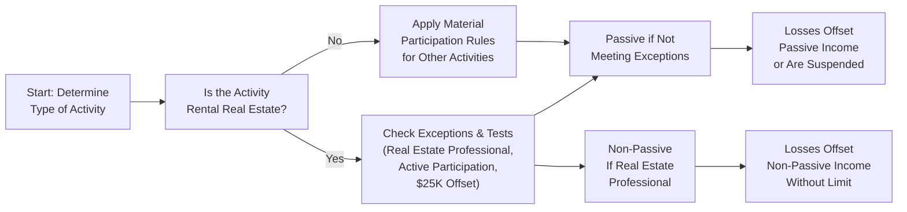
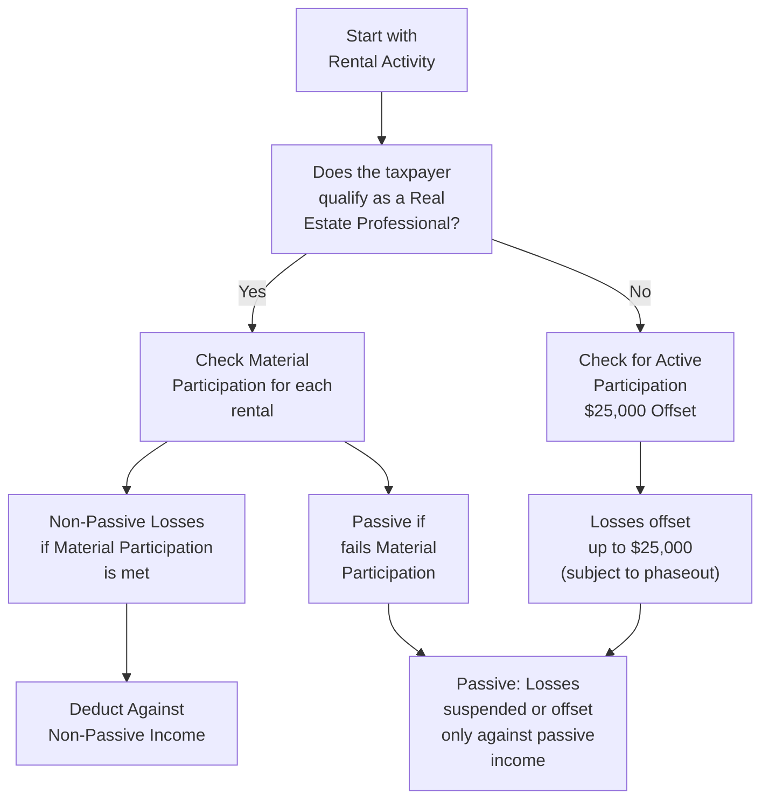

## 16.2 Passive Activity Loss Limitations and Rental Real Estate Activities

Passive Activity Loss (PAL) rules—codified primarily in Internal Revenue Code (IRC) Section 469—play a pivotal role in limiting the deductibility of certain losses for taxpayers. These rules are designed to prevent taxpayers from sheltering income earned in one area by offsetting it with large losses from passive “tax shelter” investments. One of the main areas affected by PAL rules is rental real estate, an asset class that has historically been used for its potential tax benefits. However, to manage potential abuse of these advantages, Congress instituted specific passive activity rules that limit or disallow such losses unless certain conditions are met.

In this section, we will delve into the key principles of passive activity losses, walk through the limitations pertaining to rental real estate, highlight the exceptions available (including the valuable “$25,000 offset” for certain taxpayers), examine the real estate professional exception, and provide practical examples and diagrams. These concepts build on the prior discussions of at-risk rules (see Section 16.1) and will prepare you for deeper exploration of how losses flow through to owners of pass-through entities (discussed in Chapter 17, “Reporting of Income from Pass-Through Entities”).

--------------------------------------------------------------------------------

### Understanding Passive Activities Under IRC Section 469

Under IRC Section 469, activities are generally categorized as either active, portfolio, or passive. Passive activities include most rental operations and any trade or business in which the taxpayer does not materially participate. Losses from passive activities can only offset income from other passive activities. Any net losses remaining after offsetting passive income are suspended and carried forward to future years, potentially deductible once there is sufficient passive income or upon a fully taxable disposition of the property.

#### Material Participation
Material participation is the key to determining whether an activity is considered passive or active. If you are involved on a regular, continuous, and substantial basis in the operations of a trade or business, you are considered to materially participate. The IRS has established seven tests for material participation, including:

• Spending more than 500 hours on the activity during the tax year.  
• Doing substantially all the work in an activity.  
• Spending more than 100 hours on the activity if no other participant spends more time than you.  
• Several other nuanced tests that consider historical participation, facts, and circumstances.  

If you fail to meet any of the material participation tests for an activity, the activity’s income or loss is classified as passive.

#### Limitations on Passive Losses
Once an activity is determined to be passive, you may only deduct losses up to the amount of passive income you have in that year. Unused losses are suspended and carried over to offset passive income in future years or become deductible in the year you dispose of your entire interest in the passive activity.

--------------------------------------------------------------------------------

### Rental Real Estate Activities: General Rules

A rental real estate activity is typically considered passive by default—even if you materially participate. Generally, the default stance is that rental real estate is inherently passive unless you meet one of two major exceptions:

1. The Real Estate Professional Exception.
2. The Active Participation Exception that allows up to a $25,000 offset against non-passive income for certain moderate-income taxpayers.

#### Why Rental Real Estate Is Usually Passive
By its nature, rental real estate is often structured so that the majority of the work is done by property managers, contractors, or other professionals rather than the property owner. This structure means that owners often do not meet the material participation requirements. Moreover, the tax code specifically classifies most rental activities as passive—an important difference from other types of trades or businesses.

--------------------------------------------------------------------------------

### The $25,000 Offset for Rental Real Estate

One of the most frequently cited benefits for individuals who invest in rental real estate is the $25,000 offset for rental real estate losses. This offset is available to certain taxpayers who:

• Actively participate in managing the property.  
• Own at least 10% (by value) of the rental property.  
• Have a Modified Adjusted Gross Income (MAGI) at or below specific threshold levels.

Under these circumstances, up to $25,000 of passive losses attributed to rental real estate can be used to offset non-passive income. In other words, losses from a rental real estate activity that would typically be locked behind the passive activity rules can reduce wages or business income outside of that passive category.

#### Phaseouts
The $25,000 offset is subject to an income-based phaseout. The general rule is:

• The offset begins phasing out once the taxpayer’s MAGI exceeds $100,000.  
• The offset is reduced by 50% of every dollar above $100,000.  
• The offset is fully phased out at $150,000 of MAGI (i.e., no offset is allowed if MAGI reaches $150,000).

For example, if a married couple filing jointly has MAGI of $130,000, they exceed $100,000 by $30,000. The otherwise available $25,000 offset is reduced by $15,000 (50% of $30,000), leaving a $10,000 offset.

#### Active Participation
“Active participation” involves a lesser standard than material participation. It can be satisfied if the taxpayer makes bona fide decisions regarding rental terms, approves major repairs, or is involved in decisions like deciding on tenants or rental rates. Hiring a property manager does not automatically disqualify you from active participation, provided you remain involved at a meaningful level.

--------------------------------------------------------------------------------

### Real Estate Professional Exception

The Real Estate Professional Exception can convert rental real estate activities from passive to non-passive if certain requirements are met. This is particularly beneficial for taxpayers primarily engaged in real estate trades or businesses. To qualify:

1. More than 50% of the taxpayer’s personal services in all trades or businesses during the tax year must be performed in real estate trades or businesses.  
2. The taxpayer must perform more than 750 hours of service in real property trades or businesses during the tax year.  

If a taxpayer meets these standards, each rental activity is evaluated separately for material participation. For those that the taxpayer materially participates in, the rental losses are not considered passive. Instead, the losses may offset ordinary or other income without limitation.

#### Key Considerations
• Married taxpayers must each independently qualify if they file separately. If filing jointly, generally one spouse can qualify and the other spouse’s hours are not combined (the spouse attempting to meet the 750-hour test must personally fulfill it).  
• Once the taxpayer qualifies as a real estate professional, the inquiry then looks to each rental activity and applies the seven material participation tests.  

--------------------------------------------------------------------------------

### Typical Passive vs. Active Examples

To clarify, let us walk through typical scenarios:

• Example 1: A taxpayer with a 40-hour-per-week W-2 job in a non-real-estate field and minimal rental property involvement usually faces passive losses. He or she likely will only be able to utilize the $25,000 offset if active participation is shown and income is below the phaseout thresholds.  
• Example 2: A licensed real estate agent who spends 1,000 hours annually showing properties, running a small property management business, and supervising rental properties might meet the Real Estate Professional Exception. If the tests are met, rental real estate losses from those properties in which the agent materially participates become non-passive and can fully offset other income.  
• Example 3: A married couple in which one spouse is a full-time real estate broker, spending well over 750 hours, could potentially qualify for the Real Estate Professional Exception. If they choose to group multiple rental activities as a single activity and show material participation collectively, the losses may be entirely deductible against active income.  
• Example 4: A taxpayer invests in several short-term vacation rentals but outsources 90% of tasks, from booking to cleaning. Unless the 750-hour threshold and the majority-of-services test are met under the Real Estate Professional Exception, these rentals will likely remain passive.  

--------------------------------------------------------------------------------

### Mechanics of Passive Activity Loss Limitations

Visualizing how passive income and losses operate can help solidify understanding. The following Mermaid diagram shows a simplified flow of passive versus non-passive income, focusing on how real estate losses move through the system.

■ If the activity is rental real estate, you check if you qualify for real estate professional status or meet the $25,000 offset with active participation.  
■ If you do not qualify, the losses remain passive and can only offset passive income from other sources or be carried forward.  
■ If you qualify as a real estate professional and materially participate, the losses are non-passive and can offset active or portfolio income.  

--------------------------------------------------------------------------------

### Common Pitfalls and Practical Tips

1. **Misapplication of the Real Estate Professional Exception**  
   Many taxpayers mistakenly believe that owning property automatically grants them professional status. The 750-hour requirement and more-than-50%-of-all-work tests are strict. In addition, each rental activity must still meet material participation tests unless formally grouped according to specific IRS guidelines.

2. **Neglecting the Phaseout of the $25,000 Offset**  
   Taxpayers often overlook the phased reduction once MAGI exceeds $100,000, leading to miscalculations and potential surprises when filing returns.

3. **Failing to Maintain Adequate Records**  
   Documenting hours spent on an activity is crucial, especially if aiming for real estate professional status. Contemporaneous logs of meetings, phone calls, showings, repair visits, and other management tasks are vital.

4. **Confusion Between “Active Participation” and “Material Participation”**  
   The $25,000 offset uses the relatively easier active participation standard, while the real estate professional exception requires the more stringent material participation standard. Mixing them up can lead to inadvertent underreporting or disallowed losses.

5. **Not Considering Grouping Elections**  
   When taxpayers hold multiple properties, they can sometimes group them into a single activity to meet the material participation requirements, but this also affects how dispositions and partial transfers are treated. Once made, a grouping election can be difficult to revoke.

--------------------------------------------------------------------------------

### Example Case Studies

#### Case Study 1: Phasing Out of the $25,000 Offset
Alfred and Maria file jointly and have MAGI of $120,000. They own a rental property on which they’ve incurred a net loss of $19,000 for the year, and they actively participate in managing the property. Normally, they would be entitled to the full $19,000 offset, but their income exceeds $100,000:

• $120,000 – $100,000 = $20,000 over the threshold  
• The offset is reduced by 50% × $20,000 = $10,000  
• Their new offset is $25,000 – $10,000 = $15,000  

They can thus deduct $15,000 of the $19,000 against their non-passive income this year. The remaining $4,000 becomes a suspended passive loss and may be used against future passive income or upon the sale of the property.

#### Case Study 2: Real Estate Agent with Part-Time Rentals
Rebecca is a full-time real estate agent, spending roughly 1,200 hours a year showing commercial and residential properties to clients. She also owns two rental homes generating losses. Because her real estate agent work already exceeds 750 hours and constitutes more than half of her working hours, she qualifies as a real estate professional. Next, she must show material participation for each rental property. She uses a single real estate activity grouping election, devotes 200 hours per year to managing the rentals, and surpasses the material participation threshold. As a result, all her rental activities are non-passive, allowing her $30,000 combined loss from both rentals to offset her real estate agent commissions.

--------------------------------------------------------------------------------

### Strategic Considerations

• **Tax Planning Around Phaseouts**  
  If you approach the $100,000 MAGI threshold, consider deferring certain income or increasing tax-deductible retirement contributions (e.g., 401(k) or traditional IRA) to lower MAGI below $100,000, maximizing the $25,000 offset.

• **Benefit of Real Estate Professional Status**  
  If you can genuinely shift your work toward real property trades or businesses, the real estate professional exception unlocks large potential tax savings. However, ensure you maintain evidence such as timesheets, calendar logs, and relevant documentation to withstand potential IRS scrutiny.

• **Estate Planning Angle**  
  For those with large real estate holdings, exploring trust structures or other planning vehicles may yield additional advantages, although the complexity increases. See Chapter 25 on “Estate and Gift Tax Planning for Owners and Individuals” for more details.

• **Partnerships and S Corporations**  
  Consider the interplay of passive limitations when investing through partnerships (refer to Chapter 21 for partnership allocations, pass-through basis adjustments, and recourse/nonrecourse debt considerations) or S corporations (see Chapter 20). These entities pass through gains and losses that remain subject to PAL rules at the individual taxpayer level.

--------------------------------------------------------------------------------

### Additional Visual Overview

Below is another Mermaid diagram illustrating a high-level decision tree for applying the real estate professional exception and active participation offset:

--------------------------------------------------------------------------------

### References for Further Exploration

1. **IRS Publication 925, Passive Activity and At-Risk Rules:** Provides in-depth guidance on determining passive and non-passive activities, recordkeeping, and limitations.  
2. **IRC Section 469:** The primary legal foundation governing passive activity loss limitations.  
3. **Treasury Regulations §§ 1.469-1 through 1.469-9:** Offers regulations and examples clarifying statutory provisions in Section 469.  
4. **Chapter 19 on C Corporations and Chapter 20 on S Corporations:** Explore how losses from those entities interact with passive activity limitations at the shareholder level.  
5. **Chapter 21 on Partnerships:** Delves deeper into how passive or non-passive items flow through to partners based on at-risk and material participation rules.  

--------------------------------------------------------------------------------

## Mastering Passive Activity Loss Limitations: Quiz for Real Estate and Rental Activities



### Which Internal Revenue Code (IRC) section primarily governs passive activity loss (PAL) limitations?

- [ ] IRC Section 401
- [ ] IRC Section 461
- [x] IRC Section 469
- [ ] IRC Section 1031

> **Explanation:** IRC Section 469 is the cornerstone provision that introduces and enforces passive activity loss limitations.

### Which activity standard typically allows up to a $25,000 rental real estate loss deduction for moderate-income investors?

- [ ] Material participation
- [x] Active participation
- [ ] Portfolio participation
- [ ] None of the above

> **Explanation:** Active participation is a lighter standard than material participation and can grant up to a $25,000 offset for rental losses, subject to income phaseouts.

### What is the Modified Adjusted Gross Income (MAGI) threshold at which the $25,000 offset for rental real estate losses begins to phase out?

- [ ] $75,000
- [ ] $90,000
- [x] $100,000
- [ ] $150,000

> **Explanation:** The offset starts phasing out once MAGI surpasses $100,000, reducing by 50% of every dollar above that threshold and fully disappearing at $150,000 MAGI.

### Among the following, which set of requirements must be met for a taxpayer’s rental activities to qualify as non-passive under the Real Estate Professional Exception?

- [ ] More than 750 total hours and 25% of personal services in real estate
- [x] More than 50% of personal services in real estate and at least 750 hours
- [ ] Exactly 750 hours in real estate and only 15% in all other services
- [ ] None of the above

> **Explanation:** The Real Estate Professional Exception requires more than 750 hours of real estate work, plus more than half of the taxpayer’s total working hours in real property trades or businesses.

### What happens to the portion of the $25,000 rental loss offset that is phased out if your MAGI is $130,000?

- [x] The offset is reduced by $15,000, leaving a $10,000 offset
- [ ] The offset is eliminated completely
- [x] The offset is reduced from $25,000 to $10,000
- [ ] No effect on the offset

> **Explanation:** MAGI of $130,000 exceeds $100,000 by $30,000; the offset is reduced by 50% of this excess ($15,000) leaving $25,000 − $15,000 = $10,000.

### True or False: Active participation is a stricter standard than material participation for purposes of the $25,000 rental loss offset.

- [ ] True
- [x] False
- [ ] Depends on taxpayer filing status
- [ ] Not addressed by the IRS

> **Explanation:** Active participation is a lower threshold than material participation, making it easier for taxpayers to qualify for the $25,000 offset.

### If a taxpayer cannot use their passive losses in the current year, the losses:

- [x] Are carried forward indefinitely to offset future passive income
- [ ] Disappear after the current year
- [x] Roll over to offset earned income in the next year
- [ ] Convert to non-passive losses automatically

> **Explanation:** Unused passive losses remain suspended and carry forward. They may eventually become deductible when offsetting future passive income or when the taxpayer disposes of the property entirely. However, they do not convert to non-passive losses unless specific exceptions apply.

### Which of the following statements is true about material participation?

- [x] You must be involved in the activity on a regular, continuous, and substantial basis.
- [ ] Material participation is determined solely by the amount of capital invested.
- [ ] If you hire a property manager, you automatically satisfy the material participation requirement.
- [ ] It has no documented hour requirement and is purely subjective.

> **Explanation:** The IRS uses set tests and hours thresholds to determine whether your involvement is "regular, continuous, and substantial." Capital investment alone, without active involvement, does not establish material participation.

### Which of the following logs or records is most critical for taxpayers wishing to prove real estate professional status?

- [ ] Monthly mortgage statements
- [x] Contemporaneous logs and calendars of hours worked on real estate tasks
- [ ] Passive loss carryforward schedules
- [ ] Personal bank statements

> **Explanation:** Proving real estate professional status hinges on documenting hours spent in real property trades or businesses, making time logs of management, visits, and other tasks crucial.

### A fully taxable disposition of a passive activity generally allows suspended losses from that activity to be:

- [x] Deducted in full against any type of income in the year of disposition
- [ ] Carried back to prior tax years
- [ ] Offset only against interest or dividend income
- [ ] Forever disallowed once an activity is sold

> **Explanation:** When you completely dispose of a passive activity in a taxable transaction, any suspended losses from that activity become fully deductible in the disposition year against any type of income.



--------------------------------------------------------------------------------

## For Additional Practice and Deeper Preparation

### [Taxation & Regulation (REG) CPA Mock Exams](https://www.udemy.com/course/reg-cpa-mock-exams/?referralCode=55419EBD198F61530B12)

Taxation & Regulation (REG) CPA Mocks: 6 Full (1,500 Qs), Harder Than Real! In-Depth & Clear. Crush With Confidence!

- Tackle full-length mock exams designed to mirror real REG questions.  
- Refine your exam-day strategies with detailed, step-by-step solutions for every scenario.  
- Explore in-depth rationales that reinforce higher-level concepts, giving you an edge on test day.  
- Boost confidence and minimize anxiety by mastering every corner of the REG blueprint.  
- Perfect for those seeking exceptionally hard mocks and real-world readiness.  

_Disclaimer: This course is not endorsed by or affiliated with the AICPA, NASBA, or any official CPA Examination authority. All content is for educational and preparatory purposes only._
