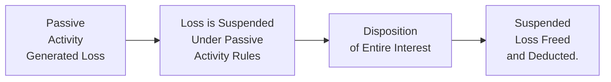

## 16.3 Utilization of Suspended Losses upon Disposition

Suspended losses often arise when an individual cannot currently deduct certain losses due to limitations such as the at-risk rules or the passive activity rules. Over time, these losses accumulate or “suspend.” A major reprieve occurs when the taxpayer disposes of their entire interest in the activity through a fully taxable transaction. At this point, previously suspended losses typically become deductible, subject to various rules and scenarios. In this section, we will explore the underlying law for freeing up suspended losses, discuss the key distinctions between partial and complete dispositions, provide examples, and highlight strategies for optimal tax outcomes.

---

Introduction  
Suspended losses represent the portion of an activity’s losses that have not been deductible in prior years due to limitations such as:

• Passive Activity Loss (PAL) limitations under Internal Revenue Code (IRC) §469.  
• At-Risk Rules under IRC §465.  
• Basal limitations on S corporations and partnerships.  

Understanding how these suspended losses free up is critical for effective tax planning. Typically, suspended losses become available in the year of a fully taxable disposition of the entire interest in the activity. However, the rules can be intricate depending on whether the disposition is partial or complete, the classification of the activity, and whether there are any remaining at-risk limitations.

---

Understanding Suspended Losses

Suspended losses are commonly encountered by individuals who participate in passive activities—business ventures in which they do not materially participate. Under IRC §469, a passive loss is only deductible up to the extent of passive income. If a taxpayer does not have sufficient passive income, the loss is “suspended” and carried forward to future years.

Other major limitations include:

• The At-Risk Rules: Limits the ability to deduct losses to the amount the taxpayer has at risk in the activity.  
• Basis Limitations: In partnerships or S corporations, a taxpayer’s pro rata share of losses cannot exceed their basis (which typically includes contributions, retained income, and certain liabilities).  

When these limitations kick in, a portion (or all) of the net losses may not be immediately deductible. Devising a plan for disposition—often through sale or taxable exchange—can free suspended losses and allow taxpayers to realize potentially large deductions.

---

Mechanics of Disposition

There are two primary avenues to release suspended losses:

• Complete Disposition: The taxpayer sells or otherwise disposes of their entire interest in the activity in a fully taxable transaction (i.e., the taxpayer recognizes the gain or loss for tax purposes).  
• Partial Disposition: Some portion of suspended losses may free up if the disposals are structured in accordance with specific rules; however, partial dispositions often do not yield the full release of suspended losses unless certain requirements are met.

A complete, fully taxable disposition is typically the clearest path to “freeing” suspended losses. In that situation:

1. The taxpayer terminates all interest in the activity.  
2. The disposition is considered fully taxable—meaning there is a recognition event.  
3. Suspended losses become available, first offset against any gain realized on the sale, then (subject to certain limitations) potentially offsetting other income.

---

Complete vs. Partial Disposition

• Complete Disposition:  
  - Occurs when the taxpayer sells or abandons 100% of their interest in the activity.  
  - Suspended passive losses and at-risk carryovers related to that activity ordinarily become deductible in the year of disposition.  
  - If a gain is realized, the suspended loss offsets that gain first. Any excess suspended loss may offset other non-passive income, subject to at-risk limitations.  

• Partial Disposition:  
  - Selling or disposing of less than the entire interest in the activity generally does not free up all suspended losses.  
  - The suspended losses related to the portion of the interest still held typically remain suspended.  
  - Losses may qualify for partial release if specific rules and elections apply (e.g., disposition of substantially all assets of a passive activity in a casualty).

---

Fully Taxable Transactions and the Release of Suspended Losses

To ensure that the suspended losses fully release:

1. The sale or exchange must be structured so that the taxpayer recognizes all the realized gain (or loss).  
2. An installment sale may cause a prorated realization of the gain (or loss) over time, which means suspended losses often are released proportionally as each installment payment is recognized.  
3. Non-taxable exchanges, such as certain 1031 exchanges, generally do not free up suspended losses because the taxpayer continues the activity in a new or similar property.

---

Impact of At-Risk Rules

A taxpayer’s at-risk amount is the amount of money and property personally at risk in the activity. Even if a taxpayer disposes of their entire interest, suspended losses exceeding their at-risk amount remain nondeductible. Therefore, prior to disposition, it is important to track:

• The at-risk amount.  
• How at-risk changes from year to year as the taxpayer’s investment or borrowed funds secured by personal assets fluctuate.  

If the portion of suspended losses exceeds the at-risk basis, that excess remains disallowed—even upon disposition.

---

Basis Limitations for Partnerships and S Corporations

For partnerships or S corporations, basis limitations restrict the amount of losses that a partner or shareholder can deduct:

• Partnership: A partner’s basis increases with contributions of cash or property and a share of partnership debt, and decreases with distributions and allocated losses.  
• S Corporation: A shareholder’s stock basis increases with capital contributions and allocated income items, and decreases with distributions and allocated loss or expense items.

If an individual’s share of losses is limited due to a basis shortfall, those losses become suspended and cannot be deducted in that year. Upon disposition:

1. The individual calculates their final basis in the partnership or S corporation.  
2. Any suspended losses up to (but not exceeding) the final basis become deductible against the proceeds of the sale or other income, subject to passive and at-risk rules.  

---

Step-by-Step Example: Passive Rental Property

Assume Bob acquired a single rental property, which was classified as a passive activity since Bob does not materially participate. Over three years, Bob accumulated $20,000 of passive losses that were suspended under IRC §469 because he had no passive income from other sources. Bob’s at-risk basis in the property is also sufficient to absorb these losses, meaning the at-risk rules do not further limit him.

• In Year 4, Bob fully disposes of the property via a taxable sale.  
• He realizes a $5,000 net gain for the property.  
• Bob’s suspended losses of $20,000 are first used to offset the $5,000 gain.  
• The remaining $15,000 of losses offset Bob’s other income, assuming no other limitations apply.  
• Bob must report the net result on his tax return, indicating a total $15,000 ordinary loss in addition to the property’s gain offset.

This scenario demonstrates that even though Bob had zero passive income in prior years, the entire $20,000 of suspended losses becomes deductible in the year he disposes of the property, subject to offsetting the gain first and then offsetting other income.

---

Step-by-Step Example: Partnership Interest

Consider Sarah, who invested in a partnership that operates a business in which she does not materially participate. Her share of the partnership’s losses for multiple years was $60,000, but she could only deduct $30,000 so far due to basis limitations and the passive activity loss rules. The remaining $30,000 of losses carried forward as suspended passive losses. In Year 5, Sarah sells her entire partnership interest in a fully taxable transaction for $50,000. Before the sale, her final adjusted basis in the partnership is $20,000.

• Sarah’s realized gain on the sale is $30,000 ($50,000 – $20,000).  
• She has $30,000 in suspended passive losses.  
• The suspended losses become deductible in the disposition year, offsetting the $30,000 gain.  
• Sarah ends up with zero net gain from the partnership sale for tax purposes (assuming no other constraints).  

This scenario highlights a complete, fully taxable disposition that triggers the release of passive losses.

---

Visualizing the Process

Below is a simple flowchart depicting how suspended losses progress from inception to disposition:

• In the first stage (A), a passive activity produces losses.  
• In the second stage (B), those losses are suspended if there is insufficient passive income or if basis/at-risk rules limit deduction.  
• In the third stage (C), the taxpayer triggers a fully taxable disposition by selling or exchanging their entire interest in the activity.  
• Finally, (D) the suspended loss is released, offsetting gain from the disposition and potentially other income if the losses exceed that gain.

---

Practical Tips to Maximize the Benefit of Suspended Losses

• Monitor Passive Activity Income Opportunities: If you anticipate future passive income (from another rental, partnership, or S corporation), coordinate dispositions to best use suspended losses.  
• Understand Installment Sales vs. Lump Sum Disposition: An installment sale can spread out capital gains; however, it also delays the release of suspended losses. In certain situations, taking a lump sum can provide a more immediate benefit.  
• Verify At-Risk Basis Before Disposal: Ensure that any debt is appropriately categorized and that your at-risk basis is updated, so you can project which portion of the suspended losses will actually be deductible.  
• Consider Timing in Relation to Other Income: Releasing a large suspended loss in a year with substantial ordinary income can reduce the overall tax liability more effectively than freeing up losses in a year with lower taxable income.

---

Common Pitfalls

• Disposing in a Non-Taxable Manner: Conducting a like-kind exchange (IRC §1031) or contributing property to another entity does not usually free up suspended losses.  
• Partial vs. Complete Disposition Confusion: Only a complete disposition of an entire interest releases suspended losses in full. Partial dispositions frequently lead to continued suspensions.  
• Not Updating Basis and At-Risk Calculations: Failing to track basis and at-risk amounts regularly may lead to misguided assumptions about the availability of suspended losses.  
• Failing to Consider State Laws: Some states have different guidelines for the release of suspended losses, so always confirm local regulations.

---

Real-World Case Study

Scenario: Lisa owns multiple passive activities—an interest in a rental partnership and a stake in an S corporation. Over the years, losses are generated as follows:

• Partnership: $40,000 in total losses, of which $20,000 is suspended.  
• S Corporation: $15,000 in total losses, of which $5,000 is suspended due to basis limitations.  

Lisa also invests in a new passive venture that starts producing significant passive income. She could potentially free up some or all previously suspended losses if her new venture provides enough passive income. However, if she sells her entire interest in the partnership in a fully taxable sale, the entire $20,000 of suspended partnership losses is released. Similarly, if she liquidates her entire S corporation stake in a manner that triggers full gain (or loss), the additional $5,000 suspended there becomes fully deductible.

The key point: A strategic approach—considering whether other passive income can offset losses vs. disposing of the interest for immediate release—determines how Lisa will minimize her tax liability over time.

---

References and Further Reading

• Internal Revenue Code §469: Passive Activity Loss Limitations  
• Internal Revenue Code §465: At-Risk Rules  
• Treasury Regulations §1.469-1 through §1.469-11: Detailed IRS guidance on the scope and application of PAL rules  
• IRS Publication 925: Explains passive activities and at-risk rules in simpler terms  

---

## Test Your Knowledge: Suspended Losses Freed upon Disposition



### Upon which type of disposition are suspended passive losses generally released in full?

- [x] A fully taxable disposition of the taxpayer’s entire interest in the activity
- [ ] A nontaxable like-kind exchange of property
- [ ] A partial gifting of the interest to a family member
- [ ] An energy credit transaction

> **Explanation:** Under IRC §469, suspended passive losses are unlocked only when there is a complete and fully taxable disposition of the entire interest in the passive activity. Like-kind exchanges and partial gifts typically do not free these suspended losses.

### Which limitation may still restrict the deduction of suspended losses even after a full disposition?

- [x] At-risk limitation
- [ ] Ordinary charitable contribution limit
- [ ] Long-term capital gains preference rules
- [ ] Dividends received deduction limitation

> **Explanation:** The at-risk rules in IRC §465 can still limit the deduction of losses if the taxpayer’s at-risk amount is exceeded. Suspended losses cannot exceed what the taxpayer has at risk, even upon complete disposition.

### What is the primary impact of an installment sale on the release of suspended losses?

- [x] Suspended losses are released proportionally as gain is recognized each year
- [ ] Suspended losses are fully released upon the contract date
- [ ] Suspended losses remain suspended permanently
- [ ] Suspended losses can be released only in the final year of payment

> **Explanation:** If a taxpayer opts for an installment sale, the gain is recognized over the collection period. Consequently, suspended losses tied to that activity are typically released in proportion to the amount of gain recognized each year.

### In which scenario would suspended losses from a passive activity remain undeducted after a sale?

- [x] When the taxpayer has insufficient at-risk basis to absorb the losses
- [ ] When the activity qualifies for Section 179 expensing
- [ ] When the taxpayer has enough experience to be considered material participant
- [ ] When the sale is fully taxable

> **Explanation:** Even after a fully taxable disposition, suspended losses are capped by a taxpayer’s at-risk basis. If the losses exceed at-risk basis, the excess remains nondeductible.

### Which of the following is a strategy for maximizing the benefit of suspended losses?

- [x] Timing the disposition in a high-income year and ensuring the at-risk basis is sufficient
- [ ] Making a nontaxable IRC §1031 exchange
- [x] Generating passive income from other activities to offset losses
- [ ] Using below-market loans to boost suspended losses

> **Explanation:** Taxpayers often align dispositions of passive activities or generate complementary passive income to utilize suspended losses effectively. A nontaxable exchange does not free up those suspended losses.

### How do basis limitations in partnerships generally impact suspended losses?

- [x] Losses in excess of a partner’s basis are suspended until the basis is restored
- [ ] Suspended losses fully offset gains from unrelated activities
- [ ] No limitation applies once the partnership elects out of basis rules
- [ ] Suspended losses are disallowed permanently

> **Explanation:** Partnership basis limitations restrict the deductibility of losses to the partner’s economic investment. If losses surpass basis, they become suspended until the basis is adequate—often through contributing funds, increasing debt, or recognizing allocable income.

### What is a key difference between partial and complete dispositions regarding suspended losses?

- [x] A complete disposition generally releases suspended losses, while partial dispositions often do not
- [ ] Partial dispositions fully unlock suspended losses
- [x] Partial dispositions sometimes allow limited release if special rules or elections apply
- [ ] There is no difference; both partial and complete dispositions typically free the same amount of loss

> **Explanation:** A 100% disposition of an interest in a passive activity typically frees all suspended losses. Partial dispositions usually result in continued suspension unless very specific circumstances are met.

### What consequence arises when a taxpayer with suspended passive losses converts the activity into a non-passive activity mid-year?

- [x] The previously suspended losses remain suspended until a complete taxable disposition
- [ ] All suspended losses are immediately freed up
- [ ] The losses must be averaged over the next five years
- [ ] The suspended losses get converted into capital loss carryforwards

> **Explanation:** Conversion from passive to non-passive status alone does not free up prior years’ suspended losses. They stay suspended until a disposition event as defined under IRC §469 or sufficient passive income arises.

### Which of the following statements correctly depicts the role of the disposition gain in offsetting suspended losses?

- [x] Gains from the disposition are offset first by suspended losses, with any remainder offsetting other income
- [ ] Gains do not affect suspended losses
- [ ] Gains from the disposition fully disallow suspended losses
- [ ] Gains are only offset if they are categorized as ordinary

> **Explanation:** Typically, suspended losses offset the disposition gain attributable to the passive activity first, and any excess then offsets other types of income if all other conditions are met (e.g., at-risk limitations).

### True or False: A fully taxable sale of a passive activity can allow suspended losses to offset both the gain from the sale and other income.

- [x] True
- [ ] False

> **Explanation:** Under a complete, fully taxable disposition of a passive activity, suspended passive losses can first offset any gain on the sale, and any excess loss can typically be applied against other forms of income, subject to at-risk and basis restrictions.



---

## For Additional Practice and Deeper Preparation

### [Taxation & Regulation (REG) CPA Mock Exams](https://www.udemy.com/course/reg-cpa-mock-exams/?referralCode=55419EBD198F61530B12)

Taxation & Regulation (REG) CPA Mocks: 6 Full (1,500 Qs), Harder Than Real! In-Depth & Clear. Crush With Confidence!

• Tackle full-length mock exams designed to mirror real REG questions.  
• Refine your exam-day strategies with detailed, step-by-step solutions for every scenario.  
• Explore in-depth rationales that reinforce higher-level concepts, giving you an edge on test day.  
• Boost confidence and minimize anxiety by mastering every corner of the REG blueprint.  
• Perfect for those seeking exceptionally hard mocks and real-world readiness.

_Disclaimer: This course is not endorsed by or affiliated with the AICPA, NASBA, or any official CPA Examination authority. All content is for educational and preparatory purposes only._
