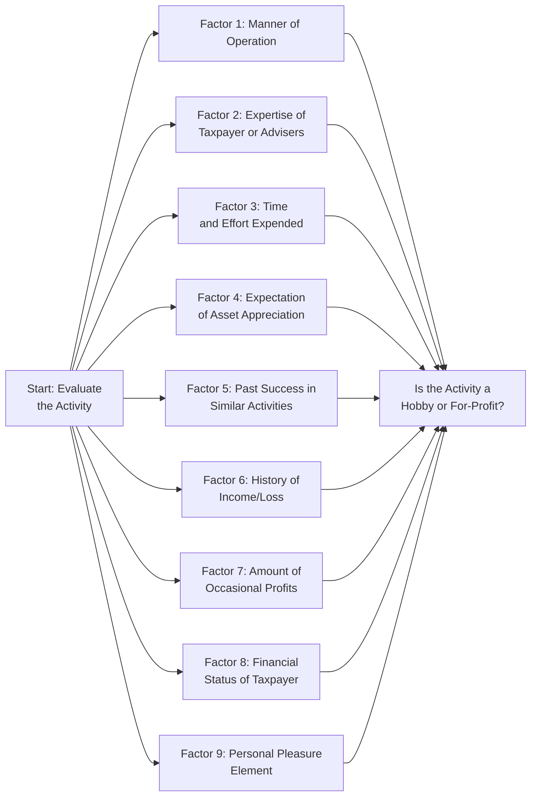

## 16.4 Hobby Losses and Other Non-Deductible Items

Among the many intricacies of the U.S. tax system, determining whether an individual’s activity is a genuine profit-driven venture—or merely a hobby—remains critical. The distinction has significant tax consequences. Under Internal Revenue Code (IRC) Section 183, often called the “Hobby Loss Rule,” taxpayers who engage in certain activities without the primary objective of profit often cannot deduct losses in the same manner as a true for-profit business.

This section dives deep into the concept of “hobby losses,” reviews the nine factors (drawn from case law and IRS guidelines) used to determine whether an activity is engaged in for profit, and explores the rules concerning partial deductions for these activities. We also address other non-deductible items to give you a complete picture of what falls within and outside of allowable deductions.

--------------------------------------------------------------------------------
## Understanding Hobby vs. For-Profit Activities

Generally, business activities that generate profit (or have a strong intent to operate with a profit motive) are allowed to take advantage of deductions under IRC §§ 162 and 212. However, if an activity is classified as a hobby, potential deductions are severely limited. Historically, individuals used certain “hobby losses” to offset other income, thus reducing their overall tax burden. In response, the tax code specifically limits or disallows such losses if the primary purpose of an activity is not profit-seeking.

### Key Consequences of a Hobby Classification

1. Expenses are deductible only to the extent of gross income from the hobby.  
2. Deductions are generally claimed as miscellaneous itemized deductions (subject to certain restrictions), rather than business deductions.  
3. Losses that exceed income generated by the hobby cannot be used to offset other sources of income (e.g., wages, investment returns).  

Changes introduced by the 2017 Tax Cuts and Jobs Act (TCJA) impacted many itemized deductions, significantly limiting certain miscellaneous itemized deductions. Nevertheless, for CPA candidates and practitioners, understanding the pre-2018 treatment (and the continuing interplay of current law) is still essential. The Uniform CPA Examination may test both historical and modern contexts of these limitations.

--------------------------------------------------------------------------------
## The Nine Factors for Determining a Hobby (From Case Law and Regulation)

To discourage taxpayers from labeling leisure or recreational activities as “businesses” to claim unwarranted tax deductions, the IRS relies on a multi-factor test derived from case law and embedded in regulations under IRC § 183. No single factor is conclusive on its own; instead, the total picture depends on the relative weight of each factor under a given set of facts and circumstances.

Below are the nine primary factors considered:

1. **Manner in Which the Activity Is Carried On**  
   If an activity is carried on in a businesslike manner, with complete and accurate books, a written business plan, and appropriate recordkeeping, the IRS is more inclined to deem it a for-profit venture. Conversely, informal and poorly documented operations weaken the legitimacy of a profit motive.

2. **Taxpayer’s Expertise or Adviser’s Expertise**  
   Developing or obtaining expertise in the activity indicates an intent to make it profitable. Consulting professionals, researching industry trends, and refining methods to enhance profitability all weigh in favor of a for-profit classification.

3. **Time and Effort Expended**  
   Substantial time and effort can signal a genuine profit motive, particularly if the taxpayer significantly scales back on other activities (like a separate full-time job) to focus on this enterprise.

4. **Expectation That Assets May Appreciate**  
   Even if the immediate revenues are modest, anticipating growth or asset appreciation (e.g., land, real estate, or specialized equipment) can indicate profit intent. For example, a small farm that has not turned a profit might still be considered a for-profit venture if there is a reasonable expectation that the land will appreciate or that breeding stock will yield valuable offspring.

5. **Success in Carrying On Similar or Dissimilar Activities**  
   A proven track record of success in similar (or even unrelated) businesses can suggest that the taxpayer has a systematic approach to making ventures profitable. Past achievements can bolster the argument that a new activity is also undertaken with a profit motive.

6. **History of Income or Losses**  
   A history of continued losses raises suspicion about the viability of a for-profit classification, though startups and certain industries (e.g., thoroughbred horse breeding) often carry significant upfront costs. Occasional or consistent net profit can be strong evidence supporting a profit motive.

7. **Amount of Occasional Profits**  
   Even modest or sporadic profits can demonstrate an intent to make money, especially if those profits compare favorably to the magnitude of losses or the scale of the operation.

8. **Financial Status of the Taxpayer**  
   If the taxpayer has significant income from other sources and uses the so-called “hobby” for recreation or aesthetics—rather than to generate meaningful profit—this can tilt the classification toward a non-profit hobby.

9. **Elements of Personal Pleasure or Recreation**  
   If an activity inherently provides substantial personal or recreational enjoyment (e.g., yacht racing, coin collecting, or horse breeding purely for passion), the IRS will question the profit motive. However, deriving personal enjoyment does not automatically preclude the activity from being considered for profit, as many successful entrepreneurs also enjoy their work.

### Mind Map of the Nine Hobby Factors

Below is a Mermaid.js diagram illustrating the interplay among these nine factors:

In practice, the IRS and the courts will weigh each factor, evaluate the pattern of behavior, and either accept or challenge the taxpayer’s characterization of the activity as a business. Some activities are inherently entertainment- or leisure-oriented, requiring especially stringent recordkeeping and business structuring to justify a profit motive classification.

--------------------------------------------------------------------------------
## Presumption of Profit and Rebuttable Presumptions

The tax code provides a helpful “safe harbor” presumption: if an activity shows a net profit in three of the past five years (or two of the past seven years for certain activities like horse racing, breeding, or training), it is ordinarily presumed to be a for-profit activity. This presumption can be rebutted by the IRS if there is evidence suggesting the activity is not undertaken in good faith for profit. Conversely, failing to meet the “3/5 rule” is not automatically decisive against profit motive—some business ventures simply have delayed profitability. In such cases, you must gather and present persuasive support to prove your profit motive.

--------------------------------------------------------------------------------
## Partial Deductions for Hobbies

When an activity is classified as a hobby, the general rule under Section 183 is that expenses can be deducted only to the extent of hobby income. Before the TCJA changes, a taxpayer could generally report the expenses (which exceeded the income) as miscellaneous itemized deductions subject to the 2% AGI threshold. However, post-TCJA, many previously allowed miscellaneous itemized deductions are suspended (or severely curtailed) for tax years 2018 through 2025 (unless extended or changed by subsequent legislation). 

Nevertheless, for examination and planning purposes, understanding the “partial deduction” hierarchy is essential:

1. **Expenses That Would Be Deductible Anyway**  
   Certain expenses, such as mortgage interest and property taxes, remain deductible regardless of whether the activity is deemed a hobby or a for-profit endeavor. Accordingly, these expenses are claimed first.

2. **Expenses That Do Not Affect Basis**  
   Ordinary and necessary operational costs—like supplies, utilities, and advertising—are allowed to the extent that they do not exceed the hobby gross income remaining after deducting items in Category 1.

3. **Expenses That Reduce the Basis of Property**  
   Depreciation and any other capital expenditures fall into this final category. They are taken last and can only be deducted up to the remainder of hobby income after subtracting Category 1 and Category 2 expenses.

Under current law, many of these hobby expenses (particularly in Category 2 and Category 3) are not deductible because they must be claimed only as miscellaneous itemized deductions, which have been largely disallowed (through 2025). If the law reverts in the future (or for the exam’s historical coverage perspective), the above hierarchy remains instructive for analyzing partial deductions.

### Simple Example of Partial Deductions

Assume you earn $2,500 of gross income from selling artisan pottery pieces. You also incur $3,000 of expenses, including $1,000 of material costs, $500 of property taxes, and $1,500 of depreciation on pottery equipment.

1. **Deduct Category 1**: Property taxes ($500) are deductible entirely (although they may be subject to other SALT limitations).  
2. **Deduct Category 2**: Materials ($1,000) are next in line. However, the maximum remaining hobby income available after Category 1 is $2,000 ($2,500 – $500). Materials cost $1,000, so you can deduct the full $1,000. Now, you have $1,000 leftover ($2,000 – $1,000).
3. **Deduct Category 3**: Depreciation ($1,500) can only be deducted to the extent of the remaining $1,000 in hobby income. Therefore, you are limited to a $1,000 depreciation deduction.

As a result, the total permitted expenses match the total hobby income ($2,500), leaving you with zero net profit. Any excess depreciation (that extra $500 you could not deduct) is lost under hobby-loss rules—it cannot offset other forms of income.

--------------------------------------------------------------------------------
## Other Non-Deductible Items

In addition to hobby losses, there are many categories of personal expenditures and specific payments disallowed for tax purposes:

• **Personal, Living, or Family Expenses** (IRC § 262): Everyday costs like groceries, clothing, personal insurance, and household utility bills are non-deductible unless specifically allowed (e.g., certain health insurance premiums for self-employed individuals).  
• **Fines and Penalties**: Payments made to government entities for legal violations (e.g., speeding tickets, occupational safety fines) are disallowed (IRC § 162(f)).  
• **Political Contributions and Lobbying**: Generally, no deduction is allowed for political contributions, campaign donations, or lobbying efforts (with limited exceptions for local legislation, under IRC § 162(e)).  
• **Commuting Expenses**: The cost of traveling to and from your regular place of employment is non-deductible commuting expense. However, traveling between two business locations might be deductible if each site meets certain requirements for a place of business.  
• **Personal Interest Expenses**: Except for qualified home mortgage interest and certain higher education loan interest, personal interest (such as credit card finance charges on personal spending) is not deductible.  

--------------------------------------------------------------------------------
## Practical Scenarios and Case Studies

Below are more practical scenarios to reinforce how these rules might apply:

### Case Study 1: The Horse Enthusiast  
Sarah, an avid horse enthusiast, races her personal horses on weekends. She rarely wins prize money, and her expenses consistently outweigh any winnings. She meticulously tracks her horse-related expenditures but has not created a comprehensive business plan. She also has substantial income from her medical practice, so horse racing is more of an avocation than a necessity.  
• **Analysis**: The IRS or tax courts would examine the nine factors. Sarah’s inability to show profits, the significant personal enjoyment factor, and minimal effort to truly run this as a business might classify this as a hobby. Consequently, Sarah may deduct only up to her annual horse racing income and in the correct order, subject to miscellaneous itemized deduction limits (if allowed under future law).

### Case Study 2: The Weekend Artist Turned Professional  
James has been painting for years as a hobby. Recently, he invested significantly in a professional gallery space, hired a marketing consultant, and opened an online store. He’s read extensively about profitable art businesses and adjusted his product line for commercial success. The first two years are unprofitable, but he tracks his earnings and modifies his strategies in hopes of turning a profit in year three or four.  
• **Analysis**: Despite no immediate profit, James has documented his business approach meticulously (books and records, a business plan, marketing efforts). He seems to follow a for-profit model, suggesting that, even though the venture is new and still unprofitable, the IRS is more likely to treat it as a business with valid deductions. His robust recordkeeping and demonstration of serious intent weigh in his favor against the “hobby” classification.

--------------------------------------------------------------------------------
## Best Practices and Recommendations

• **Maintain Detailed Records**: Keep a separate bank account, track all income and expenses, and store receipts and invoices carefully. This helps demonstrate a professional approach and readiness for an IRS audit.  
• **Create a Business Plan**: Even a concise, one-page business plan clarifies goals, strategies, and relevant milestones to support a for-profit motive.  
• **Seek Professional Advice**: Consult with experienced advisers, accountants, or attorneys, especially for complex or evolving business models.  
• **Review the Safe Harbor**: If your activity can meet the “3 out of 5 years” profitability test (or “2 out of 7” for horse-related endeavors), it’s advantageous—but do not rely solely on this. Ensure your operations truly support a profit motive.  
• **Stay Informed on Law Changes**: Tax legislation frequently evolves. Monitor relevant provisions and updates, as certain miscellaneous itemized deductions disallowed under the TCJA might return.  
• **Document Changes and Improvements**: If you pivot strategies to increase profitability—e.g., switching sales channels, scaling marketing, or refining product lines— keep evidence of these actions, as it supports your claim of pursuing profit.  

--------------------------------------------------------------------------------
## References for Further Exploration

Below are some resources to delve deeper:

• IRS Publication 535, “Business Expenses”  
• IRS Publication 334, “Tax Guide for Small Business”  
• IRC § 183 (Activities Not Engaged in For Profit)  
• Treasury Regulations § 1.183-2 (Factors for Determining Profit Motive)  
• Most recent version of IRS Schedule C Instructions  
• AICPA Tax Section resources (various articles on hobby loss rules)  
• [IRS Website – Hobby or Business?](https://www.irs.gov/newsroom/hobby-or-business-irs-offers-tips-to-decide)  

Staying current with IRS directives and published rulings is vital; professional responsibilities, as discussed in Chapter 3 (Ethics and Responsibilities in Tax Practice), demand due diligence and informed professional judgment.

--------------------------------------------------------------------------------
## SEO-Optimized Quiz Title

Maximize Your Understanding: Hobby Losses and Non-Deductible Expenses Quiz



### Which of the following is a key factor in determining whether an activity is classified as a hobby or a for-profit business?

- [ ] Amount of federal tax withheld from the taxpayer's wages
- [x] Manner in which the taxpayer carries on the activity
- [ ] Size of the taxpayer's mortgage payment
- [ ] Frequency of the taxpayer's personal vacations

> **Explanation:** Among the nine factors, one of the most critical is how businesslike the activity is carried out, including recordkeeping and attempts to operate in a professional manner.

### Under IRC § 183, if a taxpayer shows a profit in three of the last five tax years, which of the following applies?

- [ ] An automatic classification as a hobby
- [x] A presumption that the activity is engaged in for profit
- [ ] A disqualification from taking any deductions whatsoever
- [ ] Mandatory accounting changes required by the IRS

> **Explanation:** A taxpayer who has shown a profit in at least three out of five consecutive years benefits from a presumption of profit intent, though the IRS can rebut it if contrary evidence emerges.

### Which of the following statements is true about partial deductions for hobby expenses?

- [ ] Hobby expenses are fully deductible without regard to the hobby’s income.
- [x] Hobby expenses are deductible only up to the amount of hobby income.
- [ ] Hobby expenses can offset all wages without limit.
- [ ] Hobby expenses are claimed first as an above-the-line deduction.

> **Explanation:** Under the hobby-loss rules, expenses cannot exceed the reported hobby income, preventing a net tax loss from a non-profit activity.

### Which of these is categorized as a non-deductible personal expense?

- [x] The cost of commuting to a regular job
- [ ] Interest expense on business loans
- [ ] Advertising expenses for an e-commerce store
- [ ] Costs for office internet used exclusively for business

> **Explanation:** Commuting expenses between one's home and primary job are personal and not deductible, whereas genuine business expenses are generally allowed.

### Which of the following is an element that generally decreases the likelihood that an activity will be deemed a hobby?

- [x] The taxpayer has a detailed business plan and profit-enhancing strategies.
- [ ] The taxpayer participates in the activity only for recreational reasons.
- [ ] The taxpayer fails to keep financial records.
- [ ] The taxpayer’s activities are uncoordinated and unplanned.

> **Explanation:** A well-documented plan for profitability supports the for-profit classification.

### What is one consequence of being classified as a hobby for tax purposes?

- [x] Losses cannot be used to offset other income.
- [ ] Unlimited depreciation deductions are allowed.
- [ ] A taxpayer can shift the hobby’s expenses to Schedule C freely.
- [ ] The activity is no longer subject to IRS compliance.

> **Explanation:** If an activity is deemed a hobby, expenses can only offset hobby income, and losses cannot reduce other sources of income.

### Under the current TCJA framework (2018–2025), which best describes the status of miscellaneous itemized deductions (including many hobby expenses)?

- [x] Suspended or greatly limited for most individual taxpayers.
- [ ] Fully deductible above the line.
- [ ] Deductible only if exceeding 10% of adjusted gross income.
- [ ] Deductible by making an election on Schedule C.

> **Explanation:** Many miscellaneous itemized deductions, including most hobby-related expenses, are temporarily disallowed or restricted between 2018 and 2025 under current tax law.

### Which factor often weighs heavily against classifying an activity as a true business?

- [ ] The taxpayer consulted an accountant for advice.
- [x] The taxpayer consistently incurs losses without any major changes to improve profitability.
- [ ] The taxpayer maintains professional books and records.
- [ ] The taxpayer changes operating methods to attempt to increase profits.

> **Explanation:** Chronic losses coupled with no real attempt to adjust or improve business outcomes strongly suggests a lack of profit motive.

### How is depreciation treated under hobby-loss rules?

- [ ] Depreciation is always disallowed for hobby activities.
- [ ] Depreciation must be taken first and in full.
- [x] Depreciation is deducted last, only after allowable expenses in Categories 1 and 2.
- [ ] Depreciation is allowed only for assets costing less than $2,500.

> **Explanation:** Hobby deductions follow a three-tier system. Depreciation resides in the final tier, limited to any remaining hobby income after prior deductions.

### An activity that yields only personal pleasure or recreation is likely:

- [x] A hobby, if there is no substantial record of profit-making intent
- [ ] Automatically classified as a pass-through entity
- [ ] Treated as a partnership for tax purposes
- [ ] Eligible for a refundable tax credit

> **Explanation:** If personal enjoyment or pleasure is paramount and the activity shows no genuine ongoing pursuit of profit, it is more likely a hobby.



--------------------------------------------------------------------------------

## For Additional Practice and Deeper Preparation

### [Taxation & Regulation (REG) CPA Mock Exams](https://www.udemy.com/course/reg-cpa-mock-exams/?referralCode=55419EBD198F61530B12)

Taxation & Regulation (REG) CPA Mocks: 6 Full (1,500 Qs), Harder Than Real! In-Depth & Clear. Crush With Confidence!

- Tackle full-length mock exams designed to mirror real REG questions.  
- Refine your exam-day strategies with detailed, step-by-step solutions for every scenario.  
- Explore in-depth rationales that reinforce higher-level concepts, giving you an edge on test day.  
- Boost confidence and minimize anxiety by mastering every corner of the REG blueprint.  
- Perfect for those seeking exceptionally hard mocks and real-world readiness.  

_Disclaimer: This course is not endorsed by or affiliated with the AICPA, NASBA, or any official CPA Examination authority. All content is for educational and preparatory purposes only._
