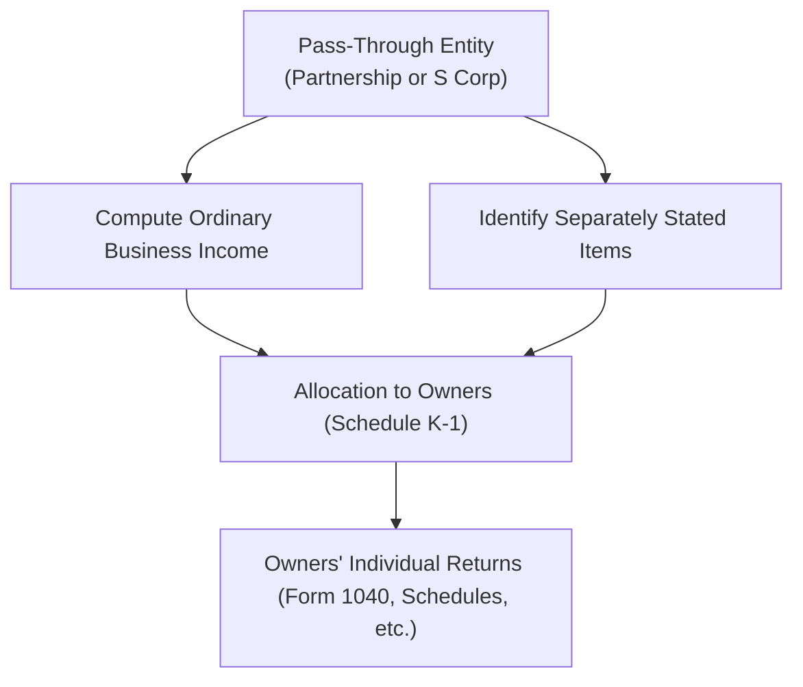

## 17.1 Partnership and S Corporation Flow-Through Items

In the U.S. tax system, Partnerships (Form 1065) and S Corporations (Form 1120-S) are known as “flow-through entities” or “pass-through entities.” Rather than paying tax on their income at the entity level (like a regular C Corporation generally does), these entities distribute or “flow” their income, losses, deductions, and credits down to the individual owners, who then report these items on their personal tax returns. This approach can provide advantages like the avoidance of double taxation, but it also requires owners to be well aware of the potential self-employment tax consequences that differ between Partnerships and S Corporations.

This section provides a comprehensive overview of how Partnerships and S Corporations report ordinary business income as well as separately stated items, and examines the key tax implications for both types of entities. We also delve into how these differences affect self-employment taxes, illustrated through practical scenarios and examples.

---

## Understanding the Concept of Flow-Through

A “flow-through” or “pass-through” entity does not generally pay federal income tax at the entity level. Instead, all income items that would otherwise be taxed at the corporate level “flow through” to the individual owners. Each owner is responsible for paying taxes on their share of the entity’s income, subject to various rules about character (ordinary vs. capital), deductibility, credits, and other considerations.

### Why Flow-Through?

• Avoiding Double Taxation: C Corporations pay taxes at the corporate level, and shareholders pay taxes again on dividends. Flow-through entities aim to avoid that double layer of tax.  
• Better Alignment of Income and Deductions: Income, losses, deductions, and credits “flow” to partners or shareholders. This provides greater flexibility in claiming these items and planning taxes at the individual level.

---

## Ordinary Business Income vs. Separately Stated Items

When a flow-through entity files its information return (Form 1065 for a Partnership, Form 1120-S for an S Corporation), it divides its financial results into two categories:

1. Ordinary Business Income (or Loss)  
2. Separately Stated Items

This is crucial because different items often require different tax treatments when owners file their individual tax returns.

### Ordinary Business Income

“Ordinary business income” incorporates the net results of the entity’s trade or business. It typically includes:
• Revenues from the entity’s primary business operations  
• Operating expenses such as salaries, rent, depreciation, utilities, and other costs  
• Processing the net profit (or net loss) from typical activities

For Partnerships, a partner’s share of ordinary business income may be subject to self-employment tax, depending on the nature of the partnership interest and whether the partner is considered a general partner or limited partner. By contrast, S Corporation shareholders generally do not treat their share of ordinary flow-through income as self-employment income (although S Corporation owners who also work in the business must receive reasonable compensation subject to employment taxes).

### Separately Stated Items

“Separately stated items” are those that the tax law requires to be handled at the individual owner’s level, often because these items may have unique limitations, rates, or rules. Examples include:
• Capital gains and losses  
• Charitable contributions  
• Section 179 expense deductions  
• Interest income and dividends  
• Foreign taxes paid or accrued  
• Investment interest expense  

Since these items may be subject to special treatment on an individual’s return (e.g., charitable contribution limitations, preferential capital gains rates, passive activity limitations), they must be presented separately on the Schedule K (entity level) and passed through on each owner’s Schedule K-1.

---

## Reporting Mechanism: Schedule K and Schedule K-1

Both Partnerships and S Corporations provide a detailed analysis of how total operating results, deductions, and credits break out between ordinary business income and separately stated items. This information is listed on the entity’s Schedule K. Each owner then receives a separate Schedule K-1 that specifies their share of each item. Many owners must then carry over these various K-1 items into their personal Form 1040—often in multiple places (Schedule E, Schedule A, Form 8949, etc.) depending on the type of income or deduction.

For Partnerships (Form 1065):  
• Page 1 calculates ordinary business income (or loss).  
• Schedule K lists all separately stated items.  
• Each partner’s K-1 breaks down their share.

For S Corporations (Form 1120-S):  
• Page 1 calculates ordinary business income (or loss).  
• Schedule K shows the aggregate separately stated items.  
• Schedule K-1 is given to each shareholder.

---

## Self-Employment Tax Implications

One of the biggest distinctions between Partnerships and S Corporations is the way self-employment taxes apply.

### Partnerships

• General Partner Status: A general partner’s distributive share of a partnership’s ordinary business income is generally subject to self-employment tax, along with any guaranteed payments for services provided to the partnership.  
• Limited Partner Status: If a partner is a “limited partner” for tax purposes, that partner’s passive share of ordinary income is typically not subject to self-employment tax, though guaranteed payments for services may be subject to self-employment tax.  
• LLC Members: For multi-member LLCs taxed as Partnerships, whether members are subject to self-employment tax depends on their role and the nature of their membership interest. IRS guidance generally looks at whether members are actively involved or more “limited” in their responsibilities.

### S Corporations

• Reasonable Compensation Requirement: An S Corporation owner-employee is required to receive W-2 wages that reflect “reasonable compensation” for services rendered, which are subject to FICA and Medicare taxes.  
• Flow-Through Income: After paying the owner-employee a reasonable wage, the remaining ordinary business income flows to the shareholder and is not typically subject to self-employment tax.  
• Avoiding Excessive Distributions: The IRS scrutinizes S Corporations that pay minimal or no wages to shareholder-employees but regularly distribute significant profits. This could be recharacterized as wages and subject the distribution to back-taxes and penalties.

Example — Calculating Self-Employment Taxes for Partnership vs. S Corporation:

• Partnership Example: Kayla has a 35% general partner interest in a partnership. The partnership reports $300,000 of ordinary business income. Kayla’s share is $105,000. Because she is a general partner, her share of $105,000 is generally subject to self-employment tax (plus any guaranteed payment for her services).  
• S Corporation Example: Jonah owns 35% of an S Corporation. He works full-time in the corporation and receives a Form W-2 showing $60,000 of wages. Separately, the S Corporation reports $300,000 of ordinary business income. His 35% share ($105,000) flows through to him without being subject to self-employment tax. He pays only ordinary income tax on that portion (though his W-2 wages were subject to FICA and Medicare).

---

## Practical Example: Ordinary vs. Separately Stated Items

Sarah and Mike form SM Co., an S Corporation that manufactures specialty furniture. The S Corporation’s financial results for the tax year are as follows:

• Ordinary income from operations: $200,000  
• Long-term capital gain on the sale of a piece of equipment: $10,000  
• Charitable contributions to a qualified nonprofit: $4,000  

On Form 1120-S, SM Co. will report $200,000 as ordinary business income. The $10,000 long-term capital gain and $4,000 in charitable contributions will be “separately stated” on Schedule K. On Sarah’s and Mike’s individual Schedule K-1s, each will see their respective percentage share of these items.  

If Sarah owns 50% of SM Co. and Mike owns the other 50%, each K-1 will show:  
• $100,000 of ordinary income (50% of $200,000)  
• $5,000 long-term capital gain (50% of $10,000)  
• $2,000 charitable contribution (50% of $4,000)

Sarah and Mike each incorporate these items on their respective Form 1040s:  
• Ordinary income is reported typically on Schedule E (Supplemental Income and Loss).  
• The capital gain is entered on Schedule D and Form 8949.  
• Charitable contributions may be claimed on Schedule A, subject to various limitations.

---

## Detailed Illustration with Mermaid Diagram

Below is a simplified flow of how Partnerships and S Corporations pass income items to their owners:

Explanation:  
• The entity (Partnership or S Corp) first computes overall ordinary business income (box B).  
• Next, any items subject to special rules (e.g., charitable contributions, capital gains, Section 179, dividends) are recorded separately (box C).  
• Both types of items are then allocated to owners in proportion to ownership or per governing agreement (box D), and each owner reports them on their personal returns (box E).

---

## Best Practices and Common Pitfalls

### Best Practices

• Maintain Clear Records: Distinguish between ordinary and separately stated items from the outset. Good recordkeeping ensures smooth preparation of Schedule K and K-1.  
• Reasonable Compensation for S Corp Owners: Ensure owner-employees in S Corporations receive a reasonable wage to avoid potential IRS reclassification of distributions as wages.  
• Distinguish Partner Types: Partnerships should carefully evaluate who is an active partner (or general partner) vs. a limited partner to properly determine self-employment tax liabilities.  
• Plan for Tax Payments: Since there is no mandatory withholding on partnership or S Corporation flow-through income, owners may need to make estimated tax payments to avoid underpayment penalties.

### Common Pitfalls

• Failing to Separate Items: Merging together ordinary income and capital gains invalidates correct reporting on K-1s.  
• Underpaying Self-Employment Tax: Partners often misinterpret the self-employment rules, especially when they are active in the business.  
• Insufficient W-2 Compensation to S Corp Owners: Some S Corp owners try to minimize federal payroll taxes by taking distributions instead of wages. This can trigger IRS scrutiny and penalties.  
• Overlooking State-Level Variations: Many states have different rules (e.g., pass-through entity taxes, local addbacks, or exceptions) that can complicate flow-through reporting.

---

## Real-World Case Study: Medical Practice LLC

Dr. Taylor forms a multi-member LLC with two other doctors to operate a medical practice. They choose to be taxed as a Partnership. Each of the three partners is actively engaged in patient care. The practice’s net income is $900,000 for the year, which is fully attributable to the doctors’ active services.

1. Each doctor receives a guaranteed payment for certain responsibilities and for routine draws. Let’s assume each doctor receives a guaranteed payment of $50,000.  
2. After the guaranteed payments, the net remaining ordinary income passes through as $750,000 ($900,000 - $150,000 total guaranteed payments).  
3. Each partner has a 33⅓% interest and is actively engaged in the practice, so each is subject to self-employment tax on their share of the $750,000, plus the guaranteed payment.  

For instance, Dr. Taylor might have taxable income of $300,000 from the entity ($50,000 guaranteed payment + $250,000 share of net ordinary income). The entire $300,000 is generally subject to self-employment tax under the typical rules for active partners.

---

## Key Takeaways

• Flow-through entities (Partnerships and S Corporations) generally avoid entity-level taxation and pass income, deductions, credits, and gains/losses down to owners.  
• Ordinary business income typically consists of routine operating results, whereas separately stated items have special tax treatments (capital gains, charitable contributions, etc.).  
• Partnership owners (particularly general partners and active LLC members) often face self-employment tax on their share of income. In contrast, S Corporation owners receive W-2 wages subject to payroll taxes, but do not pay self-employment tax on their share of ordinary flow-through income.  
• Proper recordkeeping, adherence to “reasonable compensation” for S Corp owners, and meticulous separation of items are critical for compliance and to minimize audit risk.  

---

## References for Further Exploration

• IRS Publication 541, Partnerships: Offers detailed guidance on partnership structure, reporting, and taxation.  
• IRS Publication 589, Tax on Self-Employment (SE Tax): Explains self-employment tax rules for business owners.  
• IRS Publications and Instructions for Forms 1065 and 1120-S: Provide details on preparing entity-level returns and respective Schedules K-1.  
• AICPA Tax Section Materials: Offer professional insights on partnering and S Corporation strategies.  
• [Chapter 17.2: Separately Stated Items vs. Ordinary Income (Upcoming)] for deeper details on each separately stated item category.

---

## SEO-Optimized Quiz on Partnership and S Corporation Flow-Through Items



### Which of the following best describes why Partnerships and S Corporations are called "flow-through" entities?

- [x] Their income, losses, and deductions flow directly to the owners for tax purposes.  
- [ ] They pay taxes on income at both the entity and owner levels.  
- [ ] They are legally required to distribute all profits to the owners each month.  
- [ ] They must be organized under state law as trusts.  

> **Explanation:** Partnerships and S Corporations generally do not pay federal income tax at the entity level; instead, income, losses, deductions, and credits flow directly to the owners.

### Which item is most commonly considered a separately stated item on a Schedule K-1?

- [ ] Sales from the company’s main product line  
- [x] Charitable contributions  
- [ ] Routine payroll expenses  
- [ ] Interest on business loans  

> **Explanation:** Charitable contributions must be separately stated to retain their original character for individual tax purposes.

### In a Partnership, a general partner's share of ordinary business income is generally:

- [x] Subject to self-employment tax  
- [ ] Exempt from income tax  
- [ ] Treated as wage income  
- [ ] Subject only to Medicare tax but not Social Security  

> **Explanation:** A general partner’s share of ordinary business income is usually considered self-employment income and is therefore subject to self-employment tax.

### For S Corporation shareholder-employees, which of the following is TRUE regarding reasonable compensation?

- [x] They must be paid a reasonable wage subject to employment taxes before receiving distributions.  
- [ ] They can avoid all payroll taxes by taking only distributions.  
- [ ] They report all their income on Form 1099-NEC.  
- [ ] They receive guaranteed payments instead of wages.  

> **Explanation:** An S Corporation must pay its shareholders who work in the business a reasonable wage (W-2) subject to payroll taxes to avoid IRS reclassification of distributions as wages.

### Separately stated items include which of the following? (Select all that apply)

- [x] Charitable contributions  
- [ ] Operating revenue from normal business operations  
- [x] Capital gains  
- [ ] Depreciation of basic office furniture reported in ordinary income  

> **Explanation:** Charitable contributions and capital gains are examples of separately stated items because they have unique treatment at the individual taxpayer’s level.

### Which factor is used to determine each partner or shareholder’s share of flow-through income?

- [x] Ownership percentage or special allocations per the operating agreement/bylaws  
- [ ] Guaranteed payments only  
- [ ] A flat distribution formula mandated by the IRS  
- [ ] Seniority or time in business  

> **Explanation:** Typically, each owner's share of income is based on their ownership stake. Partnerships may use special allocations if they have substantial economic effect.

### When is a “general partner” generally NOT subject to self-employment tax?

- [ ] When they have a 50% or greater ownership  
- [ ] When they actively participate in management  
- [x] When they qualify as a limited partner or have only investment interest  
- [ ] When the partnership lacks net income  

> **Explanation:** General partners who are actively engaged usually pay self-employment tax. Limited partners generally do not, except on guaranteed payments for services.

### S Corporation ordinary business income flows through to shareholders and is typically:

- [x] Taxed at the shareholder’s individual income tax rate but not subject to self-employment tax  
- [ ] Exempt from both income tax and self-employment tax  
- [ ] Taxable only if distributions are made  
- [ ] Subject to self-employment tax but exempt from regular income tax  

> **Explanation:** S Corporation ordinary business income flows through to shareholders and is taxed at their personal rate. It is not subject to self-employment tax unless the IRS reclassifies distributions as wages.

### Which of the following statements about self-employment tax in Partnerships vs. S Corporations is TRUE?

- [x] General partners typically pay self-employment tax on their distributive share, while S Corporation shareholders generally do not.  
- [ ] S Corporation shareholders always pay self-employment tax on their entire K-1 distribution.  
- [ ] Partnerships never generate self-employment tax for their active owners.  
- [ ] Both Partnerships and S Corporations compute self-employment tax in the same way.  

> **Explanation:** Partnerships and S Corporations have distinct rules for self-employment tax. Active general partners usually pay S/E tax on their share of income, whereas S Corp shareholders generally do not unless recharacterized as wages.

### A multi-member LLC defaulted to Partnership status for federal tax purposes. The members are all actively involved. True or False: Their entire share of ordinary business income is typically subject to self-employment tax.

- [x] True  
- [ ] False  

> **Explanation:** Active members (similar to general partners) in a Partnership (or LLC taxed as a Partnership) generally pay self-employment tax on their share of the income, unless otherwise excluded by the limited partner rules or other exceptions.



---

## For Additional Practice and Deeper Preparation

### [Taxation & Regulation (REG) CPA Mock Exams](https://www.udemy.com/course/reg-cpa-mock-exams/?referralCode=55419EBD198F61530B12)

**Taxation & Regulation (REG) CPA Mocks:** 6 Full (1,500 Qs), Harder Than Real! In-Depth & Clear. Crush With Confidence!  

- Tackle full-length mock exams designed to mirror real REG questions.  
- Refine your exam-day strategies with detailed, step-by-step solutions for every scenario.  
- Explore in-depth rationales that reinforce higher-level concepts, giving you an edge on test day.  
- Boost confidence and minimize anxiety by mastering every corner of the REG blueprint.  
- Perfect for those seeking exceptionally hard mocks and real-world readiness.  

_Disclaimer: This course is not endorsed by or affiliated with the AICPA, NASBA, or any official CPA Examination authority. All content is for educational and preparatory purposes only._
