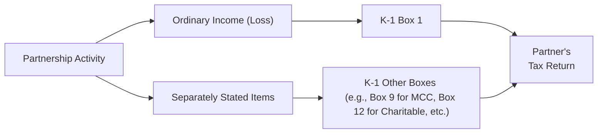

## 17.2 Separately Stated Items vs. Ordinary Income (Loss)

Pass-through entities such as partnerships (including LLCs taxed as partnerships) and S corporations do not pay federal income tax at the entity level. Instead, they “pass through” their profits, losses, and other tax attributes to owners, who then report the respective items on their personal or corporate tax returns. This process involves distinguishing between two categories:

• Ordinary (or non-separately stated) income (loss)  
• Separately stated items  

Although the entity’s total net profit or loss is central to tax reporting, certain tax attributes require special treatment due to their unique tax implications. These attributes are often called “separately stated items.” Understanding this distinction is crucial for accurately computing each partner’s or shareholder’s taxable income and ensuring compliance with federal tax rules.

This chapter covers the concept of ordinary income (loss) vs. separately stated items, provides examples such as Section 179 deductions and charitable contributions, and discusses special allocations. We will also examine how these items are presented on Schedule K (for an S corporation) and Schedule K-1 (for both partnerships and S corporations), as well as the rationale behind classifying specific items separately.

-------------------------------------------------------------------------------

### Overview of Pass-Through Income Reporting

When a partnership or S corporation files its return, it first calculates its overall net profit or loss from the entity’s business operations. From this net figure, items that have special tax treatment, such as capital gains or charitable contributions, are segregated to be “separately stated.”

• Ordinary income (loss) typically includes the results of the routine trade or business activities (e.g., revenue from selling goods or services minus ordinary operating expenses).  
• Separately stated items often include investment-related income, capital gains and losses, certain deductions (e.g., charitable contributions, Section 179 expenses), specific tax credits, and other items subject to limitations or distinct tax rates at the individual or corporate level.

Owners combine their share of ordinary income (loss) with their portion of separately stated items, applying any relevant limitations under the Internal Revenue Code (IRC). Each item can affect the owners’ final tax liability differently, which is why accurate segregation is necessary.

-------------------------------------------------------------------------------

### Understanding Ordinary Income (Loss)

Ordinary income (loss) from a pass-through entity is the net business profit or loss arising from day-to-day operations, excluding items that must be reported separately. Examples of income or loss that typically fall under this category include:

• Sales revenue from the principal line of business  
• Cost of goods sold (COGS)  
• Regular operating expenses (e.g., wages, rent, utilities)  
• Depreciation expense (to the extent it is not treated as a separately stated Section 179 deduction)  
• Guaranteed payments to partners (for partnerships, these can affect the calculation of ordinary income but may have additional reporting requirements elsewhere)

Once the entity determines its total ordinary income (loss), each owner’s pro rata or allocated share is reported as a single figure on the respective owner’s return. For partnerships, ordinary business income (loss) is provided in Box 1 of Schedule K-1 (Form 1065). For S corporations, ordinary income (loss) is provided in Box 1 of Schedule K-1 (Form 1120-S).

-------------------------------------------------------------------------------

### Separately Stated Items: Key Concept

Separately stated items are those items of income, loss, deduction, or credit that, by statute or regulation, must be reported independently by each partner or shareholder. The reason behind this separate treatment is that these items may be subject to specific limitations, tax rates, or preferences at the partner/shareholder level. The Internal Revenue Service (IRS) requires these items to be broken out in order to:

1. Ensure appropriate application of individual (or corporate) tax rules.  
2. Enable partners or shareholders to claim or apply special deductions, credits, or limitations correctly.  
3. Facilitate accurate computation of each owner’s Adjusted Gross Income (AGI), taxable income, and potential phase-outs or add-backs.

**Common Examples of Separately Stated Items**  
• Charitable contributions  
• Section 179 deductions  
• Net capital gains or losses  
• Portfolio income (interest, dividends)  
• Investment interest expense  
• Foreign taxes paid  
• Tax credits (e.g., energy credits, research credits, low-income housing credits)  
• Net rental real estate income (loss), if treated separately  
• Certain distributions or dividends from C corporations owned by the S corporation or partnership

-------------------------------------------------------------------------------

### Common Separately Stated Items in Detail

Below are a few key examples of separately stated items and how they may affect partners or shareholders:

#### 1. Section 179 Deduction

A Section 179 deduction allows a taxpayer to elect to expense (rather than capitalize) the cost of qualifying property—typically tangible personal property—up to certain statutory limits. Within a pass-through entity:

• The entity allocates the allowable Section 179 deduction among partners or shareholders.  
• Each owner separately applies the Section 179 limitation at the individual level. The total deduction cannot exceed their taxable income from active trade or business activities (including wages and other pass-through income), and it is also subject to the overall maximum set by the IRC.  

Because of these individual limitations, the Section 179 deduction must be stated separately, ensuring each owner calculates the allowable deduction based on their specific tax situation.

#### 2. Charitable Contributions

Charitable contributions are deductible within certain percentage limitations relative to an individual’s adjusted gross income (AGI) or a corporation’s taxable income. When a pass-through entity makes a qualifying donation:

• The total amount of charitable contributions is separately stated on the entity’s Schedule K.  
• Each owner reports their allocable share of the contribution on their personal or corporate return.  
• Owners must track the limitation that restricts how much may be deducted in a single tax year, potentially carrying forward excess amounts if allowable under the IRC.

Due to the unique percentage limitations and the requirement to substantiate charitable donations, charitable contributions cannot be lumped into the entity’s ordinary income (loss).

#### 3. Net Capital Gains (Losses)

Capital gains or losses differ in their tax treatment when compared to ordinary income. Short-term capital gains may be taxed at ordinary rates for individuals, whereas long-term capital gains may benefit from preferential rates. Because these gains and losses are computed separately, they must be stated individually on the owners’ returns:

• Each partner/shareholder determines their share of capital gains (short-term or long-term), which can then be netted with any personal capital gains or losses they have from other activities.  
• Preferential rates, carryforwards, and loss limitations are calculated at the individual or corporate level.

#### 4. Rental Real Estate and Investment Income

A pass-through entity may own rental property or hold various investment assets. Income or loss from rental real estate often has specific limitations and classification rules (e.g., passive activity loss limitations). Likewise, dividend and interest income may be subject to different tax rates and limitations:

• Rental real estate income (loss) is typically disclosed in a separate line on the entity’s K-1.  
• Dividend and interest income are also separately stated.  
• Partners or shareholders apply the passive activity and/or portfolio income rules at their individual level.

#### 5. Special Allocations

Partnerships, in particular, can employ “special allocations,” which are allocations of specific items of income, gain, loss, deduction, or credit in a manner different from each partner’s overall ownership interest. For the allocation to be respected (i.e., recognized by the IRS), it must have “substantial economic effect,” meaning it must be consistent with profit/loss sharing provisions in the partnership agreement and not merely designed to manipulate tax burdens. Common special allocations include:

• Specially allocating depreciation deductions to partners needing current-year losses.  
• Allocating gains on the sale of a property to the partner who put forth additional capital or bore substantial risk.  
• Assigning Section 179 deductions to partners with sufficient active income to benefit from the deduction.

Since special allocations often apply to the precise items that must be separately stated, such as depreciation or gains from the sale of property, understanding how these items flow through to each partner becomes even more critical.

-------------------------------------------------------------------------------

### Reporting Mechanics on Schedule K and Schedule K-1

Both partnerships and S corporations file a tax return that includes two key parts for reporting pass-through information:

• **Schedule K (Form 1065 for partnerships / Form 1120-S for S corporations)** — Summarizes the total amounts for ordinary income (loss) and all separately stated items at the entity level.  
• **Schedule K-1** — Informs each owner of their distributive or pro rata share of ordinary income (loss) and separately stated items.

Each line item on Schedule K typically corresponds to a line on Schedule K-1, ensuring that owners receive sufficient detail to properly report the amounts on their personal or corporate returns. Partnerships must adhere to the partnership agreement’s allocation provisions (or general statutory rules, if no special allocations apply). S corporations generally apportion items based on stock ownership percentages, adjusted for any changes in ownership throughout the year.

Below is a simplified example of how a partnership might organize its financial results to segregate ordinary income from separately stated items:

• Regular trade or business income (revenues minus expenses): $500,000 (included in ordinary income)  
• Net capital gain from investment asset sale: $50,000 (separately stated)  
• Charitable contribution to a local non-profit: $10,000 (separately stated)  
• Section 179 deduction of $20,000 (separately stated)  

Schedule K (Form 1065) will show $500,000 as ordinary income, with $50,000, $10,000, and $20,000 each stated separately on the appropriate lines. Each partner’s K-1 will then reflect their share of each line item.

-------------------------------------------------------------------------------

### Practical Illustration with a Partnership

Consider Maple Grove Partners, a partnership with two equal partners (Taylor and Jordan). The partnership’s total net profit from operations is $200,000. Additionally, it has a long-term capital gain of $10,000 from the sale of investment securities, and it donates $2,000 to a qualified charitable organization.

1. **Step 1: Calculate Ordinary Income (Loss)**  
   – Maple Grove’s ordinary business income is $200,000, which will be split 50-50 between Taylor and Jordan. Each partner gets $100,000 of ordinary income.  

2. **Step 2: Separately Stated Items**  
   – The partnership has a $10,000 long-term capital gain. This is separately stated on the partners’ K-1s in a ratio of 50-50, giving each partner $5,000.  
   – The partnership’s $2,000 charitable contribution is also separately stated. Each partner gets $1,000 allocated for charitable contributions.  

3. **Step 3: Reporting at the Partner Level**  
   – Taylor’s K-1: $100,000 ordinary income, $5,000 long-term capital gain, $1,000 charitable contribution.  
   – Jordan’s K-1: $100,000 ordinary income, $5,000 long-term capital gain, $1,000 charitable contribution.  

4. **Step 4: Filing with Individual Returns**  
   – Taylor and Jordan each combine the $100,000 ordinary income with any other ordinary income they have.  
   – They report the $5,000 long-term capital gain on Schedule D of their individual returns, applying the beneficial long-term rates if all requirements are met.  
   – They add the $1,000 charitable contribution to any other contributions on Schedule A (if they are itemizing deductions) and must observe the AGI limitation rules.  

While simple, this illustration shows how pass-through entities “break out” items according to their tax significance rather than lumping them together.

-------------------------------------------------------------------------------

### Comparing Partnership vs. S Corporation Reporting

Although partnerships and S corporations share the concept of passing through income items to their owners, there are nuances:

1. **Allocations**:  
   • Partnerships can assign different items to different partners through the partnership agreement’s special allocations.  
   • S corporations must allocate items pro rata based on the number of shares owned by each shareholder (one class of stock, though voting vs. non-voting is allowed, cannot affect allocation of profits).

2. **Self-Employment Tax**:  
   • In a partnership, a general partner’s share of ordinary income is often subject to self-employment tax. Limited partners, under certain conditions, might avoid self-employment tax on their distributive earnings.  
   • In an S corporation, shareholder wages must be paid to owners who perform services (e.g., as employees), but the remaining allocated profits are not subject to self-employment tax.  

3. **Operating Losses**:  
   • Both partnerships and S corporations allow losses to pass through to owners, subject to basis, at-risk, and passive activity rules.  
   • Effective tracking of basis is key for claiming losses (see Chapter 17.3 for coverage of basis calculations and loss utilization).

4. **Fringe Benefits**:  
   • Certain benefits for S corporation employees may be treated differently if the recipient owns more than 2% of the S corporation’s stock.  
   • Partners often do not receive the same tax-favorable treatment of some fringe benefits.

Despite these differences, the principle of separately stating items is consistent across both entity types.

-------------------------------------------------------------------------------

### Implications for Tax Planning and Strategy

• **Optimizing Section 179**: Owners in higher tax brackets or with sufficient active income can benefit more from a large Section 179 deduction. Partnerships might specially allocate the deduction to those partners, provided the allocation meets substantial economic effect criteria.  
• **Timing Charitable Contributions**: Because charitable contributions are capped at certain percentages of AGI for individuals, pass-through entities may consider timing or bundling contributions to maximize deductibility for their owners.  
• **Leveraging Special Allocations**: Partnerships can strategically allocate income, deductions, gains, and credits to align with partners’ economic contributions, risk tolerance, or tax profiles.  
• **Multi-State or Nexus Issues**: Certain states have unique rules for pass-through entities. Some states require composite returns or entity-level taxes. Owners and practitioners must account for both federal and state standpoints, especially if items like credits or net operating losses are involved.  
• **Basis Tracking**: Owners should maintain accurate records of their stock or partnership basis, as well as any debt basis (particularly for S corporations and recourse/nonrecourse allocations in partnerships) to properly handle losses and distributions.

-------------------------------------------------------------------------------

### Common Pitfalls and Best Practices

1. **Failure to Break Out Items**: Combining all income and expenses into a single net figure can lead to missed opportunities for preferential rates, additional deductions, or mandated limitations.  
2. **Incorrect Basis Calculations**: Overlooking basis adjustments (contributions, distributions, share of income, or special allocations) can lead to errors when utilizing losses or taking deductions.  
3. **Misclassification of Passive vs. Active Income**: Rental and investment income might be incorrectly classified as ordinary business income, affecting how limitations and rates apply.  
4. **Insufficient Documentation**: Special allocations require documentation in the partnership agreement. Failing to maintain clear records or an updated agreement can result in the IRS rejecting the allocation.  
5. **Overlooked Credits**: Certain credits (e.g., research and development credits) must be separately stated. Misreporting can cause owners to lose potentially valuable credits.

**Best Practices**  
• Review the entity’s profit-and-loss statements with an eye for separately stated items before preparing the return.  
• Maintain detailed workpapers that reconcile book to tax treatments, especially for special allocations.  
• Communicate early and often with the owners (partners/shareholders) so they understand the potential personal tax implications of various items.  
• Engage in year-end tax planning for items like Section 179, charitable contributions, and capital transactions.

-------------------------------------------------------------------------------

### Visualizing the Process with a Diagram

Below is a simplified Mermaid diagram illustrating the distinction between ordinary income (loss) and separately stated items in a pass-through entity’s reporting.

• A["Partnership Activity"] represents the entity’s total economic results.  
• B["Ordinary Income (Loss)"] and C["Separately Stated Items"] demonstrate the bifurcation.  
• D["K-1 Box 1"] and E["K-1 Other Boxes..."] show different lines on the partner’s K-1.  
• Finally, items flow into F["Partner's Tax Return"], where limitations and rates apply individually.

-------------------------------------------------------------------------------

### References for Further Study

• IRS Publication 925: Passive Activity and At-Risk Rules  
• IRS Publication 542: Corporations (for S corporations and fringe benefit guidance)  
• IRC §179 (Election to Expense Certain Depreciable Business Assets)  
• IRC §702 (Income and Credits of Partner)  
• Chapters 16 and 17.3 of this text for deeper insights on loss limitations, at-risk rules, and basis calculations  

Staying current with IRS guidelines, reading relevant tax publications, and cross-referencing official forms and instructions will help practitioners and students master the nuances of separately stated items and ordinary income (loss).

-------------------------------------------------------------------------------

## Maximize Your Skills: Separately Stated Items vs. Ordinary Income (Loss) Quiz



### Which of the following best describes the primary reason certain items are “separately stated” on Schedule K-1 for pass-through entities?

- [x] They may be subject to different limitations or rules at the partner/shareholder level.
- [ ] They are calculated based on the entity’s tax bracket, not the owner’s tax bracket.
- [ ] They cannot be deducted by individuals under any circumstances.
- [ ] They are exempt from all income tax liabilities.

> **Explanation:** The main rationale for separately stated items is that these items are subject to unique tax rates or limitations at the owner level, such as charitable contribution percentage limits or capital gain rates.

### Section 179 expenses are separately stated because:

- [x] Each owner’s deduction is limited by their personal income and statutory thresholds.
- [ ] Partnerships cannot claim the deduction directly, so it is disallowed at the entity level.
- [ ] The IRS always requires that depreciation recapture be applied at the entity level.
- [ ] Section 179 expenses only apply to passive investors.

> **Explanation:** Section 179 deductions must be allocated and then limited at each partner’s or shareholder’s level. They have individual limitations based on active trade or business income.

### A partnership generates $100,000 of ordinary income, $10,000 of charitable contributions, and $5,000 of long-term capital gain. Which of the following amounts would be allocated to ordinary business income on a partner’s K-1 if they have a 50% partnership interest?

- [x] $50,000
- [ ] $55,000
- [ ] $52,500
- [ ] $60,000

> **Explanation:** The partner’s 50% interest entitles them to $50,000 of the $100,000 ordinary income. The remaining $10,000 charitable contributions and $5,000 long-term capital gain are separately stated items.

### Which statement about special allocations is correct?

- [x] They must adhere to the substantial economic effect rule to be respected by the IRS.
- [ ] They allow a partnership to allocate all losses to one partner with no capital or involvement.
- [ ] They automatically convert ordinary income into capital gains for preferential tax treatment.
- [ ] They are only valid for S corporations that have more than one class of stock.

> **Explanation:** Special allocations need substantial economic effect, meaning they must reflect genuine economic arrangements rather than merely shifting tax benefits and burdens arbitrarily.

### For S corporations, separately stated items:

- [x] Must be allocated proportionately to owners based on their ownership percentage.
- [ ] May be allocated entirely to the shareholder with the highest basis.
- [ ] Are taxed at the entity rate before flowing through to each shareholder.
- [ ] Are reported only if the S corporation’s total income exceeds $250,000 for the year.

> **Explanation:** By default, S corporations generally allocate all income (including separately stated items) based on each shareholder’s ownership percentage. Special allocations are not permitted in an S corporation if it maintains only one class of stock.

### A partner’s at-risk and passive activity limitations might reduce or eliminate their ability to claim:

- [x] Their distributive share of losses or deductions.
- [ ] Any capital gains distributed by the partnership.
- [ ] Guaranteed payments for services rendered to the partnership.
- [ ] Dividend income from an unrelated corporation.

> **Explanation:** At-risk and passive activity rules primarily restrict how much of a partnership’s losses or deductions can be used by the individual. They do not apply to guaranteed payments for services or unrelated dividend income.

### Which of the following items is least likely to be separately stated on a pass-through return?

- [x] Salaries and wages paid to employees.
- [ ] Charitable contributions.
- [ ] Section 179 deductions.
- [ ] Net Long-Term Capital Gains.

> **Explanation:** Salaries and wages to employees typically reduce ordinary business income. They do not usually appear as a separately stated item like capital gains, charitable contributions, or Section 179 deductions.

### In a partnership, the total charitable contribution deduction shown on Schedule K must:

- [x] Match the sum of all charitable contribution amounts reported on individual partners’ K-1s.
- [ ] Exceed the total of all distributions made during the year.
- [ ] Completely offset any ordinary losses reported by the partnership.
- [ ] Be allocated according to the shortest possible tax year.

> **Explanation:** The sum of the charitable contributions allocated on partners’ K-1s should be equal to what’s reported on Schedule K at the partnership level. Discrepancies can lead to filing errors and IRS inquiries.

### If a partnership has $300,000 in ordinary income and a separately stated short-term capital loss of $10,000, how should this be reflected on each partner’s Schedule K-1 if there are two 50% partners?

- [x] Each partner’s K-1 would show $150,000 in ordinary income and $5,000 in separately stated short-term capital loss.
- [ ] Each partner’s K-1 would show $290,000 in ordinary income and a $10,000 short-term loss.
- [ ] One partner would get all the ordinary income and the other all the loss if they choose a special allocation.
- [ ] The total short-term capital loss would reduce ordinary income at the entity level from $300,000 to $290,000.

> **Explanation:** Each 50% partner is allocated half of the partnership’s income and half of the separately stated short-term capital loss. They must individually account for the capital loss when calculating their net capital gains or losses.

### A partnership that plans to maximize tax benefits from Section 179 expenses and charitable contributions might consider special allocations if:

- [x] The allocations adhere to substantial economic effect and reflect legitimate economic arrangements.
- [ ] The IRS has granted the partnership blanket permission to change allocations at any time.
- [ ] The tax benefits only apply to partners that own 51% or more of the partnership.
- [ ] They are laid out verbally without an updated written partnership agreement.

> **Explanation:** Special allocations can offer good planning opportunities, but they must meet substantial economic effect requirements, and be documented in the partnership agreement or properly amended.



-------------------------------------------------------------------------------

## For Additional Practice and Deeper Preparation

### [Taxation & Regulation (REG) CPA Mock Exams](https://www.udemy.com/course/reg-cpa-mock-exams/?referralCode=55419EBD198F61530B12)

Taxation & Regulation (REG) CPA Mocks: 6 Full (1,500 Qs), Harder Than Real! In-Depth & Clear. Crush With Confidence!

- Tackle full-length mock exams designed to mirror real REG questions.  
- Refine your exam-day strategies with detailed, step-by-step solutions for every scenario.  
- Explore in-depth rationales that reinforce higher-level concepts, giving you an edge on test day.  
- Boost confidence and minimize anxiety by mastering every corner of the REG blueprint.  
- Perfect for those seeking exceptionally hard mocks and real-world readiness.

_Disclaimer: This course is not endorsed by or affiliated with the AICPA, NASBA, or any official CPA Examination authority. All content is for educational and preparatory purposes only._
