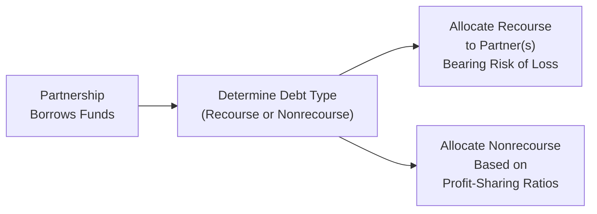
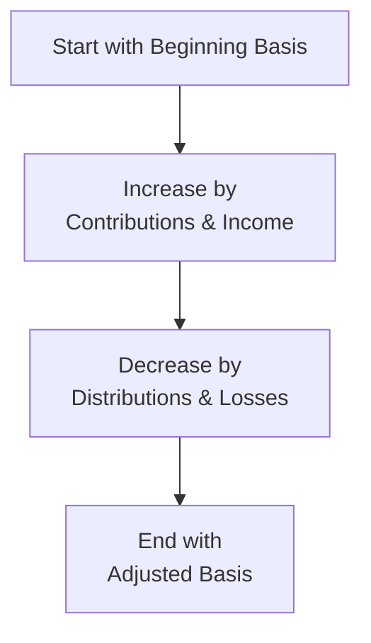

## 17.3 Basis Calculations and Loss Utilization

Pass-through entities, such as partnerships and S corporations, provide a powerful structure by allowing tax items (income, losses, deductions, credits) to “flow through” to owners or investors. However, the ability to claim deductions or losses at the owner level involves complex rules for determining the owner’s “basis” in the entity. Understanding these rules is vital not only for compliance but also for strategic decision-making.

In this section, we will examine:

• The concept of outside basis in a partnership and shareholder basis in an S corporation  
• How various transactions (including debt allocations) change an owner’s basis  
• The significance of basis in determining loss utilization  
• Practical examples, case studies, and best practices for computing basis adjustments  

Whether you are preparing for the REG section of the CPA Exam or seeking a deeper understanding of basis rules in pass-through entities, this comprehensive guide will reinforce your knowledge and help you navigate real-life scenarios.

--------------------------------------------------------------------------------

## Key Concepts in Basis

“Basis” represents an owner’s investment in a partnership or S corporation. Because pass-through entities themselves generally do not pay income tax at the entity level, calculations for each owner’s basis are critical in determining:

• The maximum amount of pass-through losses that an owner can deduct  
• The taxation of distributions received from the entity  
• Gain or loss when an owner disposes of the interest  

Understanding how basis is determined and adjusted is essential for accountants, tax preparers, and business owners.

### Outside Basis vs. Inside Basis (Partnership Context)

In a partnership setting, two important basis concepts exist:

• Inside Basis: The adjusted basis that the partnership has in its assets.  
• Outside Basis: The basis that each partner has in the partnership interest itself.  

When discussing partner-level loss limitations, the relevant focus is the “outside basis.” Securities, equipment, and other assets owned by the partnership have an “inside basis” from the partnership’s perspective. However, each partner individually tracks how much they have invested—monetarily and otherwise—into the partnership, which is their “outside basis.”

### Shareholder Basis in S Corporations

Shareholder basis in an S corporation serves a similar function as outside basis in a partnership. It quantifies the shareholder’s economic investment in the entity and governs the amount of tax-free distributions and allowable deductions/passthrough losses. Although the concept is similar, S corporations have unique adjustments and limitations, as the corporation itself may not allocate debt to shareholders in the same manner that a partnership does to partners.

--------------------------------------------------------------------------------

## Initial Basis Calculations

### Partnership Outside Basis

A partner’s initial outside basis is usually equal to the amount of cash and the fair market value (FMV) of any property contributed, minus any debt assumed by the partnership if the partner is relieved of personal liability. If a partner contributes an asset with a built-in gain or built-in loss, special allocation rules under Internal Revenue Code (IRC) Section 704(c) apply, but that primarily affects the partnership’s inside basis and allocation of gains/losses rather than the partner’s outside basis directly.

Example (Partnership Formation):  
• Partner A contributes $50,000 of cash.  
• Partner B contributes a parcel of land with a basis of $30,000 and an FMV of $50,000 (no mortgage).  

Partner A’s initial outside basis: $50,000 (the cash contributed).  
Partner B’s initial outside basis: $30,000 (the carryover basis of the contributed land).  

Even though the FMV of the land is $50,000, Partner B’s initial outside basis is $30,000, reflecting carryover basis rules for contributed property.

### S Corporation Shareholder Basis

A shareholder’s initial basis in an S corporation is determined by the cost of the shares purchased or the carryover basis of contributed property if the shares are received in exchange for a property contribution under IRC Section 351 (assuming valid S status). Unlike partnerships, shareholders generally do not get basis from corporate-level debt unless they personally lend money to the corporation.

Example (S Corporation Formation):  
• Shareholder X contributes $30,000 of cash for 100% of the corporation’s stock.  
• Shareholder Y contributes equipment worth $50,000 with a basis of $20,000 in exchange for 100% of the corporation’s stock. (For simplicity, assume one scenario at a time.)  

Shareholder X’s initial basis: $30,000 = amount of money contributed for shares.  
Shareholder Y’s initial basis: $20,000 = the carryover basis of the contributed equipment.

--------------------------------------------------------------------------------

## Basis Adjustments and Ongoing Calculations

After the initial basis is established, it undergoes annual (and sometimes more frequent) adjustments. These basis adjustments generally follow a logical order:

1. Basis is increased by:  
   • The partner or shareholder’s distributive share of taxable and tax-exempt income  
   • Additional contributions made during the year  
   • Certain debt allocations (for partnerships only)  

2. Basis is decreased by:  
   • Distributive share of losses and deductions (including nondeductible expenses for partnerships)  
   • Distributions received from the entity  
   • Any other basis-reducing transactions (e.g., casualty losses, worthless securities in certain contexts)  

The sequencing matters. Typically, items of income increase basis before any loss items reduce basis within the same tax year. This prevents a partner’s or shareholder’s basis from going below zero prematurely.

### Partnership Basis Adjustment Example

Assume Partner A starts the year with an outside basis of $50,000. During the year, the partnership:  
• Generates $10,000 of ordinary income allocated to Partner A.  
• Distributes $5,000 to Partner A.  
• Allocates $3,000 of losses to Partner A.  

Partner A’s basis would be adjusted:  
• Begin with $50,000.  
• Add the $10,000 share of income: New basis = $60,000.  
• Subtract the $5,000 distribution: New basis = $55,000.  
• Subtract the $3,000 of losses: New basis = $52,000.  

### S Corporation Basis Adjustment Example

Shareholder X starts the year with a stock basis of $30,000. During the year, the S corporation:  
• Generates $8,000 of ordinary income allocated to X.  
• Distributes $4,000 to X.  
• Allocates $2,000 of losses to X.  

Shareholder X’s basis would be adjusted:  
• Begin with $30,000.  
• Add the $8,000 share of S corporation income: New basis = $38,000.  
• Subtract the $4,000 distribution: New basis = $34,000.  
• Subtract the $2,000 of losses: New basis = $32,000.  

--------------------------------------------------------------------------------

## Debt Allocations and Their Impact on Basis

Though partnerships and S corporations can both borrow money, debt often affects basis in a different manner depending on the entity type.

### Partnership Debt and Outside Basis

Partnership debt allocations can increase or decrease a partner’s outside basis. If a partner is considered to bear the economic risk of loss (i.e., is personally liable or effectively liable for repayment), then that debt is typically allocated to the partner’s outside basis. The categorization of debt into recourse vs. nonrecourse can directly influence which partner(s) receive increases in their outside basis.  

• Recourse Debt: A partner with personal liability or economic risk of loss generally gets the basis increase.  
• Nonrecourse Debt: Typically allocated based on profit-sharing ratios unless special allocations under the regulations apply.  

If the partnership repays a debt or a debt is reallocated among partners, that shift can decrease one partner’s outside basis and increase another’s. By extension, that reallocation can trigger gain recognition if a partner’s outside basis becomes negative.

#### Recourse vs. Nonrecourse Debt in Partnerships (Diagram)

Below is a simple Mermaid diagram illustrating how debt might be allocated in a partnership:

### S Corporation Debt and Shareholder Basis

One major difference between partnerships and S corporations is that S corporation debt typically does not increase the shareholder’s stock basis. Shareholders can only increase basis if they lend money directly to the S corporation. If a bank lends money to the S corporation (and only the corporation is liable), that loan generally will not boost basis for shareholders who do not personally guarantee or lend the funds themselves.

Hence, if a shareholder personally lends funds to the S corporation, a separate “debt basis” is created. Losses can be used to reduce this debt basis, but only after reducing stock basis to zero. Tracking these two components (stock basis and debt basis) is crucial for proper utilization of S corporation losses.

--------------------------------------------------------------------------------

## Loss Utilization and Limitations

### Basis Limitation

Owners in pass-through entities cannot deduct losses (or claim deductions) in excess of their basis. If losses exceed a partner’s or shareholder’s basis at year-end, those excess losses become “suspended” or carried forward indefinitely, subject to increases in basis in subsequent years.

#### Ordering Rules for Partnership and S Corporation Losses

1. Basis Limitation: Losses limited to the partner’s/shareholder’s adjusted basis in the entity.  
2. At-Risk Limitation: Even if a partner has basis, the at-risk rules under IRC § 465 can further restrict the loss to the amount economically “at risk.”  
3. Passive Activity Loss (PAL) Limitation: If the activity is passive for the individual taxpayer, the passive loss limitations apply under IRC § 469.  

### At-Risk Rules

For partnerships and S corporations, an owner’s losses are limited to the amount at risk in the activity. Generally, “at risk” means the amount of cash plus the adjusted basis of property contributed and certain forms of recourse debt. Nonrecourse debt (where the taxpayer is not personally at risk of loss) typically does not increase the individual’s at-risk amount, with some exceptions for real estate activities.

### Passive Activity Loss Rules

Even if a taxpayer has sufficient basis and is at risk for the amounts, if the partner or shareholder does not materially participate in the business (deemed a passive activity), the losses might still be disallowed under the passive activity loss (PAL) rules. Suspended passive losses can only offset passive income or be released entirely upon a taxable disposition of the activity.

--------------------------------------------------------------------------------

## Illustrative Case Study

Consider a hypothetical partnership, Evergreen LLC, and two partners, Lisa and Mark:

• Lisa invests $50,000 cash, obtains a 50% interest, and personally guarantees $20,000 of the partnership’s bank loan.  
• Mark contributes equipment with a basis of $30,000 and an FMV of $50,000, obtains a 50% interest, and does not guarantee any portion of the partnership’s bank loan.  

At formation:  
• Lisa’s outside basis = $50,000 (cash) + $20,000 (recourse debt allocated to her) = $70,000.  
• Mark’s outside basis = $30,000 (carryover basis of the equipment) + $0 debt allocation = $30,000.  

During Year 1, Evergreen LLC has:  
• Net ordinary loss of $40,000 (50% allocated to each partner).  
• No distribution.  
• Repays $10,000 of the bank loan (reducing the recourse debt from $20,000 to $10,000).  

Year-End Adjustments:

1. Allocate the $40,000 loss:  
   • Lisa’s share: $20,000  
   • Mark’s share: $20,000  

2. Adjust Lisa’s basis for the loan repayment which reduces her allocated recourse debt from $20,000 to $10,000. This $10,000 debt relief effectively lowers her basis by $10,000.

Lisa’s basis calculation:  
• Starting basis: $70,000  
• Loss allocation: –$20,000 → $50,000  
• Debt relief reallocation: –$10,000 → $40,000  

End-of-year outside basis for Lisa: $40,000  

Mark’s basis calculation:  
• Starting basis: $30,000  
• Loss allocation: –$20,000 → $10,000  
• No debt relief reallocation (he was not guaranteeing the debt).  

End-of-year outside basis for Mark: $10,000  

Both Lisa and Mark are fully able to deduct their allocated losses, as each partner’s loss does not exceed the partner’s outside basis. If the partnership lost an additional $20,000 allocated to Mark, Mark would be limited by his $10,000 outside basis, leading to a $10,000 suspended loss carried forward.

--------------------------------------------------------------------------------

## Best Practices and Common Pitfalls

• Track basis annually. Waiting until a disposition of interest or an IRS audit can create confusion and mistakes.  
• Keep separate records for each category: partnership outside basis, S corporation stock basis, S corporation debt basis, and at-risk amounts.  
• Ensure correct allocation of recourse vs. nonrecourse debt in a partnership. Misallocating debt can lead to disallowed losses or unrecognized gain on distributions.  
• Do not overlook distributions. S corporation shareholders often forget that distributions must reduce basis—even if the distribution is just a transfer from an S corporation bank account.  
• Understand that disclaiming debt guarantees can significantly reduce basis for future loss deductions (particularly for partnerships).  

--------------------------------------------------------------------------------

## Practical Calculation Tables

Below is an example table illustrating annual basis calculations for a partner in a partnership. Assume the partner started the year with $100,000 of outside basis:

| Calculation Step                                      | Amount   | Updated Basis |
|-------------------------------------------------------|---------:|--------------:|
| Beginning Outside Basis                               |          | 100,000       |
| Plus: Allocable Share of Ordinary Income              |  25,000  | 125,000       |
| Plus: Allocable Share of Tax-Exempt Income            |   2,000  | 127,000       |
| Minus: Distributions Received                         | (10,000) | 117,000       |
| Minus: Allocable Share of Deductible Loss/Liabilities | (20,000) |   97,000      |
| Ending Outside Basis                                  |          |   97,000      |

--------------------------------------------------------------------------------

## Visualizing Basis Adjustments

Here is a Mermaid diagram that outlines how basis is adjusted each year in a pass-through entity:

Explanations:
• Step A (Beginning basis) – The prior year’s ending basis or the initial basis if in the first year.  
• Step B – Add any capital contributions, recourse debt allocations (partnership), or distributive income.  
• Step C – Subtract distributions and allocated losses.  
• Step D – Result: The partner/shareholder’s adjusted basis at year-end.

--------------------------------------------------------------------------------

## Strategies for Maximizing Loss Utilization

1. Capital Contributions: Making additional capital contributions before year-end can bolster basis, thus allowing the deduction of losses that might otherwise be suspended.  
2. Debt Guarantees (Partnerships): Partners might consider guaranteeing partnership debt (if economically feasible and appropriate from a liability standpoint) to increase their at-risk amount and thus facilitate a higher deductible loss.  
3. Timing of Distributions: Deferring distributions until the subsequent tax year can preserve basis for the current year’s loss deductions.  
4. Asset Purchases vs. Capitalization: Carefully structuring expenditures as immediate expenses (when allowable) vs. capital expenditures can influence the timing of basis adjustments and loss deductions.  
5. Interentity Loans (S Corporations): If the S corporation borrower needs basis, consider having shareholders lend money directly, thereby creating debt basis (note that the shareholder must be careful about personal risk and regulatory formalities).  

--------------------------------------------------------------------------------

## References for Additional Study

1. IRC § 704 and the corresponding Treasury Regulations – Debt allocation rules and partner basis issues.  
2. IRC § 1366 and § 1367 – Rules for S corporation basis adjustments and loss limitations.  
3. IRS Publication 541, Partnerships – Detailed guidance on basis calculation, distributions, and debt allocations.  
4. IRS Instructions for Form 1120-S – Guidance on shareholder basis worksheets.  
5. AICPA Statements on Standards for Tax Services (SSTS) – Professional standards for ensuring accurate tax reporting and compliance.  

Many advanced topics, such as partnership anti-abuse rules and disguised sales, further shape how basis is determined. Familiarity with these rules and consistent recordkeeping facilitates proper reporting and maximum benefit from tax deductions.

--------------------------------------------------------------------------------

## Quiz on Basis and Loss Utilization



### In a partnership, which concept best describes the partner’s ownership investment and is critical for determining the amount of allowable losses?

- [x] Outside basis
- [ ] Inside basis
- [ ] Partner’s capital account
- [ ] Guaranteed payment

> **Explanation:** “Outside basis” is the partner’s interest in the partnership and limits how much loss a partner can deduct. “Inside basis” is the partnership’s basis in its assets, which is a separate concept.

### Which of the following typically does NOT increase an S corporation shareholder’s stock basis?

- [x] Corporate borrowing from a bank without the shareholder’s personal guarantee
- [ ] Shareholder’s direct loan to the corporation
- [ ] Allocable share of S corporation taxable income
- [ ] Additional capital contribution by the shareholder

> **Explanation:** In S corporations, debt that is not personally guaranteed and is borrowed directly by the corporation does not increase the shareholder’s basis. Shareholder loans, contributions, and income allocations do increase basis.

### What happens if a partner’s allocated losses exceed the partner’s outside basis at year-end?

- [x] The excess losses are suspended and carried forward until the partner’s basis is sufficient
- [ ] The partner can deduct the losses if the at-risk and passive rules are met
- [ ] The partner must re-allocate the excess loss to other partners
- [ ] The partner must rectify the negative basis by a capital contribution within 60 days

> **Explanation:** If a partner’s share of losses exceeds outside basis, those losses are suspended until basis is restored (e.g., through additional contributions or income allocations).

### How is recourse debt generally allocated in a partnership?

- [x] To the partner(s) who bear the economic risk of loss
- [ ] According to each partner’s capital account balance
- [ ] According to each partner’s income/loss sharing percentage
- [ ] Equally between all partners

> **Explanation:** Recourse debt is allocated to the partner(s) who would be held personally liable in the event of default. This can differ from the partnership’s profit and loss sharing ratios.

### In an S corporation, how can a shareholder create or increase debt basis?

- [x] By lending funds directly to the S corporation
- [ ] By accelerating deductions at the corporate level
- [x] By personally guaranteeing a corporate debt only when the guarantee triggers actual economic outlay
- [ ] By having the corporation borrow from a bank solely in the corporate name

> **Explanation:** In most S corporation cases, the only way for a shareholder to create debt basis is an actual direct loan or an actual economic outlay on guaranteed debt. Simply guaranteeing a loan without an economic outlay typically does not establish shareholder basis.

### Which statement regarding at-risk rules is correct?

- [x] At-risk rules limit deduction of losses to amounts financially at risk
- [ ] Nonrecourse debt always increases the at-risk amount
- [ ] At-risk rules apply only to C corporations
- [ ] At-risk rules and basis rules are identical

> **Explanation:** At-risk rules restrict taxpayers from deducting losses in excess of amounts they could actually lose financially. Nonrecourse debt typically does not increase at-risk amounts unless it is qualified nonrecourse financing.

### Under the passive activity loss rules, when can suspended passive losses be used?

- [x] Against passive income or upon disposal of the activity
- [ ] Immediately in the year the loss is incurred
- [x] Against active income without limitation
- [ ] Only if the taxpayer has basis above zero

> **Explanation:** Suspended passive losses can only offset passive income or be freed up entirely upon a fully taxable disposition of the related passive activity.

### For a partner in a partnership, which of the following events typically decreases outside basis?

- [x] Partnership distributions
- [ ] Allocation of partnership income
- [ ] Partner guaranteeing partnership debt
- [ ] Partner receiving a K-1 with tax-exempt interest income

> **Explanation:** Distributions from the partnership reduce the partner’s outside basis. Income and tax-exempt interest increase basis, and guaranteeing partnership debt can increase basis if it is recourse debt.

### In the ordering of limitations for losses, which limitation applies first for pass-through entities?

- [x] Basis limitation
- [ ] Passive activity loss limitation
- [ ] At-risk limitation
- [ ] NOL carryover limitation

> **Explanation:** The general ordering is: First, the basis limitation is applied; second, the at-risk limitation; and finally, the passive activity loss limitation.

### A shareholder in an S corporation has a $10,000 stock basis and a $5,000 direct loan balance (debt basis). If the corporation passes through a $12,000 loss, how much can the shareholder deduct currently?

- [x] $10,000 stock basis + $2,000 debt basis (total $12,000) minus $0 leftover
- [ ] $10,000 stock basis only
- [ ] $12,000 if the at-risk rule does not apply
- [ ] $15,000 because total of stock and debt basis is $15,000

> **Explanation:** The loss first reduces stock basis of $10,000, leaving $2,000 of the loss to be applied against the $5,000 debt basis. That fully uses $12,000 of loss, leaving the shareholder with $3,000 remaining debt basis.



--------------------------------------------------------------------------------

## For Additional Practice and Deeper Preparation

### [Taxation & Regulation (REG) CPA Mock Exams](https://www.udemy.com/course/reg-cpa-mock-exams/?referralCode=55419EBD198F61530B12)

Taxation & Regulation (REG) CPA Mocks: 6 Full (1,500 Qs), Harder Than Real! In-Depth & Clear. Crush With Confidence!

- Tackle full-length mock exams designed to mirror real REG questions.  
- Refine your exam-day strategies with detailed, step-by-step solutions for every scenario.  
- Explore in-depth rationales that reinforce higher-level concepts, giving you an edge on test day.  
- Boost confidence and minimize anxiety by mastering every corner of the REG blueprint.  
- Perfect for those seeking exceptionally hard mocks and real-world readiness.  

_Disclaimer: This course is not endorsed by or affiliated with the AICPA, NASBA, or any official CPA Examination authority. All content is for educational and preparatory purposes only._
