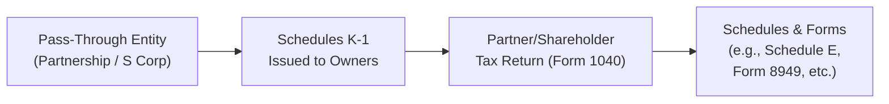

## 17.4 Schedule K-1 Compliance Considerations

Pass-through entities, such as partnerships (including limited liability companies taxed as partnerships) and S corporations, do not pay federal income taxes at the entity level. Instead, they pass their items of income, deductions, credits, and other tax attributes to their owners (partners or shareholders). These amounts are reported on Schedule K-1, which the owners use to complete their personal or business tax returns.  

Properly understanding and complying with the instructions for Schedule K-1 is essential for taxpayers to avoid underreporting or misclassifying income, deductions, and credits. In this section, we will thoroughly explore the structured lines (or boxes) on Schedule K-1, common errors, and best practices for ensuring accurate classification and tax reporting.

--------------------------------------------------------------------------------
## Importance of Schedule K-1 for Pass-Through Entities

At its core, Schedule K-1 is designed to provide each owner or beneficiary with a detailed account of their share of the entity’s income, deductions, credits, and other relevant tax items. It is an informational schedule that must be integrated properly onto an individual’s or business’s tax return.

1. ▸ Ensures transparency of pass-through income.  
2. ▸ Promotes proper determination of items subject to self-employment taxes.  
3. ▸ Assists in tracking each partner’s or shareholder’s basis, which affects the deductibility of losses, future distributions, and gain or loss on disposition of their interest.  
4. ▸ Offers clarity on how to classify and report various sources of income, ensuring compliance with the Internal Revenue Code.  

--------------------------------------------------------------------------------
## Schedule K-1 for Partnerships (Form 1065) vs. S Corporations (Form 1120-S)

Although both partnerships and S corporations furnish Schedule K-1 to their owners, they have important differences:

• Partnership K-1 (Form 1065):  
  – Can include guaranteed payments to partners (Box 4).  
  – May report recourse vs. nonrecourse liabilities.  
  – Often used to report self-employment income for general partners.  

• S Corporation K-1 (Form 1120-S):  
  – Usually does not include guaranteed payments (the analogous concept might be wages paid to shareholder-employees, reported on Form W-2).  
  – Usually does not categorize debt in the same manner, though shareholder loans and basis tracking are still relevant.  
  – May reflect items like built-in gains or other corporate-level taxes.  

Despite these differences, the underlying concept of each Schedule K-1 remains consistent: pass items of income, loss, and credits to the owners.

--------------------------------------------------------------------------------
## Dissecting Key Boxes on the Schedule K-1

While a significant portion of the K-1 is dedicated to general taxpayer information and identification of the entity, the primary focus for compliance is on boxes reporting income, deductions, and credits. Let’s explore how these boxes typically appear on a Partnership Form (1065) K-1; note that S Corporation K-1 lines are similar but with certain unique boxes or references.

### Part I: Entity and Partner/Shareholder Information

• Basic identifying information (Entity name, Employer Identification Number, partner/shareholder details).  
• Entity type and IRS classification (noted under checkboxes).  
• Important for verifying the correct K-1 form was received and ensuring the recipient is an accurately identified partner/shareholder.

### Part II: Information About the Partner (or Shareholder)

• Address, Partner ID Number (often Social Security Number or EIN), and ownership information.  
• Partner’s percentage of profit, loss, and capital in the partnership or S corporation.  
• This section often indicates changes in ownership shares throughout the year, which affects allocations of income and loss.

### Part III: Partner’s (or Shareholder’s) Share of Current Year Income, Deductions, Credits, and Other Items

Each numbered box represents a different category of tax items. Below are standard classifications for a partnership K-1 (Form 1065). For S corporations, the boxes are similar, but the numbering or instructions from the IRS may differ slightly.

1. Ordinary Business Income (Loss)  
   – Reflects trade or business income attributable to the entity’s normal operations.  
   – For general partners in a partnership, this income (or loss) may be subject to self-employment tax.  

2. Net Rental Real Estate Income (Loss)  
   – Pertains to rental real estate activities.  
   – Special passive activity rules might limit a taxpayer's ability to deduct real estate losses.  

3. Other Net Rental Income (Loss)  
   – Rents from personal property or mixed property usage not classified under real estate.  

4. Guaranteed Payments to Partners (Partnership K-1 specific)  
   – Payments to partners for services or capital usage, similar to wages but subject to differing tax treatment.  
   – Typically subject to self-employment tax for the recipient partner.  

5. Interest Income  
   – Taxable interest, such as that earned from bank deposits or bonds.  
   – May need to be reported on Schedule B of Form 1040.  

6. Dividends  
   – Qualified dividends or ordinary dividends must be separately stated due to special tax rates for qualified dividends.  

7. Royalties  
   – Income from intangible property rights—subject to ordinary income tax treatment, but with special reporting requirements in certain cases.  

8. Net Short-Term Capital Gain (Loss)  
   – Gains or losses from the sale of capital assets held for one year or less.  

9. Net Long-Term Capital Gain (Loss)  
   – Gains or losses from the sale of capital assets held longer than one year.  
   – Different tax rates may apply, e.g., 0%, 15%, or 20% based on the partner’s individual income level.  

10. Section 1231 Gains (Losses)  
    – Results from the sale or exchange of depreciable property used in a trade or business held for more than one year.  
    – Subject to netting rules that may produce either capital or ordinary treatment.  

11. Other Income (Loss)  
    – Non-trade or specialized activity income items that must be reported separately.  

12. Section 179 Deduction  
    – Depreciation expense election for certain property.  
    – Partnerships typically pass the eligibility on to partners, who then determine if they qualify for the deduction on their individual returns.  

13. Other Deductions  
    – Includes various deductions that cannot be netted with ordinary business income. Items such as charitable contributions, IRA contributions on behalf of partners, etc.  

14. Net Investment Income (from investment activities)  
    – Important for the Net Investment Income Tax (NIIT) determination at the individual level.  

15. Credits  
    – A variety of business or investment tax credits (e.g., low-income housing credit, rehabilitation credit) that pass through to the partner.  

16. Foreign Transactions  
    – Special reporting for foreign taxes paid, foreign income, or other international activities that flow through.  

17. Alternative Minimum Tax (AMT) Items  
    – Items that may trigger AMT adjustments when the partner or shareholder calculates their alternative minimum tax.  

18. Items Affecting Shareholder/Partner Basis  
    – This includes nondeductible expenses, distributions, and other adjustments that directly modify partner/shareholder basis.  

19. Section 199A - Qualified Business Income (QBI) Items  
    – If the pass-through entity’s trade or business qualifies, the Schedule K-1 will provide QBI items relevant to the 20% deduction under Section 199A.  

The classification in these boxes is critical because different types of income and deductions are reported on different lines or schedules of the recipient’s income tax return. Misclassifications can lead to incorrect application of tax rates, insufficient self-employment tax payments, or disallowed losses.

--------------------------------------------------------------------------------
## Typical Errors in Schedule K-1 Reporting

1. ▸ Misclassification of Income  
   – Treating guaranteed payments as ordinary income (or vice versa), thereby causing underpayment of self-employment taxes.  

2. ▸ Incorrectly Reporting Passive vs. Non-Passive Income  
   – Items subject to passive activity rules, such as rental real estate losses, are wrongly treated as active. This can erroneously generate net operating losses or offset unwarranted active income.  

3. ▸ Failing to Apply Basis and At-Risk Limitations  
   – Owners cannot deduct losses beyond their basis or at-risk amounts. Failing to track and apply basis and at-risk rules can cause improper loss deductions.  

4. ▸ Omitting Separately Stated Items  
   – Deductions or credits that should be separated and reported at the individual level are instead lumped into ordinary income or net rental income.  

5. ▸ Neglecting State Filing Requirements  
   – Partnerships and S corporations often operate across multiple states. Failing to reconcile multi-state K-1s can cause inaccurate state income tax reporting.  

6. ▸ Mixing Recourse and Nonrecourse Debt  
   – In partnerships, partner basis depends in part on liability allocation. Errors in classifying debt as recourse or nonrecourse can result in incorrect basis calculations.  

7. ▸ Not Recognizing the Self-Employment Tax Implications  
   – Certain portions of K-1 income must be included in net earnings from self-employment. Misclassifications can lead to under-reporting SE tax.  

8. ▸ Confusing S Corporation W-2 Wages with K-1 Distributions  
   – S corporation shareholder-employees should receive reasonable compensation for services via Form W-2, not only K-1 distributions. Underreporting wages can be a red flag for the IRS.

--------------------------------------------------------------------------------
## Best Practices for Schedule K-1 Compliance

• **Maintain Accurate Books and Records**  
  Keep clear records of income, expenses, and allocations. Good bookkeeping reduces the risk of errors that eventually carry over to Schedule K-1.  

• **Coordinate with the Entity’s Tax Return**  
  Ensure the Form 1065 or 1120-S is finalized accurately. The K-1 items stem directly from these returns. Mistakes in the entity’s return flow down to partners and shareholders.  

• **Analyze Entity Agreements**  
  Study the operating agreement (for LLCs) or partnership agreement (for partnerships) for particular stipulations regarding allocations or guaranteed payments.  

• **Track Basis and At-Risk Limitations**  
  Partners and shareholders must track their individual adjusted tax basis carefully, especially for loss deductions. Keep a basis worksheet current each year.  

• **Separate Reporting for Sensitive Items**  
  Pass-through items such as charitable contributions, Section 179 deductions, and credits must be itemized distinctly. This allows owners to apply the correct rules and limitations.  

• **Keep an Eye on Special Allocations**  
  If the entity uses partnership special allocations, confirm they have substantial economic effect. Improper special allocations might invite IRS scrutiny and disallowance.  

• **Stay Updated with IRS Guidance**  
  Tax law changes frequently influence pass-through entity rules. Remain current with IRS Publications (e.g., Pub. 541 for Partnerships) and instructions for K-1 forms.  

• **Timely Distribution of K-1s**  
  Entities should aim to provide K-1 forms to owners well before the filing deadlines for individual returns, including compliance with extended due dates.  

--------------------------------------------------------------------------------
## Visualizing the Flow of K-1 Items into Individual Tax Returns

The flow of information from a partnership or S corporation to an individual’s Form 1040 can be illustrated with a simple diagram:

• The entity finalizes Form 1065 or 1120-S.  
• Schedule K-1 is issued to each partner or shareholder.  
• Partners/shareholders incorporate each item from the K-1 into the appropriate section or schedule of their personal or business return, ensuring correct classification.

--------------------------------------------------------------------------------
## Real-World Example: Partnership K-1 Interpretation

Imagine a small partnership, “Skyline Consulting, LLC,” with two equal partners, Judy and Max. At the end of the year, the partnership’s Form 1065 reports:

• Ordinary business income: $200,000  
• Guaranteed payments to Judy: $40,000 (for her active management)  
• Interest income: $2,000  
• Section 179 deduction: $6,000  

Judy’s K-1 would likely show:  
• Box 1 (Ordinary business income): $100,000 (her 50% share)  
• Box 4 (Guaranteed payment): $40,000  
• Box 5 (Interest income): $1,000 (50% of $2,000)  
• Box 12, “Section 179 Deduction”: $3,000 (her 50% share of $6,000)  

She must report:  
• $100,000 as ordinary business income on Schedule E (with possible self-employment tax, since she’s a general partner).  
• $40,000 of guaranteed payments as net earnings from self-employment.  
• $1,000 of interest income on Schedule B.  
• $3,000 of Section 179 expenses subject to the rules and limitations on her return.

If Judy mistakenly adds the guaranteed payment to her ordinary income, or fails to recognize the self-employment tax dimension, it can lead to an error in calculating her final tax liability.

--------------------------------------------------------------------------------
## Schedule K-1: A Closer Look at S Corporation Distinctions

For S corporations, the net income generally appears in Box 1 (“Ordinary business income (loss)”) if it arises from active trade or business. Shareholder-employees should typically receive a reasonable wage (Form W-2), rather than all compensation via K-1 distributions. Key distinctions from a partnership K-1 to remember:

• **No Guaranteed Payments**: Rather than guaranteed payments, S corporation shareholders receive wages if they provide services.  
• **Shareholder’s Debt Basis**: S corporation owners only receive basis from direct loans to the corporation; they cannot utilize entity-level nonrecourse financing for personal basis.  
• **State Apportionment and Withholding**: Some states require S corporations to withhold on nonresident shareholders, and that amount is reported on the Schedule K-1.  

--------------------------------------------------------------------------------
## Common Pitfalls and Ways to Mitigate Them

1. **Forgetting Mid-Year Ownership Changes**  
   – The partner or shareholder may not hold the interest for the entire year. Check interim allocations.  

2. **Mixing Up Trade or Business vs. Portfolio Income**  
   – Interest or dividends from portfolio investments should be separately identified.  

3. **Overlooking Self-Employment Tax**  
   – Particularly crucial with partners in a partnership. S corporation distributions are not automatically subject to self-employment tax, but wages to shareholder-employees are.  

4. **Inaccurate Calculations of Capital Account**  
   – Partnerships must often track capital accounts on both book and tax bases. This impacts K-1 presentation under the new IRS capital account reporting rules.  

5. **Not Accounting for IRC §199A QBI Deduction Limits**  
   – Ensure the K-1 provides the correct statements for QBI, W-2 wages, and unadjusted basis immediately after acquisition (UBIA) of qualified property for each trade or business.  

--------------------------------------------------------------------------------
## Case Study: S Corporation vs. Partnership K-1

Consider two pass-through entities with identical gross profits and overhead:

1. “Oceanic Marketing, Inc.” – An S corporation with two equal shareholders, each also acting as employees. Net taxable income is $150,000 after payment of $80,000 in wages to both shareholders.  

2. “Oceanic Marketing, LP” – A partnership with two equal partners, each working actively in the business. Net income is $150,000, and one partner also receives a $20,000 guaranteed payment.

When the S corporation prepares Schedule K-1 for each shareholder:  
• Each half of the $150,000 net income is $75,000.  
• Their W-2 wages are not shown on K-1; they are separate as wages.  
• If there's any pass-through interest, capital gains, or separate items, those appear in the respective boxes.

For the partnership:  
• Each partner’s share of $150,000 is $75,000.  
• Guaranteed payment of $20,000 to one partner is shown separately on her K-1.  
• This guaranteed payment amount is generally also subject to self-employment tax.  

In practice, the bottom-line owners’ flows can look alike, but the K-1 presentations—and tax treatments—differ.  

--------------------------------------------------------------------------------
## Strategies for Accurate Tax Compliance

• **Reconcile Books to the Return**: Perform a thorough year-end reconciliation between financial statements and final tax return numbers to ensure consistency of allocations.  
• **Use Tax Software or Professional Tools**: Many software packages automatically generate K-1 forms, but it’s crucial to verify that all boxes align with the specific entity type.  
• **Conduct Ongoing Communication**: Partners and shareholders should be in close contact with the entity’s accounting or tax professionals to discuss basis changes, capital distributions, and special allocations.  
• **Stay Alert on Timing**: Partnerships and S corporations often have set due dates (March 15) with possible extensions (to September 15). Holding back on distributing K-1 forms risks owners filing late or incorrectly.  

--------------------------------------------------------------------------------
## References and Further Reading

• IRS Publication 541 – Partnerships  
• IRS Schedule K-1 (Form 1065) and Instructions  
• IRS Schedule K-1 (Form 1120-S) and Instructions  
• Internal Revenue Code §199A for QBI deductions  
• IRS Publication 925 on Passive Activity and At-Risk Rules  

By fully understanding and correctly interpreting each box on Schedules K-1, partners and shareholders can confidently file accurate income tax returns, avoid costly errors, and maximize eligible deductions and credits.  

--------------------------------------------------------------------------------

## Test Your Knowledge: Schedule K-1 Classification and Common Pitfalls



### Which of the following income types typically appears in Box 4 of a Partnership (Form 1065) Schedule K-1?  
- [ ] Net ordinary business income  
- [x] Guaranteed payments to partners  
- [ ] Dividend income  
- [ ] Capital gain income  

> **Explanation:** Box 4 of Form 1065 Schedule K-1 is dedicated to guaranteed payments to partners for services or the use of capital.  

### How does an S Corporation usually report compensation paid to an owner who provides services?  
- [ ] As guaranteed payments on Schedule K-1  
- [x] As wages on Form W-2  
- [ ] As unrelated business income on Schedule K-1  
- [ ] As tax-exempt income on Schedule K-1  

> **Explanation:** In an S corporation, owners providing services typically receive Form W-2 wages. Unlike partnership guaranteed payments, wages are separate from the distributions reported on the Schedule K-1.  

### Which item generally affects a partner’s basis and is separately stated on Schedule K-1?  
- [ ] Ordinary business income  
- [x] Charitable contributions  
- [ ] Refundable tax credits only  
- [ ] Self-employment tax  

> **Explanation:** Charitable contributions are a separately stated item reported on Schedule K-1 that also impacts the partner’s basis.  

### One of the most common errors on Schedule K-1 is:  
- [ ] Reporting rental income under passive income  
- [ ] Forgetting to attach the Schedule K-1 to the personal return  
- [x] Misclassifying guaranteed payments and ordinary income  
- [ ] Reporting partnership losses before finalizing the entity’s tax return  

> **Explanation:** A very common error is misclassifying guaranteed payments in the wrong box or combining them with ordinary business income, thus erroneously affecting self-employment taxes.  

### When a partner receives a K-1 with net rental real estate losses in Box 2, which rule might limit the immediate deductibility of those losses?  
- [x] Passive activity loss limitation rules  
- [x] At-risk limitations  
- [ ] Depreciation recapture rules  
- [ ] Alternative Minimum Tax  

> **Explanation:** Rental real estate income or loss is often subject to the passive activity limitation rules, and partners must also consider their at-risk amount to determine deductible losses.  

### Which statement accurately describes how partnership liabilities affect a partner’s basis?  
- [x] A partner’s share of recourse liabilities generally increases that partner’s basis.  
- [ ] Partnership liabilities have no effect on the partner’s basis.  
- [ ] Nonrecourse liabilities reduce a partner’s basis.  
- [ ] Liabilities allocated to a partner for basis calculation always trigger an immediate deduction.  

> **Explanation:** The basis of a partner’s interest typically increases to the extent they are allocated recourse liabilities and certain nonrecourse liabilities.  

### An S corporation shareholder generally does not get basis for:  
- [x] Corporate-level nonrecourse liabilities  
- [ ] Additional paid-in capital  
- [x] Running trade or business operations  
- [ ] Direct loans made to the corporation  

> **Explanation:** S corporation shareholders generally do not receive basis from corporate-level nonrecourse liabilities. They can, however, receive basis for direct loans they make to the corporation.  

### To properly report dividends from a partnership investment, an individual taxpayer should:  
- [x] Use Schedule B on the Form 1040  
- [ ] Lump them in with ordinary business income  
- [ ] Net them with capital gains on Schedule D  
- [ ] Defer them if below $1,000  

> **Explanation:** Dividends flow through from a partnership via Schedule K-1 and should generally be reported on Schedule B within the individual Form 1040 filing.  

### If a partner’s tax basis in a partnership is $50,000, and the partner receives a distribution of $60,000 in cash, how is the excess typically treated?  
- [x] As gain from the sale or exchange of the partnership interest  
- [ ] As a nontaxable return of capital  
- [ ] As interest income to the partner  
- [ ] As guaranteed payment income  

> **Explanation:** Generally, distributions in excess of a partner’s basis result in taxable gain, which is treated similarly to the sale or exchange of the partnership interest.  

### A partner's net self-employment income from a partnership often includes the partner’s share of ordinary trade or business income plus any guaranteed payments.  
- [x] True  
- [ ] False  

> **Explanation:** For general partners, both their share of the partnership’s ordinary income and guaranteed payments typically factor into net earnings from self-employment.  



--------------------------------------------------------------------------------

## For Additional Practice and Deeper Preparation

### [Taxation & Regulation (REG) CPA Mock Exams](https://www.udemy.com/course/reg-cpa-mock-exams/?referralCode=55419EBD198F61530B12)

**Taxation & Regulation (REG) CPA Mocks:** 6 Full (1,500 Qs), Harder Than Real! In-Depth & Clear. Crush With Confidence!

- Tackle full-length mock exams designed to mirror real REG questions.  
- Refine your exam-day strategies with detailed, step-by-step solutions for every scenario.  
- Explore in-depth rationales that reinforce higher-level concepts, giving you an edge on test day.  
- Boost confidence and minimize anxiety by mastering every corner of the REG blueprint.  
- Perfect for those seeking exceptionally hard mocks and real-world readiness.

_Disclaimer: This course is not endorsed by or affiliated with the AICPA, NASBA, or any official CPA Examination authority. All content is for educational and preparatory purposes only._
