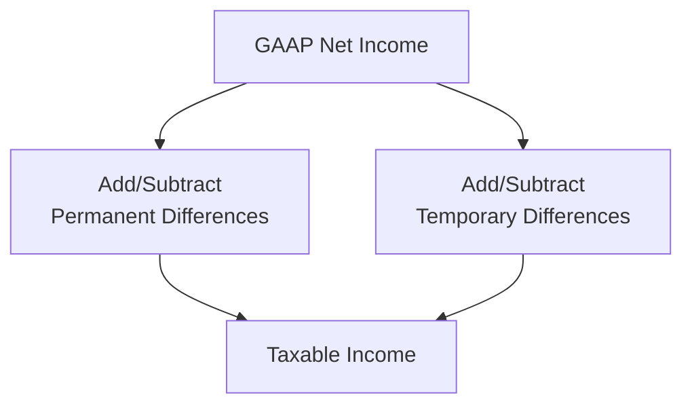
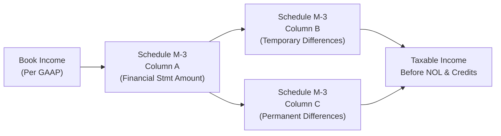

## 18.1 Permanent vs. Temporary Differences (M-1, M-3 Schedules)

Reconciling Generally Accepted Accounting Principles (GAAP) net income to taxable income is essential in corporate tax compliance and financial statement reporting. At its core, the process involves identifying and classifying “book–tax” differences as either permanent or temporary. These differences, in turn, must be reflected on specific IRS schedules (Schedule M-1 or M-3) that corporations use to reconcile their financial accounting income (book income) to their taxable income. Understanding how to interpret and classify these differences is a critical skill for CPAs and tax professionals alike.

This section provides a conceptual framework for navigating the nuances of permanent versus temporary differences, explains how to report them effectively on Schedules M-1 and M-3, and explores recordkeeping and strategic considerations. We will also review common pitfalls, best practices, and a variety of real-world examples to illustrate the principles.

---------------------------------------------------------------------

### Overview of Book–Tax Differences

Under financial accounting standards (GAAP), net income is prepared to reflect an entity’s economic performance. For tax reporting, however, income is measured per the Internal Revenue Code (IRC), which often results in different income amounts. These book–tax differences generally come in two forms:

1. **Permanent Differences**: Income or expenses that appear on one basis of accounting (book or tax) but never appear on the other.  
2. **Temporary Differences**: Items that cause a difference between book and taxable income in one period but reverse in future periods.

To illustrate this process at a high level, consider the following flowchart:

From a compliance perspective, corporations must reconcile GAAP net income to taxable income using Schedule M-1 or Schedule M-3, depending on their total assets and other qualifying thresholds. Let us explore each schedule and each difference type in detail.

---------------------------------------------------------------------

### Understanding Permanent Differences

**Definition of Permanent Differences**  
Permanent differences occur when certain revenues or expenses are recorded under GAAP but are either never included or never deducted for tax purposes (or vice versa). Because these items never reverse, they create a one-time tax impact in the period in which they occur.  

#### Examples of Permanent Differences

1. **Tax-Exempt Income**  
   - Example: Interest from municipal bonds is recognized as income for financial statements, but it is excluded for federal tax purposes.
2. **Fines and Penalties**  
   - Example: Company pays $10,000 in fines for regulatory violations. This amount is expensed under GAAP but not deductible on the tax return.
3. **50% or 100% Meals/Entertainment Disallowance**  
   - Example: Business-related meals may be partially or entirely disallowed depending on current tax law. GAAP treats it as an expense, partially or fully recognized, whereas the tax code might limit the deduction.
4. **Life Insurance Proceeds**  
   - Example: Proceeds received from a life insurance policy on a key employee are recorded as income in financial statements. Under the IRC, such proceeds are usually tax-exempt if certain conditions are met.
5. **Political Contributions**  
   - Example: These expenses are recorded under GAAP but are not deductible for tax purposes.

Because these differences permanently affect a company’s effective tax rate, understanding them is crucial for both tax planning and financial statement presentation.

---------------------------------------------------------------------

### Understanding Temporary Differences

**Definition of Temporary Differences**  
Unlike permanent differences, temporary differences cause timing variations between the recognition of income and expenses for book and tax purposes. Over time, these differences eventually reverse, aligning cumulative book and taxable income. Temporary differences often lead to the creation of deferred tax assets (DTAs) or deferred tax liabilities (DTLs) on the balance sheet.

#### Key Causes of Temporary Differences

1. **Depreciation and Cost Recovery**  
   - GAAP depreciation may differ significantly from tax depreciation (e.g., Modified Accelerated Cost Recovery System—MACRS). The excess or deficiency in the early years typically reverses in the later years when comparing book and tax depreciation.
2. **Accrued Expenses vs. Deductibility**  
   - Certain accrued liabilities may satisfy GAAP recognition criteria but be only deductible for tax purposes when paid (e.g., some compensation or bonus accruals).
3. **Bad Debt Expense**  
   - For book purposes, companies estimate allowance for doubtful accounts. For tax, most companies can only deduct actual write-offs.
4. **Warranty Liabilities**  
   - GAAP may allow provisioning in the period of sale, whereas tax law might only allow a deduction when the warranty service is performed or paid.
5. **Net Operating Loss (NOL) Carryforwards**  
   - An NOL might reduce taxable income in future years, creating a deferred tax asset for future reductions in tax liability.

Because these items eventually reverse, the total amount recognized under GAAP will eventually match the total amount recognized for tax over the life of the item, though the timing differs significantly.

---------------------------------------------------------------------

### Reporting Framework: Schedule M-1 vs. Schedule M-3

The IRS requires corporations to complete either Schedule M-1 or M-3 to reconcile their financial statement income to their tax return income. The choice depends on factors such as total assets and specific IRS thresholds.

#### Schedule M-1 Basics

- **Who Uses It?** Generally, corporations with total assets of less than $10 million can use Schedule M-1 on Form 1120.  
- **Structure**:  
  1. Start with net income (loss) per books.  
  2. Add income items reported on the tax return that were not included in book income.  
  3. Subtract items that were subtracted or not deducted for book purposes but are deductible for tax.  
  4. Arrive at taxable income (before specific deductions, such as net operating losses and dividends-received deductions).

#### Schedule M-3 Basics

- **Who Uses It?** Generally, corporations (and certain other filers) with $10 million or more in total assets must use Schedule M-3.  
- **Structure**:  
  1. Schedule M-3 is more detailed than M-1 and requires a three-column approach to identify differences between financial statement income and taxable income.  
  2. Column A: Financial statement amounts.  
  3. Column B: Temporary differences.  
  4. Column C: Permanent differences.

The objective is to enhance transparency and provide more detailed reconciliation between book income and taxable income. Larger or more complex entities benefit from the additional detail, and the IRS gains deeper insight into book–tax differences.

---------------------------------------------------------------------

### Step-by-Step Approach to Book–Tax Reconciliation

A consistent methodology helps reduce errors during reconciliation. While each company’s situation is unique, the following is a commonly used template:

1. **Gather Financial Data**  
   - Start with the company’s GAAP-based financial statements, including the income statement and relevant footnotes.
2. **Identify Permanent Differences**  
   - Review expenses and income items to determine which ones are never tax-deductible or never taxable.  
   - Common items: Fines, penalties, tax-exempt interest, political contributions, dividends-received deductions (DRD) adjustments, etc.
3. **Identify Temporary Differences**  
   - Determine which expenses or revenues have different GAAP vs. tax timing (i.e., depreciation, bad debt reserves, accrued liabilities).  
   - Distinguish between deferred tax assets and liabilities if preparing GAAP financial statements.
4. **Summarize Adjustments**  
   - Use a worksheet to track each difference, note whether it is an addition or subtraction, and indicate whether it is permanent or temporary.
5. **Complete the M-1 or M-3**  
   - **Schedule M-1**: Smaller corporations simply record totalling adjustments to reach taxable income.  
   - **Schedule M-3**: Larger corporations dissect each category between permanent and temporary differences in separate columns.
6. **Reconcile to Taxable Income**  
   - After considering other deductions or special credits (e.g., NOL, DRD), the result should tie to Line 30 (Taxable Income) on Form 1120 or corresponding lines on other entity returns.

---------------------------------------------------------------------

### Practical Example: Permanent and Temporary Differences

Below is a simplified example to illustrate adjustments:

Company ABC Inc. has $500,000 GAAP net income (income per books). The following book–tax differences are identified:

• **Municipal Bond Interest**: $10,000 (Book Income) → Tax-Exempt (Permanent)  
• **Meals Deduction**: $6,000 recorded as expense for book purposes; only 50% is allowed for tax, so $3,000 is disallowed (Permanent)  
• **Depreciation**: Book depreciation is $40,000; tax depreciation is $60,000, resulting in a $20,000 difference (Temporary)  
• **Bad Debt Expense**: Book expense is $5,000; actual write-offs for tax are $2,000, resulting in a $3,000 difference (Temporary)

#### M-1 Calculation (Assumes Assets < $10 Million)

Starting with Book Income: $500,000

1. **Add**: Nondeductible meals portion = $3,000  
2. **Subtract**: Tax-exempt municipal bond interest = $10,000  
3. **Temporary Differences**  
   - **Subtract**: In excess of book depreciation ($60k - $40k) = $20,000  
   - **Add**: Excess of book bad debt over tax write-off ($5k - $2k) = $3,000  

Hence, the M-1 lines might look like this (simplified):

• Net Income per Books: $500,000  
• Additions: $3,000 (Meals), $3,000 (Bad Debt) = $6,000  
• Subtractions: $10,000 (Municipal Bond Interest), $20,000 (Depreciation) = $30,000  

Result:  
Book Income $500,000 + $6,000 – $30,000 = $476,000 → This figure is used for additional adjustments (e.g., NOL) to arrive at taxable income.

#### M-3 Presentation

If Company ABC were required to file M-3, it would break out each difference for added transparency:

- **Permanent Differences**  
  - Tax-Exempt Interest (negative adjustment of $10,000)  
  - Nondeductible Meals (positive adjustment of $3,000)  
- **Temporary Differences**  
  - Depreciation (positive or negative depending on perspective; for tax, the deduction is higher, so for book–tax reconciliation, it is typically a subtraction from book income if reconciling to tax).  
  - Bad Debt Expense (similar but in the opposite direction).

The additional detail in M-3 helps track the nature of these differences, whether they are recurring or “one-time” items, and how they align with GAAP disclosures.

---------------------------------------------------------------------

### Common Pitfalls and Best Practices

**Pitfalls**  
1. **Misclassification of Differences**  
   - Confusing permanent vs. temporary differences can result in incorrect deferred tax assets/liabilities.  
2. **Inconsistent Recordkeeping**  
   - Failing to maintain a thorough schedule of differences each year can lead to cumulative errors.  
3. **Overlooking Footnotes**  
   - Certain adjustments are only evident by reading footnotes describing intangible assets or contingent liabilities.
4. **Improper/Untimely Adjustments**  
   - Errors frequently arise when not aligning GAAP and tax adjustments in the correct period.

**Best Practices**  
1. **Maintain a Clear Reconciliation Workbook**  
   - Organize differences by category (permanent vs. temporary). Track each difference from inception to reversal.
2. **Leverage Tax Software and Schedules**  
   - Most modern tax software packages keep robust records of prior-year differences, simplifying rolling forward into the new year.
3. **Review Prior-Year Schedules**  
   - Cross-reference new additions or subtractions with the prior year to catch potential omissions.  
4. **Communicate with Relevant Departments**  
   - Particularly for large companies, ensure that group finance, operations, and legal teams coordinate to identify differences.

---------------------------------------------------------------------

### Case Study: Large Multi-Entity Corporation

Consider a large corporation operating multiple subsidiaries in different states. The consolidated financial statements report $50 million of GAAP net income. However, the corporation must file a federal consolidated tax return, requiring an M-3. Some intangible asset amortization is treated differently for GAAP and tax, creating a $2 million temporary difference. Additionally, the corporation earned $1 million in tax-exempt interest from municipal bonds (permanent difference). It also incurred a $500,000 penalty for a regulatory infraction (permanent difference, nondeductible for tax).  
   
When completing the M-3, the corporation breaks out each subsidiary’s financial statement income and systematically reconciles these items. The intangible amortization is reported as a temporary difference in Column B, while the municipal bond interest and penalties appear in Column C as permanent differences. Intercompany transactions further complicate the reconciliation, requiring consistency checks to ensure that eliminations and uniform accounting policies are accurately reflected for both book and tax.

---------------------------------------------------------------------

### Visualizing the M-3 Concept

The expanded M-3 approach can be pictured conceptually:

Large corporations are often required to provide this level of detail to offer the IRS a clear roadmap of each difference and the nature—permanent vs. temporary—of every book–tax discrepancy.

---------------------------------------------------------------------

### Tax Planning and Strategic Considerations

1. **Impact on Effective Tax Rate (ETR)**  
   - Permanent differences directly influence an entity’s ETR since they never reverse.  
   - Minimizing nondeductible expenses (e.g., penalties, entertainment) can meaningfully reduce the ETR.
2. **Deferred Tax Accounting**  
   - Temporary differences trigger deferred tax assets or liabilities under ASC 740. Tracking these carefully helps maintain correct financial statements and avoids material restatements.
3. **Timing of Transactions and Elections**  
   - Strategic deferral of income or acceleration of deductions relies on understanding how differences move between book and tax.  
   - Elections for depreciation (e.g., bonus depreciation, Section 179) can generate large temporary differences, affecting cash flow and the time value of money.
4. **Audit Defense**  
   - The IRS often scrutinizes M-3 entries to ensure no misclassification of large or suspicious differences. A clear audit trail is essential.

---------------------------------------------------------------------

### References and Additional Resources

• **IRS Instructions for Form 1120 and Schedules M-1 and M-3**: Official guidance explaining reporting thresholds and detailed computations.  
• **ASC 740 (FASB Topic 740)**: Accounting for Income Taxes—governs the reporting of deferred tax assets and liabilities under U.S. GAAP.  
• **IRS Publication 535**: Offers information on business expenses, including those that may be partially or fully nondeductible.  
• **IRS Publication 225** (Farmers) and **Publication 334** (Small Business) for special industry rules.  

---------------------------------------------------------------------

## SEO-Optimized Quiz: Mastering Permanent & Temporary Differences



### Which of the following best describes a permanent difference?

- [ ] An income item recognized earlier for tax than for book.  
- [ ] An expense item recognized later for tax than for book.  
- [x] An item that never enters into taxable income or a tax deduction.  
- [ ] An item that is recognized in the financial statements in a future period.  

> **Explanation:** Permanent differences never affect both financial and taxable income—either they always appear in book income only (or vice versa) or they differ in a way that doesn’t ever reverse.

### Which IRS schedule requires more detailed reconciliation by separating temporary and permanent differences into distinct columns?

- [ ] Schedule M-1  
- [ ] Schedule A  
- [x] Schedule M-3  
- [ ] Schedule SE  

> **Explanation:** Schedule M-3 demands detailed disclosure of differences among three columns (financial statement amounts, temporary differences, permanent differences) for larger corporations compared to the simpler Schedule M-1.

### What is the general threshold for using Schedule M-3 instead of Schedule M-1?

- [ ] $1 million in total assets  
- [ ] $5 million in total assets  
- [x] $10 million in total assets  
- [ ] $50 million in total assets  

> **Explanation:** Corporations with total assets of $10 million or more must file Schedule M-3, though there can be additional nuances depending on IRS instructions.

### Which of the following items is typically considered a permanent difference?

- [ ] Accrued vacation payable  
- [ ] Depreciation differences between book and tax  
- [ ] Warranty liability recognized for book, only deducted when paid for tax  
- [x] Political contributions disallowed for tax  

> **Explanation:** Political contributions are generally never deductible for tax purposes, thus constituting a permanent difference.

### Choose the correct statements about deferred tax assets and liabilities:

- [x] Deferred tax assets stem from temporary differences that will reduce future taxable income.  
- [ ] Deferred tax assets and liabilities only arise from permanent differences.  
- [x] Deferred tax liabilities result from temporary differences that will increase future taxable income.  
- [ ] Deferred tax liabilities are permissible only for intangible items.  

> **Explanation:** Deferred tax assets (DTAs) and deferred tax liabilities (DTLs) arise exclusively from timing differences (temporary), not from permanent differences, as permanent items never reverse.

### Which step usually comes first in reconciling book to taxable income?

- [ ] Listing out all potential tax credits  
- [x] Identifying permanent differences between book and tax  
- [ ] Inputting tax depreciation  
- [ ] Filing for an extension  

> **Explanation:** A common approach is to first pinpoint permanent differences because they directly impact the effective tax rate and do not roll over to subsequent periods.

### What is the standard effect of a permanent difference on an entity’s Effective Tax Rate (ETR)?

- [ ] It temporarily increases ETR, then reverses.  
- [x] It permanently increases or decreases the ETR in the period it arises.  
- [ ] It creates a deferred tax liability that adjusts ETR in future periods.  
- [ ] It can never affect the ETR.  

> **Explanation:** Because permanent differences do not reverse, they affect ETR in the period they occur and remain in the cumulative rate calculation.

### In a scenario where a company’s book depreciation is $100,000, but tax depreciation under MACRS is $150,000, how would that difference be classified?

- [x] Temporary difference favoring the taxpayer (more tax depreciation now)  
- [ ] Permanent difference favoring the taxpayer  
- [ ] Temporary difference increasing current taxable income  
- [ ] Permanent difference increasing current taxable income  

> **Explanation:** When tax depreciation exceeds book depreciation, the taxpayer reports less taxable income in the current period, representing a timing (temporary) advantage that eventually reverses in subsequent periods.

### Which of the following items might not appear on either Schedule M-1 or M-3?

- [ ] Meals and entertainment disallowance  
- [x] An internally eliminated intercompany transaction with no effect on consolidated book or tax return  
- [ ] Municipal bond interest  
- [ ] Penalties and fines  

> **Explanation:** True intercompany eliminations that affect neither consolidated book income nor consolidated taxable income create no reconciling difference; thus, they do not appear on M-1 or M-3.

### The Estimated Tax rule states that companies must prepay a portion of their federal income tax liability. True or False?

- [x] True  
- [ ] False  

> **Explanation:** Most corporations are required to make estimated tax payments if their expected tax liability exceeds certain thresholds, ensuring that the IRS receives tax revenue throughout the year.



---------------------------------------------------------------------

## For Additional Practice and Deeper Preparation

### [Taxation & Regulation (REG) CPA Mock Exams](https://www.udemy.com/course/reg-cpa-mock-exams/?referralCode=55419EBD198F61530B12)

**Taxation & Regulation (REG) CPA Mocks:** 6 Full (1,500 Qs), Harder Than Real! In-Depth & Clear. Crush With Confidence!

- Tackle full-length mock exams designed to mirror real REG questions.  
- Refine your exam-day strategies with detailed, step-by-step solutions for every scenario.  
- Explore in-depth rationales that reinforce higher-level concepts, giving you an edge on test day.  
- Boost confidence and minimize anxiety by mastering every corner of the REG blueprint.  
- Perfect for those seeking exceptionally hard mocks and real-world readiness.

_Disclaimer: This course is not endorsed by or affiliated with the AICPA, NASBA, or any official CPA Examination authority. All content is for educational and preparatory purposes only._
