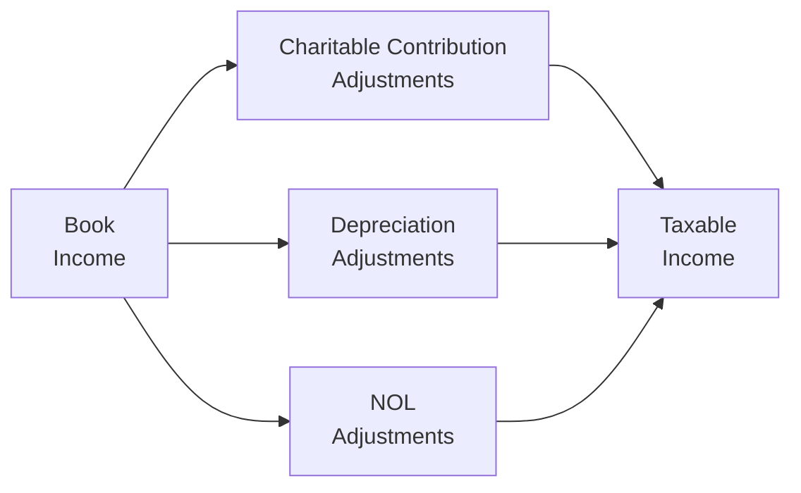
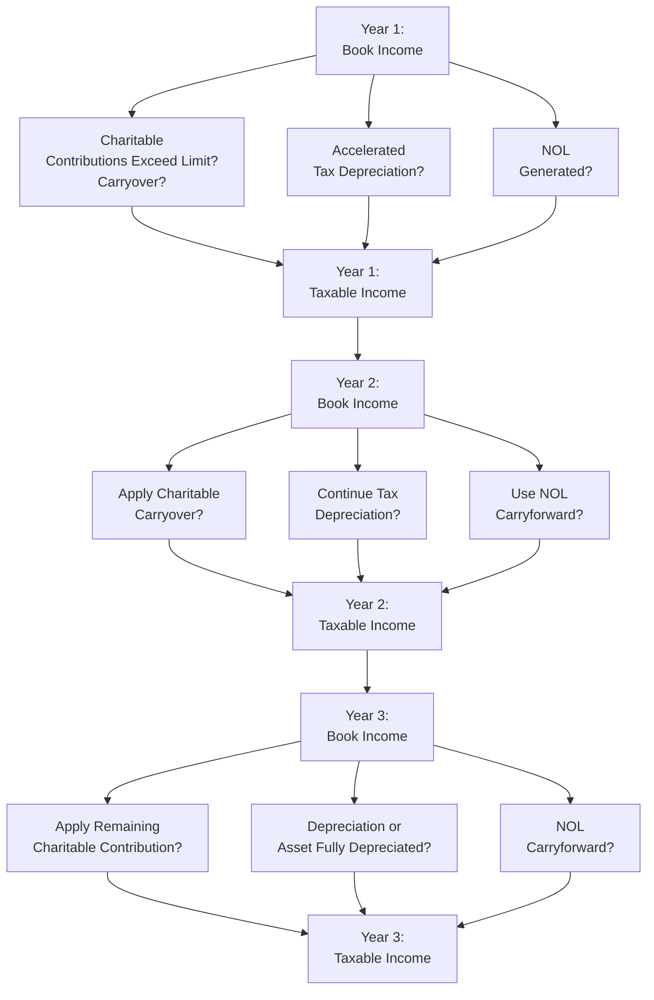

## 18.2 Adjustments for Charitable Contributions, Depreciation, NOLs

In reconciling book income to taxable income, corporations frequently encounter differences relating to charitable contributions, depreciation, and net operating losses (NOLs). These adjustments can have significant implications for a business’s tax liability in the current and subsequent years. This section explores each area in detail, providing an integrated approach to ensure accurate reporting and compliance.

Understanding these book-to-tax adjustments is critical for CPA candidates preparing for the REG section of the Uniform CPA Examination, as well as for practitioners who need to properly bridge the gap between financial accounting (book) rules and federal tax (regulatory) rules.

--------------------------------------------------------------------------------

### Overview of Book vs. Tax Income

In general, corporate entities maintain two sets of “income” figures:  
• GAAP (or “book”) income, which follows Financial Accounting Standards Board (FASB) guidelines.  
• Taxable income, governed by the Internal Revenue Code (IRC) and related regulations.

When a corporation prepares its federal tax return, it must reconcile book income per its financial statements to taxable income reported on Form 1120 (for C corporations), which typically mandates the completion of Schedule M-1 or M-3 (depending on the size of the corporation). Schedule M-1 or M-3 helps identify and categorize book-to-tax adjustments, including items such as:  
• Permanent differences (e.g., income or expenses that are never recognized for tax purposes)  
• Temporary differences (e.g., depreciation timing differences, net operating losses, or charitable contribution carryovers that shift deductions to other periods)

Below is a high-level Mermaid flowchart illustrating how three major adjustments—charitable contributions, depreciation, and NOLs—merge into the final taxable income figure.

In the sections below, we dissect each category of adjustment and examine their implications, calculation methods, and common pitfalls.

--------------------------------------------------------------------------------

### Charitable Contributions

#### Book vs. Tax Treatment

Corporations often make charitable donations to qualified nonprofit organizations, which may be deductible for both book and tax purposes. However, differences can arise because:

1. GAAP Recognition Timing: For example, a board may approve a pledge in Year 1 for book purposes before the contribution is actually paid. Under IRC rules, a corporation generally deducts charitable contributions only when paid. Exceptions exist if the corporation is an accrual-basis taxpayer and pays the amount within a specified time (generally within 2.5 months after year-end), in which case it may be able to take the deduction in the year the liability is accrued.

2. Deduction Limitation: The federal tax deduction for charitable contributions by C corporations is generally limited to 10% of the corporation’s taxable income (before the deduction of certain items like the charitable contribution itself, NOL carrybacks, and dividends received deduction). Any excess carries forward for up to five subsequent tax years. For book purposes, a corporation might fully expense a large contribution in the year of donation, creating a temporary difference if the tax deduction is limited in that year.

3. Qualifying Organizations: Book standards may allow broader definitions of charitable activity. For tax purposes, only donations to qualified organizations under IRC §170 generally qualify for a deduction. Non-qualifying charities create permanent difference items.

#### Multi-Year Carryovers

When charitable contributions exceed the 10% limitation, the remainder is carried forward to future years (up to five). A corporation must track this carryover separately for tax purposes. For book treatment, a corporation might have recognized the entire contribution in a single period.

Practical Example:  
• A C corporation with taxable income of $500,000 makes a $100,000 charitable contribution in Year 1. The 10% limitation is $50,000. Hence, $50,000 can be deducted in Year 1, and the remaining $50,000 can be carried forward.  
• For book purposes, the entire $100,000 may have been expensed in Year 1.  
• On M-1/M-3, the corporation records a $50,000 unfavorable temporary difference in Year 1 that reverses as contributions are deducted in the carryover period(s).

#### Best Practices & Pitfalls

• Ensure you properly identify qualified charities. Contributions to certain political organizations or lobbying groups do not qualify.  
• Accrual-basis taxpayers must meet the payment deadline rule to claim the deduction in the accrual year.  
• Track carryovers meticulously to avoid missing out on available deductions in subsequent years.  

--------------------------------------------------------------------------------

### Depreciation Adjustments

#### Why Differences Arise

Depreciation is one of the most common areas of discrepancy between book and tax income due to differences in methods, recovery periods, and conventions. While GAAP focuses on matching the cost of assets to their useful lives based on accounting policies (straight-line depreciation, for instance), tax law often allows accelerated methods (e.g., MACRS, Section 179, and bonus depreciation) to stimulate investment.

Key differences include:

1. Useful Life: Book depreciation often uses estimated useful lives aligned with industry norms. By contrast, tax depreciation follows statutory class lives (e.g., 5-year property for computers, 7-year property for furniture, 39-year for nonresidential real property, etc.).

2. Depreciation Method: Financial accounting frequently uses straight-line depreciation. Tax law generally uses accelerated methods under MACRS, employing the 200% declining balance or 150% declining balance for certain asset classes.

3. Special Incentives: The IRC offers additional benefits such as:
   • Section 179 Deduction: Allows immediate expensing of up to a certain threshold (subject to annual limits) of qualifying property in the year placed in service.  
   • Bonus Depreciation: Grants an immediate deduction of a percentage (e.g., 80% or 100% depending on the tax year) for qualifying assets in the first year.

These rules do not affect GAAP depreciation, thus leading to often significant temporary differences.

#### Illustrative Example

Company X purchases manufacturing equipment for $200,000 in Year 1. Under GAAP, the equipment might be depreciated straight-line over 10 years ($20,000/year). However, for tax purposes (assuming a 7-year MACRS class with a half-year convention, plus potential bonus depreciation in effect), the first-year tax deduction could potentially exceed $20,000. This larger deduction in Year 1 will create a temporary difference that will reverse in later years.

The following table outlines hypothetical depreciation amounts:

| Year | Book Depreciation (Straight-Line) | Tax Depreciation (MACRS + Bonus) | Temporary Difference (Book – Tax)  |
|------|-----------------------------------|----------------------------------|-------------------------------------|
| 1    | $20,000                           | $60,000                           | -$40,000 (unfavorable)             |
| 2    | $20,000                           | $34,300                           | -$14,300                            |
| 3    | $20,000                           | $24,500                           | -$4,500                             |
| …    | …                                 | …                                | …                                   |

Note: The accumulated differences decrease over the asset’s life, eventually reversing when the total depreciation allowed for book and tax converges at $200,000.

#### Multi-Year Impact

Because of multi-year accelerated deductions, the corporate income tax liability is generally lower in the earlier years, followed by reduced deductions (or none) in later years. This phenomenon can lead to deferred tax liabilities on the financial statements under GAAP. However, from a tax compliance perspective, corporations must track each asset’s adjusted tax basis and ensure consistent application of the elected depreciation methods.

--------------------------------------------------------------------------------

### Net Operating Losses (NOLs)

#### Tax Law Basics

A net operating loss arises when a business’s tax deductions exceed its gross income for the taxable year. NOL rules have undergone significant changes over the past decade, so practitioners must be mindful of the law’s effective dates when applying carryback or carryforward rules. Under current federal rules for corporations (post-Tax Cuts and Jobs Act, and including relevant later amendments):

• Carryforwards: NOLs generally can be carried forward indefinitely.  
• Carrybacks: In most circumstances, carrybacks are disallowed for regular C corporations, with some exceptions (farming, insurance companies, certain disaster-related losses).  
• 80% Limitation: Corporations may use NOLs to offset up to 80% of taxable income in a particular year (applied for tax years following the relevant legislative changes).

#### Book vs. Tax Presentation

Under GAAP, an NOL for book purposes may not always align with an NOL for federal tax. For example, certain permanent differences (like federal income tax expense itself) are not allowed as deductions for tax purposes. Temporary differences—such as different depreciation schedules—may cause the book NOL in one period to differ from the tax NOL or create an NOL in one method but not the other.

Additionally, GAAP requires recognition of deferred tax assets (DTAs) for NOL carryforwards, subject to a valuation allowance if it is more likely than not that some portion of the DTA will not be realized. This is strictly a financial reporting consideration and does not affect the actual NOL carryover on the tax return.

#### NOL Carryover Footprint

If a corporation generates an NOL in Year 1, it can carry this forward indefinitely under current federal law, subject to certain usage limits. For instance, if the business returns to profitability in Year 2, it can offset up to 80% of that taxable income using the NOL carryforward from Year 1, with any remainder carried forward again.

Practical Example:  
• Corporation Y has a taxable loss of $250,000 in Year 1.  
• In Year 2, the corporation’s taxable income is $100,000 (pre-NOL). Under the 80% limit, up to $80,000 can be offset using the prior NOL. Therefore, taxable income for Year 2 becomes $20,000. The remaining $170,000 NOL is carried forward.  
• In Year 3, if Y has $200,000 taxable income (pre-NOL), it may use up to $160,000 (80% of $200,000) of the carryover. The leftover $10,000 is carried forward, and so on.

#### Strategic Considerations

• Timing and Deferral: Businesses often time income and deductions to maximize NOL utilization.  
• Ownership Changes: IRC §382 rules may limit NOL utilization when there is a significant change in stock ownership.  
• State Tax Implications: States have separate rules for NOLs, which can further complicate multistate corporate tax planning.  

--------------------------------------------------------------------------------

### Integrating the Adjustments: M-1 and M-3 Reconciliations

When a corporation’s total assets exceed certain thresholds (e.g., $10 million or more), it may be required to file Schedule M-3, which provides a more detailed reconciliation than the traditional M-1 form. Both forms track the differences between book and tax income. Typically, a corporation would:

1. Start with net income per the books.  
2. Identify any items *not reportable for tax* (e.g., certain GAAP-based expenses that are not deductible).  
3. Adjust for *excess or limited* deductions, such as disallowed charitable contributions in the current year.  
4. Record differences in depreciation expense (temporary) and note carryforwards, if any, for future years.  
5. Subtract or add NOL carryforwards (if available) to arrive at final taxable income (form 1120, line 30).

Careful documentation and consistent application of these rules are critical to avoid IRS scrutiny and minimize the risk of misstatements.  

--------------------------------------------------------------------------------

### Diagram: Multi-Year Book-to-Tax Adjustments

Below is a simple time-sequenced illustration using Mermaid to show a multi-year perspective on how these adjustments might affect a corporation’s reported taxable income over three years.

Explanation of the Diagram:  
• In Year 1, if the corporation exceeds the charitable contribution limitation, a carryover is created. Similarly, the corporation may utilize accelerated depreciation, creating a temporary difference. If the corporation sustains losses, an NOL is generated.  
• In Year 2 and Year 3, these adjustments feed into the next periods to either limit or expand the allowable deductions, requiring a repeated determination of how to handle each carryover and reversal of depreciation differences accumulated in prior years.

--------------------------------------------------------------------------------

### Comprehensive Example

Imagine XYZ Inc. has the following book income and expenses over three years:

• Year 1 (Book Income: $400,000)  
   – Donates $75,000 to a qualified charity (booked in full).  
   – Uses straight-line depreciation (book expense $20,000).  
   – Tax (MACRS) depreciation is $35,000.  
   – No NOL carryforward from prior years.  

For tax, the charitable contribution limit is 10% of taxable income (before NOL and DRD but after certain adjustments). Assume no DRD or previous NOL:

   1. Tentative taxable income: $400,000 (book) + $15,000 (depreciation difference) = $415,000.  
   2. Charitable contribution limit: $415,000 × 10% = $41,500.  
   3. Thus, charitable contribution deduction is limited to $41,500 (instead of $75,000).  
   4. Remaining $33,500 is carried forward to Year 2.  
   5. Actual taxable income (before any other adjustments): $415,000 - $41,500 = $373,500.

So, $26,500 difference arises for charitable contributions on M-1 (book recognized $75,000, tax recognizes $41,500). Depreciation difference is $15,000 in Year 1.  

• Year 2 (Book Income: $500,000)  
   – Straight-line depreciation (book expense $20,000).  
   – Tax depreciation is $30,000.  
   – Charitable contribution carryover from Year 1 is $33,500. Suppose no new contributions in Year 2.  

   1. Book-to-tax adjustment for depreciation is $10,000 again.  
   2. Tentative taxable income is $500,000 + $10,000 = $510,000.  
   3. Charitable contribution limit is $510,000 × 10% = $51,000.  
   4. Corporation can deduct up to $33,500 of carryover (since that is less than $51,000).  
   5. Taxable income: $510,000 - $33,500 = $476,500.  

No NOL usage is necessary. The entire $33,500 carryover is absorbed in Year 2.  

• Year 3 (Book Income: -$40,000)  
   – The corporation might have additional expenses leading to a net book loss.  
   – For tax depreciation: If the difference is still $10,000 (higher tax depreciation than book), the corporation might have a tax loss as well, giving rise to an NOL.  

This multi-year example shows how charitable contribution carryovers, depreciation differences, and potential NOLs can play out across several reporting periods.

--------------------------------------------------------------------------------

### Best Practices for Managing Adjustments

1. Maintain Detailed Schedules: Precise records of charitable contributions (timing, amounts, eligible recipients), depreciation schedules (for each asset, including placed-in-service date, method used, remaining basis), and NOL carryforwards help avert errors.  
2. Stay Up-to-Date on Legislative Changes: Tax laws on depreciation (especially bonus depreciation), NOL carryforward limitations, and contribution limits often shift. Review current IRC provisions and IRS guidance.  
3. Cross-Check Book and Tax Data: Use robust accounting software or spreadsheets to reconcile differences each period and ensure no carryover item is overlooked.  
4. Keep Track of Multi-Jurisdictional Rules: If operating across multiple states, confirm whether each state follows federal rules or mandates distinct procedures for depreciation, charitable deductions, and NOLs.  
5. Conduct Periodic Reviews: Evaluate if you might benefit from or be required to use alternative taxation methods, such as an accounting method change or different depreciation elections (e.g., Section 179 vs. bonus depreciation).  

--------------------------------------------------------------------------------

### Additional Resources

• IRS Publication 526: Charitable Contributions (for detailed donor rules; individuals but can provide context)  
• IRS Publication 542: Corporations (overview of corporate tax regimes)  
• Schedule M-3 (Form 1120) Instructions (for large corporations)  
• IRS Publication 946: How to Depreciate Property  
• IRC §170 (Charitable Contributions), §179 (Expensing), and §263 (Capital Expenditures)  
• IRC §382 (Ownership changes and NOLs)  

--------------------------------------------------------------------------------

## Test Your Knowledge: Charitable Contributions, Depreciation & NOLs Quiz



### Charitable contributions in excess of 10% of a C corporation’s taxable income for the current year:
- [ ] May be deducted fully in the current year if a pledge was made before year-end.
- [ ] Are entirely lost if not used in the current year.
- [x] Can be carried forward for up to five years.
- [ ] Must be carried back two years.

> **Explanation:** C corporations can carry forward unused charitable contributions for up to five years.  

### Which of the following best describes a temporary difference between book and tax income regarding depreciation?
- [x] The difference will reverse over time as the total depreciation for book and tax eventually converge.
- [ ] The difference is permanent because book depreciation can never be the same as tax depreciation.
- [ ] The difference is primarily caused by nondeductible penalties.
- [ ] The difference never affects deferred tax calculations.

> **Explanation:** Accelerated tax methods generally lead to higher depreciation early on, which then reverse in later years as total depreciation matches the asset’s cost.  

### A C corporation donates $80,000 in cash to a qualified charity. Its taxable income is $400,000 before the charitable donation. How much may the corporation deduct in the current year for this contribution?
- [x] $40,000
- [ ] $80,000
- [ ] $50,000
- [ ] $20,000

> **Explanation:** The limit is 10% of taxable income ($400,000), so $40,000 is currently deductible; the remaining $40,000 is carried forward.  

### Under current federal rules, net operating losses (NOLs) generated by C corporations:
- [x] Can generally be carried forward indefinitely, subject to an 80% of taxable income limitation.
- [ ] Must be carried back first.
- [ ] Can only offset 50% of future taxable income.
- [ ] Must be fully used in the year incurred.

> **Explanation:** NOLs can be carried forward indefinitely, with the primary limitation for post-2017 NOLs being 80% of that year’s taxable income.  

### Which item below is a permanent difference and would not give rise to an NOL carryforward?
- [x] Fines and penalties disallowed for tax purposes.
- [ ] Excess charitable contributions that exceed the 10% limit.
- [x] Federal income tax expense recorded on the books.
- [ ] Excess Section 179 expense disallowed in the current year.

> **Explanation:** Fines/penalties and federal income tax expense are not allowed as tax deductions and never reverse in future periods; the other items can create temporary differences or carryforwards.  

### Which statement regarding depreciation adjustments is correct?
- [x] MACRS depreciation is typically faster than straight-line for tax purposes, generating a temporary difference.
- [ ] GAAP depreciation always results in a larger expense than MACRS methods.
- [ ] The IRC requires straight-line depreciation for all tax purposes.
- [ ] Depreciation differences are treated as permanent differences.

> **Explanation:** MACRS is generally more accelerated than typical GAAP straight-line depreciation, causing a temporary (timing) difference that reverses eventually.  

### Regarding the 80% limitation for using post-2017 NOLs:
- [x] A corporation’s NOL deduction is capped at 80% of taxable income each year.
- [ ] It allows a 100% offset if the corporation had a loss in the preceding year.
- [x] It applies to all C corporations regardless of size.
- [ ] It automatically expires in five years.

> **Explanation:** For most C corporations, NOL deductions are limited to 80% of the taxable income for the year. There is no automatic expiration on the unused portion, and it applies to nearly all corporations not covered by special exceptions.  

### A corporation is on the accrual basis. It pledges $50,000 to a qualified charity on December 15, Year 1, but does not pay it until May 15, Year 2. Under what circumstances can it deduct the contribution in Year 1?
- [x] If the corporation’s board of directors authorizes the contribution before year-end and the payment is made by the 15th day of the third month following year-end.
- [ ] If the charity is notified in writing, regardless of when the board approves.
- [ ] If the corporation pays the pledge by the next calendar year, no other formalities.
- [ ] No deduction can be taken until Year 2, period.

> **Explanation:** An accrual-basis corporation may elect to deduct a year-end authorized contribution if it pays the amount by the 15th day of the third month after the close of the tax year.  

### When a C corporation elects Section 179 instead of taking MACRS depreciation:
- [x] The Section 179 expense is allowed up to an annual limit and can create an immediate difference between book and tax in the first year.
- [ ] It is mandatory to apply Section 179 on all newly acquired assets.
- [ ] It never results in a difference from book depreciation.
- [ ] It must be reversed entirely within one year.

> **Explanation:** Section 179 allows an immediate deduction within annual thresholds and can create or exacerbate a timing difference with book depreciation methods.  

### In most cases, NOLs in excess of the annual 80% limitation:
- [x] Are carried forward and remain usable indefinitely.
- [ ] Are lost and cannot be used again.
- [ ] Must be carried back two years.
- [ ] Must be converted into a capital loss.

> **Explanation:** Any unused portion (above 80%) is carried forward to be used against future taxable income, subject to the same limits.  



--------------------------------------------------------------------------------

## For Additional Practice and Deeper Preparation

### [Taxation & Regulation (REG) CPA Mock Exams](https://www.udemy.com/course/reg-cpa-mock-exams/?referralCode=55419EBD198F61530B12)

Taxation & Regulation (REG) CPA Mocks: 6 Full (1,500 Qs), Harder Than Real! In-Depth & Clear. Crush With Confidence!

- Tackle full-length mock exams designed to mirror real REG questions.  
- Refine your exam-day strategies with detailed, step-by-step solutions for every scenario.  
- Explore in-depth rationales that reinforce higher-level concepts, giving you an edge on test day.  
- Boost confidence and minimize anxiety by mastering every corner of the REG blueprint.  
- Perfect for those seeking exceptionally hard mocks and real-world readiness.

_Disclaimer: This course is not endorsed by or affiliated with the AICPA, NASBA, or any official CPA Examination authority. All content is for educational and preparatory purposes only._
