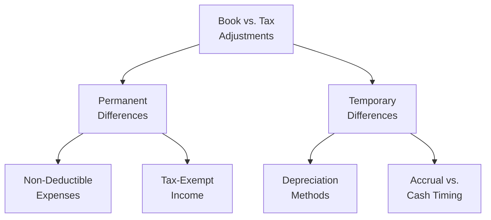

## 18.3 Reporting Requirements and Common Errors

Accurate tax reporting is essential for ensuring compliance with federal, state, and local tax laws. While Chapter 18.1 and 18.2 of this guide discuss the differences between book and tax income—focusing on permanent and temporary items—this section zeroes in on the most relevant reporting requirements for both small and large entities. It also explores common pitfalls and errors that often arise when reconciling book and tax income. By understanding which items are most frequently overlooked, you can strengthen your compliance planning and minimize audit risk. 

In this section, you will learn about:
• Key reporting requirements for federal tax purposes  
• Frequently overlooked items, including meals, fines, and life insurance proceeds  
• Common errors encountered when completing the necessary Forms (e.g., Form 1120, Form 1065) and related schedules (Schedules M-1, M-3)  
• Best practices to help ensure accurate and complete filings  

-------------------------------------------------------------------------------

### Overview: From Book Income to Taxable Income

In prior sections, we introduced permanent and temporary adjustments that flow from an entity’s financial statements (books) to its tax return. Understanding how to systematically identify and record these adjustments is vital to the accurate calculation of taxable income. Entities typically use Schedules M-1 or M-3 (depending on total assets and other thresholds) to reconcile financial statement income to taxable income reported on their federal returns.

Below is a simplified illustration of how book net income is reconciled to taxable income for federal tax reporting. Each node shows a stage or step in bridging the gap between what appears in an entity’s financial records and what ultimately appears on a tax return.

1. Book Net Income (A) – The starting point reflecting the entity’s net income from its financial statements.  
2. Non-Deductible Expenses (B) – Items like fines, penalties, or certain meal expenses that must be added to book income to arrive at taxable income because they are disallowed as deductions for tax.  
3. Tax-Exempt Income (C) – Income that is not taxable at the federal level, such as life insurance proceeds. This amount is subtracted from book income in determining taxable income.  
4. Timing Differences (D) – Temporary differences caused by the timing of revenue and expense recognition in book vs. tax accounting (e.g., differences in depreciation methods or accrued expenses).  
5. Taxable Income (E) – The final result, which forms the basis for the entity’s tax liability once tax rates and other credits are applied.  

-------------------------------------------------------------------------------

### Key Reporting Requirements

Taxpayers must follow both overarching guidelines and specific instructions issued by the IRS to accurately report book-to-tax differences.  
   
• Schedules M-1 vs. M-3:  
  – Schedule M-1: Required for entities that do not meet the threshold for filing Schedule M-3. Entities use M-1 to briefly reconcile net income per books to taxable income by listing specific add-backs and deductions.  
  – Schedule M-3: Generally required for corporations and partnerships with total assets of $10 million or more. Schedule M-3 provides a more detailed breakdown and categorization of book-to-tax differences, increasing transparency.  

• Form 1120 (Corporations) and Form 1065 (Partnerships):  
  – These returns include lines where adjustments for items like Section 179 expense, depreciation, charitable contributions, and other tax preference items must be brought in from supporting schedules.  
  – Each line in the return has corresponding instructions; reading them carefully can prevent errors in classification.  

• Record Maintenance and Documentation:  
  – The IRS requires taxpayers to maintain records that support income, deductions, and credits. This includes general ledgers, financial statements, invoices, and other pertinent documents.  
  – Documentation must demonstrate how each book item was treated for tax, particularly regarding items that appear differently for financial vs. tax purposes.  

• Materiality Thresholds:  
  – The IRS allows certain safe harbors and small-item write-offs (e.g., de minimis safe harbor for tangible property regulations). Careful evaluation ensures permissible deductions without triggering red flags.  

-------------------------------------------------------------------------------

### Frequently Overlooked Items

Although every entity faces unique reporting challenges, certain expense categories and income items consistently cause confusion. Below are some of the most commonly overlooked or misclassified adjustments:

#### Meals and Entertainment
• Reduced Deductibility: Business-related meals are generally limited to a 50% deduction, though some types of meals may qualify for 100% deduction under specific conditions.  
• Entertainment Expenses: No longer deductible under current tax rules, but often mistakenly included in deductible business expenses for tax.  

#### Fines and Penalties
• Non-Deductible: Fines, penalties, and certain legal settlements imposed by a government unit remain disallowed deductions for tax purposes. These amounts must be added back to book income on the M-1 or M-3 reconciliation.  

#### Life Insurance Proceeds
• Tax-Exempt: Amounts that a corporation receives from an officer’s or key employee’s life insurance policy typically are non-taxable income at the federal level. This adjustment is often missed on the return, leading to an overstatement of taxable income if not properly subtracted.  

#### Premiums for Key Person Life Insurance
• Potential Non-Deductibility: Premiums paid by a company on life insurance for an employee may be deductible in some contexts, but often are not if the company is the beneficiary.  
• Proper documentation should verify the beneficiary to determine the correct tax treatment.  

#### Political Contributions and Lobbying Expenses
• Generally Disallowed: These expenses must be added back to book income since they are not deductible for tax.  

#### Employee Fringe Benefits
• Under-Reported or Over-Reported: Certain fringe benefits like group-term life insurance, de minimis fringe benefits, or employer-provided vehicles can lead to confusion, especially if not allocated properly between deductible and non-deductible components.  

#### Officers’ Compensation
• Reasonableness Test: If officer compensation is considered excessive, part of it can be reclassified as a non-deductible distribution in a closely held corporation. This reclassification is often overlooked when finalizing tax returns.  

-------------------------------------------------------------------------------

### Common Errors and Pitfalls

The complexity of reconciling book and tax data often leads to oversight. Some of the most common errors and pitfalls include:

• Incorrect Classification of Certain Expenses:  
  – Including 100% of meal expenses as a deduction rather than the 50% limit.  
  – Overlooking the non-deductibility of entertainment expenses.  
  – Deducting fines, penalties, or political contributions.  

• Failing to Adjust for State and Local Tax Differences:  
  – Although the focus here is federal, many states have different requirements relating to depreciation or NOL carryovers. Failing to make state-specific adjustments can result in under- or over-reported taxable income on the federal return if the recordkeeping is not carefully segmented.  

• Overlooking Related-Party Transactions:  
  – Transactions with related entities must conform to arm’s length principles. Failure to record related-party interest, salaries, or rent expense/income adjustments is a common error that can attract close IRS scrutiny.  

• Double-Counting or Omitting Credits and Deductions:  
  – Some tax credits, such as the research and development (R&D) credit, might require a reduction of the related deductions. Missing such adjustments can lead to double-dipped deductions.  

• Inadequate Support for Timing Differences:  
  – Depreciation schedules must match the methods permitted for tax.  
  – Accrued expenses and reserves (e.g., bad debts, warranties) often differ for book and tax but may lack adequate documentation.  

• Failing to Document Tax-Exempt Items Properly:  
  – Many filers forget to subtract life insurance proceeds or fail to distinguish among partially tax-exempt and fully tax-exempt items.  

-------------------------------------------------------------------------------

### Best Practices for Minimizing Errors

Many of the errors noted above stem from insufficient planning and poor recordkeeping. Embracing the following best practices can significantly mitigate risk:

• Create a Year-Round Documentation System  
  – Keep detailed documentation of major, unusual, or non-recurring expenses and income items.  
  – Maintain a centralized location for all source documents (invoices, receipts, bank statements, board minutes, etc.) that support transactions.  

• Conduct Interim Reviews of Book-to-Tax Differences  
  – Quarterly or monthly reconciliations can catch misstatements early.  
  – Incorporate checklists focusing on the most overlooked items, like meals, fines, and life insurance proceeds.  

• Use a Chart or Table of Non-Deductible Items and Monitoring Tools  
  – Train staff to flag potential non-deductible or partially deductible items.  
  – Automate the process by setting up distinct expense categories in the accounting system (e.g., separate general ledger accounts for 100% vs. 50% deductible meals, or for fines and penalties).  

• Leverage Established Supporting Workpapers  
  – Tie each significant item on the M-1 or M-3 to a specific schedule or workpaper.  
  – Reference every line to a piece of evidence or accounting system report.  

• Stay Current on Tax Law Updates  
  – Tax legislation changes frequently. Meal deductibility rules, depreciation rules, and allowable credits may alter how you classify items.  
  – Use official IRS guidance, subscribe to reputable tax services, and monitor legislative changes continuously.  

• Engage a Tax Professional for Complex Issues  
  – Particularly relevant for large or multinational entities, an outside specialist can help ensure compliance with complicated issues such as related-party transactions, foreign tax credits, and consolidated returns.  

-------------------------------------------------------------------------------

### Practical Example: Reconciling Meals, Fines, & Life Insurance Proceeds

To illustrate common oversights in real-world scenarios, consider the following hypothetical case:

ABC Manufacturing, Inc. has the following items recorded in its financial statements:  
• Book Net Income: $500,000  
• Meals & Entertainment: $30,000 (fully deducted on books)  
• Fines Paid for Regulatory Violations: $5,000 (recorded as an operating expense)  
• Life Insurance Proceeds from Key Employee Policy: $50,000 (recorded in Other Income on books)  

When preparing the tax return, ABC Manufacturing should:  
1. Add Back 50% of the Meals & Entertainment expense ($15,000) for the portion not allowed as a deduction. Entertainment per se is non-deductible, so if any portion of the $30,000 included entertainment, that portion is entirely disallowed.  
2. Add Back Fines and Penalties ($5,000), because they are not deductible.  
3. Subtract the Life Insurance Proceeds ($50,000), which are tax-exempt.  

The net adjustment ensures that Taxable Income is neither overstated nor understated.

-------------------------------------------------------------------------------

### Additional Case Study: Misclassification of Depreciation

XYZ Construction, LLC purchased new equipment with a cost of $60,000. On the financial statements, the company used straight-line depreciation over five years. For tax purposes, the equipment should be depreciated under MACRS (Modified Accelerated Cost Recovery System) over five years with a half-year convention (or take Section 179 or bonus depreciation if it qualifies). 

If XYZ fails to account for the difference between straight-line depreciation per books and MACRS or accelerated depreciation for tax, it may incorrectly report its taxable income. Over time, this mismatch can compound, leading to incorrect net operating loss (NOL) computations, misapplied credits, and potential IRS penalties.

-------------------------------------------------------------------------------

### Diagram: Common Book vs. Tax Adjustment Categories

Below is a high-level classification of the most frequent book vs. tax adjustments, helping you visualize common categories that require careful review.

1. Permanent Differences (B): These do not reverse, such as fines or life insurance proceeds.  
2. Temporary Differences (C): Reverse in future periods, such as depreciation or accruals.  
3. Non-Deductible Expenses (D): Must be added back to book income for tax.  
4. Tax-Exempt Income (E): Subtracted from book income.  
5. Depreciation Methods (F): Book depreciation versus tax depreciation (MACRS).  
6. Accrual vs. Cash Timing (G): Income or expenses recognized at different times for financial statements and tax returns.  

-------------------------------------------------------------------------------

### Conclusion

Reporting requirements serve as a foundational element in bridging the gap between book and tax income. By systematically accounting for everyday adjustments—especially frequently overlooked categories such as meals, fines, and life insurance proceeds—tax professionals and business owners can reduce errors and substantially minimize audit risks. Adequate documentation and best practices, such as categorizing expenses effectively and leveraging interim reviews, ensure that each tax return accurately reflects the reality of the business’s financial situation.

Looking ahead, attention to detail and continuous professional development will remain critical. Tax laws evolve, and so too do the ways in which the IRS monitors and enforces compliance. Adopting a conscientious, year-round approach to recordkeeping and reporting lays the groundwork for accurate, transparent, and strategic tax filings.

-------------------------------------------------------------------------------

## Master Your Book-to-Tax Compliance: Top Reporting Requirements Quiz



### Which statement best describes the primary purpose of Schedule M-3 for large corporations and partnerships?

- [ ] It summarizes only revenue transactions above $10 million.  
- [x] It provides a more detailed breakdown of book-to-tax differences for entities with $10 million or more in total assets.  
- [ ] It offers an alternative method for reporting capital gains.  
- [ ] It reports all stock transactions over the period.  

> **Explanation:** Schedule M-3 is generally required for entities with $10 million or more in total assets and provides a highly detailed reconciliation of financial statement income to taxable income.

### Which of the following expenses is typically only partially deductible for tax purposes?

- [x] Meals for legitimate business meetings  
- [ ] Employer-paid health insurance premiums  
- [ ] Fines imposed by government agencies  
- [ ] Lobbying expenses related to state legislation  

> **Explanation:** In most scenarios, only 50% of the cost of business meals is tax-deductible. Other listed items (like fines and lobbying expenses) are generally non-deductible, and employer-paid health insurance premiums are generally fully deductible.

### What is a common error regarding life insurance proceeds owned by a corporation on key employees?

- [x] Failing to subtract tax-exempt life insurance proceeds from book income when calculating taxable income  
- [ ] Over-applying the 50% meal deduction  
- [ ] Reporting life insurance proceeds as ordinary income  
- [ ] Treating the proceeds as a capital gain  

> **Explanation:** Life insurance proceeds received by a corporation for which it is the beneficiary are generally excluded from taxable income. Omitting this exclusion overstates taxable income.

### Which of the following best characterizes a permanent difference between book and tax income?

- [ ] Depreciation that is recognized faster for tax than for book  
- [x] Political contributions that are not deductible for tax purposes  
- [ ] Prepaid expenses recognized in a later year for book than for tax  
- [ ] Accrued bonuses paid after year-end  

> **Explanation:** Permanent differences never reverse; political contributions are permanently disallowed for tax and thus remain a permanent difference.

### Which is the best practice to avoid common schedule filing errors?

- [x] Maintain interim (monthly or quarterly) reconciliations of book income to tax adjustments  
- [ ] Combine all expenses into one line item for simplicity  
- [x] Use separate general ledger accounts only at year-end  
- [ ] Rely solely on year-end adjusting entries  

> **Explanation:** Conducting interim reviews and maintaining detailed accounts throughout the year ensures that errors are caught early, providing a more accurate final reconciliation.

### What is the recommended approach for handling related-party transactions in book-to-tax reconciliations?

- [x] Ensure they follow arm's length principles and proper documentation  
- [ ] Never include them in the tax return since they are irrelevant  
- [ ] Treat them as permanently disallowed expenses  
- [ ] Only disclose them if the transaction exceeds $100,000  

> **Explanation:** The IRS heavily scrutinizes related-party transactions to ensure they closely resemble transactions that would occur with independent third parties. Proper documentation and arm's length principles are essential to avoid misclassification or disallowances.

### Which of the following items is often misunderstood on returns filed by larger corporations?

- [x] Requirements of Schedule M-3 as opposed to M-1  
- [ ] Treatment of salaries for line workers  
- [x] Sales tax reporting for renting equipment  
- [ ] Straight-line depreciation for book purposes  

> **Explanation:** Larger entities often must file Schedule M-3 for detailed reconciliation. Confusion can arise when transitioning from M-1 to M-3 requirements.

### What is a key IFRS-to-U.S. GAAP difference that can lead to book-to-tax confusion?

- [x] Differing criteria for revenue recognition timing  
- [ ] Identical recognition of entertainment expenses  
- [ ] Uniform rules for stock options across all jurisdictions  
- [ ] Non-existence of partial deductibility for meals  

> **Explanation:** IFRS and U.S. GAAP can differ on the timing and criteria for recognizing revenue and costs. This can create confusion if not properly adjusted for tax purposes under U.S. law.

### Which of the following best depicts a temporary difference rather than a permanent difference?

- [x] Accelerated depreciation for tax purposes vs. straight-line for books  
- [ ] Fines and penalties that are never deductible  
- [ ] Lobbying expenses  
- [ ] Life insurance proceeds to a corporate beneficiary  

> **Explanation:** Accelerated depreciation methods create a mismatch in the timing of expense recognition between book and tax but eventually even out over an asset's life, qualifying as a temporary difference.

### True or False: Entertainment expenses were fully deductible prior to the 2018 tax law changes and remain fully deductible under current IRS regulations.

- [x] True  
- [ ] False  

> **Explanation:** Historically, entertainment expenses had partial deductibility or elaborate rules. However, under the law effective from 2018 onward, entertainment expenses are largely nondeductible.  



-------------------------------------------------------------------------------

## For Additional Practice and Deeper Preparation

### [Taxation & Regulation (REG) CPA Mock Exams](https://www.udemy.com/course/reg-cpa-mock-exams/?referralCode=55419EBD198F61530B12)  

**Taxation & Regulation (REG) CPA Mocks:** 6 Full (1,500 Qs), Harder Than Real! In-Depth & Clear. Crush With Confidence!

- Tackle full-length mock exams designed to mirror real REG questions.  
- Refine your exam-day strategies with detailed, step-by-step solutions for every scenario.  
- Explore in-depth rationales that reinforce higher-level concepts, giving you an edge on test day.  
- Boost confidence and minimize anxiety by mastering every corner of the REG blueprint.  
- Perfect for those seeking exceptionally hard mocks and real-world readiness.

_Disclaimer: This course is not endorsed by or affiliated with the AICPA, NASBA, or any official CPA Examination authority. All content is for educational and preparatory purposes only._
