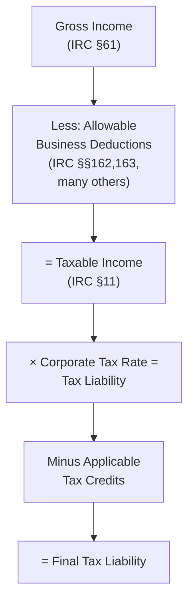
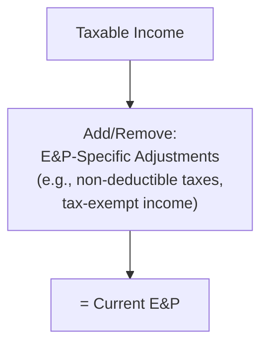

## 19.1 Computation of Taxable Income and Tax Liability

Building on earlier discussions in Chapter 18 regarding book-to-tax differences, this section focuses on how C corporations compute their taxable income and ultimately calculate their federal income tax liability. Organizations need to follow a systematic approach, beginning with total (gross) income (per IRC §61) and then making adjustments, including deductions, special limitations, and credits. This process culminates in determining the amount of tax owed. The final figure not only drives the corporation’s tax return (Form 1120) but eventually impacts the corporation’s Earnings & Profits (E&P), which in turn determines the tax treatment of distributions to shareholders.

Below, we break down each component of the formula, illustrate key IRC sections, analyze common pitfalls, and demonstrate the interplay between taxable income and E&P.

---

### Overview of Corporate Tax Computation

The general formula for calculating corporate taxable income under IRC §11 is summarized as follows:

1. Start with gross income (IRC §61).  
2. Subtract allowable business deductions (IRC §162 and others).  
3. Arrive at taxable income.  
4. Multiply taxable income by the applicable corporate tax rate (a flat 21% for tax years beginning after 2017).  
5. Subtract any available tax credits.  
6. Determine final tax liability.  

After the tax liability is computed, corporations adjust their Earnings & Profits by considering items that differ from strict “taxable income” calculations. E&P is important for classifying shareholder distributions as dividends, returns of capital, or capital gains.  

Below is a high-level overview in diagram form to illustrate the flow from gross income to tax liability:

---

### Step 1: Determine Corporate Gross Income

Gross income for a C corporation includes all income from whatever source derived (IRC §61). The corporation’s accounting must capture:

• Sales revenue from goods or services.  
• Interest income, dividends, rental income, royalties, and capital gains.  
• Fees, commissions, or any other business-related inflows.  

Certain items may be excluded or treated differently for tax purposes (e.g., municipal bond interest, which is generally excluded under IRC §103). Companies often begin their computation with the “book” or financial accounting income and then adjust for tax provisions as needed.  

---

### Step 2: Subtract Allowable Deductions

#### 1. Ordinary and Necessary Business Expenses (IRC §162)
The basic rule allows deduction of “all the ordinary and necessary expenses paid or incurred during the taxable year in carrying on any trade or business.” Examples include salaries, wages, rent, insurance, advertising, and other operational costs.  

#### 2. Depreciation (IRC §§167, 168)  
Depreciation accounts for the wear and tear of tangible assets over their useful life. Corporations typically use the Modified Accelerated Cost Recovery System (MACRS) for tax depreciation, as outlined in IRC §168, to compute their allowable deductions. Additionally, Section 179 expensing and bonus depreciation may apply to qualified property.  

#### 3. Interest Expense (IRC §163)  
Interest on business debt is generally deductible, subject to certain limitations (e.g., the business interest expense limitation under IRC §163(j)).  

#### 4. Charitable Contributions (IRC §170)  
Corporations can deduct charitable contributions, but there are limits (generally 10% of taxable income, computed before certain deductions). Excess contributions can be carried forward for up to five years.  

#### 5. Net Operating Loss (NOL) Deductions (IRC §172)  
If a corporation generates a Net Operating Loss in a particular tax year, it may carry the loss forward to offset future taxable income (subject to the limitations in force for that tax period). The CARES Act and subsequent legislation temporarily modified these rules, so you must keep current with legislative changes.  

#### 6. Other Common Deductions  
• State and local income taxes paid or accrued (IRC §164).  
• Amortization of intangible assets (e.g., Section 197 intangibles, startup expenditures).  
• Bad debt expense (partial worthlessness or total worthlessness, subject to IRC §166).  

Subtracting all allowable deductions from gross income yields the corporation’s tentative taxable income.

---

### Step 3: Account for Book-Tax Differences

Although this topic is covered more extensively in Chapter 18 (Differences Between Book and Tax Income), it is crucial to reiterate that corporations often start with financial accounting net income and then make adjustments on Schedules M-1 or M-3 to arrive at taxable income for federal income tax purposes. Some typical reconciling items are:

• Depreciation and amortization (accelerated for tax vs. straight-line for book).  
• Meal and entertainment expense limitations (partial disallowance for tax).  
• Differences in recognition of income items (e.g., unearned revenue).  
• Federal income tax expense (deducted for book but not for tax).  

Once these adjustments are made, the corporation arrives at its final taxable income figure—in compliance with IRS rules.

---

### Step 4: Calculate Tax Liability

After determining taxable income, the corporation applies the statutory corporate federal income tax rate. Currently, for tax years beginning after December 31, 2017, the rate is a flat 21%.  

Thus,  
Tax Liability Before Credits = Taxable Income × 21%  

#### Available Credits
Certain tax credits may reduce the final liability. Common examples include general business credits (IRC §38), the research and development (R&D) tax credit (IRC §41), and the foreign tax credit (IRC §§901–909). Credits do not affect the calculation of taxable income; instead, they directly reduce the tax liability after it is computed.  

---

### Earnings & Profits (E&P) Considerations

Earnings & Profits (E&P) is a concept separate from taxable income and is crucial for determining whether corporate distributions to shareholders are taxed as dividends, returns of capital, or capital gains. The computation of E&P begins with taxable income but requires many modifications, because certain items included in or excluded from taxable income differ from their treatment for E&P purposes.

#### Adjustments to Arrive at E&P
• **Additions to Taxable Income**: 
  – Certain tax-exempt income (e.g., municipal bond interest) is included in E&P.  
  – Deductions taken for NOL carryforwards might be added back.  

• **Subtractions from Taxable Income**:  
  – Federal income taxes paid reduce E&P.  
  – Non-deductible fines, penalties, and lobbying expenses reduce E&P.  
  – Charitable contributions disallowed for tax but actually paid may reduce E&P. 

• **Timing Differences**: Some items create temporary differences for E&P purposes, factoring into current vs. accumulated E&P differently than they do for taxable income.  

In simplest terms:
Current E&P = Taxable Income ± E&P Adjustments

Below is a simple diagram illustrating how E&P branches off from taxable income:

---

### Putting It All Together: Example

Suppose Redwood Manufacturing, Inc. has the following items for the tax year:

• Gross Receipts (sales): $1,200,000  
• Cost of Goods Sold: $700,000  
• Operating Expenses (including wages, rent, utilities): $200,000  
• Depreciation per tax rules (MACRS): $50,000  
• Charitable Contributions: $40,000  
• Interest on Municipal Bonds (excluded from gross income for tax but relevant for E&P): $10,000  
• Federal Income Tax Paid in Prior Year (for E&P adjustment): $30,000  

Step 1: Compute Gross Income  
Redwood’s reported Gross Income (for tax) is essentially $1,200,000 – $700,000 = $500,000 from the primary business operations. (Municipal bond interest is excluded from taxable income by IRC §103, so it does not enter Redwood’s tax gross income.)

Step 2: Subtract Allowable Deductible Expenses  
• Operating expenses: $200,000  
• Depreciation: $50,000  

Step 3: Compute Tentative Taxable Income Before Charitable Contributions  
$500,000 – $200,000 – $50,000 = $250,000  

Step 4: Apply Charitable Contribution Limitation  
Charitable deduction is generally limited to 10% of taxable income before the deduction of the contribution itself (subject to modifications). The limit is 10% of $250,000, which is $25,000. Redwood contributed $40,000, so only $25,000 is currently deductible. The remaining $15,000 is carried forward up to five years.

Step 5: Final Taxable Income  
$250,000 – $25,000 = $225,000  

Step 6: Corporate Tax Liability at 21%  
$225,000 × 21% = $47,250  

Step 7: E&P Adjustments  
To calculate Redwood’s current E&P, start with $225,000 (taxable income), then add back the municipal interest of $10,000, subtract the $30,000 in federal income tax expense, and subtract any other E&P-specific adjustments.  

• Add: $10,000 (since it was excluded from taxable income but is included in E&P).  
• Subtract: $30,000 (federal income tax, which reduces E&P).  

Resulting in $225,000 + $10,000 – $30,000 = $205,000 current E&P (ignoring any further necessary adjustments).

---

### Common Pitfalls

1. **Improper Treatment of Charitable Contributions**: Remember the 10% of taxable income limitation. Excess contributions carry forward.  
2. **Incorrect Depreciation Methods**: Ensure MACRS is applied correctly, particularly if bonus depreciation or Section 179 expensing is used.  
3. **Failure to Account for Interest Deduction Limits (IRC §163(j))**: If your company has significant debt, you may be subject to the business interest deduction limitation.  
4. **Misclassification of Startup or Organizational Costs**: Some costs must be capitalized and amortized over 15 years (IRC §195).  
5. **Ignoring State and Local Tax Implications**: Federal deductions may differ from state or local tax rules, leading to multi-jurisdictional complexity.  
6. **Forgetting E&P Adjustments**: Neglecting to track E&P can cause issues when classifying distributions as dividends or returns of capital.  

---

### Key IRC Sections and Best Practices

• **IRC §61** – Defines gross income.  
• **IRC §162** – Governs trade or business expenses.  
• **IRC §168** – Provides MACRS depreciation schedules.  
• **IRC §170** – Covers charitable contribution deductions.  
• **IRC §163(j)** – Limits business interest deductions.  
• **IRC §172** – Addresses NOL deductions.  
• **IRC §11** – Specifies the corporate tax rate.  
• **IRC §§531–537** – Accumulated earnings tax details.  
• **IRC §§541–547** – Personal holding company tax provisions.  
• **IRC §§301–318** – Distributions to shareholders and related definitions for E&P.  

**Best Practices**:  
• Maintain clear documentation of all transactions for potential IRS audits.  
• Use tracking schedules for book-tax differences to expedite M-1/M-3 calculations.  
• Promptly reconcile corporate distributions with E&P to avoid dividend misclassification.  
• Consult updated IRS guidance and any finalized Treasury regulations that may alter deductibility or rate structures.

---

### Conclusion

Computing corporate taxable income and tax liability requires a systematic analysis of gross income, careful application of the Internal Revenue Code’s deduction and limitation rules, and the correct usage of tax credits. Properly determining taxable income is vital not only for meeting current tax obligations but also for maintaining accurate E&P records, which underpin how shareholder distributions are taxed. A robust understanding of relevant IRC sections and consistent compliance with filing requirements lays the foundation for sound corporate tax planning.

---

## Master Your Corporate Tax Liability Knowledge



### Which IRC section primarily defines “gross income” for a C corporation?

- [ ] IRC §162
- [ ] IRC §170
- [x] IRC §61
- [ ] IRC §863

> **Explanation:** IRC §61 is the broad, foundational section in the Internal Revenue Code that defines gross income for tax purposes.

### For which type of deduction does IRC §162 provide guidance?

- [x] Ordinary and necessary business expenses.
- [ ] Charitable contributions.
- [ ] Depreciation of intangible assets.
- [ ] NOL carryforwards.

> **Explanation:** IRC §162 covers ordinary and necessary business expenses paid or incurred in carrying on a trade or business.

### Which of the following must be subtracted from taxable income to arrive at current E&P?

- [ ] Meals and entertainment over 50% disallowance.
- [x] Federal income tax paid.
- [ ] Nontaxable municipal bond interest.
- [ ] Section 179 expense.

> **Explanation:** In computing current E&P, federal income taxes paid reduce E&P even though they are not deducted in calculating taxable income.

### What is the general annual deduction limitation for corporate charitable contributions?

- [ ] 2% of adjusted gross income.
- [ ] Unlimited if made to qualified recipients.
- [x] 10% of taxable income (before certain adjustments).
- [ ] 25% of taxable income net of dividends received.

> **Explanation:** Corporations are allowed a charitable contribution deduction limited to 10% of their taxable income, computed before certain deductions.

### Which of the following is correct regarding net operating losses (NOLs)?

- [x] NOLs can be carried forward and applied to future taxable income, subject to statutory limits.
- [ ] NOLs can only be carried back without limit.
- [x] Legislation can alter the carryback/carryforward rules.
- [ ] NOLs cannot be used to offset corporate taxable income from other activities.

> **Explanation:** NOLs traditionally can be carried forward (and sometimes carried back, subject to legislative changes). The CARES Act and other legislative updates have changed the rules periodically, making it important to consult the current law.

### A C corporation’s tax rate for tax years beginning after December 31, 2017, is typically:

- [ ] 15% of taxable income.
- [x] 21% flat rate on taxable income.
- [ ] 35% on taxable income.
- [ ] 10% on the first $50,000 of taxable income.

> **Explanation:** Under the Tax Cuts and Jobs Act, a flat 21% rate applies to most C corporations for tax years beginning after December 31, 2017.

### A corporation’s E&P calculation includes adjustments to taxable income for:

- [x] Nontaxable municipal bond interest.
- [ ] All income reported on the financial statement.
- [x] Federal income tax expense.
- [ ] Retirement plan contributions in excess of the limit.

> **Explanation:** Municipal bond interest is added back to reach E&P even though it is excluded from taxable income. Federal income tax reduces E&P even though it is not deductible from taxable income.

### For charitable contributions exceeding the annual limitation, the excess:

- [ ] Must be deducted in the current tax year.
- [ ] Is lost permanently.
- [x] May be carried forward for up to five subsequent years.
- [ ] Can be carried back indefinitely.

> **Explanation:** Corporations can carry forward contributions that exceed the 10% limitation for up to five succeeding tax years.

### Which of the following statements is true about tax credits?

- [x] They reduce the tax liability after it has been calculated.
- [ ] They cannot reduce the tax liability below zero.
- [ ] They are added to taxable income.
- [ ] They only apply to individuals.

> **Explanation:** Credits, such as the R&D credit or foreign tax credit, directly reduce the corporation’s tax liability, after computing that liability from taxable income.

### A distribution to shareholders is classified as a dividend to the extent of:

- [x] The corporation’s current and accumulated E&P.
- [ ] The corporation’s total assets on the balance sheet.
- [ ] Taxable income for the current year.
- [ ] Gross receipts for the current year.

> **Explanation:** Amounts distributed up to the level of the corporation’s current and accumulated E&P are generally treated as dividends for tax purposes.



---

## For Additional Practice and Deeper Preparation

### [Taxation & Regulation (REG) CPA Mock Exams](https://www.udemy.com/course/reg-cpa-mock-exams/?referralCode=55419EBD198F61530B12)

Taxation & Regulation (REG) CPA Mocks: 6 Full (1,500 Qs), Harder Than Real! In-Depth & Clear. Crush With Confidence!

- Tackle full-length mock exams designed to mirror real REG questions.  
- Refine your exam-day strategies with detailed, step-by-step solutions for every scenario.  
- Explore in-depth rationales that reinforce higher-level concepts, giving you an edge on test day.  
- Boost confidence and minimize anxiety by mastering every corner of the REG blueprint.  
- Perfect for those seeking exceptionally hard mocks and real-world readiness.  

_Disclaimer: This course is not endorsed by or affiliated with the AICPA, NASBA, or any official CPA Examination authority. All content is for educational and preparatory purposes only._
