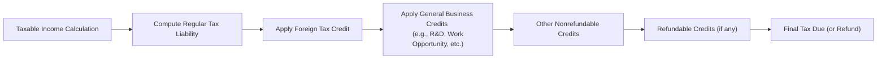

## 19.2 Allowable Credits and Deductions

In this section, we closely examine the allowable credits and deductions available to C corporations. While Chapter 19.1 introduced the calculation of corporate taxable income and tax liability, we now turn to the potential tax-reducing items that come into play. Specifically, we highlight the general framework for corporate deductions under the Internal Revenue Code (IRC) and discuss significant business credits such as the Research and Development (R&D) Credit and the Foreign Tax Credit (FTC). We will also explore the rules governing the order in which multiple credits are applied—a topic that is not only crucial for exam purposes but also immediately valuable in professional practice.

--------------------------------------------------------------------------------
  
### Overview and Importance of Credits and Deductions

A C corporation’s tax liability can be significantly reduced by utilizing available deductions to lower taxable income and by applying legitimate credits against its tax owed. Understanding how to maximize these tax benefits can lead to substantial savings and strategic advantages. Key advantages for corporations include:

• Lowering overall effective tax rates through proactive planning.  
• Avoiding “leaving money on the table” by failing to claim legitimate credits and deductions.  
• Ensuring compliance with complex ordering rules for credits and the limitations on certain deductions.

Credits generally provide a dollar-for-dollar reduction in tax liability, whereas deductions reduce the tax base (i.e., taxable income). As a result, credits often yield a more powerful impact on the final tax bill compared to many deductions. However, both remain central to strategic corporate tax planning.

Below, we explore major deductions and credits, followed by an in-depth look at the typical ordering rules and a concise flow of how a corporation should apply these benefits.

--------------------------------------------------------------------------------

### Major Deductions for C Corporations

C corporations enjoy a wide array of deductions under the tax code, primarily found in IRC Section 162 (Trade or Business Expenses). While not exhaustive, the following highlights some significant deductions that frequently affect a corporation’s tax liability.

#### Ordinary and Necessary Business Expenses Under IRC §162
A C corporation can deduct all ordinary and necessary business expenses paid or incurred during the taxable year. This includes wages, salaries, rent, utilities, office supplies, and more. The principal requirement is that such expenses be:

1. Ordinary: Common and accepted in the industry.  
2. Necessary: Helpful and appropriate for the trade or business.  

#### Compensation and Employee Benefits
Compensation costs—such as salaries, bonuses, and certain fringe benefits—are often among the largest deductions. Key concerns include:
- Reasonableness of wages: The IRS may challenge deductions for compensation considered excessive.  
- Fringe benefit deductions: Some benefits are fully deductible; others are subject to caps or exclusions (e.g., employee meals, certain entertainment reimbursements).

#### Charitable Contributions
Under IRC §170, C corporations may deduct charitable contributions to qualified organizations, subject to tight rules and limitations.  
- Annual deduction limit for corporations is typically 10% of adjusted taxable income (calculated before certain deductions such as the NOL deduction and the dividends received deduction).  
- Unused charitable contributions can generally be carried forward for up to five years.

#### Dividends Received Deduction (DRD)
The Dividends Received Deduction (DRD) encourages intercorporate investments by allowing corporations to deduct a portion of dividends received from other domestic corporations. The DRD percentage usually ranges from 50% to 100% of the dividends received, depending on the ownership stake in the distributing corporation.  
- 50% DRD: Ownership less than 20%.  
- 65% DRD: Ownership ≥ 20% but < 80%.  
- 100% DRD: Ownership ≥ 80%.  

#### Net Operating Losses (NOLs)
If a corporation’s deductions exceed gross income, it generates a Net Operating Loss (NOL). Modern rules typically allow an indefinite carryforward of NOLs (subject to an annual 80% taxable income limitation for post-2017 NOLs), though there have been temporary changes under certain legislation. See Section 19.5 for additional details on NOL carryovers and their treatment.

#### Business Interest Expense Deduction
Under Section 163(j), the deduction for business interest expense can be limited. Generally, it may not exceed the sum of:
1. Business interest income for the year.  
2. 30% (or potentially 50% for some periods) of the taxpayer’s adjusted taxable income (ATI).  
3. Floor plan financing interest (for certain vehicle dealerships).

Disallowed interest is carried forward indefinitely as business interest expense.

--------------------------------------------------------------------------------

### Common Tax Credits Available to Corporations

Tax credits are powerful tools to reduce a corporation’s final tax liability after it is computed, subject to limitations and ordering rules. Two of the most prominent credits are discussed in detail here: the R&D Credit and the Foreign Tax Credit (FTC). In addition, corporations may avail themselves of other general business credits such as the Work Opportunity Tax Credit, Small Business Health Care Tax Credit, Orphan Drug Credit, and Employer-Provided Child Care Credit. All these are aggregated under the general business credit framework of IRC §38, but each one has unique qualification criteria and limitations.

#### Research & Development Credit (Credit for Increasing Research Activities)
The R&D Credit, governed by IRC §41, is intended to encourage technological innovation. Key points include:
- Qualified Research Activities (QRAs): Expenditures must be for activities intended to discover information that is technological in nature and aimed at developing a new or improved business component (e.g., product, process, software).  
- Calculation: The credit is often computed as 20% of the excess of qualified research expenses (QREs) over a base amount. Alternate simplified credit methods are also common.  
- Payroll Tax Offset: Small or startup businesses may be able to use a portion of the R&D credit to offset the employer’s portion of Social Security tax. This can be especially beneficial for emerging companies that do not yet have income tax liability.  
- Carryback and Carryforward: Generally, unused R&D credits can be carried back one year and carried forward up to 20 years.

##### Example: Calculating the R&D Credit
Imagine InnovateCo, a C corporation, spends $500,000 on qualified research labor and materials in the current tax year. Their base amount is $300,000. The excess is $200,000 ($500,000 – $300,000). Under the regular method, InnovateCo’s R&D credit (before other limitations) is 20% of $200,000 = $40,000.  
If InnovateCo has only $20,000 of current tax liability, they may use $20,000 of the credit this year (subject to other ordering rules and limitations), and typically carry forward the remaining $20,000 of unutilized credit.

#### Foreign Tax Credit (FTC)
The Foreign Tax Credit under IRC §901 and related sections prevents double taxation for income earned abroad. Key highlights:
- Credit vs. Deduction: Taxes paid to foreign countries can be taken as either a deduction or a credit, but most corporations prefer the credit because it provides a direct offset to U.S. tax liability.  
- Limitation: The amount of FTC is limited to the portion of U.S. tax attributable to foreign-source income. Specifically, FTC is capped per “basket” of income. For many corporations, the general limitation calculation is:
  
  
  \text{FTC Limit} = \text{U.S. Tax Liability} \times 
  \frac{\text{Foreign-Source Taxable Income}}{\text{Worldwide Taxable Income}}
  
  
- Carryovers: Any unused foreign taxes can generally be carried back one year and carried forward 10 years.  
- Separate Limitation Baskets: Certain income categories (e.g., passive vs. certain high-taxed global intangible low-taxed income or GILTI) have separate baskets, which limit cross-crediting.

##### Example: Applying the FTC Limitation  
Suppose WorldTrade, Inc., a U.S. corporation, has the following for the year:  
• U.S. taxable income from domestic operations: $800,000.  
• Foreign-source income: $200,000.  
• Total corporate taxable income: $1,000,000.  
• Pre-credit U.S. tax liability (assuming a 21% corporate rate): $210,000.   
• Foreign taxes paid on the $200,000 of foreign income: $30,000.  

The maximum FTC is limited by the ratio of foreign-source income to total worldwide income:  
FTC Limit = $210,000 × ($200,000 / $1,000,000) = $42,000  

WorldTrade can credit only up to $42,000, but it has paid $30,000 in foreign taxes, so it can claim a $30,000 FTC. It’s below the limit, thereby eliminating the risk of any disallowed foreign tax. If the foreign taxes had been $50,000, only $42,000 would be claimed in the current year, with the remaining $8,000 carried back or forward, as allowable by rules.

#### Other General Business Credits
In addition to the R&D Credit and FTC, various other credits may apply, such as:
- Work Opportunity Tax Credit  
- Employer-Provided Child Care Credit  
- Credit for Employer-Provided Family and Medical Leave  
- Orphan Drug Credit  
- Disabled Access Credit  
- Various energy credits (like the Investment Tax Credit for solar or other renewables)

All these credits are aggregated under IRC §38 and are subject to an overall limitation based on net income tax. Each credit has distinct eligibility and compliance requirements but follows similar principles in how they reduce the final corporate tax liability.

--------------------------------------------------------------------------------

### Ordering Rules for Credits

When multiple credits are available in a single tax year, they cannot all be applied simultaneously at random. The Code and regulations stipulate a specific hierarchy (or “ordering rule”) for claiming credits. Although the nuances can be intricate, the high-level typical sequence for C corporations is generally as follows:

1. **Nonrefundable Personal Credits** (less common for corporations).  
2. **Foreign Tax Credit** under IRC §§27, 901–909.  
3. **General Business Credits** under IRC §38 (including R&D Credit, Work Opportunity Credit, and others).  
4. **Other Nonrefundable Credits** that do not fall under the general business credit grouping.  
5. **Refundable Credits** (if any remain, such as certain overpayments or specialized refundable portions).

Depending on legislative changes, certain credits may strictly come before or after each other. In practice, corporations often rely on advanced tax software or explicit manual guidelines to ensure correct sequencing.

Below is a simplified visual of how a corporation might calculate its tax liability and apply credits in the proper order:

In this diagram, the ordering ensures that the Foreign Tax Credit is applied first, followed by the general business credits, then any other nonrefundable credits. Finally, any refundable credits are applied to potentially create or increase a refund.

--------------------------------------------------------------------------------

### Key Considerations and Pitfalls

• **Credit Limitation and Carryovers**: Many credits, including the R&D Credit and Foreign Tax Credit, cannot reduce tax liability below certain thresholds. Check carryback and carryforward rules to optimize usage.  
• **Documentation and Substantiation**: Both the IRS and state taxing authorities often scrutinize credits like R&D or Foreign Tax Credits. Maintain robust records of qualifying activities and legal compliance.  
• **Charitable Contributions Timing**: As a deduction, contributions may be subject to annual limitations. Timely oversight of corporate giving can ensure that the full deduction can be used each year or appropriately carried forward.  
• **Reasonableness of Compensation**: The IRS may reclassify compensation as dividends if it deems wages are excessive, thus disallowing portions of certain wage deductions and triggering double taxation at both the corporate and shareholder levels.  
• **Interplay with Net Operating Losses**: Since NOLs carry forward against future taxable income, the available “base” for determining credit limitations can shift from year to year. Model out multiple years to avoid losing valuable credits.  
• **State-Level Conformity**: Some states do not fully conform to the federal treatment of certain credits or deductions, adding a layer of complexity to multistate corporations.

--------------------------------------------------------------------------------

### Practical Case Study: Combining Credits with Less Taxable Income

Imagine CatalystTech, Inc., a newly formed software solutions company. During its second year in operation, the company engages in extensive R&D, incurring $400,000 in R&D expenses, and also earns $50,000 of foreign-source income subject to $7,000 in foreign taxes. CatalystTech’s computed tax liability on all income (before credits) is $120,000.

1. **Foreign Tax Credit**:  
   - FTC limit based on foreign to total income. If foreign income is a small fraction of total worldwide income, the limit might allow a full $7,000 credit.  
2. **General Business Credit (R&D)**:  
   - Assume that CatalystTech’s R&D credit is $40,000 (subject to the base expense calculations).  
3. **Ordering**:  
   - Apply the FTC first. If $7,000 is fully usable, the tax liability is reduced to $113,000.  
   - Next, apply the $40,000 R&D credit, reducing the liability from $113,000 to $73,000.  

CatalystTech has effectively saved $47,000 in tax, leaving a net liability of $73,000. If any portion of the R&D credit or FTC was disallowed or carried forward, that would be tracked for use in subsequent tax years. Proper planning and documentation are essential to ensure the maximum allowed credit is realized.

--------------------------------------------------------------------------------

### Strategies for Maximizing Credits and Deductions

• **Engage in Early Planning**: Identify potential credit-qualifying activities—like R&D projects—at the beginning of the tax year to properly track eligible expenses.  
• **Optimize Funding and Entity Structure**: For smaller entities, consider whether an S election (Chapter 20) offers more advantages. However, for large-scale R&D or foreign operations, a C corporation may remain the optimal choice.  
• **Charitable Contribution Timing**: Accelerate philanthropy into a year with higher taxable income if you are near the 10% limitation. Conversely, scale back if a large NOL is projected.  
• **Monitor Foreign Sourcing**: Carefully structure global supply chains, intercompany transfer pricing, and participation in foreign markets to optimize the FTC limitation.  
• **Track Per-Credit Limitations**: Many credits collectively form the “general business credit,” but each sub-credit might have unique restrictions, carryover periods, or recapture provisions.  

--------------------------------------------------------------------------------

### Conclusion

Credits and deductions are among the most potent tools within a C corporation’s tax arsenal. By methodically identifying allowable deductions (e.g., business expenses, charitable contributions, DRD) and leveraging available credits (e.g., R&D Credit, Foreign Tax Credit, and other general business credits), corporations can significantly reduce their federal income tax liability. A proper understanding of the ordering rules ensures that no credits go to waste while also minimizing the risk of errors in taxable income calculation.  

Professionals preparing for the REG CPA Exam should be familiar with common corporate deductions, the intricacies of major credits, typical ordering principles, and the potential for carryovers. In practice, proficient tax planning and attention to detail often make a decisive difference in a company’s after-tax bottom line.

--------------------------------------------------------------------------------

## Mastery Checkpoint
• Are you comfortable explaining the difference between a deduction and a credit for a C corporation?  
• Do you know how to calculate and apply the R&D and Foreign Tax Credits, including limitations?  
• Can you articulate the typical ordering rules for corporate tax credits and explain why they matter?  

Continue to refine your knowledge by reviewing pertinent Internal Revenue Code sections (e.g., §§162, 170, 243, 41, 901) and official IRS guidance. Exam candidates should also practice preparing mock tax returns using different permutations of deductions and credits to gain confidence with these essential concepts.

--------------------------------------------------------------------------------

## Quiz on Corporate Credits and Deductions



### Which of the following best describes the difference between a deduction and a credit for corporate tax purposes?

- [ ] Deductions reduce the tax owed dollar-for-dollar, while credits reduce the taxable income.  
- [x] Deductions reduce taxable income, whereas credits directly reduce tax liability.  
- [ ] Deductions reduce both taxable income and tax liability equally, credits only reduce taxable income.  
- [ ] There is no difference; both reduce tax liability in the same way.

> **Explanation:** A deduction lowers taxable income, while a credit provides a dollar-for-dollar offset against the final tax bill.

### Under typical ordering rules, which credit is generally applied first for a C corporation?

- [ ] General business credits  
- [ ] R&D credit  
- [x] Foreign Tax Credit  
- [ ] Refundable credits

> **Explanation:** The Foreign Tax Credit typically gets applied before general business credits, followed by other nonrefundable credits and finally any refundable credits.

### Which of the following types of corporate income is eligible for the Dividends Received Deduction (DRD)?

- [x] Dividends from a domestic corporation in which the taxpayer holds at least some percentage of ownership  
- [ ] Interest income from U.S. Treasury bonds  
- [ ] Royalties received from licensing intangible assets  
- [ ] Foreign dividends from a corporation established in a foreign country

> **Explanation:** The DRD applies only to dividends received from a domestic corporation. The applicable percentage depends on the ownership stake (50%, 65%, or 100%).

### A U.S. corporation has $300,000 of foreign-source income out of total worldwide income of $1,000,000, and a U.S. tax liability of $210,000 before credits. If it paid $80,000 in foreign taxes, what is the maximum Foreign Tax Credit under the basic limitation?

- [ ] $21,000  
- [ ] $42,000  
- [x] $63,000  
- [ ] $80,000

> **Explanation:** The FTC limit is $210,000 × ($300,000 / $1,000,000) = $63,000. Any foreign taxes exceeding this amount may be carried back or forward, subject to other rules.

### Which of the following statements regarding the R&D Credit is correct?

- [x] It can be carried back one year and forward up to 20 years if not fully utilized in the current year.  
- [ ] It must be used within the same year generated or it expires.  
- [ ] It can only be carried forward, not backward.  
- [ ] It automatically offsets all payroll taxes.

> **Explanation:** The R&D Credit is allowed a one-year carryback and a 20-year carryforward. In some situations, small startup businesses may also apply a portion of the credit against payroll tax liabilities, but that is subject to specific qualifications.

### When a corporation’s charitable contributions exceed the 10% deduction limit for the current year, how long can it carry forward any excess charitable contributions?

- [ ] Up to 3 years  
- [ ] Up to 10 years  
- [x] Up to 5 years  
- [ ] Indefinitely

> **Explanation:** Excess corporate charitable contributions may be carried forward for five years.

### Which of the following deductions is subject to the business interest expense limitation under IRC §163(j)?

- [x] Interest expense on business loans  
- [ ] Depreciation expense on leased equipment  
- [x] Interest on recourse liabilities used for business operations  
- [ ] Costs of legal services

> **Explanation:** The IRC §163(j) limitation applies to business interest expense. Both recourse and nonrecourse interest used for business operations can be subject to limitation. However, depreciation and legal fees are not interest expenses.

### The Dividends Received Deduction (DRD) is generally allowed for:

- [x] Dividends from domestic corporations in which the taxpayer has an ownership interest  
- [ ] Capital gains distributions from mutual funds  
- [ ] Dividends from foreign corporations with no U.S. subsidiary  
- [ ] Interest paid on a foreign bond

> **Explanation:** The DRD is expressly designed to mitigate multiple layers of taxation on dividends from domestic corporations.

### Which of the following can result from failing to properly document R&D expenses?

- [x] Partial or complete disallowance of the R&D Credit  
- [ ] Mandatory extended carryforward of the R&D Credit  
- [ ] Unlimited retroactive claims of payroll tax offsets  
- [ ] Automatic penalty abatement

> **Explanation:** Poor documentation or incomplete support for qualifying expenses can lead the IRS to disallow the R&D Credit.

### A corporation’s Foreign Tax Credit for a particular year:

- [x] Has a carryback period of one year and a carryforward period of ten years  
- [ ] May not be carried forward if not used in the current year  
- [ ] Can be claimed only in the year the foreign income is earned  
- [ ] Follows the same carryover rules as the R&D Credit

> **Explanation:** The FTC generally has a one-year carryback and ten-year carryforward period, different from the R&D Credit’s one-year carryback and 20-year carryforward.  



--------------------------------------------------------------------------------

## For Additional Practice and Deeper Preparation

### [Taxation & Regulation (REG) CPA Mock Exams](https://www.udemy.com/course/reg-cpa-mock-exams/?referralCode=55419EBD198F61530B12)

**Taxation & Regulation (REG) CPA Mocks:** 6 Full (1,500 Qs), Harder Than Real! In-Depth & Clear. Crush With Confidence!

- Tackle full-length mock exams designed to mirror real REG questions.  
- Refine your exam-day strategies with detailed, step-by-step solutions for every scenario.  
- Explore in-depth rationales that reinforce higher-level concepts, giving you an edge on test day.  
- Boost confidence and minimize anxiety by mastering every corner of the REG blueprint.  
- Perfect for those seeking exceptionally hard mocks and real-world readiness.

_Disclaimer: This course is not endorsed by or affiliated with the AICPA, NASBA, or any official CPA Examination authority. All content is for educational and preparatory purposes only._
