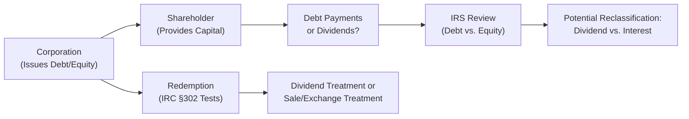

## 19.3 Capital Structure and Transactions Between Corporation and Shareholders

The relationship between a C corporation and its shareholders is facilitated and shaped by the corporation’s capital structure—primarily the mix of debt and equity—and by the transactions that occur between these two entities. Understanding this interplay is crucial for tax professionals, as each aspect can lead to unique tax consequences. Capital structure choices, dividend distributions, stock redemptions, and adjustments to stock basis can significantly influence both corporate and individual tax liabilities. Moreover, distinguishing between debt and equity is often scrutinized by the Internal Revenue Service (IRS) to ensure accurate tax treatment. This section explores the fundamentals and advanced considerations of these topics, engaging in practical illustrations, real-world examples, and case studies to highlight the core concepts.

--------------------------------------------------------------------------------
### Introduction to Capital Structure  
Capital structure generally refers to how a corporation finances its operations and growth—whether primarily with debt, equity, or a combination. For tax purposes, the distinction between debt and equity is not merely a financial choice but also a pivotal classification that influences interest deductibility, dividend taxation, and the overall tax burden on both the corporation and its shareholders.

A well-chosen capital structure can unlock favorable tax treatment that maximizes the corporation’s after-tax profits and minimizes the tax burden passed on to shareholders. However, regulatory scrutiny arises when corporations appear to disguise equity as debt (or vice versa) to exploit loopholes. The IRS has established frameworks and various judicial precedents that guide the classification of corporate instruments, ensuring appropriate tax outcomes.

In what follows, we discuss four essential areas:

1. Dividends from a corporation to its shareholders.  
2. Stock redemptions and their tax consequences.  
3. Stock basis adjustments.  
4. Debt vs. equity rules and their application.  

Readers should also refer to previous sections in Chapter 19 (e.g., 19.1 and 19.2) for complementary guidance on computing taxable income and allowable deductions for C corporations, which form part of the foundation of the capital structure decision process.

--------------------------------------------------------------------------------
### Dividends: Definition and Tax Treatment  

Dividends are distributions of corporate earnings and profits (E&P) to shareholders based on their ownership interest. Generally, these distributions are taxed to shareholders as dividend income, and the corporation typically cannot deduct such dividends. Key points include:

• **Definition of a Dividend:**  
  Under IRC §316, a dividend is a distribution of property by a corporation to its shareholders made out of the corporation’s current or accumulated earnings and profits.  

• **Types of Dividends:**  
  - **Cash Dividends:** Most common and straightforward form, where the corporation pays shareholders in cash.  
  - **Property Dividends:** Distribution of non-cash property, such as securities of another company. The fair market value (FMV) of this property is recognized as dividend income for the shareholder, and the corporation might realize a gain (but not a loss) on the distribution.  
  - **Stock Dividends:** Issuances of additional shares to existing shareholders. Typically nontaxable to the shareholder if pro-rata, unless certain conditions (like the shareholder having a choice of cash or stock) trigger taxability.  

• **Qualified vs. Non-Qualified Dividends:**  
  - **Qualified Dividends:** Eligible for preferential capital gains rates if the shareholder meets certain holding period requirements and the dividend is paid by a U.S. corporation or qualified foreign corporation.  
  - **Non-Qualified Dividends:** Taxed at ordinary income rates.  

• **Corporation-Level Effects:**  
  - Dividends are not tax-deductible expenses to the distributing corporation.  
  - Distributions in excess of earnings and profits are generally treated as a return of capital, reducing the shareholder’s basis in the stock, and can be taxed as capital gain once the basis is fully recovered.  

#### Example: Cash Dividend
Suppose ABC Corp. has $500,000 of current E&P and distributes $100,000 in cash dividends to its shareholders. Each shareholder receiving the dividend typically reports this as dividend income. ABC Corp. does not receive a deduction and recognizes no gain or loss on the distribution (assuming solely cash distribution).

--------------------------------------------------------------------------------
### Stock Redemptions  

A corporate stock redemption is a transaction through which a corporation acquires its own shares from a shareholder in exchange for property (often cash). The primary question in these situations is whether a redemption will be taxed to the shareholder as:
1. A dividend (subject to the dividend rules or distribution rules),  
2. Or a sale of stock, resulting in capital gain or loss treatment.  

#### Determining Dividend or Sale Treatment  
IRC §§302 and 318 provide the criteria for distinguishing between dividend and sale treatment. Generally, a redemption qualifies for sale or exchange treatment if it meets one of the following tests:
- **Substantially Disproportionate Redemption:** The shareholder’s percentage of voting power and ownership after the redemption is significantly reduced compared to before the transaction (usually below 80% of the pre-redemption ownership percentage).  
- **Complete Termination of Shareholder Interest:** If a shareholder fully terminates his or her stock ownership in the corporation. Family attribution rules need consideration; the shareholder must relinquish direct and indirect ownership to meet this test.  
- **Not Essentially Equivalent to a Dividend:** A facts-and-circumstances test to determine whether there has been a meaningful reduction in the shareholder’s proportionate interest.  
- **Partial Liquidation Redemptions (for non-corporate shareholders):** Under certain conditions, amounts received in partial liquidation can also qualify for capital gain treatment.  

If none of these criteria are met, the redemption is treated as a dividend distribution to the extent of the corporation’s E&P. Any amount exceeding E&P typically reduces the shareholder’s basis in the stock.  

#### Example: Substantially Disproportionate Redemption
XYZ Corp. has two shareholders: Anna (60% ownership) and Bob (40% ownership). If Anna redeems 30 of her 60 shares, reducing her ownership from 60% to 30%, the transaction might qualify as substantially disproportionate if it meets the specific statutory thresholds (i.e., Anna’s post-redemption ownership is less than 80% of her prior ownership percentage). In such a scenario, Anna’s redemption proceeds are treated as capital gains income rather than dividend income.

--------------------------------------------------------------------------------
### Constructive Ownership and Attribution Rules  
The constructive ownership rules in IRC §318 ensure that a person’s indirect ownership—via family members or related entities—is included in determining whether a redemption is substantially disproportionate or not essentially equivalent to a dividend. These rules can cause surprises when taxpayers assume they have fully divested or significantly reduced their holdings in an entity. For instance, if a parent redeems stock but the child (who lives in the same household) continues to hold a significant interest, the parent may still be attributed that child’s interest, undermining a potential sale treatment.

--------------------------------------------------------------------------------
### Stock Basis Adjustments  

Stock basis is of critical importance for tax accounting, especially when determining the character and amount of gain or loss on stock transactions. A shareholder’s basis in corporate stock is initially determined by the cost of acquisition—which may be adjusted upwards or downwards throughout the holding period.  

Key adjustments include:  
1. **Return of Capital Distributions:** If a corporation distributes amounts in excess of E&P, that portion is nontaxable and reduces the shareholder’s basis in the stock.  
2. **Redemptions Classified as Sale:** The shareholder’s basis is recovered first, and then any excess proceeds are treated as capital gain.  
3. **Redemptions Classified as Dividends:** The shareholder’s stock basis remains unchanged. However, should the redemption reduce the number of shares held (or be part of a partial redemption scenario), the basis related to the redeemed shares may be reallocated or removed if the transaction is eventually confirmed to be sale treatment.  
4. **Tax-Free Stock Dividends:** Generally, receiving additional shares does not trigger immediate taxation, but the total stock basis is spread over the new total number of shares owned.

--------------------------------------------------------------------------------
### Debt vs. Equity Classifications  

A cornerstone of corporate tax planning involves identifying whether a financial instrument is properly treated as debt (and thus potentially generating deductible interest payments) or as equity (producing nondeductible dividend payments). The IRS and courts apply a facts-and-circumstances approach, weighing multiple factors, including:

1. **Intent of Parties:** Does the corporation intend to create a debtor-creditor relationship or to issue equity?  
2. **Subordination and Rights in Liquidation:** Does the instrument share characteristics common to unsecured creditors, or does it rank similarly to shareholders’ equity positions?  
3. **Fixed Maturity and Payment Schedule:** Debt typically has an established maturity date with mandated interest. Equity is indefinite and payments (dividends) are discretionary.  
4. **Investor’s Right to Enforce Payment:** Creditors have a legal right to enforce payment. Shareholders’ recovery is contingent on corporate profitability and liquidation value.  
5. **Participation in Management or Corporate Growth:** Equity holders often have voting rights and share future appreciation.  

If the IRS recharacterizes a purported loan from a shareholder as equity, the corporation’s interest payments may be reclassified as dividends, denying the corporation an interest deduction and causing the shareholder to receive dividend income instead of interest income.

#### Thin Capitalization  
Thin capitalization occurs when the corporation is financed largely through debt, relative to a nominal amount of equity. The IRS may argue that the stated “debt” is essentially an equity instrument intended to artificially generate interest deductions. Courts often analyze debt-equity reclassification issues in such scenarios, potentially resulting in adverse consequences for taxpayers.

--------------------------------------------------------------------------------
### Practical Example and Case Study  

To illustrate these concepts more concretely, let’s walk through a scenario involving a technology start-up, NextGen Innovations, financed with a mix of traditional bank debt, shareholder “loans,” and common stock.  

1. **Initial Capital Structure:**  
   - Bank loan: $1,000,000, with regular interest payments.  
   - Shareholder Note: $500,000 from a key investor, structured as promissory notes but with no fixed maturity date.  
   - Common stock: $250,000 from multiple shareholders.  

   NextGen claimed shareholder note interest deductions over the course of five years, reducing its taxable income.  

2. **IRS Reclassification:**  
   - The IRS reviewed the note between NextGen and the key investor, concluding that the indefinite maturity, lack of real enforcement mechanisms, and subordination elements resembled equity more than debt.  
   - As a result, the IRS reclassified interest payments as nondeductible dividend distributions, subjecting the investor to dividend income treatment and increasing NextGen’s taxable income by the disallowed interest deductions.  

3. **Subsequent Stock Redemption:**  
   - Several years later, NextGen performs a partial redemption of the investor’s shares. The investor’s ownership goes from 40% to 25%. The IRS examines whether this redemption qualifies as substantially disproportionate under IRC §302.  
   - Because the redemption meets the thresholds (post-redemption interest is below 80% of the pre-redemption percentage), the cardinal rules of redemption and constructive ownership are satisfied, qualifying the transaction as a sale or exchange.  
   - Thus, the redeemed shares result in a capital gains transaction, permitting the investor to offset the proceeds by the portion of basis allocated to the redeemed shares.  

This scenario underscores the importance of carefully documenting debt arrangements and analyzing redemptions under IRC §302 to avoid unexpected dividend classification.

--------------------------------------------------------------------------------
### Diagram: Relationship of Corporation, Shareholder, and Transactions  

Below is a simplified diagram illustrating the flow of capital structure transactions between a corporation and its shareholders. The diagram demonstrates how a dividend or redemption flows from the corporation to the shareholder and the potential reclassification from debt to equity:

• A["Corporation  (Issues Debt/Equity)"] represents the initial capital structure choices.  
• B["Shareholder  (Provides Capital)"] invests in or loans funds to the corporation.  
• C["Debt Payments  or Dividends?"] is the corporation’s ongoing payments.  
• D["IRS Review  (Debt vs. Equity)"] and E["Potential Reclassification:   Dividend vs. Interest"] show where reclassification may occur.  
• F["Redemption  (IRC §302 Tests)"] depicts the mechanics of share repurchase.  
• G["Dividend Treatment or  Sale/Exchange Treatment"] clarifies the final determination for tax consequences.

--------------------------------------------------------------------------------
### Common Pitfalls and Best Practices  

1. **Ignoring Attribution Rules:** Taxpayers who neglect to consider family or related-entity ownership may incorrectly classify a redemption as a sale.  
2. **Incomplete Documentation of Shareholder Loans:** Failing to formalize creditor rights, a fixed repayment schedule, or an interest rate can lead to the IRS reclassifying debt as equity.  
3. **Misconstruing Dividends Out of E&P:** Distributing property or cash without verifying the extent of E&P can lead to accounting errors and missed tax opportunities (e.g., correct return-of-capital treatment).  
4. **Failing to Track Stock Basis:** Neglecting basis calculations can cause inaccuracies when reporting capital gain or losses, especially in partial redemptions or distributions.  
5. **Excessive Thin Capitalization:** Overreliance on debt financing from shareholders can be red-flagged by the IRS.  

#### Best Practices  
• Maintain thorough documentation for loans, including interest rates and repayment terms.  
• Annually calculate and track earnings and profits to identify dividend vs. return of capital.  
• Use professional judgment or consult experts to verify compliance with IRC §§302 and 318 regarding stock redemptions.  
• Develop a system to track stock basis adjustments consistently—particularly important for frequent distributions or complex corporate structures.  

--------------------------------------------------------------------------------
### Additional References

1. **Internal Revenue Code (IRC) §§302, 304, 316, and 318** – Governing rules for stock redemptions, dividends, and constructive ownership.  
2. **IRS Publication 542, “Corporations”** – General tax guidance for C corporations.  
3. **IRS Publication 551, “Basis of Assets”** – Reference for determining and adjusting stock basis.  
4. **Treasury Regulations §1.385-1 to §1.385-3** – Regulations providing factors for classifying debt vs. equity.  
5. **Case Law:** United States v. Uneco, Fin Hay Realty Co. v. United States, and other leading cases addressing debt vs. equity classification.

--------------------------------------------------------------------------------
### Conclusion  
Decisions regarding corporate capital structure and transactions between a corporation and its shareholders carry significant tax implications. Being well-versed in dividend distributions, stock redemptions, stock basis adjustments, and the delicate boundary between debt and equity is vital for CPA candidates and practicing professionals. Proper structuring and thorough documentation safeguard against unintended reclassifications and optimize tax outcomes for both the corporation and its shareholders.

By combining statutory analysis, a grasp of practical examples, and diligent tracking of shareholder basis, tax practitioners can confidently navigate these complex transactions. Whether forming a new entity or restructuring an existing corporation, a working knowledge of these principles is essential to ensuring compliance and leveraging potential tax benefits.

--------------------------------------------------------------------------------

## Test Your Knowledge: C Corporation Dividends, Redemptions, and Shareholder Transactions



### Dividends paid by a C corporation are generally:
- [x] Nondeductible by the corporation and taxable to the shareholder.
- [ ] Deductible by the corporation and taxable to the shareholder.
- [ ] Nondeductible by the corporation and tax-exempt to the shareholder.
- [ ] Meaningless for federal tax purposes.

> **Explanation:** Unlike interest on debt, corporate dividends are not deductible by the corporation and are typically taxable to the receiving shareholder.

### A redemption of stock that qualifies as “substantially disproportionate” under IRC §302 typically results in:
- [x] Capital gain or loss treatment for the shareholder.
- [ ] Ordinary income for the shareholder.
- [x] A reduction of the corporation’s earnings and profits.
- [ ] Exclusion of the redemption proceeds from the shareholder’s income.

> **Explanation:** A substantially disproportionate redemption is generally taxed as a sale of stock, allowing the shareholder capital gain or loss treatment. Since the redemption is a distribution of property, it also reduces the corporation’s E&P by the amount of the distribution.

### If a distribution exceeds the corporation’s earnings and profits (E&P), it is:
- [x] Treated as a return of capital to the extent of the shareholder’s basis.
- [ ] Taxed as ordinary income.
- [ ] Always considered a capital gain.
- [ ] Disallowed as a distribution.

> **Explanation:** Distributions exceeding current and accumulated E&P reduce the shareholder’s basis in their stock (return of capital). Once the shareholder’s basis is reduced to zero, any excess amount is treated as a capital gain.

### In determining whether a redemption is a sale or dividend, the constructive ownership rules:
- [x] Attribute shares owned by certain family members or related entities to the redeeming shareholder.
- [ ] Do not apply if the shareholder owns less than 80% of the voting stock.
- [ ] Always override the corporation’s stated classification.
- [ ] Apply only to shareholders with 50% or more interest.

> **Explanation:** Under IRC §318, shares owned by certain family members or through other related entities are considered owned by the shareholder, potentially affecting redemption qualification.

### Which of the following factors is indicative of a debt instrument (rather than equity)?
- [x] A fixed maturity date with enforceable rights to repayment.
- [ ] Payment contingent on corporate profitability.
- [x] The corporation’s obligation to pay a specified rate of interest.
- [ ] Ownership rights in the management of the corporation.

> **Explanation:** Genuine debt typically carries an enforceable obligation for repayment, includes interest payments, and has a fixed maturity date, which is distinct from equity features.

### When a shareholder’s “loan” to the corporation is reclassified as equity by the IRS:
- [x] Interest payments are treated as nondeductible dividends.
- [ ] The shareholder’s basis in debt increases.
- [ ] The corporation must file amended returns only for future years.
- [ ] The transaction has no impact on the corporation’s net operating losses.

> **Explanation:** If the IRS determines a loan is actually equity, any “interest” paid is reclassified as dividends—nondeductible to the corporation and taxable to the shareholder.

### A cash dividend paid to shareholders out of current E&P will:
- [x] Reduce the corporation’s current E&P.
- [ ] Increase the shareholder’s stock basis.
- [x] Result in taxable income for the shareholder.
- [ ] Fully avoid taxation if it is a qualified dividend.

> **Explanation:** A dividend reduces current E&P (or accumulated E&P if current E&P is insufficient) and is generally taxable to the shareholder. Qualified dividends may be taxed at preferential rates, but they are not tax-free.

### A redemption that results in the complete termination of a shareholder’s interest:
- [x] Is taxed as a sale or exchange if family attribution rules do not prevent termination.
- [ ] Is automatically taxed as a dividend.
- [ ] Does not require consideration of anything other than the cash received.
- [ ] Always increases the shareholder’s basis in remaining shares.

> **Explanation:** If a shareholder fully terminates their interest (and the attribution rules are satisfied), the redemption is treated as a sale with capital gain or loss consequences.

### If a corporation distributes property with a fair market value above its basis in a nonliquidating distribution:
- [x] The corporation recognizes a gain on the distribution.
- [ ] The corporation recognizes a loss on the distribution.
- [ ] The shareholder recognizes a corporate-level loss.
- [ ] The basis in the shareholder’s hands is zero.

> **Explanation:** If the property’s FMV exceeds the corporation’s basis, the corporation recognizes a gain. However, the corporation cannot recognize a loss on a distribution if FMV is less than basis.

### A thinly capitalized corporation primarily financed by “shareholder loans” might face:
- [x] IRS reclassification of debt as equity.
- [ ] Complete immunity from IRS scrutiny if interest rates are at market levels.
- [ ] Guaranteed interest deductions on all shareholder loans.
- [ ] Automatic suspended loss carryover for the shareholder.

> **Explanation:** A thinly capitalized corporation runs a high risk of having its purported debt reclassified as equity, causing a loss of interest deduction and dividend-related consequences.



--------------------------------------------------------------------------------

## For Additional Practice and Deeper Preparation

### [Taxation & Regulation (REG) CPA Mock Exams](https://www.udemy.com/course/reg-cpa-mock-exams/?referralCode=55419EBD198F61530B12)

**Taxation & Regulation (REG) CPA Mocks:** 6 Full (1,500 Qs), Harder Than Real! In-Depth & Clear. Crush With Confidence!

- Tackle full-length mock exams designed to mirror real REG questions.  
- Refine your exam-day strategies with detailed, step-by-step solutions for every scenario.  
- Explore in-depth rationales that reinforce higher-level concepts, giving you an edge on test day.  
- Boost confidence and minimize anxiety by mastering every corner of the REG blueprint.  
- Perfect for those seeking exceptionally hard mocks and real-world readiness.  

_Disclaimer: This course is not endorsed by or affiliated with the AICPA, NASBA, or any official CPA Examination authority. All content is for educational and preparatory purposes only._
