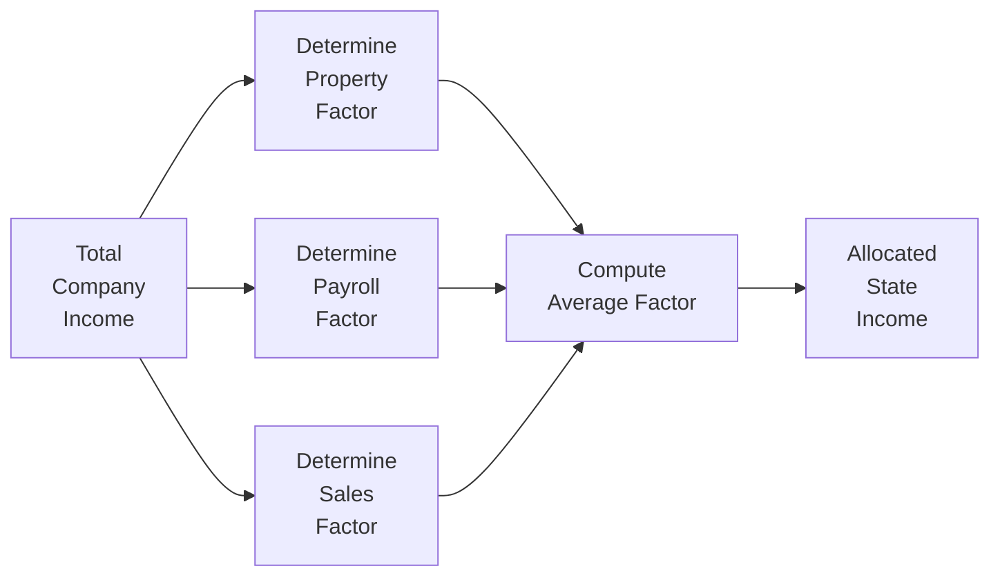

## 19.4 State and Local Tax Considerations, Nexus, Apportionment

State and local taxation (commonly referred to as SALT) is a critical component of corporate tax compliance and strategic planning. As businesses expand across state lines—through sales, services, or physical presence—they become subject to a variety of state and local tax rules. This section focuses on the central concepts of state nexus, apportionment of income, throwback rules, and the protections offered by Public Law 86-272 (PL 86-272). We will integrate these concepts into an overall framework, highlighting best practices, common pitfalls, and regulatory compliance strategies.  

Readers seeking to deepen their knowledge of federal income tax for C corporations, including topics such as consolidated return regulations and international tax concepts, may find it helpful to refer back to other sections of Chapter 19 (e.g., Sections 19.1, 19.2, and 19.7).

--------------------------------------------------------------------------------

### Overview of State Nexus

Nexus refers to the minimum level of contact between a taxpayer and a state that allows the state to subject the taxpayer to its taxing jurisdiction. If a corporation has sufficient nexus in a state, that state can impose taxes on some or all of the corporation’s income arising from—or attributed to—activities within that state. Understanding how nexus is established is crucial, as failing to comply with a state’s tax laws can lead to significant penalties and additional assessments.

#### Physical Presence Nexus

Historically, nexus was primarily established through physical presence:
• Maintaining a store, office, warehouse, or employees in the state.  
• Owning or leasing property (real or personal) within the state.  
• Frequent and systematic visits by sales representatives or agents operating within that state.  

Once a corporation exceeded the threshold for physical presence, the state gained authority to impose its corporate income tax. Although physical presence remains a dominant factor, many states have expanded the scope of nexus beyond the physical presence standards, especially concerning economic nexus.

#### Economic Nexus

Economic nexus emerged as a principle that targets out-of-state businesses generating substantial revenue from in-state customers or markets, even if they lack a physical presence. Economic nexus rules became more common after landmark court cases that recognized states’ power to impose tax on out-of-state entities deriving significant economic benefit from local markets.

For example, a state might set a revenue threshold (e.g., $500,000 in annual in-state sales) or a transactions threshold (e.g., 200 in-state transactions) to determine if a business has economic nexus. Once these thresholds are met, the corporation is required to comply with state registration and filing obligations for corporate income tax or other taxes.

--------------------------------------------------------------------------------

### Public Law 86-272

PL 86-272 provides limited federal protection from state corporate income tax for certain out-of-state businesses that solicit sales of tangible personal property within a state. Under PL 86-272, if an out-of-state corporation’s only business activity in the state is the solicitation of orders for tangible personal property—where the orders are approved and shipped from outside that state—then the corporation generally cannot be subject to that state’s income tax.  

However, PL 86-272 does not apply to:
• Activities related to services or intangible property.  
• Non-tax corporate obligations such as franchise taxes, gross receipts taxes, or sales and use taxes.  
• Activities that exceed “solicitation,” such as product installation, sales support, or product demonstrations beyond soliciting orders.  

Corporate taxpayers must carefully analyze the scope of their in-state activities. Even minor activities outside of solicitation (e.g., providing warranty services on-site) can cause a loss of PL 86-272 protection and trigger nexus for corporate income tax.  

--------------------------------------------------------------------------------

### Apportionment of Multistate Income

When corporations operate in multiple states, each state in which the corporation has nexus typically taxes only the portion of income attributable to that state. The process, known as apportionment, determines what percentage of the corporation’s total income is taxable in a particular state.  

#### Common Apportionment Formulas

1. Three-Factor Formula (Traditional): Historically, most states used an equally weighted three-factor formula based on the corporation’s property, payroll, and sales within the state relative to its totals everywhere.  
   • Property Factor: (In-State Property / Total Property)  
   • Payroll Factor: (In-State Payroll / Total Payroll)  
   • Sales Factor: (In-State Sales / Total Sales)  
   • Income Apportioned to a State = Total Income × [(Property Factor + Payroll Factor + Sales Factor) ÷ 3]

2. Double-Weighted Sales or Single-Sales Factor: Trend analyses show that many states increasingly place a heavier weight on the sales factor to encourage businesses to locate property or payroll within the state. The most aggressive states have adopted a single-sales factor, where only the sales factor is used.  
   • Single-Sales Apportionment: Income Apportioned to a State = Total Income × (Sales Factor)  

3. Market-Based Sourcing vs. Cost-of-Performance: For the sale of services, states may rely on different sourcing rules. Cost-of-performance sourcing attributes the revenue to the location where most costs to perform the service were incurred, whereas market-based sourcing looks to where the customer receives or benefits from the service.

#### Practical Example Illustrating a Three-Factor Formula

• Total corporate net income: $10,000,000  
• Property factor: The corporation has $3,000,000 of property in the State vs. $15,000,000 total. Hence the property factor is 3,000,000 / 15,000,000 = 0.20 (or 20%).  
• Payroll factor: In-state payroll is $2,500,000 vs. $10,000,000 total. Hence the payroll factor is 2,500,000 / 10,000,000 = 0.25 (25%).  
• Sales factor: $4,000,000 in-state sales vs. $20,000,000 total. Hence the sales factor is 4,000,000 / 20,000,000 = 0.20 (20%).  

If the state uses an equally weighted three-factor formula:

Average factor = (0.20 + 0.25 + 0.20) ÷ 3 = 0.2167 (21.67%)  
Apportioned income = $10,000,000 × 0.2167 = $2,167,000  

A shift to single-sales factor, double-weighted sales, or market-based sourcing may drastically alter the taxable income in a state.

--------------------------------------------------------------------------------

### Throwback Rules

Some states enact “throwback” or “throwout” rules aimed at limiting the ability to avoid state taxation on sales made to jurisdictions that do not impose income tax. The throwback rule generally provides that if sales are shipped from a state to a destination where the corporation is not taxable, those sales are “thrown back” and treated as in-state sales for apportionment purposes.

• Example: A corporation located in State A ships products to customers in State B, where the corporation has no nexus. In this situation, State B cannot tax the income. Because the sale is unsourced for apportionment reasons, the sale is “thrown back” into State A’s sales factor, increasing the portion of taxable income allocated to State A.  

Throwback rules can significantly increase a corporation’s tax base in its domiciliary state. Companies should consider throwback exposures when evaluating sales from a “home state” perspective and determine whether creating nexus (or adopting alternative supply chain distributions) might offer improved overall tax efficiency.

--------------------------------------------------------------------------------

### Visualizing the Apportionment Process

Below is a simple Mermaid diagram showing how apportionment factors guide the allocation of total company income into state-taxable portions.

Explanation:
1. Compute total company net income (A).  
2. Determine in-state vs. total amounts for property (B), payroll (C), and sales (D) factors.  
3. Average (or weigh appropriately) the three factors (E).  
4. Multiply the total net income by the apportionment factor to arrive at the portion taxable in the state (F).  

--------------------------------------------------------------------------------

### Additional Considerations and Best Practices

• Employee vs. Independent Contractor Classification: Misclassifying workers can inadvertently trigger nexus if an “independent contractor” is effectively acting as an employee who regularly solicits orders or performs services in a state.  

• Combined Reporting and Entity Structuring: Some states require combined or unitary reporting, merging income from affiliated corporations if their businesses are operationally interdependent. This can change apportionment approaches for multinational or multistate groups, effectively recalculating property, payroll, and sales on a group-wide basis.  

• Gaps Between Federal and State Tax Laws: State definitions of corporate income, tax base adjustments, and apportionment factors often differ from federal rules. Maintaining a multi-jurisdictional compliance system is essential to avoid errors on state returns.  

• Monitoring Legislative Developments: States continually revise their tax codes. Regularly checking for changes in sourcing rules, factor weighting (e.g., adopting single-sales factor), and statutory revenue thresholds ensures that the corporate tax function remains current and compliant.  

• Documenting Economic Nexus: Thoroughly track where sales occur, the amount of revenue generated in each state, and the presence of any in-state representatives. Proper reporting is vital in defending against audits and possible state challenges.  

--------------------------------------------------------------------------------

### Common Pitfalls

1. Overlooking Online Sales: E-commerce channels may create nexus in states without a physical storefront if commerce or marketing efforts are directed to customers there.  
2. Underestimating PL 86-272 Limitations: Believing all solicitation activities are immune from income tax can lead to under-collecting or under-accruing state taxes, especially where activities exceed logical “solicitation.”  
3. Failing to Track Year-to-Year Changes: A corporation might cross an economic nexus threshold due to growth in sales but not update its filing obligations promptly.  
4. Incomplete Apportionment Data: Consolidated accounting systems sometimes fail to capture property, payroll, and sales data at the state level. This leads to unreliable apportionment computations and potential underreporting.  
5. Ignoring Throwback Rules: Businesses that neglect to consider throwback or throwout provisions may understate in-state sales, triggering subsequent tax liabilities and interest payments.

--------------------------------------------------------------------------------

### Case Study: Expanding a Regional Distributor

Imagine a regional distributor of tangible goods headquartered in State X that plans expansion into States Y and Z:

• In State Y, the company owns a warehouse and employs a small customer support staff. The company passes all physical presence tests, establishing nexus. Although no explicit economic nexus thresholds are considered, the presence of employees alone cements nexus.  
• In State Z, the company only ships intangible digital products. The state’s tax code for intangible property is entirely market-based. If the distributor’s intangible revenue in State Z surpasses $500,000, it triggers economic nexus in that state.  

As the distributor expands, it must allocate partial income to State Y, likely using a multi-factor apportionment formula. Meanwhile, if intangible sales cross State Z’s threshold, the company must begin filing in State Z, using a market-sourcing approach. By thoroughly analyzing these details in advance, the distributor can minimize penalties and develop a more accurate, strategic approach to SALT compliance.

--------------------------------------------------------------------------------

### References for Further Exploration

• Federation of Tax Administrators (FTA) – resources on state-by-state corporate tax rules  
• Multistate Tax Commission (MTC) – guidelines on model apportionment and nexus standards  
• Individual State Revenue Department Websites – for local regulations and annual updates  
• AICPA State Taxation Technical Resource Panel – advanced research materials on SALT guidance  

In the broader context of C corporation taxation, consider also reviewing Sections 19.5, 19.6, and 19.7 focusing on federal-level Net Operating Losses (NOLs), consolidated returns, and international tax concepts to see how they might interact with or differ from state-level requirements.

--------------------------------------------------------------------------------

## SEO-Optimized Quiz: Mastering Nexus, Apportionment, and Throwback Rules



### What is a primary determinant of physical presence nexus for a corporation in a given state?

- [x] Owning property or having employees in that state
- [ ] Advertising online to state residents
- [ ] Grossing over $500,000 of sales worldwide
- [ ] Maintaining intangible assets in a foreign country

> **Explanation:** Physical presence nexus is commonly triggered when a corporation has tangible property, offices, or employees in a state.

### How does PL 86-272 generally protect a corporation from state income tax?

- [x] It prevents states from taxing income if the corporation’s only activity is soliciting orders for tangible personal property.
- [ ] It exempts corporations if they exceed a specific sales threshold.
- [ ] It applies to all types of property, including intangibles.
- [ ] It only applies if the corporation’s employees are state residents.

> **Explanation:** PL 86-272 provides a shield from income tax if business activity is limited to sales solicitation of tangible personal property, and orders are approved and shipped from outside the state.

### Which factor is often double-weighted or single-weighted by many states under modern apportionment approaches?

- [ ] Payroll Factor
- [ ] Property Factor
- [x] Sales Factor
- [ ] Inventory Factor

> **Explanation:** Many states adopt single- or double- weighted sales factors to encourage job creation and property investment within the state.

### Under a traditional three-factor apportionment method, which factor typically includes payroll costs for in-state employees?

- [ ] The property factor
- [x] The payroll factor
- [ ] The sales factor
- [ ] The intangible factor

> **Explanation:** The payroll factor is calculated by comparing in-state payroll to total payroll and is one of the components of the three-factor formula.

### Which sourcing method allocates service revenue to the location where the customer receives the benefit of the service?

- [ ] Cost-of-performance sourcing
- [x] Market-based sourcing
- [ ] Throwback sourcing
- [ ] Inventory-based sourcing

> **Explanation:** Market-based sourcing focuses on where the customer enjoys or utilizes the service, not where the service is produced.

### What is the throwback rule designed to address?

- [ ] Underreporting of property factors
- [x] Untaxed sales shipped to states where the seller is not taxable
- [ ] Providing additional payroll data
- [ ] Overcounting of foreign income

> **Explanation:** The throwback rule reallocates out-of-state sales to the inbound state when they go to jurisdictions where the taxpayer lacks nexus.

### How can a company lose PL 86-272 protection?

- [x] By engaging in warranty repairs and product installation activities in the customer’s state
- [ ] By shipping goods from a warehouse in the same state
- [x] By hiring employees to perform advertising services beyond simple solicitation
- [ ] By not obtaining a sales tax license

> **Explanation:** PL 86-272 is narrowly defined; any activity beyond solicitation of tangible goods—such as performing repairs, installation, or non-solicitation tasks—can breach its protections.

### Which of the following is a potential pitfall of state apportionment?

- [x] Failure to track factors at the state level accurately
- [ ] Following federal consolidated return regulations too closely
- [ ] Using online marketplace facilitators
- [ ] Affiliation with a foreign corporation

> **Explanation:** State apportionment requires measuring property, payroll, and sales at the state level, and inaccurate data leads to misallocated income and potential audits.

### Which scenario most clearly points to economic nexus?

- [x] A corporation makes $800,000 in sales to in-state residents but has no physical property or employees in that state.
- [ ] A single online sale to one customer in a remote state.
- [ ] A corporation’s software backups are stored on a server in the state.
- [ ] Shared board members between the corporation and an in-state partner.

> **Explanation:** Economic nexus is commonly triggered when revenue in a state surpasses a certain threshold, even without physical presence.

### True or False: Combined reporting can alter how apportionment formulas are applied by treating affiliated businesses as a single unit.

- [x] True
- [ ] False

> **Explanation:** Some states require combined or unitary reporting, which aggregates affiliated entities‘ factors (property, payroll, sales) to determine total apportionable income.



--------------------------------------------------------------------------------

## For Additional Practice and Deeper Preparation

### [Taxation & Regulation (REG) CPA Mock Exams](https://www.udemy.com/course/reg-cpa-mock-exams/?referralCode=55419EBD198F61530B12)

Taxation & Regulation (REG) CPA Mocks: 6 Full (1,500 Qs), Harder Than Real! In-Depth & Clear. Crush With Confidence!

- Tackle full-length mock exams designed to mirror real REG questions.  
- Refine your exam-day strategies with detailed, step-by-step solutions for every scenario.  
- Explore in-depth rationales that reinforce higher-level concepts, giving you an edge on test day.  
- Boost confidence and minimize anxiety by mastering every corner of the REG blueprint.  
- Perfect for those seeking exceptionally hard mocks and real-world readiness.  

_Disclaimer: This course is not endorsed by or affiliated with the AICPA, NASBA, or any official CPA Examination authority. All content is for educational and preparatory purposes only._
