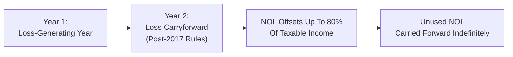

## 19.5 Net Operating and Capital Losses (Carryback/Carryforward)

Net Operating Losses (NOLs) and capital losses are common occurrences for businesses, especially during periods of economic downturn or transitions. Understanding the tax treatment of these losses is pivotal for optimizing cash flow, reducing taxes in profitable periods, and ensuring compliance with Internal Revenue Service (IRS) regulations. This section focuses on how C corporations recognize and utilize net operating and capital losses through carryback and carryforward rules. We’ll also examine how the rules have evolved over time—particularly the changes introduced by the Tax Cuts and Jobs Act (TCJA), the Coronavirus Aid, Relief, and Economic Security (CARES) Act, and subsequent guidance.

This discussion builds upon concepts introduced in earlier chapters on C corporation taxation. Familiarity with how taxable income is calculated (see Section 19.1 and 19.2), how book-versus-tax differences may affect reported income (see Section 18.1), and the analytical framework for corporate tax returns (see Section 19.3) will enhance your understanding of applying NOL and capital loss strategies.

---

### Overview of Net Operating Losses (NOLs)

A net operating loss arises when a C corporation’s tax-deductible expenses exceed its gross income for a particular tax year. While the basic definition might sound straightforward, the calculation and use of these losses are anything but simple. Certain items, such as the dividends received deduction (DRD), certain business deductions, and limitations on deductions (e.g., charitable contributions), can significantly affect whether or not a corporation realizes a net operating loss in any given year.

An NOL can be valuable because it can reduce taxable income in another tax year. By carrying the loss backward or forward in time, a corporation can either receive a refund for taxes previously paid or reduce future taxable income, thereby decreasing or eliminating future tax liabilities.

---

### NOL Carryback and Carryforward: Pre-2018 vs. Post-2017

The rules governing the timing and utilization of NOLs have changed considerably in recent years. Historically, the Internal Revenue Code (IRC) has allowed certain carryback periods, followed by carryforward periods of fixed duration. The Tax Cuts and Jobs Act (TCJA) introduced significant revisions to these rules effective for NOLs arising in tax years ending after December 31, 2017, though temporary modifications were also introduced and then phased out by the CARES Act.

#### Pre-2018 NOLs
• Carryback and Carryforward. In general, for NOLs arising in tax years beginning before January 1, 2018, a C corporation could carry back losses two tax years (2-year carryback) and carry them forward for up to 20 years.  
• Entire Offset. Under these older rules, the NOL carried over to another year could be used to fully offset taxable income, with no limitation on the percentage of income that could be offset.  
• Election to Waive Carryback. A corporation could elect under IRC §172(b)(3) to forgo the 2-year carryback period and carry the loss forward for 20 years instead. This could be advantageous if past tax rates were low or if the company believed future income (and tax rates) would be significantly higher.

#### Post-2017 NOLs (Under the TCJA)
• No General Carryback. For NOLs generated in tax years beginning after December 31, 2017, the TCJA generally eliminated the ability to carry an NOL back.  
• Indefinite Carryforward. These NOLs could be carried forward indefinitely, as opposed to the prior 20-year limit.  
• 80% Limitation. The TCJA imposed a rule that these post-2017 NOLs could only offset up to 80% of taxable income in any carryforward year. This effectively prevented corporations from fully eliminating their taxable income using NOLs—at least in most scenarios.

#### Temporary Changes Under the CARES Act
In response to the economic disruptions of the COVID-19 pandemic, the CARES Act of 2020 temporarily amended the limitations set by the TCJA:  
• 5-Year Carryback for Certain Years. Corporations were allowed to carry back NOLs arising in tax years 2018, 2019, and 2020 to each of the five preceding taxable years.  
• Suspension of 80% Limitation. The 80% limitation did not apply for corporate NOLs used in tax years beginning before January 1, 2021.  
• Return to TCJA Rules. Post-2020, the pre-CARES Act rules resumed, meaning no carryback for most corporations and an 80% limitation on usage.

---

### NOL Calculation for C Corporations

Calculating an NOL starts with taxable income as typically computed. However, several important adjustments must be made when determining whether a corporation has an NOL:

1. Remove any net capital losses. Since capital losses can only offset capital gains, they are excluded from ordinary taxable income for NOL purposes.  
2. Subtract nonbusiness deductions to the extent they exceed nonbusiness income.  
3. Include any allowable deductions such as the dividends received deduction, as these reduce taxable income effectively for corporations.

Once these adjustments are made, if the resulting figure is negative, an NOL is produced. This NOL can then be carried according to the rules in effect for the year the NOL was generated.

---

### Applying the 80% Limitation

One of the biggest changes introduced by the TCJA for post-2017 NOLs is the 80% limitation. While it was temporarily suspended by the CARES Act for tax years 2018, 2019, and 2020, this limitation now applies again (with limited exceptions). When applying an NOL from a post-2017 year to a subsequent profitable year, a corporation can only use the NOL to offset 80% of that year’s taxable income. For example, if a corporation has taxable income of $1 million in 2023 (before any NOL deduction) and carries forward a post-2017 NOL of $2 million, it can only offset $800,000 (80% of $1 million) with that carryforward NOL, leaving $200,000 as taxable income.

---

### Special Elections and Strategies

Even with the reduced flexibility in the post-2017 environment, corporations still have strategic choices:

• Waiving the Carryback. In many situations, a corporation may elect to waive any available carryback (e.g., under special rules or older NOL rules) and focus on carrying a loss forward if future marginal tax rates or anticipated profits are expected to be higher.  
• Section 965 Interplay. Under certain IRC Section 965 transition tax calculations (for foreign earnings), there might be special interactions regarding NOL usage.  
• Consolidated Groups. There are additional complexities in consolidated tax returns under IRC §1502 regulations. Intercompany transactions, group-level carryforwards, and limitations must be carefully analyzed.  
• CARES Act Considerations. If the corporation generated an NOL during 2018, 2019, or 2020, it might still be in the process of carrying that NOL back five years if that approach yields beneficial results (for instance, to reclaim taxes paid in better economic years).

---

### Capital Losses: Carryback and Carryforward

Capital losses for C corporations differ from NOLs in several ways, but they often arise in tandem with an NOL scenario. Under IRC §1211 and §1212, corporations can only use capital losses to offset capital gains, not ordinary income. If a corporation realizes a net capital loss, that loss can be carried:

• Back 3 years  
• Forward 5 years  

Any capital loss that cannot be used in the three preceding years or within the five subsequent years generally expires without further tax benefit. This is a more restrictive timeframe than older NOL rules (pre-2018), and it contrasts with the indefinite nature of post-2017 NOL carryforwards.

#### Example of Capital Loss Offsets

• Year 1: Corporation has $100,000 of capital losses and no capital gains. The $100,000 capital loss cannot be deducted against ordinary income.  
• Year 2: Corporation has $50,000 of capital gains and no additional capital losses. The corporation can carry forward $50,000 of the remaining capital loss from Year 1 to offset the $50,000 capital gain, resulting in a net capital gain of $0.  
• Remaining $50,000 from the initial $100,000 capital loss can still be carried forward (up to a total of five years after the loss’s generating year).

---

### Illustrative Mermaid Diagram

Below is a simple Mermaid diagram illustrating the lifecycle of an NOL for a post-2017 tax year. This diagram focuses on how the loss originates, flows from one year to another, and is subject to the 80% limitation.

Note: For NOLs generated in 2018, 2019, or 2020, the CARES Act might allow a 5-year carryback and no 80% limitation for offset. Once those years are exhausted or the time window has passed, the indefinite carryforward at 80% limitation generally applies to post-2020 usage.

---

### Practical Examples and Case Studies

#### Example 1: NOL Carryback Under CARES Act
• Facts: A C corporation has a $500,000 NOL in 2020 (a year covered by the CARES Act). It had taxable income of $300,000 in 2015 and $200,000 in 2016.  
• Analysis: The corporation can choose to carry the $500,000 NOL back to 2015 (the earliest of the five carryback years) and fully offset the $300,000, resulting in a reduced taxable income of $0 for 2015 and generating a refund of taxes paid that year. The remaining $200,000 of the NOL from 2020 can be carried to 2016 to offset that year’s $200,000 of taxable income. This step-by-step approach results in $0 taxable income for 2015 and 2016, with a total refund of taxes paid in those years.

#### Example 2: Electing to Forgo Carryback
• Facts: In 2023, a corporation generates a $1 million NOL, and it realizes that 2021 and 2022 were low-income years for which any carryback would not be particularly beneficial.  
• Analysis: The corporation can elect to waive any available carryback and carry forward the entire $1 million NOL indefinitely, subject to the 80% limitation each year. If the corporation expects high profitability in 2024 and beyond, it may want to preserve the NOL for those years to reduce higher future taxes.

#### Example 3: Capital Loss Carryback vs. Carryforward
• Facts: A corporation in 2023 has a $200,000 net capital loss. In each of the three preceding years (2020, 2021, 2022), the corporation had no capital gains.  
• Analysis: Because there are no previous years with capital gains to offset with a carryback, it will carry forward the full $200,000 in net capital losses for up to five years (i.e., 2024–2028). If in 2025 the corporation has $70,000 in capital gains, that portion of the capital loss can offset these gains, leaving $130,000 in remaining capital loss that continues to carry forward until used or expired.

---

### Common Pitfalls and Best Practices

• Failing to Consider Elections. Automatic carrybacks or carryforwards might not yield the best outcome. Evaluate the election to waive a carryback, or the possibility to carry back capital losses, to generate the most advantageous result.  
• Mixing Pre-2018 and Post-2017 NOLs. Corporations with older NOLs plus newly generated NOLs must track each separately, applying the correct limitation rules.  
• CARES Act Exceptions. Some corporations overlook the retroactive changes that allowed carrybacks for tax years 2018–2020, thereby missing out on potential refunds.  
• Consolidated Returns. Groups filing consolidated returns under IRC §1502 must pay attention to how intercompany gains and losses cause complexities in NOL usage and tracking.  
• State Variations. Many states either do not conform to federal provisions fully or apply their own modifications to carryover periods and limitations. State-level compliance is critical.  

---

### Using Diagrams and Tables for Tracking

It’s wise to keep a detailed schedule or table tracking each NOL’s year of origin, amount, and expiry date (if applicable). Below is a simple table that corporations might use:

| Origin Year | Type of Loss | Original Amount | Carryback Years Used | Remaining Amount | Carryforward Expiration | Post-2017 80% Limitation? |
|------------|--------------|-----------------|----------------------|------------------|-------------------------|---------------------------|
| 2016       | NOL (Pre-TCJA)  | $300,000       | 2-year carried back  | $0              | 20 years from 2016     | No                        |
| 2019       | NOL (CARES Act) | $200,000       | 5-year carryback     | $0              | Indefinite             | Suspended for 2019–2020   |
| 2021       | NOL (Post-TCJA) | $400,000       | None (waived carryback) | $400,000       | Indefinite             | Yes                       |
| 2023       | Capital Loss    | $150,000       | 3-year carryback     | $50,000         | 5 years from 2023      | N/A                       |

Such a straightforward layout helps to avoid errors and highlights any upcoming expiration deadlines.

---

### References and Further Exploration

• IRC §172 outlines net operating loss rules.  
• IRC §1211 and §1212 govern capital losses.  
• IRS Publication 542 provides guidance for corporations.  
• IRS Instructions for Form 1120 (U.S. Corporation Income Tax Return) detail how to apply NOL deductions and capital loss offsets.  
• Seek additional insights in Chapter 19.6 on consolidated returns and Chapter 29 on characterization of gains and losses.  

---

## SEO-Optimized Quiz: Mastering NOL and Capital Loss Rules



### Which of the following best describes the general rule for post-2017 net operating losses (NOLs) for C corporations?

- [ ] They may be carried back up to two years and forward 20 years.  
- [x] They may be carried forward indefinitely and generally cannot be carried back.  
- [ ] They may be carried back for three years and forward 15 years.  
- [ ] They may not be carried forward beyond five years.  

> **Explanation:** Under the TCJA, post-2017 NOLs for C corporations have no carryback (generally), can be carried forward indefinitely, and are subject to an 80% of taxable income limitation.

### Under the Tax Cuts and Jobs Act (TCJA), post-2017 NOL deductions are limited to offsetting what percentage of a C corporation’s taxable income?

- [ ] 100%  
- [ ] 90%  
- [x] 80%  
- [ ] 50%  

> **Explanation:** The TCJA introduced an 80% limitation on post-2017 NOL usage. This limit was temporarily suspended by the CARES Act but has otherwise remained the standard for offsetting taxable income.

### Which major tax law provided a temporary 5-year carryback period for NOLs generated in 2018, 2019, and 2020?

- [ ] The American Recovery and Reinvestment Act (ARRA)  
- [ ] The Tax Reform Act of 1986  
- [x] The CARES Act  
- [ ] The Small Business Jobs Act  

> **Explanation:** The CARES Act temporarily allowed NOLs generated in 2018, 2019, and 2020 to be carried back five years, deviating from the usual post-TCJA rules of no carryback.

### For capital losses, a C corporation can offset which of the following?

- [ ] Ordinary income and capital gains alike.  
- [ ] Partnerships and S corporations’ losses.  
- [x] Only capital gains.  
- [ ] Dividends received from other corporations.  

> **Explanation:** Under the Code, C corporations can only use capital losses to offset capital gains. They cannot reduce ordinary income with capital losses.

### How many years can a C corporation generally carry back a net capital loss?

- [x] 3 years  
- [ ] 2 years  
- [ ] 5 years  
- [ ] 20 years  

> **Explanation:** Capital losses can be carried back three years and forward five years for a C corporation, per IRC §1212.

### A C corporation generated an NOL of $500,000 in 2016. Under pre-TCJA rules, what were the general carryback and carryforward periods for such an NOL?

- [ ] No carryback, indefinite carryforward.  
- [x] A 2-year carryback and a 20-year carryforward.  
- [ ] A 5-year carryback and a 20-year carryforward.  
- [ ] A 3-year carryback and 5-year carryforward.  

> **Explanation:** Prior to the TCJA changes, an NOL for a C corporation could generally be carried back two years and carried forward up to 20 years.

### Which of the following is a common pitfall regarding NOL utilization?

- [ ] Failing to realize that NOLs must be calculated separately for each year.  
- [x] Using pre-2018 NOLs under post-2017 rules.  
- [ ] Carrying the loss forward instead of back in a high-tax year.  
- [ ] Combining capital losses with ordinary losses to offset taxable income.  

> **Explanation:** A frequent mistake is misapplying carryover rules for NOLs generated before and after the effective date of the TCJA.

### If a corporation wants to ensure that a new NOL will not be carried back but instead be carried forward, it should:

- [x] Make an affirmative election to waive the carryback period.  
- [ ] Do nothing; the carryback is automatically waived.  
- [ ] File for an extension.  
- [ ] Request an IRS private letter ruling.  

> **Explanation:** Under IRC §172(b)(3), a corporation needs to affirmatively waive (or forego) any available carryback period to carry an NOL forward if it so chooses.

### In which of the following scenarios is the 80% NOL limitation suspended for a C corporation?

- [x] NOLs arising in tax years 2018–2020 used during the CARES Act relief period.  
- [ ] Pre-2018 NOLs carried forward to 2019.  
- [ ] Post-2025 NOLs with indefinite carryforward.  
- [ ] Capital losses carried forward to offset ordinary income.  

> **Explanation:** Under the CARES Act, the 80% limitation was temporarily suspended for NOLs generated in tax years 2018, 2019, or 2020 and carried to another year before January 1, 2021.

### For C corporations, which of the following best describes how capital losses are utilized?

- [x] They must be applied to offset capital gains and can be carried back three years and forward five years.  
- [ ] They are treated the same as an NOL for carryback and carryforward.  
- [ ] They can offset any type of income and have an indefinite carryforward.  
- [ ] They can be used to offset ordinary income if the corporation has no capital gains.  

> **Explanation:** C corporations must net capital losses against capital gains only, and any unused amounts can be carried back three years or forward five years.



---

## For Additional Practice and Deeper Preparation

### [Taxation & Regulation (REG) CPA Mock Exams](https://www.udemy.com/course/reg-cpa-mock-exams/?referralCode=55419EBD198F61530B12)

Taxation & Regulation (REG) CPA Mocks: 6 Full (1,500 Qs), Harder Than Real! In-Depth & Clear. Crush With Confidence!

- Tackle full-length mock exams designed to mirror real REG questions.  
- Refine your exam-day strategies with detailed, step-by-step solutions for every scenario.  
- Explore in-depth rationales that reinforce higher-level concepts, giving you an edge on test day.  
- Boost confidence and minimize anxiety by mastering every corner of the REG blueprint.  
- Perfect for those seeking exceptionally hard mocks and real-world readiness.  

_Disclaimer: This course is not endorsed by or affiliated with the AICPA, NASBA, or any official CPA Examination authority. All content is for educational and preparatory purposes only._
