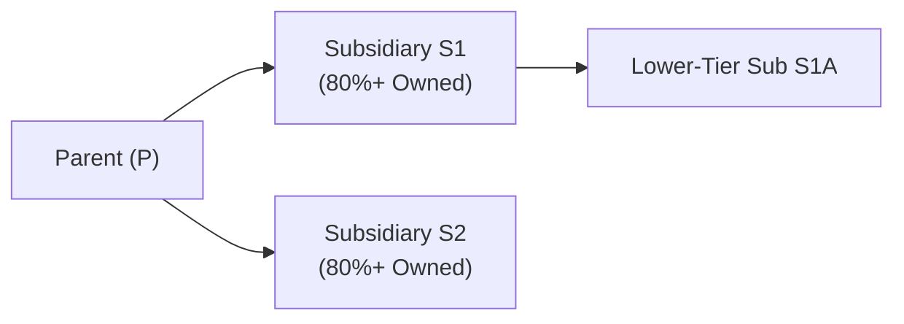

## 19.6 Consolidated Returns: Eligibility, Elections, and Intercompany Transactions

Consolidated corporate returns can streamline and centralize tax reporting for a group of affiliated corporations under common ownership. By filing a single consolidated return instead of multiple separate returns, corporations may benefit from offsetting losses and gains across affiliated entities, simplifying administrative burdens, and optimizing the group’s overall tax liability. However, the rules governing eligibility, elections, and the treatment of intercompany transactions are highly complex and come with many pitfalls if not adhered to properly. This section provides a detailed overview of the filing processes, group membership criteria, intercompany eliminations, and best practices to help you navigate the consolidated filing landscape.

### Introduction to Consolidated Returns

At their core, consolidated returns are intended to reflect the economic realities of a group of corporations that function as a single economic enterprise. The U.S. tax regulations allow certain parent corporations and their subsidiaries to file one consolidated return that aggregates income, deductions, credits, and other tax attributes on Form 1120 (U.S. Corporation Income Tax Return). The consolidated regime presents both opportunities for tax efficiency and significant compliance requirements.

Key advantages of filing consolidated returns include:
• Potential to offset losses of one group member against the income of another group member (subject to limitations).  
• Unified approach to income, expenses, and credits that can reduce duplicative filings.  
• Simplified reporting as multiple subsidiaries are captured under a single tax return.  

Potential drawbacks and challenges include:
• Complex logistics of gathering data from multiple entities on standardized schedules.  
• Intricate tax rules around intercompany transactions, including gains, losses, and administrative procedures.  
• Additional disclosures and compliance obligations with the Internal Revenue Service (IRS).  

### Eligibility Requirements for a Consolidated Group

The primary governing body of law for consolidated returns is found in IRC §§ 1501–1505 and the related Treasury Regulations. In general, the following prerequisites must be met:

• Common Parent Corporation  
  A consolidated group must have a common parent corporation that directly owns at least 80% of the total voting power and at least 80% of the total value of the outstanding stock of at least one corporate subsidiary.

• Inclusion of Additional Subsidiaries  
  Once a group is formed around a common parent, additional subsidiaries can join as long as each subsidiary is at least 80% directly owned (or indirectly owned through a deeper chain of ownership) by other group members.  

• Domestic Corporations Only  
  Only domestic (U.S.) corporations can join in the consolidated return. Foreign corporations, tax-exempt organizations (unless specifically allowed), insurance companies subject to special tax rules, and certain other entities are generally excluded from the consolidated group.  

• Affiliated Group Definition  
  The term “affiliated group” applies to corporations meeting the 80% voting power and 80% total value ownership tests described above. Partnerships, LLCs taxed as partnerships, and S corporations cannot be part of a consolidated group under the typical corporate consolidation rules.  

In a simplified illustration:

Each corporation in the diagram that meets the 80% ownership threshold is included in the consolidated group. If any ownership percentage dips below the required threshold, that corporation must “deconsolidate” and file separately.

### Making the Consolidated Election

The choice to file on a consolidated basis is typically made by the common parent on behalf of all eligible subsidiaries. This is done by filing Form 1122 (Authorization and Consent of Subsidiaries to Be Included in a Consolidated Income Tax Return) for each subsidiary at the time the group files its first consolidated return.

Important points about the election process:
• Once the group files its first consolidated return, the affiliated members are bound to continue filing on a consolidated basis in subsequent years unless the group is terminated or eligibility is lost.  
• If any new corporation joins the group (via acquisition or formation), that new member generally must file as part of the consolidated return if it meets the qualifying ownership threshold at year-end.  
• Failure to properly complete and attach Form 1122 or to meet other procedural requirements may jeopardize the consolidated status, resulting in separate returns for group corporations.  

### Membership Changes and Ongoing Maintenance

A consolidated group can evolve over time as members join or leave. For example, a parent may acquire an 80%-controlled subsidiary mid-year, or a subsidiary’s stock ownership could fall below 80% due to partial divestitures. These events, known as “changes in affiliated group membership,” raise several points of consideration:

• Mid-Year Acquisitions  
  If a subsidiary is acquired partway through the year, it may need to file a short-period separate return for the period before joining, and then another short-period return as a member of the consolidated group.  

• Deconsolidation  
  If a member’s stock ownership level drops below 80%, that member is no longer eligible for the group. Its income, deductions, and credits from the “date of deconsolidation” forward must be excluded from the consolidated return. A short-period return may need to be filed unless other exceptions or timing rules apply.  

• Consistency Requirements  
  Consistent accounting methods, tax year-ends, and intercompany transaction treatments must be followed among group members.  

### Calculating Consolidated Taxable Income

A primary goal of the consolidated return system is that each group’s total tax liability should replicate, in theory, the income or loss if the group were viewed as one entity. The steps to determine consolidated taxable income often look like this:

1. Calculate each subsidiary’s separate taxable income or loss as if it filed on a standalone basis.  
2. Combine (or “eliminate”) any intercompany items of income or expenses that are to be deferred or disallowed under the consolidated return rules.  
3. Make any standard adjustments required under the consolidated regulations (such as investment adjustments for subsidiary stock, basis adjustments, etc.).  
4. Sum all of the adjusted separate taxable incomes to arrive at consolidated taxable income.  
5. Apply any consolidated net operating loss carryforwards or carrybacks as allowed.  

The interplay of these steps can be illustrated through a simplified formula:


\text{Consolidated Taxable Income} 
= \sum (\text{Separate Taxable Income}) 
- \text{Eliminations and Deferrals} 
+ \text{Consolidation Adjustments}


### Intercompany Transactions: Gains, Losses, and Adjustments

Intercompany transactions among group members can distort income if left unadjusted—because the economic gain or loss is effectively contained within the group. To prevent double counting or artificially inflating or deflating income, consolidated return rules require special eliminations and deferrals:

• Intercompany Sales of Inventory  
  If one member sells inventory to another member, any intercompany profit is generally deferred until the inventory is sold to an outside party or consumed in the group’s production processes.  

• Property Transfers  
  Gains or losses recognized on transfers of property (other than inventory) between group members usually are deferred until the property leaves the group or is otherwise disposed of in a taxable transaction with an outsider.  

• Intercompany Dividends  
  Dividends between members of a consolidated group are generally eliminated, preventing double taxation or duplication of income.  

• Intercompany Interest and Rents  
  Interest, rent, or royalty payments between affiliates may also be eliminated, deferred, or required to be deferred, based on the consolidated return regulations.  

The guiding principle is to ensure the group’s consolidated income mirrors what it would be if it had engaged in these transactions with third parties.

#### Example: Intercompany Sale of Fixed Assets

Suppose P (the parent) sells a machine with an original cost of $50,000 to its subsidiary S for $60,000. The fair market value (FMV) is indeed $60,000. On a separate company basis, P would recognize a $10,000 gain. However, under the consolidated return rules, that $10,000 gain is generally deferred until the subsidiary S sells the machine outside the group or otherwise disposes of it in a taxable transaction. As a result, the parent does not report the $10,000 gain currently on the consolidated return.

### Consolidated Net Operating Loss (NOL) Considerations

A key advantage of consolidated filing is the ability to offset losses from one member of the group against the income of another member in the same tax year. Net operating losses incurred by one or more group members are combined into a single consolidated NOL, which can be carried forward (or carried back, if applicable) by the group as a whole. This arrangement can provide substantial tax benefits by smoothing out year-to-year fluctuations across group members.

However, if a member that generated significant NOLs leaves the group, the consolidated group may face limitations on using those losses in the future, and the departing entity’s own NOL carryforwards may be restricted under IRC § 382 and the consolidated return regulations.

### Filing Procedures and Forms

When filing a consolidated return:

• Form 1120 is completed by the parent corporation on behalf of the entire group.  
• Each subsidiary generally includes supporting statements, often referred to as a “separate company” pro forma, showing how its separate return items are derived.  
• Intercompany eliminations and adjustments are reflected on supporting schedules attached to the consolidated return.  
• The consolidated return is filed by the due date (including extensions) for the parent’s tax year.  

Accuracy and completeness are paramount. Incomplete or poorly organized supporting schedules can subject the group to increased audit risk and potential penalties.

### Compliance, Record-Keeping, and Documentation

Maintaining accurate financial and tax records for each group member is essential for:

• Substantiating the group’s ownership structure and membership status.  
• Documenting intercompany transactions, including the amounts, timing, and basis adjustments.  
• Ensuring correct application of the deferral or elimination rules.  
• Calculating any consolidated net operating losses or credits.  

The IRS pays special attention to intercompany transactions, especially if the transactions shift or distort income in ways that are not aligned with the arm’s length principle or consolidated return regulations. Therefore, robust documentation and consistent accounting policies across the group are crucial to minimize exposure to tax adjustments and penalties.

### Practical Examples and Case Studies

Case Study 1: Formation of a New Subsidiary  
PCorp forms a new subsidiary, SCorp, on June 1. It owns 100% of SCorp. Under the consolidated return rules, SCorp must be included in PCorp’s existing consolidated return for the remainder of the tax year if SCorp meets the 80% ownership test as of year-end. SCorp effectively begins filing as part of the consolidated group as soon as it is eligible. If the group wants SCorp in the consolidated return for the short period from June 1 to December 31, a Form 1122 for SCorp must be attached to the next filed consolidated return.

Case Study 2: Mid-Year Acquisition of Another Corporation  
PCorp acquires 100% of XCorp on July 1. At the point of acquisition, XCorp was not previously in the group. XCorp files a short-period return for January 1 to June 30 on a standalone basis. From July 1 through December 31, XCorp joins PCorp’s consolidated return. Intercompany income and expense for transactions between PCorp and other members from July 1 onward are eliminated in the group’s consolidated return. If the group fails to file a timely Form 1122 for XCorp, XCorp could inadvertently remain outside the consolidated return, causing compliance challenges.

Case Study 3: Intercompany Sales of Inventory  
SCorp sells inventory to TCorp, another group member, for a profit of $5,000. TCorp sells that inventory to external customers in the same tax year. The $5,000 initially recognized by SCorp is eliminated within the consolidated return until TCorp sells it outside. Since TCorp does indeed sell it outside later in the same year, the $5,000 gain reappears and is recognized as consolidated income, reflecting the economic event of a sale to an outside party.

### Common Pitfalls and Best Practices

• Inadvertent Exclusion of Eligible Subsidiaries  
  Overlooking a newly formed or acquired entity can invalidate the group’s consolidated election for that year or require additional administrative steps (like separate returns for the omitted subsidiary).  

• Improperly Calculated Intercompany Adjustments  
  Failure to track intercompany transactions accurately can lead to overstated or understated gains and losses, triggering corrections upon IRS examination.  

• Documentation Shortfalls  
  Poor record-keeping can hamper the ability to properly demonstrate compliance, especially regarding deferred gains on intercompany transfers of property.  

• Transitioning Accounting Methods or Tax Years  
  Maintaining consistent accounting or changing tax years midstream demands careful compliance with consolidated regulations to ensure group-wide synchronization.  

Best practices include:
• Establishing robust internal controls for subsidiary integration and data consolidation.  
• Utilizing specialized tax software or modules specifically designed for consolidated return preparation.  
• Scheduling regular compliance reviews, particularly after acquisitions or significant restructuring events.  
• Engaging in proactive planning to optimize net operating loss utilization, especially if acquisitions or dispositions are in sight.  

### References for Further Exploration

• IRS Publication 542 (Corporations): Basic information on corporate returns, including references to consolidated filing.  
• Treasury Regulations under IRC §§ 1501–1505: Detailed consolidated return regulations.  
• AICPA Tax Section and State Society Publications: Offer guidance on technical aspects and best practices for consolidated returns.  
• Corporate Taxation Journal Articles: Often include case studies, advanced strategies, and real-world pitfalls.

---

## Consolidated Tax Returns Quiz: Mastering Eligibility, Elections, and Intercompany Transactions



### Which of the following requirements must be met to form a consolidated group for U.S. federal tax purposes?

- [x] The parent must own at least 80% of both the total voting power and total value of at least one subsidiary.
- [ ] The parent must be a foreign corporation.
- [ ] The parent must own exactly 51% of each subsidiary's stock.
- [ ] The parent must be a pass-through entity.

> **Explanation:** Under IRC §§ 1501–1505, only if a domestically incorporated parent owns at least 80% of both voting power and total value of stock for each subsidiary can those corporations join a consolidated group.

### What is the primary document used to give consent for each subsidiary to join in the consolidated return?

- [ ] Form 1120.
- [x] Form 1122.
- [ ] Form 1065.
- [ ] Form 2553.

> **Explanation:** Form 1122 (Authorization and Consent of Subsidiary Corporation To Be Included in a Consolidated Income Tax Return) is filed for each subsidiary when the consolidated group is formed.

### If a subsidiary leaves a consolidated group mid-year, what is the general tax implication?

- [x] The subsidiary may need to file a short-year separate return from the date of deconsolidation to year-end.
- [ ] The subsidiary automatically carries over all net operating losses generated while in the group.
- [ ] The subsidiary is prohibited from ever rejoining the consolidated group in the future.
- [ ] There are no special filing requirements.

> **Explanation:** When a subsidiary is removed from a group, it generally has a short-period return. Certain NOL limitations may apply, and previously deferred intercompany gains may be triggered, depending on the circumstances.

### A parent corporation sells a warehouse to its 100%-owned subsidiary at a gain. How is this gain typically treated under consolidated return rules?

- [x] The gain is deferred until the subsidiary sells the warehouse outside the group.
- [ ] The gain is allowed in the current period.
- [ ] The gain is permanently excluded from the group's income.
- [ ] The gain must be recognized, and one-half of the gain is also recognized by the subsidiary.

> **Explanation:** Intercompany gains on property transactions between affiliates are deferred until the property is sold to an outside party or is otherwise disposed of in a taxable transaction outside the group.

### Which of the following items is generally eliminated under the consolidated return regulations?

- [x] Dividends received from one group member by another group member.
- [ ] Depreciation deductions arising in each subsidiary.
- [ ] Salaries paid to the parent’s executives.
- [ ] Foreign tax credits claimed by a subsidiary.

> **Explanation:** Intercompany dividends are typically eliminated within a consolidated group to prevent double counting. Deductions, salaries, and credits remain subject to specific rules but are not eliminated unless they represent intercompany transactions that need special treatment.

### Which form is typically used by the parent to file a consolidated return?

- [x] Form 1120, U.S. Corporation Income Tax Return.
- [ ] Form 1065, U.S. Return of Partnership Income.
- [ ] Form 1099-MISC.
- [ ] Form 1040, U.S. Individual Income Tax Return.

> **Explanation:** Consolidated corporate returns are filed on Form 1120 by the common parent, reflecting the aggregate income, deductions, and credits of all members.

### What happens to losses from different subsidiaries in a consolidated group?

- [x] They may offset each other within the same consolidated return.
- [ ] They must be carried back separately to each subsidiary’s previous returns.
- [ ] They can be shared with non-consolidated entities.
- [ ] They are forfeited at year-end.

> **Explanation:** One of the key benefits of consolidated returns is that losses from one subsidiary may offset income from another within the same consolidated group, subject to the rules and limitations for consolidated NOLs.

### When a newly formed 100%-owned subsidiary is introduced mid-year, what is the required tax filing situation if the group wants to include it in the consolidated return?

- [x] File Form 1122 for the new subsidiary and include its results in the consolidated return from its inclusion date.
- [ ] File Form 2553 to elect S corporation status.
- [ ] File a separate full-year standalone return for the new subsidiary.
- [ ] Include it automatically without any filing in the parent’s return.

> **Explanation:** A new subsidiary must submit Form 1122 to be formally included in the consolidated return, reflecting its activity from the inclusion date onward within that same tax year.

### Under the consolidated return rules, which of the following typically triggers the recognition of previously deferred intercompany gains?

- [x] Selling the item to a non-group member.
- [ ] Filing a statement with the IRS to accelerate gain recognition.
- [ ] The passage of 12 months.
- [ ] A partial elimination of the parent’s ownership percentage.

> **Explanation:** Deferred intercompany gains on property transactions are typically recognized when the property is sold outside the group or transferred in a taxable transaction to a non-group member.

### Deferred gains on intercompany transactions are recognized on the consolidated return when the asset:

- [x] Leaves the consolidated group.
- [ ] Is still being used by a group member.
- [ ] Declines in value.
- [ ] Experiences a partial change in ownership.

> **Explanation:** Deferred intercompany gains remain postponed until the asset leaves the group in a taxable transaction, ensuring that only external economic gains are recognized for tax purposes.



---

## For Additional Practice and Deeper Preparation

### [Taxation & Regulation (REG) CPA Mock Exams](https://www.udemy.com/course/reg-cpa-mock-exams/?referralCode=55419EBD198F61530B12)

Taxation & Regulation (REG) CPA Mocks: 6 Full (1,500 Qs), Harder Than Real! In-Depth & Clear. Crush With Confidence!

• Tackle full-length mock exams designed to mirror real REG questions.  
• Refine your exam-day strategies with detailed, step-by-step solutions for every scenario.  
• Explore in-depth rationales that reinforce higher-level concepts, giving you an edge on test day.  
• Boost confidence and minimize anxiety by mastering every corner of the REG blueprint.  
• Perfect for those seeking exceptionally hard mocks and real-world readiness.

_Disclaimer: This course is not endorsed by or affiliated with the AICPA, NASBA, or any official CPA Examination authority. All content is for educational and preparatory purposes only._
