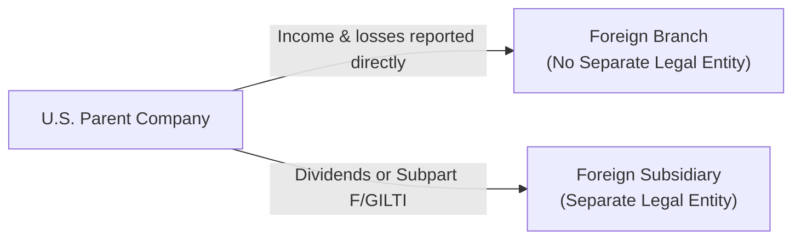
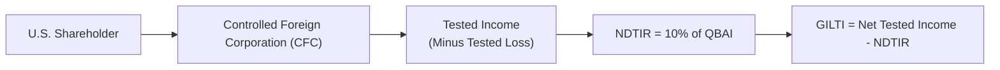
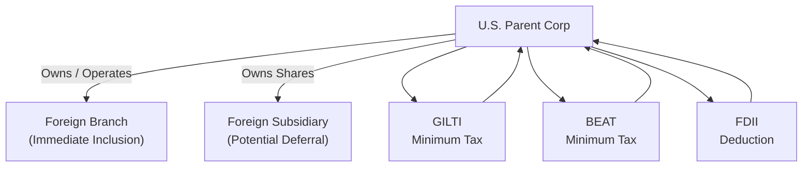

## 19.7 International Tax Concepts (Foreign Branch vs. Subsidiary, GILTI, FDII, BEAT)

In our modern global economy, U.S. corporations frequently expand beyond national borders, whether by establishing a physical presence abroad or engaging in international transactions. In these situations, both domestic and foreign tax considerations become increasingly complex. This section explores key international tax concepts faced by U.S. C corporations:  
• Choosing between operating as a foreign branch or creating a foreign subsidiary.  
• Understanding minimum tax provisions aimed at curbing profit shifting, such as GILTI (Global Intangible Low-Taxed Income), FDII (Foreign-Derived Intangible Income), and BEAT (Base Erosion and Anti-Abuse Tax).  
• Identifying strategies to optimize cross-border structures and minimize global tax liabilities while remaining compliant with U.S. and foreign rules.  

---------------------------------------------------------------------------------------------------
### Foreign Branch vs. Foreign Subsidiary
---------------------------------------------------------------------------------------------------

A common question for U.S. companies expanding abroad is whether to operate through a foreign branch or establish a foreign subsidiary. Each has distinctive legal and tax implications:

#### Foreign Branch Overview
1. Definition and Structure  
   • A foreign branch is an extension of the U.S. entity, not a separate legal entity in the host jurisdiction.  
   • Profits and losses flow directly to the U.S. corporation’s tax return.  

2. Tax Treatment  
   • Income from a foreign branch is included in the U.S. corporation’s taxable income in the year earned.  
   • The U.S. corporation typically can claim a Foreign Tax Credit (FTC) for taxes paid in the foreign country, subject to limitations.  
   • There is no deferral of foreign income; the U.S. taxes branch profits immediately.  

3. Pros and Cons  
   • Simpler structure and easier exit strategy if operations cease.  
   • Losses can offset U.S. taxable income immediately, which can be beneficial in early years.  
   • Branch operations might expose the parent company to greater legal liability, as the branch is not a separate entity.  
   • Problems can arise with certain foreign tax rules (e.g., potential withholding taxes if foreign jurisdictions do not recognize a branch structure favorably).  

#### Foreign Subsidiary Overview
1. Definition and Structure  
   • A foreign subsidiary is a separately incorporated entity in the host country.  
   • The U.S. parent usually holds stock in the foreign entity, which operates independently and bears its own liabilities.  

2. Tax Treatment  
   • Profits earned by a foreign subsidiary are typically not taxed in the U.S. until repatriated to the U.S. parent (e.g., dividends), unless Subpart F or GILTI rules apply.  
   • The parent can claim a dividends received deduction under certain conditions or a foreign tax credit when dividends are distributed.  
   • With the implementation of the Tax Cuts and Jobs Act (TCJA), many U.S. corporations receive a 100% dividends-received deduction (DRD) on qualified foreign-sourced dividends from 10%-owned foreign corporations, although certain rules and exceptions apply.  

3. Pros and Cons  
   • Limited liability for the U.S. parent.  
   • Potential for tax deferral on foreign profits, subject to anti-deferral provisions.  
   • More complex filing requirements, including local statutory audits.  
   • Potential exposure to U.S. anti-base-erosion rules (e.g., GILTI, Subpart F).  

Below is a simple flowchart illustrating the differences between a foreign branch and a foreign subsidiary:

---------------------------------------------------------------------------------------------------
### Overview of the U.S. International Tax System
---------------------------------------------------------------------------------------------------

Historically, the U.S. exercised a worldwide tax system, taxing all global income of U.S. persons and corporations. The Tax Cuts and Jobs Act (TCJA) of 2017 shifted the system to a more “territorial” model. However, several provisions remain in place to limit abuse of the new system while encouraging onshore activities:

• Subpart F: Introduces current taxation of certain income (e.g., passive or intangible income) of a Controlled Foreign Corporation (CFC).  
• GILTI: Minimizes incentives to locate intangible income in low-tax jurisdictions.  
• FDII: Provides deductions for certain export-related intangible income.  
• BEAT: Imposes minimum tax on large corporations that make significant “base-erosion” payments to foreign affiliates.  

---------------------------------------------------------------------------------------------------
### Global Intangible Low-Taxed Income (GILTI)
---------------------------------------------------------------------------------------------------

GILTI was introduced to discourage U.S. multinational companies from relocating intangible property (and associated high-value income) to low-tax countries. GILTI ensures that abroad-earned intangible income is subject to a minimum level of U.S. tax.

#### Key Terms
• Tested Income: Generally, a CFC’s gross income minus certain expenses (e.g., effectively connected income to a U.S. trade or business, Subpart F income, and income subject to high foreign taxes may be excluded under certain “high-tax exemption” rules).  
• Net Deemed Tangible Income Return (NDTIR): Equal to 10% of a CFC’s Qualified Business Asset Investment (QBAI), which is typically a measure of a CFC’s tangible asset base.  
• GILTI Inclusion: GILTI = Tested Income – 10% QBAI (adjusted for interest expense).  

#### GILTI Calculation Flowchart
The following diagram provides a high-level overview of the GILTI calculation process:

#### Tax Impact on U.S. Corporations
• GILTI is included in the gross income of the U.S. shareholder and taxed in the current year.  
• A deduction (subject to limitations) under IRC §250 is available to reduce the effective tax rate on GILTI.  
• The U.S. taxpayer can generally claim a partial foreign tax credit for the corporate taxes paid by the CFC, though the foreign tax credit for GILTI is limited to 80% of foreign taxes paid.  

#### Strategies to Mitigate GILTI
• Electing the High-Tax Exclusion if the CFC’s effective tax rate meets the threshold.  
• Increasing tangible assets to raise QBAI, thus potentially increasing the NDTIR and reducing the GILTI inclusion.  
• Strategic use of intercompany transactions and careful choice of entity classification to manage tested income.  

---------------------------------------------------------------------------------------------------
### Foreign-Derived Intangible Income (FDII)
---------------------------------------------------------------------------------------------------

FDII is designed to reward U.S. corporations for serving foreign markets with U.S.-based economic activity. It effectively lowers the tax rate on certain export-based intangible income earned directly by U.S. corporations.

#### Determining FDII
• **Deduction Eligible Income (DEI):** Gross income minus applicable expenses, excluding GILTI, Subpart F income, and certain other items.  
• **Deemed Intangible Income (DII):** DEI minus 10% of the U.S. corporation’s Qualified Business Asset Investment (QBAI).  
• **Foreign-Derived Ratio:** Fraction of the DEI derived from foreign sales/services over total DEI.  

FDII Deduction = Applicable Percentage × (DII × Foreign-Derived Ratio)

Under TCJA, a deduction under §250 was provided to lower the effective tax rate on FDII. The aim is to encourage U.S. companies to keep intangible property within the United States.

#### Example: FDII  
ABC Corp, a U.S. company, has:  
• Gross income of $10 million.  
• Foreign revenue of $4 million, with $3 million directly eligible for FDII.  
• QBAI that yields $200,000 as the tangible asset return (i.e., 10% of QBAI = $200,000).  
• DEI: $8 million after allocated deductions for Subpart F/GILTI.  
• DII: $8 million – $200,000 = $7.8 million.  
• Foreign Derived Ratio = $3 million / $8 million = 37.5%.  

FDII = $7.8 million × 37.5% = $2.925 million.  

A portion of the FDII is subject to a reduced effective tax rate via the FDII deduction. Thus, ABC Corp receives favorable treatment on this portion of its income derived from foreign markets.

---------------------------------------------------------------------------------------------------
### Base Erosion and Anti-Abuse Tax (BEAT)
---------------------------------------------------------------------------------------------------

BEAT targets large U.S. corporations making significant deductible payments to foreign related parties, preventing “earnings stripping” and erosion of the U.S. tax base.

#### Who Is Subject to BEAT?
• Corporations with average annual gross receipts over $500 million (over a 3-year period).  
• A base erosion percentage (total base erosion tax benefits / total deductions) of 3% or higher (or 2% or higher for banks and certain financial institutions).  

#### Mechanism of BEAT
BEAT imposes a minimum tax if the corporation’s modified taxable income, recalculating certain deductions for payments to foreign affiliates, exceeds a threshold. If a corporation’s BEAT liability exceeds its regular tax liability, the incremental difference becomes payable as the BEAT amount.

#### Examples of Base Erosion Payments  
• Management fees or royalties paid to a foreign parent or subsidiary.  
• Transfers of intangible property to low-tax jurisdictions.  
• Certain interest expenses paid to foreign related parties.  

#### Mitigating BEAT Exposure
• Restricting or restructuring related-party payments to reduce base erosion payments.  
• Shifting certain functions or intellectual property into the U.S. or higher-tax jurisdictions (counterintuitive yet sometimes beneficial if it reduces the incremental BEAT liability).  
• Monitoring annual gross receipts and base erosion percentage to remain under thresholds, though this is more challenging for large multinational enterprises.

---------------------------------------------------------------------------------------------------
### Cross-Border Strategies and Considerations
---------------------------------------------------------------------------------------------------

Selecting an optimal approach to foreign operations and managing international tax exposures requires careful planning and continues to evolve with regulatory changes. Key considerations include:

1. **Choice of Business Entity Abroad**  
   • Evaluate the nature of business operations, local legal requirements, and potential tax treaties.  
   • Align your choice—branch or subsidiary—with profitability forecasts and liability concerns.  

2. **Transfer Pricing Compliance**  
   • Properly document arm’s-length prices for intercompany transactions.  
   • Inadequate transfer pricing can trigger double taxation or adjustments by the IRS, plus penalties.  

3. **Utilizing Tax Treaties**  
   • Many bilateral tax treaties provide relief from double taxation through reduced withholding rates or permanent establishment thresholds.  
   • Review whether your foreign operations can leverage a U.S. tax treaty to reduce overall tax exposure.  

4. **Effective Rate Management**  
   • Look for opportunities to apply high-tax exclusion for GILTI.  
   • Harness FDII deductions for income generated in foreign markets by U.S.-based assets.  
   • Minimize or restructure cross-border payments that erode your U.S. tax base (and trigger BEAT).  

5. **Repatriation and Dividend Strategies**  
   • Plan to optimize repatriation of profits; weigh the benefits of indefinite deferral vs. the advantage of reinvestment in local markets.  
   • Examine dividend distribution times and amounts to take advantage of DRD provisions.  

---------------------------------------------------------------------------------------------------
### Common Pitfalls
---------------------------------------------------------------------------------------------------

• **Failing to Recognize a Controlled Foreign Corporation (CFC):** Some companies incorrectly assess ownership thresholds or inadvertently create a CFC, triggering GILTI or Subpart F exposure.  
• **Misunderstanding Permanent Establishment (PE) Rules:** Unintentionally creating a taxable presence abroad can lead to unexpected liabilities.  
• **Overlooking Transfer Pricing Requirements:** Underdocumented intercompany transactions invite costly disputes and penalties.  
• **Neglecting BEAT in Corporate Planning:** Large corporations often focus on GILTI or Subpart F but ignore that significant related-party payments may trigger BEAT.  
• **Improper Structuring for Tax Credits:** Disorganized foreign operations may prevent efficient use of the Foreign Tax Credit, leading to double taxation.  

---------------------------------------------------------------------------------------------------
### Diagram: Integrating International Tax Tools
---------------------------------------------------------------------------------------------------

To visualize how GILTI, FDII, and BEAT interrelate for a U.S. corporation with foreign operations, consider the following conceptual diagram:

In this depiction, a U.S. parent may face immediate taxation on branch income, while subsidiary income is generally deferred unless it falls under GILTI or Subpart F. Meanwhile, FDII can lower the U.S. parent’s tax on certain foreign-derived income, and the BEAT can override regular computations if base erosion payments are substantial.

---------------------------------------------------------------------------------------------------
### Conclusion and Future Developments
---------------------------------------------------------------------------------------------------

U.S. international tax provisions continue to evolve, particularly as governments worldwide respond to concerns about profit shifting and the digital economy. Being proactive about entity choice, intangible asset strategy, and alignment with regulations such as GILTI, FDII, and BEAT remains critical. Regularly revisiting cross-border structures is essential to accommodate potential future changes from Congress, the Treasury Department, and foreign legislatures.

Stay current with legislative updates and refine your structures to maintain compliance and optimize tax outcomes. As you continue your CPA Exam preparation, focus on understanding the interplay between various international tax rules and their real-world application, ensuring you are equipped to guide businesses effectively across borders.

---------------------------------------------------------------------------------------------------
## Test Your Knowledge: International Tax Provisions (GILTI, FDII, BEAT) Quiz



### A U.S. parent company operating abroad as a foreign branch typically:
- [x] Reports foreign branch income on its current U.S. tax return.
- [ ] Defers foreign branch income until dividends are paid.
- [ ] Protects the parent from foreign legal liability.
- [ ] Qualifies automatically for FDII.

> **Explanation:** Foreign branch income is reported and taxed currently in the U.S. The branch is merely an extension of the U.S. corporation, lacking a separate legal identity.

### Which of the following statements about a foreign subsidiary is correct?
- [x] It can offer limited liability protection to the U.S. parent company.
- [ ] Its income must be immediately recognized by the U.S. parent company.
- [ ] No foreign tax credits are allowed when the subsidiary repatriates dividends.
- [ ] It is never subject to anti-deferral rules.

> **Explanation:** A foreign subsidiary is a separate legal entity, generally conferring limited liability. Its earnings may be deferred until repatriation unless anti-deferral rules (e.g., Subpart F, GILTI) apply.

### Under GILTI, a U.S. shareholder’s net deemed tangible income return (NDTIR) is generally:
- [x] 10% of the qualified business asset investment (QBAI).
- [ ] 15% of the foreign-sourced tested income.
- [ ] Equal to entirely intangible income allocated to the taxpayer.
- [ ] The amount subject to BEAT if payments are made to foreign affiliates.

> **Explanation:** The net deemed tangible income return (NDTIR) is 10% of the CFC’s qualified business asset investment (QBAI), serving as a baseline return on tangible assets under GILTI rules.

### Which U.S. tax provision is intended to prevent large U.S. corporations from eroding their tax base by making excessive deductible payments to foreign affiliates?
- [x] BEAT
- [ ] FDII
- [ ] Subpart F
- [ ] PFIC

> **Explanation:** The Base Erosion and Anti-Abuse Tax (BEAT) applies to large corporations making significant deductible payments to foreign related parties, preventing the U.S. tax base from being eroded.

### When calculating FDII, Deemed Intangible Income (DII) is determined by:
- [x] Deduction Eligible Income (DEI) minus 10% of QBAI.
- [ ] (Foreign-Derived Sales + Tariff Expenses) – 10% QBAI.
- [x] DEI minus the GILTI inclusion amount.
- [ ] Foreign-Derived Sales – 80% foreign tax credit utilization.

> **Explanation:** DII is calculated by subtracting 10% of a U.S. corporation’s QBAI from its Deduction Eligible Income (DEI). In some calculations, the GILTI components are also removed from DEI to avoid double counting.

### A significant disadvantage of operating as a foreign branch is:
- [x] Potentially exposing the U.S. parent to local legal liabilities.
- [ ] Inability to claim foreign tax credits.
- [ ] Complete exemption of branch profits from U.S. tax.
- [ ] Mandatory intangible asset transfers to the branch.

> **Explanation:** A foreign branch does not provide limited liability protection. The parent is typically fully liable for the branch’s debts since they are the same legal entity.

### A key strategy to mitigate GILTI includes:
- [x] Increasing tangible assets to raise QBAI.
- [ ] Electing PFIC status for a foreign corporation.
- [x] Employing a “check-the-box” election to classify the entity as partially disregarded.
- [ ] Ignoring worldwide income in U.S. filings.

> **Explanation:** By increasing QBAI (the value of tangible assets), a company can reduce the portion of income deemed intangible and thus reduce its GILTI inclusion. Additionally, entity classification and the high-tax exclusion can play important roles.

### BEAT liability arises when:
- [x] A corporation’s modified taxable income significantly exceeds its regular taxable income.
- [ ] A corporation’s foreign earned income is reduced by foreign tax credits.
- [ ] A company elects to treat a foreign entity as a pass-through for tax purposes.
- [ ] The foreign subsidiary fails the active trade or business test.

> **Explanation:** Under BEAT, targeted “base erosion payments” to foreign affiliates result in an additional tax if the modified taxable income pushes the BEAT liability above the regular corporate tax.

### The FDII provision best encourages U.S. multinationals to:
- [x] Retain and develop intangible property in the United States for export.
- [ ] Migrate intangible assets to a low-tax foreign jurisdiction.
- [ ] Shift all operating expenses to related foreign ventures.
- [ ] Pay zero dividends to U.S. shareholders.

> **Explanation:** FDII grants a preferential effective tax rate on income derived from exports of goods, services, or intangibles produced in the U.S., incentivizing companies to keep value-creating intangible property in the U.S.

### A true statement regarding the U.S. international tax environment is:
- [x] It has partially shifted toward a territorial system but retains various anti-base erosion rules.
- [ ] It eliminates any need to consider permanent establishment under tax treaties.
- [ ] It only taxes 50% of foreign-sourced income, with no exceptions.
- [ ] It exempts large corporations and subsidiaries from compliance requirements.

> **Explanation:** Although the system is more territorial since TCJA, anti-base erosion rules (e.g., GILTI, FDII, BEAT) remain in place to prevent profit shifting and protect the U.S. tax base.



---------------------------------------------------------------------------------------------------
## For Additional Practice and Deeper Preparation

### [Taxation & Regulation (REG) CPA Mock Exams](https://www.udemy.com/course/reg-cpa-mock-exams/?referralCode=55419EBD198F61530B12)

Taxation & Regulation (REG) CPA Mocks: 6 Full (1,500 Qs), Harder Than Real! In-Depth & Clear. Crush With Confidence!

- Tackle full-length mock exams designed to mirror real REG questions.  
- Refine your exam-day strategies with detailed, step-by-step solutions for every scenario.  
- Explore in-depth rationales that reinforce higher-level concepts, giving you an edge on test day.  
- Boost confidence and minimize anxiety by mastering every corner of the REG blueprint.  
- Perfect for those seeking exceptionally hard mocks and real-world readiness.  

_Disclaimer: This course is not endorsed by or affiliated with the AICPA, NASBA, or any official CPA Examination authority. All content is for educational and preparatory purposes only._
