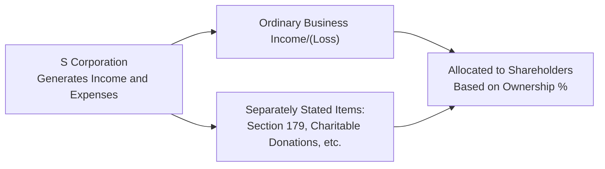
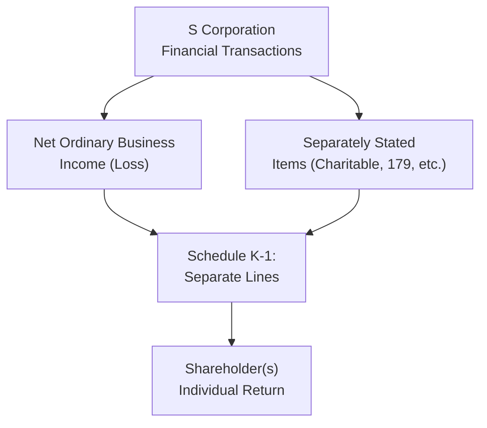

## 20.1 Ordinary Business Income (Loss) and Separately Stated Items

S corporations occupy a unique space in federal taxation. While they are generally not taxed at the entity level (provided they comply with the eligibility requirements), the Internal Revenue Code (IRC) mandates that certain income, deductions, and credits flow through to shareholders, who then report and pay tax on them individually. Within this pass-through framework, two categories of items emerge:

• Ordinary business income (or loss), encapsulating most operating results.

• Separately stated items, which must be declared and passed through individually due to their unique tax treatment or limiting provisions.

Understanding the distinction between these categories is an essential part of preparing and reviewing S corporation tax returns (Form 1120-S) and advising shareholders on how these amounts affect taxable income.

This section explores ordinary business income (loss) as well as separately stated items, such as Section 179 expense deductions, charitable contributions, investment-related items, and distributions. By the end, you will grasp how to correctly categorize and report each type of item, see how they impact taxes at the shareholder level, and identify common pitfalls and best practices.

---

### Overview of S Corporation Income Pass-Through

An S corporation is structured so that its financial outcomes “pass through” to shareholders. While the S corporation itself files an informational tax return (Form 1120-S) and may be subject to certain taxes (e.g., built-in gains tax, passive investment income tax), most of its net results are distributed among shareholders via Schedule K-1. Each shareholder then incorporates these results into their personal tax return (Form 1040).

Below is a simplified illustration of how an S corporation’s income and deductions flow to shareholders:

Ordinary business income (loss) is typically reported in one line on the shareholder’s Schedule K-1 (Line 1), whereas various credits, deductions, and special items appear on separate lines that correspond to distinct sections on the shareholder’s personal return.

---

### Ordinary Business Income (Loss)

Ordinary business income (or loss) for an S corporation generally includes the net profit (or loss) from its trade or business activities. This figure is calculated under the normal principles of accounting for a trade or business, taking into account “above the line” expenses directly tied to operations.

Revenue and expenses considered part of ordinary operations include:

• Gross receipts or sales from the principal trade or business.  
• Cost of goods sold (for manufacturing, merchandising, or production activities).  
• Routine business expenses (wages, payroll taxes, rent, advertising, and office expenses).  
• Depreciation (including bonus depreciation) on business assets (except for amounts taken as Section 179, which must be separately stated).  
• Certain intangible amortization (excluding those that must be separately stated, like organization expenditures in specific contexts).  

When the calculation of revenues minus expenses results in a positive figure, the S corporation has ordinary business income. If the expenses exceed revenues, the entity incurs an ordinary business loss.

Shareholders report their allocated share of the ordinary business income (loss) on their individual or joint tax returns. This allocation generally follows each shareholder’s ownership percentage as stated in the corporate bylaws and stock records, though special allocations may be impacted by built-in gains or other limitations (discussed in more advanced chapters).

---

### Separately Stated Items

Certain items receive specialized tax treatment or are subject to limiting rules in the hands of the shareholder, so the IRC requires that they be “separately stated” on Schedule K of Form 1120-S. Common examples include:

• Section 179 deductions.  
• Charitable donations.  
• Capital gains and losses.  
• Dividends, interest income.  
• Qualified dividend income.  
• Foreign taxes paid.  
• Investment interest expense.  
• Tax credits (e.g., general business credits).  

Because shareholders may have different circumstances, limitations, and tax rates, these items must be disclosed separately. For instance, a shareholder may be subject to passive activity loss limitations that affect how next-year losses can be used, or they may have personal charitable contribution limits based on Adjusted Gross Income (AGI). Separately stating these items ensures that each shareholder can properly apply the relevant tax treatments on their personal return.

---

#### Section 179 Deductions

The Section 179 deduction allows businesses to expense the cost of qualifying property (such as equipment, furniture, off-the-shelf software) in the year it is placed in service, up to certain annual thresholds. In an S corporation, the ability to claim Section 179 deductions is passed through to shareholders. Although the corporation itself makes the Section 179 election, the shareholders individually face limitations on how much they can actually deduct:

1. The shareholder’s total Section 179 deduction cannot exceed the allowable limit for the tax year (a limit that is periodically adjusted for inflation).  
2. The shareholder also cannot deduct more than the total amount of business income from the S corporation and all other active businesses they participate in.  

Therefore, while the S corporation’s Section 179 expense is reported separately for each shareholder, the ultimate deduction on each shareholder’s personal return could vary depending on the shareholder’s active business income, filing status, and other factors.

---

#### Charitable Contributions

Another critical separately stated item for S corporations is charitable contributions. Generally, the corporation can make donations of money, property, or other assets to qualified charities. These donations pass through to shareholders on Schedule K-1. Shareholders then deduct these contributions on their individual returns, subject to typical limitations (e.g., 50%, 60%, or 30% of AGI thresholds, depending on the type of property donated and the category of charity).

It is vital to properly document the charitable contribution at the corporate level. For non-cash contributions exceeding $5,000, appraisals and valuation paperwork are often required. Errors in substantiation can lead to disallowed deductions for shareholders, which can be a costly pitfall.

---

### Distributions and Their Tax Implications

While not always classified as “separately stated,” distributions made by an S corporation to its shareholders have unique and essential tax consequences. Unlike a C corporation that pays out dividends generally subject to double taxation, S corporation distributions are typically tax-free to the extent of a shareholder’s stock basis. However, challenging nuances can arise:

1. Tax-Free Return of Basis. If the shareholder has sufficient stock basis, distributions reduce that basis but do not generate immediate taxable income.  
2. Exceeding Stock Basis. If a distribution exceeds a shareholder’s stock basis, the excess is generally treated as a capital gain.  
3. Accumulated Adjustments Account (AAA). The AAA is a special tracking account that helps determine the tax effect of distributions from earnings and profits. An S corporation may also have accumulated earnings and profits (E&P) from a prior C corporation period, leading to alternative treatments.  

In addition to those general rules, watch for the specific mechanics of shareholder basis calculations, especially if the S corporation has pass-through losses. Losses, distributions, and separately stated deductions all reduce the shareholder’s basis in their S corporation stock, potentially limiting their current or future deductions.

---

### Examples and Case Studies

#### Example 1: Allocating Ordinary Income vs. Section 179

ABC S Corporation generated the following results for Tax Year 20X5:

• Gross Revenue: $500,000  
• Ordinary Business Expenses (excluding Section 179): $300,000  
• Section 179 Deduction: $50,000 (qualified assets placed in service)  

ABC S Corporation has three equal shareholders (each owns 33.33%). The ordinary business income before Section 179 is $200,000 ($500,000 – $300,000). This $200,000 is then reduced by the $50,000 Section 179 deduction, but rather than combining them into one figure, the corporation passes each shareholder their proportional share of the ordinary income and the separately stated Section 179 deduction:

• Ordinary Business Income (Line 1 of K-1): $66,667 per shareholder ($200,000 × 33.33%).  
• Section 179 (Separately Stated): $16,667 per shareholder ($50,000 × 33.33%).  

Each shareholder’s actual allowed Section 179 deduction on their personal return will hinge on whether they have sufficient active income to utilize it. If one shareholder has a large amount of W-2 earnings and other active business income, they may fully deduct the Section 179 amount, while a shareholder with minimal active income could see a limited benefit in the current year.

---

#### Example 2: Charitable Contributions and Basis Impacts

XYZ S Corporation donated $15,000 to a local charitable foundation during the year. Its net ordinary business income for the year is $100,000. Each of the two 50% shareholders receives:

• $50,000 of ordinary business income.  
• $7,500 of charitable contributions separately stated.  

Shareholder A can deduct the $7,500 charitable contribution on Schedule A of their Form 1040, subject to normal AGI limitations. They also reduce their stock basis by $7,500 for that contribution and $50,000 for the allocated income, netting an overall increase in basis after netting the income addition and the charitable deduction.  

Shareholder B, if also in the 50% bracket, reports identical figures. However, if B has large charitable contributions from other sources pushing them against their AGI limits, a portion may be carried over to a future year. Regardless, B must still reduce basis by the full deductible donation in the year it was made by the S corporation.

---

### Common Pitfalls

• Confusing Ordinary vs. Separately Stated. Some deductions, like Section 179, are automatically assumed to be included in ordinary business expenses. Failing to separate them properly can lead to erroneous pass-through allocations.  
• Exceeding Basis with Distributions. Over-distributions can create unexpected taxable gains for shareholders if they don’t carefully track stock basis.  
• Overstepping Charitable Contribution Limits. Insufficient documentation or misapplication of the AGI thresholds for charitable contributions may disallow deductions at the shareholder level.  
• Failing to Reconcile Shareholder Basis. The interplay between losses, distributions, and separately stated deductions can get complicated. Ignoring these computations leads to potential compliance issues.  

---

### Best Practices

• Maintain Detailed Records. Include separate accounts in the corporate books for each type of expense, ensuring accuracy in classification and pass-through.  
• Use Clear Schedules. Provide shareholders with detailed K-1 instructions, explaining how each amount flows and referencing the required forms or schedules on their personal returns.  
• Coordinate with Shareholders. Advise them to track any personal limitations, such as basis, at-risk constraints, and passive activity limitations, to avoid erroneous deductions or omissions.  
• Plan Ahead with Section 179. Because Section 179 is limited by active trade or business income, coordinate large capital purchases with each shareholder’s tax situation if feasible.  

---

### Illustrative Diagram: Pass-Through vs. Separately Stated Items

This diagram highlights how the S corporation calculates and then reports both net ordinary business results and separately stated items. The shareholders incorporate these categories on their personal returns according to the IRC and relevant regulations.

---

### Conclusion

Distinguishing ordinary business income (loss) from separately stated items is crucial for S corporation compliance and for providing accurate tax reporting to shareholders. Items like Section 179 deductions, charitable contributions, and distributions each carry unique limitations, record-keeping requirements, and tax consequences. By carefully classifying and disclosing these amounts on Schedules K and K-1, an S corporation aligns with regulatory requirements while helping shareholders optimize their federal tax outcomes.

As your knowledge of S corporation pass-through treatment grows, remember to revisit the interplay between shareholder basis, at-risk amounts, and passive activity limitations. These concepts are covered elsewhere in this guide but are intricately linked to ordinary business income and separately stated items. With diligent planning, thorough record-keeping, and proper tax return disclosures, S corporations and their shareholders stand well-positioned to minimize audit risk and maximize tax benefits.

---

## Boost Your Mastery: Ordinary Business Income and Separately Stated Items Quiz



### When an S corporation reports ordinary business income, how is it typically allocated among shareholders? 
- [x] Pro rata based on each shareholder’s ownership percentage 
- [ ] According to the shareholder’s adjusted basis in the corporation 
- [ ] According to the number of hours each shareholder works 
- [ ] Based on the type of income, as determined by the corporation’s board of directors 

> **Explanation:** Under S corporation rules, ordinary business income is generally allocated to shareholders pro rata, reflecting their respective stock ownership percentages, unless special circumstances apply. 

### Which of the following is not typically a separately stated item on an S corporation’s Schedule K-1? 
- [x] Wages paid to employees 
- [ ] Charitable contributions 
- [ ] Section 179 deductions 
- [ ] Capital gains or losses 

> **Explanation:** Wages to employees are accounted for within ordinary business expenses. Meanwhile, charitable contributions, Section 179 deductions, and capital gains or losses typically require separate reporting. 

### Which statement about Section 179 deductions in an S corporation is correct? 
- [x] The S corporation makes the election, but each shareholder is subject to individual limitations 
- [ ] The shareholders must elect Section 179 on their individual returns for S-corporation purchase 
- [ ] Only one shareholder can claim Section 179 in a given year 
- [ ] The corporation and shareholders each deduct a portion independently 

> **Explanation:** The corporation elects Section 179, but the actual ability to claim it on an individual return depends on each shareholder’s separate active income and limitations. 

### If an S corporation distributes cash in excess of a shareholder’s stock basis, how is the excess treated under federal tax law?
- [x] It is treated as a capital gain 
- [ ] It is treated as ordinary wage income 
- [ ] It is treated as tax-free 
- [ ] It is subject to self-employment tax 

> **Explanation:** Distributions from an S corporation are generally tax-free until they exceed the shareholder’s stock basis. Any amount above the shareholder’s basis is reported as a capital gain. 

### Which of the following best describes the impact of an S corporation’s charitable contributions on a shareholder’s stock basis?
- [x] The shareholder reduces their stock basis by the full amount of the charitable contribution 
- [ ] They increase basis by the amount of charitable contributions 
- [x] Basis remains unchanged; charitable contributions only affect adjusted gross income 
- [ ] The basis is reduced only if the shareholder itemizes deductions on their return  

> **Explanation:** Tax rules require shareholders to reduce their basis for separately stated deductions, including charitable contributions, regardless of whether those deductions are fully utilized or carried forward on the shareholder’s personal return. 

### Which item is generally included in the S corporation’s “ordinary business income” rather than being separately stated?
- [x] Payroll expenses 
- [ ] Investment interest expense 
- [ ] Section 179 depreciation 
- [ ] Charitable contributions 

> **Explanation:** Payroll expenses (e.g., wages and related taxes) are part of day-to-day business operations and are included in the calculation of ordinary business income. Section 179 and charitable contributions are separately stated. 

### Which of the following is a common error when preparing S corporation tax returns? 
- [x] Failing to separately state Section 179 deductions 
- [ ] Combining wages and ordinary business income on the same line 
- [x] Reporting charitable contributions as an ordinary business expense 
- [ ] Issuing K-1 schedules to all shareholders at year-end  

> **Explanation:** One of the most frequent mistakes is failing to recognize and separately state items such as Section 179 deductions or charitable contributions. 

### How does an S corporation’s Section 179 deduction potentially differ among shareholders?
- [x] Some shareholders may not be able to take the full deduction due to income limitations 
- [ ] All shareholders must claim the same deduction 
- [ ] The deduction is claimed before the allocation of ordinary income 
- [ ] Section 179 cannot be passed through to shareholders 

> **Explanation:** Because each shareholder is subject to limitations based on their personal active income, the actual allowed Section 179 deduction can vary from shareholder to shareholder. 

### What is the primary reason certain items (like capital gains or Section 179) must be “separately stated” by an S corporation?
- [x] They are subject to unique tax rules and limitations that apply at the shareholder level 
- [ ] They are not deductible at the corporate level 
- [ ] They must be paid out as distributions first 
- [ ] They do not count toward passive income 

> **Explanation:** They require separated disclosure because each shareholder may apply different tax rates, limitations, or treatment for these items on their personal returns, unlike ordinary business income. 

### An S corporation has $100,000 in ordinary business income and $10,000 in separate charitable contributions with two equal shareholders. True or False: Each shareholder’s ordinary business income allocation is $90,000.
- [x] True
- [ ] False

> **Explanation:** Ordinary business income remains $100,000, allocated at $50,000 per shareholder. The $10,000 in charitable contributions is a separate line item. You do not reduce the ordinary business income by separate items; instead, you list them individually on Schedule K-1. 



---

## For Additional Practice and Deeper Preparation

### [Taxation & Regulation (REG) CPA Mock Exams](https://www.udemy.com/course/reg-cpa-mock-exams/?referralCode=55419EBD198F61530B12)

Taxation & Regulation (REG) CPA Mocks: 6 Full (1,500 Qs), Harder Than Real! In-Depth & Clear. Crush With Confidence!

• Tackle full-length mock exams designed to mirror real REG questions.  
• Refine your exam-day strategies with detailed, step-by-step solutions for every scenario.  
• Explore in-depth rationales that reinforce higher-level concepts, giving you an edge on test day.  
• Boost confidence and minimize anxiety by mastering every corner of the REG blueprint.  
• Perfect for those seeking exceptionally hard mocks and real-world readiness.

_Disclaimer: This course is not endorsed by or affiliated with the AICPA, NASBA, or any official CPA Examination authority. All content is for educational and preparatory purposes only._
